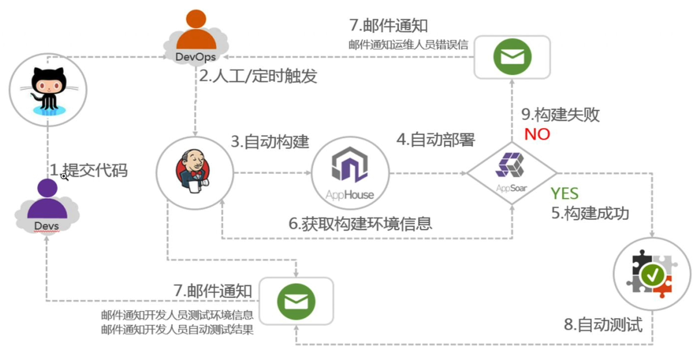
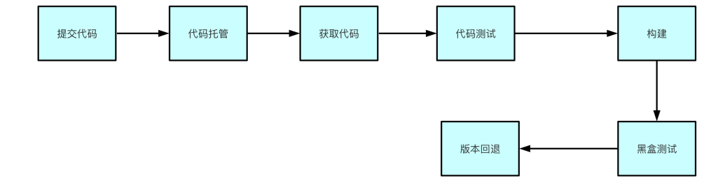
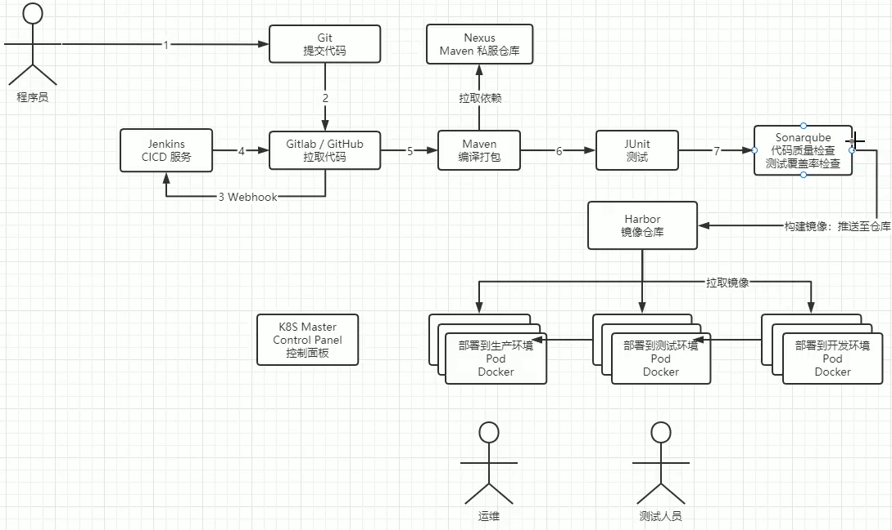

# 介绍

## 结构图

- 整体结构图：



- 代码从提交到进入生产环境整个过程：





# gitlab部署

## 通过配置文件安装

- 编辑配置文件

```yaml
apiVersion: apps/v1
kind: Deployment
metadata:
  name: gitlab
  namespace: gitlab
  labels:
    app: gitlab
spec:
  selector:
    matchLabels:
      app: gitlab
  revisionHistoryLimit: 2
  template:
    metadata:
      labels:
        app: gitlab
    spec:
      containers:
      - name: gitlab
        image: gitlab/gitlab-ce
        imagePullPolicy: IfNotPresent
        ports:
        - containerPort: 443
          name: gitlab443
        - containerPort: 80
          name: gitlab80
        - containerPort: 22
          name: gitlab22
        volumeMounts:
        - name: gitlab-pvc-config
          mountPath: /etc/gitlab
        - name: gitlab-pvc-logs
          mountPath: /var/log/gitlab
        - name: gitlab-pvc-data
          mountPath: /var/opt/gitlab
      volumes:
      - name: gitlab-pvc-config
        persistentVolumeClaim:
          claimName: gitlab-pvc-config
      - name: gitlab-pvc-logs
        persistentVolumeClaim:
          claimName: gitlab-pvc-logs
      - name: gitlab-pvc-data
        persistentVolumeClaim:
          claimName: gitlab-pvc-data
---
apiVersion: v1
kind: Service
metadata:
  name: gitlab
  namespace: gitlab
  labels:
    app: gitlab
spec:
  type: ClusterIP
  ports:
  - port: 443
    targetPort: 443
    name: gitlab443
  - port: 80
    targetPort: 80
    name: gitlab80
  - port: 22
    targetPort: 22
    name: gitlab22
  selector:
    app: gitlab
    
---
apiVersion: networking.k8s.io/v1
kind: Ingress
metadata:
  namespace: gitlab
  name: gitlab-ingress
spec:
  ingressClassName: nginx
  rules:
  - host: gitlab.hsiangya.com
    http:
      paths:
      - path: /
        pathType: Prefix
        backend:
          service:
            name: gitlab
            port:
              number: 9090
              
---

apiVersion: v1
kind: PersistentVolumeClaim
metadata:
  name: gitlab-pvc-config
  namespace: gitlab
  labels:
    app: gitlab
spec:
  accessModes:
    - ReadWriteOnce
  resources:
    requests:
      storage: 2Gi
  storageClassName: local-disk-retain
---
apiVersion: v1
kind: PersistentVolumeClaim
metadata:
  name: gitlab-pvc-logs
  namespace: gitlab
  labels:
    app: gitlab
spec:
  accessModes:
    - ReadWriteOnce
  resources:
    requests:
      storage: 5Gi
  storageClassName: local-disk-retain
---
apiVersion: v1
kind: PersistentVolumeClaim
metadata:
  name: gitlab-pvc-data
  namespace: gitlab
  labels:
    app: gitlab
spec:
  accessModes:
    - ReadWriteOnce
  resources:
    requests:
      storage: 10Gi
  storageClassName: local-disk-retain
---
# 挂载PV
apiVersion: v1
kind: PersistentVolume
metadata:
  name: gitlab-pv-config
  labels:
    app: gitlab
spec:
  capacity:
    storage: 2Gi
  accessModes:
    - ReadWriteOnce
  storageClassName: local-disk-retain
  hostPath:
    path: "/opt/k8s/gitlab/config"
    
---
apiVersion: v1
kind: PersistentVolume
metadata:
  name: gitlab-pv-logs
  labels:
    app: gitlab
spec:
  capacity:
    storage: 5Gi
  accessModes:
    - ReadWriteOnce
  storageClassName: local-disk-retain
  hostPath:
    path: "/opt/k8s/gitlab/logs"
    
---
apiVersion: v1
kind: PersistentVolume
metadata:
  name: gitlab-pv-data
  labels:
    app: gitlab
spec:
  capacity:
    storage: 10Gi
  accessModes:
    - ReadWriteOnce
  storageClassName: local-disk-retain
  hostPath:
    path: "/opt/k8s/gitlab/data"
```

- 获取初始密码：

  

  > 帐号：root
  >
  > 密码：

```bash
# 默认帐号为root
kubectl get pod -n gitlab
kubectl exec -it gitlab-789f974d75-qz6sh -n gitlab -- /bin/bash
cat /etc/gitlab/initial_root_password
```


## 通过helm安装

```bash
# 创建命名空间
kubectl create ns gitlab

# 下载镜像
helm repo add gitlab http://charts.gitlab.io
helm repo update
helm pull stable/gitlab-ce
tar -zxvf gitlab-ce-0.2.3.tgz


# 创建PV目录
export ROOTDIR=/opt/k8s/gitlab
mkdir -p $ROOTDIR/data-postgresql-0-pv
mkdir -p $ROOTDIR/minio-pv
mkdir -p $ROOTDIR/prometheus-server-pv
mkdir -p $ROOTDIR/data-redis-master-0-pv
mkdir -p $ROOTDIR/repo-data-gitaly-0-pv

# 为node打上标签
kubectl label nodes master gitlab=local-pv
```

- 创建PV

```yaml
 apiVersion: v1
kind: PersistentVolume
metadata:
  name: gitlab-postgresql-0-pv
spec:
  accessModes:
    - ReadWriteOnce
  capacity:
    storage: 8Gi
  claimRef:
    apiVersion: v1
    kind: PersistentVolumeClaim
    name: data-gitlab-postgresql-0
    namespace: gitlab
  local:
    path: /opt/k8s/gitlab/data-postgresql-0-pv
  nodeAffinity:
    required:
      nodeSelectorTerms:
        - matchExpressions:
            - key: gitlab
              operator: In
              values:
                - local-pv
  persistentVolumeReclaimPolicy: Retain
  volumeMode: Filesystem

---

apiVersion: v1
kind: PersistentVolume
metadata:
  name: gitlab-minio-pv
spec:
  accessModes:
    - ReadWriteOnce
  capacity:
    storage: 10Gi
  claimRef:
    apiVersion: v1
    kind: PersistentVolumeClaim
    name: minio-pv
    namespace: gitlab
  local:
    path: /opt/k8s/gitlab/minio-pv
  nodeAffinity:
    required:
      nodeSelectorTerms:
        - matchExpressions:
            - key: gitlab
              operator: In
              values:
                - local-pv
  persistentVolumeReclaimPolicy: Retain
  volumeMode: Filesystem
---

apiVersion: v1
kind: PersistentVolume
metadata:
  name: gitlab-prometheus-server-pv
spec:
  accessModes:
    - ReadWriteOnce
  capacity:
    storage: 8Gi
  claimRef:
    apiVersion: v1
    kind: PersistentVolumeClaim
    name: gitlab-prometheus-server
    namespace: gitlab
  local:
    path: /opt/k8s/gitlab/prometheus-server-pv
  nodeAffinity:
    required:
      nodeSelectorTerms:
        - matchExpressions:
            - key: gitlab
              operator: In
              values:
                - local-pv
  persistentVolumeReclaimPolicy: Retain
  volumeMode: Filesystem

---

apiVersion: v1
kind: PersistentVolume
metadata:
  name: gitlab-redis-master-0-pv
spec:
  accessModes:
    - ReadWriteOnce
  capacity:
    storage: 8Gi
  claimRef:
    apiVersion: v1
    kind: PersistentVolumeClaim
    name: gitlab-data-redis-master-0-pv
    namespace: gitlab
  local:
    path: /opt/k8s/gitlab/data-redis-master-0-pv
  nodeAffinity:
    required:
      nodeSelectorTerms:
        - matchExpressions:
            - key: gitlab
              operator: In
              values:
                - local-pv
  persistentVolumeReclaimPolicy: Retain
  volumeMode: Filesystem

---

apiVersion: v1
kind: PersistentVolume
metadata:
  name: gitlab-repo-data-gitaly-0-pv
spec:
  accessModes:
    - ReadWriteOnce
  capacity:
    storage: 50Gi
  claimRef:
    apiVersion: v1
    kind: PersistentVolumeClaim
    name: repo-data-gitaly-0-pv
    namespace: gitlab
  local:
    path: /opt/k8s/gitlab/repo-data-gitaly-0-pv
  nodeAffinity:
    required:
      nodeSelectorTerms:
        - matchExpressions:
            - key: gitlab
              operator: In
              values:
                - local-pv
  persistentVolumeReclaimPolicy: Retain
  volumeMode: Filesystem
```

# Harbor

## 通过helm安装

```bash
# 添加存储仓库
helm repo add harbor https://helm.goharbor.io
helm repo list
helm search repo harbor -l |  grep harbor/harbor  | head  -4

# 拉取harbor
helm pull harbor/harbor --version 1.15.0
tar zxvf harbor-1.15.0.tgz

# 创建一个namespace
kubectl create namespace harbor

# 加载配置
helm show values harbor/harbor > harbor-values.yaml
```

- 编辑storage class

```yaml
apiVersion: storage.k8s.io/v1
kind: StorageClass
metadata:
  name: local-disk
provisioner: kubernetes.io/no-provisioner
volumeBindingMode: WaitForFirstConsumer

# 运行
kubectl apply -f storage-class.yaml
```

- 创建PV

```yaml
apiVersion: v1
kind: PersistentVolume
metadata:
  name: redis-pv
spec:
  capacity:
    storage: 5Gi
  accessModes:
    - ReadWriteOnce
  storageClassName: local-disk
  hostPath:
    path: "/mnt/data/redis"

# 创建
kubectl apply -f harbor-pv.yaml

```

- 构建

```bash
helm install harbor harbor/harbor --namespace harbor -f values.yaml

# 升级
helm upgrade harbor harbor/harbor -f values.yaml -n harbor

# 卸载
helm uninstall harbor -n harbor
```

# SonarQube

- 配置pgsql

```yaml
apiVersion: v1
kind: PersistentVolumeClaim
metadata:
  name: postgres-data
  namespace: sonar
spec:
  accessModes:
    - ReadWriteMany
  storageClassName: "local-disk-retain"
  resources:
    requests:
      storage: 1Gi
---
apiVersion: apps/v1
kind: Deployment
metadata:
  name: postgres-sonar
  namespace: sonar
spec:
  replicas: 1
  selector:
    matchLabels: 
      app: postgres-sonar
  template:
    metadata:
      labels: 
        app: postgres-sonar
    spec:
      containers:
      - name: postgres-sonar
        image: postgres:14.2
        ports:
        - containerPort: 5432
        env:
        - name: POSTGRES_DB
          value: "sonarDB"
        - name: POSTGRES_USER
          value: "sonarUser"
        - name: POSTGRES_PASSWORD
          value: "123456"
        volumeMounts:
          - name: data
            mountPath: /var/lib/postgresql/data
      volumes:
        - name: data
          persistentVolumeClaim:
            claimName: postgres-data
---
apiVersion: v1
kind: Service
metadata:
  name: postgres-sonar
  namespace: sonar
  labels:
    app: postgres-sonar
spec:
  type: NodePort
  ports:
  - name: postgres-sonar
    port: 5432
    protocol: TCP
  selector:
    app: postgres-sonar
```

- 配置sonar

```yaml
apiVersion: v1
kind: PersistentVolumeClaim
metadata:
  name: sonarqube-data
  namespace: sonar
spec:
  accessModes:
    - ReadWriteMany
  storageClassName: "local-disk-retain"
  resources:
    requests:
      storage: 1Gi
---
apiVersion: apps/v1
kind: Deployment
metadata:
  name: sonarqube
  namespace: sonar
  labels:
    app: sonarqube
spec:
  replicas: 1
  selector:
    matchLabels: 
      app: sonarqube
  template:
    metadata:
      labels: 
        app: sonarqube
    spec:
      initContainers:
      - name: init-sysctl
        image: busybox:1.28.4
        command: ["sysctl", "-w", "vm.max_map_count=262144"]
        securityContext:
          privileged: true
      containers:
      - name: sonarqube
        image: sonarqube
        ports:
        - containerPort: 9000
        env:
        - name: SONARQUBE_JDBC_USERNAME
          value: "sonarUser"
        - name: SONARQUBE_JDBC_PASSWORD
          value: "123456"
        - name: SONARQUBE_JDBC_URL
          value: "jdbc:postgresql://postgres-sonar:5432/sonarDB"
        livenessProbe:
          httpGet:
            path: /sessions/new
            port: 9000
          initialDelaySeconds: 30
          periodSeconds: 30
        readinessProbe:
          httpGet:
            path: /sessions/new
            port: 9000
          initialDelaySeconds: 60
          periodSeconds: 30
          failureThreshold: 6
        volumeMounts:
        - mountPath: /opt/sonarqube/conf
          name: data
        - mountPath: /opt/sonarqube/data
          name: data
        - mountPath: /opt/sonarqube/extensions
          name: data
      volumes:
      - name: data
        persistentVolumeClaim:
          claimName: sonarqube-data
---
apiVersion: v1
kind: Service
metadata:
  name: sonarqube
  namespace: sonar
  labels:
    app: sonarqube
spec:
  type: NodePort
  ports:
  - name: sonarqube
    port: 9000
    targetPort: 9000
    protocol: TCP
  selector:
    app: sonarqube

```

- 创建sonar pv

```yaml
apiVersion: v1
kind: PersistentVolume
metadata:
  name: sonarqube-data-pv
spec:
  capacity:
    storage: 1Gi
  volumeMode: Filesystem
  accessModes:
    - ReadWriteMany
  persistentVolumeReclaimPolicy: Retain
  storageClassName: "local-disk-retain"
  local:
    path: /opt/k8s/sonarQube/sonar-data
  nodeAffinity:
    required:
      nodeSelectorTerms:
      - matchExpressions:
        - key: kubernetes.io/hostname
          operator: In
          values:
          - master
```

- 创建sonar pv

```yaml
apiVersion: v1
kind: PersistentVolume
metadata:
  name: postgres-data-pv
spec:
  capacity:
    storage: 1Gi
  volumeMode: Filesystem
  accessModes:
    - ReadWriteMany
  persistentVolumeReclaimPolicy: Retain
  storageClassName: "local-disk-retain"
  local:
    path: /opt/k8s/sonarQube/pgsql-data
  nodeAffinity:
    required:
      nodeSelectorTerms:
      - matchExpressions:
        - key: kubernetes.io/hostname
          operator: In
          values:
          - master


```

- 启动：`kubectl apply -f xxx.yaml xxx.yaml`
- sonar默认帐号密码：`admin admin`

# Jenkins

## 安装

```bash
# 添加仓库
helm repo add jenkins https://charts.jenkins.io
helm repo update

sudo helm search repo jenkins
sudo helm search repo jenkins--versions

# 创建命名空间
kubectl create ns jenkins
helm show values jenkins/jenkins > values.yaml
```

- 编辑jenkins.yaml文件

```yaml
# 编辑PV
apiVersion: v1
kind: PersistentVolume
metadata:
  name: jenkins-pv
spec:
  storageClassName: local-disk-retain # Local PV
  capacity:
    storage: 100Gi
  volumeMode: Filesystem
  accessModes:
    - ReadWriteOnce
  local:
    path: /opt/k8s/jenkins/data
  nodeAffinity:
    required:
      nodeSelectorTerms:
        - matchExpressions:
            - key: kubernetes.io/hostname
              operator: In
              values:
                - master
---
# PVC
apiVersion: v1
kind: PersistentVolumeClaim
metadata:
  name: jenkins-pvc
  namespace: jenkins
spec:
  storageClassName: local
  accessModes:
    - ReadWriteOnce
  resources:
    requests:
      storage: 100Gi
---


# 权限配置
apiVersion: v1
kind: ServiceAccount
metadata:
  name: jenkins
  namespace: jenkins
---
apiVersion: rbac.authorization.k8s.io/v1
kind: ClusterRole
metadata:
  name: jenkins
rules:
  # 对 deployments 和 replicasets 的权限
  - apiGroups: ["apps"]
    resources: ["deployments", "replicasets"]
    verbs: ["create", "delete", "get", "list", "watch", "patch", "update"]
  # 对 ingresses 的权限 (注意将 extensions 改为 networking.k8s.io 对应新的 API 组)
  - apiGroups: ["networking.k8s.io"]
    resources: ["ingresses"]
    verbs: ["create", "delete", "get", "list", "watch", "patch", "update"]
  # 对 services 的权限
  - apiGroups: [""]
    resources: ["services"]
    verbs: ["create", "delete", "get", "list", "watch", "patch", "update"]
  # 对 pods 和 pods 相关操作的权限
  - apiGroups: [""]
    resources: ["pods", "pods/exec", "pods/log", "pods/portforward"]
    verbs: ["create", "delete", "get", "list", "patch", "update", "watch"]
  # 对 events 的权限
  - apiGroups: [""]
    resources: ["events"]
    verbs: ["get", "list", "watch"]
  # 对 secrets 的权限
  - apiGroups: [""]
    resources: ["secrets"]
    verbs: ["get"]
---
apiVersion: rbac.authorization.k8s.io/v1
kind: ClusterRoleBinding
metadata:
  name: jenkins
roleRef:
  apiGroup: rbac.authorization.k8s.io
  kind: ClusterRole
  name: jenkins
subjects:
  - kind: ServiceAccount
    name: jenkins
    namespace: jenkins
    
    
---
# jenkins应用
apiVersion: apps/v1
kind: Deployment
metadata:
  name: jenkins
  namespace: jenkins
spec:
  selector:
    matchLabels:
      app: jenkins
  template:
    metadata:
      labels:
        app: jenkins
    spec:
      serviceAccount: jenkins
      initContainers:
        - name: fix-permissions
          image: busybox
          command: ["sh", "-c", "chown -R 1000:1000 /var/jenkins_home"]
          securityContext:
            privileged: true
          volumeMounts:
            - name: jenkinshome
              mountPath: /var/jenkins_home
      containers:
        - name: jenkins
          image: jenkins/jenkins:lts
          imagePullPolicy: IfNotPresent
          env:
          - name: JAVA_OPTS
            value: -Dhudson.model.DownloadService.noSignatureCheck=true
          ports:
            - containerPort: 8080
              name: web
              protocol: TCP
            - containerPort: 50000
              name: agent
              protocol: TCP
          resources:
            limits:
              cpu: 1500m
              memory: 4096Mi
            requests:
              cpu: 1500m
              memory: 2048Mi
          readinessProbe:
            httpGet:
              path: /login
              port: 8080
            initialDelaySeconds: 60
            timeoutSeconds: 5
            failureThreshold: 12
          volumeMounts:
            - name: jenkinshome
              mountPath: /var/jenkins_home
      volumes:
        - name: jenkinshome
          persistentVolumeClaim:
            claimName: jenkins-pvc
---
apiVersion: v1
kind: Service
metadata:
  name: jenkins
  namespace: jenkins
  labels:
    app: jenkins
spec:
  selector:
    app: jenkins
  ports:
    - name: web
      port: 8080
      targetPort: web
    - name: agent
      port: 50000
      targetPort: agent
---
apiVersion: networking.k8s.io/v1
kind: Ingress
metadata:
  name: jenkins
  namespace: jenkins
spec:
  ingressClassName: nginx
  rules:
  - host: hsiangya.jenkins.com
    http:
      paths:
      - path: /
        pathType: Prefix
        backend:
          service:
            name: jenkins
            port:
              number: 8080
```

- 获取管理员帐号密码

  ```bash
  kubectl exec -it jenkins-5f9f566d9c-mbf9z -n jenkins -- cat /var/jenkins_home/secrets/initialAdminPassword
  ```

- 修改时区：Manage Jenkins-->Script console

  ```bash
  System.setProperty('org.apache.commons.jelly.tags.fmt.timeZone','Asia/Shanghai')
  ```

**安装插件**

> 插件安装速度过慢可更换URL站点：`http://mirror.esuni.jp/jenkins/updates/update-center.json`

- Build Authorization Token
- Gitlab
- SonarQube Scanner
- Node and Label paramter
- Kubernetes

**配置sonarqube**

- name：sonarqube

- server url：`http://sonarqube.sonar:9000`kubernetes集群内可以通过svcName.namespace:port直接访问

- Server authentication token：

  >  访问sonarqube web 点击当前账户--我的帐号---安全-生成令牌，将其添加到jenkins全局凭据中
  >
  > 

**配置kubernetes插件**

- manage Jenkins---> Node--->clouds--->New cloud

  > 1. 名称：kubernetes
  > 2. kubernetes地址：`https://kubernets.default`
  > 3. 勾选禁用https证书检查
  > 4. jenkins地址：`http://jenkins.jenkins:8080`

**配置节点标签：**manage Jenkins---> Node--->设置--->添加标签名

## 配置文件说明

- config.xml：主配置
- jenkins.telemetry.Correlator.xml  
- plugins：插件目录   
- secrets：密码
- users：用户配置信息
- copy_reference_file.log        
- jobs：工作流程目录                    
- secret.key 
- updates     
-  war
- hudson.model.UpdateCenter.xml 
-  nodeMonitors.xml                  
- secret.key.not-so-secret  
- userContent

# Nerdctl

github：`https://developer.aliyun.com/article/1094835`

```bash
# 下载并安装
wget https://github.com/containerd/nerdctl/releases/download/v1.7.6/nerdctl-1.7.6-linux-amd64.tar.gz
tar -zxvf nerdctl-1.7.6-linux-amd64.tar.gz
sudo mv nerdctl /usr/local/bin/
nerdctl --version
```

