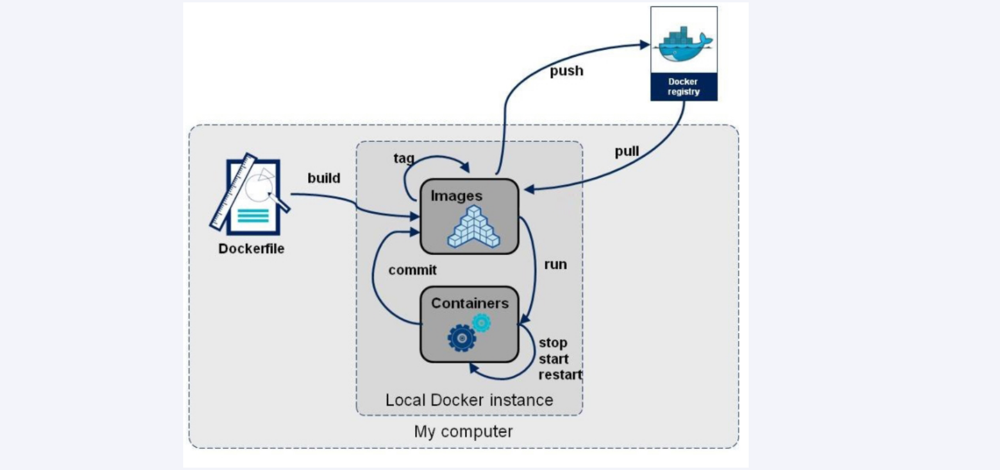
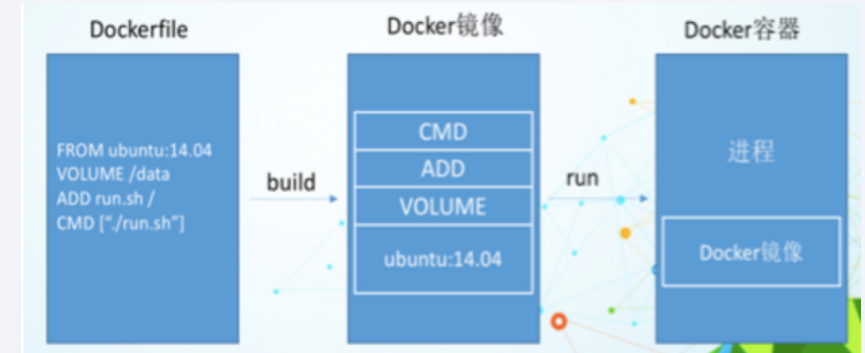

# Docker 安装

## Docker引擎(Engine)升级

需要重视升级操作的每个前置条件，包括确保容器配置了正确的重启策略：在Swarm Mode模式下使用服务时，需要确保正确配置了draining node。 当完成了上述前置条件检查之后，可以通过如下步骤完成升级操作：

1. 停止Docker守护程序
2. 移除旧版本Docker
3. 安装新版本Docker
4. 配置新版本的Docker为开机自启动
5. 确保容器重启成功

**不同版本的Linux在升级Docker的时候，命令可能略有区别**

### Ubuntu升级Docker CE

```bash
# 更新APT包
apt-get update

# 卸载当前DOcker,之前的版本中，Docker引擎的包名可能有多个，这条命令能够确保已安装的Docker包全部被删除
apt-get remove docker docker-engine docker-ce docker.io -y

# 安装新版Docker
wget -q0- https://get.docker.com/ | sh

# 将Docker配置为开机自启动
systemctl enable dockerSynchronizing state of docker.service...Executing /lib/systemd/systemd-sysv-install enable docker$systemctl is-enabled dockerenabled
```

## Docker 存储驱动的选择

每个Docker容器都有一个本地存储空间，用于保存层叠的镜像层（Image Layer)以及挂载的容器文件系统。默认情况下，**容器的所有读写操作都发生在其镜像层上或挂在的文件系统中**，所以存储是每个容器的性能和稳定性不可或缺的一个环节。

以往，本地存储时通过存储驱动（Storage Driver）进行管理的，有时候也被称为Graph Driver或者GraphDriver。虽然存储驱动上层抽象设计中都采用了栈式镜像层存储和写时复制（Copy-on-Write）的设计思想，但是DOcker在Linux底层支持集中不同的存储驱动的具体实现，每一种实现方式都采用不同方法实现了镜像层和写时复制。虽然底层实现的差异不影响用户与Docker之间的交互，但是对Docker的性能和稳定性至关重要。

Linux上,Docker可选择的一些存储驱动包括AUFS(最原始也是最老的)，Overlay2(可能是未来的最佳选择)，Device Maooer，Btrfs和ZFS。

存储驱动的选择是节点级别的。这意味着每个Docker主机只能选择一种存储驱动，而不能为每个容器选择不同的存储驱动。在Linux上，可以通过修改/etc/docker/daemon.json文件来修改存储引擎的配置，修改完成之后需要重启Docker才能够生效，如下展示如何将存储驱动设置为overlay2。

```json
{"storage-driver":"overlay2"}
```

**如果配置所在行不是文件的最后一行，则需要在行尾处增加逗号。如果修改了正在运行Docker主机的存储引擎类型，则现有的镜像和容器在重启之后将不可用，这是因为每种存储驱动在主机上存储镜像层的位置是不同的（通常在/var/lib/docker/ <storage-driver>/...目录下）**修改了存储驱动的类型，Docker就无法找到原有的镜像和容器了。切换到原来的存储驱动，之前的镜像和容器就可以继续使用了。

如果希望在切换存储引擎之后还能够继续使用之前的镜像和容器，需要将镜像保存为Docker格式，上传到某个镜像仓库，修改本地Docker存储引擎并重启，之后从镜像仓库将镜像拉去到本地，最后重启容器。

# 基本概念

## 基本组成

Docker由镜像、容器、仓库(Repository)组成，Docker本身是一个容器运行载体或称之为管理引擎。我们把应用程序和配置依赖打包好形成一个可交付的运行环境，这个打包好的运行环境就是image镜像文件。只有通过这个镜像文件才能生成Docker容器实例

**镜像**

image文件成成的容器实例，本身也是一个文件，称为镜像文件。镜像(image)就是一个只读的模板。镜像可以用来创建Docker容器，一个镜像可以创建很多个容器。它也相当于是一个root文件系统。镜像类似于类对象，容器类似于示例对象。

**容器**

Docker利用容器独立运行一个或一组应用，应用程序或微服务运行在容器里面，容器就类似于一个虚拟化的运行环境，容器时用镜像创建的运行实例。容器时镜像运行时的实例。容器为镜像提供了一个标准和隔离的运行环境，它可以被启动、停止、删除。每个容器都是相互隔离、安全的平台。可以将容器理解为一个简易版的linux环境(root用户权限、进程空间、用户空间、网络空间)和运行在其中的应用程序。

**仓库**

仓库是集中存放镜像文件的场所。仓库分为公开仓库(Public)和私有仓库(Private)两种形式。最大的公开仓库是Docker Hub，存放了数量庞大的镜像供用户下载。

**总结**

Image文件可以看作是容器的模板。Docker根据image文件生成容器的实例。同一个image文件，可以生成多个同时运行的容器实例。

一个容器运行一种服务，当我们需要的时候，就可以通过docker客户端创建一个对应的运行实例，也就是容器。

我们可以把镜像发布到仓库中，需要的时候再从仓库中拉下来就可以了。

## 总架构图


docker是一个C/S模式的架构，后端是一个松耦合架构，模块各司其职。

1. 用户是使用Docker Client与Docker Daemon建立通信，并发送请求给后者。
2. Docker Daemon作为Docker架构中的主体部分，首先提供Server的功能使其可以接受Docker Client的请求；
3. Engine执行Docker内部的一系列工作，每一项工作都是以一个Job的形式的存在。
4. Job的运行过程中，当需要容器镜像时，则从Docker Registry中下载镜像，并通过镜像管理驱动graphdriver将下载镜像以Graph的形式存储；
5. 当需要为Docker创建网络环境时，通过网络管理驱动networkdriver创建并配置Docker容器网络环境；
6. 当需要限制Docker容器运行资源或执行用户指令等操作时，则通过execdriver来完成。
7. libcontainer是一项独立的容器管理包，networkdriver以及execdriver都是通过libcontainer来实现具体对容器进行的操作。

## 各模块组件分析

### Docker Client(发起请求)

1. Docker Client是和Docker Daemon建立通信的客户端。用户使用的可执行文件为docker（类似可执行脚本的命令），docker命令后接参数的形式来实现一个完整的请求命令（例如docker images，docker为命令不可变，images为参数可变）。
2. Docker Client可以通过以下三种方式和Docker Daemon建立通信：tcp://host:port，unix://path_to_socket和fd://socketfd。
3. Docker Client发送容器管理请求后，由Docker Daemon接受并处理请求，当Docker Client接收到返回的请求相应并简单处理后，Docker Client一次完整的生命周期就结束了。[一次完整的请求：发送请求→处理请求→返回结果]，与传统的C/S架构请求流程并无不同。

### Docker Daemon(后台守护进程)


### Docker Server(调度分发请求)


1. Docker Server相当于C/S架构的服务端。功能为接受并调度分发Docker Client发送的请求。接受请求后，Server通过路由与分发调度，找到相应的Handler来执行请求。
2. 在Docker的启动过程中，通过包gorilla/mux，创建了一个mux.Router，提供请求的路由功能。在Golang中，gorilla/mux是一个强大的URL路由器以及调度分发器。该mux.Router中添加了众多的路由项，每一个路由项由HTTP请求方法（PUT、POST、GET或DELETE）、URL、Handler三部分组成。
3. 创建完mux.Router之后，Docker将Server的监听地址以及mux.Router作为参数，创建一个httpSrv=http.Server{}，最终执行httpSrv.Serve()为请求服务。
4. 在Server的服务过程中，Server在listener上接受Docker Client的访问请求，并创建一个全新的goroutine来服务该请求。在goroutine中，首先读取请求内容，然后做解析工作，接着找到相应的路由项，随后调用相应的Handler来处理该请求，最后Handler处理完请求之后回复该请求。

### Engine

1. Engine是Docker架构中的运行引擎，同时也Docker运行的核心模块。它扮演Docker container存储仓库的角色，并且通过执行job的方式来操纵管理这些容器。
2. 在Engine数据结构的设计与实现过程中，有一个handler对象。该handler对象存储的都是关于众多特定job的handler处理访问。举例说明，Engine的handler对象中有一项为：{"create": daemon.ContainerCreate,}，则说明当名为"create"的job在运行时，执行的是daemon.ContainerCreate的handler。

### Job

1. 一个Job可以认为是Docker架构中Engine内部最基本的工作执行单元。Docker可以做的每一项工作，都可以抽象为一个job。例如：在容器内部运行一个进程，这是一个job；创建一个新的容器，这是一个job。Docker Server的运行过程也是一个job，名为serveapi。
2. Job的设计者，把Job设计得与Unix进程相仿。比如说：Job有一个名称，有参数，有环境变量，有标准的输入输出，有错误处理，有返回状态等。

## Docker Registry(镜像注册中心)

1. Docker Registry是一个存储容器镜像的仓库（注册中心），可理解为云端镜像仓库，按repository来分类，docker pull 按照[repository]:[tag]来精确定义一个image。
2. 在Docker的运行过程中，Docker Daemon会与Docker Registry通信，并实现搜索镜像、下载镜像、上传镜像三个功能，这三个功能对应的job名称分别为"search"，"pull" 与 "push"。
3. 可分为公有仓库（docker hub）和私有仓库。

## Graph(docker内部数据库)


### Repository

1. 已下载镜像的保管者（包括下载镜像和dockerfile构建的镜像）。
2. 一个repository表示某类镜像的仓库（例如Ubuntu），同一个repository内的镜像用tag来区分（表示同一类镜像的不同标签或版本）。一个registry包含多个repository，一个repository包含同类型的多个image。
3. 镜像的存储类型有aufs，devicemapper,Btrfs，Vfs等。其中centos系统使用devicemapper的存储类型。
4. 同时在Graph的本地目录中，关于每一个的容器镜像，具体存储的信息有：该容器镜像的元数据，容器镜像的大小信息，以及该容器镜像所代表的具体rootfs。

### GraphDB

1. 已下载容器镜像之间关系的记录者。
2. GraphDB是一个构建在SQLite之上的小型图数据库，实现了节点的命名以及节点之间关联关系的记录

## Driver(执行部分)

Driver是Docker架构中的驱动模块。通过Driver驱动，Docker可以实现对Docker容器执行环境的定制。即Graph负责镜像的存储，Driver负责容器的执行。

### graphdriver


1. graphdriver主要用于完成容器镜像的管理，包括存储与获取。
2. 存储：docker pull下载的镜像由graphdriver存储到本地的指定目录（Graph中）。
3. 获取：docker run（create）用镜像来创建容器的时候由graphdriver到本地Graph中获取镜像。

### networkdriver


1. networkdriver的用途是完成Docker容器网络环境的配置，其中包括

   - Docker启动时为Docker环境创建网桥；
   - Docker容器创建时为其创建专属虚拟网卡设备；
   - Docker容器分配IP、端口并与宿主机做端口映射，设置容器防火墙策略等。

   ### execdriver

   

   1. execdriver作为Docker容器的执行驱动，负责创建容器运行命名空间，负责容器资源使用的统计与限制，负责容器内部进程的真正运行等。
   2. 现在execdriver默认使用native驱动，不依赖于LXC。

   ## libcontainer(函数库)

   

   1. libcontainer是Docker架构中一个使用Go语言设计实现的库，设计初衷是希望该库可以不依靠任何依赖，直接访问内核中与容器相关的API。
   2. Docker可以直接调用libcontainer，而最终操纵容器的namespace、cgroups、apparmor、网络设备以及防火墙规则等。
   3. libcontainer提供了一整套标准的接口来满足上层对容器管理的需求。或者说，libcontainer屏蔽了Docker上层对容器的直接管理。

   ## docker container(服务交付的最终形式)


1. Docker container（Docker容器）是Docker架构中服务交付的最终体现形式。
2. Docker按照用户的需求与指令，订制相应的Docker容器：
3. - 用户通过指定容器镜像，使得Docker容器可以自定义rootfs等文件系统；
   - 用户通过指定计算资源的配额，使得Docker容器使用指定的计算资源；
   - 用户通过配置网络及其安全策略，使得Docker容器拥有独立且安全的网络环境；
   - 用户通过指定运行的命令，使得Docker容器执行指定的工作

# 镜像

## 介绍

### 简介

首先需要从镜像仓库服务中拉取镜像，常见的镜像仓库是Docker Hub,但是也存在其他镜像仓库服务。拉取操作会将镜像下载到本地Docker主机，也可以使用该镜像启动一个或者多个容器。

镜像由多个层组成，每层叠加之后，从外部看来就如一个独立的对象。镜像内部是一个精简的操作系统，同时还包含应用运行所必须的文件和依赖包。因为容器的设计初衷就是快速和小巧，所以镜像通常都比较小。

### 镜像和容器

通常使用`docker container run`和`docker service create`命令从某个镜像启动一个或多个容器，一旦容器从镜像启动后，二者之间就变成了相互依赖的关系，并且在镜像上启动的容器全部停止之前，镜像无法被删除。

容器目的就是运行应用或者服务，这意味着容器的镜像中必须包含应用/服务运行所必须的操作系统和应用文件。但是，容器又追求快速和小巧，这意味着构建镜像的时候通常需要裁剪掉不必要的部分，保持较小的体积。

### 拉取镜像

Docker主机安装之后，本地并没有镜像，Linux Docker主机本地镜像仓库通常位于`/var/lib/docker/<storage-driver>`

### 镜像命名

在拉取镜像的每条命令中，都需要指定所拉取的具体镜像。

### 镜像仓库服务

Docker镜像存储在镜像仓库服务（Image Registry）当中。Docker客户端的镜像仓库服务是可配置的，默认使用Docker Hub

镜像仓库服务包含多个镜像仓库（Image Repository）。同样，一个镜像仓库中可以包含多个镜像。

**官方和非官方镜像仓库**

Docker Hub也分为官方仓库（Official Repository）和非官方仓库（Unofficial Repository）

官方仓库中的镜像是由Docker公司审查的，其中的镜像会及时更新，由高质量的代码构成，这些代码是安全的，有完善的文档和最佳实践。

非官方仓库中的镜像不一定具备官方仓库的有点，非官方仓库也有一些优秀的镜像。

### 镜像命名和标签

只需要给出镜像的名字和标签，就能再官方仓库中定位一个镜像，从官方仓库拉取竟像是，命令格式为`docker image pull <repository>:<tag>`


# Docker 命令

## 容器生命周期

```bash
# 运行容器  --privileged=true 为数据卷开启root权限
# 后台守护进程运行ubuntu容器
docker run -itd --name=u1 ubuntu 

# 连接运行中的容器执行命令
docker exec -it 容器ID /bin/bash # 使用该命令时exit出容器时容器不会停止，使用attach命令exit出容器时容器会停止

```

### Docker run

创建一个新的容器并运行一个命令

语法：`docker run [OPTIONS] IMAGE [COMMAND] [ARG...]`

| OPTIONS                            | 说明                                                   |
| ---------------------------------- | ------------------------------------------------------ |
| -a stdin                           | 指定标准输入输出内容类型，可选STDIN/STDOUT/STDERR      |
| -d                                 | 后台运行容器，并返回容器ID                             |
| -i                                 | 以交互模式运行容器，通常与-t同时使用                   |
| -P                                 | 随机端口映射，容器内部端口随机映射到主机的端口         |
| -p                                 | 指定端口映射，格式为：`宿主机端口：容器端口`           |
| -t                                 | 为容器重新分配一个伪输入终端，通常与-i同时使用         |
| --name=xxxx                        | 为容器指定一个名称                                     |
| --dns 8.8.8.8                      | 指定容器使用的DNS服务器，默认和宿主机一致              |
| --dns-search example.com           | 指定容器DNS搜索域名，默认和宿主一致                    |
| -h "mars"                          | 指定容器的hostname                                     |
| -e username="ritchie"              | 设置环境变量                                           |
| --env-file=[]                      | 从指定文件读入环境变量                                 |
| --cpuset="0-2" or --cpuset="0,1,2" | 绑定容器到指定CPU运行                                  |
| -m                                 | 设置容器使用内存最大值                                 |
| --net="bridge"                     | 指定容器的网络连接类型，支持bridge/host/none/container |
| --link=[]                          | 添加链接到另一个容器                                   |
| --expose=[]                        | 开放一个端口或一组端口                                 |
| --volume,-v                        | 绑定一个卷                                             |

### Docker start/stop/restart

docker start：启动一个或多个已经被停止的容器

docker stop：停止一个运行中的容器

docker restart：重启容器

语法：

`docker start [OPTIONS] CONTAINER [CONTAINER...]`

`docker stop [OPTIONS] CONTAINER [CONTAINER...]`

`docker restart [OPTIONS] CONTAINER [CONTAINER...]`

### Docker kill

杀掉一个运行中的容器

语法：`docker kill [OPTIONS] CONTAINER [CONTAINER...]`

| OPTIONS | 说明               |
| ------- | ------------------ |
| -s      | 向容器发送一个型号 |

### Docker rm

删除一个或多个容器

语法：`docker rm [OPTIONS] CONTAINER [CONTAINER...]`

| OPTIONS | 说明                                    |
| ------- | --------------------------------------- |
| -f      | 通过SIGKILL信号强制删除一个运行中的容器 |
| -l      | 移除容器间的网络连接，而非容器本身      |
| -v      | 删除与容器关联的卷                      |

### Dcoker pause/unpause

docker pause：暂停容器中所有的进程

docker unpause：恢复容器中所有的进程

语法：

`docker pause CONTAINER [CONTAINER...]`

`docker unpause CONTAINER [CONTAINER...]`

### Docker create

创建一个新的容器但不启动

语法：`docker create [OPTIONS] IMAGE [COMMAND] [ARG...]`

### Docker exec

在运行的容器中执行命令

语法：`docker exec [OPTIONS] CONTAINER COMMAND [ARG...]`

| OPTIONS | 说明                        |
| ------- | --------------------------- |
| -d      | 分离模式，在后台运行        |
| -i      | 即使没有附加也保持STDIN打开 |
| -t      | 分配一个伪终端              |

## 容器操作

```bash
# 获取容器/的元数据
docker inspect 容器名
```

### Docker ps

列出容器

语法：`docker ps [OPTIONS]`

| OPTIONS    | 说明                         |
| ---------- | ---------------------------- |
| -a         | 显示出所有容器，包括未运行的 |
| -f         | 根据条件过滤显示的内容       |
| --format   | 指定返回值的模板文件         |
| -l         | 显示最近创建的容器           |
| -n         | 列出最近创建的n个容器        |
| --no-trunc | 不截断输出                   |
| -q         | 静默模式，只显示容器编号     |
| -s         | 显示总的文件大小             |

### Docker inspect

获取容器/镜像的元数据

语法：`docker inspect [OPTIONS] NAME|ID [NAME|ID...]`

| OPTIONS | 说明                 |
| ------- | -------------------- |
| -f      | 指定返回值的模板文件 |
| -s      | 显示总的文件大小     |
| --type  | 为指定类型返回JSON   |

### Docker top

查看容器中运行的进程信息，支持ps命令参数

语法：`docker top [OPTIONS] CONTAINER [ps OPTIONS]`

容器运行时不一定有/bin/bash终端来交互运行top命令，而且容器还不一定有top命令，可以使用docker top来实现查看container中正在运行的进程 。

### Docker attach

连接正在运行中的容器

语法：`docker attach [OPTIONS] CONTAINER`

要attach上去的容器必须正在运行，可以同时连接上同一个container来共享屏幕（与screen命令的attach类似）。

### Docker events

从服务器获取实时事件

语法：`docker events [OPTIONS]`

| OPTIONS | 说明                         |
| ------- | ---------------------------- |
| -f      | 根据条件过滤事件             |
| --since | 从指定的时间戳后显示所有事件 |
| --until | 流水时间显示到指定的时间为止 |

### Docker wait

阻塞运行直到容器停止，然后打印出他的退出代码

语法：`docker wait [OPTIONS] CONTAINER [CONTAINER...]`

### Docker export

将文件系统作为一个tar归档文件导出STDOUT

语法：`docker export [OPTIONS] CONTAINER`

| OPTIONS | 说明               |
| ------- | ------------------ |
| -o      | 将输入内容写到文件 |

### Docker port

列出指定的容器的端口映射，或者查找将PRIVATE_PORT NAT到面向公众的端口

语法：`docker port [OPTIONS] CONTAINER [PRIVATE_PORT[/PROTO]]`

### Docker stats

显示容器资源的使用情况，包括：CPU，内存，网络I/O等

语法：`docker stats [OPTIONS] [CONTAINER...]`

| OPTIONS     | 说明                                   |
| ----------- | -------------------------------------- |
| -all,-a     | 显示所有的容器，包括未运行的容器       |
| --format    | 指定返回值的模板文件                   |
| --no-stream | 展示当前状态就直接退出了，不再实时更新 |
| --no-trunc  | 不截断输出                             |

## 容器rootfs命令

### 汇总

```bash

```

### Docker commit

从容器创建一个新的镜像

语法：`docker commit [OPTIONS] CONTAINER [REPOSITORY[:TAG]]`

| OPTIONS | 说明                         |
| ------- | ---------------------------- |
| -a      | 提交的镜像作者               |
| -c      | 使用Dockerfile指令来创建镜像 |
| -m      | 提交时的文字说明             |
| -p      | 在commit时，将容器停止       |

### Docker cp

容器与主机之间的数据拷贝

语法：

- `docker cp [OPTIONS] CONTAINER:SRC_PATH DEST_PATH|-`

- `docker cp [OPTIONS] SRC_PATH|- CONTAINER:DEST_PATH`

| OPTIONS | 说明               |
| ------- | ------------------ |
| -L      | 保持源目标中的链接 |

### Docker diff

检查容器里文件结构的更改

语法：`docker diff [OPTIONS] CONTAINER`


## 镜像拉取操作

```bash
# 登陆/退出到一个Docker镜像仓库，如果未指定镜像仓库地址，默认为官方仓库 Docker Hub
docker login [OPTIONS] [SERVER]
docker logout [OPTIONS] [SERVER]
	-u :登陆的用户名
	-p :登陆的密码
	
docker login -u 用户名 -p 密码
docker logout

# 从镜像仓库中拉取或者更新指定镜像
docker pull [OPTIONS] NAME[:TAG|@DIGEST]
	-a :拉取所有 tagged 镜像
	--disable-content-trust :忽略镜像的校验,默认开启
docker pull 镜像名称  # 拉取镜像

# 将本地的镜像上传到镜像仓库,要先登陆到镜像仓库
docker push [OPTIONS] NAME[:TAG]
	--disable-content-trust :忽略镜像的校验,默认开启
docker push xxxx:v1

# 从Docker Hub查找镜像
docker search [OPTIONS] TERM
	--automated :只列出 automated build类型的镜像；
	--no-trunc :显示完整的镜像描述；
	-f <过滤条件>:列出收藏数不小于指定值的镜像。
docker search -f stars=10 ubuntu
```

## 本地镜像管理


- Repository：镜像的仓库源

- Tag：镜像的标签版本号

  > 同一个仓库源可以有多个TAG，代表这个仓库得不同个版本，同一个镜像源个可以有多个tag版本号

- Image ID：镜像ID

- Created：镜像撞见时间

- Size：镜像大小

### 汇总

```bash
# 查看本地镜像
docker images 

# 删除镜像
docker rmi xxxx(名称或Tag)

# 标记本地镜像，将其归入某一仓库
docker tag 镜像名称 标记名称

# 使用Dockerfile创建镜像
docker build

# 查看指定镜像的创建历史
docker history 镜像名称

# 将指定镜像保存为tar归档文件
docker save [OPTIONS] IMAGE [IMAGE...]

# 导入使用docker save 命令导出的镜像
docker load [OPTIONS]

# 从归档文件中创建镜像
docker import [OPTIONS] file|URL|- [REPOSITORY[:TAG]]

# hub上查找镜像
docker search 镜像名称

# 查看镜像/容器/数据卷所占的空间
docker system df 
```

### Docker images

语法：`docker images [OPTIONS] [REPOSITORY[:TAG]]`

| OPTION     | 说明                                                         |
| ---------- | ------------------------------------------------------------ |
| -a         | 列出本地所有的镜像（含中间映像层，默认情况下，过滤掉中间映像层）； |
| --digests  | 显示镜像的摘要信息                                           |
| -f         | 显示满足条件得镜像                                           |
| --format   | 指定返回值的模板文件夹                                       |
| --no-trunc | 显示完整镜像信息                                             |
| -q         | 只显示镜像ID                                                 |

### Docker rmi

语法：`docker rmi [OPTIONS] IMAGE [IMAGE...]`

| OPTION      | 说明                             |
| ----------- | -------------------------------- |
| -f          | 强制删除                         |
| --no--prune | 不移除该镜像的过程镜像，默认移除 |

### Docker image prune

删除未使用的镜像，如果指定了`-a`，还将删除任何容器未引用的所有镜像

语法：`docker image prune [OPTIONS]`

| 参数        | 说明                           |
| ----------- | ------------------------------ |
| --all, -a   | 显示所有映像(默认隐藏中间映像) |
| --force, -f | 不要提示确认                   |

### Docker tag

语法：`docker tag [OPTIONS] IMAGE[:TAG] [REGISTRYHOST/][USERNAME/]NAME[:TAG]`

### Docker build

使用Dockerfile创建镜像

语法：`docker build [OPTIONS] PATH | URL | `

| OPTION                  | 说明                                                         |
| ----------------------- | ------------------------------------------------------------ |
| -build-arg=[]           | 设置镜像创建时的变量                                         |
| --cpu-shares            | 设置 cpu 使用权重                                            |
| --cpu-period            | 限制 CPU CFS周期                                             |
| --cpu-quota             | 限制 CPU CFS配额                                             |
| --cpuset-cpus           | 指定使用的CPU id                                             |
| --cpuset-mems           | 指定使用的内存 id                                            |
| --disable-content-trust | 忽略校验，默认开启                                           |
| -f                      | 指定要使用的Dockerfile路径                                   |
| --force-rm              | 设置镜像过程中删除中间容器                                   |
| --isolation             | 使用容器隔离技术                                             |
| --label=[]              | 设置镜像使用的元数据                                         |
| -m                      | 设置内存最大值                                               |
| --memory-swap           | 设置Swap的最大值为内存+swap，"-1"表示不限swap                |
| --no-cache              | 创建镜像的过程不使用缓存                                     |
| --pull                  | 尝试去更新镜像的新版本                                       |
| --quiet, -q             | 安静模式，成功后只输出镜像 ID                                |
| --rm                    | 设置镜像成功后删除中间容器                                   |
| --shm-size              | 设置/dev/shm的大小，默认值是64M                              |
| --ulimit                | Ulimit配置                                                   |
| --squash                | 将 Dockerfile 中所有的操作压缩为一层                         |
| --tag, -t               | 镜像的名字及标签，通常 name:tag 或者 name 格式；可以在一次构建中为一个镜像设置多个标签 |
| --network               | 默认 default。在构建期间设置RUN指令的网络模式                |

### Docker history

查看指定镜像的创建历史

语法：`docker history [OPTIONS] IMAGE`

| OPTIONS     | 说明                                       |
| ----------- | ------------------------------------------ |
| -H          | 以可读的格式打印镜像大小和日期，默认为true |
| --no--trunc | 显示完整的提交记录                         |
| -q          | 仅列出提交记录ID                           |

### Docker save

将指定镜像保存成tar归档文件

语法：`docker save [OPTIONS] IMAGE [IMAGE...]`

| OPTIONS | 说明       |
| ------- | ---------- |
| -o      | 输出到文件 |

### Docker load

导入docker save 命令导出的镜像

语法：`docker load [OPTIONS]`

| OPTIONS    | 说明                      |
| ---------- | ------------------------- |
| --input,-i | 指定导入的文件，代替STDIN |
| --quiet,-q | 精简输出信息              |

### Docker import

从归档文件中创建镜像

语法：`docker import [OPTIONS] file|URL|- [REPOSITORY[:TAG]]`

| OPTIONS | 说明                   |
| ------- | ---------------------- |
| -c      | 应用docker指令创建镜像 |
| -m      | 提交时的说明文字       |

## Info/Version

### Docker info

显示DOcker系统信息，包括镜像和容器数

语法：`docker info [OPTIONS]`

### Docker version

显示Docker版本信息

语法：`docker version [OPTIONS]`

| OPTIONS | 说明                 |
| ------- | -------------------- |
| -f      | 指定返回值的模板文件 |

## 卷

### 汇总

```bash
# 创建卷
docker volume create 卷名称

# 查看所有卷
docker volume ls

# 查看指定卷的详细信息
docker volume inspect 卷名称

# 删除未装入到某个容器或者服务的所有卷
docker volume prune

# 删除指定卷，不能删除正在被容器或者服务使用的卷
docker volume rm 卷名称

# 挂在数据卷，容器目录映射到宿主机目录
docker run -it --privileged=true -v /宿主机绝对路径目录:/容器目录 镜像名 # 双向可读写
docker run -it --privileged=true -v /宿主机绝对路径目录:/容器目录 镜像名:ro 镜像名 # 容器内的数据readonly,只能读取宿主机同步的数据。

# 运行容器，继承其他容器卷的映射规则
docker run -it --privileged=true --volumes- from 继承的容器 镜像名
```

## 日志

### Docker logs

获取容器的日志

语法：`docker logs [OPTIONS] CONTAINER`

| OPTIONS | 说明                       |
| ------- | -------------------------- |
| -f      | 跟踪日志输出               |
| --since | 显示某个时间开始的所有日志 |
| -t      | 显示时间戳                 |
| --tail  | 仅列出最新N条容器日志      |


# 卷与持久化数据

## 简介

每个Docker容器都有自己的非持久化存储，非持久化存储自动创建，从属于容器，生命周期与容器相同。这意味着删除容器也会删除全部非持久化数据。如果希望自己的容器数据保留下来（持久化），则需要将数据存储在卷上。卷与容器时解耦的，从而可以独立创建并管理卷，并且卷与任意容器生命周期绑定。最终效果即用户可以删除一个关联了卷的容器，但是卷并不会被删除。

## 持久与非持久数据

### 容器与非持久数据

容器擅长无状态和非持久化事务。每个容器都被自动分配了本地存储。默认情况下，这是容器全部文件和文件系统保存的地方。如本地存储、GraphDriver存储预计SnapShotter存储。

非持久存储属于容器的一部分，丙炔与容器的生命周期一致——容器创建时会创建非持久存储，同时该存储也会随容器的删除而删除。在Linux系统中，该存储的目录在`/var/lib/docker/<storage-driver>/`之下，是容器的一部分。

**注意**：如果在生产环境中使用Linux运行Docker，需要确认当前存储驱动（GraphDriver）与当前Linux版本是否相符。下面列举了一些指导建议：

| 系统                    | 驱动说明                                                     |
| ----------------------- | ------------------------------------------------------------ |
| RedHat Enterprise Linux | Docker 17.06或者更高版本使用Overlay2驱动<br />更早的版本使用Device Mapper驱动。<br />适用Oracle Linux以及其他Red Hat相关发行版 |
| Ubuntu                  | 适用Overlay2或者AUFS驱动。<br />Linux4.x或更高版本的内核建议适用Overkay2<br />SUSE LINUX Enterprise Server适用Btrfs存储驱动 |

随着时间的发展，Overlay2驱动正在逐渐流行。

### 容器与持久化数据

容器中持久化数据的方式推荐采用卷。用户创建卷，然后创建容器，接着将卷挂在到容器上。卷会挂在到容器文件系统的某个目录之上，任何写道该目录下的内容都会写道卷中。即使容器被删除，卷与其上面的数据任然存在。

#### 创建和管理容器卷

Docker中卷属于一等公民。这意味着卷在API中拥有一席之地，并且有独立的docker volume子命令。

使用`docker volume create myvol`命令创建名为myvol的新卷默认情况下，Docker创建新卷时采用内置的local驱动。恰如其名，本地卷只能被所在节点的容器使用。使用-d参数可以指定不同的驱动。第三方驱动可以通过插件方式接入。这些驱动提供了高级存储特性，并为Docker集成了外部存储系统。下图展示的是外部存储系统被用作卷存储。驱动继承了外部存储系统到DOcker环境当中，同时能使用其高级特性


**块存储**

相对性能更高，适用于对小块数据的随机访问负载。目前支持Docker卷插件的块存储例子包括HPE 3PAR、Amazon EBS以及OpenStack块存储服务（Cinder）。

**文件存储**

括NFS和SMB协议的系统，同样在高性能场景下表现优异。支持Docker卷插件的文件存储系统包括NetApp FAS、Azure文件存储以及Amazon EFS。

**对象存储**

适用于较大且长期存储的、很少变更的二进制数据存储。通常对象存储是根据内容寻址，并且性能较低。支持Docker卷驱动的例子包括Amazon S3、Ceph以及Minio。

可以通过`docker volume ls`命令进行查看，还可以使用`docker volume inspect 卷名称`命令查看详情。


上述图片中Driver和Scope都是local，意味着卷默认使用local驱动创建，只能用于当前Docker主机上的容器。Mountpoint属性说明卷位于Docker主机上的位置，这意味着可以在Docker主机文件系统中查看卷，甚至在Docker主机中对其进行读取数据或者写入数据操作。

**删除卷**

- `docker volume prune`：会删除未装入到某个容器或者服务的所有卷，所以谨慎使用！
- `docker volume rm`：许删除指定卷。两种删除命令都不能删除正在被容器或者服务使用的卷。

#### 卷在容器和服务中使用

基于某个没有卷的系统，使用下面命令创建一个独立容器，并挂在一个卷

```bash
docker container run -dit --name voltainer \
--mount source=卷名称,target=/vol \
容器名称

```

如果指定了已经存在的卷，Docker会使用该卷。如果指定的卷不存在，Docker会创建一个卷。尽管容器和卷各自拥有独立的生命周期，Docker也不允许删除正在被容器使用的卷。

## 命令

### 汇总

```bash
# 创建卷
docker volume create 卷名称

# 查看所有卷
docker volume ls

# 查看指定卷的详细信息
docker volume inspect 卷名称

# 删除未装入到某个容器或者服务的所有卷
docker volume prune

# 删除指定卷，不能删除正在被容器或者服务使用的卷
docker volume rm 卷名称

# 挂在数据卷，容器目录映射到宿主机目录
docker run -it --privileged=true -v /宿主机绝对路径目录:/容器目录 镜像名 # 双向可读写
docker run -it --privileged=true -v /宿主机绝对路径目录:/容器目录 镜像名:ro 镜像名 # 容器内的数据readonly,只能读取宿主机同步的数据。

# 运行容器，继承其他容器卷的映射规则
docker run -it --privileged=true --volumes- from 继承的容器 镜像名
```

# Docker网络

## 简介

Docker在容器内部运行应用，这些应用之间的交互依赖于大量不同的网络，这意味着Docker需要强大的网络功能。docker对于容器之间、容器与外部网络和VLAN之间的连接均有相应的解决方案。后者对于那些需要跟外部系统（如虚拟机和物理机）的服务打交道的容器化应用来说至关重要。

为了实现开箱即用的效果，Docker封装了一系列本地驱动，覆盖了大部分常见的网络需求。其中包括单机桥接网络（Single-Host Bridge Network）、多机覆盖网络（Multi-Host Overlay），并且支持接入现有VLAN。Docker生态系统中的合作伙伴通过提供驱动的方式，进一步拓展了Docker的网络功能。

在顶层设计中，Docker网络架构由3个主要部分构成：CNM、Libnetwork和驱动。CNM是设计标准。在CNM中，规定了Docker网络架构的基础组成要素。Libnetwork是CNM的具体实现，并且被Docker采用Libnetwork通过Go语言编写，并实现了CNM中列举的核心组件。驱动通过实现特定网络拓扑的方式来拓展该模型的能力。

- 容器间的互联和通信以及端口映射
- 容器IP变动时候可以通过服务名称直接网络通信而不受影响

## 网络模式

网络模式：

- bridge模式：使用`--network bridge`指定，默认使用docker0
- host模式：使用`--network host`指定
- none模式：使用`--network none`指定
- container模式：使用`--network container:NAME或容器ID`指定

使用`docker inspect 容器名称或ID`可以查看当前容器的网络信息如上图中的ubuntu实例使用的时桥接网络，当容器停止运行再重新启动时，IPAdress可能会发生改变。

### Bridge

Docker 服务默认会创建一个 docker0 网桥（其上有一个 docker0 内部接口），该桥接网络的名称为docker0，它在内核层连通了其他的物理或虚拟网卡，这就将所有容器和本地主机都放到同一个物理网络。Docker 默认指定了 docker0 接口 的 IP 地址和子网掩码，让主机和容器之间可以通过网桥相互通信。

Docker使用Linux桥接，在宿主机虚拟一个Docker容器网桥(docker0)，Docker启动一个容器时会根据Docker网桥的网段分配给容器一个IP地址，称为Container-IP，同时Docker网桥是每个容器的默认网关。因为在同一宿主机内的容器都接入同一个网桥，这样容器之间就能够通过容器的Container-IP直接通信。

docker run 的时候，没有指定network的话默认使用的网桥模式就是bridge，使用的就是docker0。在宿主机ifconfig,就可以看到docker0和自己create的network(后面讲)eth0，eth1，eth2……代表网卡一，网卡二，网卡三……，lo代表127.0.0.1，即localhost，inet addr用来表示网卡的IP地址

网桥docker0创建一对对等虚拟设备接口一个叫veth，另一个叫eth0，成对匹配。

- 整个宿主机的网桥模式都是docker0，类似一个交换机有一堆接口，每个接口叫veth，在本地主机和容器内分别创建一个虚拟接口，并让他们彼此联通（这样一对接口叫veth pair）；
- 每个容器实例内部也有一块网卡，每个接口叫eth0；
- docker0上面的每个veth匹配某个容器实例内部的eth0，两两配对，一一匹配。

通过上述，将宿主机上的所有容器都连接到这个内部网络上，两个容器在同一个网络下,会从这个网关下各自拿到分配的ip，此时两个容器的网络是互通的。

如上图，宿主机中的veth与容器中的eth0相互对应

### host

直接使用宿主机的 IP 地址与外界进行通信，不再需要额外进行NAT 转换。

容器将不会获得一个独立的Network Namespace， 而是和宿主机共用一个Network Namespace。容器将不会虚拟出自己的网卡而是使用宿主机的IP和端口。没有端口映射，如何访问启动？

> 此时容器的IP借用主机的，所以容器共享宿主机网络IP，这样的好处是外部主机与容器可以直接通信。

### None

在none模式下，并不为Docker容器进行任何网络配置。 也就是说，这个Docker容器没有网卡、IP、路由等信息，只有一个lo，需要我们自己为Docker容器添加网卡、配置IP等。

禁用网络功能，只有lo标识（就是127.0.0.1表示本地回环）

### Container

container⽹络模式 

新建的容器和已经存在的一个容器共享一个网络ip配置而不是和宿主机共享。新创建的容器不会创建自己的网卡，配置自己的IP，而是和一个指定的容器共享IP、端口范围等。同样，两个容器除了网络方面，其他的如文件系统、进程列表等还是隔离的。

### 自定义网络

自定义桥接网络，自定义网络默认使用桥接网络bridge,使用`docker network create 自定义网络名称`可以创建自定义网络

新建容器时加上自定义网络即可，如下图，创建两个ubuntu实例，使用自定义网络

自定义网络后进入各自容器实例内部，可以按服务名直接ping通对方容器

**自定义网络本身就维护好了主机名和IP的对应关系，IP和容器名称都能ping通**

## 命令汇总

```bash
# 查看网络模式
docker network ls

# 查看网络数据源
docker network inspect xxx网络名称

# 删除网络
docker network rm xxx网络名称

#  删除Docker主机上全部未使用的网络
docker network prune xxx

# 创建自定义网络
docker network create

# bridge 网络模式需要指定端口，host不需要指定端口
docker run -d -p xxxx:xxxx 镜像ID # 默认bridge模式
docker run -d --network host 镜像ID
docker run -d --network none 镜像ID
docker run -d --network container:共享的容器 镜像ID


# 安装ip addr指定
sudo apt install iproute2

# 安装ping指令
apt-get update
apt-get install inetutils-ping
```


# Dockerfile

##  简介

### 概述

Dockerfile是用来构建Docker镜像的文本文件，是由一条条构建镜像所需的指令和参数构成的脚本。



需要定义一个Dockerfile，Dockerfile定义了进程需要的一切东西。Dockerfile涉及的内容包括执行代码或者是文件、环境变量、依赖包、运行时环境、动态链接库、操作系统的发行版、服务进程和内核进程(当应用进程需要和系统服务和内核进程打交道，这时需要考虑如何设计namespace的权限控制)等等;



Docker镜像，在用Dockerfile定义一个文件之后，docker build时会产生一个Docker镜像，当运行 Docker镜像时会真正开始提供服务;

**Dockerfile使用流程：**

1. 编写Dockerfile文件
2. dockerbuild命令构建镜像
3. docker run依镜像运行容器实例

### Dockderfile指令规则

- 每条保留字指令都必须为大写字母且后面要跟随至少一个参数
- 指令按照从上到下顺序执行
- #表示注释
- 每条指令都会创建一个新的镜像层并对镜像进行提交

### Dockerfile执行流程

1. docker从基础镜像运行一个容器
2. 执行一条指令对容器做出修改
3. 执行类似docker commit的操作提交一个新的镜像层
4. docker再基于刚提交的镜像运行一个新的容器
5. 执行dockerfile中的下一条指令知道所有指令都执行完成


## 保留字指令

### 总览

| 保留字     | 说明                                                         |
| ---------- | ------------------------------------------------------------ |
| FROM       | 基础镜像，指定一个已经存在的镜像作为模板，第一条指令必须是FROM |
| MAINTAINER | 镜像维护者的姓名和邮箱地址                                   |
| RUN        | 容器构建时需要运行的命令（在docker build时运行）,两种格式：<br />- shell格式：等同于在终端操作的shell命令<br />- exec格式： |
| EXPOSE     | 当前容器对外暴露出的端口                                     |
| WORKDIR    | 指定在创建容器后，终端默认登录进的工作目录（目录落脚点）     |
| USER       | 指定该镜像以什么样的用户去执行，默认root                     |
| ENV        | 用来在构建镜像过程中设置环境变量，这个环境变量可以在后续的任何RUN指令中使用，这就如同在命令前面指定了环境变量前缀一样； |
| ADD        | 也可以在其它指令中直接使用这些环境变量，将宿主机目录下的文件拷贝进镜像且会自动处理URL和解压tar压缩包 |
| COPY       | 类似ADD,拷贝文件和目录到镜像中<br />将从构建上下文目录中<源路径>的文明考吗/目录赋值到新一层镜像内的<目标路径位置> |
| VOLUME     | 容器数据卷，用于保存和持久化数据工作                         |
| CMD        | 指定容器启动后要干的事情，Dockerfile中可以有多个CMD指令，但只有最后一个生效，CMD会被docker run之后的参数替换。<br />与RUN指令相似也支持shell格式与exec格式，CMD是在docker run时运行，RUN时在docker build时运行。 |
| ENTRYPOINT | 指定一个容器启动时要运行的命令，类似于CMD指令，但是ENTRYPOINT不会被docker run后面的命令覆盖，而且这些命令行参数会被当做参数送给ENTRPOINT指令指定的程序<br />优点：在执行docker run时候可以指定ENTRYPOINT运行所需的参数。<br />如果Dockerfile中存在多个ENTRYPOINT指令，仅最后一个生效 |
| ONBUILD    | 当构建一个被继承的`Dockerfile`时运行命令，父镜像在被子继承后，父镜像的`onbuild`被触发。 |

```dockerfile
FROM ubuntu  # 继承自ubuntu镜像
MAINTAINER hsiangya<hsiangyatang@gmail.com>

ENV MYPATH /usr/local # 设置环境变量
WORKDIR $MYPATH # 创建容器后，终端默认工作路径

RUN apt-get update	# 容器构建时需要运行的命令
RUN apt-get upgrade
RUN apt-get install net-tools

EXPOSE 80

CMD echo $MYPATH
CMD echo "install net-tools into ubuntu success!"
CMD /bin/bash # 执行完后运行/bin/bash

```

### COPY/ADD

将宿主机目录或文件拷贝到镜像中与，ADD命令会将宿主机目录下的文件拷贝进镜像且会自动处理URL和解压tar压缩包

- src:源文件或路径
- dest：目标路径(如果路劲不存在，会自动创建)

```dockerfile
# COPY/ADD，
COPY src dest  # 方式一，
COPY ["src"，"dest"] # 方式二

# RUN 
RUN <命令行命令> # shell格式
RUN ["可执行文件"，"参数1","参数2"] # exec格式
```

1. ADD 命令和 COPY 命令在复制文件时行为一致
2. 使用 * 作为 COPY/ADD 命令的源时候表示的是 ./*
3. COPY/ADD 命令的源如果是文件夹，复制的是文件夹的内容而不是其本身

### RUN

- shell格式：`RUN <命令行命令>`
- exec格式：`RUN ["可执行文件"，"参数1","参数2"]`

```bash
RUN ["./test.php","dev","offine"] # 等价于RUN ./test.php dev offine
```

### CMD

CMD与RUN的区别：

- CMD是在docker run时运行
- RUN是在docker build时运行

```dockerfile
CMD ["catalina.sh","run"] # 等价于容器运行后执行run catalina.sh 
```

### ENTRYPOINT

指定一个容器启动时要执行的命令，类似于CMD命令，但是ENTRYPOINT不会被docker run后面的命令覆盖，而这些命令行参数会被当做参数送给ENTRYPOINT指令指定的程序CMD的含义发生了变化，他两个组合会变成`<ENTRYPOINT> "<CMD>"`

- 格式：`ENTRYPOINT` ["executeable","param1","param2",....]

```SHELL
FROM nginx # 继承自nginx

ENTRYPOINT ["nginx","-c"] # 定参
CMD ["/etc/nginx/nginx.conf"] # 变参

# 等价于 niginx -c /etc/nginx/nginx.conf
```

# Docker-compose容器编排

## 简介

Compose 是 Docker 公司推出的一个工具软件，可以管理多个 Docker 容器组成一个应用。你需要定义一个 YAML 格式的配置文件docker-compose.yml，写好多个容器之间的调用关系。然后，只要一个命令，就能同时启动/关闭这些容器，负责实现对Docker的容器集群的快速编排

docker建议我们每一个容器中只运行一个服务,因为docker容器本身占用资源极少,所以最好是将每个服务单独的分割开来但是这样我们又面临了一个问题？如果我需要同时部署好多个服务,难道要每个服务单独写Dockerfile然后在构建镜像,构建容器,这样累都累死了,所以docker官方给我们提供了docker-compose多服务部署的工具。例如要实现一个Web微服务项目，除了Web服务容器本身，往往还需要再加上后端的数据库mysql服务容器，redis服务器，注册中心eureka，甚至还包括负载均衡容器等等。。。。。。

 Compose允许用户通过一个单独的docker-compose.yml模板文件（YAML 格式）来定义一组相关联的应用容器为一个项目（project）可以很容易地用一个配置文件定义一个多容器的应用，然后使用一条指令安装这个应用的所有依赖，完成构建。Docker-Compose 解决了容器与容器之间如何管理编排的问题。

## 基本步骤

### 安装

```bash
# 安装
curl -SL "https://github.com/docker/compose/releases/download/2.17.2/docker-compose-$(uname -s)-$(uname -m)" -o /usr/local/bin/docker-compose

# 授权
chmod +x /usr/local/bin/docker-compose

# 查看版本
docker-compose --version

# 卸载
sudo rm /usr/local/bin/docker-compose
```

### 核心概念

- 一个文件：docker-compose.yml
- 两个要素：
  - 服务(service)：一个个应用实例，微服务，mysql容器，redis容器等。
  - 工程(project)：由一组关联的应用容器组成的一个完整业务单元，在docker-compose.yml文件种定义。

### 使用步骤

1. 编写Dockerfile定义各个微服务应用并构建出对应的镜像文件
2. 使用docker-compose.yml定义一个完整业务单元，安排好整体应用种的各个容器服务。
3. 执行docker-compose up命令来启动并运行整个应用程序，完成一键部署上线。

## 常用命令

```bash
# 查看帮助
docker-compose -h

# 启动所有docker-compose服务
docker-compose up
docker-compose up -d # 后台运行

# 停止并删除容器、网络、卷、镜像
docker-compose down

# 进入容器实例内部
docker-compose exec yml中的服务ID

# 展示当前docker-compose编排过的运行的所有容器
docker-compose ps

# 展示当前docker-compose编排过的容器进程
docker-compose top

# 查看容器输出的日志
docker-compose logs yml里面的服务id

# 检查配置
docker-compose config
docker-compose config -q # 检查配置，有问题才输出

# 重启/启动/停止服务
docker-compose restart
docker-compose start
docker-compose stop
```

## 部署实例

将代码clone到服务器的文件中

```bash
# 进入文件夹
cd Flask

# 克隆代码
git clone https://github.com/Hsiangya/Flask.git
```

创建网桥

```bash

```


编写Flask容器Dockerfile

```dockerfile
# 继承自miniconda3环境
FROM continuumio/miniconda3:latest
MAINTAINER hsiangya<hsiangyatang@gmail.com>

# 设置进入终端口的工作路径变量.
ENV MYPATH /usr/local
WORKDIR $MYPATH

# 复制代码到ubuntu实例中
COPY /Flask ./Flask

# 容器构建时需要运行的命令
RUN apt-get update	
RUN apt-get install net-tools
RUN python -m venv venv
# sh不支持source命令，bash才支持
RUN /bin/bash -c "source /usr/local/venv/bin/activate"
RUN /bin/bash -c "pip install -r ./Flask/requirements.txt"
RUN pip install --upgrade pip

EXPOSE 5000
```

