# 基本概念

Docker由镜像、容器、仓库(Repository)组成，Docker本身是一个容器运行载体或称之为管理引擎。我们把应用程序和配置依赖打包好形成一个可交付的运行环境，这个打包好的运行环境就是image镜像文件。只有通过这个镜像文件才能生成Docker容器实例

## 镜像

image文件成成的容器实例，本身也是一个文件，称为镜像文件。镜像(image)就是一个只读的模板。镜像可以用来创建Docker容器，一个镜像可以创建很多个容器。它也相当于是一个root文件系统。镜像类似于类对象，容器类似于示例对象。

docker镜像是一个特殊的文件系统，除了提供运行时所需的程序、库、资源、配置等文件外，还包含了一些为运行时准备的一些配置参数（如匿名卷、环境变量、用户等）。镜像**不包含**任何动态数据，其内容在构建之后也不会改变


**分层存储**：

因为镜像包含操作系统完整的root文件系统，其体积往往是庞大的，因此在docker设计时，就充分利用Union FS的技术，将其设计为分层存储的架构。所以严格来说，镜像并非是像一个 `ISO` 那样的打包文件，镜像只是一个虚拟的概念，其实际体现并非由一个文件组成，而是由一组文件系统组成，或者说，由多层文件系统联合组成。

镜像构建时，会一层层构建，前一层是后一层的基础。每一层构建完就不会再发生改变，后一层上的任何改变只发生在自己这一层。比如，删除前一层文件的操作，实际不是真的删除前一层的文件，而是仅在当前层标记为该文件已删除。在最终容器运行的时候，虽然不会看到这个文件，但是实际上该文件会一直跟随镜像。因此，在构建镜像的时候，需要额外小心，每一层尽量只包含该层需要添加的东西，任何额外的东西应该在该层构建结束前清理掉。

分层存储的特征还使得镜像的复用、定制变的更为容易。甚至可以用之前构建好的镜像作为基础层，然后进一步添加新的层，以定制自己所需的内容，构建新的镜像。

## 容器

镜像（`Image`）和容器（`Container`）的关系，就像是面向对象程序设计中的 `类` 和 `实例` 一样，镜像是静态的定义，容器是镜像运行时的实体。容器可以被创建、启动、停止、删除、暂停等。

容器的实质是进程，但与直接在宿主执行的进程不同，容器进程运行于属于自己的独立的 命名空间。因此容器可以拥有自己的 `root` 文件系统、自己的网络配置、自己的进程空间，甚至自己的用户 ID 空间。容器内的进程是运行在一个隔离的环境里，使用起来，就好像是在一个独立于宿主的系统下操作一样。这种特性使得容器封装的应用比直接在宿主运行更加安全。也因为这种隔离的特性，很多人初学 Docker 时常常会混淆容器和虚拟机。

前面讲过镜像使用的是分层存储，容器也是如此。每一个容器运行时，是以镜像为基础层，在其上创建一个当前容器的存储层，我们可以称这个为容器运行时读写而准备的存储层为 **容器存储层**。

容器存储层的生存周期和容器一样，容器消亡时，容器存储层也随之消亡。因此，任何保存于容器存储层的信息都会随容器删除而丢失。

按照 Docker 最佳实践的要求，容器不应该向其存储层内写入任何数据，容器存储层要保持无状态化。所有的文件写入操作，都应该使用 数据卷（Volume）、或者 绑定宿主目录，在这些位置的读写会跳过容器存储层，直接对宿主（或网络存储）发生读写，其性能和稳定性更高。

数据卷的生存周期独立于容器，容器消亡，数据卷不会消亡。因此，使用数据卷后，容器删除或者重新运行之后，数据却不会丢失。


## 仓库

### 描述

镜像构建完成后，可以很容易的在当前宿主机上运行，但是，如果需要在其它服务器上使用这个镜像，我们就需要一个集中的存储、分发镜像的服务，Docker Registry 就是这样的服务。

一个 **Docker Registry** 中可以包含多个 **仓库**（`Repository`）；每个仓库可以包含多个 **标签**（`Tag`）；每个标签对应一个镜像。

通常，一个仓库会包含同一个软件不同版本的镜像，而标签就常用于对应该软件的各个版本。我们可以通过 `<仓库名>:<标签>` 的格式来指定具体是这个软件哪个版本的镜像。如果不给出标签，将以 `latest` 作为默认标签。

以 Ubuntu 镜像 为例，`ubuntu` 是仓库的名字，其内包含有不同的版本标签，如，`16.04`, `18.04`。我们可以通过 `ubuntu:16.04`，或者 `ubuntu:18.04` 来具体指定所需哪个版本的镜像。如果忽略了标签，比如 `ubuntu`，那将视为 `ubuntu:latest`。

仓库名经常以 *两段式路径* 形式出现，比如 `jwilder/nginx-proxy`，前者往往意味着 Docker Registry 多用户环境下的用户名，后者则往往是对应的软件名。但这并非绝对，取决于所使用的具体 Docker Registry 的软件或服务。

### Docker Registry 公开服务

Docker Registry 公开服务是开放给用户使用、允许用户管理镜像的 Registry 服务。一般这类公开服务允许用户免费上传、下载公开的镜像，并可能提供收费服务供用户管理私有镜像。

最常使用的 Registry 公开服务是官方的 [Docker Hub](https://hub.docker.com/)，这也是默认的 Registry，并拥有大量的高质量的 [官方镜像](https://hub.docker.com/search?q=&type=image&image_filter=official)。除此以外，还有 Red Hat 的 [Quay.io](https://quay.io/repository/)；Google 的 [Google Container Registry](https://cloud.google.com/container-registry/)，[Kubernetes](https://kubernetes.io/) 的镜像使用的就是这个服务；代码托管平台 [GitHub](https://github.com/) 推出的 [ghcr.io](https://docs.github.com/cn/packages/working-with-a-github-packages-registry/working-with-the-container-registry)。

由于某些原因，在国内访问这些服务可能会比较慢。国内的一些云服务商提供了针对 Docker Hub 的镜像服务（`Registry Mirror`），这些镜像服务被称为 **加速器**。常见的有 [阿里云加速器](https://www.aliyun.com/product/acr?source=5176.11533457&userCode=8lx5zmtu)、[DaoCloud 加速器](https://www.daocloud.io/mirror#accelerator-doc) 等。使用加速器会直接从国内的地址下载 Docker Hub 的镜像，比直接从 Docker Hub 下载速度会提高很多。在 [安装 Docker](https://yeasy.gitbook.io/docker_practice/install/mirror) 一节中有详细的配置方法。

国内也有一些云服务商提供类似于 Docker Hub 的公开服务。比如 [网易云镜像服务](https://c.163.com/hub#/m/library/)、[DaoCloud 镜像市场](https://hub.daocloud.io/)、[阿里云镜像库](https://www.aliyun.com/product/acr?source=5176.11533457&userCode=8lx5zmtu) 等。

### 私有Docker Registry

除了使用公开服务外，用户还可以在本地搭建私有 Docker Registry。Docker 官方提供了 [Docker Registry](https://hub.docker.com/_/registry/) 镜像，可以直接使用做为私有 Registry 服务。在 [私有仓库](https://yeasy.gitbook.io/docker_practice/repository/registry) 一节中，会有进一步的搭建私有 Registry 服务的讲解。

开源的 Docker Registry 镜像只提供了 [Docker Registry API](https://docs.docker.com/registry/spec/api/) 的服务端实现，足以支持 `docker` 命令，不影响使用。但不包含图形界面，以及镜像维护、用户管理、访问控制等高级功能。

除了官方的 Docker Registry 外，还有第三方软件实现了 Docker Registry API，甚至提供了用户界面以及一些高级功能。比如，[Harbor](https://github.com/goharbor/harbor) 和 [Sonatype Nexus](https://yeasy.gitbook.io/docker_practice/repository/nexus3_registry)。

```bash
# 登陆/退出到一个Docker镜像仓库，如果未指定镜像仓库地址，默认为官方仓库 Docker Hub
docker login [OPTIONS] [SERVER]
docker logout [OPTIONS] [SERVER]
	-u :登陆的用户名
	-p :登陆的密码
	
docker login -u 用户名 -p 密码
docker logout
```

# 镜像

## 使用镜像

### 操作命令

| 命令                                         | 说明                               |
| -------------------------------------------- | ---------------------------------- |
| docker pull                                  | 拉取镜像                           |
| docker run                                   | 依据镜像运行容器                   |
| docker image ls<br />docker images           | 列出镜像                           |
| docker image ls -f dangling=true             | 查看虚悬镜像                       |
| docker system df                             | 查看镜像、容器、数据卷所占用的空间 |
| docker image prune                           | 删除虚悬镜像                       |
| docker image ls -a                           | 显示包含中间层在内的所有镜像       |
| docker image ls [选项]                       | 列出部分镜像                       |
| docker image rm [选项] <镜像1> [<镜像2> ...] | 删除本地镜像                       |


**拉取镜像：**

- `docker pull [选项] [Docker Registry 地址[:端口号]/]仓库名[:标签]`
- `docker pull --help`

```bash
# 拉取18.04的ubuntu
docker pull ubuntu:18.04
```

**运行镜像:**

- `docker run [选项]`

```bash
# 运行ubuntu容器
docker run -it --rm ubuntu:18.04 bash
```

- `-it`：
  - i：交互式操作
  - t：终端
- `--rm`：推出容器后随之将其删除
- `ubuntu:18.04`：镜像基础名称及tag
- `bash`：命令，交互式shell

**列出镜像**:

- 有时候只希望列出部分镜像
- `--filter` / `-f`：过滤条件

```bash
# 列出镜像摘要
docker image ls --digests

# 根据仓库名列出镜像
docker image ls ubuntu

# 列出某个镜像
docker image ls ubuntu:18.04

# 使用过滤器来列出对象
docker image ls -f since=mongo:3.2

# 以特殊格式显示
docker image ls -q

```

**删除镜像**:

- `docker image rm [选项] <镜像1> [<镜像2> ...]`
- `镜像`可以是ID、长ID、镜像名、镜像摘要

```bash
# 批量删除镜像
docker image rm $(docker image ls -q redis)

# 删除mongo:3.2之前的镜像
docker image rm $(docker image ls -q -f before=mongo:3.2)
```


### 虚悬镜像

- 一种特殊的镜像，镜像既没有仓库名，也没有标签，均为`none`
- 由于新旧镜像同名，旧镜像名称被取消，从而出现仓库名、标签均为`none`的镜像。
- 这类无标签无镜像也被成为虚悬镜像（dangling image)
- 可以使用`docker image ls -f dangling=true`专门显示这类镜像
- 虚悬镜像已经失去了存在的价值，是可以随意删除的，使用`docker image prune`

### 中间层镜像

- 为了加速构建、重复利用资源，Docker会利用中间层镜像
- 默认`docker image ls`列表只会显示顶层镜像
- 使用`docker image ls -a`显示包括中间层镜像在内的所有镜像
- 这些无标签镜像不应该被删除，否则导致上层镜像因为依赖丢失而出错

## commit镜像构成

- docker commit可以用于入侵后保存现场
- 不要使用docker commit定制镜像
- 在原有镜像的基础上，再叠加上容器的存储成，并构建成新的镜像
- `docker commit [选项] <容器ID或容器名> [<仓库名>[:<标签>]]`
- 实际环境中并不会这样使用

```bash
# 运行一个nginx镜像
docker run --name webserver -d -p 80:80 nginx

# 修改内部文件
docker exec -it webserver bash

# 保存镜像
docker commit \
    --author "Tao Wang <twang2218@gmail.com>" \
    --message "修改了默认网页" \
    webserver \
    nginx:v2
sha256:07e33465974800ce65751acc279adc6ed2dc5ed4e0838f8b86f0c87aa1795214

# 可以使用docker image ls 看到新定制的镜像

# 查看镜像内的历史记录
docker history nginx:v2

# 运行新的镜像
docker run --name web2 -d -p 81:80 nginx:v2
```

## 使用Dockerfile定制镜像

- Dockerfile是一个文本文件，期内包含了一条条的指令
- 每一条指令构建一层，每一条指令就是描述该层应当如何构建

### Dockerfile指令

#### 概览

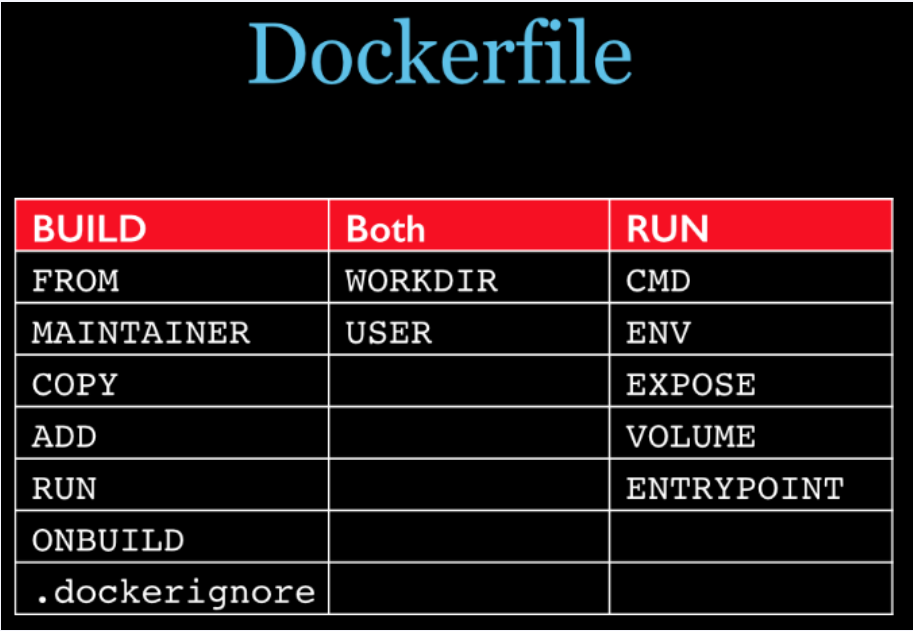

- Build：
  - FROM：来自哪个基础镜像，第一条指令必须是FROM
  - MAINTAINER：镜像维护者的姓名和邮箱地址
  - RUN：容器构建时需要运行的命令，shell格式与exec格式
  - ADD：将宿主机目录下的文件拷贝进镜像且自动处理URL和解压tar压缩包
  - COPY：类似ADD，拷贝文件到镜像中
  - ONBUILD：当构建一个被继承的`Dockerfile`时运行命令，父镜像在被子继承后，父镜像的`onbuild`被触发。
- Both：
  - WORKDIR：指令容器撞见后，终端默认的工作目录
  - USER：制定该镜像以什么用户去执行，默认root
- RUN：
  - CMD：指定启动容器后执行的命令
    - 可以有多个CMD，但只有最后一个生效
    - 会被docker run之后的参数替换
    - docker run时生效，支持shell格式与exec格式
  - EXPOSE：当前容器对外暴露出的端口
  - ENV：用于构建镜像过程中设置环境变量，该环境变量可以在后续任何RUN指令中使用
  - VOLUME：容器数据卷，用于保存和持久化数据工作
  - ENTRYPOINT：指定一个容器启动时要运行的命令，类似CMD
    - 不会被docker run 后面的命令覆盖
    - 命令行参数会以参数形式传递给ENTRYPOINT制定的程序
    - 如果Dockerfile存在多个ENTRYPOINT，仅最后一个生效

**构建一个redisd的Dockerfile**:

```dockerfile
FROM debian:stretch

RUN set -x; buildDeps='gcc libc6-dev make wget' \
    && apt-get update \
    && apt-get install -y $buildDeps \
    && wget -O redis.tar.gz "http://download.redis.io/releases/redis-5.0.3.tar.gz" \
    && mkdir -p /usr/src/redis \
    && tar -xzf redis.tar.gz -C /usr/src/redis --strip-components=1 \
    && make -C /usr/src/redis \
    && make -C /usr/src/redis install \
    && rm -rf /var/lib/apt/lists/* \
    && rm redis.tar.gz \
    && rm -r /usr/src/redis \
    && apt-get purge -y --auto-remove $buildDeps
```

#### COPY

和 `RUN` 指令一样，也有两种格式，一种类似于命令行，一种类似于函数调用。

`COPY` 指令将从构建上下文目录中 `<源路径>` 的文件/目录复制到新的一层的镜像内的 `<目标路径>` 位置。比如：

复制

```
COPY package.json /usr/src/app/
```

`<源路径>` 可以是多个，甚至可以是通配符，其通配符规则要满足 Go 的 [`filepath.Match`](https://golang.org/pkg/path/filepath/#Match) 规则，如：

复制

```
COPY hom* /mydir/
COPY hom?.txt /mydir/
```

`<目标路径>` 可以是容器内的绝对路径，也可以是相对于工作目录的相对路径（工作目录可以用 `WORKDIR` 指令来指定）。目标路径不需要事先创建，如果目录不存在会在复制文件前先行创建缺失目录。

此外，还需要注意一点，使用 `COPY` 指令，源文件的各种元数据都会保留。比如读、写、执行权限、文件变更时间等。这个特性对于镜像定制很有用。特别是构建相关文件都在使用 Git 进行管理的时候。

在使用该指令的时候还可以加上 `--chown=<user>:<group>` 选项来改变文件的所属用户及所属组。

复制

```
COPY --chown=55:mygroup files* /mydir/
COPY --chown=bin files* /mydir/
COPY --chown=1 files* /mydir/
COPY --chown=10:11 files* /mydir/
```

如果源路径为文件夹，复制的时候不是直接复制该文件夹，而是将文件夹中的内容复制到目标路径。

#### ADD

`ADD` 指令和 `COPY` 的格式和性质基本一致。但是在 `COPY` 基础上增加了一些功能。

比如 `<源路径>` 可以是一个 `URL`，这种情况下，Docker 引擎会试图去下载这个链接的文件放到 `<目标路径>` 去。下载后的文件权限自动设置为 `600`，如果这并不是想要的权限，那么还需要增加额外的一层 `RUN` 进行权限调整，另外，如果下载的是个压缩包，需要解压缩，也一样还需要额外的一层 `RUN` 指令进行解压缩。所以不如直接使用 `RUN` 指令，然后使用 `wget` 或者 `curl` 工具下载，处理权限、解压缩、然后清理无用文件更合理。因此，这个功能其实并不实用，而且不推荐使用。

如果 `<源路径>` 为一个 `tar` 压缩文件的话，压缩格式为 `gzip`, `bzip2` 以及 `xz` 的情况下，`ADD` 指令将会自动解压缩这个压缩文件到 `<目标路径>` 去。

在某些情况下，这个自动解压缩的功能非常有用，比如官方镜像 `ubuntu` 中：

复制

```dockerfile
FROM scratch
ADD ubuntu-xenial-core-cloudimg-amd64-root.tar.gz /
...
```

但在某些情况下，如果我们真的是希望复制个压缩文件进去，而不解压缩，这时就不可以使用 `ADD` 命令了。

在 Docker 官方的 [Dockerfile 最佳实践文档](https://yeasy.gitbook.io/docker_practice/appendix/best_practices) 中要求，尽可能的使用 `COPY`，因为 `COPY` 的语义很明确，就是复制文件而已，而 `ADD` 则包含了更复杂的功能，其行为也不一定很清晰。最适合使用 `ADD` 的场合，就是所提及的需要自动解压缩的场合。

另外需要注意的是，`ADD` 指令会令镜像构建缓存失效，从而可能会令镜像构建变得比较缓慢。

因此在 `COPY` 和 `ADD` 指令中选择的时候，可以遵循这样的原则，所有的文件复制均使用 `COPY` 指令，仅在需要自动解压缩的场合使用 `ADD`。

在使用该指令的时候还可以加上 `--chown=<user>:<group>` 选项来改变文件的所属用户及所属组。

复制

```dockerfile
ADD --chown=55:mygroup files* /mydir/
ADD --chown=bin files* /mydir/
ADD --chown=1 files* /mydir/
ADD --chown=10:11 files* /mydir/
```

#### CMD

`CMD` 指令的格式和 `RUN` 相似，也是两种格式：

- 

  `shell` 格式：`CMD <命令>`

- 

  `exec` 格式：`CMD ["可执行文件", "参数1", "参数2"...]`

- 

  参数列表格式：`CMD ["参数1", "参数2"...]`。在指定了 `ENTRYPOINT` 指令后，用 `CMD` 指定具体的参数。

之前介绍容器的时候曾经说过，Docker 不是虚拟机，容器就是进程。既然是进程，那么在启动容器的时候，需要指定所运行的程序及参数。`CMD` 指令就是用于指定默认的容器主进程的启动命令的。

在运行时可以指定新的命令来替代镜像设置中的这个默认命令，比如，`ubuntu` 镜像默认的 `CMD` 是 `/bin/bash`，如果我们直接 `docker run -it ubuntu` 的话，会直接进入 `bash`。我们也可以在运行时指定运行别的命令，如 `docker run -it ubuntu cat /etc/os-release`。这就是用 `cat /etc/os-release` 命令替换了默认的 `/bin/bash` 命令了，输出了系统版本信息。

在指令格式上，一般推荐使用 `exec` 格式，这类格式在解析时会被解析为 JSON 数组，因此一定要使用双引号 `"`，而不要使用单引号。

如果使用 `shell` 格式的话，实际的命令会被包装为 `sh -c` 的参数的形式进行执行。比如：

复制

```
CMD echo $HOME
```

在实际执行中，会将其变更为：

复制

```
CMD [ "sh", "-c", "echo $HOME" ]
```

这就是为什么我们可以使用环境变量的原因，因为这些环境变量会被 shell 进行解析处理。

提到 `CMD` 就不得不提容器中应用在前台执行和后台执行的问题。这是初学者常出现的一个混淆。

Docker 不是虚拟机，容器中的应用都应该以前台执行，而不是像虚拟机、物理机里面那样，用 `systemd` 去启动后台服务，容器内没有后台服务的概念。

一些初学者将 `CMD` 写为：

复制

```
CMD service nginx start
```

然后发现容器执行后就立即退出了。甚至在容器内去使用 `systemctl` 命令结果却发现根本执行不了。这就是因为没有搞明白前台、后台的概念，没有区分容器和虚拟机的差异，依旧在以传统虚拟机的角度去理解容器。

对于容器而言，其启动程序就是容器应用进程，容器就是为了主进程而存在的，主进程退出，容器就失去了存在的意义，从而退出，其它辅助进程不是它需要关心的东西。

而使用 `service nginx start` 命令，则是希望 init 系统以后台守护进程的形式启动 nginx 服务。而刚才说了 `CMD service nginx start` 会被理解为 `CMD [ "sh", "-c", "service nginx start"]`，因此主进程实际上是 `sh`。那么当 `service nginx start` 命令结束后，`sh` 也就结束了，`sh` 作为主进程退出了，自然就会令容器退出。

正确的做法是直接执行 `nginx` 可执行文件，并且要求以前台形式运行。比如：

复制

```
CMD ["nginx", "-g", "daemon off;"]
```

#### ENTRYPOINT

`ENTRYPOINT` 的格式和 `RUN` 指令格式一样，分为 `exec` 格式和 `shell` 格式。

`ENTRYPOINT` 的目的和 `CMD` 一样，都是在指定容器启动程序及参数。`ENTRYPOINT` 在运行时也可以替代，不过比 `CMD` 要略显繁琐，需要通过 `docker run` 的参数 `--entrypoint` 来指定。

当指定了 `ENTRYPOINT` 后，`CMD` 的含义就发生了改变，不再是直接的运行其命令，而是将 `CMD` 的内容作为参数传给 `ENTRYPOINT` 指令，换句话说实际执行时，将变为：

复制

```
<ENTRYPOINT> "<CMD>"
```

那么有了 `CMD` 后，为什么还要有 `ENTRYPOINT` 呢？这种 `<ENTRYPOINT> "<CMD>"` 有什么好处么？让我们来看几个场景。

#### 场景一：让镜像变成像命令一样使用

假设我们需要一个得知自己当前公网 IP 的镜像，那么可以先用 `CMD` 来实现：

复制

```
FROM ubuntu:18.04
RUN apt-get update \
    && apt-get install -y curl \
    && rm -rf /var/lib/apt/lists/*
CMD [ "curl", "-s", "http://myip.ipip.net" ]
```

假如我们使用 `docker build -t myip .` 来构建镜像的话，如果我们需要查询当前公网 IP，只需要执行：

复制

```
$ docker run myip
当前 IP：61.148.226.66 来自：北京市 联通
```

嗯，这么看起来好像可以直接把镜像当做命令使用了，不过命令总有参数，如果我们希望加参数呢？比如从上面的 `CMD` 中可以看到实质的命令是 `curl`，那么如果我们希望显示 HTTP 头信息，就需要加上 `-i` 参数。那么我们可以直接加 `-i` 参数给 `docker run myip` 么？

复制

```
$ docker run myip -i
docker: Error response from daemon: invalid header field value "oci runtime error: container_linux.go:247: starting container process caused \"exec: \\\"-i\\\": executable file not found in $PATH\"\n".
```

我们可以看到可执行文件找不到的报错，`executable file not found`。之前我们说过，跟在镜像名后面的是 `command`，运行时会替换 `CMD` 的默认值。因此这里的 `-i` 替换了原来的 `CMD`，而不是添加在原来的 `curl -s http://myip.ipip.net` 后面。而 `-i` 根本不是命令，所以自然找不到。

那么如果我们希望加入 `-i` 这参数，我们就必须重新完整的输入这个命令：

复制

```
$ docker run myip curl -s http://myip.ipip.net -i
```

这显然不是很好的解决方案，而使用 `ENTRYPOINT` 就可以解决这个问题。现在我们重新用 `ENTRYPOINT` 来实现这个镜像：

复制

```
FROM ubuntu:18.04
RUN apt-get update \
    && apt-get install -y curl \
    && rm -rf /var/lib/apt/lists/*
ENTRYPOINT [ "curl", "-s", "http://myip.ipip.net" ]
```

这次我们再来尝试直接使用 `docker run myip -i`：

复制

```
$ docker run myip
当前 IP：61.148.226.66 来自：北京市 联通

$ docker run myip -i
HTTP/1.1 200 OK
Server: nginx/1.8.0
Date: Tue, 22 Nov 2016 05:12:40 GMT
Content-Type: text/html; charset=UTF-8
Vary: Accept-Encoding
X-Powered-By: PHP/5.6.24-1~dotdeb+7.1
X-Cache: MISS from cache-2
X-Cache-Lookup: MISS from cache-2:80
X-Cache: MISS from proxy-2_6
Transfer-Encoding: chunked
Via: 1.1 cache-2:80, 1.1 proxy-2_6:8006
Connection: keep-alive

当前 IP：61.148.226.66 来自：北京市 联通
```

可以看到，这次成功了。这是因为当存在 `ENTRYPOINT` 后，`CMD` 的内容将会作为参数传给 `ENTRYPOINT`，而这里 `-i` 就是新的 `CMD`，因此会作为参数传给 `curl`，从而达到了我们预期的效果。

#### 场景二：应用运行前的准备工作

启动容器就是启动主进程，但有些时候，启动主进程前，需要一些准备工作。

比如 `mysql` 类的数据库，可能需要一些数据库配置、初始化的工作，这些工作要在最终的 mysql 服务器运行之前解决。

此外，可能希望避免使用 `root` 用户去启动服务，从而提高安全性，而在启动服务前还需要以 `root` 身份执行一些必要的准备工作，最后切换到服务用户身份启动服务。或者除了服务外，其它命令依旧可以使用 `root` 身份执行，方便调试等。

这些准备工作是和容器 `CMD` 无关的，无论 `CMD` 为什么，都需要事先进行一个预处理的工作。这种情况下，可以写一个脚本，然后放入 `ENTRYPOINT` 中去执行，而这个脚本会将接到的参数（也就是 `<CMD>`）作为命令，在脚本最后执行。比如官方镜像 `redis` 中就是这么做的：

复制

```
FROM alpine:3.4
...
RUN addgroup -S redis && adduser -S -G redis redis
...
ENTRYPOINT ["docker-entrypoint.sh"]

EXPOSE 6379
CMD [ "redis-server" ]
```

可以看到其中为了 redis 服务创建了 redis 用户，并在最后指定了 `ENTRYPOINT` 为 `docker-entrypoint.sh` 脚本。

复制

```
#!/bin/sh
...
# allow the container to be started with `--user`
if [ "$1" = 'redis-server' -a "$(id -u)" = '0' ]; then
	find . \! -user redis -exec chown redis '{}' +
	exec gosu redis "$0" "$@"
fi

exec "$@"
```

该脚本的内容就是根据 `CMD` 的内容来判断，如果是 `redis-server` 的话，则切换到 `redis` 用户身份启动服务器，否则依旧使用 `root` 身份执行。比如：

复制

```
$ docker run -it redis id
uid=0(root) gid=0(root) groups=0(root)
```

#### ENV

格式有两种：

- 

  `ENV <key> <value>`

- 

  `ENV <key1>=<value1> <key2>=<value2>...`

这个指令很简单，就是设置环境变量而已，无论是后面的其它指令，如 `RUN`，还是运行时的应用，都可以直接使用这里定义的环境变量。

复制

```
ENV VERSION=1.0 DEBUG=on \
    NAME="Happy Feet"
```

这个例子中演示了如何换行，以及对含有空格的值用双引号括起来的办法，这和 Shell 下的行为是一致的。

定义了环境变量，那么在后续的指令中，就可以使用这个环境变量。比如在官方 `node` 镜像 `Dockerfile` 中，就有类似这样的代码：

复制

```
ENV NODE_VERSION 7.2.0

RUN curl -SLO "https://nodejs.org/dist/v$NODE_VERSION/node-v$NODE_VERSION-linux-x64.tar.xz" \
  && curl -SLO "https://nodejs.org/dist/v$NODE_VERSION/SHASUMS256.txt.asc" \
  && gpg --batch --decrypt --output SHASUMS256.txt SHASUMS256.txt.asc \
  && grep " node-v$NODE_VERSION-linux-x64.tar.xz\$" SHASUMS256.txt | sha256sum -c - \
  && tar -xJf "node-v$NODE_VERSION-linux-x64.tar.xz" -C /usr/local --strip-components=1 \
  && rm "node-v$NODE_VERSION-linux-x64.tar.xz" SHASUMS256.txt.asc SHASUMS256.txt \
  && ln -s /usr/local/bin/node /usr/local/bin/nodejs
```

在这里先定义了环境变量 `NODE_VERSION`，其后的 `RUN` 这层里，多次使用 `$NODE_VERSION` 来进行操作定制。可以看到，将来升级镜像构建版本的时候，只需要更新 `7.2.0` 即可，`Dockerfile` 构建维护变得更轻松了。

下列指令可以支持环境变量展开： `ADD`、`COPY`、`ENV`、`EXPOSE`、`FROM`、`LABEL`、`USER`、`WORKDIR`、`VOLUME`、`STOPSIGNAL`、`ONBUILD`、`RUN`。

可以从这个指令列表里感觉到，环境变量可以使用的地方很多，很强大。通过环境变量，我们可以让一份 `Dockerfile` 制作更多的镜像，只需使用不同的环境变量即可。

#### ARG

格式：`ARG <参数名>[=<默认值>]`

构建参数和 `ENV` 的效果一样，都是设置环境变量。所不同的是，`ARG` 所设置的构建环境的环境变量，在将来容器运行时是不会存在这些环境变量的。但是不要因此就使用 `ARG` 保存密码之类的信息，因为 `docker history` 还是可以看到所有值的。

`Dockerfile` 中的 `ARG` 指令是定义参数名称，以及定义其默认值。该默认值可以在构建命令 `docker build` 中用 `--build-arg <参数名>=<值>` 来覆盖。

灵活的使用 `ARG` 指令，能够在不修改 Dockerfile 的情况下，构建出不同的镜像。

ARG 指令有生效范围，如果在 `FROM` 指令之前指定，那么只能用于 `FROM` 指令中。

复制

```
ARG DOCKER_USERNAME=library

FROM ${DOCKER_USERNAME}/alpine

RUN set -x ; echo ${DOCKER_USERNAME}
```

使用上述 Dockerfile 会发现无法输出 `${DOCKER_USERNAME}` 变量的值，要想正常输出，你必须在 `FROM` 之后再次指定 `ARG`

复制

```
# 只在 FROM 中生效
ARG DOCKER_USERNAME=library

FROM ${DOCKER_USERNAME}/alpine

# 要想在 FROM 之后使用，必须再次指定
ARG DOCKER_USERNAME=library

RUN set -x ; echo ${DOCKER_USERNAME}
```

对于多阶段构建，尤其要注意这个问题

复制

```
# 这个变量在每个 FROM 中都生效
ARG DOCKER_USERNAME=library

FROM ${DOCKER_USERNAME}/alpine

RUN set -x ; echo 1

FROM ${DOCKER_USERNAME}/alpine

RUN set -x ; echo 2
```

对于上述 Dockerfile 两个 `FROM` 指令都可以使用 `${DOCKER_USERNAME}`，对于在各个阶段中使用的变量都必须在每个阶段分别指定：

复制

```
ARG DOCKER_USERNAME=library

FROM ${DOCKER_USERNAME}/alpine

# 在FROM 之后使用变量，必须在每个阶段分别指定
ARG DOCKER_USERNAME=library

RUN set -x ; echo ${DOCKER_USERNAME}

FROM ${DOCKER_USERNAME}/alpine

# 在FROM 之后使用变量，必须在每个阶段分别指定
ARG DOCKER_USERNAME=library

RUN set -x ; echo ${DOCKER_USERNAME}
```

#### VOLUME

格式为：

- 

  `VOLUME ["<路径1>", "<路径2>"...]`

- 

  `VOLUME <路径>`

之前我们说过，容器运行时应该尽量保持容器存储层不发生写操作，对于数据库类需要保存动态数据的应用，其数据库文件应该保存于卷(volume)中，后面的章节我们会进一步介绍 Docker 卷的概念。为了防止运行时用户忘记将动态文件所保存目录挂载为卷，在 `Dockerfile` 中，我们可以事先指定某些目录挂载为匿名卷，这样在运行时如果用户不指定挂载，其应用也可以正常运行，不会向容器存储层写入大量数据。

复制

```
VOLUME /data
```

这里的 `/data` 目录就会在容器运行时自动挂载为匿名卷，任何向 `/data` 中写入的信息都不会记录进容器存储层，从而保证了容器存储层的无状态化。当然，运行容器时可以覆盖这个挂载设置。比如：

复制

```
$ docker run -d -v mydata:/data xxxx
```

在这行命令中，就使用了 `mydata` 这个命名卷挂载到了 `/data` 这个位置，替代了 `Dockerfile` 中定义的匿名卷的挂载配置。

#### EXPOSE

格式为 `EXPOSE <端口1> [<端口2>...]`。

`EXPOSE` 指令是声明容器运行时提供服务的端口，这只是一个声明，在容器运行时并不会因为这个声明应用就会开启这个端口的服务。在 Dockerfile 中写入这样的声明有两个好处，一个是帮助镜像使用者理解这个镜像服务的守护端口，以方便配置映射；另一个用处则是在运行时使用随机端口映射时，也就是 `docker run -P` 时，会自动随机映射 `EXPOSE` 的端口。

要将 `EXPOSE` 和在运行时使用 `-p <宿主端口>:<容器端口>` 区分开来。`-p`，是映射宿主端口和容器端口，换句话说，就是将容器的对应端口服务公开给外界访问，而 `EXPOSE` 仅仅是声明容器打算使用什么端口而已，并不会自动在宿主进行端口映射。

#### WORKDIR

格式为 `WORKDIR <工作目录路径>`。

使用 `WORKDIR` 指令可以来指定工作目录（或者称为当前目录），以后各层的当前目录就被改为指定的目录，如该目录不存在，`WORKDIR` 会帮你建立目录。

之前提到一些初学者常犯的错误是把 `Dockerfile` 等同于 Shell 脚本来书写，这种错误的理解还可能会导致出现下面这样的错误：

复制

```
RUN cd /app
RUN echo "hello" > world.txt
```

如果将这个 `Dockerfile` 进行构建镜像运行后，会发现找不到 `/app/world.txt` 文件，或者其内容不是 `hello`。原因其实很简单，在 Shell 中，连续两行是同一个进程执行环境，因此前一个命令修改的内存状态，会直接影响后一个命令；而在 `Dockerfile` 中，这两行 `RUN` 命令的执行环境根本不同，是两个完全不同的容器。这就是对 `Dockerfile` 构建分层存储的概念不了解所导致的错误。

之前说过每一个 `RUN` 都是启动一个容器、执行命令、然后提交存储层文件变更。第一层 `RUN cd /app` 的执行仅仅是当前进程的工作目录变更，一个内存上的变化而已，其结果不会造成任何文件变更。而到第二层的时候，启动的是一个全新的容器，跟第一层的容器更完全没关系，自然不可能继承前一层构建过程中的内存变化。

因此如果需要改变以后各层的工作目录的位置，那么应该使用 `WORKDIR` 指令。

复制

```
WORKDIR /app

RUN echo "hello" > world.txt
```

如果你的 `WORKDIR` 指令使用的相对路径，那么所切换的路径与之前的 `WORKDIR` 有关：

复制

```
WORKDIR /a
WORKDIR b
WORKDIR c

RUN pwd
```

`RUN pwd` 的工作目录为 `/a/b/c`。

#### USER

格式：`USER <用户名>[:<用户组>]`

`USER` 指令和 `WORKDIR` 相似，都是改变环境状态并影响以后的层。`WORKDIR` 是改变工作目录，`USER` 则是改变之后层的执行 `RUN`, `CMD` 以及 `ENTRYPOINT` 这类命令的身份。

注意，`USER` 只是帮助你切换到指定用户而已，这个用户必须是事先建立好的，否则无法切换。

复制

```
RUN groupadd -r redis && useradd -r -g redis redis
USER redis
RUN [ "redis-server" ]
```

如果以 `root` 执行的脚本，在执行期间希望改变身份，比如希望以某个已经建立好的用户来运行某个服务进程，不要使用 `su` 或者 `sudo`，这些都需要比较麻烦的配置，而且在 TTY 缺失的环境下经常出错。建议使用 [`gosu`](https://github.com/tianon/gosu)。

复制

```
# 建立 redis 用户，并使用 gosu 换另一个用户执行命令
RUN groupadd -r redis && useradd -r -g redis redis
# 下载 gosu
RUN wget -O /usr/local/bin/gosu "https://github.com/tianon/gosu/releases/download/1.12/gosu-amd64" \
    && chmod +x /usr/local/bin/gosu \
    && gosu nobody true
# 设置 CMD，并以另外的用户执行
CMD [ "exec", "gosu", "redis", "redis-server" ]
```

#### HEALTHCHECK

格式：

- 

  `HEALTHCHECK [选项] CMD <命令>`：设置检查容器健康状况的命令

- 

  `HEALTHCHECK NONE`：如果基础镜像有健康检查指令，使用这行可以屏蔽掉其健康检查指令

`HEALTHCHECK` 指令是告诉 Docker 应该如何进行判断容器的状态是否正常，这是 Docker 1.12 引入的新指令。

在没有 `HEALTHCHECK` 指令前，Docker 引擎只可以通过容器内主进程是否退出来判断容器是否状态异常。很多情况下这没问题，但是如果程序进入死锁状态，或者死循环状态，应用进程并不退出，但是该容器已经无法提供服务了。在 1.12 以前，Docker 不会检测到容器的这种状态，从而不会重新调度，导致可能会有部分容器已经无法提供服务了却还在接受用户请求。

而自 1.12 之后，Docker 提供了 `HEALTHCHECK` 指令，通过该指令指定一行命令，用这行命令来判断容器主进程的服务状态是否还正常，从而比较真实的反应容器实际状态。

当在一个镜像指定了 `HEALTHCHECK` 指令后，用其启动容器，初始状态会为 `starting`，在 `HEALTHCHECK` 指令检查成功后变为 `healthy`，如果连续一定次数失败，则会变为 `unhealthy`。

`HEALTHCHECK` 支持下列选项：

- 

  `--interval=<间隔>`：两次健康检查的间隔，默认为 30 秒；

- 

  `--timeout=<时长>`：健康检查命令运行超时时间，如果超过这个时间，本次健康检查就被视为失败，默认 30 秒；

- 

  `--retries=<次数>`：当连续失败指定次数后，则将容器状态视为 `unhealthy`，默认 3 次。

和 `CMD`, `ENTRYPOINT` 一样，`HEALTHCHECK` 只可以出现一次，如果写了多个，只有最后一个生效。

在 `HEALTHCHECK [选项] CMD` 后面的命令，格式和 `ENTRYPOINT` 一样，分为 `shell` 格式，和 `exec` 格式。命令的返回值决定了该次健康检查的成功与否：`0`：成功；`1`：失败；`2`：保留，不要使用这个值。

假设我们有个镜像是个最简单的 Web 服务，我们希望增加健康检查来判断其 Web 服务是否在正常工作，我们可以用 `curl` 来帮助判断，其 `Dockerfile` 的 `HEALTHCHECK` 可以这么写：

复制

```
FROM nginx
RUN apt-get update && apt-get install -y curl && rm -rf /var/lib/apt/lists/*
HEALTHCHECK --interval=5s --timeout=3s \
  CMD curl -fs http://localhost/ || exit 1
```

这里我们设置了每 5 秒检查一次（这里为了试验所以间隔非常短，实际应该相对较长），如果健康检查命令超过 3 秒没响应就视为失败，并且使用 `curl -fs http://localhost/ || exit 1` 作为健康检查命令。

使用 `docker build` 来构建这个镜像：

复制

```
$ docker build -t myweb:v1 .
```

构建好了后，我们启动一个容器：

复制

```
$ docker run -d --name web -p 80:80 myweb:v1
```

当运行该镜像后，可以通过 `docker container ls` 看到最初的状态为 `(health: starting)`：

复制

```
$ docker container ls
CONTAINER ID        IMAGE               COMMAND                  CREATED             STATUS                            PORTS               NAMES
03e28eb00bd0        myweb:v1            "nginx -g 'daemon off"   3 seconds ago       Up 2 seconds (health: starting)   80/tcp, 443/tcp     web
```

在等待几秒钟后，再次 `docker container ls`，就会看到健康状态变化为了 `(healthy)`：

复制

```
$ docker container ls
CONTAINER ID        IMAGE               COMMAND                  CREATED             STATUS                    PORTS               NAMES
03e28eb00bd0        myweb:v1            "nginx -g 'daemon off"   18 seconds ago      Up 16 seconds (healthy)   80/tcp, 443/tcp     web
```

如果健康检查连续失败超过了重试次数，状态就会变为 `(unhealthy)`。

为了帮助排障，健康检查命令的输出（包括 `stdout` 以及 `stderr`）都会被存储于健康状态里，可以用 `docker inspect` 来查看。

复制

```
$ docker inspect --format '{{json .State.Health}}' web | python -m json.tool
{
    "FailingStreak": 0,
    "Log": [
        {
            "End": "2016-11-25T14:35:37.940957051Z",
            "ExitCode": 0,
            "Output": "<!DOCTYPE html>\n<html>\n<head>\n<title>Welcome to nginx!</title>\n<style>\n    body {\n        width: 35em;\n        margin: 0 auto;\n        font-family: Tahoma, Verdana, Arial, sans-serif;\n    }\n</style>\n</head>\n<body>\n<h1>Welcome to nginx!</h1>\n<p>If you see this page, the nginx web server is successfully installed and\nworking. Further configuration is required.</p>\n\n<p>For online documentation and support please refer to\n<a href=\"http://nginx.org/\">nginx.org</a>.<br/>\nCommercial support is available at\n<a href=\"http://nginx.com/\">nginx.com</a>.</p>\n\n<p><em>Thank you for using nginx.</em></p>\n</body>\n</html>\n",
            "Start": "2016-11-25T14:35:37.780192565Z"
        }
    ],
    "Status": "healthy"
}
```

#### ONBUILD

格式：`ONBUILD <其它指令>`。

`ONBUILD` 是一个特殊的指令，它后面跟的是其它指令，比如 `RUN`, `COPY` 等，而这些指令，在当前镜像构建时并不会被执行。只有当以当前镜像为基础镜像，去构建下一级镜像的时候才会被执行。

`Dockerfile` 中的其它指令都是为了定制当前镜像而准备的，唯有 `ONBUILD` 是为了帮助别人定制自己而准备的。

假设我们要制作 Node.js 所写的应用的镜像。我们都知道 Node.js 使用 `npm` 进行包管理，所有依赖、配置、启动信息等会放到 `package.json` 文件里。在拿到程序代码后，需要先进行 `npm install` 才可以获得所有需要的依赖。然后就可以通过 `npm start` 来启动应用。因此，一般来说会这样写 `Dockerfile`：

复制

```
FROM node:slim
RUN mkdir /app
WORKDIR /app
COPY ./package.json /app
RUN [ "npm", "install" ]
COPY . /app/
CMD [ "npm", "start" ]
```

把这个 `Dockerfile` 放到 Node.js 项目的根目录，构建好镜像后，就可以直接拿来启动容器运行。但是如果我们还有第二个 Node.js 项目也差不多呢？好吧，那就再把这个 `Dockerfile` 复制到第二个项目里。那如果有第三个项目呢？再复制么？文件的副本越多，版本控制就越困难，让我们继续看这样的场景维护的问题。

如果第一个 Node.js 项目在开发过程中，发现这个 `Dockerfile` 里存在问题，比如敲错字了、或者需要安装额外的包，然后开发人员修复了这个 `Dockerfile`，再次构建，问题解决。第一个项目没问题了，但是第二个项目呢？虽然最初 `Dockerfile` 是复制、粘贴自第一个项目的，但是并不会因为第一个项目修复了他们的 `Dockerfile`，而第二个项目的 `Dockerfile` 就会被自动修复。

那么我们可不可以做一个基础镜像，然后各个项目使用这个基础镜像呢？这样基础镜像更新，各个项目不用同步 `Dockerfile` 的变化，重新构建后就继承了基础镜像的更新？好吧，可以，让我们看看这样的结果。那么上面的这个 `Dockerfile` 就会变为：

复制

```
FROM node:slim
RUN mkdir /app
WORKDIR /app
CMD [ "npm", "start" ]
```

这里我们把项目相关的构建指令拿出来，放到子项目里去。假设这个基础镜像的名字为 `my-node` 的话，各个项目内的自己的 `Dockerfile` 就变为：

复制

```
FROM my-node
COPY ./package.json /app
RUN [ "npm", "install" ]
COPY . /app/
```

基础镜像变化后，各个项目都用这个 `Dockerfile` 重新构建镜像，会继承基础镜像的更新。

那么，问题解决了么？没有。准确说，只解决了一半。如果这个 `Dockerfile` 里面有些东西需要调整呢？比如 `npm install` 都需要加一些参数，那怎么办？这一行 `RUN` 是不可能放入基础镜像的，因为涉及到了当前项目的 `./package.json`，难道又要一个个修改么？所以说，这样制作基础镜像，只解决了原来的 `Dockerfile` 的前4条指令的变化问题，而后面三条指令的变化则完全没办法处理。

`ONBUILD` 可以解决这个问题。让我们用 `ONBUILD` 重新写一下基础镜像的 `Dockerfile`:

复制

```
FROM node:slim
RUN mkdir /app
WORKDIR /app
ONBUILD COPY ./package.json /app
ONBUILD RUN [ "npm", "install" ]
ONBUILD COPY . /app/
CMD [ "npm", "start" ]
```

这次我们回到原始的 `Dockerfile`，但是这次将项目相关的指令加上 `ONBUILD`，这样在构建基础镜像的时候，这三行并不会被执行。然后各个项目的 `Dockerfile` 就变成了简单地：

复制

```
FROM my-node
```

是的，只有这么一行。当在各个项目目录中，用这个只有一行的 `Dockerfile` 构建镜像时，之前基础镜像的那三行 `ONBUILD` 就会开始执行，成功的将当前项目的代码复制进镜像、并且针对本项目执行 `npm install`，生成应用镜像。

#### LABEL

`LABEL` 指令用来给镜像以键值对的形式添加一些元数据（metadata）。

复制

```
LABEL <key>=<value> <key>=<value> <key>=<value> ...
```

我们还可以用一些标签来申明镜像的作者、文档地址等：

复制

```
LABEL org.opencontainers.image.authors="yeasy"

LABEL org.opencontainers.image.documentation="https://yeasy.gitbooks.io"
```

具体可以参考 https://github.com/opencontainers/image-spec/blob/master/annotations.md

#### SHELL

格式：`SHELL ["executable", "parameters"]`

```
SHELL` 指令可以指定 `RUN` `ENTRYPOINT` `CMD` 指令的 shell，Linux 中默认为 `["/bin/sh", "-c"]
```

复制

```
SHELL ["/bin/sh", "-c"]

RUN lll ; ls

SHELL ["/bin/sh", "-cex"]

RUN lll ; ls
```

两个 `RUN` 运行同一命令，第二个 `RUN` 运行的命令会打印出每条命令并当遇到错误时退出。

当 `ENTRYPOINT` `CMD` 以 shell 格式指定时，`SHELL` 指令所指定的 shell 也会成为这两个指令的 shell

复制

```
SHELL ["/bin/sh", "-cex"]

# /bin/sh -cex "nginx"
ENTRYPOINT nginx
```

复制

```
SHELL ["/bin/sh", "-cex"]

# /bin/sh -cex "nginx"
CMD nginx
```

#### 参考文档

- `Dockerfile` 官方文档：https://docs.docker.com/engine/reference/builder/

- 

  `Dockerfile` 最佳实践文档：https://docs.docker.com/develop/develop-images/dockerfile_best-practices/

- 

  `Docker` 官方镜像 `Dockerfile`：https://github.com/docker-library/docs


### 镜像构建上下文

- 进入Dockerfile文件所在目录
- 执行`docker build [选项] <上下文路径/URL/->`

当进行镜像构建时，并非所有定制都会通过`RUN`指令完成，经常会需要将一些本地文件赋值进镜像。而docker build命令构建实际上并非在本地构建，而是在服务端，也就是Docker引擎中构建。

当构建的时候，用户会制定构建镜像上下文的路径，`docker build`命令得知这个路径后，会将路径下的所有内容打包，然后上传给 Docker 引擎。这样 Docker 引擎收到这个上下文包后，展开就会获得构建镜像所需的一切文件。

如果在 `Dockerfile` 中写`COPY ./package.json /app/`：

- 不是要复制执行 `docker build` 命令所在的目录下的 `package.json`
- 也不是复制 `Dockerfile` 所在目录下的 `package.json`
- 而是复制 **上下文（context）** 目录下的 `package.json`
- 因此，`COPY` 这类指令中的源文件的路径都是*相对路径*

对于命令`docker build -t nginx:v3 .`:

- `.`实际上是在制定上下文的目录

- `docker build` 命令会将该目录下的内容打包交给 Docker 引擎以帮助构建镜像。

  > ```bash
  > # 构建的输出可以看出 发送上下文的过程
  > $ docker build -t nginx:v3 .
  > Sending build context to Docker daemon 2.048 kB
  > ...
  > ```

**注意**：

- 不要将Dockerfile放到根目录去构建，否则可能上传几十G的东西，相当于打包整个硬盘
- 通常Dockerfile至于一个空目录下，或者项目根目录下。
- 可以编辑`.dockerignore`文件用于剔除不需要作为上下文传递给Docker引擎的文件

默认情况下，如果不额外制定Dockerfile的话，会将上下文目录下的Dockerfile文件作为Dockerfile：

- 实际上并不要求必须为Dockerfile，也并不要求位于上下文目录中
- 可以使用`-f ../Dockerfile.php`参数制定某个文件作为Dockerfile
- 通常大家都习惯行使用默认文件名Dockerfile，以及将其置于镜像构建上下文目录中

### 其他构建用法

**直接用Git repo进行构建**:

```bash
docker build -t hello-world https://github.com/docker-library/hello-world.git#master:amd64/hello-world
```

- 指定所需的Git repo，并制定分支，构建目录为`/amd64/hello-world/`
- docker会自己去clone该项目、切换到制定分支、进入制定目录后开始构建

**用给定的tar压缩包构建**:

```bash
docker build http://server/context.tar.gz
```

- Docker引擎会下载gheg包，并自动解压缩，将其作为上下文，开始构建

**从标准输入中读取Dockerfile进行构建**:

```bash
docker build - < Dockerfile

# 或者
cat Dockerfile | docker build -
```

- 如果标准输入传入的是文本文件，则将其视为`Dockerfile`，并开始构建
- 该形式没有上下文，无法将本地文件COPY进镜像

**从标准输入中读取上下文压缩包进行构建**:

```bash
docker build - < context.tar.gz
```

- 如果标准输入的文件格式是gzip、bzip2、xz，将会使用其作为上下文压缩包，直接将其展开，视为上下文并开始构建

## Docker镜像导入到出

### 保存镜像

```bash
# 保存镜像
docker save 镜像 -o filename

# 保存并使用gzip压缩
docker save 镜像 | gzip > filename.tar.gz
```

- filename可以为任意名称甚至后缀名，但文件本质都是归档文件
- 同名会直接覆盖，没有警告

### 加载镜像

```bash
# 加载镜像
docker load -i filename.tar.gz
```

结合ssh及pv可以完成一个镜像到另一个镜像的迁移

```bash
docker save <镜像名> | bzip2 | pv | ssh <用户名>@<主机名> 'cat | docker load'
```

# 容器

容器是独立运行的一个或一组应用，以及它们的运行态环境

## 常用操作

### 启动/停止

docker start：启动一个或多个已经被停止的容器

docker stop：停止一个运行中的容器

docker restart：重启容器

语法：

`docker start [OPTIONS] CONTAINER [CONTAINER...]`

`docker stop [OPTIONS] CONTAINER [CONTAINER...]`

`docker restart [OPTIONS] CONTAINER [CONTAINER...]`

### 终止


杀掉一个运行中的容器：

- `docker kill [OPTIONS] CONTAINER [CONTAINER...]`
- 参数：
  - -s：向容器发送一个型号

删除一个或多个容器：

-  `docker rm [OPTIONS] CONTAINER [CONTAINER...]`
- 参数：
  - -f：通过SIGKILL信号强制删除一个运行中的容器
  - -l：移除容器间的网络连接，而非容器本身
  - -v：删除与容器关联的卷

### 暂停/恢复

docker pause：暂停容器中所有的进程

- `docker pause CONTAINER [CONTAINER...]`

docker unpause：恢复容器中所有的进程

- `docker unpause CONTAINER [CONTAINER...]`

### 创建

创建一个新的容器但不启动

语法：`docker create [OPTIONS] IMAGE [COMMAND] [ARG...]`

### 容器中执行命令

`docker exec [OPTIONS] CONTAINER COMMAND [ARG...]`

- 参数：
  - -d：分离模式，在后台运行
  - -i：即使没有附加也保持STDIN打开
  - -t：分配一个伪终端

## 容器操作

```bash
# 获取容器/的元数据
docker inspect 容器名
```

### Docker ps

列出容器

语法：`docker ps [OPTIONS]`

| OPTIONS    | 说明                         |
| ---------- | ---------------------------- |
| -a         | 显示出所有容器，包括未运行的 |
| -f         | 根据条件过滤显示的内容       |
| --format   | 指定返回值的模板文件         |
| -l         | 显示最近创建的容器           |
| -n         | 列出最近创建的n个容器        |
| --no-trunc | 不截断输出                   |
| -q         | 静默模式，只显示容器编号     |
| -s         | 显示总的文件大小             |

### Docker inspect

获取容器/镜像的元数据

语法：`docker inspect [OPTIONS] NAME|ID [NAME|ID...]`

| OPTIONS | 说明                 |
| ------- | -------------------- |
| -f      | 指定返回值的模板文件 |
| -s      | 显示总的文件大小     |
| --type  | 为指定类型返回JSON   |

### Docker top

查看容器中运行的进程信息，支持ps命令参数

语法：`docker top [OPTIONS] CONTAINER [ps OPTIONS]`

容器运行时不一定有/bin/bash终端来交互运行top命令，而且容器还不一定有top命令，可以使用docker top来实现查看container中正在运行的进程 。

### Docker attach

连接正在运行中的容器

语法：`docker attach [OPTIONS] CONTAINER`

要attach上去的容器必须正在运行，可以同时连接上同一个container来共享屏幕（与screen命令的attach类似）。

### Docker events

从服务器获取实时事件

语法：`docker events [OPTIONS]`

| OPTIONS | 说明                         |
| ------- | ---------------------------- |
| -f      | 根据条件过滤事件             |
| --since | 从指定的时间戳后显示所有事件 |
| --until | 流水时间显示到指定的时间为止 |

### Docker wait

阻塞运行直到容器停止，然后打印出他的退出代码

语法：`docker wait [OPTIONS] CONTAINER [CONTAINER...]`

### Docker export

将文件系统作为一个tar归档文件导出STDOUT

语法：`docker export [OPTIONS] CONTAINER`

| OPTIONS | 说明               |
| ------- | ------------------ |
| -o      | 将输入内容写到文件 |

### Docker port

列出指定的容器的端口映射，或者查找将PRIVATE_PORT NAT到面向公众的端口

语法：`docker port [OPTIONS] CONTAINER [PRIVATE_PORT[/PROTO]]`

### Docker stats

显示容器资源的使用情况，包括：CPU，内存，网络I/O等

语法：`docker stats [OPTIONS] [CONTAINER...]`

| OPTIONS     | 说明                                   |
| ----------- | -------------------------------------- |
| -all,-a     | 显示所有的容器，包括未运行的容器       |
| --format    | 指定返回值的模板文件                   |
| --no-stream | 展示当前状态就直接退出了，不再实时更新 |
| --no-trunc  | 不截断输出                             |

## 容器rootfs命令

### Docker commit

从容器创建一个新的镜像

语法：`docker commit [OPTIONS] CONTAINER [REPOSITORY[:TAG]]`

| OPTIONS | 说明                         |
| ------- | ---------------------------- |
| -a      | 提交的镜像作者               |
| -c      | 使用Dockerfile指令来创建镜像 |
| -m      | 提交时的文字说明             |
| -p      | 在commit时，将容器停止       |

### Docker cp

容器与主机之间的数据拷贝

语法：

- `docker cp [OPTIONS] CONTAINER:SRC_PATH DEST_PATH|-`

- `docker cp [OPTIONS] SRC_PATH|- CONTAINER:DEST_PATH`

| OPTIONS | 说明               |
| ------- | ------------------ |
| -L      | 保持源目标中的链接 |

### Docker diff

检查容器里文件结构的更改

语法：`docker diff [OPTIONS] CONTAINER`

### Docker images

语法：`docker images [OPTIONS] [REPOSITORY[:TAG]]`

| OPTION     | 说明                                                         |
| ---------- | ------------------------------------------------------------ |
| -a         | 列出本地所有的镜像（含中间映像层，默认情况下，过滤掉中间映像层）； |
| --digests  | 显示镜像的摘要信息                                           |
| -f         | 显示满足条件得镜像                                           |
| --format   | 指定返回值的模板文件夹                                       |
| --no-trunc | 显示完整镜像信息                                             |
| -q         | 只显示镜像ID                                                 |

### Docker rmi

语法：`docker rmi [OPTIONS] IMAGE [IMAGE...]`

| OPTION      | 说明                             |
| ----------- | -------------------------------- |
| -f          | 强制删除                         |
| --no--prune | 不移除该镜像的过程镜像，默认移除 |

### Docker image prune

删除未使用的镜像，如果指定了`-a`，还将删除任何容器未引用的所有镜像

语法：`docker image prune [OPTIONS]`

| 参数        | 说明                           |
| ----------- | ------------------------------ |
| --all, -a   | 显示所有映像(默认隐藏中间映像) |
| --force, -f | 不要提示确认                   |

### Docker tag

语法：`docker tag [OPTIONS] IMAGE[:TAG] [REGISTRYHOST/][USERNAME/]NAME[:TAG]`

### Docker build

使用Dockerfile创建镜像

语法：`docker build [OPTIONS] PATH | URL | `

| OPTION                  | 说明                                                         |
| ----------------------- | ------------------------------------------------------------ |
| -build-arg=[]           | 设置镜像创建时的变量                                         |
| --cpu-shares            | 设置 cpu 使用权重                                            |
| --cpu-period            | 限制 CPU CFS周期                                             |
| --cpu-quota             | 限制 CPU CFS配额                                             |
| --cpuset-cpus           | 指定使用的CPU id                                             |
| --cpuset-mems           | 指定使用的内存 id                                            |
| --disable-content-trust | 忽略校验，默认开启                                           |
| -f                      | 指定要使用的Dockerfile路径                                   |
| --force-rm              | 设置镜像过程中删除中间容器                                   |
| --isolation             | 使用容器隔离技术                                             |
| --label=[]              | 设置镜像使用的元数据                                         |
| -m                      | 设置内存最大值                                               |
| --memory-swap           | 设置Swap的最大值为内存+swap，"-1"表示不限swap                |
| --no-cache              | 创建镜像的过程不使用缓存                                     |
| --pull                  | 尝试去更新镜像的新版本                                       |
| --quiet, -q             | 安静模式，成功后只输出镜像 ID                                |
| --rm                    | 设置镜像成功后删除中间容器                                   |
| --shm-size              | 设置/dev/shm的大小，默认值是64M                              |
| --ulimit                | Ulimit配置                                                   |
| --squash                | 将 Dockerfile 中所有的操作压缩为一层                         |
| --tag, -t               | 镜像的名字及标签，通常 name:tag 或者 name 格式；可以在一次构建中为一个镜像设置多个标签 |
| --network               | 默认 default。在构建期间设置RUN指令的网络模式                |

### Docker history

查看指定镜像的创建历史

语法：`docker history [OPTIONS] IMAGE`

| OPTIONS     | 说明                                       |
| ----------- | ------------------------------------------ |
| -H          | 以可读的格式打印镜像大小和日期，默认为true |
| --no--trunc | 显示完整的提交记录                         |
| -q          | 仅列出提交记录ID                           |

### Docker save

将指定镜像保存成tar归档文件

语法：`docker save [OPTIONS] IMAGE [IMAGE...]`

| OPTIONS | 说明       |
| ------- | ---------- |
| -o      | 输出到文件 |

### Docker load

导入docker save 命令导出的镜像

语法：`docker load [OPTIONS]`

| OPTIONS    | 说明                      |
| ---------- | ------------------------- |
| --input,-i | 指定导入的文件，代替STDIN |
| --quiet,-q | 精简输出信息              |

### Docker import

从归档文件中创建镜像

语法：`docker import [OPTIONS] file|URL|- [REPOSITORY[:TAG]]`

| OPTIONS | 说明                   |
| ------- | ---------------------- |
| -c      | 应用docker指令创建镜像 |
| -m      | 提交时的说明文字       |

# 卷与持久化数据

## 简介

每个Docker容器都有自己的非持久化存储，非持久化存储自动创建，从属于容器，生命周期与容器相同。这意味着删除容器也会删除全部非持久化数据。如果希望自己的容器数据保留下来（持久化），则需要将数据存储在卷上。卷与容器时解耦的，从而可以独立创建并管理卷，并且卷与任意容器生命周期绑定。最终效果即用户可以删除一个关联了卷的容器，但是卷并不会被删除。

## 持久与非持久数据

### 容器与非持久数据

容器擅长无状态和非持久化事务。每个容器都被自动分配了本地存储。默认情况下，这是容器全部文件和文件系统保存的地方。如本地存储、GraphDriver存储预计SnapShotter存储。

非持久存储属于容器的一部分，丙炔与容器的生命周期一致——容器创建时会创建非持久存储，同时该存储也会随容器的删除而删除。在Linux系统中，该存储的目录在`/var/lib/docker/<storage-driver>/`之下，是容器的一部分。

**注意**：如果在生产环境中使用Linux运行Docker，需要确认当前存储驱动（GraphDriver）与当前Linux版本是否相符。下面列举了一些指导建议：

| 系统                    | 驱动说明                                                     |
| ----------------------- | ------------------------------------------------------------ |
| RedHat Enterprise Linux | Docker 17.06或者更高版本使用Overlay2驱动<br />更早的版本使用Device Mapper驱动。<br />适用Oracle Linux以及其他Red Hat相关发行版 |
| Ubuntu                  | 适用Overlay2或者AUFS驱动。<br />Linux4.x或更高版本的内核建议适用Overkay2<br />SUSE LINUX Enterprise Server适用Btrfs存储驱动 |

随着时间的发展，Overlay2驱动正在逐渐流行。

### 容器与持久化数据

容器中持久化数据的方式推荐采用卷。用户创建卷，然后创建容器，接着将卷挂在到容器上。卷会挂在到容器文件系统的某个目录之上，任何写道该目录下的内容都会写道卷中。即使容器被删除，卷与其上面的数据任然存在。

#### 创建和管理容器卷

Docker中卷属于一等公民。这意味着卷在API中拥有一席之地，并且有独立的docker volume子命令。

使用`docker volume create myvol`命令创建名为myvol的新卷默认情况下，Docker创建新卷时采用内置的local驱动。恰如其名，本地卷只能被所在节点的容器使用。使用-d参数可以指定不同的驱动。第三方驱动可以通过插件方式接入。这些驱动提供了高级存储特性，并为Docker集成了外部存储系统。下图展示的是外部存储系统被用作卷存储。驱动继承了外部存储系统到DOcker环境当中，同时能使用其高级特性

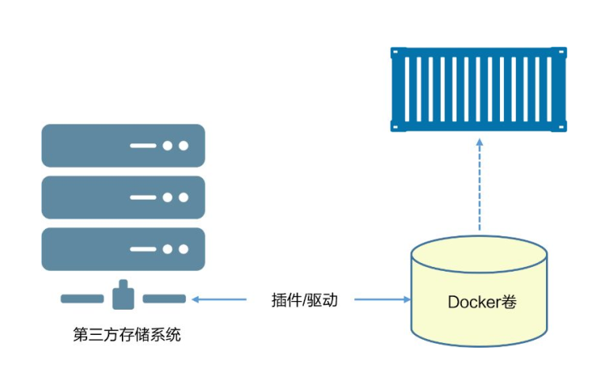

**块存储**

相对性能更高，适用于对小块数据的随机访问负载。目前支持Docker卷插件的块存储例子包括HPE 3PAR、Amazon EBS以及OpenStack块存储服务（Cinder）。

**文件存储**

括NFS和SMB协议的系统，同样在高性能场景下表现优异。支持Docker卷插件的文件存储系统包括NetApp FAS、Azure文件存储以及Amazon EFS。

**对象存储**

适用于较大且长期存储的、很少变更的二进制数据存储。通常对象存储是根据内容寻址，并且性能较低。支持Docker卷驱动的例子包括Amazon S3、Ceph以及Minio。

可以通过`docker volume ls`命令进行查看，还可以使用`docker volume inspect 卷名称`命令查看详情。

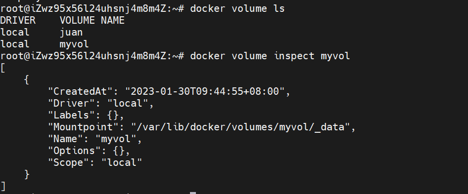

上述图片中Driver和Scope都是local，意味着卷默认使用local驱动创建，只能用于当前Docker主机上的容器。Mountpoint属性说明卷位于Docker主机上的位置，这意味着可以在Docker主机文件系统中查看卷，甚至在Docker主机中对其进行读取数据或者写入数据操作。

**删除卷**

- `docker volume prune`：会删除未装入到某个容器或者服务的所有卷，所以谨慎使用！
- `docker volume rm`：许删除指定卷。两种删除命令都不能删除正在被容器或者服务使用的卷。

#### 卷在容器和服务中使用

基于某个没有卷的系统，使用下面命令创建一个独立容器，并挂在一个卷

```bash
docker container run -dit --name voltainer \
--mount source=卷名称,target=/vol \
容器名称

```

如果指定了已经存在的卷，Docker会使用该卷。如果指定的卷不存在，Docker会创建一个卷。尽管容器和卷各自拥有独立的生命周期，Docker也不允许删除正在被容器使用的卷。

## 命令

### 汇总

```bash
# 创建卷
docker volume create 卷名称

# 查看所有卷
docker volume ls

# 查看指定卷的详细信息
docker volume inspect 卷名称

# 删除未装入到某个容器或者服务的所有卷
docker volume prune

# 删除指定卷，不能删除正在被容器或者服务使用的卷
docker volume rm 卷名称

# 挂在数据卷，容器目录映射到宿主机目录
docker run -it --privileged=true -v /宿主机绝对路径目录:/容器目录 镜像名 # 双向可读写
docker run -it --privileged=true -v /宿主机绝对路径目录:/容器目录 镜像名:ro 镜像名 # 容器内的数据readonly,只能读取宿主机同步的数据。

# 运行容器，继承其他容器卷的映射规则
docker run -it --privileged=true --volumes- from 继承的容器 镜像名
```

# Docker网络

## 简介

Docker在容器内部运行应用，这些应用之间的交互依赖于大量不同的网络，这意味着Docker需要强大的网络功能。docker对于容器之间、容器与外部网络和VLAN之间的连接均有相应的解决方案。后者对于那些需要跟外部系统（如虚拟机和物理机）的服务打交道的容器化应用来说至关重要。

为了实现开箱即用的效果，Docker封装了一系列本地驱动，覆盖了大部分常见的网络需求。其中包括单机桥接网络（Single-Host Bridge Network）、多机覆盖网络（Multi-Host Overlay），并且支持接入现有VLAN。Docker生态系统中的合作伙伴通过提供驱动的方式，进一步拓展了Docker的网络功能。

在顶层设计中，Docker网络架构由3个主要部分构成：CNM、Libnetwork和驱动。CNM是设计标准。在CNM中，规定了Docker网络架构的基础组成要素。Libnetwork是CNM的具体实现，并且被Docker采用Libnetwork通过Go语言编写，并实现了CNM中列举的核心组件。驱动通过实现特定网络拓扑的方式来拓展该模型的能力。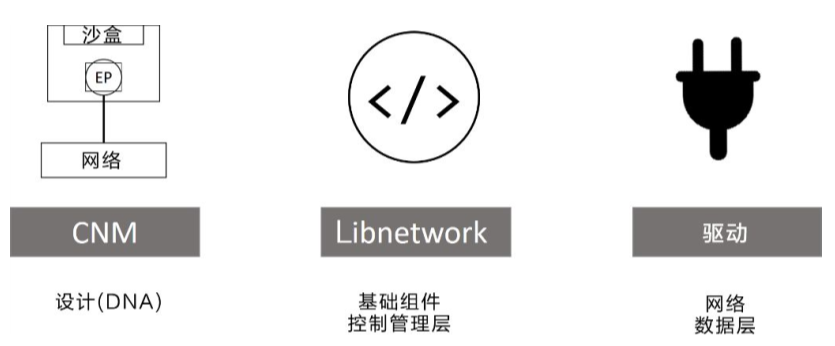

- 容器间的互联和通信以及端口映射
- 容器IP变动时候可以通过服务名称直接网络通信而不受影响

## 网络模式

网络模式：

- bridge模式：使用`--network bridge`指定，默认使用docker0
- host模式：使用`--network host`指定
- none模式：使用`--network none`指定
- container模式：使用`--network container:NAME或容器ID`指定

使用`docker inspect 容器名称或ID`可以查看当前容器的网络信息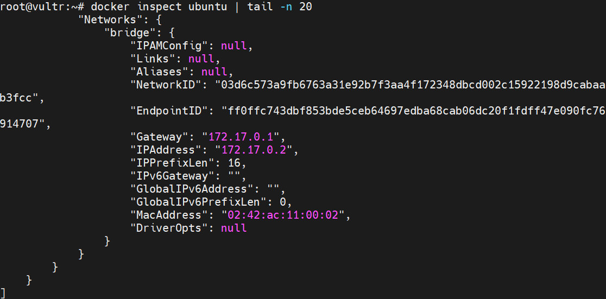如上图中的ubuntu实例使用的时桥接网络，当容器停止运行再重新启动时，IPAdress可能会发生改变。

### Bridge

Docker 服务默认会创建一个 docker0 网桥（其上有一个 docker0 内部接口），该桥接网络的名称为docker0，它在内核层连通了其他的物理或虚拟网卡，这就将所有容器和本地主机都放到同一个物理网络。Docker 默认指定了 docker0 接口 的 IP 地址和子网掩码，让主机和容器之间可以通过网桥相互通信。

Docker使用Linux桥接，在宿主机虚拟一个Docker容器网桥(docker0)，Docker启动一个容器时会根据Docker网桥的网段分配给容器一个IP地址，称为Container-IP，同时Docker网桥是每个容器的默认网关。因为在同一宿主机内的容器都接入同一个网桥，这样容器之间就能够通过容器的Container-IP直接通信。

docker run 的时候，没有指定network的话默认使用的网桥模式就是bridge，使用的就是docker0。在宿主机ifconfig,就可以看到docker0和自己create的network(后面讲)eth0，eth1，eth2……代表网卡一，网卡二，网卡三……，lo代表127.0.0.1，即localhost，inet addr用来表示网卡的IP地址

网桥docker0创建一对对等虚拟设备接口一个叫veth，另一个叫eth0，成对匹配。

- 整个宿主机的网桥模式都是docker0，类似一个交换机有一堆接口，每个接口叫veth，在本地主机和容器内分别创建一个虚拟接口，并让他们彼此联通（这样一对接口叫veth pair）；
- 每个容器实例内部也有一块网卡，每个接口叫eth0；
- docker0上面的每个veth匹配某个容器实例内部的eth0，两两配对，一一匹配。

通过上述，将宿主机上的所有容器都连接到这个内部网络上，两个容器在同一个网络下,会从这个网关下各自拿到分配的ip，此时两个容器的网络是互通的。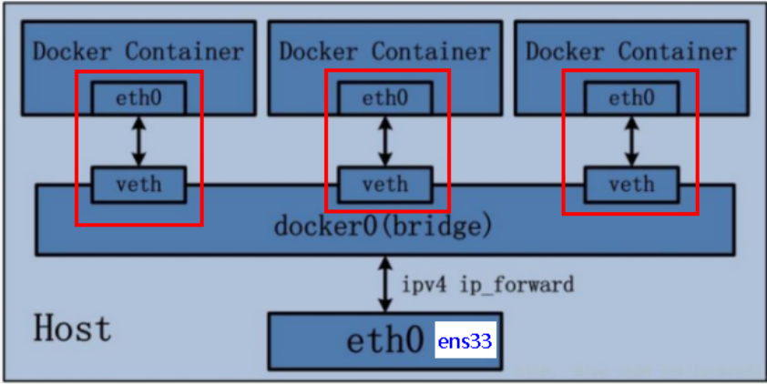

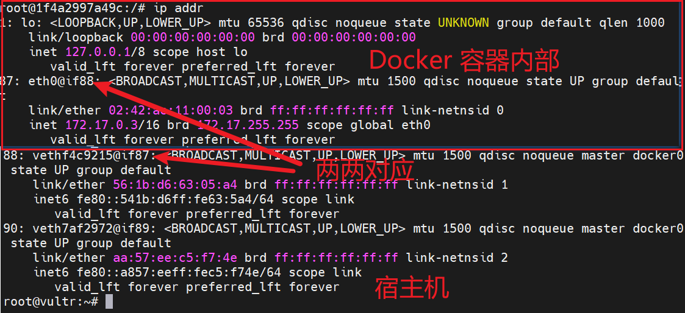如上图，宿主机中的veth与容器中的eth0相互对应

### host

直接使用宿主机的 IP 地址与外界进行通信，不再需要额外进行NAT 转换。

容器将不会获得一个独立的Network Namespace， 而是和宿主机共用一个Network Namespace。容器将不会虚拟出自己的网卡而是使用宿主机的IP和端口。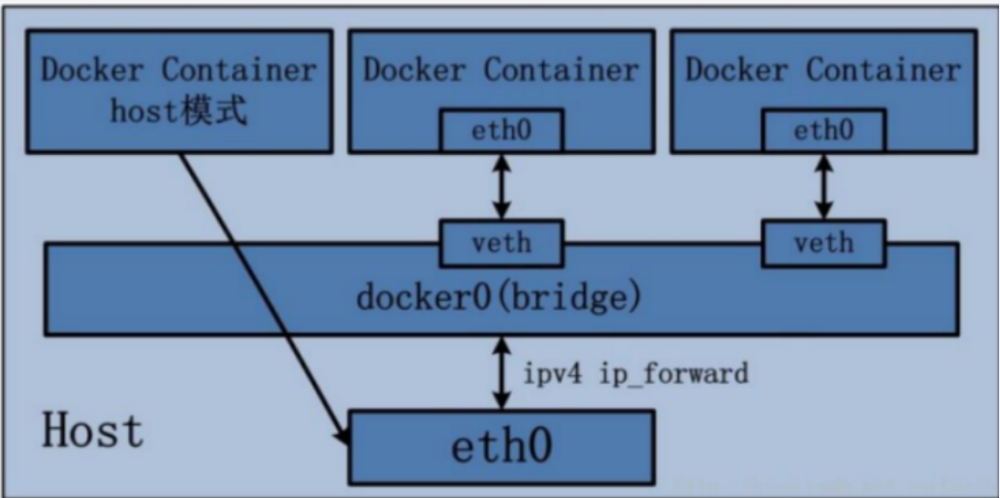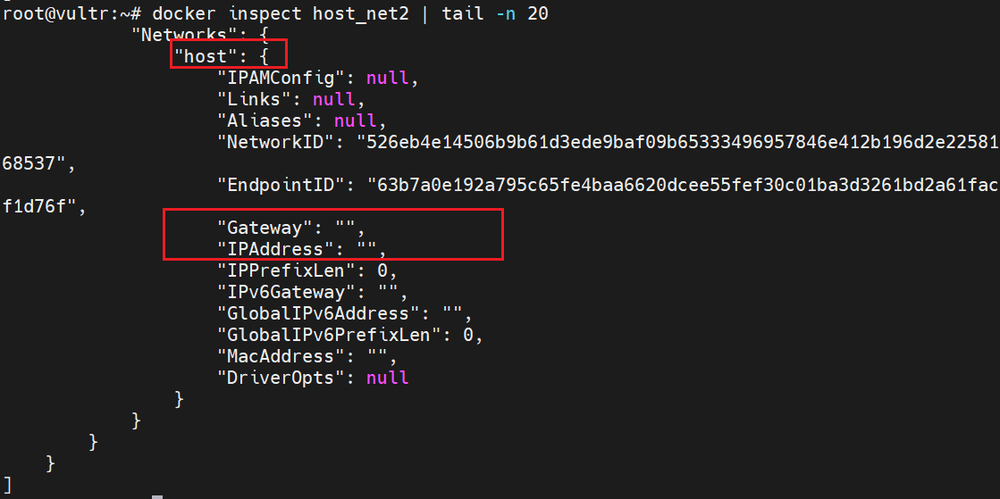没有端口映射，如何访问启动？

> 此时容器的IP借用主机的，所以容器共享宿主机网络IP，这样的好处是外部主机与容器可以直接通信。

### None

在none模式下，并不为Docker容器进行任何网络配置。 也就是说，这个Docker容器没有网卡、IP、路由等信息，只有一个lo，需要我们自己为Docker容器添加网卡、配置IP等。

禁用网络功能，只有lo标识（就是127.0.0.1表示本地回环）

### Container

container⽹络模式 

新建的容器和已经存在的一个容器共享一个网络ip配置而不是和宿主机共享。新创建的容器不会创建自己的网卡，配置自己的IP，而是和一个指定的容器共享IP、端口范围等。同样，两个容器除了网络方面，其他的如文件系统、进程列表等还是隔离的。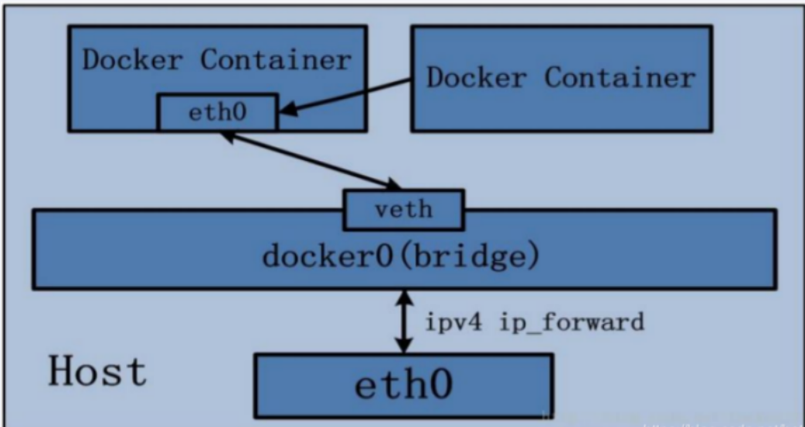

### 自定义网络

自定义桥接网络，自定义网络默认使用桥接网络bridge,使用`docker network create 自定义网络名称`可以创建自定义网络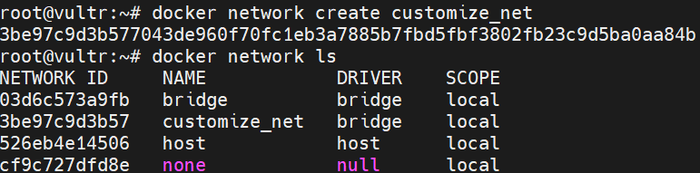

新建容器时加上自定义网络即可，如下图，创建两个ubuntu实例，使用自定义网络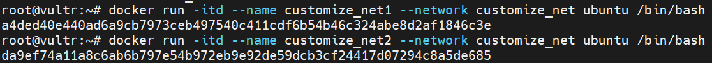

自定义网络后进入各自容器实例内部，可以按服务名直接ping通对方容器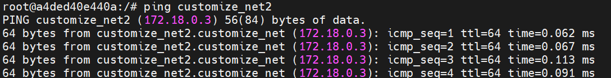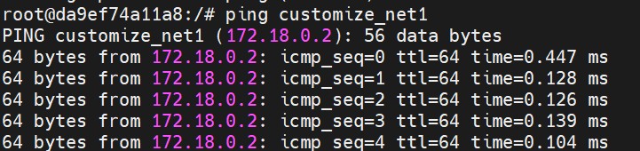

**自定义网络本身就维护好了主机名和IP的对应关系，IP和容器名称都能ping通**

## 命令汇总

```bash
# 查看网络模式
docker network ls

# 查看网络数据源
docker network inspect xxx网络名称

# 删除网络
docker network rm xxx网络名称

#  删除Docker主机上全部未使用的网络
docker network prune xxx

# 创建自定义网络
docker network create

# bridge 网络模式需要指定端口，host不需要指定端口
docker run -d -p xxxx:xxxx 镜像ID # 默认bridge模式
docker run -d --network host 镜像ID
docker run -d --network none 镜像ID
docker run -d --network container:共享的容器 镜像ID


# 安装ip addr指定
sudo apt install iproute2

# 安装ping指令
apt-get update
apt-get install inetutils-ping
```

# Docker-compose容器编排

## 简介

Compose 是 Docker 公司推出的一个工具软件，可以管理多个 Docker 容器组成一个应用。你需要定义一个 YAML 格式的配置文件docker-compose.yml，写好多个容器之间的调用关系。然后，只要一个命令，就能同时启动/关闭这些容器，负责实现对Docker的容器集群的快速编排

docker建议我们每一个容器中只运行一个服务,因为docker容器本身占用资源极少,所以最好是将每个服务单独的分割开来但是这样我们又面临了一个问题？如果我需要同时部署好多个服务,难道要每个服务单独写Dockerfile然后在构建镜像,构建容器,这样累都累死了,所以docker官方给我们提供了docker-compose多服务部署的工具。例如要实现一个Web微服务项目，除了Web服务容器本身，往往还需要再加上后端的数据库mysql服务容器，redis服务器，注册中心eureka，甚至还包括负载均衡容器等等。。。。。。

 Compose允许用户通过一个单独的docker-compose.yml模板文件（YAML 格式）来定义一组相关联的应用容器为一个项目（project）可以很容易地用一个配置文件定义一个多容器的应用，然后使用一条指令安装这个应用的所有依赖，完成构建。Docker-Compose 解决了容器与容器之间如何管理编排的问题。

## 基本步骤

### 安装

```bash
# 安装
curl -SL "https://github.com/docker/compose/releases/download/2.17.2/docker-compose-$(uname -s)-$(uname -m)" -o /usr/local/bin/docker-compose

# 授权
chmod +x /usr/local/bin/docker-compose

# 查看版本
docker-compose --version

# 卸载
sudo rm /usr/local/bin/docker-compose
```

### 核心概念

- 一个文件：docker-compose.yml
- 两个要素：
  - 服务(service)：一个个应用实例，微服务，mysql容器，redis容器等。
  - 工程(project)：由一组关联的应用容器组成的一个完整业务单元，在docker-compose.yml文件种定义。

### 使用步骤

1. 编写Dockerfile定义各个微服务应用并构建出对应的镜像文件
2. 使用docker-compose.yml定义一个完整业务单元，安排好整体应用种的各个容器服务。
3. 执行docker-compose up命令来启动并运行整个应用程序，完成一键部署上线。

## 常用命令

```bash
# 查看帮助
docker-compose -h

# 启动所有docker-compose服务
docker-compose up
docker-compose up -d # 后台运行

# 停止并删除容器、网络、卷、镜像
docker-compose down

# 进入容器实例内部
docker-compose exec yml中的服务ID

# 展示当前docker-compose编排过的运行的所有容器
docker-compose ps

# 展示当前docker-compose编排过的容器进程
docker-compose top

# 查看容器输出的日志
docker-compose logs yml里面的服务id

# 检查配置
docker-compose config
docker-compose config -q # 检查配置，有问题才输出

# 重启/启动/停止服务
docker-compose restart
docker-compose start
docker-compose stop
```


