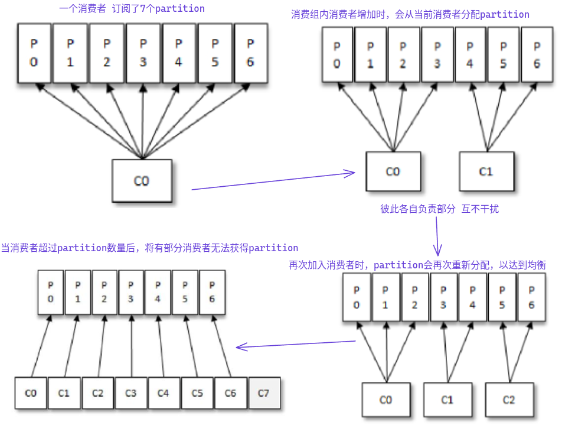
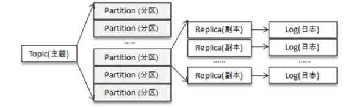
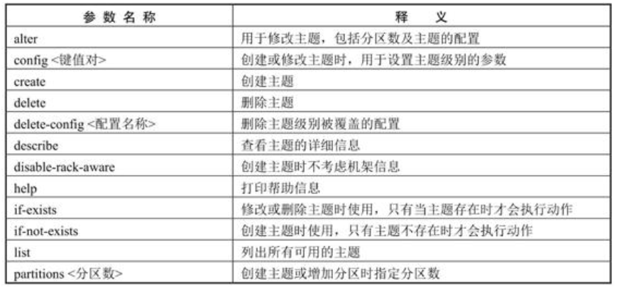

# 初识Kafka

Kafka的三大角色：

- 消息系统：具备系统解耦、冗余存储、流量消峰、缓冲、异步通信、扩展性、可恢复性等功能；还有其他消息系统难以实现的消息顺序性保障及回溯消费的功能
- 存储系统：消息持久化到磁盘，相比于其他内存存储的系统而言，有效地降低了数据丢失的风险。消息持久化功能和多副本机制
- 流式处理平台：为每个流行的流式处理框架提供了可靠的数据来源，提供了完整的流式处理类库。

## 基本概念

### 典型的Kafka架构

- 若干Producer：将消息发送到Broker
- 若干broker：负责将受到的消息存储到磁盘中
- 若干Consumer：负责从Broker订阅并消费消息
- 一个ZooKeeper集群


### 消息追加写入

- 每一条消息被发送到broker之前，会根据分区规则选择存储到哪个具体的分区
- 分区规则设定得合理，所有消息都可以均匀地分配到不同的分区中
- 如果一个主题只对应一个文件，则这个文件的I/O将成为性能瓶颈，分区解决了这个问题
-  在创建主题时，可以通过指定参数来设置分区的个数，也可以主题创建完后修改分区数，通过增加分区数量可以实现水平扩展

### 分区多副本机制

- 分区引入了多副本机制，通过增加副本数量可以提升容灾能力
- 同意分区的不同副本中保存的是相同的消息
- 副本之间是一主多从的关系
- leader副本负责处理读写请求，follower副本只负责与leader副本的消息同步
- 副本处于不同的broker中，leader副本故障时，从follower副本中重新选举新的leader
- 通过多副本机制实现了故障的自动转移，当Kafka集群中某个broker失效时仍能保证服务可用


Kafka消费端也具备一定的容灾能力：

- Consumer使用pull模式从服务端拉取消息，并且保存消费的具体位置
- 消费者宕机后恢复上线时可以根据之前保存的offest重新拉去需要的消息进行消费

分区中的所有副本统称为AR：

- ISR(In-Syns Replicas)：所有与leader保持一定程度同步的副本  (含leader)
- OSR(Out-of-Sync Replicas)：与leader副本同步滞后过多的副本（不含leader）
- AR=ISR+OSR,同步程度可以 通过参数进行配置
- leader副本负责维护和耿总ISR中所有follower的滞后状态，当滞后过多或失效时，会将它从ISR中剔除
- 如果OSR中follower追上了leader，则leader会将他从OSR转至ISR
- 默认情况下，当leader副本发生故障时，只有在ISR集合中的副本才有资格被选举为新的leader，OSR中的副本没机会，该规则可以通过修改相应的参数配置来改变。

ISR与HW和LEO也有紧密的相关性：


- HW（High Watermarj）：高水位，标识了一个特定的offset，消费者只能拉去该offest之前的消息
- LEO（Log End Offset）：当前日志文件中下一条待写入消息的offest，LEO的大小相当于当前日志分区中最后一条消息的offset+1

分区ISR中每个副本都会维护自身的LEO，而ISO集合中最小的LEO即为分区的HW：

复制机制不是完全的同步复制，也不是单纯的异步复制：

- 同步复制：要求所有能工作的follower副本都复制完，消息才会被却认为已成功提交

  > 极大影响性能

- 异步复制：数据只要被leader副本写入就被认为已经成功提交

  > 如果follower没复制玩，leader就宕机了，则会造成数据丢失

## Kafka术语

- 发布订阅的对象是主题（topic）：可以为每个业务、每个应用甚至是每类数据都创建专属的主题

- 向主题发布消息的客户端称为生产者(Producer)

- 订阅主题消息的应用称为消费者（Consumer）

- 生产者和消费者统称为客户端（Clients）

- 一个Kafka集群由多个Broker组成：Broker负责接收和处理客户端发送过来的请求，以及对消息进行持久化

  > 通常Broker分散运行在不同的机器上

- 实现高可用的另一个手段就是备份机制（Replication）：副本分为领导者副本（leader Replication）和追随者（Follower Replica）副本。

  > 领导者副本对外提供服务，追随者不对外提供服务

- 分区机制将每个主题划分成多个分区（Partition），每个分区是一组有序的消息日志

  > 生产者生产的每条消息只会被发送到一个分区中

- 每个分区可以配置若干个副本

- 消费者位移：Consumer Offset。表征消费者消费进度，每个消费者都有自己的消费者位移。

- 消费者组：Consumer Group。多个消费者实例共同组成的一个组，同时消费多个分区以实现高吞吐。

- 重平衡：Rebalance。消费者组内某个消费者实例挂掉后，其他消费者实例自动重新分配订阅主题分区的过程。Rebalance 是 Kafka 消费者端实现高可用的重要手段。

## 安装Kafka

### Ubuntu

```bash
# 1. 为kafka创建一个专有账号，确保不会因为kafka被破坏而影响ubuntu
sudo adduser kafka
sudo adduser kafka sudo # 将用户添加到sudo组中
su -l kafka # 切换到新创建的用户

# 先确保是否有java环境，没有则安装java环境、https://openjdk.org/可以查看最新版本
sudo apt update
sudo apt install openjdk-11-jdk

# 如果装了java环境还不成功，可能是java没有加入到环境变量中
export JAVA_HOME=/path/to/java/installation

# 下载kafka压缩文件、https://kafka.apache.org/downloads
wget https://downloads.apache.org/kafka/3.5.1/kafka-3.5.1-src.tgz

# 解压缩文件包
tar -zxvf kafka_xxxx.tgz

# 移动文件夹到opt目录下，并重命名
mv kafka.xxxx /opt

# 修改配置文件
vim /opt/kafka/config/server.properties # 注意修改下面的配置
broker.id = 0 # broker的编号，如果集群中有多个broker，则必须唯一
listeners=PLAINTEXT://0.0.0.0:9092 # broker对外提供服务入口的地址
advertised.listeners=PLAINTEXT://203.0.113.10:9092 # 配置成kafka运行的云服务器ip地址
log.dirs=/opt/kafka/logs/ # 指定log存放的文件夹
zookeeper.connect=0.0.0.0:2181 # kafka所需要的ZooKeeper集群地址

# 进入kafak目录、启动kafka
bin/kafka-server-start.sh config/server.properties
```

### 目录文件

- bin：包含了所有的可执行脚本，启动broker、producer、consumer等的脚本

- config：包含了Kafka和Zookeeper的配置文件

  > - server.properties：Kafka的主配置文件

- libs：Kafka运行所需要的所有jar文件

- site-docs：与Kafka相关的文档，如API文档

- licenses：Kafka及其依赖库的许可证相关的文档

## 服务器参数配置

配置参数在`config/server.properties`文件中

- zookeeper.connect：
  - broker要连接的ZooKeeper集群的服务地址（包含端口号），没有默认值，必填项
  - ZooKeeper集群中有多个节点，则可以用逗号将每个节点隔开，类似于 localhost1：2181，localhost2：2181，localhost3：2181这种格式。
- **listeners**：
  - 指明broker监听客户端连接的地址列表
  - 配置格式为 protocol1：//hostname1：port1，protocol2：//hostname2：port2，
  - protocol代表协议类型，Kafka当前支持的协议类型有PLAINTEXT、SSL、SASL_SSL等
  - 未开启安全认证，则使用简单的PLAINTEXT即可。
- advertised.listeners：
  - 和listeners类似，主要用于 IaaS（Infrastructure as a Service）环境，比如公有云上的机器通常配备有多块网卡，即包含私网网卡和公网网卡
  - 可以设置advertised.listeners参数绑定公网IP供外部客户端使用，而配置listeners参数来绑定私网IP地址供broker间通信使用。
- **broker.id**：
  - 指定Kafka集群中broker的唯一标识，默认值为-1，如果没有设置，那么Kafka会自动生成一个。
  - 和meta.properties文件及服务端参数broker.id.generation.enable和reserved.broker.max.id有关
- **log.dir和log.dirs**：
  - 配置 Kafka 日志文件存放的根目录。
  - 一般情况下，log.dir 用来配置单个根目录，而 log.dirs 用来配置多个根目录（以逗号分隔），log.dir和log.dirs都可以用来配置单个或多个根目录
  - log.dirs 的优先级比log.dir 高，如果没有配置log.dirs，则会以 log.dir 配置为准。默认情况下只配置了 log.dir 参数，其默认值为/tmp/kafka-logs。
- **message.max.bytes**：
  - 指定broker所能接收消息的最大值，默认值为1000012（B），约等于976.6KB。
  - 大于这个参数所设置的值会报出RecordTooLargeException的异常
  - 修改这个参数，那么还要考虑max.request.size （客户端参数）、max.message.bytes（topic端参数）等参数的影响。
  - 为了避免修改此参数而引起级联的影响，建议在修改此参数之前考虑分拆消息的可行性。

# 生产者消费者

## 消费者与消费组

### 概念

消费者（Consumer）负责订阅Kafka中的主题（Topic），并且从订阅的主题上拉取消息，在Kafka的消费理念中还有一层消费组（Consumer Group）的概念，每个消费者都有一个对应的消费组。消息发布到主题后，只会被投递给订阅它的每个消费组中的一个消费者。


## 消费者变动



- 以上分配逻辑基于默认的分区分配策略
- 可以通过消费者客户端参数来设置消费者与主题之间的分区策略

## P2P 与Pub/Sub

- P2P（point to point）：基于队列
  - 生产者发送消息到消息队列，消费者从队列中接受消息
  - 所有消费者隶属于同一消费组，消息被均衡地投递给每一个消费者
- Pub/SUb：发布订阅定义了如何像一个内容节点发布和订阅消息
  - 内容节点称为Topic，topic可以认为是消息传递的中介
  - 将消息发布到某个主题，订阅这从主题订阅消息，相互独立
  - 所有消费者都隶属于不同的消费组，消息将被广播给所有消费者

# 主题与分区

## 概念

- 分区可以有一个至多个副本
- 每个副本对应一个日志文件
- 每个日志文件对应一至多个日志分段LogSegment
- 每个日志分段可以细分为索引文件、日志存储文件和快照文件


## 主题管理

- kafka提供了`kafka-topics.sh`脚本来执行这些操作，脚本位于`$KAFKA_HOME/bin/`目录下：
- hickey通过KafkaAdminClient的方式实现
- 还可以通过直接操纵日志文件和ZooKeeper节点来实现

**创建主题：**

- 配置参数`auto.create.topics.enable`设置为true（默认值就是true）
- 生产者向一个尚未创建的主题发送消息，会自动创建一个分区数为`num.partitions`（默认1）、副本因子为`default.replication.factor`（默认1）的主题
- 消费者从未知主题中发送元数据请求，都会创建一个相应的主题
- 非特殊应用需求，不建议将`auto.create.topics.enable`设置为true
- kafka会在log.dir或log.dirs配置参数的目录下创建相应的主题分区，默认目录为`/tmp/kafka-logs/`
- 主题和分区是提供给上层用户的抽象，在副本层面/Log层面才有实际物理上的存在
- 同一个分区中的多个副本必须分布在不同的broker中，这样才能有效的数据冗余



- 不仅可以通过日志文件的根目录查看集群中各个broker的分区副本的分配情况，还可以tongueZooKeeper客户端来获取
- 主题的命名不对前使用双下划线开头，双下划线开头主题一般看作kafka的内部主题

**查看主题：**

- 通过list指令可以查看当前所有可用的主题
- 通过describe指令可以查看单个主题的信息，不指定--topic则展示所有主题的详细信息
- 使用describe指令可以额外指定topics-with-overrides、under-replicated-partitions和unavailable-partitions这三个参数来增加一些附加功能。
- 增加topics-with-overrides参数可以找出所有包含覆盖配置的主题，它只会列出包含了与集群不一样配置的主题
- under-replicated-partitions和unavailable-partitions参数都可以找出有问题的分区。
- under-replicated-partitions 参数可以找出所有包含失效副本的分区。包含失效副本的分区可能正在进行同步操作，也有可能同步发生异常，此时分区的ISR集合小于 AR 集合。
-  unavailable-partitions 参数可以查看主题中没有 leader 副本的分区，这些分区已经处于离线状态，对于外界的生产者和消费者来说处于不可用的状态。

**修改主题：**

- 修改的功能就是由kafka-topics.sh脚本中的alter指令提供的
- 增加分区数时会影响既定消息的顺序，基于key计算的主题而言，建议在一开始就设置好分区数量，避免以后对其进行调整。
- 目前Kafka只支持增加分区数而不支持减少分区数。
- 还可以使用kafka-topics.sh脚本的alter指令来变更主题的配置，可以通过alter指令配合config参数增加或修改一些配置以覆盖它们配置原有的值。
- 通过delete-config参数来删除之前覆盖的配置，使其恢复原有的默认值。

**配置管理：**

- kafka-configs.sh 脚本是专门用来对配置进行操作的，这里的操作是指在运行状态下修改原有的配置
- kafka-configs.sh脚本包含变更配置alter和查看配置describe这两种指令类型。
- 同使用kafka-topics.sh脚本变更配置的原则一样，增、删、改的行为都可以看作变更操作
- 不仅可以支持操作主题相关的配置，还可以支持操作broker、用户和客户端这3个类型的配置。
- 使用entity-type参数来指定操作配置的类型，并且使用entity-name参数来指定操作配置的名称。
- --describe指定了查看配置的指令动作，--entity-type指定了查看配置的实体类型，--entity-name指定了查看配置的实体名称。
- 使用alter指令变更配置时，需要配合add-config和delete-config这两个参数一起使用。
- add-config参数用来实现配置的增、改，即覆盖原有的配置；
- delete-config参数用来实现配置的删，即删除被覆盖的配置以恢复默认值。

**主题参数：**

- 与主题相关的所有配置参数在 broker 层面都有对应参数，可以在创建主题时覆盖相应参数的默认值，也可以在创建完主题之后变更相应参数的默认值。


**删除主题：**

- 确定不再使用一个主题，那么最好的方式是将其删除，这样可以释放一些资源，比如磁盘、文件句柄等
- kafka-topics.sh脚本中的delete指令就可以用来删除主题
- 必须将delete.topic.enable参数配置为true才能够删除主题，这个参数的默认值就是true，如果配置为false，那么删除主题的操作将会被忽略。
- 要删除的主题是 Kafka 的内部主题，那么删除时就会报错。
- kafka-topics.sh脚本删除主题的行为本质上只是在ZooKeeper中的/admin/delete_topics 路径下创建一个与待删除主题同名的节点，以此标记该主题为待删除的状态。
- 与创建主题相同的是，真正删除主题的动作也是由Kafka的控制器负责完成的。
- 删除主题是一个不可逆的操作。一旦删除之后，与其相关的所有消息数据会被全部删除



## 分区管理

### 优先副本的选举

分区使用多副本机制来提升可靠性，但只有leader副本对外提供读写服务，而follower副本只负责在内部进行消息的同步。如果一个分区的leader副本不可用，那么就意味着整个分区变得不可用，此时就需要Kafka从剩余的follower副本中挑选一个新的leader副本来继续对外提供服务。

创建主题的时候，该主题的分区及副本会尽可能均匀地分布到 Kafka 集群的各个broker节点上，对应的leader副本的分配也比较均匀。

- 分区的leader节点发生故障时，其中一个follower节点就会成为新的leader节点，这样就会导致集群的负载不均衡，从而影响整体的健壮性和稳定性。
- 当原来的leader节点恢复之后重新加入集群时，它只能成为一个新的follower节点而不再对外提供服务
- 为了能够有效地治理负载失衡的情况，Kafka引入了优先副本（preferred replica）的概念
- 如果leader分布过于集中，就会造成集群负载不均衡。Kafka要确保所有主题的优先副本在Kafka集群中均匀分布
- 分区平衡并不意味着Kafka集群的负载均衡，因为还要考虑集群中的分区分配是否均衡
- Kafka 自动平衡功能对应的 broker 端参数是 auto.leader.rebalance.enable，此参数的默认值为true
- Kafka 的控制器会启动一个定时任务，这个定时任务会轮询所有的 broker节点，计算每个broker节点的分区不平衡率（broker中的不平衡率=非优先副本的leader个数/分区总数）是否超过leader.imbalance.per.broker.percentage参数配置的比值，默认值为 10%
- 超过设定的比值则会自动执行优先副本的选举动作以求分区平衡。执行周期由参数leader.imbalance.check.interval.seconds控制，默认值为300秒，即5分钟。
- 生产环境中不建议将auto.leader.rebalance.enable设置为默认的true，因为这可能引起负面的性能问题，也有可能引起客户端一定时间的阻塞。
- 执行的时间无法自主掌控，如果在关键时期（比如电商大促波峰期）执行关键任务的关卡上执行优先副本的自动选举操作，势必会有业务阻塞、频繁超时之类的风险。
- Kafka中kafka-perferred-replica-election.sh脚本提供了对分区leader副本进行重新平衡的功能。优先副本的选举过程是一个安全的过程，Kafka客户端可以自动感知分区leader副本的变更。

### 分区从新分配

当集群中的一个节点突然宕机下线时，如果节点上的分区是单副本的，那么这些分区就变得不可用了，在节点恢复前，相应的数据也就处于丢失状态；如果节点上的分区是多副本的，那么位于这个节点上的leader副本的角色会转交到集群的其他follower副本中。

Kafka 并不会将这些失效的分区副本自动地迁移到集群中剩余的可用broker节点上，如果放任不管，则不仅会影响整个集群的均衡负载，还会影响整体服务的可用性和可靠性。

当要对集群中的一个节点进行有计划的下线操作时，为了保证分区及副本的合理分配，我们也希望通过某种方式能够将该节点上的分区副本迁移到其他的可用节点上。

Kafka提供了 kafka-reassign-partitions.sh 脚本来执行分区重分配的工作，它可以在集群扩容、broker节点失效的场景下对分区进行迁移：

1. 创建需要一个包含主题清单的JSON 文件
2. 根据主题清单和 broker 节点清单生成一份重分配方案
3. 根据这份方案执行具体的重分配动作。

### 复制限流

数据复制会占用额外的资源，如果重分配的量太大必然会严重影响整体的性能，尤其是处于业务高峰期的时候。减小重分配的粒度，以小批次的方式来操作是一种可行的解决思路。如果集群中某个主题或某个分区的流量在某段时间内特别大，那么只靠减小粒度是不足以应对的，这时就需要有一个限流的机制，可以对副本间的复制流量加以限制来保证重分配期间整体服务不会受太大的影响。

副本间的复制限流有两种实现方式：kafka-config.sh脚本和kafka-reassign-partitions.sh脚本：

- kafka-config.sh脚本主要以动态配置的方式来达到限流的目的
- broker级别有两个与复制限流相关的配置参数：follower.replication.throttled.rate和leader.replication.throttled.rate,前者用于设置follower副本复制的速度，后者用于设置leader副本传输的速度，它们的单位都是B/s。
- 主题级别也有两个相关的参数来限制复制的速度：leader.replication.throttled.replicas 和 follower.replication.throttled.replicas，它们分别用来配置被限制速度的主题所对应的leader副本列表和follower副本列表。

### 修改副本因子

创建主题之后我们还可以修改分区的个数，同样可以修改副本因子（副本数）。修改副本因子的使用场景也很多，比如在创建主题时填写了错误的副本因子数而需要修改，再比如运行一段时间之后想要通过增加副本因子数来提高容错性和可靠性。

修改副本因子的功能也是通过重分配所使用的 kafka-reassign-partition.sh 脚本实现的

### 分区数测试

性能与分区数有着必然的关系，在设定分区数时一般也需要考虑性能的因素，Kafka 本身提供的用于生产者性能测试的 kafka-producer-perf-test.sh和用于消费者性能测试的kafka-consumer-perf-test.sh：

- topic用来指定生产者发送消息的目标主题
- num-records 用来指定发送消息的总条数
- record-size 用来设置每条消息的字节数
- producer-props 参数用来指定生产者的配置
- 可同时指定多组配置，各组配置之间以空格分隔，与producer-props参数对应的还有一个producer.config参数用来指定生产者的配置文件
- throughput用来进行限流控制，当设定的值小于0时不限流，当设定的值大于0时，当发送的吞吐量大于该值时就会被阻塞一段时间
- print-metrics指定了这个参数时会在测试完成之后打印很多指标信息，对很多测试任务而言具有一定的参考价值

分区是Kafka 中最小的并行操作单元，对生产者而言，每一个分区的数据写入是完全可以并行化的，对消费者而言，Kafka 只允许单个分区中的消息被一个消费者线程消费，一个消费组的消费并行度完全依赖于所消费的分区数。

### 分区数的上限

一味地增加分区数并不能使吞吐量一直得到提升，并且分区数也并不能一直增加，如果超过默认的配置值，还会引起Kafka进程的崩溃。

对于一个高并发、高性能的应用来说，1024 或 4096 的文件描述符限制未免太少，可以适当调大这个参数。比如使用 ulimit-n 65535 命令将上限提高到65535，这样足以应对大多数的应用情况，再高也完全没有必要了。

limits.conf文件修改之后需要重启才能生效。limits.conf文件与ulimit命令的区别在于前者是针对所有用户的，而且在任何shell中都是生效的，即与shell无关，而后者只是针对特定用户的当前shell的设定
