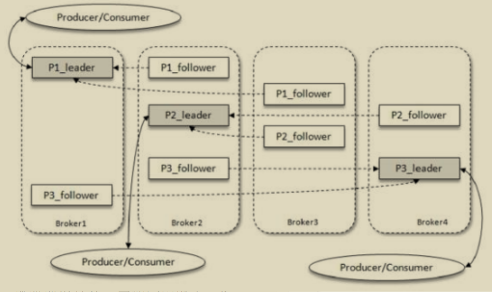
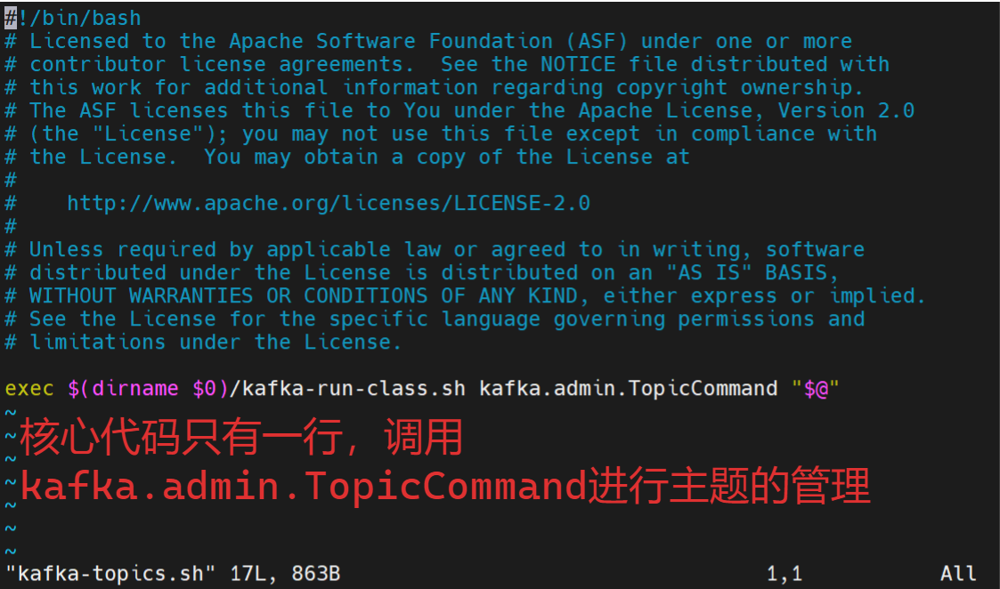

# 初识Kafka

Kafka的三大角色：

- 消息系统：具备系统解耦、冗余存储、流量消峰、缓冲、异步通信、扩展性、可恢复性等功能；还有其他消息系统难以实现的消息顺序性保障及回溯消费的功能
- 存储系统：消息持久化到磁盘，相比于其他内存存储的系统而言，有效地降低了数据丢失的风险。消息持久化功能和多副本机制
- 流式处理平台：为每个流行的流式处理框架提供了可靠的数据来源，提供了完整的流式处理类库。

## 基本概念

### 典型的Kafka架构

- 若干Producer：将消息发送到Broker
- 若干broker：负责将受到的消息存储到磁盘中
- 若干Consumer：负责从Broker订阅并消费消息
- 一个ZooKeeper集群


### 主题与分区


### 消息追加写入

- 每一条消息被发送到broker之前，会根据分区规则选择存储到哪个具体的分区
- 分区规则设定得合理，所有消息都可以均匀地分配到不同的分区中
- 如果一个主题只对应一个文件，则这个文件的I/O将成为性能瓶颈，分区解决了这个问题
-  在创建主题时，可以通过指定参数来设置分区的个数，也可以主题创建完后修改分区数，通过增加分区数量可以实现水平扩展

### 分区多副本机制

- 分区引入了多副本机制，通过增加副本数量可以提升容灾能力
- 同意分区的不同副本中保存的是相同的消息
- 副本之间是一主多从的关系
- leader副本负责处理读写请求，follower副本只负责与leader副本的消息同步
- 副本处于不同的broker中，leader副本故障时，从follower副本中重新选举新的leader
- 通过多副本机制实现了故障的自动转移，当Kafka集群中某个broker失效时仍能保证服务可用



Kafka消费端也具备一定的容灾能力：

- Consumer使用pull模式从服务端拉取消息，并且保存消费的具体位置
- 消费者宕机后恢复上线时可以根据之前保存的offest重新拉去需要的消息进行消费

分区中的所有副本统称为AR：

- ISR(In-Syns Replicas)：所有与leader保持一定程度同步的副本  (含leader)
- OSR(Out-of-Sync Replicas)：与leader副本同步滞后过多的副本（不含leader）
- AR=ISR+OSR,同步程度可以 通过参数进行配置
- leader副本负责维护和耿总ISR中所有follower的滞后状态，当滞后过多或失效时，会将它从ISR中剔除
- 如果OSR中follower追上了leader，则leader会将他从OSR转至ISR
- 默认情况下，当leader副本发生故障时，只有在ISR集合中的副本才有资格被选举为新的leader，OSR中的副本没机会，该规则可以通过修改相应的参数配置来改变。

ISR与HW和LEO也有紧密的相关性：


- HW（High Watermarj）：高水位，标识了一个特定的offset，消费者只能拉去该offest之前的消息
- LEO（Log End Offset）：当前日志文件中下一条待写入消息的offest，LEO的大小相当于当前日志分区中最后一条消息的offset+1

分区ISR中每个副本都会维护自身的LEO，而ISO集合中最小的LEO即为分区的HW：

复制机制不是完全的同步复制，也不是单纯的异步复制：

- 同步复制：要求所有能工作的follower副本都复制完，消息才会被却认为已成功提交

  > 极大影响性能

- 异步复制：数据只要被leader副本写入就被认为已经成功提交

  > 如果follower没复制玩，leader就宕机了，则会造成数据丢失

## Kafka术语

- 发布订阅的对象是主题（topic）：可以为每个业务、每个应用甚至是每类数据都创建专属的主题

- 向主题发布消息的客户端称为生产者(Producer)

- 订阅主题消息的应用称为消费者（Consumer）

- 生产者和消费者统称为客户端（Clients）

- 一个Kafka集群由多个Broker组成：Broker负责接收和处理客户端发送过来的请求，以及对消息进行持久化

  > 通常Broker分散运行在不同的机器上

- 实现高可用的另一个手段就是备份机制（Replication）：副本分为领导者副本（leader Replication）和追随者（Follower Replica）副本。

  > 领导者副本对外提供服务，追随者不对外提供服务

- 分区机制将每个主题划分成多个分区（Partition），每个分区是一组有序的消息日志

  > 生产者生产的每条消息只会被发送到一个分区中

- 每个分区可以配置若干个副本

- 消费者位移：Consumer Offset。表征消费者消费进度，每个消费者都有自己的消费者位移。

- 消费者组：Consumer Group。多个消费者实例共同组成的一个组，同时消费多个分区以实现高吞吐。

- 重平衡：Rebalance。消费者组内某个消费者实例挂掉后，其他消费者实例自动重新分配订阅主题分区的过程。Rebalance 是 Kafka 消费者端实现高可用的重要手段。

## 安装Kafka

### Ubuntu

```bash
# 1. 为kafka创建一个专有账号，确保不会因为kafka被破坏而影响ubuntu
sudo adduser kafka
sudo adduser kafka sudo # 将用户添加到sudo组中
su -l kafka # 切换到新创建的用户

# 先确保是否有java环境，没有则安装java环境、https://openjdk.org/可以查看最新版本
sudo apt update
sudo apt install openjdk-11-jdk

# 如果装了java环境还不成功，可能是java没有加入到环境变量中
export JAVA_HOME=/path/to/java/installation

# 下载kafka压缩文件、https://kafka.apache.org/downloads
wget https://downloads.apache.org/kafka/3.5.1/kafka-3.5.1-src.tgz

# 解压缩文件包
tar -zxvf kafka_xxxx.tgz

# 移动文件夹到opt目录下，并重命名
mv kafka.xxxx /opt

# 修改配置文件
vim /opt/kafka/config/server.properties # 注意修改下面的配置
broker.id = 0 # broker的编号，如果集群中有多个broker，则必须唯一
listeners=PLAINTEXT://0.0.0.0:9092 # broker对外提供服务入口的地址
advertised.listeners=PLAINTEXT://203.0.113.10:9092 # 配置成kafka运行的云服务器ip地址
log.dirs=/opt/kafka/logs/ # 指定log存放的文件夹
zookeeper.connect=0.0.0.0:2181 # kafka所需要的ZooKeeper集群地址

# 进入kafak目录、启动kafka
bin/kafka-server-start.sh config/server.properties
```

### 目录文件

- bin：包含了所有的可执行脚本，启动broker、producer、consumer等的脚本

- config：包含了Kafka和Zookeeper的配置文件

  > - server.properties：Kafka的主配置文件

- libs：Kafka运行所需要的所有jar文件

- site-docs：与Kafka相关的文档，如API文档

- licenses：Kafka及其依赖库的许可证相关的文档

## 生产者与消费者

# 主题与分区

## 主题的管理

主题的管理主要包括：

- 创建主题
- 查看主题信息
- 修改主题
- 删除主题

可以通过Kafka提供的kafka-topics.sh脚本执行这些操作，脚本位于$KAFKA_HOME/bin/目录下：除了使用该方法，还可以使用其他方法进行主题管理：

- KafkaAdminClient的方式

  > 实质上是通过发送CreateTopicsRequest、DeleteTopicsRequest等请求来实现

- 还可以通过直接操纵日志文件和ZooKeeper节点来实现

### 主题创建

如果Broker配置参数中auto.create,topics.enable设置为True(默认)，那么生产者向一个尚未创建的主题发送消息是，会自动创建一个分区数为num.partitions(默认1)、副本因子为default.replication.factor(默认1)的主题，当一个消费者从位置主题中读取或发送消息时，都会按照配置参数来创建一个相应的主题，这种行为是非预期的，通常不建议将auto.create。topics.enable参数设置为true。通用的方式是通过kafka-topics.sh脚本来创建主题
