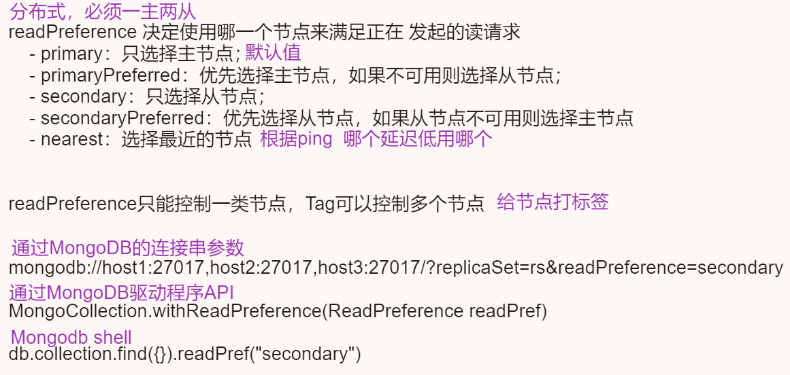
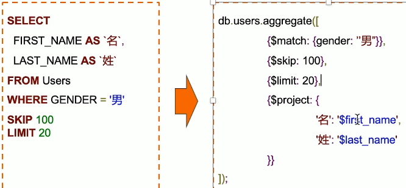

# 安装

## docker

```bash
docker pull mongo:latest

sudo mkdir -p /root/mongodb/datadb

sudo chmod 777 -R /root/mongodb/datadb

docker run -d --name mongodb -p 27018:27017 -v /root/mongodb/datadb:/data/db -e MONGO_INITDB_ROOT_USERNAME=hsiangya -e MONGO_INITDB_ROOT_PASSWORD=xy159951 --privileged=true --restart always mongo
```

## Ubunutu

```bash
sudo apt update && sudo apt upgrade -y

sudo apt install mongodb

sudo systemctl status mongodb
sudo systemctl stop mongodb
sudo systemctl start mongodb
sudo systemctl restart mongodb

# 是否跟随系统启动，默认启用
sudo systemctl disable mongodb
sudo systemctl enable mongodb

# shell
mongo

# 卸载
sudo systemctl stop mongodb
sudo apt purge mongodb
sudo apt autoremove

# 创建用户
use admin
db.createUser(
  {
    user: "username",
    pwd: "password",
    roles: [ { role: "root", db: "admin" } ]
  }
)
db.auth("usernam","password") # 验证是否成功

# 配置信息
sudo vim /etc/mongod.conf

# 开启身份验证\本地bing 127.0.0.1改成0.0.0.0
security:
  authorization: enabled
```


# 基本操作

## 认证

### 进入mongo

```bash
# 启动时开启认证
mongod -f /data/mongodb_data/27017/conf/mongodb.conf --fork --auth

# 登录时
mongo -u hsiangya -p xy159951 --authenticationDatabase admin
```


### 内置权限

| Permission           | Description                                                  |
| -------------------- | ------------------------------------------------------------ |
| root                 | 只在admin数据库中可用。拥有对MongoDB的所有权限               |
| read                 | 允许用户读取指定数据库                                       |
| readWrite            | 允许用户读写指定数据库                                       |
| dbAdmin              | 允许用户在指定数据库中执行管理函数，如索引创建、删除，查看统计或访问system.profile |
| dbOwner              | 允许用户对指定库的所有能力，包含readWrite、dbAdmin、userAdmin这些角色的权限 |
| userAdmin            | 允许用户向system.users集合写入，可以找指定数据库里创建、删除和管理用户 |
| clusterAdmin         | 只在admin数据库中可用，赋予用户所有分片和复制集相关函数的管理权限 |
| readAnyDatabase      | 只在admin数据库中可用，赋予用户所有数据库的读权限            |
| readWriteAnyDatabase | 只在admin数据库中可用，赋予用户所有数据库的读写权限          |
| userAdminAnyDatabase | 只在admin数据库中可用，赋予用户所有数据库的userAdmin权限     |
| dbAdminAnyDatabase   | 只在admin数据库中可用，赋予用户所有数据库的dbAdmin权限       |

### 内置角色

| Role           | Description                                                  |
| :------------- | :----------------------------------------------------------- |
| 超级用户角色   | root                                                         |
| 数据库用户角色 | read、readWrite                                              |
| 数据库管理角色 | dbAdmin、dbOwner、userAdmin                                  |
| 集群管理角色   | clusterAdmin、clusterManager、clusterMonitor、hostManager    |
| 备份恢复角色   | backup、restore                                              |
| 所有数据库角色 | readAnyDatabase、readWriteAnyDatabase、userAdminAnyDatabase、dbAdminAnyDatabase |

### 认证

| Name                                                         | Description                          |
| :----------------------------------------------------------- | :----------------------------------- |
| [`db.auth()`](https://docs.mongodb.com/v3.6/reference/method/db.auth/#db.auth) | 向数据库验证用户                     |
| [`db.changeUserPassword()`](https://docs.mongodb.com/v3.6/reference/method/db.changeUserPassword/#db.changeUserPassword) | 更改现有用户的密码                   |
| [`db.createUser()`](https://docs.mongodb.com/v3.6/reference/method/db.createUser/#db.createUser) | 创建一个新用户                       |
| [`db.dropUser()`](https://docs.mongodb.com/v3.6/reference/method/db.dropUser/#db.dropUser) | 删除一个用户                         |
| [`db.dropAllUsers()`](https://docs.mongodb.com/v3.6/reference/method/db.dropAllUsers/#db.dropAllUsers) | 删除与数据库关联的所有用户           |
| [`db.getUser()`](https://docs.mongodb.com/v3.6/reference/method/db.getUser/#db.getUser) | 返回有关指定用户的信息               |
| [`db.getUsers()`](https://docs.mongodb.com/v3.6/reference/method/db.getUsers/#db.getUsers) | 返回有关与数据库关联的所有用户的信息 |
| [`db.grantRolesToUser()`](https://docs.mongodb.com/v3.6/reference/method/db.grantRolesToUser/#db.grantRolesToUser) | 向用户授予角色及其特权               |
| [`db.revokeRolesFromUser()`](https://docs.mongodb.com/v3.6/reference/method/db.revokeRolesFromUser/#db.revokeRolesFromUser) | 从用户删除角色                       |
| [`db.updateUser()`](https://docs.mongodb.com/v3.6/reference/method/db.updateUser/#db.updateUser) | 更新用户数据                         |

## 数据类型

| 类型       | 说明                                                         |
| ---------- | ------------------------------------------------------------ |
| null       | 控制或不存在的字段                                           |
| 布尔       | true和false                                                  |
| 32位整数   | shell不支持，JS仅支持64位浮点数，32位整数会被自动转换        |
| 64位整数   | shell不支持，shell使用一个特殊的内嵌文档来显示64位整数       |
| 64位浮点数 | shell中的数字都是这种类型。{"x":3}中的3是浮点数              |
| 字符串     | UTF-8字符串都可表示位字符串的数据                            |
| 符号       | shell不支持，shell将数据库里的符号类型转换为字符串           |
| 对象id     | 对象di是文档的12字节的唯一ID                                 |
| 日期       | 日期类型存储的是从标准纪元开始的毫秒数，不存储时区           |
| 正则表达式 | 文档中可以包含正则表达式，采用JS的正则表达式语法，{"x":/foobar/i} |
| 代码       | 文档中还可以包含JS代码                                       |
| 二进制数据 | 二进制数据可以由任意字节的串组成，不过shell中无法使用        |
| 最大值     | BSON包括一个特殊类型，表示可能的最大值，shell中没有该类型    |
| 最小值     | BSON包括一个特殊类型，表示可能的最小值，shel中没有该类型。   |
| 未定义     | 文档中也可以使用未定义类型                                   |
| 数组       | 值得集合或者列表可以表示成数组                               |
| 内嵌文档   | 文档可以包含别的文档，也可以作为值嵌入到父文档中             |

- Mongdb由3中数字类型(32位整数、64位整数、64位浮点数)
- shell中得数字都被MongoDB当作是双精度数
- 从数据库中获得的是32位整数，修改文档后，存回数据库时，这个整数也被转换成浮点数，即便原封不动。
- 尽量不要在shell下覆盖整个文档

## CRUD

**insert：**

- `db.<集合>.insertOne(<json对象>)`
- `db.<集合>.insertMany([<JSON 1>,<JSON 2>,......<JSON n>])`

**find:**

- 返回的是游标对象

**remove**:

- 一定要指定条件，不指定条会将整个文档删除

**update**:

- `db.<集合>.update(<查询条件>,<更新字段>)`
  - $push：增加一个对象到数组底部
  - $pushAll：增加多个对象到数组底部
  - $pop：从数组底部删除一个对象
  - $pull：如果匹配指定的值，从数组中删除相应的对象
  - $pullAll：如果匹配任意的值，从数据中删除相应的对象
  - $addToSet：如果不存在则增加一个值到数组

**drop:**

- `db.<集合>.drop()`
- 删除一个集合，集合中的全部文档都会被删除


## 索引创建与删除


## 事物操作

### 写事物操作


### 读事物操作



## 聚合

### 简介

mongodb聚合框架是一个计算框架，它可以：

- 作用在一个或几个集合上
- 对集合中的数据进行一系列运算
- 将这些数据转化为期望的形式

从效果而言，聚合框架相当于SQL查询中的：

- GROUP BY
- LEFT OUTER JOIN
- AS等

整个聚合运算过程成为管道（Pipeline），他是由多个步骤（Stage）组成的，每个管道：

- 接受一系列文档（原始数据）
- 每个步骤对这些文档进行一系列运算
- 结果文档输出给下一个步骤


### stage

```bash
pipeline = [$stage1, $stage2, $stage3,....,$stageN]
db.<collection>.aggregate(pipeline, {options});
```

| 步骤          | 作用     | SQL等价运算符  |
| ------------- | -------- | -------------- |
| $match        | 过滤     | WHERE          |
| $project      | 投影     | AS             |
| $sort         | 排序     | ORDER BY       |
| $group        | 分组     | GROUP BY       |
| $skip/$limit  | 结果限制 | SKIP/LIMIT     |
| $lookup       | 左外联接 | LEFT OUTERJOIN |
| $unwind       | 展开数组 | /              |
| $graphLookup  | 图搜索   | /              |
| $face/$bucket | 分面搜索 | /              |



