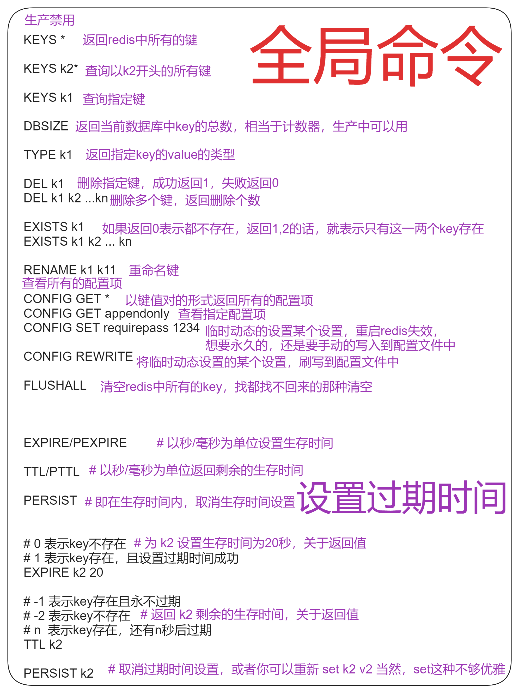
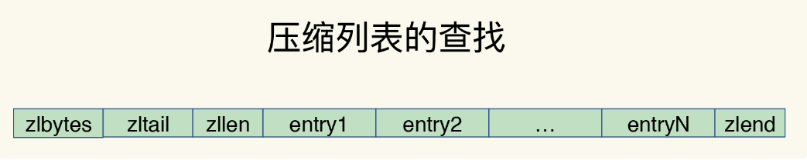
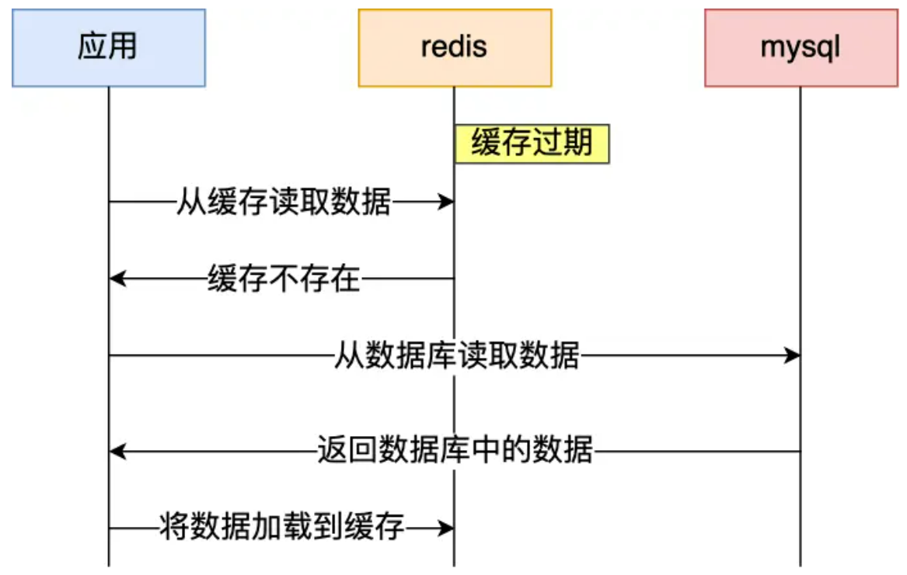
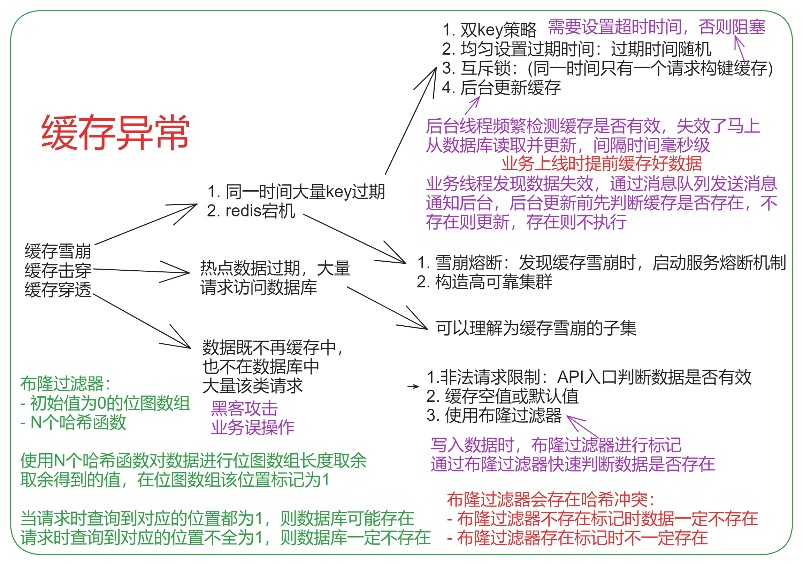
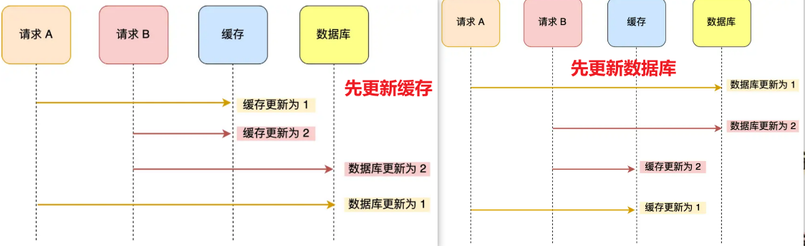
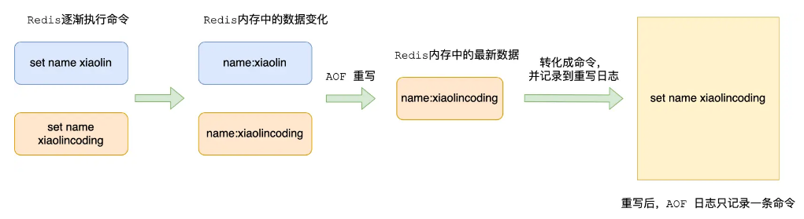
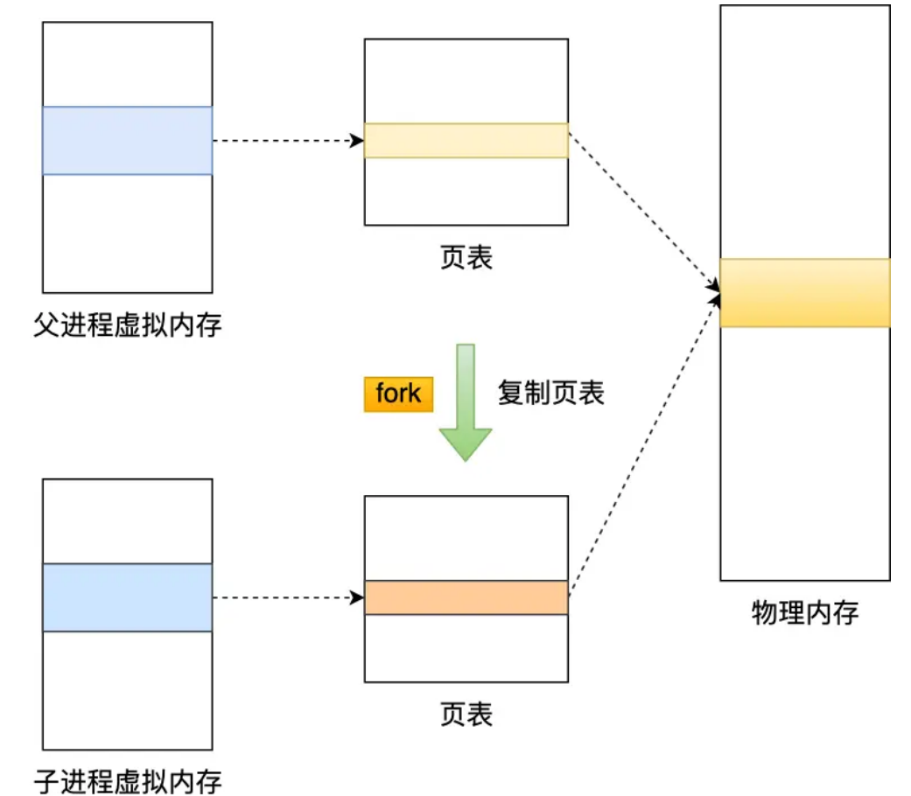
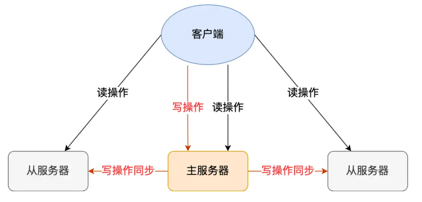
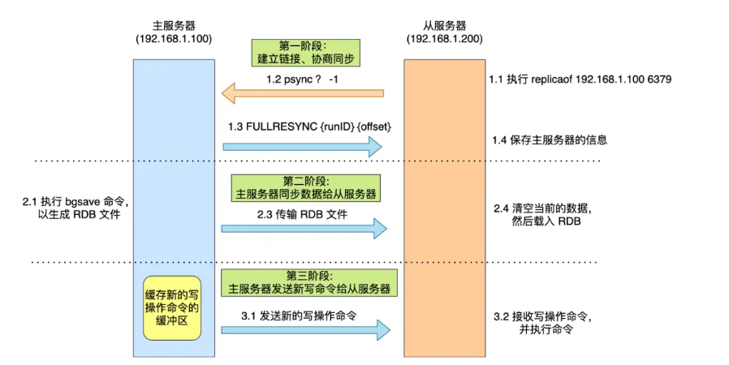
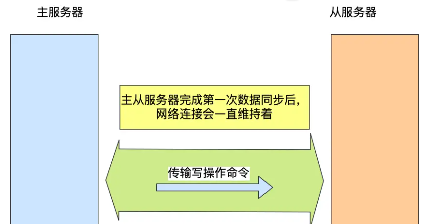

# Redis安装

## Ubuntu Redis安装

### 安装配置

```shell
sudo apt update
sudo apt upgrade

# 安装
sudo apt install redis-server

# 查看redis进程
ps -aux | grep redis
ps -ef | grep redis
netstat -nlt|grep 6379

# 查看配置文件 修改绑定地址
sudo vi /etc/redis/redis.conf

# 启动服务器
sudo service redis-server start 
sudo service redis-server restart 
sudo service redis-server stop 

redis-server 

sudo /etc/init.d/redis-server restart
sudo service redis-server restart
sudo redis-server /etc/redis/redis.conf

# 启动redis-client
redis-cli

# 解决可能出现的中文乱码
redis-cli --raw
```

### 设置密码

```bash
# 添加redis访问密码
config set requirepass password

# 查看密码
config get requirepass

# 连接上后输入密码
auth password
```

### 从源码安装

```bash
# 进入 root 目录，并下载 Redis 的程序包
sudo su
wget http://download.redis.io/redis-stable.tar.gz

# 在目录下，解压安装包，生成新的目录 redis-4.0.14
tar -xzvf redis-stable.tar.gz

# 进入解压之后的目录，进行编译，如果没有明显的错误，则表示编译成功
cd redis-stable
make

# Redis 安装完成后，注意一些重要的文件
src/redis-server
src/redis-cli
redis.conf

# 设置环境变量
cp redis-server /usr/local/bin/
cp redis-cli /usr/local/bin/

# 启动服务
redis-server

# 启动客户端
redis-cli
```

##  Redis配置说明


## 集群搭建

案例采用1主节点，2容器从节点

# Redis-cli

## redis连接

redis提供两个类Redis和StrictRedis用于实现Redis的命令

- StrictRedis：实现大部分官方的命令，并使用官方的语法和命令
- Redis：StrictRedis的子类，用于向后兼容旧版本的redis-py。

redis连接实例是线程安全的，可以直接将redis连接实例设置为一个全局变量，直接使用。如果需要另一个Redis实例（or Redis数据库）时，就需要重新创建redis连接实例来获取一个新的连接。同理，python的redis没有实现select命令。


## 全局命令



## 设置字符串

### 基本命令

| 方法          | 说明                                                         |
| ------------- | ------------------------------------------------------------ |
| set()         | 设置值，不存在则创建，存在则修改                             |
| setnx()       | 设置值，只有不存在时才设置                                   |
| setex()       | 设置值                                                       |
| psetex()      | 设置值                                                       |
| mset()        | 批量设置值                                                   |
| meget()       | 批量获取值                                                   |
| getset()      | 设置新值，并获取原来的值                                     |
| getrange()    | 获取子序列（根据字节获取，非字符）                           |
| setrange()    | 修改字符串内容，从指定字符串索引开始向后替换（新值太长时，则向后添加） |
| setbit()      | 对name对应值的二进制表示的位进行操作                         |
| gitbit()      | 获取name对应的值的二进制表示中的某位的值 （0或1）            |
| bitcount()    | 获取name对应的值的二进制表示中 1 的个数                      |
| bitop()       | 获取多个值，并将值做位运算，将最后的结果保存至新的name对应的值 |
| strlen()      | 返回name对应值的字节长度（一个汉字3个字节）                  |
| incr()        | 自增 name 对应的值，当 name 不存在时，则创建 name＝amount，否则，则自增。 |
| incrbyfloat() | 自增 name对应的值，当name不存在时，则创建name＝amount，否则，则自增。 |
| decr()        | 自减 name 对应的值，当 name 不存在时，则创建 name＝amount，否则，则自减。 |
| append()      | 在redis name对应的值后面追加内容                             |

```python
# 设置值，不存在则创建，存在则修改
set(name, value, ex=None, px=None, nx=False, xx=False)
```

### set 

在Redis中设置值，默认，不存在则创建，存在则修改

```python
set(name, value, ex=None, px=None, nx=False, xx=False)
```

| 参数  | 说明                                                         |
| ----- | ------------------------------------------------------------ |
| name  | 键                                                           |
| value | 值                                                           |
| ex    | 过期时间（秒） 这里过期时间是3秒，3秒后p，键hobby的值就变成None |
| px    | 过期时间（豪秒） 这里过期时间是3豪秒，3毫秒后，键hobby的值就变成None |
| nx    | 如果设置为True，则只有name不存在时，当前set操作才执行        |
| xx    | 如果设置为True，则只有name存在时，当前set操作才执行          |

```python
import redis

r = redis.Redis(host='location',port=6379,decode_responses=False)


r.set('name', 'Hsiangya')
r.set('age', '18')

print(r.get('name'))
print(r.get('name').decode())
```

### setex

```python
setex(name, value, time)
```

| 参数  | 说明                              |
| ----- | --------------------------------- |
| name  | 键                                |
| value | 值                                |
| time  | 过期时间(数字秒 或 timedelta对象) |

```python
r.setex('code', '123456', 3)
```

### psetex

```python
psetex(name, time_ms, value)
```

| 参数    | 说明                                  |
| ------- | ------------------------------------- |
| name    | 键                                    |
| value   | 值                                    |
| time_ms | 过期时间（数字毫秒 或 timedelta对象） |

```python
r.psetex('code', '123456', 3000)
time.sleep(3)
print(r.get('name'))  # 5000毫秒后，取值就从apple变成None
```

**参数：** 

nx，如果设置为True，则只有name不存在时，当前set操作才执行 （新建）

xx，如果设置为True，则只有name存在时，当前set操作才执行 （修改）

```python
"""操作数据"""
# 如果键 age 不存在，就添加一个新的；如果键 age 已经存在，就不进行修改

# 不存在就创建，存在就不进行修改
r.set('age', '19', nx=True)  # 不存在就会创建
print(r.get('age'))

# 如果键 gender 已经存在，就进行修改；如果键不存在，就不修改
r.set('gender', '女', xx=True)
```

### setnx

```Python
setnx(name, value)
```


 设置值，只有name不存在时，执行设置操作（添加）

```python
r.set('gender', '男', nx=True)
r.setnx('gender', '男')
```

### mset

```python
mset(*args, **kwargs)
```


批量设置值

```python
r.mset({'name': 'Hsiangya', 'age': '18'})
```

### mget

```python
mget(keys, *args)
```


批量获取 如：

```python
print(r.mget(['name', 'age', 'hobby']))  # 一次取出多个键对应的值
```

### incr

```python
incr(self, name, amount=1)
```

自增 name对应的值，当name不存在时，则创建name＝amount，否则，则自增。
参数：
amount, 自增数（必须是整数）

```python
r.set('total', 10)
r.incr('total')
r.incr('total', amount=1)  # 自增数（必须是整数）
print(r.mget("total"))
```

### decr

```python
decr(self, name, amount=1)
```

自减 name对应的值，当name不存在时，则创建name＝amount，否则，则自减。
参数：
amount,自减数（整数)

```python
r.decr("total", amount=3) # 递减3
r.decr("total", amount=1) # 递减1
print(r.mget("total"))
```

### append

```python
append(key, value)
```

在redis name对应的值后面追加内容
参数：
value, 要追加的字符串

```python
# 在name对应的值junxi后面追加字符串haha

r.append("name", "haha")   
```

incrbyfloat(self, name, amount=1.0)
自增 name对应的值，当name不存在时，则创建name＝amount，否则，则自增。
参数：
amount,自增数（浮点型）

```
r.set("foo1", "123.0")
r.set("foo2", "221.0")
print(r.mget("foo1", "foo2"))
r.incrbyfloat("foo1", amount=2.0)
r.incrbyfloat("foo2", amount=3.0)
print(r.mget("foo1", "foo2"))
```

### getrange

获取子序列（根据字节获取，非字符）

```python
getrange(key, start, end)
```

| 参数  | 说明             |
| ----- | ---------------- |
| name  | 键               |
| start | 起始位置（字节） |
| end   | 结束位置（字节） |

如： "君惜大大" ，0-3表示 "君"

```python
r.set("cn_name", "君惜大大") # 汉字
# 取索引号是0-2 前3位的字节 君 切片操作 （一个汉字3个字节 1个字母一个字节 每个字节8bit）
print(r.getrange("cn_name", 0, 2))
# 取所有的字节 君惜大大 切片操作
print(r.getrange("cn_name", 0, -1)) 
# 字母
r.set("en_name","junxi") 
# 取索引号是0-2 前3位的字节 jun 切片操作 （一个汉字3个字节 1个字母一个字节 每个字节8bit）
print(r.getrange("en_name", 0, 2))
# 取所有的字节 junxi 切片操作
print(r.getrange("en_name", 0, -1))
```

### setrange

```python
setrange(name, offset, value)
```

修改字符串内容，从指定字符串索引开始向后替换（新值太长时，则向后添加）
参数：
offset，字符串的索引，字节（一个汉字三个字节）
value，要设置的值

```
r.setrange("en_name", 1, "ccc")
# jccci 原始值是junxi 从索引号是1开始替换成ccc 变成 jccci
print(r.get("en_name"))   
```

### strlen

返回name对应值的字节长度（一个汉字3个字节）

```python
strlen(name)
```

### 案例-页面点击

假定我们对一系列页面需要记录点击次数。

例如论坛的每个帖子都要记录点击次数，而点击次数比回帖的次数的多得多。如果使用关系数据库来存储点击，可能存在大量的行级锁争用。所以，点击数的增加使用redis的INCR命令最好不过了。
当redis服务器启动时，可以从关系数据库读入点击数的初始值（例如某一篇文章被访问了1次）

```python
# 观看（view），点赞（click），投币（coin），转发（share）
r.set('article:000001:click', 1)
r.set('article:000002:click', 1)
r.set('article:000003:click', 1)
r.set('article:000004:click', 1)
```

每当有一个页面点击，则使用INCR增加点击数即可。

```python
r.incr('article:000002:click')
```

页面载入的时候则可直接获取这个值

```python
print(r.mget(['article:000001:click', 'article:000002:click', 'article:000003:click', 'article:000004:click']))

```

## list

| 方法                                  | 说明                   |
| ------------------------------------- | ---------------------- |
| lpush(name,values)                    | 增加 --没有就新建      |
| lpushx(name,value)                    | 增加 --没有无法创建    |
| linsert(name, where, refvalue, value) | 新增（索引号新增元素） |
| r.lset(name, index, value)            | 修改（指定索引号修改） |
| r.lrem(name, value, num)              | 删除（指定值进行删除） |
| lpop(name)                            | 删除并返回             |
| ltrim(name, start, end)               | 删除索引之外的值       |
| lindex(name, index)                   | 取值（根据索引号取值） |

```python
# 从右向左操作添加，没有arr就新建
r.lpush("arr", 11, 22, 33, 44, 55) 

# 从右向左操作添加，没有arr无法添加
r.lpushx("arr", 00) 

# 往列表中左边第一个出现的元素"11"前插入元素"00"
r.linsert("arr", "before", "11", "00")

# 把索引号是0的元素修改成-11
r.lset("arr", 0, -11)  

# 将列表中左边第一次出现的"11"删除
r.lrem("arr", "11", 1)  

# 将列表中右边第一次出现的"99"删除
r.lrem("arr", "99", -1)  

# 将列表中所有的"22"删除
r.lrem("arr", "22", 0)  

# 删除列表最左边的元素，并且返回删除的元素
r.lpop("arr")

# 删除列表最右边的元素，并且返回删除的元素
r.rpop("arr")

# 取值（根据索引号取值）
print(r.lindex("arr", 0))  # 取出索引号是0的值

# 删除索引号是0-2之外的元素，值保留索引号是0-2的元素
r.ltrim("arr", 0, 2)  

```

##  set

```python
"""sadd(name,values)"""
r.sadd("set1", *'hello world !')
print('集合的长度:\t', r.scard("set1")) #获取元素个数
print('集合中所有的成员', r.smembers("set1")) #获取所有成员

# 获取集合中所有的成员--元组形式
sscan(name, cursor=0, match=None, count=None)
print(r.sscan("set1"))

# 获取集合中所有的成员--迭代器的方式
sscan_iter(name, match=None, count=None)
for i in r.sscan_iter("set1"):
    print(i)
    
# 差集 sdiff(keys, *args)
r.sadd("set2", 1, 2, 3)
r.sadd("set3", 2, 3, 4)
print('set2:\t', r.smembers("set2"))
print('set3:\t', r.smembers("set3"))
print('set2 - set3:\t', r.sdiff("set2", "set3"))
print('set3 - set3:\t', r.sdiff("set3", "set2"))
```


差集--差集存在一个新的集合中
sdiffstore(dest, keys, *args)
获取第一个name对应的集合中且不在其他name对应的集合，再将其新加入到dest对应的集合中

```python
r.sdiffstore("set4", "set2", "set3")
print('set4 = set2 - set3:\t', r.smembers("set4"))
```

**交集** 
sinter(keys, *args)
获取多一个name对应集合的交集

```python
print(r.sinter("set2", "set3"))  # 取2个集合的交集
```

**交集** 交集存在一个新的集合中
sinterstore(dest, keys, *args)
获取多一个name对应集合的并集，再将其加入到dest对应的集合中

```python
r.sinterstore("set4", "set2", "set3")  # 取2个集合的交集
print(r.smembers("set4"))
```

**并集** 
 sunion(keys, *args)
 获取多个name对应的集合的并集

```python
print('set2 | set3:\t', r.sunion("set2", "set3"))
```

并集--并集存在一个新的集合
 sunionstore(dest,keys, *args)
 获取多一个name对应的集合的并集，并将结果保存到dest对应的集合中

```python
"""并集"""
r.sunionstore("set4", "set3", "set2")
print('set4 = set3 | set2', r.smembers("set4"))
```

判断是否是集合的成员 类似in
sismember(name, value)
检查value是否是name对应的集合的成员，结果为True和False

```python
print('3 in set2:\t', r.sismember("set2", 3))
print('4 in set2:\t', r.sismember("set2", 4))
```

**移动**
smove(src, dst, value)
将某个成员从一个集合中移动到另外一个集合

```python
r.smove("set2", "set3", 1)
print(r.smembers("set1"))
print(r.smembers("set2"))
```

**删除** 随机删除并且返回被删除值
spop(name)
从集合移除一个成员，并将其返回,说明一下，集合是无序的，所有是随机删除的

```python
print(r.spop("set2"))   # 这个删除的值是随机删除的，集合是无序的
print(r.smembers("set2"))
```


**删除** 指定值删除
srem(name, values)
在name对应的集合中删除某些值

```python
print(r.srem("set2", 1))   # 从集合中删除指定值 11
print(r.smembers("set2"))
```

## Zset

Set操作，Set集合就是不允许重复的列表，本身是无序的
 有序集合，在集合的基础上，为每元素排序；元素的排序需要根据另外一个值来进行比较，所以，对于有序集合，每一个元素有两个值，即：值和分数，分数专门用来做排序。

| 方法                                                         | 操作                                                         |
| ------------------------------------------------------------ | ------------------------------------------------------------ |
| zadd(name, *args, **kwargs)                                  | 在name对应的有序集合中添加元素                               |
| zcard(name)                                                  | 获取有序集合元素个数 类似于len                               |
| zrange( name, start, end, desc=False,withscores=False, score_cast_func=float) | 按照索引范围获取name对应的有序集合的元素                     |
| zrevrange(name, start, end, withscores=False, score_cast_func=float) | 从大到小排序(同zrange，集合是从大到小排序的)                 |
| zrangebyscore(name, min, max, start=None, num=None, withscores=False, score_cast_func=float) | 按照分数范围获取name对应的有序集合的元素                     |
| 按照分数范围获取有序集合的元素并排序（默认从大到小排序）     | zrevrangebyscore(name, max, min, start=None, num=None, withscores=False, score_cast_func=float) |
| zscan(name, cursor=0, match=None, count=None, score_cast_func=float) | 获取所有元素--默认按照分数顺序排序                           |
| zrank(name, value)                                           | 获取索引                                                     |
| zrem(name, values)                                           | 删除指定值                                                   |
| zremrangebyrank(name, min, max)                              | 范围删除： 按照索引号来删除                                  |
| zremrangebyscore(name, min, max)                             | 删除--根据分数范围删除                                       |
| zscore(name, value)                                          | 获取name对应有序集合中 value 对应的分数                      |

##  hash

| 方法                     | 说明                                   |
| ------------------------ | -------------------------------------- |
| hset(name, key, value)   | 没有就新增，有的话就修改               |
| hmset(name, mapping)     | 批量增加（取出）                       |
| hget(name,key)           | 在name对应的hash中获取根据key获取value |
| hmget(name, keys, *args) | 在name对应的hash中获取多个key的值      |
| hgetall(name)            | 获取name对应hash的所有键值             |
| hlen(name)               | 获取name对应的hash中键值对的个数       |
| hkeys(name)              | 获取name对应的hash中所有的key的值      |
| hvals(name)              | 获取name对应的hash中所有的value的值    |
| hexists(name, key)       | 判断成员是否存在（类似字典的in）       |
| hdel(name,*keys)         | 将name对应的hash中指定key的键值对删除  |

## 其他常用操作

| 方法                                   | 说明                                                         |
| -------------------------------------- | ------------------------------------------------------------ |
| delete(name)                           | 根据删除redis中的任意数据类型（string、hash、list、set、有序set） |
| exists(name)                           | 检测redis的name是否存在，存在就是True，False 不存在          |
| keys(pattern='*')                      | 模糊匹配                                                     |
| expire(name ,time)                     | 设置超时时间                                                 |
| rename(src, dst)                       | 重命名                                                       |
| randomkey()                            | 随机获取name                                                 |
| type(name)                             | 获取name对应值的类型                                         |
| scan(cursor=0, match=None, count=None) | 查看所有元素                                                 |
| scan_iter(match=None, count=None)      | 查看所有元素--迭代器                                         |
| keys()                                 | 查询所有的Key                                                |
| dbsize()                               | 当前redis包含多少条数据                                      |
| save()                                 | 执行"检查点"操作，将数据写回磁盘。保存时阻塞                 |
| flushdb()                              | 清空r中的所有数据                                            |

# 数据结构

## 图解


## String

key 是唯一标识，value 是具体的值；value 最多可以容纳的数据长度是 512M

## 键值组织结构

- 为了加速，Redis使用一个哈希表来保存所有键值对
- 一个哈希表，就是一个数组，数组中每个元素称为哈希桶，即一个哈希表是由多个哈希桶组成，每个哈希桶中保存了键值对数据
- 哈希桶中的元素保存的并不是值本身，而是指向具体值的指针。


因为该表保存了所有的键值对，所以称之为全局哈希表：

- 好处：用O(1)的时间复杂度来快速查询到键值对，只需要计算键的哈希值，就可以得到对应的哈希桶位置，然后访问相应元素

## 哈希表冲突

在Redis中写入了大量数据后，有时候会突然变慢，这就是哈希表的冲突问题和rehash可能带来的操作阻塞：

- 往哈希表中写入更多数据时，哈希冲突不可避免
- 两个key的哈希值和哈希桶计算对应关系时，正好落在了同一个哈希桶中
- 哈希桶的个数通常少于key的数量，因此难免会有一些key的哈希值对应到了同一个哈希桶

redis解决哈希冲突方式就是链式哈希：

- 同一个哈希桶中的多个元素用一个链表来保存，他们之间依次用指针连接


- 缺点：哈希冲突链上的元素只能通过指针逐一查找再操作。如果数据过多，哈希冲突会变多，导致冲突链过长，进而导致元素查找时间长，效率降低。

为了使rehash操作更高效，Redis默认使用了两个全局哈希表：哈希表1和哈希表2，当刚插入数据时，默认使用哈希表1，此时哈希表2并没有分配空间，随着数据增加，redis开始执行rehash，过程将执行以下三步：

- 给哈希表2分配更大的空间，例如是当前哈希表1大小的两倍
- 把哈希表1中的数据重新映射并拷贝到哈希表2中 
- 释放哈希表1的空间

至此，就可以从哈希表1切换到哈希表2，用增大的哈希表2保存更多数据，而原来的哈希表1留做下一次rehash扩容用。

第二步设计大量的数据拷贝，如果一次性把哈希表1中的数据都迁移完，会造成Redis线程阻塞，无法服务其他请求，此时Redis无法快速访问数据，为了避免这个问题，redis采用了渐进式rehash:

- 第二步拷贝数据时，Redis仍然可以处理客户端请求，每处理一个请求时，从哈希表1中的第一个索引位置开始，顺带着将这个索引位置上的所有entries拷贝到哈希表2；等待处理下一个请求时，再顺带拷贝哈希表1中的下一个索引位置的entries,如下图：

这样就巧妙的把一次性大量拷贝的开销，分摊到了多次处理请求中，避免了好事操作，保证了数据的快速访问。

对于string类型来说，找到哈希桶就能直接增删改查，所以，哈希表O(1)操作复杂度就是它们的复杂度了，但对于集合类型来说，即使找到哈希桶，还要在集合中再进一步操作。

## 集合组织结构

集合类型的值，和String不同，首先通过全局哈希表找到对应得哈希桶位置，然后在集合中再增删改查

- 使用哈希表实现的集合，要比使用链表实现的集合访问效率更高
- 操作效率和这些操作本身执行特点有关，读写一个元素的操作要比读写所有元素的效率高

集合类型的底层数据结构主要有5种：整数数组、双向链表、哈希表、压缩列表、跳表。整数数组和双向链表很常见，他们的操作特征都是顺序读写，也就是通过数组下标或者链表的指针逐个元素访问，操作复杂度基本是O(N),效率比较低。

### 压缩列表

- 压缩列表类似于一个数组，数组中每一个元素都对应保存一个数据
- 压缩列表在表头有三个字段zlbytes(长度)、zltail(列表尾偏移量)、zllen(列表中entry个数)
- 压缩列表表尾还有一个zlend，表示列表结束



- 压缩列表中，如果我们要查找定位第一个或最后一个元素，可以通过表头的长度直接定位，复杂度是O(1)，而查找其他元素，就没有那么高效，只能逐个查找，此时复杂度就是O(N)了。

### 跳表

有序列表只能逐一查找元素，导致操作起来非常缓慢，于是就出现了调表。跳表再链表的基础上，增加了多级索引，通过索引位置的几个跳转，实现数据的快速定位：

- 如果查找33元素，只能从头开始遍历，需要查找6次，知道查找到33为止，此时复杂度是O(N),效率很低
- 为了提高效率，增加一级索引，每两个元素作为索引，通过索引指向原始链表，此时查找33只需要4次
- 如果还想再快，可以增加二级索引，从一级索引中再抽取部分元素作为二级索引，这样只需要三次就能够定位到元素33了，当数据量很大时，跳表的查找复杂度就是O(logN)

### 结构的复杂度


### 操作的复杂度

- HGET、HSET：读写单个集合元素
- SADD：操作多个元素
- SMEMBERS：对整个集合进行遍历操作

集合复杂度口诀

- 单元素操作是基础

  每一种积累类型对单个数据实现的增删改查操作

  - Hash类型：HGET、HSET、HDEL
  - Set类型：SADD、SREM、SRANDMEMBER

  这些操作复杂度由集合曹勇的数据结构决定，Hash操作复杂度是O（1）;Set类型使用哈希表作为底层数据结构时，他的SADD、SREM、SRANDMEMBER复杂度是O(1)

  集合类型支持同时对多个元素进行增删改查，如Hash类型的HMGET和HMSET，Set类型的SADD也支持，此时复杂度由元素个数决定，如果增加M个元素，复杂度则为O(M)

- 范围操作非常耗时

  指集合类型中的遍历操作，可以返回集合的所有数据

  - Hash:：HGETALL 
  - Set：SMEMBERS
  - List：LRANGE
  - Zset：ZRANGE

  这类操作复杂度一般是O(N),比较耗时，尽量避免

  Redis2.8版本后提供SCAN系列操作(HSCAN、SSCAN和ZSCAN)，这类操作实现了渐进式遍历，每次只返回优先数量的数据，这样就避免一次返回所有数据而导致redis阻塞

- 统计操作非常高效

  结合类型对集合中所有元素个数的记录，例如LLEN和SCARD，复杂度只有O(1)，这是因为当集合采用压缩列表、双向链表、整数数组这些数据结构时，这些结构中专门记录了元素的个数，因此可以高效

- 例外情况只有几个

  某些数据结构的特殊记录，如压缩列表和双向链表都会记录表头和表尾的偏移量，这样依赖，对于List类型的LPOP、RPOP、LPUSH、RPUSH这四个操作来说，他们是在列表头尾增删元素，就可以直接通过偏移量直接定位，复杂度也只有O(1)，实现快速操作

### 总结

Redis的快速

- O(1)复杂度的哈希表被广泛使用，包括String、Hash、Set，他们的操作复杂度基本由哈希表决定
- Sorted Set也采用了O(logN)复杂度的跳表
- 集合类型的范围操作，要遍历底层数据结构，复杂度通常是O(N)，建议用其他命令来代替，如SCAN，避免在Redis内部产生费时的全集和遍历操作 
- 复杂度较高的List类型，它的两种底层实现结构：双向链表和压缩列表的操作复杂度都是O(N),因此建议因地制宜使用List类型，例如：既然它的POP/PUSH效率很高，那就将它主要用于FIFO场景，而不是作为一个可以随机读写的集合

# 多路复用

通常来说，单线程的处理能力要比多线程差很多，但是redis却能使用单线程模型达到每秒数十万级别的处理能力，这是Redis多方面设计选择的一个综合结果：

- Redis大部分操作在内存上完成
- 采用了高效的数据结构，例如哈希表和跳表
- 采用了多路复用机制，在网络IO操作中能并发处理大量客户端请求

## 基本IO和潜在阻塞点

以Get请求为例

- bind/listen：为了处理Get请求，需要监听客户端请求
- accept：和客户端建立连接
- recv：从socket中读取请求
- parse：解析客户端发送请求
- get：根据请求类型读取键值数据
- send：像socket中写回数据

一个线程依次执行上面的操作，但该网络IO操作中，有潜在的阻塞点

- accept()：当鉴定到一个客户端有请求连接时，但一直未能成功建立连接时，导致其他客户端无法与Redis建立连接
- recv()：一个客户端读取数据时，如果一直没有到达，Redis也会阻塞

以上两种形式会导致Redis整个线程阻塞，无法处理其他客户端请求，效率很低，不过socket网络模型本身支持非阻塞模式

## 非阻塞模式

socket网络模型的非阻塞模式设置，主要体现在三个关键的函数调用

在sokcet模型中，不同操作调用后会返回不同的套接字类型

- socket()方法会返回主动套接字
- 然后调用listent()方法，将主动套接字转化为监听套接字，此时可以监听来自客户端的请求连接
- 最后调用accept()方法接受到达的客户端连接，并返回已连接套接字


针对监听套接字，我们可以设置非阻塞模式：让Redis调用accept()但一直未有链接请求到达时，Redis线程可以返回处理其他操作，而不用一直等待。调用accept时，已经存在监听套接字了。

虽然Redis可以不用继续等待，但是总得有机制继续在监听套接字上等待后续连接请求并在有请求时通知Redis

类似的，我们也可以针对已连接套接字设置非阻塞模式：Redis 调用 recv() 后，如果已连接套接字上一直没有数据到达，Redis 线程同样可以返回处理其他操作。我们也需要有机制继续监听该已连接套接字，并在有数据达到时通知 Redis。

## 多路复用的IO模型

Linux 中的 IO 多路复用机制是指一个线程处理多个 IO 流，就是我们经常听到的select/epoll 机制。简单来说，在 Redis 只运行单线程的情况下，该机制许内核中，同时存在多个监听套接字和已连接套接字


# 缓存

## 缓存雪崩

### 雪崩概念

通常为了保证缓存中的数据与数据库中的数据一致性，会给Redis里的数据设置过期时间，当缓存的数据过期后，用户访问的数据不在缓存内，需要重新生成缓存，因此就会访问数据库，并更新到Redis里，这样后续请求都可以直接命中缓存大量缓存数据在同一时间过期或者Redis故障宕机时，如果此时有大量的用户请求无法在Redis中处理，于是全部请求都直接访问数据库，从而导致数据库的压力骤增，严重的会造成数据库宕机，从而形成一系列连锁反应，导致获赠个系统崩溃，这就是缓存雪崩

雪崩的两个原因：

- redis大量过期
- redis宕机

### 应对方式

不同的诱因，应对策略不一样，常见的应用方法有下面几种：

- 均匀设置过期时间

  避免将大量数据设置成同一个过期时间，可以对缓存数据设置过期时间时，给这些数据的过期时间加上一个随机数，这样就保证数据不会在同一时间过期

- 互斥锁

  当业务线程在处理用户请求时，如果发现访问的数据不在Redis里，就加个互斥锁，保证同一时间内只有一个请求来构建缓存(从数据库里读取数据，再将数据更新到reids里)，当缓存构建完成后，再释放锁。未能获取到互斥锁的请求，要么等待锁释放后重新读取缓存，要么就返回空值或者默认值

  实现互斥锁的时候，最好设置超时时间，不然第一个请求获取锁后，发生了意外，一直阻塞不释放锁，其他请求一直拿不到锁，整个系统出现无响应现象。

- 双key策略

- 后台更新缓存

  业务线程不再负责更新缓存，缓存也不设置有效期，而是让缓存"永久有效"，并将更新缓存的工作交由后台线程定时更新。

  事实上，缓存数据不设置有效期，并不意味着一直能在内存里，当系统内存紧张的时候，有些缓存数据会被淘汰，而在缓存被淘汰到下一次后台更新缓存的这段时间内，业务线程读取缓存失败就返回空值，业务的视角就一位数据丢失了

  解决方式：

  - 后台线程不仅负责定时更新缓存，而且也负责频繁地检测缓存是否有效，检测到缓存失效了，原因可能时系统紧张而淘汰地，于是马上就要从数据库读取数据，并更新到缓存

    这种方式的检测时间间隔不能太长，太长也导致用户获取的数据时一个控制而并不是真正的数据，所以检测的间隔最好时毫秒级的，但总会有间隔时间，用户体验一般

  - 在业务线程发现数据失效后，通过消息队列发送一条消息通知后台线程更新缓存，后台线程收到消息后，在更新前可以判断缓存是否存在，存在就不执行，更新缓存操作，不存在就读取数据库数据，并将数据加载到缓存。这种方式相比第一种方式缓存的更新会及时，用户体验也比较好。

  在业务刚上线的时候，最好提前把数据缓存起来，而不是等用户访问才来触发缓存构建，这就是所谓的缓存预热，后台更新缓存机制也适合干这个事情

redis故障宕机

- 服务熔断

  因为Redis宕机而导致缓存雪崩问题时，可以启动服务熔断机制，暂停业务应用对缓存服务的访问，直接返回错误。不用再继续访问数据库，从而降低对数据库的访问压力，保证数据库系统的正常运行，然后等到Redis恢复正常后，再允许业务应用访问缓存服务。

  服务熔断机制是为了保存数据库的正常使用，但是暂停了业务应用访问缓存服务系统，全部业务都无法正常工作，为了减少对业务的影响，我们可以启用请求限流机制，只将少部分请求发送到数据库进行处理，再多的请求就再入口直接拒绝服务，等到Redis恢复正常把缓存预热完后，再接触请求限流的机制。

- 构建Redis缓存高可靠集群

  服务熔断或请求限流机制是缓存雪崩发生后的应对方案，我们最好通过主从节点的方式构建Redis缓存高可靠集群

  如果Redis缓存的主节点故障宕机，从节点可以切换成为主节点，继续提供缓存服务，避免了由于Redis故障宕机而导致的缓存雪崩问题。

## 缓存击穿

### 概念

业务通常会有几个数据被频繁地访问，比如秒杀活动这类频繁地访问地数据被称为热点数据，如果缓存中某个热点数据过期了，此时大量地请求访问了该热点数据，就无法从缓存中读取，直接访问数据库，数据库很容易就被高并发地请求冲垮，这就是缓存击穿缓存击穿和缓存雪崩非常相似，可以认为缓存击穿是缓存雪崩的子集

### 应对方式

- 互斥锁方案，保证同一时间只有一个业务线程更新缓存，未能获取互斥锁的请求，要么等待锁释放后重新读取缓存，要么就返回空值或默认值
- 不给热点数据设置过期时间，由后台异步更新缓存，或者在热点数据准备要过期前，提前通知后台线程更新缓存以及重新设置过期时间。

## 缓存穿透

### 概念

当发生缓存雪崩或击穿时，数据库中还是保存了应用要访问的数据，一旦缓存恢复相对应的数据，就可以减轻数据库的压力，而缓存穿透就不一样了。

当用户访问的数据，既不在缓存中，也不再数据库中，导致请求在访问缓存时，发现缓存缺失，再去访问数据库时，发现数据库中也没有要访问的数据，没办法构建缓存数据来服务后续的请求，当有大量这样的请求到来时，数据库的压力骤增，这就是缓存穿透的问题

缓存穿透的发生一般有两种情况

- 业务误操作：缓存中的数据和数据库中的数据都被误删除了 ，所以导致缓存和数据库中都没有数据
- 黑客恶意攻击：故意大量访问某些读取不存在的数据业务

### 应对方式

- 非法请求的限制

  - API入口判断请求参数是合理
  - 请求参数是否有非法之，字段是否存在
  - 判断出恶意请求直接返回错误

- 缓存空值或默认值

  可以针对查询的数据，在缓存中设置空值或默认值

- 使用布隆过滤器快速判断数据是否存在，避免通过查询数据库来判断数据是否存在

  - 写入数据库时，使用布隆过滤器做标记
  - 业务线程确认缓存失效后，可以通过查询布隆过滤器快速判断数据是否存在，不存在则无需访问数据库

  即使发生了缓存击穿，大量请求智汇查询Redis和布隆过滤器，不会查询数据库，保证了数据库能正常运行，Redis自身也支持布隆过滤器

### 布隆过滤器

- 布隆过滤器由初始值都为0的位图数组和N个哈希函数两部分组成
- 写入数据库数据时，在布隆过滤器里做个标记，这样后续只需要查询标记是否存在即可判断是否存在数据库

布隆过滤器会通过3个操作完成标记

- 使用N个哈希函数分别对数据进行哈希计算，得到N个哈希值
- 将N个哈希值对位图数组的长 度取模，得到每个哈希值再位图数组对应的位置
- 将每个哈希值在位图数组的对应位置的值设置为1


- 写入数据X后，将X标记 在布隆过滤器时，会被3个哈希函数分别计算出3个哈希值，然后对3个哈希值对8取余，假设结果是146，即146的位置被设置为1
- 当应用要查询数据X是否在数据库是，通过布隆过滤器只要查到位图数组的146位置是否全为1，只要有一个是0，则数据不再数据库中

布隆过滤器基于哈希函数实现查找，高效的同时存在哈希冲突的可能，可能两个数据都落在146位置，而事实其中一个数据不存在数据库。

因此，布隆过滤器说数据存在，不一定证明数据库中存在这个数据，但是查询到数据不存在，数据库就一定不存在。 

## 缓存异常总结



## 数据库缓存一致性

一致性包含了两个问题：

- 缓存中有数据，那么，缓存的数据值需要和数据库中的值相同；
- 缓存中本身没有数据，那么，数据库中的值必须是最新值。

### 读写缓存

如果要对数据进行增删改，就需要在缓存中进行，同时还要根据采取的写回策略，决定是否同步写回到数据库中：

- 同步直写策略：写缓存时，也同步写数据库，缓存和数据库中的数据一致；

- 异步写回策略：写缓存时不同步写数据库，等到数据从缓存中淘汰时，再写回数据库。

  > 使用这种策略时，如果数据还没有写回数据库，缓存就发生了故障，那么，此时，数据库就没有最新的数据了

### 只读缓存

- 新增数据：直接在数据库中进行新增即可

### 更新顺序



- 无论先更新数据库还是先更新缓存，当两个请求并发更新同一个数据时，都会出现数据不一致的问题

# 持久化


Redis持久化主要有两大机制，即AOF日志和RDB日志

数据写入：

- 数据先写入内存，再写入AOF日志中；
- 写入内存到写入AOF日志中时可能会数据丢失，采用写回策略：
  - 每次写入内存都写入AOF日志
  - 每秒写入一次AOF日志
  - 不写入AOF日志
- 日志文件过大时，会自动进行AOF重写
- 子进程会fork父进程的数据，并对所有数据进行扫描，记录到新的AOF日志；
- AOF重写过程中，如果有新的数据进行写入，数据会先写到缓冲区，AOF重写完成后，该缓冲区数据将追加到新的AOF日志中
- AOF日志切换时，会先将新的AOF日志追加到旧的AOF日志中，再及逆行切换，避免切换过程中出现问题

数据恢复：

## 手动持久化

手动持久化的命令：

- save：同步命令，该命令会占用redis主线程，在save命令执行期间，Redis会阻塞所有的客户端请求，数据量大的时候，不推荐使用
- bgsave：异步命令，Redis使用Linux的`fork()`命令生成一个子进程来做持久化的工作，而主进程则继续提供其他的服务。

手动持久化需要配置文件：

```bash
dir "/data/redis6379/"   # 持久化文件保存的目录，目录位置可以更改为其它目录
dbfilename redis.rdb   	 # 持久化文件名，可以带端口号也可以不带，文件名也可以随意，只要是.rdb结尾就行

# 执行命令，
mkdir -p /data/redis6379/
chmod 777 /data/redis6379
vim /opt/redis6379/conf/redis6379.conf

# 添加如下配置
dir "/data/redis6379/"
dbfilename redis.rdb
```

配置好后，重启Redis服务：

```bash
[root@cs ~]# redis-cli 
127.0.0.1:6379> set k1 v1
OK
127.0.0.1:6379> SAVE
OK
127.0.0.1:6379> BGSAVE
Background saving started
127.0.0.1:6379> 
127.0.0.1:6379> 
[root@cs ~]# ls /data/redis6379/
redis.rdb
```

save与bgsave的对比

| 命令     | save               | bgsave                                 |
| -------- | ------------------ | -------------------------------------- |
| I/O类型  | 同步               | 异步                                   |
| 是否阻塞 | 是                 | 是(阻塞发生在fock()阶段，但通常非常快) |
| 复杂度   | O(n)               | O(n)                                   |
| 优点     | 不会消耗额外的内存 | 不阻塞客户端命令                       |
| 缺点     | 阻塞客户端命令     | 需要fork子进程，消耗额外内存           |

通常在生产环境不会使用该操作，而是使用自动持久化机制

## AOF


### AOF日志

AOF：中记录写操作命令，读命令不记录；默认不开启，需要修改配置appendonly

优点：

- 避免额外的检查开销：写入日志无法保证语法正确，还要先检查语法，先写入内存就不用检查
- 不会阻塞当前写操作：写入成功后才会写入日志

缺点：

- 写入内存到写入日志之间，存在数据丢失风险(宕机)
- 如果I/O繁忙，写入日志会缓慢，会阻塞后续的操作

### 写回策略


- redis执行完写操作命令后，会将命令追加到server.aof_buf缓冲区
- 然后通过 write() 系统调用，将 aof_buf 缓冲区的数据写入到 AOF 文件，此时数据并没有写入到硬盘，而是拷贝到了内核缓冲区 page cache，等待内核将数据写入硬盘；
- 具体内核缓冲区的数据什么时候写入到硬盘，由内核决定。

Redis 提供了 3 种写回硬盘的策略，控制的就是上面说的第三步的过程

- Always：

  每次写操作命令执行完后，同步将 AOF 日志数据写回硬盘；

  > - 最大程度保证数据不丢失
  > - 执行操作命令将 AOF 内容写回硬盘，影响主进程的性能；

- Everysec：

  每次写操作命令执行完后，先将命令写入到 AOF 文件的内核缓冲区，然后每隔一秒将缓冲区里的内容写回到硬盘；

  > - 避免Always 的性能开销；比 No 策略更能避免数据丢失
  > - 发生宕机，丢失一秒数据

- No：

  每次写操作命令执行完后，先将命令写入到 AOF 文件的内核缓冲区，再由操作系统决定何时将缓冲区内容写回硬盘。

  > 操作系统写回硬盘的时机是不可预知，丢失不定数量数据


### AOF重写机制

- AOF 日志是一个文件，随着写操作命令变多，文件的大小会变大
- 重启 Redis 后，需要读 AOF 文件的内容以恢复数据，文件过大，整个恢复的过程就会很慢。

AOF 重写机制是在重写时，读取当前数据库中的所有键值对，然后将每一个键值对用一条命令记录到「新的 AOF 文件」，等到全部记录完后，就将新的 AOF 文件替换掉现有的 AOF 文件。



- 重写机制后，会读取最新的value，旧的value没有作用，这样就使AOF文件变小了
- 重写过程是由后台线程 bgrewriteaof 来完成的；为了避免阻塞主线程，导致数据库性能下降+
- 主进程在通过 `fork` 系统调用生成 bgrewriteaof 子进程时，操作系统会把主进程的「**页表**」复制一份给子进程，这个页表记录着虚拟地址和物理地址映射关系



写时复制：**在发生写操作的时候，操作系统才会去复制物理内存**，这样是为了防止 fork 创建子进程时，由于物理内存数据的复制时间过长而导致父进程长时间阻塞的问题。

两个阶段会导致阻塞父进程：

- 创建子进程的途中，由于要复制父进程的页表等数据结构，阻塞的时间跟页表的大小有关，页表越大，阻塞的时间也越长；
- 创建完子进程后，如果子进程或者父进程修改了共享数据，就会发生写时复制，这期间会拷贝物理内存，如果内存越大，自然阻塞的时间也越长；

## RDB

### 概念

类似照片记录效果的方式，就是把某一时刻的状态以文件的形式写到磁盘上，也就是快照；

Redis 的数据都在内存中，为了提供所有数据的可靠性保证，它执行的是**全量快照**；对于 Redis 而言，它的单线程模型就决定了，我们要尽量避免所有会阻塞主线程的操作，Redis 提供了两个命令来生成 RDB 文件，分别是 save 和 bgsave：

- save：在主线程中执行，会导致阻塞
- bgsave：创建一个子进程，专门用于写入 RDB 文件，避免了主线程的阻塞，这也是Redis RDB 文件生成的默认配置。

为了保证快照完整性，它只能处理读操作，因为不能修改正在执行快照的数据；Redis 就会借助操作系统提供的写时复制技术（Copy-On-Write, COW）

### AOF与RDB混合使用

如果想要开启混合持久化功能，可以在 Redis 配置文件将下面这个配置项设置成 yes：`aof-use-rdb-preamble yes`

- 子进程fork出父进程的数据，并进行RDB快照；fork需要占主进程，所以RDB快照不应太频繁
- RDB快照过程中，有新数据进行写入时，启用写时复制，数据将被写入到缓冲区；RDB快照完成后，缓冲区数据将追加到RDB快照中
- 当前RDB到下一次RDB的过程中，有数据新增时，使用AOF日志进行记录；当下一次RDB快照完成时，AOF日志清空

# 复制

redis提供了主从复制模式，该模式可以保证多台服务器的数据一致性，且主从服务器之间采用的是读写分离的方式

祝福武器可以进行读写操作，当发生写操作时，自动将写操作同步给从服务器，而从服务器一般是只读，并且收主服务器同步过来的写操作命令，然后执行这条命令



## 第一次同步

多台服务器之间如何确定主从呢？5.0之前使用slaveof命令形成主从关系，使用`replicaof <服务器 A 的 IP 地址> <服务器 A 的 Redis 端口号>`命令，B会成为A的从服务器，然后与主服务器进行第一次同步，第一次同步可以分为三个阶段：

1. 建立链接，协商同步
2. 主服务器同步数据给从服务器
3. 主服务器发送新写操作命令给从服务器



**第一阶段：**

执行了 replicaof 命令后，从服务器就会给主服务器发送 `psync` 命令，表示要进行数据同步。psync 命令包含两个参数，分别是**主服务器的 runID** 和**复制进度 offset**。

- runID，每个 Redis 服务器在启动时都会自动生产一个随机的 ID 来唯一标识自己。当从服务器和主服务器第一次同步时，因为不知道主服务器的 run ID，所以将其设置为 "?"。
- offset，表示复制的进度，第一次同步时，其值为 -1。

主服务器收到 psync 命令后，会用 `FULLRESYNC` 作为响应命令返回给对方。并且这个响应命令会带上两个参数：主服务器的 runID 和主服务器目前的复制进度 offset。从服务器收到响应后，会记录这两个值。FULLRESYNC 响应命令的意图是采用**全量复制**的方式，也就是主服务器会把所有的数据都同步给从服务器。所以，第一阶段的工作时为了全量复制做准备。

**第二阶段：主服务器同步数据给从服务器**

主服务器会执行 bgsave 命令来生成 RDB 文件，然后把文件发送给从服务器。从服务器收到 RDB 文件后，会先清空当前的数据，然后载入 RDB 文件。

这期间的写操作命令并没有记录到刚刚生成的 RDB 文件中，这时主从服务器间的数据就不一致了。

那么为了保证主从服务器的数据一致性，**主服务器在下面这三个时间间隙中将收到的写操作命令，写入到 replication buffer 缓冲区里**：

- 主服务器生成 RDB 文件期间；
- 主服务器发送 RDB 文件给从服务器期间；
- 「从服务器」加载 RDB 文件期间；

**第三阶段：主服务器发送新写操作命令给从服务器：**

在主服务器生成的 RDB 文件发送完，从服务器收到 RDB 文件后，丢弃所有旧数据，将 RDB 数据载入到内存。完成 RDB 的载入后，会回复一个确认消息给主服务器。

接着，主服务器将 replication buffer 缓冲区里所记录的写操作命令发送给从服务器，从服务器执行来自主服务器 replication buffer 缓冲区里发来的命令，这时主从服务器的数据就一致了。

至此，主从服务器的第一次同步的工作就完成了。

## 命令传播

主从服务器在完成第一次同步后，双方之间就会维护一个 TCP 连接。

后续主服务器可以通过这个连接继续将写操作命令传播给从服务器，然后从服务器执行该命令，使得与主服务器的数据库状态相同。

而且这个连接是长连接的，目的是避免频繁的 TCP 连接和断开带来的性能开销。

上面的这个过程被称为**基于长连接的命令传播**，通过这种方式来保证第一次同步后的主从服务器的数据一致性。

## 分压

主服务器是可以有多个从服务器的，如果从服务器数量非常多，而且都与主服务器进行全量同步的话，就会带来两个问题：

- 由于是通过 bgsave 命令来生成 RDB 文件的，那么主服务器就会忙于使用 fork() 创建子进程，如果主服务器的内存数据非大，在执行 fork() 函数时是会阻塞主线程的，从而使得 Redis 无法正常处理请求；
- 传输 RDB 文件会占用主服务器的网络带宽，会对主服务器响应命令请求产生影响。

从服务器可以有自己的从服务器，它不仅可以接收主服务器的同步数据，自己也可以同时作为主服务器的形式将数据同步给从服务器，

通过这种方式，**主服务器生成 RDB 和传输 RDB 的压力可以分摊到充当经理角色的从服务器**。

在「从服务器」上执行`replicaof <目标服务器的IP> 6379`命令，使其作为目标服务器的从服务器：

## 增量复制

主从服务器在完成第一次同步后，就会基于长连接进行命令传播。如果主从服务器间的网络连接断开了，那么就无法进行命令传播了，这时从服务器的数据就没办法和主服务器保持一致了，客户端就可能从「从服务器」读到旧的数据。

从 Redis 2.8 开始，网络断开又恢复后，从主从服务器会采用**增量复制**的方式继续同步，也就是只会把网络断开期间主服务器接收到的写操作命令，同步给从服务器。

- 从服务器在恢复网络后，会发送 psync 命令给主服务器，此时的 psync 命令里的 offset 参数不是 -1；
- 主服务器收到该命令后，然后用 CONTINUE 响应命令告诉从服务器接下来采用增量复制的方式同步数据；
- 然后主服务将主从服务器断线期间，所执行的写命令发送给从服务器，然后从服务器执行这些命令。

**主服务器怎么知道要将哪些增量数据发送给从服务器？**

- **repl_backlog_buffer**，是一个「**环形**」缓冲区，用于主从服务器断连后，从中找到差异的数据；
- **replication offset**，标记上面那个缓冲区的同步进度，主从服务器都有各自的偏移量，主服务器使用 master_repl_offset 来记录自己「*写*」到的位置，从服务器使用 slave_repl_offset 来记录自己「*读*」到的位置。

在主服务器进行命令传播时，不仅会将写命令发送给从服务器，还会将写命令写入到 repl_backlog_buffer 缓冲区里，因此 这个缓冲区里会保存着最近传播的写命令。网络断开后，当从服务器重新连上主服务器时，从服务器会通过 psync 命令将自己的复制偏移量 slave_repl_offset 发送给主服务器，主服务器根据自己的 master_repl_offset 和 slave_repl_offset 之间的差距，然后来决定对从服务器执行哪种同步操作：

- 如果判断出从服务器要读取的数据还在 repl_backlog_buffer 缓冲区里，那么主服务器将采用**增量同步**的方式；
- 相反，如果判断出从服务器要读取的数据已经不存在 repl_backlog_buffer 缓冲区里，那么主服务器将采用**全量同步**的方式。


repl_backlog_buffer 缓行缓冲区的默认大小是 1M，并且由于它是一个环形缓冲区，所以当缓冲区写满后，主服务器继续写入的话，就会覆盖之前的数据。因此，当主服务器的写入速度远超于从服务器的读取速度，缓冲区的数据一下就会被覆盖。

在网络恢复时，如果从服务器想读的数据已经被覆盖了，主服务器就会采用全量同步，这个方式比增量同步的性能损耗要大很多。

**为了避免在网络恢复时，主服务器频繁地使用全量同步的方式，我们应该调整下 repl_backlog_buffer 缓冲区大小，尽可能的大一些**，减少出现从服务器要读取的数据被覆盖的概率，从而使得主服务器采用增量同步的方式。

repl_backlog_buffer 最小的大小可以根据这面这个公式估算`second*write_size_per_second`：

- second 为从服务器断线后重新连接上主服务器所需的平均 时间(以秒计算)。
- write_size_per_second 则是主服务器平均每秒产生的写命令数据量大小。
-  repl_backlog_buffer 大小修改的方法，只需要修改配置文件里下面这个参数项的值就可以。`repl-backlog-size 1mb`
