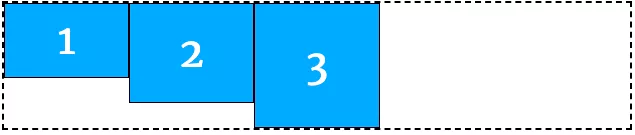
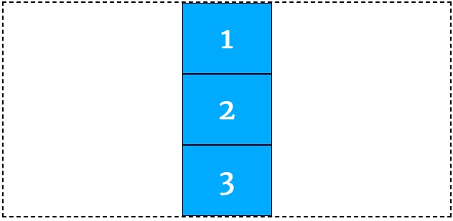
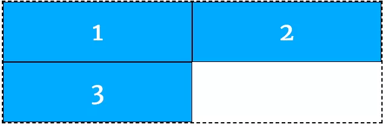
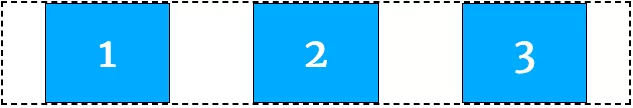
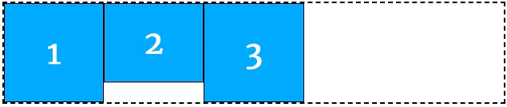
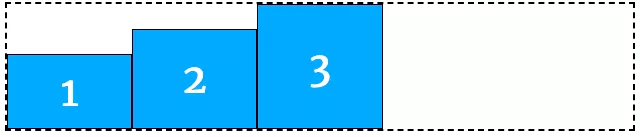
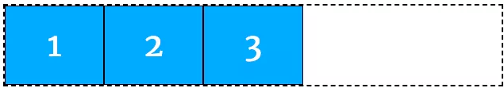
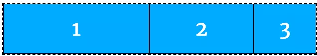
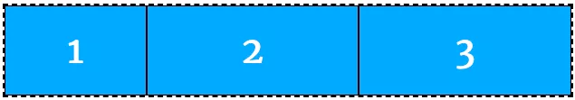

# CSS

## 样式

### 注释

- 以`/*` 开始注释，以`*/` 结束注释，注释可以包含回车，可以跨越多行。

### 行内样式、行间样式

通过标签的style属性来设置元素的样式

```html
<标签名 style="属性1:属性值1; 属性2:属性值2; 属性3:属性值3;"> 内容 </标签名>
```

### 内部样式表、内嵌式

将CSS代码集中写在HTML文档的head头部标签中，并且用style标签定义

```html
<head>
<style type="text/CSS">
    选择器（选择的标签） { 
      属性1: 属性值1;
      属性2: 属性值2; 
      属性3: 属性值3;
    }
</style>
</head>
```

### 外部样式表（外链式）

又称链入式，将所有的样式放在一个或多个以**.CSS**为扩展名的外部样式表文件中，通过link标签将外部样式表文件链接到HTML文档中

 ```html
<head> 
    <link rel="stylesheet" type="text/css" href="css文件路径"> </head>
 ```

| 属性 | 作用                                                         |
| ---- | ------------------------------------------------------------ |
| rel  | 定义当前文档与被链接文档之间的关系，在这里需要指定为“stylesheet”，表示被链接的文档是一个样式表文件。 |
| type | 定义所链接文档的类型，在这里需要指定为“text/CSS”，表示链接的外部文件为CSS样式表。我们都可以省略 |
| href | 定义所链接外部样式表文件的URL，可以是相对路径，也可以是绝对路径。 |

## CSS选择器

### 标签选择器

可以把某一类标签**全部**选择出来 比如所有的div标签 和 所有的 span标签

```css
h1 {
	color:red;
}
```

### 类选择器

类选择器使用“.”（英文点号）进行标识，后面紧跟类名(自定义，我们自己命名的)

```css
 <p class='类名'></p>


.类名  {   
    属性1:属性值1; 
    属性2:属性值2; 
    属性3:属性值3;     
}
```

### id选择器

元素的id值是唯一的，只能对应于文档中某一个具体的元素，使用#id进行标识，只能应用于某y

```css
#id {
	属性1:属性值1;
	属性2:属性值2; 
	属性3:属性值3; 
}
```

### 组合选择器(交集选择器∩)

我们可以给标签指定多个类名，从而达到更多的选择目的。

```css
h1.very {
	属性1:属性值1;
	属性2:属性值2; 
	属性3:属性值3; 
}
<!--各个类名中间不用空格隔开-->
h1#id {
	属性1:属性值1;
	属性2:属性值2; 
	属性3:属性值3; 
}
```

### 并集选择器(∪)

并集选择器（CSS选择器分组）是各个选择器通过 `, `连接而成的，通常用于集体声明。逗号可以理解为和的意思。

```css
.one, p , #test {color: #F00;} 

/*表示 .one 和 p 和 #test 这三个选择器都会执行颜色为红色。 通常用于集体声明。*/
```

### 配符选择器

通配符选择器用 * 号表示， * 就是 选择所有的标签 他是所有选择器中作用范围最广的，能匹配页面中所有的元素。

```css
* {
	属性1:属性值1;
	属性2:属性值2; 
	属性3:属性值3; 
}
```

### 后代选择器

又称为包含选择器，用来选择元素或元素组的**子孙后代**，中间用空格分开，外层标签写在前面，内层标签写在后面，用空格分隔。

```css
父级 子级{
    属性:属性值;
    属性:属性值;
}

.class h3{
    color:red;
    font-size:16px;
}
```

### 子元素选择器

只选择某元素的子元素(亲儿子)，不包含孙子、重孙子之类，父级标签在前，子级标签在后，中间用>进行链接

```css
c.class>h3{
    color:red;
    font-size:14px;
}
```

### 链接伪类选择器

用于向某些选择器添加特殊效果，比如给链接添加特殊效果，比如可以选择第一个，第n各元素。伪类选择器很多，比如链接伪类，结构伪类

#### 链接伪类

- a:link      /* 未访问的链接 */
- a:visited   /* 已访问的链接 */
- a:hover     /* 鼠标移动到链接上 */
- a:active    /* 选定的链接 */

**注意：**

- 顺序不能颠倒，按照lvha的顺序，否则可能引起错误。
- 因为叫链接伪类，所以都是利用交集选择器a:link    a:hover  
- 因为a链接浏览器具有默认样式，所以我们实际工作中都需要给链接单独指定样式。
- 实际工作开发中，很少写全四个状态，一般写法如下：

```css
a { /* a是标签选择器 所有的链接 */ 
    font-weight: 700; 
    font-size: 16px; 
    color: gray; 
}
a:hover { /* :hover 是链接伪类选择器 鼠标经过 */ 
    color: red; /* 鼠标经过的时候，由原来的 灰色 变成了红色 */ 
}
```

### 结构伪类选择器

#### 属性

E:first-child选择器表示的是选择父元素的第一个子元素的元素E。简单点理解就是选择元素中的第一个子元素，记住是子元素，而不是后代元素。

| 选择符            | 简介                        |
| ----------------- | --------------------------- |
| E:first-child     | 匹配父元素中的第一个子E元素 |
| E:last-child      | 匹配父元素中最后一个E元素   |
| E:nth-child(n)    | 匹配父元素中的第n个E元素    |
| E:first-of-tpye   | 指定类型E的第一个           |
| E:last-of-tpye    | 指定类型E的最后一个         |
| E:last-of-tpye(n) | 指定类型E的第n个            |

```css
/*指定第一个li元素*/
ul li:first-child {
  background-color: lightseagreen;
}

/*指定最后一li元素*/
ul li:last-child {
  background-color: lightcoral;
}


/*指定第三个li元素*/
ul li:nth-child(3) {
  background-color: aqua;
}

/*指定第偶数个li元素*/
ul li:nth-child(2n) {
  background-color: aqua;
}
```

#### nth-child

如果n是公式，则n丛0开始计算，但是第0个元素或超出的元素会被忽略

| 公式 | 取值                                |
| ---- | ----------------------------------- |
| 2n   | 偶数                                |
| even | 偶数                                |
| 2n+1 | 奇数                                |
| odd  | 奇数                                |
| 5n   | 第5，10，15....个元素               |
| n+5  | 从第5个元素开始到最后（包含第五个） |
| -n+5 | 其五个元素，包含第五个              |

```css
<style>
  /* 偶数 */
  ul li:nth-child(even) {
    background-color: aquamarine;
  }

  /* 奇数 */
  ul li:nth-child(odd) {
    background-color: blueviolet;
  }

  /*n 是公式，从 0 开始计算 */
  ul li:nth-child(n) {
    background-color: lightcoral;
  }

  /* 偶数 */
  ul li:nth-child(2n) {
    background-color: lightskyblue;
  }

  /* 奇数 */
  ul li:nth-child(2n + 1) {
    background-color: lightsalmon;
  }

  /* 选择第 0 5 10 15, 应该怎么选 */
  ul li:nth-child(5n) {
    background-color: orangered;
  }

  /* n + 5 就是从第5个开始往后选择 */
  ul li:nth-child(n + 5) {
    background-color: peru;
  }

  /* -n + 5 前五个 */
  ul li:nth-child(-n + 5) {
    background-color: tan;
  }
</style>
```

#### 伪元素选择器

| 选择符   | 简介                     |
| -------- | ------------------------ |
| ::before | 在元素内部的前面插入内容 |
| ::after  | 在元素的内部后面插入内容 |

**伪类选择器注意事项**

- `before` 和 `after` 必须有 `content` 属性
- `before` 在内容前面，after 在内容后面
- `before` 和 `after` 创建的是一个元素，但是属于行内元素
- 创建出来的元素在 `Dom` 中查找不到，所以称为伪元素
- 伪元素和标签选择器一样，权重为 1

```css
<style>
    div {
      width: 100px;
      height: 100px;
      border: 1px solid lightcoral;
    }

    div::after,
    div::before {
      width: 20px;
      height: 50px;
      text-align: center;
      display: inline-block;
    }
    div::after {
      content: '德';
      background-color: lightskyblue;
    }

    div::before {
      content: '道';
      background-color: mediumaquamarine;
    }
  </style>
```

**添加字体图标**

```css
p {
   width: 220px;
   height: 22px;
   border: 1px solid lightseagreen;
   margin: 60px;
   position: relative;
}
p::after {
  content: '\ea50';
  font-family: 'icomoon';
  position: absolute;
  top: -1px;
  right: 10px;
}
```


### 属性选择器

使用标签[属性]的方式进行标识

| 选择符        | 简介                                  |
| ------------- | ------------------------------------- |
| E[att]        | 选择具有att属性的E元素                |
| E[att="val"]  | 选择具有att属性且属性值等于val的E元素 |
| E[att^="val"] | 匹配具有att属性、且值以val开头的E元素 |
| E[att$="val"] | 匹配具有att属性、且值以val结尾的E元素 |
| E[att*="val"] | 匹配具有att属性、且值中含有val的E元素 |

```html
<style>
    div[calss]{
        font-size:16px;
    }
    /*以qdq开头的属性*/
    div[calss^='qdq']{
        font-size:15px
    }
    /*以开头的属性*/
    div[calss$='3']{
        font-size:14px
    }
</style>
<div class="qd"></div>
<div class="qdq1"></div>
<div class="qdq2"></div>
<div class="qdq3"></div>
```

### 基础选择器总结

| 选择器       | 作用                  | 缺点                     | 使用情况   | 用法                 |
| ------------ | --------------------- | ------------------------ | ---------- | -------------------- |
| 标签选择器   | 选出所有相同的标签    | 不能差异化选择           | 较多       | p { color：red;}     |
| 类选择器     | 选出1个或者多个标签   | 根据需求选择             | 非常多     | .nav { color: red; } |
| id选择器     | 一次只能选择器1个标签 | 只能使用一次             | 不推荐使用 | \#nav {color: red;}  |
| 通配符选择器 | 选择所有的标签        | 选择的太多，有部分不需要 | 不推荐使用 | \* {color: red;}     |

### 复合选择器总结

| 选择器         | 作用                     | 特征               | 使用情况 | 隔开符号及用法                         |
| -------------- | ------------------------ | ------------------ | -------- | -------------------------------------- |
| 后代选择器     | 用来选择元素后代         | 选择所有的子孙后代 | 较多     | 符号是**空格** .nav a                  |
| 子代选择器     | 选择最近一级元素         | 只选亲儿子         | 较少     | 符号是**>** .nav > p                   |
| 交集选择器     | 选择两个标签交集的部分   | 既是 又是          | 较少     | **没有符号** p.one                     |
| 并集选择器     | 选择某些相同样式的选择器 | 可以用于集体声明   | 较多     | 符号是**逗号** .nav, .header           |
| 链接伪类选择器 | 给链接更改状态           |                    | 较多     | 重点记住 a{} 和 a:hover 实际开发的写法 |

## 文字文本样式

### font样式

| 属性        | 表示     | 注意点                                            |
| :---------- | :------- | :------------------------------------------------ |
| font-size   | 字号     | `font-size:20px; `                                |
| font-family | 字体     |                                                   |
| font-weight | 字体粗细 | 加粗： 700 或 bold   <br />不加粗： normal 或 400 |
| font-style  | 字体样式 | 倾斜： italic <br />不倾斜：normal                |
| font        | 字体连写 |                                                   |

### font-size：大小

font-size属性设置字号

```css
p {  
font-size:20px; 
}
```

**单位**

谷歌浏览器默认的文字大小为16px，不同浏览器字体大小不一样，一般给body指定整个页面文字的大小。

- 相对单位长度：px像素
- 绝对单位长度：in cm mm pt

|   相对单位   |              说明              |
| :----------: | :----------------------------: |
|      em      | 相当于当前对象内文字的字体尺寸 |
|      px      |          像素，最常用          |
| 绝对长度单位 |              说明              |
|      in      |              英寸              |
|      cm      |              厘米              |
|      mm      |              毫米              |
|      pt      |               点               |

### font-family  字体

font-family属性用于设置哪一种字体，可以同时指定多个字体，中间以逗号隔开，表示如果浏览器不支持第一个字体，则会尝试下一个，直到找到合适的字体， 如果都没有，则以我们电脑默认的字体为准。

```css
p{ font-family:"微软雅黑";}
```

**常用技巧**

1. 各种字体之间必须使用英文状态下的逗号隔开。 
2. 中文字体需要加英文状态下的引号，英文字体一般不需要加引号。当需要设置英文字体时，英文字体名必须位于中文字体名之前。
3. 如果字体名中包含空格、#、$等符号，则该字体必须加英文状态下的单引号或双引号，例如font-family: "Times New Roman";。
4. 尽量使用系统默认字体，保证在任何用户的浏览器中都能正确显示。

可以同时指定多个字体，用逗号隔开，如果浏览器不支持第一个字体，则会尝试下一个字体，直到合适为之，如果都没有，则以电脑默认字体为准

```css
p{font-family: Arial,"Microsoft Yahei", "微软雅黑";}
```

| 字体名称    | 英文名称        | Unicode 编码         |
| ----------- | --------------- | -------------------- |
| 宋体        | SimSun          | \5B8B\4F53           |
| 新宋体      | NSimSun         | \65B0\5B8B\4F53      |
| 黑体        | SimHei          | \9ED1\4F53           |
| 微软雅黑    | Microsoft YaHei | \5FAE\8F6F\96C5\9ED1 |
| 楷体_GB2312 | KaiTi_GB2312    | \6977\4F53_GB2312    |
| 隶书        | LiSu            | \96B6\4E66           |
| 幼园        | YouYuan         | \5E7C\5706           |
| 华文细黑    | STXihei         | \534E\6587\7EC6\9ED1 |
| 细明体      | MingLiU         | \7EC6\660E\4F53      |
| 新细明体    | PMingLiU        | \65B0\7EC6\660E\4F53 |

### font-weight 字体粗细

使用b和strong标签是文本加粗，可以使用CSS 来实现，但是CSS 是没有语义的。

| 属性值  | 描述                                  |
| ------- | ------------------------------------- |
| normal  | 默认值（不加粗的                      |
| bold    | 定义粗体（加粗的）                    |
| 100~900 | 400 等同于 normal，而 700 等同于 bold |

```css
div {
    font-weight:700;
}
/*平时使用数字来表示加粗与不加粗*/
```

### font-style 字体风格

字体倾斜除了用i和em标签，也可以用CSS来实现，但是CSS没有语义。

| 属性   | 作用                           |
| ------ | ------------------------------ |
| normal | 默认值，浏览器显示标准字体样式 |
| italic | 浏览器会显示倾斜字体样式       |

```css
div {
    font-style:italic;
}
```

### font 综合设置字体样式

font属性用于对字体样式进行综合设置

```css
div { 
    font: font-style  font-weight  font-size/line-height  font-family;
}
```

**注意**

1. 使用font属性时，必须按上面语法格式中的顺序书写，不能更换顺序，各个属性以**空格**隔开。
2. 其中不需要设置的属性可以省略（取默认值），但必须保留font-size和font-family属性，否则font属性将不起作用。

## CSS外观属性

### color 文本颜色

color属性用于定义颜色,实际工作中,用 16进制的写法是最多的，而且我们更喜欢简写方式比如 #f00 代表红色

| 表示           | 属性值                        |
| -------------- | ----------------------------- |
| 预定义的颜色值 | red，green，blue等            |
| 十六进制       | #FF0000,#FF6600,#29D794       |
| RGB代码        | rgb(255,0,0)或rgb(100%,0%,0%) |

```css
div {
    color:red;
}
```

### text-align 文本水平对齐方式

text-align属性用于设置文本内容的水平对齐，相当于html中的align对齐属性,让盒子内的文字水平居中，而不是让盒子居中

| 属性   |       解释       |
| ------ | :--------------: |
| left   | 左对齐（默认值） |
| right  |      右对齐      |
| center |     居中对齐     |

```css
div {
    text-align:center;
}
```

### line-height 行间距

- line-height属性用于设置行间距，就是行与行之间的距离，即字符的垂直间距，一般称为行高。
- 设置行间距，单位有三种：px像素。相对值em，百分比%。
- 通常行距比字号大7或8个px

### text-indent 首行缩进

text-indent属性用于设置首行文本的缩进，

- em字符宽的倍数，或相对于浏览器窗口宽度的百分比，允许使用负值。
- 1em就是一个字的宽度，如果是汉字段落，1em就是一个汉字的宽度

```css
p {
    line-height: 25px;
    text-indent: 2em;  
 }
```

### text-decoration 文本的装饰

用于给链接修改装饰效果

| 值           | 描述                                                  |
| ------------ | ----------------------------------------------------- |
| none         | 默认。定义标准的文本。 取消下划线（最常用）           |
| underline    | 定义文本下的一条线。下划线 也是我们链接自带的（常用） |
| overline     | 定义文本上的一条线。（不用）                          |
| line-through | 定义穿过文本下的一条线。删除线                        |

```css
div {
    text-decoration:overline;
}
```

### CSS外观属性总结

| 属性            | 表示     | 注意点                                                |
| --------------- | -------- | ----------------------------------------------------- |
| color           | 颜色     | 我们通常用 十六进制 比如 而且是简写形式 #fff          |
| line-height     | 行高     | 控制行与行之间的距离                                  |
| text-align      | 水平对齐 | 可以设定文字水平的对齐方式                            |
| text-indent     | 首行缩进 | 通常我们用于段落首行缩进2个字的距离 text-indent: 2em; |
| text-decoration | 文本修饰 | 记住 添加 下划线 underline 取消下划线 none            |

## CSS三大特性

### CSS层叠性

所谓层叠性是指多种CSS样式的叠加。是浏览器处理冲突的一个能力,如果一个属性通过两个相同选择器设置到同一个元素上，那么这个时候一个属性就会将另一个属性层叠掉

**原则：**

- 样式冲突，遵循的原则是**就近原则。** 那个样式离着结构近，就执行那个样式。
- 样式不冲突，不会层叠

### CSS继承性

子标签会继承父标签的某些样式，如文本颜色和字号，想要设置一个可继承的属性，只需将它应用于父元素即可。简单的理解就是： 子承父业。


### CSS优先级

出现两个或更多规则应用再同一元素上时：选择器相同，则执行层叠性；选择器不同，就会出现优先级的问题

#### 权重计算公式

关于CSS权重，我们需要一套计算公式来去计算，这个就是 CSS Specificity（特殊性）

| 标签选择器             | 计算权重公式 |
| ---------------------- | ------------ |
| 继承或者 *             | 0,0,0,0      |
| 每个元素（标签选择器） | 0,0,0,1      |
| 每个类，伪类           | 0,0,1,0      |
| 每个ID                 | 0,1,0,0      |
| 每个行内样式 style=""  | 1,0,0,0      |
| 每个!important  重要的 | ∞ 无穷大     |

- 只从左到右依次递减，数位之间没有进制

- ```css
  div {
      color: pink!important;  
  }
  ```

#### 权重叠加

交集选择器，后代选择器等，由多个基础选择器组合而成，会出现权重叠加。就是一个简单的加法计算

- div ul  li   ------>      0,0,0,3
- .nav ul li   ------>      0,0,1,2
- a:hover      -----—>   0,0,1,1
- .nav a       ------>      0,0,1,1

注意： 

1. 数位之间没有进制 比如说： 0,0,0,5 + 0,0,0,5 =0,0,0,10 而不是 0,0, 1, 0， 所以不会存在10个div能赶上一个类选择器的情况。

#### 继承权重是0

> 修改样式，需要看标签是否被选中

1） 如果选中了，那么以上面的公式来计权重。谁大听谁的。 
2） 如果没有选中，那么权重是0，因为继承的权重为0.

## 标签显示模式 （display）

一般分为块标签和行内标签，也称块元素和行内元素

### 块级元素  （block-level）

常见的块元素有`<h1>~<h6>、<p>、<div>、<ul>、<ol>、<li>`等，其中`<div>`标签是最典型的块元素。

- 独占一行，高度，宽度，外边距，以及内边距都可以控制
- 宽度默认为容器的100%，即父级宽度
- 是一个容器盒子，可以放行或者块级元素

**注意：**

- 只有文字才能形成段落，所以p标签里面不能放div
- 同理h1-6和dt都是文字类块级标签，不能放其他块级元素

### 行内元素 （inline-level）

常见的行内元素有`<a>、<strong>、<b>、<em>、<i>、<del>、<s>、<ins>、<u>、<span>`等，其中`<span>`标签最典型的行内元素。有的地方也成内联元素

- 相邻行内元素在一行上，一行可以显示多个
- 高、宽直接设置是无效的
- 默认宽度就是它本身内容的宽度
- **行内元素只能容纳文本或则其他行内元素**

**注意：**

- 链接里面不能再放链接
- 特殊情况a里面可以放块级元素，但是给a转换一下块级模式最安全

### 行内块元素（inline-block）

在行内元素中有几个特殊的标签——`、<input />、<td>`，可以对它们设置宽高和对齐属性，有些资料可能会称它们为行内块元素

- 和相邻行内元素（行内块）在一行上,但是之间会有空白缝隙。一行可以显示多个
- 默认宽度就是它本身内容的宽度
- 高度，行高、外边距以及内边距都可以控制

### 三种模式总结区别

| 元素模式   | 元素排列               | 设置样式               | 默认宽度         | 包含                     |
| ---------- | ---------------------- | ---------------------- | ---------------- | ------------------------ |
| 块级元素   | 一行只能放一个块级元素 | 可以设置宽度高度       | 容器的100%       | 容器级可以包含任何标签   |
| 行内元素   | 一行可以放多个行内元素 | 不可以直接设置宽度高度 | 它本身内容的宽度 | 容纳文本或则其他行内元素 |
| 行内块元素 | 一行放多个行内块元素   | 可以设置宽度和高度     | 它本身内容的宽度 |                          |

### 标签显示模式转换 display

- 块转行内：display:inline;
- 行内转块：display:block;
- 块、行内元素转换为行内块： display: inline-block;

## 盒子模型

网页布局的本质是首先利用CSS设置好盒子大小，再摆放盒子位置最后将网页元素放入盒子内

### 盒子模型（Box Model）

将HTML页面中的布局元素堪称一个矩形的盒子，也就是内容容器


- 盒子模型有元素的内容、边框（border）、内边距（padding）、和外边距（margin）组成。
  - 盒子里面的文字和图片等元素是 内容区域
  - 盒子的厚度 我们成为 盒子的边框 
  - 盒子内容与边框的距离是内边距（类似单元格的 cellpadding)
  - 盒子与盒子之间的距离是外边距（类似单元格的 cellspacing）

- 标准盒子模型


### 盒子边框 border

```css
border : border-width || border-style || border-color 
```

| 属性         |          作用          |
| ------------ | :--------------------: |
| border-width | 定义边框粗细，单位是px |
| border-style |       边框的样式       |
| border-color |        边框颜色        |

**边框样式border-style：**

| 属性   | 简介                                   |
| ------ | -------------------------------------- |
| none   | 没有边框即忽略所有边框的宽度（默认值） |
| solid  | 边框为单实线(最为常用的)               |
| dashed | 边框为虚线                             |
| dotted | 边框为点线                             |

**边框综合设置：**

```css
border : border-width || border-style || border-color 

border: 1px solid red;  没有顺序  
```

**盒子边框写法总结表：**

很多情况下，我们不需要指定4个边框，我们是可以单独给4个边框分别指定的。

| 上边框                     | 下边框                        | 左边框                      | 右边框                       |
| :------------------------- | :---------------------------- | :-------------------------- | :--------------------------- |
| border-top-style:样式;     | border-bottom-style:样式;     | border-left-style:样式;     | border-right-style:样式;     |
| border-top-width:宽度;     | border- bottom-width:宽度;    | border-left-width:宽度;     | border-right-width:宽度;     |
| border-top-color:颜色;     | border- bottom-color:颜色;    | border-left-color:颜色;     | border-right-color:颜色;     |
| border-top:宽度 样式 颜色; | border-bottom:宽度 样式 颜色; | border-left:宽度 样式 颜色; | border-right:宽度 样式 颜色; |

### 表格边框 border-collapse

- 通过表格的 `cellspacing="0"` ,将单元格与单元格之间的距离设置为0，

- 但是两个单元格之间的边框会出现重叠，从而使边框变粗

- 通过css属性：border-collapse:collapse; 表示相邻边框合并在一起


~~~css
<style>
	table {
		width: 500px;
		height: 300px;
		border: 1px solid red;
	}
	td {
		border: 1px solid red;
		text-align: center;
	}
	table, td {
		border-collapse: collapse;  /*合并相邻边框*/
	}
</style>
~~~

### 内边距 padding

padding属性用于设置内边距，**是指边框与内容之间的距离。**给盒子指定padding值之后,内容和边框 有了距离，添加了内边距，同时盒子会变大。

| 属性           | 作用     |
| -------------- | :------- |
| padding-left   | 左内边距 |
| padding-right  | 右内边距 |
| padding-top    | 上内边距 |
| padding-bottom | 下内边距 |

**padding参数简写：**

| 值的个数 | 表达意思                                        |
| -------- | ----------------------------------------------- |
| 1个值    | padding：上下左右内边距;                        |
| 2个值    | padding: 上下内边距    左右内边距 ；            |
| 3个值    | padding：上内边距   左右内边距   下内边距；     |
| 4个值    | padding: 上内边距 右内边距 下内边距 左内边距 ； |

**内盒尺寸计算（元素实际大小）**

- 宽度

  Element Height = content height + padding + border （Height为内容高度）

- 高度

  Element Width = content width + padding + border （Width为内容宽度）

- 盒子的实际的大小 =   内容的宽度和高度 +  内边距   +  边框   

```css
box-sizing:border-box
//增加边距时不撑大盒子
//可以忽略边框与内边距对盒子大小的影响
```

**内边距产生的问题**

增大盒子内边距时，会撑大原来的盒子，通过给设置了宽高的盒子，减去相应的内边距的值，维持盒子原有的大小。如果没有给一个盒子指定宽度， 此时，如果给这个盒子指定padding， 则不会撑开盒子。

### 外边距（margin）

margin属性用于设置外边距。  margin就是控制**盒子和盒子之间的距离**

**属性**

| 属性          | 作用     |
| ------------- | :------- |
| margin-left   | 左外边距 |
| margin-right  | 右外边距 |
| margin-top    | 上外边距 |
| margin-bottom | 下外边距 |

margin值的简写 （复合写法）代表意思  跟 padding 完全相同。

## 块级盒子水平居中

可以让一个块级盒子实现水平居中盒子必须指定了宽度（width），然后就给**左右的外边距都设置为auto**，实际工作中常用这种方式进行网页布局，示例代码如下：

~~~css
.header{ width:960px; margin:0 auto;}
~~~

常见的写法，以下下三种都可以。

* margin-left: auto;   margin-right: auto;
* margin: auto;
* margin: 0 auto;

## 文字居中和盒子居中区别

1.  盒子内的文字水平居中是  text-align: center,  而且还可以让行内元素和行内块居中对齐
2.  块级盒子水平居中  左右margin 改为 auto 

~~~css
text-align: center; /*  文字 行内元素 行内块元素水平居中 */
margin: 10px auto;  /* 块级盒子水平居中  左右margin 改为 auto 就阔以了 上下margin都可以 */
~~~

## 插入图片和背景图片区别

1. 插入图片 我们用的最多 比如产品展示类  移动位置只能靠盒模型 padding margin
2. 背景图片我们一般用于小图标背景 或者 超大背景图片  背景图片 只能通过  background-position

~~~css
 img {  
		width: 200px;/* 插入图片更改大小 width 和 height */
		height: 210px;
		margin-top: 30px;  /* 插入图片更改位置 可以用margin 或padding  盒模型 */
		margin-left: 50px; /* 插入当图片也是一个盒子 */
	}

 div {
		width: 400px;
		height: 400px;
		border: 1px solid purple;
		background: #fff url(images/sun.jpg) no-repeat;
		background-position: 30px 50px; /* 背景图片更改位置 我用 background-position */
	}


~~~

## 清除元素的默认内外边距(重要)

为了更灵活方便地控制网页中的元素，制作网页时，我们需要将元素的默认内外边距清除

~~~css
* {
   padding:0;         /* 清除内边距 */
   margin:0;          /* 清除外边距 */
}
~~~

**注意：**  

行内元素为了照顾兼容性， 尽量只设置左右内外边距， 不要设置上下内外边距。

## 外边距合并

使用margin定义块元素的**垂直外边距**时，可能会出现外边距的合并。

### 相邻块元素垂直外边距的合并

当上下相邻的两个块元素相遇时，如果上面的元素有下外边距margin-bottom，下面的元素有上外边距margin-top，则他们之间的垂直间距不是margin-bottom与margin-top之和，而是**取两个值中的较大者**这种现象被称为相邻块元素垂直外边距的合并（也称外边距塌陷）。

**解决方案：尽量给只给一个盒子添加margin值**。

###  嵌套块元素垂直外边距的合并（塌陷）

对于两个嵌套关系的块元素，如果父元素没有上内边距及边框，父元素的上外边距会与子元素的上外边距发生合并，合并后的外边距为两者中的较大者。

**解决方案：**

1. 可以为父元素定义上边框。
2. 可以为父元素定义上内边距
3. 可以为父元素添加overflow:hidden。

# Emment语法

Emment语法的前身是Zen coding ,他使用缩写， 是一个能大幅度提高前端开发效率的工具，能够实现 HTML、CSS 的快速编写。VScode内部已集成该语法。

- 官网地址：http://emmet.io/
- 官方文档：http://docs.emmet.io/cheat-sheet/
- **Atom**的**emmet**介绍页面：https://atom.io/packages/emmet

## 使用Emmet的好处

通常大多数的文本编辑器都会允许我们存储和重用一些代码块，我们称之为“片段”。虽然片段能很好地推动我们的生产力，但大多数的实现都有这样一个缺点：我们必须先定义代码片段，并且不能再运行时进行拓展。

而 **Emmet** 把片段这个概念提高到了一个新的层次：我们可以设置 **CSS** 形式的能够动态被解析的表达式，然后根据输入的缩写来得到相应的内容。**Emmet** 很成熟的并且非常适用于编写 **HTML**/**XML** 和 **CSS** 代码的前端开发人员，但也可以用于编程语言。

## 简单的使用样例

1. 生成标签 直接输入标签名 按tab键即可   比如  div   然后tab 键， 就可以生成 `<div></div>`

2. 如果想要生成多个相同标签  加上 * 就可以了 比如   div*3  就可以快速生成3个div

3. 如果有父子级关系的标签，可以用 >  比如   ul > li就可以了

4. 如果有兄弟关系的标签，用  +  就可以了 比如 div+p  

5. 如果生成带有类名或者id名字的，  直接写  .demo  或者  #two   tab 键就可以了

6. 如果生成的div 类名是有顺序的， 可以用 自增符号  $   

   ```html
   .demo$*3        
   <div class="demo1"></div>
   <div class="demo2"></div>
   <div class="demo3"></div>
   ```

我们在编辑器中输入如下代码：

```html
输入ul>li*6后按下TAB键，将自动扩展为完成html代码片段，如下：
<ul>
	<li></li>
	<li></li>
	<li></li>
	<li></li>
	<li></li>
	<li></li>
</ul>
```

## 基本语法

### 后代：>

```html
nav>ul>li  得到如下扩展代码：
<nav>
    <ul>
        <li></li>
    </ul>
</nav>
```

### 兄弟：+

```html
div+p+bq 得到如下扩展代码：
<div></div>
<p></p>
<blockquote></blockquote>
```

### 上级：^

缩写↓

```html
div+div>p>span+em^bq  得到如下扩展代码：
<div></div>
<div>
	<p><span></span><em></em></p>
	<blockquote></blockquote>
</div>

div+div>p>span+em^^bq  得到如下扩展代码：
<div></div>
<div>
	<p><span></span><em></em></p>
</div>
<blockquote></blockquote>
```

### 分组：()

```html
div>(header>ul>li*2>a)+footer>p  得到如下扩展代码：
<div>
    <header>
        <ul>
            <li><a href=""></a></li>
            <li><a href=""></a></li>
        </ul>
    </header>
    <footer>
        <p></p>
    </footer>
</div>

(div>dl>(dt+dd)*3)+footer>p
<div>
    <dl>
        <dt></dt>
        <dd></dd>
        <dt></dt>
        <dd></dd>
        <dt></dt>
        <dd></dd>
    </dl>
</div>
<footer>
    <p></p>
</footer>
```

###  乘法：*

```html
ul>li*5
<ul>
    <li></li>
    <li></li>
    <li></li>
    <li></li>
    <li></li>
</ul>
```

### 自增符号：$

```html
ul>li.item$*5
<ul>
    <li class="item1"></li>
    <li class="item2"></li>
    <li class="item3"></li>
    <li class="item4"></li>
    <li class="item5"></li>
</ul>

h$[title=item$]{Header $}*3
<h1 title="item1">Header 1</h1>
<h2 title="item2">Header 2</h2>
<h3 title="item3">Header 3</h3>

ul>li.item$$$*5
<ul>
    <li class="item001"></li>
    <li class="item002"></li>
    <li class="item003"></li>
    <li class="item004"></li>
    <li class="item005"></li>
</ul>

ul>li.item$@-*5
<ul>
    <li class="item1@-"></li>
    <li class="item2@-"></li>
    <li class="item3@-"></li>
    <li class="item4@-"></li>
    <li class="item5@-"></li>
</ul>
```

## ID和类属性

```html
#header
<div id="headee"></div>
```

```html
.title
<div class="title"></div
```

```html
form#search.wide
<form action="" id="search" class="wide"></form>
```

```html
p.class1.class2.class3
<p class="class1 class2 class3"></p>
```

## 自定义属性

```html
p[title="Hello world"]
<p title="Hello world"></p>
```

```html
td[rowspan=2 colspan=3 title]
<td rowspan="2" colspan="3" title=""></td>
```

```html
[a='value1' b="value2"]
<div a="value1" b="value2"></div>
```

## 文本：{}

```html
a{Click me}
<a href="">Click me</a>
```

```html
p>{Click }+a{here}+{ to continue}
<p>
    Click 
    <a href="">here</a>
    to continue
</p>
```

##  隐式标签

```html
.class
<div class="class"></div>
```

```html
em>.class
<em><span class="class"></span></em>
```

```html
ul>.class
<ul>
    <li class="class"></li>
</ul>
```

```html
table>.row>.col
<table>
    <tr class="row">
        <td class="col"></td>
    </tr>
</table>
```

## 基本html标签

### ！

```html
! 得到如下代码：
<!DOCTYPE html>
<html lang="en">
<head>
    <meta charset="UTF-8">
    <meta name="viewport" content="width=device-width, initial-scale=1.0">
    <title>Document</title>
</head>
<body>
    
</body>
</html>
```

### a

```html
a
<a href=""></a>

a:link
<a href="http://"></a>

a:mail
<a href="mailto:"></a>
```

### br

```html
br
<br>
```

### link

```html
link
<link rel="stylesheet" href="">

link:css
<link rel="stylesheet" href="style.css">

link:print
<link rel="stylesheet" href="print.css" media="print">

link:favicon
<link rel="shortcut icon" href="favicon.ico" type="image/x-icon">

link:touch
<link rel="apple-touch-icon" href="favicon.png">

link:rss
<link rel="alternate" href="rss.xml" type="application/rss+xml" title="RSS">
```

### meta

```html
meta
<meta>

meta:vp
<meta name="viewport" content="width=device-width, initial-scale=1.0">
```

### style

```html
style
<style></style>

script
<script></script>

script:src
<script src=""></script>
```

### img

```html
img

```

### form


```html
form
<form action=""></form>

form:get
<form action="" method="get"></form>

form:post
<form action="" method="post"></form>
```

### label

```html
label
<label for=""></label>
```

### input

```html
input
<input type="text">

inp
<input type="text" name="" id="">

input:hidden   别名：input[type=hidden name]
<input type="hidden" name="">

input:h   别名：input:hidden
<input type="hidden" name="">

input:text, input:t    别名：inp
<input type="text" name="" id="">

input:email  别名：inp[type=email]
<input type="email" name="" id="">

input:url    别名：inp[type=url]
<input type="url" name="" id="">

input:password   input:p   别名：inp[type=password]
<input type="password" name="" id="">

input:datetime   别名：inp[type=datetime]
<input type="datetime" name="" id="">

input:date   别名：inp[type=date]
<input type="date" name="" id="">
```

# flex布局

操作方便，布局及其简单，移动端使用比较广泛，PC浏览器支持情况比较差，IE11或更低版本不支持flex或仅部分支持

## flex布局原理

- flexuble Box的缩写，意思为弹性布局，用来为盒状模型提供最大的灵活性，任何一个容器都可以指定为 flex 布局。
- 当我们为父盒子设为 flex 布局以后，子元素的 float、clear 和 vertical-align 属性将失效。
- 采用 Flex 布局的元素，称为 Flex 容器（flex container），简称"容器"。它的所有子元素自动成为容器成员，称为 Flex 项目（flex
  item），简称"项目"。

**总结**：就是通过给父盒子添加flex属性，来控制子盒子的位置和排列方式

## 父项常见属性

### 属性

| 属性            | 简介                                                   |
| --------------- | ------------------------------------------------------ |
| flex-direction  | 设置主轴的方向                                         |
| justify-content | 设置主轴上的子元素排列方式                             |
| flex-wrap       | 设置子元素是否换行                                     |
| align-content   | 设置侧轴上的子元素的排列方式（多行）                   |
| align-items     | 设置侧轴上的子元素排列方式（单行）                     |
| flex-flow       | 复合属性，相当于同时设置了 flex-direction 和 flex-wrap |

- flex-direction：设置主轴的方向
  - row：默认值从左到右
  - row-reverse：从右到左
  - column：从上到下
  - column-reverse：从下到上
- justify-content：设置主轴上的子元素排列方式
  - flex- start：默认值从头部开始如果主轴是x轴，则从左到右
  - flex-end：从尾部开始排列
  - center：在主轴居中对齐(如果主轴是x轴则水平居中)
  - space-around：平分剩余空间
  - space-between：先两边贴边再平分剩余空间(重要)
- flex-wrap：设置子元素是否换行
  - nowrap：不换行
  - wrap：换行
- align-content：设置侧轴上的子元素的排列方式（多行）
  - flex-start：默认值在侧轴的头部开始排列
  - flex-end：在侧轴的尾部开始排列
  - center：在侧轴中间显示
  - space-around：子项在侧轴平分剩余空间
  - space- between：子项在侧轴先分布在两头，再平分剩余空间
  - stretch：设置子项元素高度平分父元素高度
- align-items：设置侧轴上的子元素排列方式（单行）
  - stretch：将拉伸所有项目以填充侧轴的整个高度(默认)
  - flex-start：与 justify-content 的 flex-start 的工作原理相同
- flex-flow：复合属性，相当于同时设置了 flex-direction 和 flex-wrap
  - flex-grow：允许占用多少额外空间来填充其容器
  - flex-shrink：自动缩小以填充正确的大小
  - flex-basis：容器项目在容器中占用了多少空间

### flex-direction

#### 属性值

在 flex 布局中，是分为主轴和侧轴两个方向，同样的叫法有 ： 行和列、x 轴和y 轴。默认主轴方向就是 x 轴方向，水平向右，默认侧轴方向就是 y 轴方向，水平向下

**注意：** 主轴和侧轴是会变化的，就看 flex-direction 设置谁为主轴，剩下的就是侧轴。而我们的子元素是跟着主轴来排列的

| 值             | 效果           |
| -------------- | -------------- |
| row            | 默认值从左到右 |
| row-reverse    | 从右到左       |
| column         | 从上到下       |
| column-reverse | 从下到上       |

#### 从左向右 row(默认)

默认方向是行。这意味着主轴是水平的，而横轴是垂直的。这也意味着主轴从左侧开始，而横轴从顶部开始。

```css
.flex-container { 
    display: flex; 
    flex-direction: row; 
    justify-content: flex-start; 
    align-items: flex-start;
}
```



#### 从右向左 row-reverse

与 row 类似，该方向不会交换主轴/交叉轴，但会交换主轴开始的位置。主轴现在从右边开始，而横轴没有改变，仍然从顶部开始。

```css
.flex-container { 
    display: flex; 
    flex-direction: row-reverse; 
    justify- content: flex-start; 
    align-items: flex-start;
}
```


#### 从上到下 column

列方向完全交换了轴，所以现在主轴是垂直的，侧轴是水平的。如果使用 justify-content，将在垂直方向布置元素，而 align-items 将在水平方向工作。

```css
.flex-container { 
    display: flex; 
    flex-direction: column; 
    justify-content: flex-start; 
    align-items: center; 
}
```



#### 从下到上 column-reverse

column-reverse 方向与 column 基本相同，但它反转了主轴的方向，因此现在项目从容器的底部开始。

```css
.flex-container { 
    display: flex; 
    flex-direction: column-reverse; 
    justify-content: flex-start; 
    align-items: center; 
}
```


### flex-wrap

默认情况下，项目都排在一条线（又称”轴线”）上。flex-wrap属性定义，flex布局中默认是不换行的。

| 值     | 简介   |
| ------ | ------ |
| nowrap | 不换行 |
| wrap   | 换行   |

```css
.flex-container { 
    flex-wrap: wrap;
}
.flex-item { 
    width: 50%;
}
```



如果在列布局中使用 flflex-wrap，则项目将换行到新列而不是行上。

```css
.flex-container { 
    flex-direction: column; 
    height: 250px; 
    flex-wrap: wrap;
}
.flex-item {
    height: 100px;
}
```


### justify-content 

#### 属性值

| 值            | 效果                                      |
| ------------- | ----------------------------------------- |
| flex- start   | 默认值从头部开始如果主轴是x轴，则从左到右 |
| flex-end      | 从尾部开始排列                            |
| center        | 在主轴居中对齐(如果主轴是x轴则水平居中)   |
| space-around  | 平分剩余空间                              |
| space-between | 先两边贴边再平分剩余空间(重要)            |

#### 始对齐 flex-start

将所有项目放置在主轴的起点，默认情况下是轴的左侧。这也是 justify-content 的默认行为。

```css
.flex-container {
    display: flex; 
    justify-content: flex-start; 
}
```


#### 尾对齐 flex-end

```css
.flex-container { 
    display: flex; 
    justify-content: flex-end; 
}
```


#### 居中对齐 center

```css
.flex-container { 
    display: flex; 
    justify-content: center; 
}
```


#### 两端对齐 space-between

这会占用容器内的所有额外空间，并将其均匀分布在每个元素之间，以在填充整个容器的同时将它们彼此间隔得尽可能远。

```css
.flex-container { 
    display: flex; 
    justify-content: space-between; 
}
```


#### 均匀对齐 space-around

这与 space-between非常相似，但它也在容器外部和第一个/最后一个元素之间增加了空间。容器外部和第一个/最后一个元素之间的空间量正好是元素之间空间量的一半。

```css
.flex-container { 
    display: flex; 
    justify-content: space-around; 
}
```



###  align-items (单行)

该属性是控制子项在侧轴（默认是y轴）上的排列方式  在子项为单项（单行）的时候使用

#### 属性值

| 属性          | 简介                                              |
| ------------- | ------------------------------------------------- |
| stretch(默认) | 将拉伸所有项目以填充侧轴的整个高度                |
| flex-start    | 与 justify-content 的 flflex-start 的工作原理相同 |

#### 拉伸 stretch

拉伸所有项目以填充横轴的整个高度，除非它们设置了特定的高度。stretch是 align-items 的默认行为。

```css
.flex-container { 
    display: flex; 
    align-items: stretch;
}
.flex-item:nth- child(1) { 
    /* 这就像我们没有设置高度一样 */ 
    height: initial;
}
```

第一个子元素的高度设置为初始值，这与从未在第一个孩子上设置高度基本相同。默认情况下，当 div 没有高度时，它只是其中内容的高度，第一个子项填充了容器的整个高度，因为它被拉伸以填充整个高度。第二个元素没有拉伸，因为其设置了 100px 的特定高度。



#### 始对齐 flex-start

这与 justify-content 的 flflex-start 的工作原理相同，但默认情况下将从交叉轴的顶部开始。

```css
.flex-container { 
    display: flex; 
    align-items: flex-start;
}
```


#### 尾对齐 flex-end 

这与 justify-content 的 flflex-end 的工作原理相同，但默认情况下将从交叉轴的底部开始。

```css
.flex-container { 
    display: flex;
    align-items: flex-end;
}
```



#### 居中对齐 center 

这与 justify-content 的 center 相同，但将基于交叉轴居中。

```css
.flex-container { 
    display: flex; 
    align-items: center;
}
```


### align-content(多行)

设置子项在侧轴上的排列方式 并且只能用于子项出现 换行 的情况（多行），在单行下是没有效果的。

| 值             | 效果                                   |
| -------------- | -------------------------------------- |
| flex-start     | 默认值在侧轴的头部开始排列             |
| flex-end       | 在侧轴的尾部开始排列                   |
| center         | 在侧轴中间显示                         |
| space-around   | 子项在侧轴平分剩余空间                 |
| space- between | 子项在侧轴先分布在两头，再平分剩余空间 |
| stretch        | 设置子项元素高度平分父元素高度         |

### align-content 和align-items区别

+ align-items  适用于单行情况下， 只有上对齐、下对齐、居中和 拉伸
+ align-content 适应于换行（多行）的情况下（单行情况下无效）， 可以设置 上对齐、下对齐、居中、拉伸以及平均分配剩余空间等属性值。 
+ 单行找 align-items  多行找 align-content

### flex-flow 

flex-direction 和 flex-wrap 属性的

```css
flex-flow:row wrap;
```

## 调整 Flex Item的大小

flexbox 的真正威力不在于它的布局属性（尽管这些属性很棒），而在于它能够根据页面上其他元素的大小调整项目的大小。

### 属性

| 属性        | 简介                             |
| ----------- | -------------------------------- |
| flex-grow   | 允许占用多少额外空间来填充其容器 |
| flex-shrink | 自动缩小以填充正确的大小         |
| flex-basis  | 容器项目在容器中占用了多少空间   |

flex-grow 属性是 flex 项目上定义的一个属性，它告诉项目该项目允许占用多少额外空间来填充其容器。默认情况下，此属性设置为 0，这意味着该项目不会获得任何额外空间。如下 flex 容器中没有任何项目设置了 flex-grow的情况 ：



### 获取剩余空间 flex-grow 

第一个和第二个元素的 flex-grow 都设置为 1，所以现在这些元素中的每一个都将获得剩余空间的 1 部分。

```css
.flex-item:nth-child(1),.flex-item:nth-child(2) {  
    flex-grow: 1;}
```


我们可以通过为某些元素提供或多或少的可用空间来制作更复杂的布局，们让第一个元素得到剩余空间的 2 部分，而第二个元素只得到 1 部分。即第一个元素获取剩余空间的三分之二，第二个元素获取剩余空间的三分之一。

```css
.flex-item:nth-child(1) {  
    flex-grow: 2;
}

.flex-item:nth-child(2) {  
    flex-grow: 1;
}
```



### 设置所占空间 flex-basis 

flex-basis 属性告诉我们的 flex 容器项目在容器中占用了多少空间。默认情况下，它设置为 auto 这意味着它只使用元素的 width 属性来计算它。

```css
.flex-item:nth-child(1) {  
    flex-basis: 40%;
}
```

### flex-shrink

如果容器中的 flex 项目溢出容器，它们将自动缩小以填充正确的大小。这是因为默认情况下，所有 flex 项目的 flex-shrink 都设置为 1，即使每个元素应该占容器的 50%，它们也会均匀地缩小，因此每个元素只有容器大小的 33%。如果我们想防止其中一个子元素收缩，我们可以将 flex-shrink 设置为 0。

```css
.flex-item {  
    width: 50%;
}
.flex-item:nth-child(1) {  
    flex-shrink: 0;
}
```


通过将 flex-shrink 设置为 2，第一个元素应该失去溢出空间的 2 部分，而其他两个元素每个只丢失 1部分，因为它们默认设置 flex-shrink为1。这在比例方面与 flflex-grow 完全相同，但 flex-shrink 处理容器外溢出的空间，而 flex-grow 处理容器内剩余的空间。

```css
.flex-item { 
    width: 50%;
}

.flex-item:nth-child(1) { 
    flex-shrink: 2;
}

/*溢出50%,1，1失去权重2，2/3失去权重1，即1失去1/2，2和3失去1/4，即1.2.3之间大小比例为0.5：0.75：0.75*/
```



## 添加间隙 gap

可以尝试使用margin/padding来执行此操作，但更简单的方法是使用 gap 属性。此属性将根据我们传递给 gap 的值在每个项目之间添加空间。

### 单行添加间隙

```css
.flex-container { 
    gap: 10px;
}
```

### 多行添加间隙

```css
.flex-container { 
    flex-direction: column;
    height: 250px; 
    flex-wrap: wrap; 
    align-content: center; 
    gap: 10px;
}
.flex-item { 
    height: 100px;}
```

### 仅添加行间距

```css
.flex-container { 
    flex-direction: column; 
    height: 250px; 
    flex-wrap: wrap; 
    align-content: center; 
    row-gap: 10px;
}
.flex-item { 
    height: 100px;
}
```

### 仅添加列间距

```css
.flex-container { 
    flex-direction: column;
    height: 250px; 
    flex-wrap: wrap; 
    align-content: center; 
    column-gap: 10px;
}
.flex-item { 
    height: 100px;
}
```

## 元素排列

### order

默认情况下，我们可以使用 flex-direction 以正常顺序或相反顺序对元素进行排序，但我们也可以使用order 属性对单个元素进行排序。

```css
.flex-item:nth-child(1) { 
    order: 2
}
.flex-item:nth-child(2) { 
    order: 1
}
.flex-item:nth-child(3) { 
    order: 1
}
```

通过指定元素的 order 属性，我们可以确定它们的确切顺序。默认情况下，每个元素的顺序为 0，并且由于 flexbox 将根据它们在 HTML 中的顺序以相同的顺序排列所有元素，你会注意到，如果你不定义任何顺序，所有元素将保持和HTML 相同的顺序 。在我们的示例中，我们为第一个项目指定了 2 的order，然后为其他两个项目指定了 1 的order。当flexbox 布局项目时，它从最低的顺序开始，在我们的例子中是 1。由于我们的第二个和第三个元素具，有相同的顺序，它们将根据它们的 HTML 顺序进行排序，因此第二个元素将首先出现，而 第三个元素将排在第二位。最后，我们的第一个元素的阶数为 2，比 1 大，因此它将作为我们的最后一个元素。现在这似乎是一个很酷的技巧，它允许你真正改变页面的工作方式，但建议永远不要使用 order 属性。这样做的原因是它不适用于屏幕阅读器，因为屏幕阅读器总是根据 HTML 顺序阅读。例如在我们上面的场景中，一个人看着屏幕会看到数字的顺序是 2、3、1，而屏幕阅读器会看到它们的顺序是 1、2、3，因为这是它们出现在 HTML 中的顺序 .

### align-self 

align-self 属性允许单个项目有与其他项目不一样的对齐方式，可覆盖 align-items 属性。默认值为 auto，表示继承父元素的 align-items 属性，如果没有父元素，则等同于 stretch。

````
span:nth-child(2) {
      /* 设置自己在侧轴上的排列方式 */
      align-self: flex-end;
}
````

## flex 简写

flflex-grow、flflex-shrink 和 flflex-basis。通常只需要定义其中一个，但如果你想一次定义多个，你可以使用定义所有 3 个属性的 flflex 简写属性。

```css
.flex-item { 
    flex: 1 0 10px;
}

/*上下两种方式等价*/

.flex-item { 
    flex-grow: 1; 
    flex-shrink: 0; 
    flex-basis: 10px;
}
```

这个属性的工作方式是第一个值传递给 flex-grow，第二个值传递给 flex-shrink，第三个属性传递给flex-basis。如果你只定义了第一个属性，那么它只会设置 flex-grow 属性。但是，CSS 足够聪明，如果传递一个宽度值，比如 10px，作为唯一的 flex 属性，那么它只会设置 flex-basis。

```css
.flex-item { 
    flex: 2;
}
/* 等同于 */
.flex-item { 
    flex-grow: 2; 
    flex-shrink: 1; 
    flex-basis: 0;
}


.flex-item { 
    flex: 10px;
}
/* 等同于 */
.flex-item { 
    flex-grow: 0; 
    flex- shrink: 1; 
    flex-basis: 10px;
}
```

使用 flex 简写时，除非定义，否则 flex-grow 将默认为 0，flex-shrink 将默认为 1，而 flex-basis 将默认为 0。这一点很重要，因为 flex-basis 通常是自动的，但如果你使用 flex 简写，除非定义，否则默认flex-basis 为 0。

# HTML 

## HTML骨架

```html
<!DOCTYPEhtml>
<html lang="en">
<head>
<meta charset="UTF-8">
<title>Title</title>
</head>
<body>

</body>
</html>
```

**骨架标签总结**

|    标签名     |                         说明                         |
| :-----------: | :--------------------------------------------------: |
|   HTML标签    |               页面中最大的标签，根标签               |
| head头部标签  |             head标签中必须设置title标签              |
| title标题标签 |                     设置网页标题                     |
| body主题标签  | 元素包含文档所有内容，页面的内容基本都是放在body里面 |

### 文档类型<!DOCTYPE>

- 用法

  ```html
  <!DOCTYPEhtml>
  ```

- 作用

  > <!DOCTYPE>位于文档最前面，处于标签之前，声明使用HTML或XHTML规范

### 注释标签

- 简单注释

  > <!--注释语句-->快捷键是：ctrl+/

### 网页语言lang

- en：英语

- zh-CN：中文

  > 指定标签所用语言为中文
  >
  > ```html
  > <html lang="zh-cn"</html>
  > <html lang="en"</html>
  > ```

### 字符集

```html
<meta charset="utf-8"/>
```

- GB2312：简体中文，包含6763个汉字
- BIG5：繁体中文
- GBK：包含全部中文字符，是GB2312的扩展，加入繁体字，兼容GB2312
- UTF-8：包含全世界所有国家需要用到的字符

## HTML常用标签

### 排版标签 

|     标签名      |    定义    |              说明              |
| :-------------: | :--------: | :----------------------------: |
|   `<hx></hx>`   |  标题标签  | 作为标题使用，字号依据标题递减 |
|    `<p></p>`    |  段落标签  | 可以把HTML文档分割为若干个段落 |
|     `<hr>`      | 水平线标签 |        添加一条水平横线        |
|     `<br>`      |  换行标签  |         将文字内容换行         |
|  `<div></div>`  |  div标签   |  布局，一行只能有一个div标签   |
| `<span></span>` |  span标签  |  布局，一行可以有多个span标签  |
| 行末空格  &nbsp |            |            行末空格            |
|   尖括号 &gt    |            |         右尖括号，即 >         |

### 文本格式化标签

|            标签             |          显示效果          |
| :-------------------------: | :------------------------: |
| `<b></b> <strong></strong>` | 加粗，XHTML推荐使用strong  |
|     `<i></i> <em></em>`     |   斜体，XHTML推荐使用em    |
|    `<s></s> <del></del>`    | 加删除线，XHTML推荐使用del |
|    `<u></u><ins></ins>`     |  加下划线，XHTML推荐使用u  |

区别：b知识加粗，stong有还有强调的意思，语义更强烈，其余同理

## 图像标签 img

> 单标签，src指定路径和文件名，是img的必须属性

```html

```

### 图像标签属性

|  属性  |    属性值    |           描述           |
| :----: | :----------: | :----------------------: |
|  src   |     URL      |        图像的路径        |
|  alt   |     文本     | 图像不能显示时的替换文本 |
| title  |     文本     |   鼠标悬浮时显示的内容   |
| width  | 像素、百分比 |      设置图像的宽度      |
| height | 像素、百分比 |      设置图像的高度      |
| border |     数字     |    设置图像边宽的宽度    |

> - 采取键值对的格式“key”=“value”的格式

## 链接标签 a  （anchor）

> anchor，锚只需要标签将文字括起来

```html
<h4>图片链接：</h4>
<a href="http://www.baidu.com"><imgsrc="images/timg.jpg" alt=""></a>
```

### 属性

| 属性   | 作用                                                         |
| ------ | ------------------------------------------------------------ |
| href   | 用于指定url链接，(必须属性)，标签应用href时，具有超链接功能  |
| target | 用于指定链接页面打开方式，`_self(默认)`和`_blank`两种方式，`_blank`为在新窗口中打开 |

不仅文本可以创建超链接,网页元素,图像,表格,音频,视频都可以添加超链接

## 表格

### 创建表格

```html
<table>
<tr>
<td>姓名</td>
<td>年龄</td>
<td>性别</td>
</tr>
<tr>
<td>张三</td>
<td>18</td>
<td>男</td>
</tr>
<tr>
<td>张三丰</td>
<td>99</td>
<td>女</td>
</tr>
<tr>
<td>张三疯子</td>
<td>199</td>
<td>未知</td>
</tr>
</table>
```

表格显示如下:

<table><tr><td>姓名</td><td>年龄</td><td>性别</td></tr><tr><td>张三</td><td>18</td><td>男</td></tr><tr><td>张三丰</td><td>99</td><td>女</td></tr><tr><td>张三疯子</td><td>199</td><td>未知</td></tr></table>

### 表格的基本标签table tr td

> 表格没有列标签

- table:用于定义表格
- tr：用于定义表格的行，必须嵌套在table标签中
- td：(tabledata)用于定义表格中的单元格，必须嵌套在标签中，指表格数据。

### 表格属性

|   属性名    |                   含义                   |     常用属性值      |
| :---------: | :--------------------------------------: | :-----------------: |
|   border    |        设置表格边框，默认border=0        |       像素值        |
| cellspacing |   设置单元格与单元格边框之间的空白间距   |   像素值(默认为2)   |
| cellpadding | 设置单元格内容与单元格边框之间的空白间距 | 像素值(默认为1像素) |
|    width    |              设置表格的宽度              |       像素值        |
|   height    |              设置表格的高度              |       像素值        |
|    align    |      设置表格在网页中水平对齐的方式      | left、center、right |

> - 三参为0：即border callspacing cellpadding 为0
>
>   ```html
>   <table border="1" width="500" height="200" align="center" cellspacing="0" cellpadding="2">
>       ...
>   </table>
>   ```

### 表头单元格标签 th

> - 用于表格第一行或第一列，文本加粗，剧中。
>
> - th也是单元格，只不过比普通单元格多了加粗居中
>
> - 用法：只需要用<th> </th>替代相应单元格标签<td> </td>即可

```html
<table width="500" border="1" align="center" cellspacing="0" cellpadding="0">
        <tr>  
            <th>姓名</th> 
            <th>性别</th>
            <th>电话</th>
        </tr>
        <tr>
            <td>小王</td>
            <td>女</td>
            <td>110</td>
        </tr>
        <tr>
            <td>小明</td>
            <td>男</td>
            <td>120</td>
        </tr>   
    </table>
```

显示效果如下：

<table width="500" border="1" align="center" cellspacing="0" cellpadding="0">         <tr>               <th>姓名</th>              <th>性别</th>             <th>电话</th>         </tr>         <tr>             <td>小王</td>             <td>女</td>             <td>110</td>         </tr>         <tr>             <td>小明</td>             <td>男</td>             <td>120</td>         </tr>        </table>

### 表格标题 caption

> - 通常该标题会剧中并且显示在表格之上
> - caotion必须紧随table标签之后
> - 该标签存在表格里时才有意义

- 定义和用法

  ```html
  <table>
     <caption>我是表格标题</caption>
  </table>
  ```

### 表格总结

> - 表格由行，和行中间的单元格组成，没有列，列的数量取决于单元格数量
> - 表格外观由CSS决定
> - 

| 标签名                 | 定义           | 说明                                       |
| ---------------------- | -------------- | ------------------------------------------ |
| `<table> </table>`     | 表格标签       | 一个四方盒子                               |
| `<tr> </tr>`           | 表格行标签     | 必须在table内部才有意义                    |
| `<td> </td>`           | 单元格标签     | 容器级部署，可以放任何东西                 |
| `<th> </th>`           | 表头单元格表格 | 一个单元格，里面的内容会居中加粗           |
| `<caption> </caption>` | 表格标题标签   | 表格的标题，跟着表格一起走，和表格居中对齐 |

## 列表

>- 主要元素：
>- u1：无序列表（unorder list）
>- o1：有序列表(order list)
>- d1：描述列表(description list)， html5之前称为定义列表
>- 次要元素：

### 无序列表 ul

> 各列表之间没有顺序级别之分，并列关系

 ```html
<ul>
  <li>列表项1</li>
  <li>列表项2</li>
  <li>列表项3</li>
  ......
</ul>

/*去除列表样式*/
list-style: none;
 ```

- `<ul> </ul>`中只能嵌套`<li> </li>`,在`<ul> </ul>`中输入其他标签或文字无效
- `<li> </li>`相当于一个容器，可以容纳所有元素
- 无序列表样式属性可以由CSS来控制

### 有序列表 ol

> - 有序列表即为排序列表，按照一定顺序进行排序。
> - 特性基本与ul一致。
>
> - 用法如下：

 ```html
<ol>
  <li>列表项1</li>
  <li>列表项2</li>
  <li>列表项3</li>
  ......
</ol>
 ```

### 列表总结

|    标签名    |   定义   |                说明                |
| :----------: | :------: | :--------------------------------: |
| `<ul> </ul>` | 无需列表 | 里面只能包含`<li> </li>`，没有顺序 |
| `<ol> </ol>` | 有序列表 |       里面只能包含li，有顺序       |

## 表单

> 通常由表单控件(表单元素)、提示信息和表单域3个部分构成

- 控件：单行文本输入框、密码输入框、复选框、提交按钮、重置按钮
- 提示信息：说明文字，提示用户
- 表单域：相当于一个容器，容纳所有表单控件和提示信息，可以定义url地址，以及数据提交到服务器的方法，不定义表单域，表单数据无法传送到后台服务器。

### input控件

> - 单标签
> - type属性：设定不同属性值指定不同的控件
> - 除了tpye属性还有其他属性

- 语法

```html
<input type="属性值" value="你好">
```

#### 常用属性

| 属性      | 属性值       | 描述                        |
| --------- | ------------ | --------------------------- |
| type      | text         | 单行文本输入框              |
|           | password     | 密码输入框                  |
|           | radio        | 单选按钮                    |
|           | checkbox     | 复选框                      |
|           | button       | 普通按钮                    |
|           | submit       | 提交按钮                    |
|           | reset        | 重置按钮                    |
|           | image        | 图像形式的提交按钮          |
|           | file         | 文件域                      |
| name      | 由用户自定义 | 控件的名称                  |
| value     | 由用户自定义 | input控件中的默认文本值     |
| size      | 正整数       | input控件在页面中的显示宽度 |
| checked   | checked      | 定义选择控件默认被选中的项  |
| maxlength | 正整数       | 控件允许输入的最多字符数    |

#### tpye属性

> 决定input格式，如：
>
> - type=“text"可作为用户名，昵称等。
> - type = 'password'  表示密码框   输入的内容 不可见
>
> ```html
> 用户名: <input type="text" /> 
> 密  码：<input type="password" />
> ```

#### value 值属性 

value 默认的文本值。 有些表单想刚打开页面就默认显示几个文字，就可以通过这个value 来设置。

```html
用户名:<input type="text"  name="username" value="请输入用户名"> 
```

#### name 属性

name表单的名字，后台可以通过name属性找到这个表单。 页面中的表单很多，name主要作用就是用于区别不同的表单。

```html
<input type="radio" name="sex" />男 
<input type="radio" name="sex" />女
```

- name属性后面的值，是我们自己定义的。
- radio 如果是一组，我们必须给他们命名相同的名字 name ，这样就可以多个选其中的一个

#### checked属性

默认选中状态，常见于单选按钮和复选按钮，如下表示单选框默认选中男。

```html
性    别:
<input type="radio" name="sex" value="男" checked="checked" />男
<input type="radio" name="sex" value="女" />女 
```

#### input属性 小结

| 属性    | 说明     | 作用                                                   |
| ------- | :------- | ------------------------------------------------------ |
| type    | 表单类型 | 用来指定不同的控件类型                                 |
| value   | 表单值   | 表单里面默认显示的文本                                 |
| name    | 表单名字 | 页面中的表单很多，name主要作用就是用于区别不同的表单。 |
| checked | 默认选中 | 表示那个单选或者复选按钮一开始就被选中了               |

### label标签

绑定一个元素，点击元素时，光标自动选中输入框；不绑定元素时，需要点击输入框之后才出现光标，绑定后，点击元素和点击输入框时，输入框内都会出现光标。

#### 直接包括标签

适合单个标签

```html
<label> 用户名： 
    <input type="radio" name="usename" value="请输入用户名">   </label>
```

#### 指定元素绑定

for = id 形式进行绑定

```html
<label for="sex">男</label>
<input type="radio" name="sex"  id="sex">
```

### textarea 控件 （文本域）

#### 使用方式

通过textarea控件可以轻松创建建多行文本输入框。cols="每行中的字符数" rows="显示的行数" 我们实际开发不用。

```html
<textarea >
  文本内容
</textarea>
```

#### 文本域与文本框的区别

| 表单              |  名称  |       区别       |                  默认值显示 |             用于场景 |
| :---------------- | :----: | :--------------: | --------------------------: | -------------------: |
| input type="text" | 文本框 | 只能显示一行文本 | 单标签，通过value显示默认值 | 用户名、昵称、密码等 |
| textarea          | 文本域 | 可以显示多行文本 |  双标签，默认值写到标签中间 |               留言板 |

### select 下拉列表

`<select>`  中至少包含一对 option ，在option 中定义selected =" selected "时，当前项即为默认选中项，实际开发会用的比较少。

```html
<select>
  <option>选项1</option>
  <option>选项2</option>
  <option>选项3</option>
  ...
</select>
```

## from 表单域

### 使用目的

收集的用户信息怎么传递给服务器？  通过from表单域，在HTML中，form标签被用于定义表单域，以实现用户信息的收集和传递，form中的所有内容都会被提交给服务器。**每个表单都应该有自己的表单域**

### 表单的组成

表单由三个重要的组成部分：

- form 元素：包含处理表单的脚本URL和处理表单的方法（post或get）
- 表单元素：字段和选择框(复选框、下拉菜单、单选按钮)
- 提交按钮：出发向服务器发送数据

```html
<form action="url地址" method="提交方式" name="表单名称">
  各种表单控件
</form>
```

### 常用属性

| 属性   | 属性值   | 作用                                               |
| ------ | :------- | -------------------------------------------------- |
| action | url地址  | 用于指定接收并处理表单数据的服务器程序的url地址。  |
| method | get/post | 用于设置表单数据的提交方式，其取值为get或post。    |
| name   | 名称     | 用于指定表单的名称，以区分同一个页面中的多个表单。 |

## HTML5 新增标签

### 新增语义化标签

- `header`   ---  头部标签
- `nav`        ---  导航标签
- `article` ---   内容标签
- `section` ---   块级标签
- `aside`     ---   侧边栏标签
- `footer`   ---   尾部标签


### 新增input 标签

| 属性值        | 说明                        |
| ------------- | --------------------------- |
| type="email"  | 限制用户输入必须为Email类型 |
| type="url"    | 限制用户输入必须为URL类型   |
| type="date"   | 限制用户输入必须为日期类型  |
| type="time"   | 限制用户输入必须为时间类型  |
| type="month"  | 限制用户输入必须为月类型    |
| type="week"   | 限制用户输入必须为周类型    |
| type="number" | 限制用户输入必须为数字类型  |
| type="tel"    | 手机号码                    |
| type="search" | 搜索框                      |
| type="color"  | 生成一个颜色选择表单        |

### 新增表单属性

| 属性         | 值               | 说明                                                         |
| ------------ | ---------------- | ------------------------------------------------------------ |
| required     | required         | 表单拥有该实行表示其内容不能为空，必填                       |
| placeholder  | 提示文本(占位符) | 表单的提示信息，存在默认值将不显示                           |
| autofocus    | autofocus        | 自动聚焦属性，页面加载完成自动聚焦到指定表单                 |
| autocomplete | off/on           | 当用户在字段开始键入时，浏览器基于之前键入过的值，应该显示出在文字字段中天线的选项<br />默认已经打开，如autocomplete="on"<br />关闭：autocomplete="off"<br />需要放在表单内同时加上name属性，同时成功提交 |
| multiple     | multiple         | 可以多选文件提交                                             |

