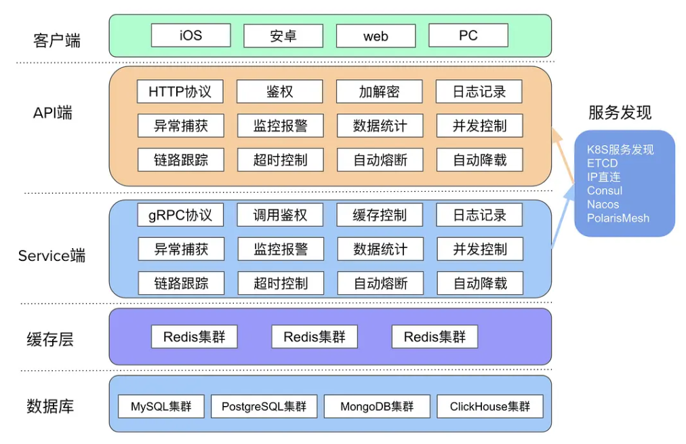

# 简介

## 结构图

## 安装

**goctl**：go-zero 的内置脚手架，是提升开发效率的一大利器，可以一键生成代码、文档、部署 k8s yaml、dockerfile 等

- 安装：`go install github.com/zeromicro/go-zero/tools/goctl@latest`
- 验证：`goctl --version`

**protoc**：用于生成代码的工具，它可以根据 proto 文件生成C++、Java、Python、Go、PHP 等多重语言的代码，而 gRPC 的代码生成还依赖 [protoc-gen-go](https://github.com/golang/protobuf/tree/master/protoc-gen-go)，[protoc-gen-go-grpc](https://pkg.go.dev/google.golang.org/grpc/cmd/protoc-gen-go-grpc) 插件来配合生成 Go 语言的 gRPC 代码。

- 安装：`goctl env check --install --verbose --force`一键安装`protoc`，`protoc-gen-go`，`protoc-gen-go-grpc` 相关组件
- 验证：`goctl env check --verbose`

**go-zero**：使用 `go module` 来管理。

- 安装：`go get -u github.com/zeromicro/go-zero@latest`

