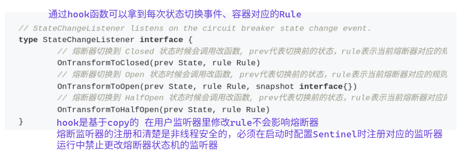

# 熔断降级

## 熔断器模型

sentinel内部维护了熔断器状态机：

- closed：初始状态，熔断器保持闭合，对资源的访问直接通过熔断器的检查

- open：断开状态，对资源的访问会被切断

- Half-Open：半开状态，除了探测列两，其余对资源的访问会被切断;

  > 周期性的允许议定书木的探测请求通过，如果探测请求正常返回，表示探测成功。会重置状态为closed，探测失败，会回滚至open状态

状态切换关系：

- 初始状态，处于closed;如果出发了设定的阈值，会熔断切换到open状态
- open状态会切断所有的请求，超过规则中配置的熔断超市重试时间，会处于half-open状态，从而进行探测机制
- 处于half-open状态的熔断器会周期性做探测



## 熔断器设计

衡量下游服务质量时，场景的指标是RT（response time）、异常数量及异常比例。sentinel熔断器支持三种熔策略：

- 慢调用比例熔断
- 异常比例熔断
- 异常数量熔断

可以通过设置熔断规则来给资源添加熔断器，sentinel会将每个熔断器规则转换成对应的熔断器，熔断器对用户不可见。每个熔断器都会有独立的同级结构：

1. 基于熔断器的状态机来判断对资源是否可以访问
2. 对不可访问的资源会有探测机制，探测机制保障了对资源访问的弹性恢复
3. 熔断器会在对资源访问的完成态取更新同级，然后基于熔断规则更新熔断器状态机

## 熔断策略

三种熔断策略都支持静默器（MinRequestAmount字段表示）。静默器是指一个最小的静默请求数，一个统计周期内，如果资源的请求数小于设置的静默数，熔断器不会基于其同期值取更改熔断器的状态。

> 假设在一个统计周期刚刚开始时候，第 1 个请求碰巧是个慢请求，这个时候这个时候的慢调用比例就会是 100%，很明显是不合理，所以存在一定的巧合性。所以静默期提高了熔断器的精准性以及降低误判可能性。

sentinel支持以下几种熔断策略：

- 慢调用比例策略：慢调用比例大于设定的阈值，访问会自动地熔断
- 错误比例策略：访问异常的比例大于设定的阈值，接下来的熔断周期内对资源的访问会被熔断
- 错误计数策略：同级周期内访问异常数大于设定的阈值，接下来的熔断周期内对资源的访问会自动被熔断

> 误比例熔断和错误计数熔断指的业务返回错误的比例或则计数。也就是说，如果规则指定熔断器策略采用错误比例或则错误计数，那么为了统计错误比例或错误计数，需要调用API： `api.TraceError(entry, err)` 埋点每个请求的业务异常。

## 熔断降级规则定义

```go
// Rule encompasses the fields of circuit breaking rule.
type Rule struct {
	// unique id
	Id string `json:"id,omitempty"`
	// resource name
	Resource string   `json:"resource"`
	Strategy Strategy `json:"strategy"`
	// RetryTimeoutMs represents recovery timeout (in milliseconds) before the circuit breaker opens.
	// During the open period, no requests are permitted until the timeout has elapsed.
	// After that, the circuit breaker will transform to half-open state for trying a few "trial" requests.
	RetryTimeoutMs uint32 `json:"retryTimeoutMs"`
	// MinRequestAmount represents the minimum number of requests (in an active statistic time span)
	// that can trigger circuit breaking.
	MinRequestAmount uint64 `json:"minRequestAmount"`
	// StatIntervalMs represents statistic time interval of the internal circuit breaker (in ms).
	StatIntervalMs uint32 `json:"statIntervalMs"`
	// MaxAllowedRtMs indicates that any invocation whose response time exceeds this value (in ms)
	// will be recorded as a slow request.
	// MaxAllowedRtMs only takes effect for SlowRequestRatio strategy
	MaxAllowedRtMs uint64 `json:"maxAllowedRtMs"`
	// Threshold represents the threshold of circuit breaker.
	// for SlowRequestRatio, it represents the max slow request ratio
	// for ErrorRatio, it represents the max error request ratio
	// for ErrorCount, it represents the max error request count
	Threshold float64 `json:"threshold"`
}
```

- Id：表示sentinel规则的全局唯一ID，可选
- Resource：熔断器规则生效的买点资源名称
- Strategy：熔断策略
  - SlowRequestRatio：慢调用比例，需要设置允许的**最大响应时间**（MaxAllowedRtMs）
  - ErrorRatio：错误比例，需要设置触发熔断的异常比例（`Threshold`），取值范围为 [0.0, 1.0]。代码中可以通过 `api.TraceError(entry, err)` 函数来记录 error。
  - ErrorCount：错误数
- RetryTimeoutMs：熔断出发后持续的时间，熔断结束后恢复half-open状态
- MinRequestAmount：静默数量，小于当前值熔断器会处于静默状态
- StatIntervalMs：同级的时间窗口长度
- MaxAllowedRtMs：仅对慢调用熔断策略生效
- Threshold：
  - 慢调用熔断策略：表示慢调用比例的阈值，0.1表示10%
  - 错误比例策略：错误比例的阈值，0.1表示10%

说明：

- Resource、Strategy、RetryTimeoutMs、MinRequestAmount、StatIntervalMs、Threshold 每个规则都必设的字段，MaxAllowedRtMs是慢调用比例熔断规则必设的字段。
- MaxAllowedRtMs 字段仅仅对**慢调用比例** (SlowRequestRatio) 策略有效，对其余策略均属于无效字段。
- StatIntervalMs 表示熔断器的统计周期，单位是毫秒，这个值我们不建议设置的太大或则太小，一般情况下设置10秒左右都OK，当然也要根据实际情况来适当调整。
- RetryTimeoutMs 的设置需要根据实际情况设置探测周期，一般情况下设置10秒左右都OK，当然也要根据实际情况来适当调整。

```go
// 慢调用比例规则
rule1 := &Rule{
        Resource:         "abc",
        Strategy:         SlowRequestRatio,
	RetryTimeoutMs:   5000,
	MinRequestAmount: 10,
	StatIntervalMs:   10000,
	MaxAllowedRtMs:   20,
	Threshold:        0.1,
},
// 错误比例规则
rule1 := &Rule{
        Resource:         "abc",
        Strategy:         ErrorRatio,
	RetryTimeoutMs:   5000,
	MinRequestAmount: 10,
	StatIntervalMs:   10000,
	Threshold:        0.1,
},
// 错误计数规则
rule1 := &Rule{
        Resource:         "abc",
        Strategy:         ErrorCount,
	RetryTimeoutMs:   5000,
	MinRequestAmount: 10,
	StatIntervalMs:   10000,
	Threshold:        100,
},
```


