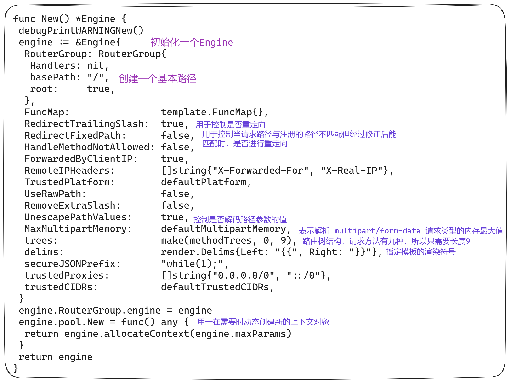
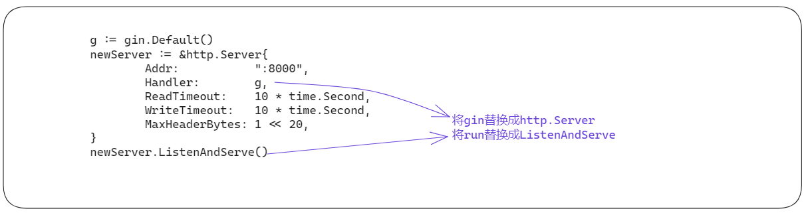
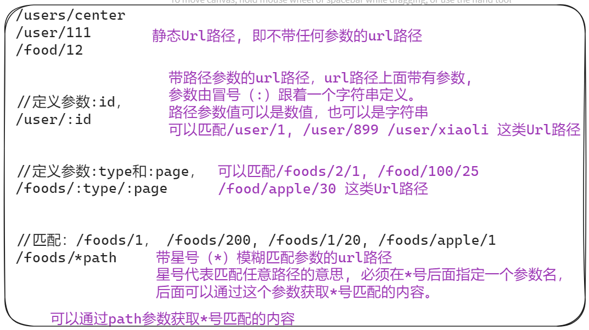
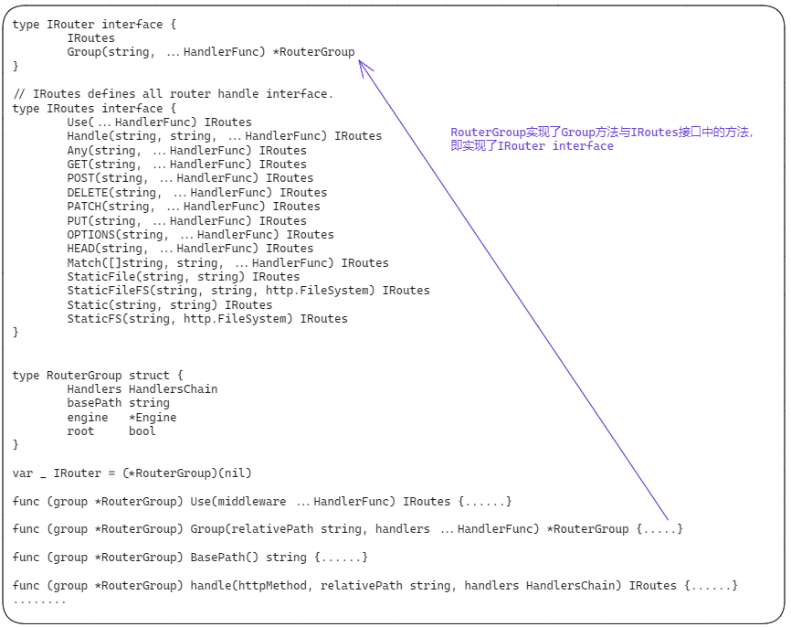
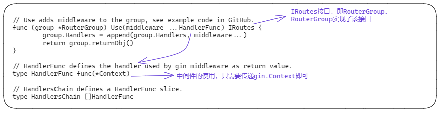

# Gin使用

## Gin入门

### 启动命令

```bash
# 初始化go项目
go mod init <module name>

# 下载并安装gin
go get -u github.com/gin-gonic/gin

# 运行项目
go run main.go
```

### 基础函数介绍


### 项目结构

gin不对项目结构做规定，需要自己构造

```bash
├── conf                    #项目配置文件目录
│   └── config.toml         #大家可以选择自己熟悉的配置文件管理工具包例如：toml、xml等等
├── controllers             #控制器目录，按模块存放控制器（或者叫控制器函数），必要的时候可以继续划分子目录。
│   ├── food.go
│   └── user.go
├── main.go                 #项目入口，这里负责Gin框架的初始化，注册路由信息，关联控制器函数等。
├── models                  #模型目录，负责项目的数据存储部分，例如各个模块的Mysql表的读写模型。
│   ├── food.go
│   └── user.go
├── static                  #静态资源目录，包括Js，css，jpg等等，可以通过Gin框架配置，直接让用户访问。
│   ├── css
│   ├── images
│   └── js
├── logs                    #日志文件目录，主要保存项目运行过程中产生的日志。
└── views                   #视图模板目录，存放各个模块的视图模板，当然有些项目只有api，是不需要视图部分，可以忽略这个目录
    └── index.html
```

### gin对象



### 自定义HTTP配置



## 路由和控制器

### 概述

```go
r := gin.Default()

// 路由定义post请求, url路径为：/user/login, 绑定doLogin控制器函数
r.POST("/user/login", doLogin)

// 控制器函数
func doLogin(c *gin.Context) {
        // 获取post请求参数
	username := c.PostForm("username")
	password := c.PostForm("password")

	// 通过请求上下文对象Context, 直接往客户端返回一个字符串
	c.String(200, "username=%s,password=%s", username,password)
}
```

### url路径



### 控制器函数

```go
func HandlerFunc(c *gin.Context)
// 控制器函数接受一个上下文参数。可以通过上下文参数，获取http请求参数，响应http请求。

//实例化gin实例对象。
r := gin.Default()
	
//定义post请求, url路径为：/users, 绑定saveUser控制器函数
r.POST("/users", saveUser)

//定义get请求，url路径为：/users/:id  （:id是参数，例如: /users/10, 会匹配这个url模式），绑定getUser控制器函数
r.GET("/users/:id", getUser)

//定义put请求
r.PUT("/users/:id", updateUser)

//定义delete请求
r.DELETE("/users/:id", deleteUser)


//控制器函数实现
func saveUser(c *gin.Context) {
    // 忽略实现
}

func getUser(c *gin.Context) {
    // 忽略实现
}

func updateUser(c *gin.Context) {
    // 忽略实现
}

func deleteUser(c *gin.Context) {
   // 忽略实现
}
```

### 分组路由

```go
func main() {
	router := gin.Default()

	// 创建v1组
	v1 := router.Group("/v1")
	{
                // 在v1这个分组下，注册路由
		v1.POST("/login", loginEndpoint)     //   /v1/login
		v1.POST("/submit", submitEndpoint)	 //   /v1/submit
		v1.POST("/read", readEndpoint)		 //   /v1/read
	}

	// 创建v2组
	v2 := router.Group("/v2")
	{
                // 在v2这个分组下，注册路由
		v2.POST("/login", loginEndpoint)	// /v2/login
		v2.POST("/submit", submitEndpoint)	// /v2/submit
		v2.POST("/read", readEndpoint)		// /v2/read
	}
	router.Run(":8080")
}

// 路由分组，其实就是设置了同一类路由的url前缀。
```



## 处理请求参数

### 获取get参数

获取Get请求参数的常用函数：

- **func** (c *Context) **Query**(key string) string
- **func** (c *Context) **DefaultQuery**(key, defaultValue string) string
- **func** (c *Context) **GetQuery**(key string) (string, bool)

```go
// 例如	/path?id=1234&name=Manu&value=111
func Handler(c *gin.Context) {
    
    //获取name参数, 通过Query获取的参数值是String类型。
	name := c.Query("name")	

    //获取name参数, 跟Query函数的区别是，可以通过第二个参数设置默认值。
    name := c.DefaultQuery("name", "tizi365")

	//获取id参数, 通过GetQuery获取的参数值也是String类型, 
	// 区别是GetQuery返回两个参数，第一个是参数值，第二个参数是参数是否存在的bool值，可以用来判断参数是否存在。
	id, ok := c.GetQuery("id")
        if !ok {
	   // 参数不存在
	}
}
```

### 获取post参数

获取Post请求参数的常用函数：

- **func** (c *Context) **PostForm**(key string) string
- **func** (c *Context) **DefaultPostForm**(key, defaultValue string) string
- **func** (c *Context) **GetPostForm**(key string) (string, bool)

```go
func Handler(c *gin.Context) {
    
	//获取name参数, 通过PostForm获取的参数值是String类型。
	name := c.PostForm("name")

	// 跟PostForm的区别是可以通过第二个参数设置参数默认值
	name := c.DefaultPostForm("name", "tizi365")

	//获取id参数, 通过GetPostForm获取的参数值也是String类型,
	// 区别是GetPostForm返回两个参数，第一个是参数值，第二个参数是参数是否存在的bool值，可以用来判断参数是否存在。
	id, ok := c.GetPostForm("id")
	if !ok {
	    // 参数不存在
	}
}
```

### 获取URL路径参数

获取URL路径参数，指的是获取 ***/user/:id*** 这类型路由绑定的参数，这个例子绑定了一个参数id。

获取url路径参数常用函数：

- **func** (c *Context) **Param**(key string) string

```go
r := gin.Default()
	
r.GET("/user/:id", func(c *gin.Context) {
	// 获取url参数id
	id := c.Param("id")
})
```

### 将请求参数绑定到struct对象

Gin框架支持将请求参数自动绑定到一个struct对象，这种方式支持Get/Post请求，也支持http请求body内容为json/xml格式的参数。

```go
// User 结构体定义  通过定义struct字段的标签，定义请求参数和struct字段的关系。
// 根据自己的需要选择支持的数据类型，需要支持json数据格式，可以定义字段标签: json:"name"
type User struct {
  Name  string `json:"name" form:"name"`
  Email string `json:"email" form:"email"`
}


r.POST("/user/:id", func(c *gin.Context) {
   // 初始化user struct
   u := User{}
   // 通过ShouldBind函数，将请求参数绑定到struct对象
   // 如果是post请求则根据Content-Type判断，接收的是json数据，还是普通的http请求参数
   if c.ShouldBind(&u) == nil {
     // 绑定成功， 打印请求参数
     log.Println(u.Name)
     log.Println(u.Email)
    }
    // http 请求返回一个字符串 
    c.String(200, "Success")
})
```

| 标签        | 说明                                     |
| ----------- | ---------------------------------------- |
| json:"name" | 数据格式为json格式，并且json字段名为name |
| form:"name" | 表单参数名为name                         |

### 获取客户ip

```go
r := gin.Default()
	
r.GET("/ip", func(c *gin.Context) {
	// 获取用户IP
	ip := c.ClientIP()
})
```

## 处理请求结果

- json/xml
- yaml/protoBuf
- HTML模板渲染

### 字符串方式响应请求

```go
func (c *Context) String(code int, format string, values ...interface{})
```

| 参数   | 说明                                                         |
| ------ | ------------------------------------------------------------ |
| code   | http状态码                                                   |
| format | 回结果，支持类似Sprintf函数一样的字符串格式定义，例如,%d 代表插入整数，%s代表插入字符串 |
| values | 任意个format参数定义的字符串格式参数                         |

```go
func Handler(c *gin.Context)  {
	// 例子1：
	c.String(200, "欢迎访问tizi360.com!")
	
	// 例子2： 这里定义了两个字符串参数（两个%s），后面传入的两个字符串参数将会替换对应的%s
	c.String(200,"欢迎访问%s, 你是%s", "tizi360.com!","最靓的仔！")
}
// net/http包定义了多种常用的状态码常量，例如：http.StatusOK == 200， http.StatusMovedPermanently == 301， http.StatusNotFound == 404等，具体可以参考net/http包
```

### json格式响应请求

```go
// User 定义
type User struct {
  Name  string `json:"name"` // 通过json标签定义struct字段转换成json字段的名字。
  Email string `json:"email"`
}

// Handler 控制器
func(c *gin.Context) {
  //初始化user对象
  u := &User{
    Name:  "tizi365",
    Email: "tizi@tizi365.com",
  }
  //返回json数据
  //返回结果：{"name":"tizi365", "email":"tizi@tizi365.com"}
  c.JSON(200, u)
}
```

### xml格式响应请求

```go
// User 定义, 默认struct的名字就是xml的根节点名字，这里转换成xml后根节点的名字为User.
type User struct {
  Name  string `xml:"name"` // 通过xml标签定义struct字段转换成xml字段的名字。
  Email string `xml:"email"`
}

// Handler 控制器
func(c *gin.Context) {
  //初始化user对象
  u := &User{
    Name:  "tizi365",
    Email: "tizi@tizi365.com",
  }
  //返回xml数据
  //返回结果：
  //  <?xml version="1.0" encoding="UTF-8"?>
  //  <User><name>tizi365</name><email>tizi@tizi365.com</email></User>
  c.XML(200, u)
}
```

### 文件格式响应请求

```go
func(c *gin.Context) {
  //通过File函数，直接返回本地文件，参数为本地文件地址。
  //函数说明：c.File("文件路径")
  c.File("/var/www/1.jpg")
}

func(c *gin.Context) {
  //通过FileAttachment函数，返回本地文件，类似File函数，区别是可以指定下载的文件名。
  //函数说明: c.FileAttachment("文件路径", "下载的文件名")
  c.FileAttachment("/var/www/1.jpg", "1.jpg")
}
```

### 设置http响应头（设置Header）

```go
func(c *gin.Context) {
  //设置http响应 header, key/value方式，支持设置多个header
  c.Header("site","tizi365")
}
```

## 处理静态文件

```go
func main() {
	router := gin.Default()
        // 设置静态资源文件目录，并且绑定一个Url前缀
        // 静态资源文件目录：/var/www/tizi365/assets
        // /assets是访问静态资源的url前缀
        // 例如：
        //   /assets/images/1.jpg 这个url文件，存储在/var/www/tizi365/assets/images/1.jpg
	router.Static("/assets", "/var/www/tizi365/assets")

        // 为单个静态资源文件，绑定url
        // 这里的意思就是将/favicon.ico这个url，绑定到./resources/favicon.ico这个文件
	router.StaticFile("/favicon.ico", "./resources/favicon.ico")

	// Listen and serve on 0.0.0.0:8080
	router.Run(":8080")
}
```


## Gin处理cookie与session

cookie通常用于在浏览器中保存一些小数据，例如客户标识、用户非铭感数据。注意别使用cookie保存隐私数据。

gin框架主要通过上下文对象提供的SetCookie和Cookie两个函数操作cookie

### 设置cookie

```go
mport (
    "fmt"

    "github.com/gin-gonic/gin"
)

func main() {

    router := gin.Default()

    router.GET("/cookie", func(c *gin.Context) {
       // 设置cookie
       c.SetCookie("site_cookie", "cookievalue", 3600, "/", "localhost", false, true)
    })

    router.Run()
```

- SetCookie函数

  ```go
  func (c *Context) SetCookie(name, value string, maxAge int, path, domain string, secure, httpOnly bool)
  ```

| 参数名   | 类型   | 说明                                                         |
| -------- | ------ | ------------------------------------------------------------ |
| name     | string | cookie名字                                                   |
| value    | string | cookie值                                                     |
| maxAge   | int    | 有效时间，单位是秒，MaxAge=0 忽略MaxAge属性，MaxAge<0 相当于删除cookie, 通常可以设置-1代表删除，MaxAge>0 多少秒后cookie失效 |
| path     | string | cookie路径                                                   |
| domain   | string | cookie作用域                                                 |
| secure   | bool   | Secure=true，那么这个cookie只能用https协议发送给服务器       |
| httpOnly | bool   | 设置HttpOnly=true的cookie不能被js获取到                      |

### 获取cookie

```go
func Handler(c *gin.Context) {
      // 根据cookie名字读取cookie值
      data, err := c.Cookie("site_cookie")
      if err != nil {
	 // 直接返回cookie值
	 c.String(200,data)
	 return
      }
      c.String(200,"not found!")
}
```

### 删除cookie

通过将cookie的MaxAge设置为-1, 达到删除cookie的目的。

```go
func Handler(c *gin.Context) {
      // 设置cookie  MaxAge设置为-1，表示删除cookie
       c.SetCookie("site_cookie", "cookievalue", -1, "/", "localhost", false, true)
      c.String(200,"删除cookie演示")
}
```

### 安装session

在Gin框架中，我们可以依赖[gin-contrib/sessions](https://github.com/gin-contrib/sessions)中间件处理session。

gin-contrib/sessions中间件支持的存储引擎：

- cookie
- memstore
- redis
- memcached
- mongodb

```bash
# 安装session
go get github.com/gin-contrib/sessions
```

### session基本用法

```go
package main

import (
        // 导入session包
	"github.com/gin-contrib/sessions"
       // 导入session存储引擎
	"github.com/gin-contrib/sessions/cookie"
        // 导入gin框架包
	"github.com/gin-gonic/gin"
)

func main() {
	r := gin.Default()
        // 创建基于cookie的存储引擎，secret11111 参数是用于加密的密钥
	store := cookie.NewStore([]byte("secret11111"))
        // 设置session中间件，参数mysession，指的是session的名字，也是cookie的名字
       // store是前面创建的存储引擎，我们可以替换成其他存储引擎
	r.Use(sessions.Sessions("mysession", store))

	r.GET("/hello", func(c *gin.Context) {
        // 初始化session对象
		session := sessions.Default(c)
                
        // 通过session.Get读取session值
        // session是键值对格式数据，因此需要通过key查询数据
		if session.Get("hello") != "world" {
            // 设置session数据
			session.Set("hello", "world")
            // 删除session数据
            session.Delete("tizi365")
            // 保存session数据
			session.Save()
            // 删除整个session
            // session.Clear()
		}
                
		c.JSON(200, gin.H{"hello": session.Get("hello")})
	})
	r.Run(":8000")
}
```

### 基于redis存储引擎的session

如果我们想将session数据保存到redis中，只要将session的存储引擎改成redis即可。

- 安装redis存储引擎的包

  ```bash
  go get github.com/gin-contrib/sessions/redis
  ```

```go
package main

import (
	"github.com/gin-contrib/sessions"
	"github.com/gin-contrib/sessions/redis"
	"github.com/gin-gonic/gin"
)

func main() {
	r := gin.Default()
	// 初始化基于redis的存储引擎
	// 参数说明：
	//    第1个参数 - redis最大的空闲连接数
	//    第2个参数 - 数通信协议tcp或者udp
	//    第3个参数 - redis地址, 格式，host:port
	//    第4个参数 - redis密码
	//    第5个参数 - session加密密钥
	store, _ := redis.NewStore(10, "tcp", "localhost:6379", "", []byte("secret"))
	r.Use(sessions.Sessions("mysession", store))

	r.GET("/incr", func(c *gin.Context) {
		session := sessions.Default(c)
		var count int
		v := session.Get("count")
		if v == nil {
			count = 0
		} else {
			count = v.(int)
			count++
		}
		session.Set("count", count)
		session.Save()
		c.JSON(200, gin.H{"count": count})
	})
	r.Run(":8000")
}
```

## 文件上传

```go
package main
// 导入gin包
import (
	"fmt"
	"github.com/gin-gonic/gin"
	"log"
	"net/http"
)

func main() {
	router := gin.Default()
	// 设置文件上传大小限制，默认是32m
	router.MaxMultipartMemory = 64 << 20  // 64 MiB

	router.POST("/upload", func(c *gin.Context) {
		// 获取上传文件，返回的是multipart.FileHeader对象，代表一个文件，里面包含了文件名之类的详细信息
		// file是表单字段名字
		file, _ := c.FormFile("file")
		// 打印上传的文件名
		log.Println(file.Filename)

		// 将上传的文件，保存到./data/1111.jpg 文件中
		c.SaveUploadedFile(file, "./data/1111.jpg")

		c.String(http.StatusOK, fmt.Sprintf("'%s' uploaded!", file.Filename))
	})
	router.Run(":8080")
}
```

## 中间件

### 使用中间件

```go
func main() {
	r := gin.New()

	// 通过use设置全局中间件

	// 设置日志中间件，主要用于打印请求日志
	r.Use(gin.Logger())

	// 设置Recovery中间件，主要用于拦截paic错误，不至于导致进程崩掉
	r.Use(gin.Recovery())

	// 忽略后面代码
}
```

### 定义中间件

```go
package main
// 导入gin包
import (
"github.com/gin-gonic/gin"
	"log"
	"time"
)

// 自定义个日志中间件
func Logger() gin.HandlerFunc {
	return func(c *gin.Context) {
		t := time.Now()

		// 可以通过上下文对象，设置一些依附在上下文对象里面的键/值数据
		c.Set("example", "12345")

		// 在这里处理请求到达控制器函数之前的逻辑
     
		// 调用下一个中间件，或者控制器处理函数，具体得看注册了多少个中间件。
		c.Next()

		// 在这里可以处理请求返回给用户之前的逻辑
		latency := time.Since(t)
		log.Print(latency)

		// 例如，查询请求状态吗
		status := c.Writer.Status()
		log.Println(status)
	}
}

func main() {
	r := gin.New()
	// 注册上面自定义的日志中间件
	r.Use(Logger())

	r.GET("/test", func(c *gin.Context) {
		// 查询我们之前在日志中间件，注入的键值数据
		example := c.MustGet("example").(string)

		// it would print: "12345"
		log.Println(example)
	})

	// Listen and serve on 0.0.0.0:8080
	r.Run(":8080")
}
```

### 源码


