# 数据结构

## 数组

## 切片

### 描述

一个切片由3部分组成：

- 指针：指向底层数组
- 长度：代表slice当前的长度
- 容量：代表底层数组的长度

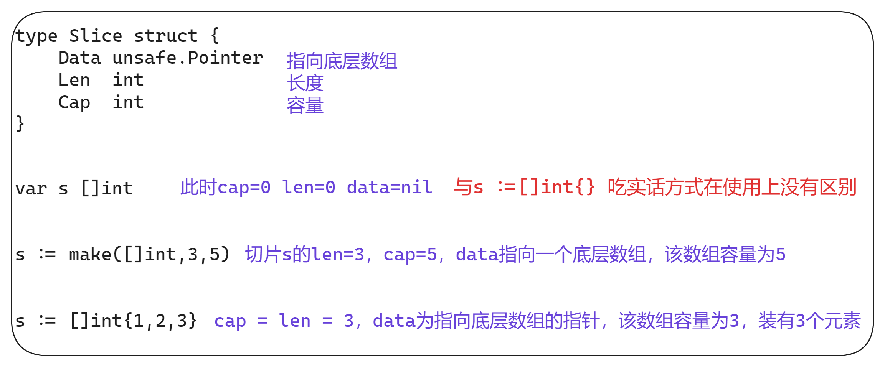

### 切片扩容

在分配内存空间之前需要先确定新的切片容量，运行时根据切片的当前容量选择不同的策略进行扩容：

- 如果期望容量大于当前容量的两倍就会使用期望容量
- 如果当前切片的长度小于1024就会将容量返回
- 如果当前切片的长度大于1024就会每次增加25%的容量，知道新容量大于期望容量

### 拷贝切片

当使用`copy(a, b)` 的形式对切片进行拷贝时，会分两种情况进行处理拷贝操作

## 映射

# Channel

## 数据结构

## 创建管道

# 内存管理

## 内存分配器

程序中的数据和变量都会被分配到程序所在的虚拟内存中，内存空间包含两个重要区域：栈区(Stack)和堆区(Heap)。

**栈区**：

- 函数调用的参数、返回值以及局部变量大都会被分配到栈上
- 这部分内存会由编译器进行管理
- Go 以及 Java 等编程语言会由工程师和编译器共同管理

**堆区**：

- 堆中的对象由内存分配器分配并由垃圾收集器回收

### 设计原理

内存分配器一般包含两种分配方法：

- 线性分配器（Sequential Allocator，Bump Allocator）
- 空闲链表分配器（Free-List Allocator）

### 线性分配器

由于线性分配器具有上述特性，所以需要与合适的垃圾回收算法配合使用：

- 标记压缩（Mark-Compact）
- 复制回收（Copying GC）
- 分带回收（Generational GC）
- .........

它们可以通过拷贝的方式整理存活对象的碎片，将空闲内存定期合并，这样就能利用线性分配器的效率提升内存分配器的性能

线性分配器需要与具有拷贝特性的垃圾回收算法配合，所以C与C++等需要直接对外暴露指针的语言就无法使用该策略

### 空闲链表分配器

因为不同的内存块通过指针构成了链表，所以这种方式的分配器可以重新利用回收的资源，但是因为分配内存时需要遍历链表，所以时间复杂度是O(n)，空闲链表分配器可以选择不同的策略再链表中的内存块中进行选择：

- 首次适应（First-Fit）：从链表头开始遍历，选择第一个大小大于申请内存的内存块
- 循环首次适应（Next-Fit）：从上次遍历的结束位置开始遍历，选择第一个大小大于申请内存的内存块
- 最优适应（Best-Fit）：从链表头遍历整个链表，选择最合适的内存块
- 隔离适应（Segregated-Fit）：将内存分割成多个链表，每个链表中的内存块大小相同，申请内存时先找到满足条件的链表，再从链表中选择合适的内存块

go语言使用的内存分配策略与第四种策略有些相似：

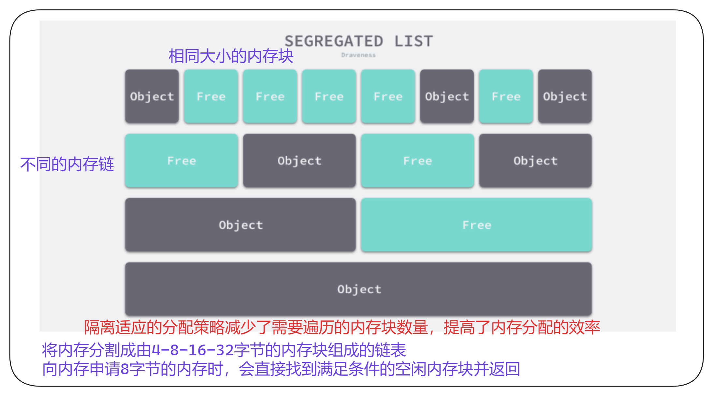

### 分级分配

线程缓存分配（Thread-Caching Malloc，TCMalloc）是用于分配内存的机制，Go 语言的内存分配器就借鉴了 TCMalloc 的设计实现高速的内存分配，它的核心理念是使用多级缓存将对象根据大小分类，并按照类别实施不同的分配策略。

**对象大小**

go语言的内存分配器会根据申请分配的内存大小选择不同的逻辑处理，运行时根据对象的大小将对象分成**为对象、小对象和大对象**:

| 类别   | 大小         |
| ------ | ------------ |
| 微对象 | `(0,16B)`    |
| 小对象 | `[16B,32KB]` |
| 大对象 | `(32KB,+∞)`  |

因为程序冲的绝大多数对象的大小都在32KB一下，而申请的内存大小影响Go运行时分配内存的过程和开销，所以分别处理大对象和小对象有利于提高内存分配器的性能

### 分级缓存

内存分配不仅会区别对待大小不同的对象，还会将内存分成不同的级别进行管理，TCMalloc和go运行时分配器都会引入线程缓存（Thread Cache）、中心缓存（Central Cache）和页堆（Page Heap）三个组件分级管理内存：

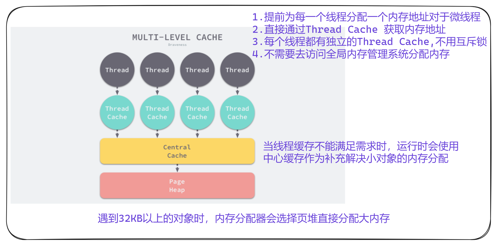

### 线性内存

go1.10以前的版本，堆区内存空间都是连续的

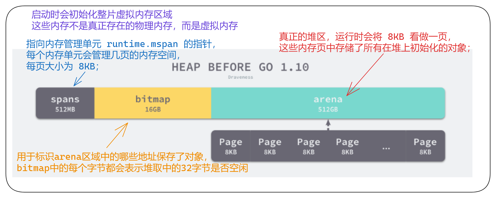

- 对于任意一个地址，可以根据据arena的基地址计算出所在的页数并通过spans数组获得管理该片区内存的管理单元runtime.mspan
- spans数组中多个连续的位置可能对应同一个runtime.mspan结构

go 语言在垃圾回收机制时会根据指针的地址判断对象是否在堆中，并通过上述方法找到管理对象runtime.mspan。这些都建立在堆区的内存是连续的这一假设上。这种设计虽然简单并且防弊案，但是在C和go混合使用时会导致程序崩溃

1. 分配的内存地址会发生冲突，导致堆的初始化和扩容失败
2. 没有被预留的大块内存可能会被分配给C语言的二进制，导致扩容后的堆不连续

线性的堆内存需要预留大块的内存空间，但是申请大块的内存空间而不适用时不切实际的，不预留内存空间却会在特殊场景下造成程序崩溃。虽然连续内存的实现比较简单，但是这些问题也没有办法忽略。

**内存申请流程**：

1. 内存申请
2. 通过bitmap查找空闲内存
3. 通过arena的基地址获取管理器spans
4. 分配内存，求改bitmap中该内存使用情况

### 稀疏内存

稀疏内存是 Go 语言在 1.11 中提出的方案，使用稀疏的内存布局不仅能移除堆大小的上限，还能解决 C 和 Go 混合使用时的地址空间冲突问题。不过因为基于稀疏内存的内存管理失去了内存的连续性这一假设，这也使内存管理变得更加复杂：

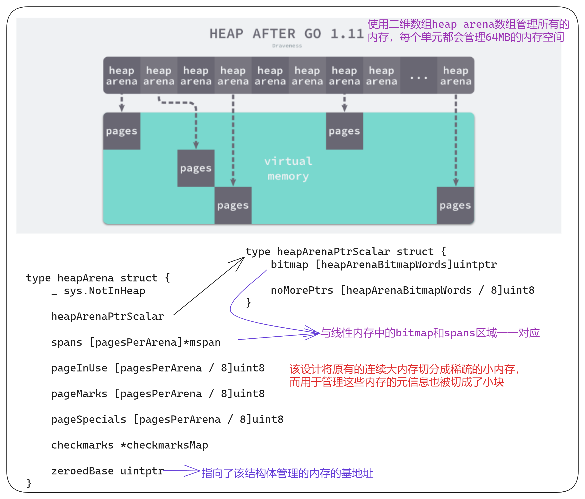

不同平台和架构的二维数组大小可能完全不同：

- go语言服务在Linux的x86-64架构上运行，二维数组的一维大小会是1，二位大小是4394304

  > 每一个指针占用8字节的内存空间，所以辕信息的总大小是32MB

- 由于每个runtime.heapAreana都会管理64MB的内存，整个堆区最多可以管理256TB的内存，这比之前的512GB多好几个数量级

由于内存的管理变得更加复杂，上述改动对垃圾回收稍有影响，大约会增加 1% 的垃圾回收开销，不过

## 垃圾收集器

### 设计原理

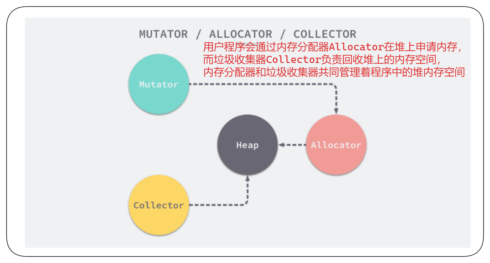

##

### 标记清除

标记清楚Mark-Sweep算法是最常见的垃圾收集算法，标记清楚收集器是跟踪式垃圾收集器，其执行过程可以分成标记（Mark）和清楚（Sweep）两个阶段

1. 标记阶段：从跟对象触发查找并标记堆中所有存活的对象
2. 清除阶段：遍历堆中的全部对象，回收未被标记的垃圾对象并将回收的内存加入空闲链表

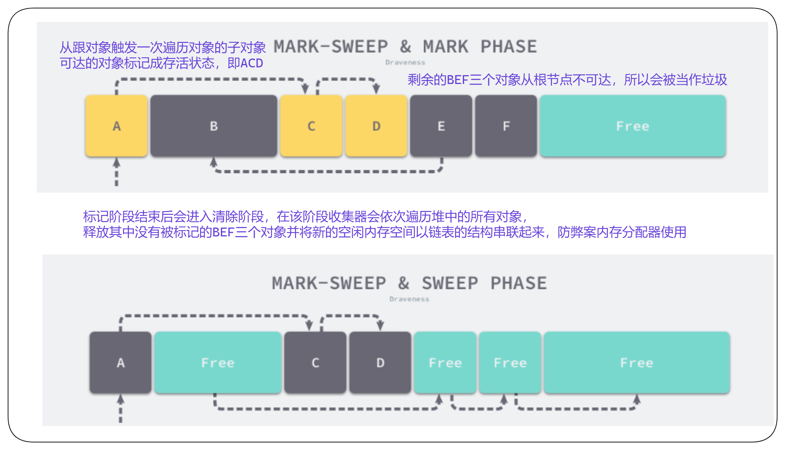

- 垃圾收集器从垃圾手机的根对象触发，递归遍历这些对象指向的子对象并将所有可达的对象标记成存活
- 标记结束后，垃圾收集器会依次遍历堆中的对象并清楚其中的垃圾，整个过程需要标记对象的存活状态，用户程序在垃圾收集的过程中页不能执行
- 我们需要用到更复杂的机制来解决STW的问题

### 三色抽象

为了解决原始标记清楚算法带来的长时间STW，多数现代的追踪是垃圾收集器都会实现三色标记算法的变种以缩短STW的时间，三色标记算法将程序中的对象分成白色、黑色、灰色三类：

- 白色对象：潜在的垃圾，其内存可能会被垃圾收集器回收
- 黑色对象：活跃的对象，包括不存在任何引用外部指针的对象以及从跟对象可达的对象
- 灰色对象：活跃的对象，因为存在指向白色对象的外部指针，垃圾收集器会扫描这些对象的子对象

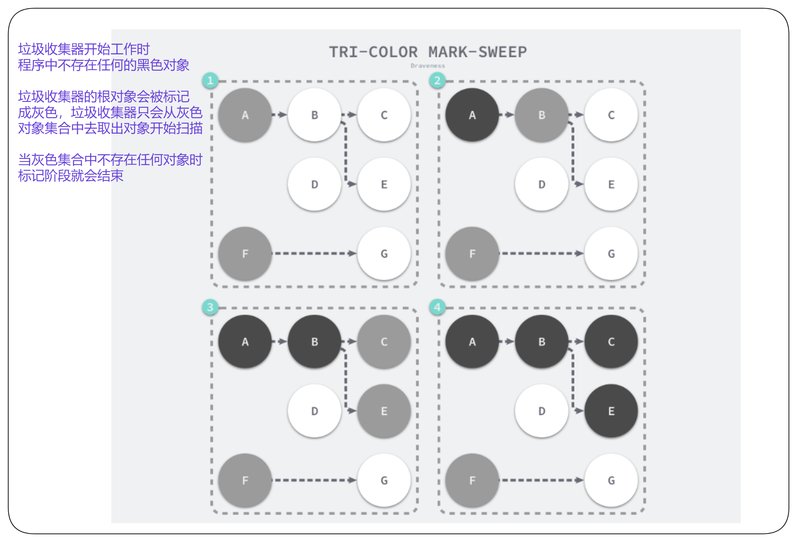

三色标记垃圾收集器工作原理：

- 从灰色对象的集合中选择一个灰色对象，并将其标记成黑色
- 将黑色对象指向的所有对象都标记成灰色，保证该对象和被该对象引用的对象都不会被回收
- 重复上述两个步骤知道对象图中不存在灰色对象

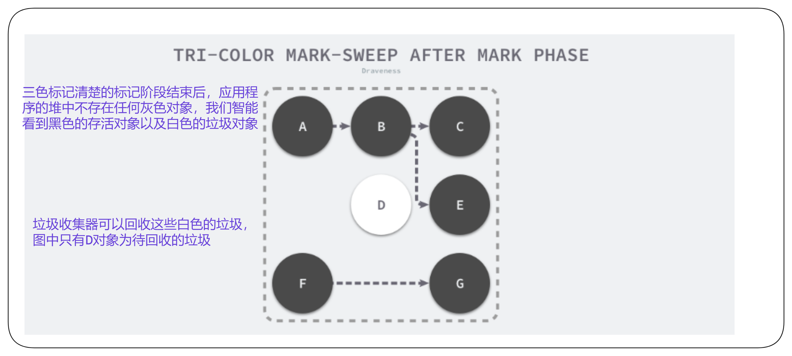

 

本来不应该回收的对象却被回收了，这在内存管理中是非常严重的错误，将这种错误成为悬挂指针

### 屏障技术

- 多数的现代处理器都会乱序执行指令以最大化性能
- 该技术能够保证内存操作的顺序性，在内存屏障前执行的操作一定会先于内存品璋后执行的操作一定会先于内存屏障后执行的操作 

想要在并发或者增量的标记算法中保证正确性，需要达成一下两种三色不变性（Tri-color invariant）中的一种：

- 强三色不变性：黑色对象不会指向白色对象，只会指向灰色对象或者黑色对象
- 弱三色不变性：黑色对象指向的白色对象必须包含一条从灰色对象经由多个白色对象的可达路径

垃圾收集中的屏障技术更像是一个钩子方法，他是在用户程序读取对象、创建对象以及更新对象指针时执行的一段代码，根据操作类型的不同，我们可以分成读屏障（Read barrier）和写屏障（Write barrier）:

- 读屏障需要在读操作中加入代码片段，对用户程序的性能影响很大，所以变成语言往往都会采用写屏障保证三色不变性

### 插入写屏障

### 删除写屏障

删除写屏障一旦开始工作，他会保证开启写屏障时堆上搜友对象的可达，所以也被称作快照垃圾收集（Snapshot GC）

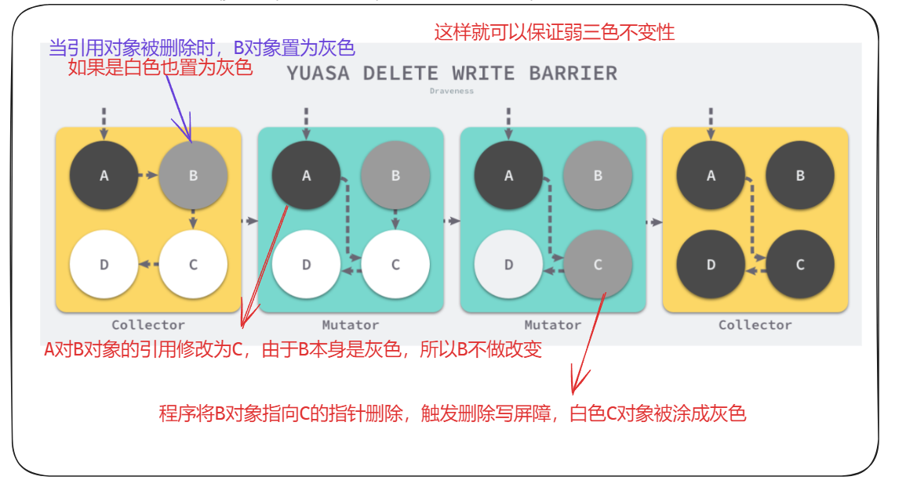

### 三色标记法+混合写屏障机制

- 插入写屏障不足：结束时需要STW来重新扫描栈，大约需要10~100ms
- 删除写屏障不足：回收精度低，一个对象即使被删除了最后一个指向它的指针也依旧可以活过这一轮，在下一轮GC中被清理掉

GoV1.8的三色标记法+混合写屏障机制：

1. GC开始将栈上的对象全部扫描并标记为黑色（之后不在进行第二次重复扫描，无需STW）
2. GC期间，任何在栈上创建的新对象，均为黑色
3. 被删除的对象标记为灰色
4. 被添加的对象标记为灰色

**满足变形的弱三色不变式（结合了插入、删除写屏蔽两者的优点）**

### 混合写屏障案例场景

#### 堆对象删除，栈对象引用

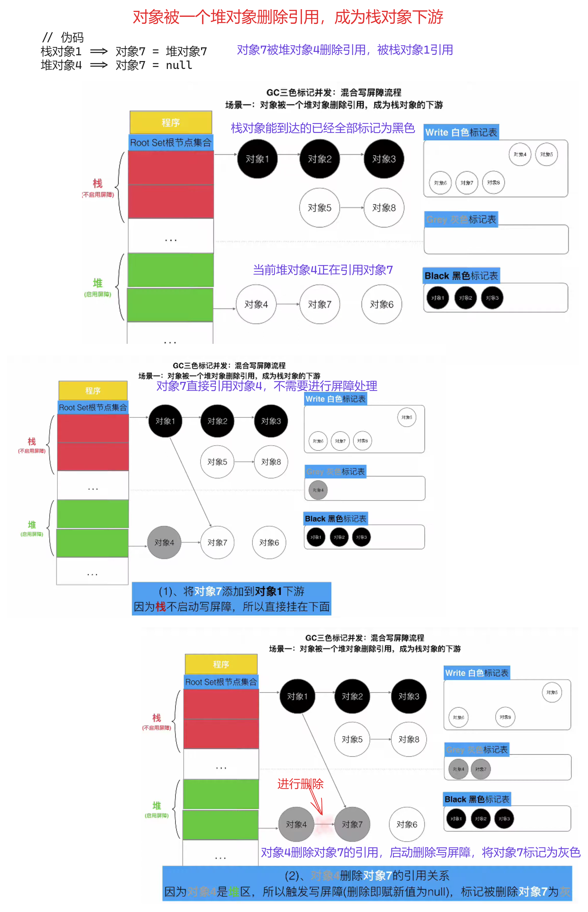

#### 栈对象删除，栈对象引用

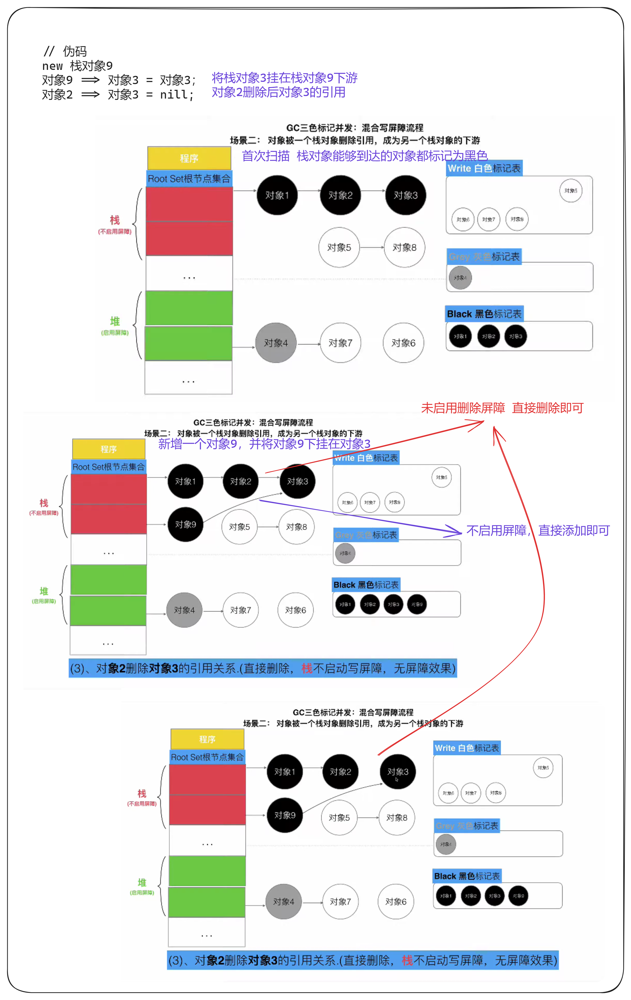

#### 堆对象删除，堆对象引用

#### 栈对象删除，堆对象引用

### GC总结

- 强三色不变式：强制性的不允许黑色对象引用白色
- 弱三色不变式：黑色对象可以引用白色对象，但该白色对象必须存在灰色对象引用它
- 三色标记满足强弱不变式之一，即可保证对象不丢失
- 为了满足强三色：插入屏障：添加一个下游引用对象时，标记为灰色
- 为了满足弱三色：删除屏障，当一个对象被删除时，标记为灰色

为了不进行STW，引入了三色标记和混合写屏障

- 栈中能到达的对象都标记为灰色
- 堆中的对象启用插入写屏障和删除写屏障
- 这总情况被删除的对象不被其他对象引用，会在当前的GC周期存活，下一个GC周期被回收
