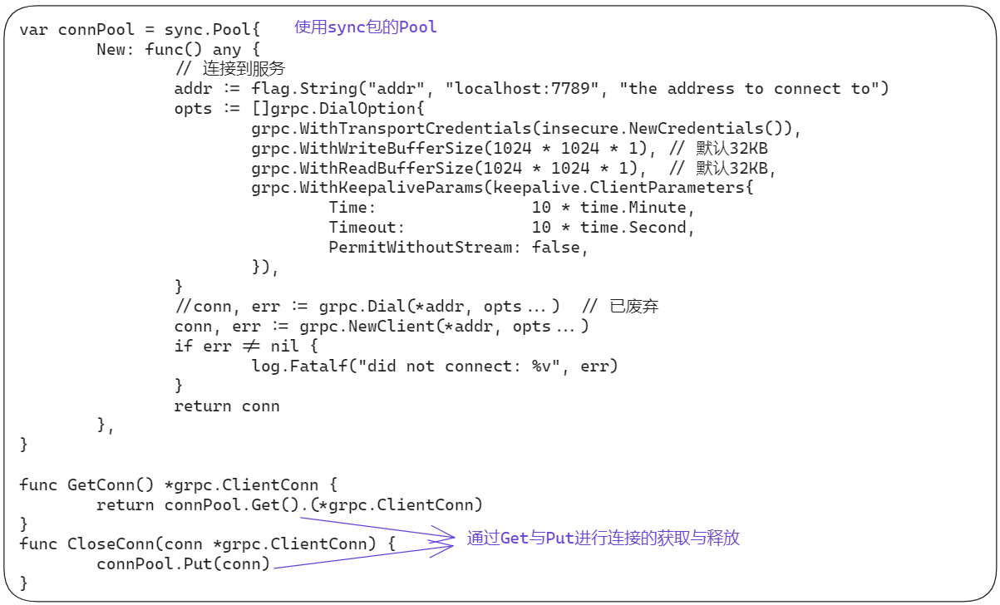
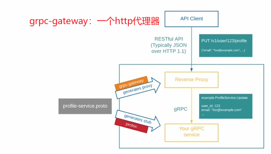

# 构建基础grpc服务

## 定义pb文件

- 安装protoc

```bash
go install google.golang.org/protobuf/cmd/protoc-gen-go@latest
go install google.golang.org/grpc/cmd/protoc-gen-go-grpc@latest
```

- 文件目录

```bash
.
├── database
├── dockerfile
└── pb
    └── user_growth.proto
```

- user_growth.proto

```protobuf
syntax = "proto3";
option go_package = "growth/pb";

package UserGrowth;

// 服务
service UserCoin{
  // 获取所有的积分任务列表
  rpc ListTasks(ListTasksRequest) returns (ListTasksReply){}
  // 获取用户的积分信息
  rpc UserCoinInfo(UserCoinInfoRequest) returns (UserCoinInfoReply){}
  // 获取用户的积分明细列表
  rpc UserCoinDetails(UserCoinDetailsRequest) returns (UserCoinDetailsReply){}
  // 调整用户积分-奖励和惩罚都是用这个接口
  rpc UserCoinChange(UserCoinChangeRequest) returns (UserCoinChangeReply){}
}

service UserGrade {
  // 获取所有的等级信息列表
  rpc ListGrades(ListGradesRequest) returns (ListGradesReply){}
  // 获取等级的特权列表
  rpc ListGradePrivileges(ListGradePrivilegesRequest) returns (ListGradePrivilegesReply){}
  // 检查用户是否有某个产品的特权
  rpc CheckUserPrivilege(CheckUserPrivilegeRequest) returns (CheckUserPrivilegeReply){}
  // 获取用户的等级信息
  rpc UserGradeInfo(UserGradeInfoRequest) returns (UserGradeInfoReply){}
  // 调整用户的等级成长值
  rpc UserGradeChange(UserGradeChangeRequest) returns (UserGradeChangeReply){}
}

// 请求和响应消息
message ListTasksRequest{}
message ListTasksReply{
  repeated TbCoinDetail dataLIst = 1;
}
message UserCoinInfoRequest{
  int32 uid = 1;
}
message UserCoinInfoReply{
  TbCoinUser data = 1;
}
message UserCoinDetailsRequest{
  int32 uid = 1;
  int32 page = 2;
  int32 size = 3;
}
message UserCoinDetailsReply{
  repeated TbCoinDetail dataList = 1;
  int32 total = 2;
}
message UserCoinChangeRequest{
  int32 uid = 1;
  string task = 2;
  int32 coin = 3;
}
message UserCoinChangeReply{
  TbCoinUser user = 1;
}

message ListGradesRequest{}
message ListGradesReply{
  repeated TbGradeInfo datalist = 1;
}
message ListGradePrivilegesRequest{
  int32 grade_id = 1;
}
message ListGradePrivilegesReply{
  repeated TbGradePrivilege datalist = 1;
}
message CheckUserPrivilegeRequest{
  int32 uid = 1;
  string product = 2;
  string function = 3;
}
message CheckUserPrivilegeReply{
  bool data = 1;
}
message UserGradeInfoRequest{
  int32 uid = 1;
}
message UserGradeInfoReply{
  TbGradeInfo data = 1;
}
message UserGradeChangeRequest{
  int32 uid = 1;
  int32 score = 2;
}
message UserGradeChangeReply{
  TbGradeUser data = 1;
}


// 数据表模型消息
message TbCoinDetail{
  int32 id = 1;
  int32 uid = 2;
  int32 task_id = 3;
  int32 coin = 4;
  string sys_created = 5;
  string sys_updated = 6;
}
message TbCoinUser{}
message TbGradeInfo{}
message TbGradePrivilege{}
message TbGradeUser{}
```

## 自动生成框架代码、验证服务

1. 自动生成grpc代码
2. 创建目录（`mainserver/mainclient/ugserver`）
3. 实现服务端、客户端main方法
4. 验证服务

- 生成代码

```bash
cd pb
protoc --go_out=. --go_opt=paths=source_relative --go-grpc_out=. --go-grpc_opt=paths=source_relative user_growth.proto
```

- 创建对应的文件及目录

```bash
├── database
├── dockerfile
├── mainclient
│   └── main.go
├── mainserver
│   └── main.go
├── pb
│   ├── user_growth_grpc.pb.go
│   ├── user_growth.pb.go
│   └── user_growth.proto
└── ugserver
    ├── coin_server.go
    └── grade_server.go
```

- 定义coin_server服务框架

```go
package ugserver

import (
	"context"
	"google.golang.org/grpc/codes"
	"google.golang.org/grpc/status"
	"growth/pb"
)

type UgCoinServer struct {
	pb.UnimplementedUserCoinServer
}

func (s *UgCoinServer) ListTasks(ctx context.Context, in *pb.ListTasksRequest) (*pb.ListTasksReply, error) {
	return nil, status.Errorf(codes.Unimplemented, "方法待实现")
}
func (s *UgCoinServer) UserCoinInfo(ctx context.Context, in *pb.UserCoinInfoRequest) (*pb.UserCoinInfoReply, error) {
	return nil, status.Errorf(codes.Unimplemented, "方法待实现")
}
func (s *UgCoinServer) UserCoinDetails(ctx context.Context, in *pb.UserCoinDetailsRequest) (*pb.UserCoinDetailsReply, error) {
	return nil, status.Errorf(codes.Unimplemented, "方法待实现")
}
func (s *UgCoinServer) UserCoinChange(ctx context.Context, in *pb.UserCoinChangeRequest) (*pb.UserCoinChangeReply, error) {
	return nil, status.Errorf(codes.Unimplemented, "方法待实现")
}
```

- 定义grade_server服务框架

```go
package ugserver

import (
	"context"
	"google.golang.org/grpc/codes"
	"google.golang.org/grpc/status"
	"growth/pb"
)

type UgGradeServer struct {
	*pb.UnimplementedUserGradeServer
}

func (s *UgGradeServer) ListGrades(ctx context.Context, in *pb.ListGradesRequest) (*pb.ListGradesReply, error) {
	return nil, status.Errorf(codes.Unimplemented, "方法待实现")
}
func (s *UgGradeServer) ListGradePrivileges(ctx context.Context, in *pb.ListGradePrivilegesRequest) (*pb.ListGradePrivilegesReply, error) {
	return nil, status.Errorf(codes.Unimplemented, "方法待实现")
}
func (s *UgGradeServer) CheckUserPrivilege(ctx context.Context, in *pb.CheckUserPrivilegeRequest) (*pb.CheckUserPrivilegeReply, error) {
	return nil, status.Errorf(codes.Unimplemented, "方法待实现")
}
func (s *UgGradeServer) UserGradeInfo(ctx context.Context, in *pb.UserGradeInfoRequest) (*pb.UserGradeInfoReply, error) {
	return nil, status.Errorf(codes.Unimplemented, "方法待实现")
}
func (s *UgGradeServer) UserGradeChange(ctx context.Context, in *pb.UserGradeChangeRequest) (*pb.UserGradeChangeReply, error) {
	return nil, status.Errorf(codes.Unimplemented, "方法待实现")
}
```

- 编写mainserver/main.go

```go
package main

import (
	"google.golang.org/grpc"
	"growth/pb"
	"growth/ugserver"
	"log"
	"net"
)

func main() {
	lis, err := net.Listen("tcp", "127.0.0.1:7789")
	if err != nil {
		log.Fatalf("failed to listen: %s", err.Error())
	}

	// 创建grpc服务
	s := grpc.NewServer()

	// 注册服务
	pb.RegisterUserCoinServer(s, &ugserver.UgCoinServer{})
	pb.RegisterUserGradeServer(s, &ugserver.UgGradeServer{})

	// 启动服务
	log.Printf("server listening at %v\n", lis.Addr())
	if err := s.Serve(lis); err != nil {
		log.Fatalf("failed to server: %v", err)
	}
}
```

- 编写`mainclient/main.go`

```go
package main

import (
	"context"
	"flag"
	"google.golang.org/grpc"
	"google.golang.org/grpc/credentials/insecure"
	"growth/pb"
	"log"
	"time"
)

func main() {
	// 连接到服务
	add := flag.String("addr", "localhost:7789", "the address to connect to")
	opts := []grpc.DialOption{
		grpc.WithTransportCredentials(insecure.NewCredentials()),
	}
	conn, err := grpc.NewClient(*add, opts...)
	if err != nil {
		log.Fatalf("did not connect：%v", err)
	}
	defer conn.Close()

	//创建grpc客户端对象
	cCoin := pb.NewUserCoinClient(conn)
	cGrade := pb.NewUserGradeClient(conn)

	// 请求服务
	ctx, cancel := context.WithTimeout(context.Background(), time.Second)
	defer cancel()

	// 测试1：UserCoinServer.ListTasks
	r1, err1 := cCoin.ListTasks(ctx, &pb.ListTasksRequest{})
	if err1 != nil {
		log.Printf("cCoin.ListTasks error=%v\n", err1)
	} else {
		log.Printf("cCoin.ListTasks:%+v\n", r1.GetDataLIst())
	}

	// 测试2
	r2, err2 := cGrade.ListGrades(ctx, &pb.ListGradesRequest{})
	if err2 != nil {
		log.Printf("cCoin.ListGrades error=%v\n", err2)
	} else {
		log.Printf("cCoin.ListTasks:%+v\n", r2.GetDatalist())
	}
}
```

## xorm反向生成数据结构

1. 安装xorm，生成数据模型(`./models`)
2. 服务的数据库配置和连接示例
3. 实现数据层封装(`./dao`)
4. 实现服务层封装（`./server`）

- 安装依赖 cmd：`https://github.com/go-xorm/cmd`

```bash
go get xorm.io/xorm
go get xorm.io/builder
go get xorm.io/reverse
go install xorm.io/reverse@latest
go get -u github.com/go-sql-driver/mysql
```

- 编写数据库连接文件

```yml
---
kind: reverse
name: user_growth
source:
  database: mysql
  conn_str: "hsiangya:9kX=AwM%raN3g?MW@tcp(localhost:31766)/user_growth?charset=utf8"
targets:
  - type: codes
    language: golang
    output_dir: ../models/user_growth/ #  这里依据实际需要生成的目录填写
```

- 执行reverse命令

```bash
reverse -f mysql-usergrowth.yml
```

## 配置的加载

```go
package conf

import (
	"encoding/json"
	"log"
	"os"
)

var GlobalConfig *ProjectConfig

const envConfigName = "USER_GROWTH_CONFIG"

type ProjectConfig struct {
	Db struct {
		Engine          string
		Username        string
		Password        string
		Host            string
		Port            int
		Database        string
		Charset         string
		ShowSql         bool
		MaxIdleConns    int
		MaxOpenConns    int
		CoonMaxLifetime int
	}
	Cache struct{}
}

func LoadConfigs() {
	LoadEnvConfig()
}
func LoadEnvConfig() {
	pc := &ProjectConfig{}
	if strConfigs := os.Getenv(envConfigName); len(strConfigs) > 0 {
		if err := json.Unmarshal([]byte(strConfigs), pc); err != nil {
			log.Fatalf("conf.LoadEnvConfig(%s) error=%s\n", envConfigName, err.Error())
			return
		}
	}

	if pc == nil || pc.Db.Username == "" {
		log.Fatalf("empty os.Getenv config", envConfigName)
		return
	}

	GlobalConfig = pc
}

```


## 数据库连接

- 实现一个dbhelper

```go
package dbhelper

import (
	"fmt"
	"os"
	"time"
	"xorm.io/xorm/log"

	"growth/conf"
	xlog "log"
	"xorm.io/xorm"
)

var dbEngine *xorm.Engine

func InitDb() {
	if dbEngine != nil {
		return
	}

	sourceName := fmt.Sprintf("%s:%s@tcp(%s:%d)/%s?charset=%s",
		conf.GlobalConfig.Db.Username,
		conf.GlobalConfig.Db.Password,
		conf.GlobalConfig.Db.Host,
		conf.GlobalConfig.Db.Port,
		conf.GlobalConfig.Db.Database,
		conf.GlobalConfig.Db.Charset,
	)

	if engin, err := xorm.NewEngine(conf.GlobalConfig.Db.Engine, sourceName); err != nil {
		xlog.Fatalf("dbhelper initDb(%s) error%s\n", sourceName, err.Error())
		return
	} else {
		dbEngine = engin
	}

	// sql log write to stdout
	logger := log.NewSimpleLogger(os.Stdout)
	logger.ShowSQL(conf.GlobalConfig.Db.ShowSql)
	dbEngine.SetLogger(logger)

	if conf.GlobalConfig.Db.ShowSql {
		dbEngine.SetLogLevel(log.DEFAULT_LOG_LEVEL)
	} else {
		dbEngine.SetLogLevel(log.LOG_ERR)
	}

	// more database config
	if conf.GlobalConfig.Db.MaxIdleConns > 0 {
		dbEngine.SetMaxIdleConns(conf.GlobalConfig.Db.MaxIdleConns)
	}

	if conf.GlobalConfig.Db.MaxOpenConns > 0 {
		dbEngine.SetMaxOpenConns(conf.GlobalConfig.Db.MaxOpenConns)
	}
	if conf.GlobalConfig.Db.CoonMaxLifetime > 0 {
		dbEngine.SetConnMaxLifetime(time.Minute * time.Duration(conf.GlobalConfig.Db.CoonMaxLifetime))
	}

}

func GetDb() *xorm.Engine {
	return dbEngine
}

```

## 实现数据层代码

分别实现表的数据层代码

```go
package dao

import (
	"context"
	"growth/comm"
	"growth/dbhelper"
	"growth/models"
	"xorm.io/xorm"
)

type CoinDetailDao struct {
	db  *xorm.Engine
	ctx context.Context
}

func NewCoinDetailDao(ctx context.Context) *CoinDetailDao {
	return &CoinDetailDao{
		db:  dbhelper.GetDb(),
		ctx: ctx,
	}
}
func (dao *CoinDetailDao) Get(id int) (*models.TbCoinDetail, error) {
	data := &models.TbCoinDetail{}
	if _, err := dao.db.ID(id).Get(data); err != nil {
		return nil, err
	} else if data == nil || data.Id == 0 {
		return nil, nil
	} else {
		return data, nil
	}
}

// FindByUid get models by uid
func (dao *CoinDetailDao) FindByUid(uid, page, size int) ([]models.TbCoinDetail, int64, error) {
	datalist := make([]models.TbCoinDetail, 0)
	sess := dao.db.Where("`uid`=?", uid)
	start := (page - 1) * size
	total, err := sess.Desc("id").Limit(size, start).FindAndCount(&datalist)
	return datalist, total, err
}

func (dao *CoinDetailDao) FindAllPager(page, size int) ([]models.TbCoinDetail, int64, error) {
	datalist := make([]models.TbCoinDetail, 0)
	if page < 1 {
		page = 1
	}
	if size < 1 {
		size = 100
	}
	start := (page - 1) * size
	total, err := dao.db.Desc("id").Limit(size, start).FindAndCount(&datalist)
	return datalist, total, err
}

func (dao *CoinDetailDao) Insert(data *models.TbCoinDetail) error {
	data.SysCreated = comm.Now()
	data.SysUpdated = comm.Now()
	_, err := dao.db.Insert(data)
	return err
}

func (dao *CoinDetailDao) Update(data *models.TbCoinDetail, musColumns ...string) error {
	sess := dao.db.ID(data.Id)
	if len(musColumns) > 0 {
		sess.MustCols(musColumns...)
	}
	_, err := sess.Update(data)
	return err
}

func (dao *CoinDetailDao) Save(data *models.TbCoinDetail, musColumns ...string) error {
	if data.Id > 0 {
		return dao.Update(data, musColumns...)
	} else {
		return dao.Insert(data)
	}
}
```

## 数据服务层

分别实现service层，这一层和dao层比较相似，之后修改封装直接在service层进行修改，不需要再dao层进行修改

```go
package service

import (
	"context"
	"growth/dao"
	"growth/models"
)

// CoinDetailService service for knowledge article
type CoinDetailService struct {
	cxt           context.Context
	daoCoinDetail *dao.CoinDetailDao
}

// NewCoinDetailService new instance of CoinDetailService
func NewCoinDetailService(ctx context.Context) *CoinDetailService {
	return &CoinDetailService{
		cxt:           ctx,
		daoCoinDetail: dao.NewCoinDetailDao(ctx),
	}
}

// Get model by id.
func (s *CoinDetailService) Get(id int) (*models.TbCoinDetail, error) {
	return s.daoCoinDetail.Get(id)
}

// FindByUid get models by uid
func (s *CoinDetailService) FindByUid(uid, page, size int) ([]models.TbCoinDetail, int64, error) {
	return s.daoCoinDetail.FindByUid(uid, page, size)
}

// FindAllPager get all models
func (s *CoinDetailService) FindAllPager(page, size int) ([]models.TbCoinDetail, int64, error) {
	return s.daoCoinDetail.FindAllPager(page, size)
}

// Save with Insert and Update
func (s *CoinDetailService) Save(data *models.TbCoinDetail, musColumns ...string) error {
	return s.daoCoinDetail.Save(data, musColumns...)
}

```

## 进行单元测试

- 服务层代码的单元测试与服务层代码在统一目录中
- 数据库配置信息添加到环境变量

```bash
export USER_GROWTH_CONFIG='{"Db":{"Engine":"mysql","Username":"hsiangya","Password":"9kX=AwM%raN3g?MW","Host":"localhost","Port":31766,"Database":"user_growth","Charset":"utf8","ShowSql":true,"MaxIdleConns":2,"MaxOpenConns":10,"ConnMaxLifetime":30},"Cache":{}}'
```

- 编写单元测试代码

```go
package service

import (
	"context"
	_ "github.com/go-sql-driver/mysql"
	"growth/conf"
	"growth/dbhelper"
	"growth/models"
	"log"
	"testing"
	"time"
)

func initDB() {
	time.Local = time.UTC
	conf.LoadConfigs()
	dbhelper.InitDb()
}

func TestCoinTaskService_Save(t *testing.T) {
	initDB()
	// 初始化一个Service对象
	s := NewCoinTaskService(context.Background())
	data := models.TbCoinTask{
		Id:    0,
		Task:  "post article",
		Coin:  10,
		Limit: 10,
	}
	if err := s.Save(&data); err != nil {
		t.Errorf("Save(%+v) error=%v", data, err)
	} else {
		log.Printf("Save data=%+v\n", data)
	}
}

func TestCoinTaskService_GetByTask(t *testing.T) {
	initDB()
	s := NewCoinTaskService(context.Background())
	task := "post article"
	if data, err := s.GetByTask(task); err != nil {
		t.Errorf("GetByTask(%s) error=%v", task, err)
	} else {
		log.Printf("GetByTask(%s) data=%v\n", task, data)
	}
}

func TestCoinTaskService_FindAll(t *testing.T) {
	initDB()
	s := NewCoinTaskService(context.Background())
	if dataList, err := s.FindAll(); err != nil {
		t.Errorf("FindAll() error=%v", err)
	} else {
		log.Printf("FindAll() data=%v\n", dataList)
	}
}
```

## 应用层代码

```go
package ugserver

import (
	"context"
	"errors"
	"growth/models"
	"growth/pb"
	"growth/service"
	"log"
)

type UgCoinServer struct {
	pb.UnimplementedUserCoinServer
}

func (s *UgCoinServer) ListTasks(ctx context.Context, in *pb.ListTasksRequest) (*pb.ListTasksReply, error) {
	log.Printf("UgCoinServer.ListTasksRequest=%+v\n", *in)
	//return nil, status.Errorf(codes.Unimplemented, "方法待实现")
	coinTaskSvc := service.NewCoinTaskService(ctx)
	datalist, err := coinTaskSvc.FindAll()
	if err != nil {
		return nil, err
	}

	// 数据库数据转换成返回的数据
	dlist := make([]*pb.TbCoinTask, len(datalist))
	for i := range datalist {
		dlist[i] = models.CoinTaskToMessage(&datalist[i])
	}
	out := &pb.ListTasksReply{
		Datalist: dlist,
	}
	return out, nil
}

// UserCoinInfo 获取用户的积分信息
func (s *UgCoinServer) UserCoinInfo(ctx context.Context, in *pb.UserCoinInfoRequest) (*pb.UserCoinInfoReply, error) {
	log.Printf("UgCoinServer.UserCoinInfoRequest=%+v\n", *in)
	//return nil, status.Errorf(codes.Unimplemented, "方法待实现")
	coinUserSvc := service.NewCoinUserService(ctx)
	uid := int(in.Uid)
	data, err := coinUserSvc.GetByUid(uid)
	if err != nil {
		return nil, err
	}
	d := models.CoinUserToMessage(data)
	out := &pb.UserCoinInfoReply{
		Data: d,
	}
	return out, nil
}

// UserDetails 获取用户的积分明细列表
func (s *UgCoinServer) UserDetails(ctx context.Context, in *pb.UserDetailsRequest) (*pb.UserDetailsReply, error) {
	log.Printf("UgCoinServer.UserDetailsRequest=%+v\n", *in)
	//return nil, status.Errorf(codes.Unimplemented, "方法待实现")
	uid := int(in.Uid)
	page := int(in.Page)
	size := int(in.Size)
	coinDetailSvc := service.NewCoinDetailService(ctx)
	datalist, total, err := coinDetailSvc.FindByUid(uid, page, size)
	if err != nil {
		return nil, err
	}
	dlist := make([]*pb.TbCoinDetail, len(datalist))
	for i := range datalist {
		dlist[i] = models.CoinDetailToMessage(&datalist[i])
	}
	out := &pb.UserDetailsReply{
		Datalist: dlist,
		Total:    int32(total),
	}
	return out, nil
}

// UserCoinChange 调整用户积分-奖励和惩罚都是这个接口
func (s *UgCoinServer) UserCoinChange(ctx context.Context, in *pb.UserCoinChangeRequest) (*pb.UserCoinChangeReply, error) {
	log.Printf("UgCoinServer.UserCoinChangeRequest=%+v\n", *in)
	//return nil, status.Errorf(codes.Unimplemented, "方法待实现")
	uid := int(in.Uid)
	task := in.Task
	coin := int(in.Coin)
	taskInfo, err := service.NewCoinTaskService(ctx).GetByTask(task)
	if err != nil {
		return nil, err
	}
	if taskInfo == nil {
		return nil, errors.New("任务不存在")
	}
	// 插入详情
	coinDetail := models.TbCoinDetail{
		Uid:    uid,
		TaskId: taskInfo.Id,
		Coin:   coin,
	}
	err = service.NewCoinDetailService(ctx).Save(&coinDetail)
	if err != nil {
		return nil, err
	}
	// 更新用户信息
	coinUserSvc := service.NewCoinUserService(ctx)
	coinUser, err := coinUserSvc.GetByUid(uid)
	if err != nil {
		return nil, err
	}
	if coinUser == nil {
		coinUser = &models.TbCoinUser{
			Uid:   uid,
			Coins: coin,
		}
	} else {
		coinUser.Coins += coin
		coinUser.SysCreated = nil
		coinUser.SysUpdated = nil
	}

	err = coinUserSvc.Save(coinUser)
	if err != nil {
		return nil, err
	}
	out := &pb.UserCoinChangeReply{
		User: models.CoinUserToMessage(coinUser),
	}
	return out, nil
}
```

## 验证服务效果

- 启动grpc服务端程序

```go
package main

import (
	_ "github.com/go-sql-driver/mysql"
	"google.golang.org/grpc"
	"google.golang.org/grpc/reflection"
	"growth/conf"
	"growth/dbhelper"
	"growth/pb"
	"growth/ugserver"
	"log"
	"net"
	"time"
)

func initDb() {
	// default UTC time location
	time.Local = time.UTC
	// Load global config
	conf.LoadConfigs()
	// Initialize db
	dbhelper.InitDb()
}
func main() {
	// 初始化数据库实例
	initDb()

	lis, err := net.Listen("tcp", ":7789")
	if err != nil {
		log.Fatalf("failed to listen: %v", err)
	}
	//creds, err := credentials.NewServerTLSFromFile("cert/server.pem", "cert/server.key")
	//if err != nil {
	//	log.Fatalf("credentials.NewServerTLSFromFile error=%v", err)
	//}
	//opts := []grpc.ServerOption{
	//	grpc.WriteBufferSize(1024 * 1024 * 1), // 默认32KB
	//	grpc.ReadBufferSize(1024 * 1024 * 1),  // 默认32KB
	//	grpc.KeepaliveParams(keepalive.ServerParameters{
	//		MaxConnectionIdle:     10 * time.Minute, // 没有消息的最长时间
	//		MaxConnectionAge:      1 * time.Hour,    // 连接最长时间
	//		MaxConnectionAgeGrace: 10 * time.Minute, // 最长时间后延迟关闭
	//		Time:                  2 * time.Minute,  // ping间隔
	//		Timeout:               3 * time.Second,  // ping超时
	//	}),
	//	grpc.MaxConcurrentStreams(1000),
	//	grpc.ConnectionTimeout(time.Second * 1), // 连接超时
	//	grpc.Creds(creds),
	//}
	//s := grpc.NewServer(opts...)
	s := grpc.NewServer()
	// 注册服务
	pb.RegisterUserCoinServer(s, &ugserver.UgCoinServer{})
	pb.RegisterUserGradeServer(s, &ugserver.UgGradeServer{})
	reflection.Register(s)
	// 启动服务
	log.Printf("server listening at %v\n", lis.Addr())
	if err := s.Serve(lis); err != nil {
		log.Fatalf("failed to serve: %v", err)
	}
}
```

- 编写客户端程序，调用相关rpc方法

```go
package main

import (
	"context"
	"flag"
	"google.golang.org/grpc"
	"google.golang.org/grpc/credentials/insecure"
	"google.golang.org/grpc/keepalive"
	"growth/pb"
	"log"
	"sync"
	"time"
)

var connPool = sync.Pool{
	New: func() any {
		// 连接到服务
		addr := flag.String("addr", "localhost:7789", "the address to connect to")
		opts := []grpc.DialOption{
			grpc.WithTransportCredentials(insecure.NewCredentials()),
			grpc.WithWriteBufferSize(1024 * 1024 * 1), // 默认32KB
			grpc.WithReadBufferSize(1024 * 1024 * 1),  // 默认32KB,
			grpc.WithKeepaliveParams(keepalive.ClientParameters{
				Time:                10 * time.Minute,
				Timeout:             10 * time.Second,
				PermitWithoutStream: false,
			}),
		}
		conn, err := grpc.Dial(*addr, opts...)
		if err != nil {
			log.Fatalf("did not connect: %v", err)
		}
		return conn
	},
}

func GetConn() *grpc.ClientConn {
	return connPool.Get().(*grpc.ClientConn)
}
func CloseConn(conn *grpc.ClientConn) {
	connPool.Put(conn)
}

func main() {
	conn := GetConn()
	if conn != nil {
		defer CloseConn(conn)
	} else {
		log.Fatalf("connection nil")
	}
	// 请求服务
	ctx, cancel := context.WithTimeout(context.Background(), time.Second)
	defer cancel()
	// 新建客户端
	cCoin := pb.NewUserCoinClient(conn)
	cGrade := pb.NewUserGradeClient(conn)
	// 测试1：UserCoinServer.ListTasks
	r1, err1 := cCoin.ListTasks(ctx, &pb.ListTasksRequest{})
	if err1 != nil {
		log.Printf("cCoin.ListTasks error=%v\n", err1)
	} else {
		log.Printf("cCoin.ListTasks: %+v\n", r1.GetDatalist())
	}
	// 测试2：UserGradeServer.ListGrades
	r2, err2 := cGrade.ListGrades(ctx, &pb.ListGradesRequest{})
	if err2 != nil {
		log.Printf("cGrade.ListGrades error=%v\n", err2)
	} else {
		log.Printf("cGrade.ListGrades: %+v\n", r2.GetDatalist())
	}
	// 测试3：修改积分
	r3, err3 := cCoin.UserCoinChange(ctx, &pb.UserCoinChangeRequest{
		Uid:  0,
		Task: "abc",
		Coin: 0,
	})
	if err3 != nil {
		log.Printf("cCoin.UserCoinChange error=%v\n", err3)
	} else {
		log.Printf("cCoin.UserCoinChange: %+v\n", r3.GetUser())
	}
}
```

- 执行客户端程序，验证最终效果

# GRPC服务进阶

## grpc连接池

1.  新建连接：`sync.Pool.New`
2. 获取`connPoll.Get`复用连接
3. 关闭连接：不是使用`conn.Close`而是使用`connPool.Put`



**什么时候使用连接池：**

- gprc使用http2.0，自身本就支持长连接，GRPC单连接支持上万的并发，更高并发才考虑连接池
- 连接池的引入会增加复杂度，不要过早优化
- sync.Pool只是临时缓存，连接随时可能失效
- sync.Pool的连接池是由系统控制的，若put时发现无容量，会新增一个新的大容量Pool
- sync.Pool的连接池闲置太久，有许多资源浪费时，会自动回收部分连接，因此只是临时缓存
- 对于新建开销比较大的连接，不建议使用连接池

## 用反射简化gRPC的调用

- 服务端增加一行代码reflection.Register(s)，并启动服务

```go
func main() {
	initDb()
	lis, err := net.Listen("tcp", ":7789")
	if err != nil {
		log.Fatalf("failed to listen: %v", err)
	}
	s := grpc.NewServer()
	pb.RegisterUserCoinServer(s, &ugserver.UgCoinServer{})
	pb.RegisterUserGradeServer(s, &ugserver.UgGradeServer{})
    
	reflection.Register(s)  // 添加代码，使用反射注册服务

	log.Printf("server listening at %v\n", lis.Addr())
	if err := s.Serve(lis); err != nil {
		log.Fatalf("failed to serve: %v", err)
	}
}
```

- 客户端安装：`https://github.com/fullstorydev/grpcurl`

```bash
go install github.com/fullstorydev/grpcurl/cmd/grpcurl@latest
```

- 调用grpcurl服务

  > 1. 调用：`grpcurl -plaintext:80 <服务>`
  > 2. 支持：list获取服务、方法清单，describe获取定义源码
  > 3. grpcurl可以使用Protobuf或者protoset文件
  > 4. protoc将多个proto文件打包为一个protoset文件

```bash
# 生成protoset文件
protoc --proto_path=. --descriptor_set_out=myservice.protoset --include_imports ./user_growth.proto

# 列出所有的grpc服务
grpcurl -plaintext localhost:7789 list

# 指定上面list命令返回的UserGrowth.UserCoin中的所有方法
grpcurl -plaintext localhost:7789 list UserGrowth.UserCoin

# 查看grpc服务的方法接口信息，会返回所有的服务方法，请求与返回参数
grpcurl -plaintext localhost:7789 describe
# 查看指定方法的描述信息
grpcurl -plaintext localhost:7789 describe UserGrowth.UserCoin
grpcurl -plaintext localhost:7789 describe UserGrowth.UserCoin.ListTasks

# 指定pb文件，并查看他的所有方法
grpcurl -import-path ./ -proto user_growth.proto list
# 使用protoset文件
grpcurl -protoset myservice.protoset list UserGrowth.UserCoin

# 调用gRPC服务  -plaintext: 无安全认证的http服务
grpcurl -plaintext localhost:7789 UserGrowth.UserCoin/ListTasks
grpcurl -plaintext -d '{\"uid\":1}' localhost:7789 UserGrowth.UserCoin/UserCoinInfo
```

## grpc转Restful API

1. gin路由实现Restful API，再请求grpc服务端

   > - 需要为每一个服务和方法设置路由，实现转发，工作量大，重复性工作多
   > - http---> grpc client ---> grpc server

2. 使用gateway实现

   

### 通过gin实现服务

```go
import (
	"github.com/gin-gonic/gin"
	_ "github.com/go-sql-driver/mysql"
	"golang.org/x/net/http2"
	"golang.org/x/net/http2/h2c"
	"google.golang.org/grpc"
	"google.golang.org/grpc/credentials/insecure"
	"growth/conf"
	"growth/dbhelper"
	"growth/pb"
	"log"
	"net/http"
	"time"
)

func initDb() {
	// default UTC time location
	time.Local = time.UTC
	// Load global config
	conf.LoadConfigs()
	// Initialize db
	dbhelper.InitDb()
}

var AllowOrigin = map[string]bool{
	"http://a.site.com": true,
	"http://b.site.com": true,
	"http://web.com":    true,
}

func mainGin() {
	// 连接到grpc服务的客户端
	//conn, err := grpc.Dial("localhost:7789", grpc.WithTransportCredentials(insecure.NewCredentials()))
	conn, err := grpc.NewClient("localhost:7789", grpc.WithTransportCredentials(insecure.NewCredentials()))
	if err != nil {
		log.Fatalf("did not connect: %v", err)
	}
	defer conn.Close()
	clientCoin := pb.NewUserCoinClient(conn)
	clientGrade := pb.NewUserGradeClient(conn)

	router := gin.New()
	router.GET("/hello", func(ctx *gin.Context) {
		ctx.String(http.StatusOK, "hello")
	})
	// 用户积分服务的方法
	v1Group := router.Group("/v1", func(ctx *gin.Context) {

		// 支持跨域
		origin := ctx.GetHeader("Origin")
		if AllowOrigin[origin] {
			ctx.Header("Access-Control-Allow-Origin", origin)
			ctx.Header("Access-Control-Allow-Methods", "GET,POST,PUT,DELETE,OPTION")
			ctx.Header("Access-Control-Allow-Headers", "*")
			ctx.Header("Access-Control-Allow-Credentials", "true")
		}
		ctx.Next()
	})
	gUserCoin := v1Group.Group("/UserGrowth.UserCoin")
	gUserCoin.GET("/ListTasks", func(ctx *gin.Context) {
		out, err := clientCoin.ListTasks(ctx, &pb.ListTasksRequest{})
		if err != nil {
			ctx.JSON(http.StatusInternalServerError, map[string]interface{}{
				"code":    2,
				"message": err.Error(),
			})
		} else {
			ctx.JSON(http.StatusOK, out)
		}
	})
	gUserCoin.POST("/UserCoinChange", func(ctx *gin.Context) {
		body := &pb.UserCoinChangeRequest{}
		err := ctx.BindJSON(body)
		if err != nil {
			ctx.JSON(http.StatusInternalServerError, map[string]interface{}{
				"code":    2,
				"message": err.Error(),
			})
		} else if out, err := clientCoin.UserCoinChange(ctx, body); err != nil {
			ctx.JSON(http.StatusInternalServerError, map[string]interface{}{
				"code":    2,
				"message": err.Error(),
			})
		} else {
			ctx.JSON(http.StatusOK, out)
		}
		ctx.JSON(http.StatusOK, nil)
	})

	// 用户等级服务的方法
	gUserGrade := v1Group.Group("/UserGrowth.UserGrade")
	gUserGrade.GET("/ListGrades", func(ctx *gin.Context) {
		out, err := clientGrade.ListGrades(ctx, &pb.ListGradesRequest{})
		if err != nil {
			ctx.JSON(http.StatusInternalServerError, map[string]interface{}{
				"code":    2,
				"message": err.Error(),
			})
		} else {
			ctx.JSON(http.StatusOK, out)
		}
	})

	// 为http/2配置参数
	h2Handler := h2c.NewHandler(router, &http2.Server{})
	// 配置http服务
	server := &http.Server{
		Addr:    ":8080",
		Handler: h2Handler,
	}
	// 启动http服务
	server.ListenAndServe()
}

func main() {
	mainGin()
}
```

## 通过Gateway实现

- 添加proto文件、以及相关依赖

```bash
# 安装代码生成工具
go get -u github.com/grpc-ecosystem/grpc-gateway/v2/protoc-gen-grpc-gateway
go get -u github.com/grpc-ecosystem/grpc-gateway/v2/protoc-gen-openapiv2
go get -u google.golang.org/protobuf/cmd/protoc-gen-go
go get -u google.golang.org/grpc/cmd/protoc-gen-go-grpc

go install github.com/grpc-ecosystem/grpc-gateway/v2/protoc-gen-grpc-gateway 
go install github.com/grpc-ecosystem/grpc-gateway/v2/protoc-gen-openapiv2 

# 在当前项目的pb目录下创建对应目录 并将proto下载下来
mkdir -p pb/google/api
mkdir -p pb/google/protobuf
cd pb
curl -o google/api/annotations.proto https://raw.githubusercontent.com/googleapis/googleapis/master/google/api/annotations.proto
curl -o google/api/http.proto https://raw.githubusercontent.com/googleapis/googleapis/master/google/api/http.proto
curl -o google/protobuf/descriptor.proto https://raw.githubusercontent.com/protocolbuffers/protobuf/master/src/google/protobuf/descriptor.proto
curl -o google/api/annotations.proto https://raw.githubusercontent.com/googleapis/googleapis/master/google/api/annotations.proto
curl -o google/api/field_behavior.proto https://raw.githubusercontent.com/googleapis/googleapis/master/google/api/field_behavior.proto
cd ..

```

- proto文件中引入依赖，并接入google.api.http的设置

```protobuf
syntax="proto3";

option go_package="growth/pb";

package UserGrowth;

import "google/api/annotations.proto"; // 引入依赖

service UserCoin {
  // 获取所有的积分任务列表
  rpc ListTasks(ListTasksRequest) returns (ListTasksReply) {
    option (google.api.http) = { 
      get: "/v1/UserGrowth.UserCoin/ListTasks"   // 接入google.api.http的依赖
    };
  }
  // 获取用户的积分信息
  rpc UserCoinInfo(UserCoinInfoRequest) returns (UserCoinInfoReply) {
    option (google.api.http) = {
      post: "/v1/UserGrowth.UserCoin/UserCoinInfo"  // 接入google.api.http的依赖
      body: "*"
    };
  }
```

- 生成grpc-gateway代码

```bash
protoc -I . --grpc-gateway_out ./  --grpc-gateway_opt logtostderr=true  --grpc-gateway_opt paths=source_relative --grpc-gateway_opt generate_unbound_methods=true  user_growth.proto
```

