# 微服务

## 概念

### 架构

- 单体架构：模块化逻辑，最终还是会打包并部署为单体应用。其中最主要的问题就是应用过于复杂，以至于任何单个开发者都不可能搞懂它。应用无法扩展，可靠性很低，最终敏捷性开发和部署都无法完成
- 微服务：可以想象成SOA的一种实践：
  - 小即是美：小的服务代码少，bug也少，易测试，也更容易不断迭代完善的精致进而美妙
  - 单一职责：一个服务也只需要做好一件事，专注才能做好
  - 尽可能早地创建原型：尽可能早的提供服务API，建立服务契约，达成服务间沟通的一致性约定，至于实现和完善可以慢慢再做
  - 可以执行比效率更重要：服务间的轻量级交互协议在效率和可移植性二者间，首要依然考虑兼容性和移植性。

### 微服务的定义

围绕业务功能构建的，服务关注单一业务，服务间采用轻量的通信机制，可以全自动独立部署，可以使用不同的编程语言和数据存储技术。微服务架构通过业务拆分实现服务组件化，通过组件组合快速开发系统，业务单一的服务组件又可以独立部署，使得整个系统变得清晰灵活：

- 原子服务
- 独立进程
- 隔离部署
- 去中心化服务治理

### 微服务的不足

- 微服务应用是分布式系统，由此会带来固有的复杂性。开发者不得不使用RPC或者消息传递，来实现进程间通信；此外，必须要写代码来处理消息传递中速度过慢或者服务不可用等局部失效问题。
- 分区的数据库架构，同时更新多个业务主题的事物很普遍，这种事物对于单体式应用来说很容易，因为只有一个数据库。在微服务架构应用中，需要更新不同服务所使用的不同的数据库，从而对开发者剔除了更高的要求和挑战。
- 测试一个基于微服务架构的应用也是很复杂的任务。
- 服务模块间的依赖，应用的升级有可能会波及多个服务模块的修改。
- 对运维基础设施的挑战比较大

### 组件化屋敷

传统实现组件的方式是通过库，库是和应用一起运行在进程中，库的局部变化意味着整个应用的重新部署。通过服务来实现组件，意味着将应用拆散为一系列的服务运行在不同的进程中，那么单一服务的局部变化只需重新部署对应的服务进程。用Go实施一个微服务：

- kit：一个微服务的基础库（框架）
- service：业务代码+kit依赖+第三方依赖组成的业务微服务
- RPC+ message queue：轻量级通讯

本质上等同于，多个微服务组合完成一个完整的用户场景

### 按业务组织服务

按业务能力组织服务的意思是服务提供的能力和业务功能对应，比如：订单服务和数据访问服务，前者反映了真是的订单相关业务，后者是一种技术抽象服务不凡应真是的业务。所以按微服务架构理念来划分服务时，是不应该存在数据访问服务这样一个服务的。

事实上传统应用设计架构的分层结构正反映了不同角色的沟通结构。所以若要按微服务的方式来构建应用，也需要对应调整团队的组织结构。每个服务背后的小团队的组织是跨功能的，包含实现业务所需的全面技能。

### 去中心化

每个服务面临的业务场景不同，可以针对性的选择合适的技术解决方案。但也需要避免过度多样化，结合团队实际情况来选择取舍，钥匙每个服务都用不同的语言的技术栈来实现，维护成本很高。

- 数据去中心化
- 治理去中心化
- 技术去中心化

每个服务独享自身的数据存储设施（缓存，数据库等），不像传统应用共享一个缓存和数据库，这样有利于服务的独立性，隔离相关干扰。

### 基础设施自动化

无自动化不微服务，自动化包括测试和部署。单一进程的传统应用被蝉分为一系列的躲进成服务后，意味着开发、调试、测试、监控和部署的复杂度都会相应增大，必须要有合适的自动化基础设施来支持微服务架构模式，否则开发、运维成本将大大增加。

- CICD：gitlab+gitlab Hooks+kubernetes
- Testing：测试环境、单元测试、API自动化测试
- 在线运行时：kubernetes，以及一系列Prometheus、ELK、Control Panle

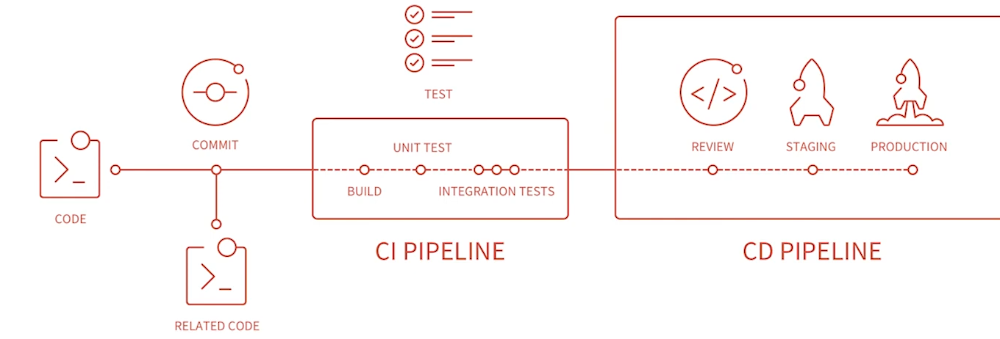

### 可用性和兼容性设计

著名的Design For Failure思想，微服务架构采用euclid的进程键通信，引入了额外的复杂性和需要处理的新问题，如网络延迟、消息格式、负载均衡和容错，忽略其中任何一点都属于对“分布式计算的误解”。

- 隔离
- 超时控制
- 负载保护
- 限流
- 降级
- 重试
- 负载均衡

## 微服务的设计

### API Gateway

SOA服务的架构演进，按照垂直功能进行了拆分，对外暴露了一批微服务，但是因为缺乏统一的出口面临了不少困难：

- 客户端到微服务直接通信，强耦合
- 需要多次请求，客户端聚合数据，工作量巨大，延迟高
- 协议不利于统一，各个部门间有差异，需要端来兼容
- 面向“端”的API适配，耦合到了内部服务。
- 多终端兼容逻辑复杂，每个服务都需要处理
- 统一逻辑无法收敛，比如安全认证、限流

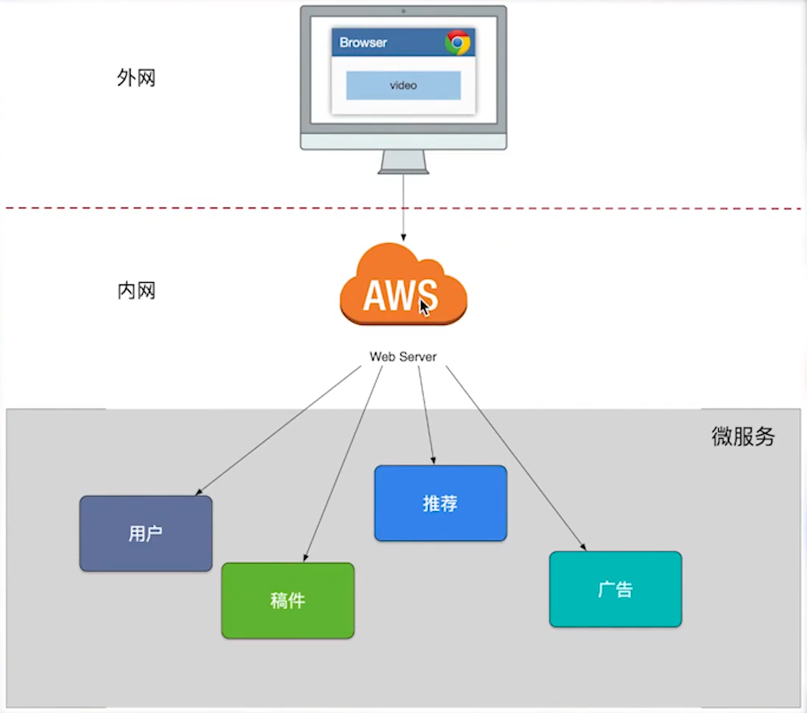

新增一个app-interface用于统一的协议出口，在服务内进行大量的dataset join,按照业务场景来设计粗力度的API，给后续服务的演进带来的很多优势：

- 轻量交互：协议精简、聚合
- 差异服务：数据裁剪以及聚合、针对终端定制化API
- 动态升级：原有系统兼容升级，更新服务而非协议
- 沟通效率提升

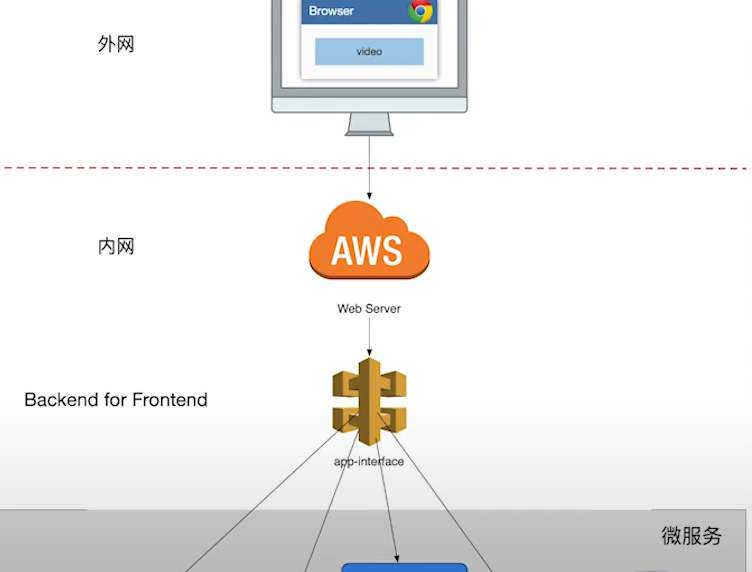

BFF可以认为是一种适配服务，将后端的微服务进行适配（主要包括聚合裁剪和格式适配等逻辑），向无线端设备暴露友好和统一的API，方便无线设备介入访问后端服务。

最致命的一个问题是整个app-interface属于single point of failure，严重代码缺陷或者流量洪峰可能引发集群宕机

- 单个模块也会导致后续业务集成复杂度高，根据康威法则，单块的BFF和多团队之间就出现不匹配问题，团队之间沟通协调成本高，交付效率底下。
- 很多跨横切面逻辑，比如安全认证，日志监控，限流熔断等。随着时间的退役，代码变得越来越复杂，技术债越堆越多。

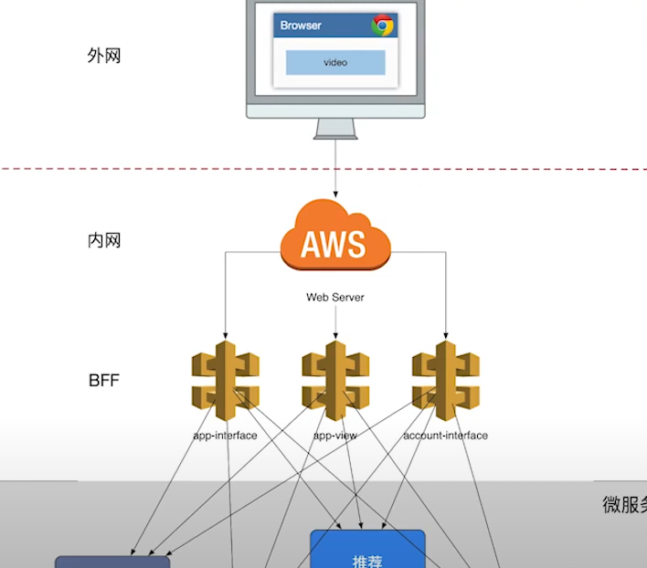

跨横切片（Cross-Cutting Concerns）的功能，需要协调更新框架升级发版（路由、认证、限流、安全），因此全部上沉，引入API Gateway，把业务集成度高的BFF层和通用功能服务层API Gateway 进行了分层处理。

在新的架构中，网关承担了重要的角色，他是解藕拆分和后续升级迁移的利器。在网关的配合下，单块BFF实现了解藕拆分，各业务线团队可以独立开发和交付各自的微服务，研发效率大大提升。另外，把跨横切片逻辑从BFF剥离到网关上去以后，BFF的开发人员可以更加专注业务逻辑交付，实现了架构上的关注分离

> 业务流量实际为：外部-->API Gateway --> BFF -->MIrcoservice，在FE Web业务中，BFF可以是nodejs来做服务端渲染(此处忽略上游CDB、4/7层负载均衡（ELB）)

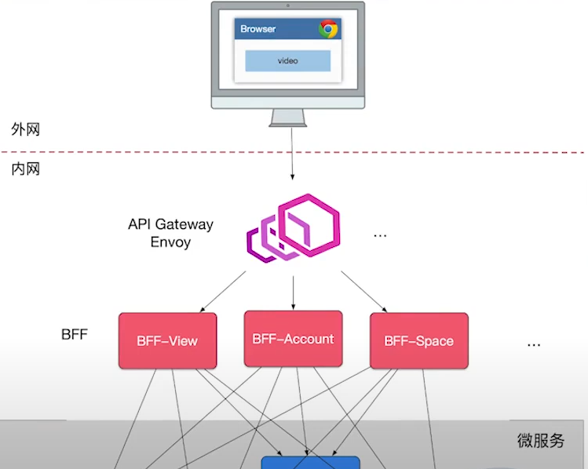

**API网关中的设计模式:**

- 代理模式，外观模式，中介者模式，责任连模式，策略模式

### Mircoservice划分

微服务架构时遇到的第一个问题就是如何划分服务的边界。在实际项目中通常会采用两种不同的方式划分服务边界，即通过业务职能（Business Capability）或是DDD的限界上下文（Bounded Context）。

- Business Capability：由公司内部不同部门提供的智能。例如客户服务部门提供客户服务的智能，财务部门提供财务相关的职能

- Bounded Context：限界上下文是DDD中用来划分不同业务边界的元素，这里业务边界的含义是"解决不同业务问题"的问题和对应的解决方案域，为了解决某种类型的业务问题，贴近领域知识，也就是业务。

  > 这本质上也促进了组织结构的演进：Service per team

- CQRS：将应用程序分为两部分，命令端和查询端

  - 命令端处理程序创建，更新和删除请求，并在数据更改时发出事件
  - 查询端通过针对一个或多个物化试图执行查询来处理查询，这些无法视图通过订阅数据更改时发出的事件流而保持最新

  > 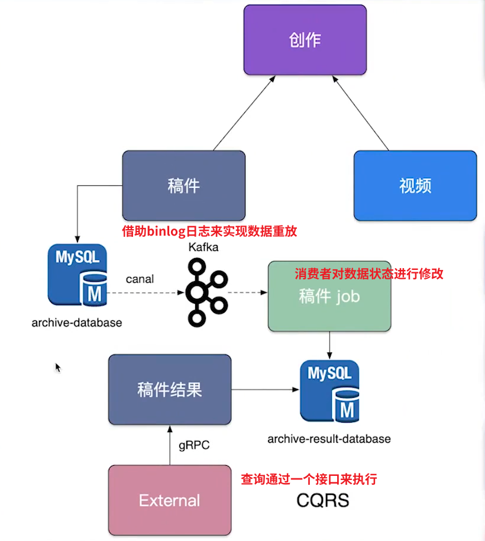
  >
  > 架构从polling  publisher--> Transaction log tailing 进行了演进（pull vs push）

### Mircoservice安全

对于外网的请求来说，我们通常在API Gateway进行了统一的认证拦截，一旦认证成功，我们会使Header方式通过RPC元数据传递的方式带到BFF层，BFF获取后把身份信息注入到应用的Context中，BFF到其他下层的微服务，建议是shimei在RPC Request 中带入用户身份信息（UserID）请求服务

- API Gateway -->BFF --> Service
- Biz Auth --> UID --> Request Args

对于服务内部，一般区分身份认证和授权

- Full Trust：完全信任，不需要认证

- Half Trust：半信任，需要提供身份认证

- Zero Trust：零信任，传输数据的加解密以及身份认证

## grpc&服务发现

### grpc

A hight-performance,open-source uiversal RPC framework

- 多语言：语言中立，支持多种语言
- 轻量级、高性能：序列化支持PB（Protocol BUffer）和JSON，PB是一种语言无关的高性能序列化框架。
- 可插拔
- IDL：基于文件定义服务，通过proto3工具生成指定语言的数据结构、服务端接口以及客户端Stub
- 设计理念
- 移动端：基于标准的HTTP/2设计，支持双向流、消息头压缩、单TCP的多路复用，服务端推送等特性，这些特性使得grpc在移动端设备上更加省电和节省网络流量。

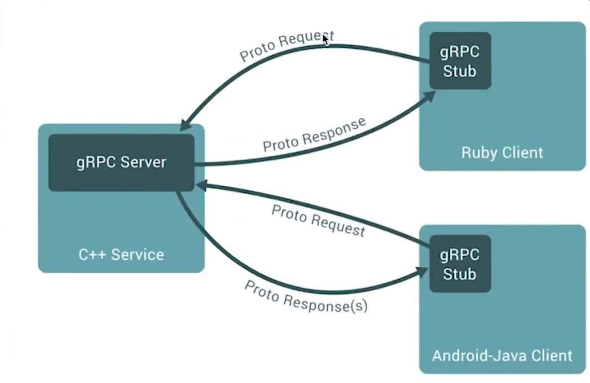

- 服务而非对象、消息而非引用：促进微服务的系统间粗力度消息交互设计理念
- 负载无关的：不同的服务需要使用不同的消息类型和编码，例如protocol buffers、json、xml和thrift
- 流：Streaming API
- 阻塞式和非阻塞式：支持异步和同步处理在客户端和服务端之间的消息序列
- 元数据交换：常见的横且关注点，如认证或跟踪，依赖数据交换
- 标准化状态码：客户端通常以优先的方式响应API调用返回的错误

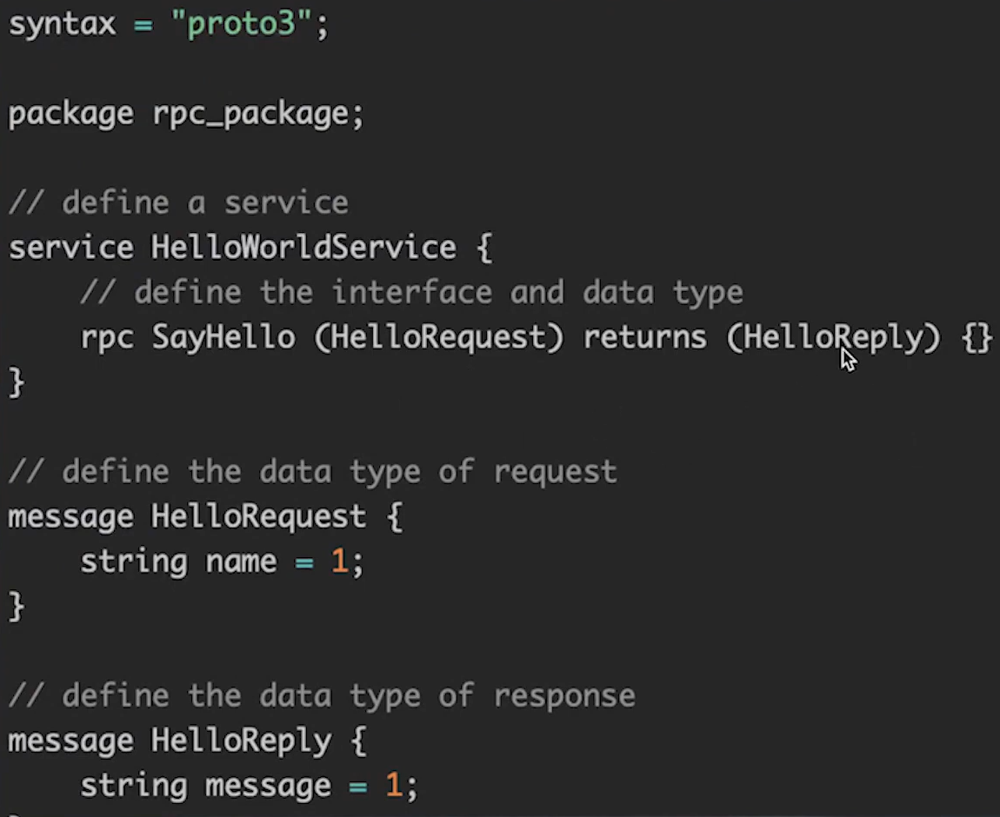

### HealthCheck

grpc有一个标准的健康检测协议，在grpc的所有语言实现中基本都提供了生成代码和用于设置运行状态的功能。

> 主动健康检查health check,可以在服务提供者服务不稳定时，被消费者所感知，临时从负载均衡中摘除，减少错误请求。当服务提供者重新稳定后，health check成功，重新加入到消费者的负载均衡，恢复请求。health check同样也被用于外挂方式的容器健康检测，或者流量检测（k8s liveness & readiness）

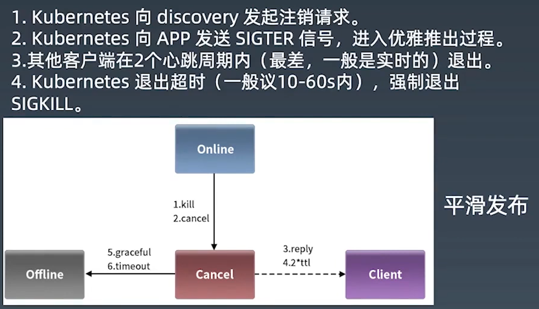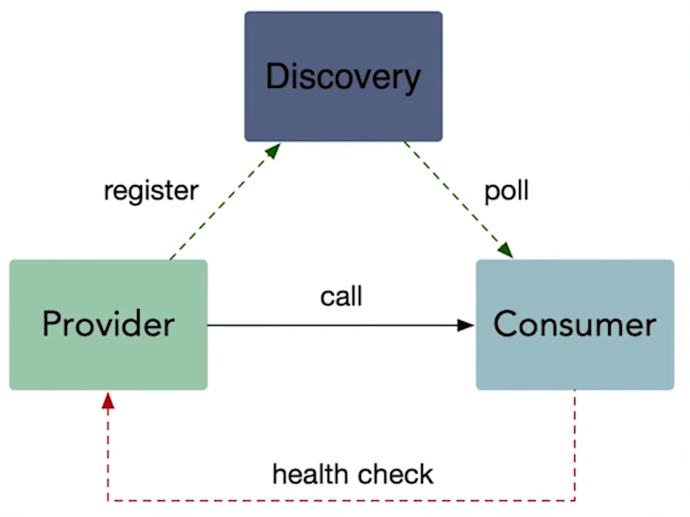

### 服务发现

**客户端发现：**一个服务实例被启动时，他的网络地址会被写到注册表上；当服务实例终止时，再从注册表中删除；这个服务示例的注册表通过心跳机制动态刷新；客户端使用一个负载均衡算法，去选择一个可用的服务实例，来响应这个请求。

> 直连，比服务端服务发现少一次网络跳转，consumer需要内置特定的服务发现客户端和发现逻辑

**服务端发现：**客户端通过负载均衡器向服务发送请求，这个负载均衡器会查询服务注册表，并将请求路由到可用的服务实例上。服务实例在服务注册表上被注册和注销（Consul Template +Nginx,kubernetes+etcd）

> consumer无需关注服务发现具体细节，只需知道服务的DNS域名即可，支持异构语言开发，需要基础设置支撑，多了一次网络跳转，可能有性能损失。
>
> 负载均衡器会过热，违背了去中心化的理念

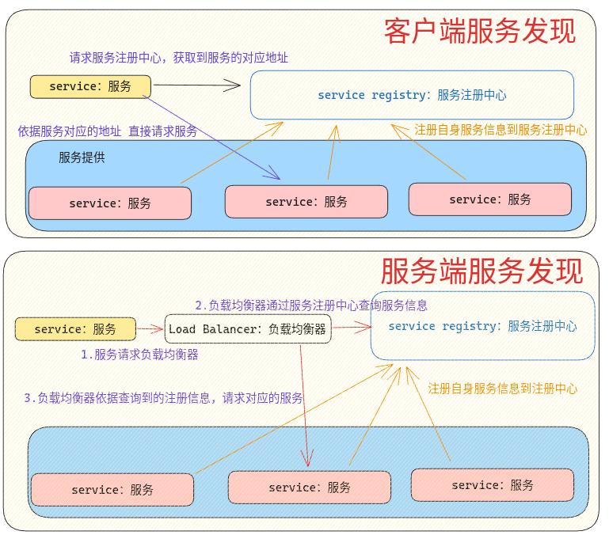

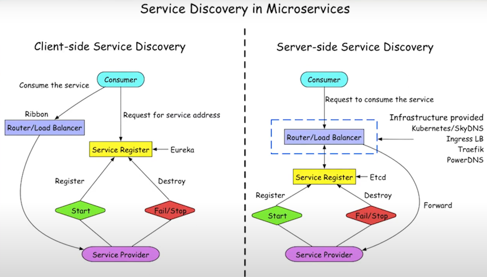

## 限流、降级、熔断、限频

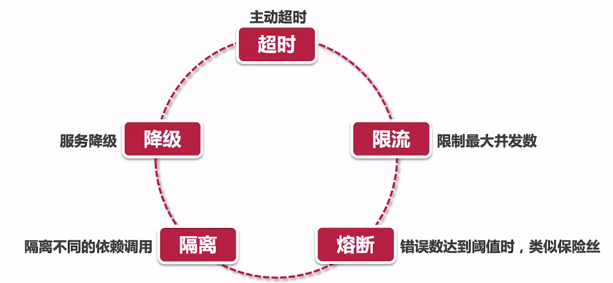

#  工程化

 ## 项目结构  

https://github.com/golang-standards/project-layout

-  cmd：本项目的主干，每个应用程序的目录名应该与你想要的可执行文件的名称相匹配，如`/cmd/myapp`

  > - 不要在该目录中放置太多代码。
  >
  > - 如果代码可以导入并在其他项目中使用，那么它应该位于`/pkg`目录中
  > - 如果代码是不可重用的，或者不希望其他人重用，请将该代码放到`/internal`目录中
  >
  > 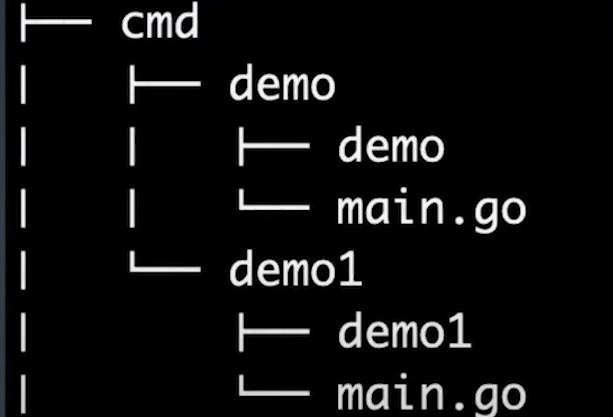

- internal：私有应用程序和库代码。这是不希望其他人在其应用程序或库中导入代码

  > - 并不局限于顶级internal目录，在项目树的任何级别上都可以有多个内部目录。
  > - 可以选择向internal包中添加一些额外的结构，以分割共享和非共享的内部代码
  >
  > 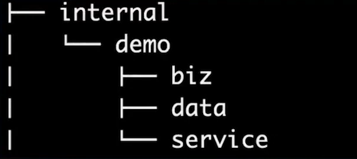

- pkg：外部应用程序可以使用的库代码。其他项目会导入这些库。

  > - internal目录是确保私有包不可导入的更好方法，因为它是go强制执行的
  > - `/pkg `目录任然是一种很好的方式，可以显示地表示该目录中的代码对于其他人来说是安全使用的好方法。 

  `/pkg`目录内，可以参考go标准库的组织方式，按照功能分类。`/internal/pkg`一般用于项目内的跨多个应用的公共共享代码，但其作用于仅在单个项目工程内。

  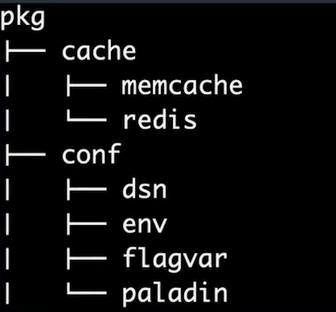

# 实践

## 隔离

隔离，本质上是对ait哦嗯或资源进行分割，从而实现当系统发生故障时能限定传播范围和影响范围，即发生故障后只有出问题的服务不可用，保证其他服务仍然可用

- 服务隔离：动静分离、读写分离
- 轻重隔离：核心、快慢、热点
- 物理隔离：线程、进程、集群、机房

**动静隔离**

小到CPU的cacheline  sharing、数据库mysql表设计中避免bufferpool频繁过期，隔离动静表，大到架构设计中的图片、静态资源等缓存加速。本质上都体现的一样的思路，即加速/缓存访问变换频次小的。如CDN场景中，将静态资源和动态API分离，也是体现了隔离的思路

- 降低应用服务器负载，静态文件负载全部通过CDN
- 对象存储存储费用最低
- 海量存储空间，无需考虑存储架构升级
- 静态CDN带宽加速，延迟低
