# 简介

## 组件

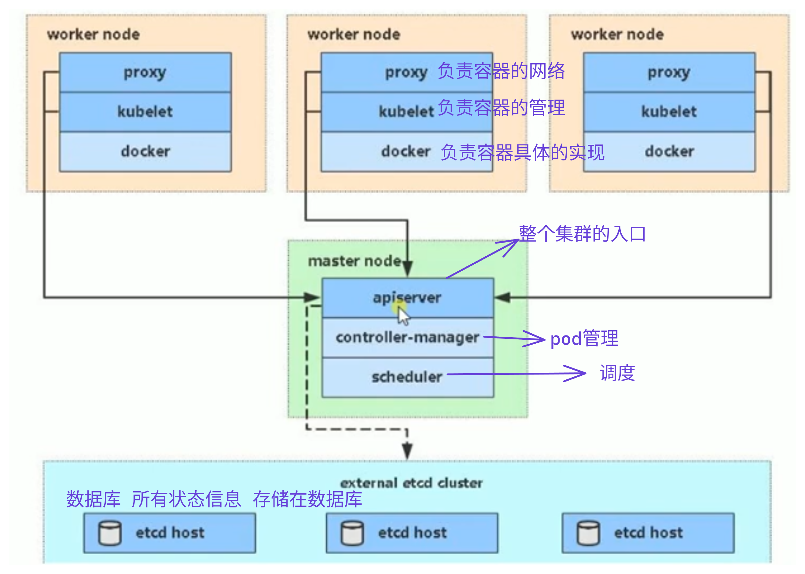

### master

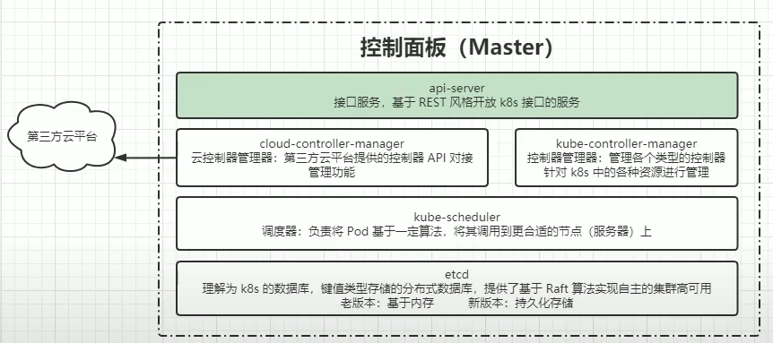

- api-server：接口服务，基于REST风格开放k8s接口的服务
- kube-controller-manager：控制器管理器，管理各个类型的控制器，针对k8s中的各种资源进行管理
- cloud-controller-manager：云控制器管理器，第三方平台提供的控制器API对接管理功能
- kube-scheduler：调度器，负责将Pod基于一定算法，将其调用到更合适的节点（服务器）上
- etcd：理解为k8s的数据库，键值类型存储的分布式数据库，提供了基于Raft算法实现自主的集群高可用
  - 老版本：基于内存
  - 新版本：持久话存储

### node

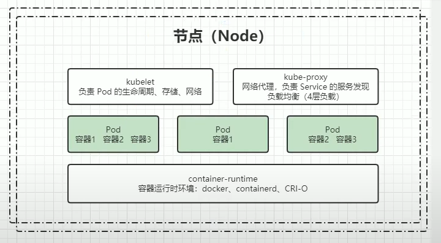

- kubelet：负责Pod的生命周期、存储、网络（container runtime interface）
- kube-proxy：网络代理，负责Service的服务发现、负载均衡（4层负载）
- Pod：一个Pod中最少需要有1个容器
- container-runtime：容器运行时环境，docker、containerd、CRI-O（container runtime interface）

### 附加组件

- kube-dns：域名管理
- ingress Controller：外部服务访问控制器
- Heapster/Prometheus：提供资源监控
- Dashboard：提供GUI界面
- Federation：提供跨可用取的集群
- Fluentd-elasticsearch：日志搜索

**分层架构:**

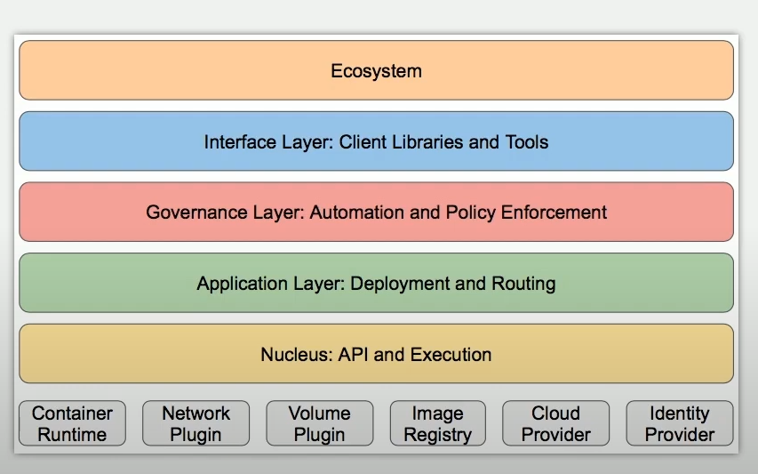

- 生态系统：构建的K8s生态系统，如GUI等
- 接口层：所有生态系统都需要调用k8s的接口层
- 管理层：系统度量（如基础设施，容器和网络的度量）、自动化（如自动扩展、动态Provision等）以及策略管理（RBAC、Quota、PSP、NetworkPOlicy等）
- 应用层：部署（无状态应用、有状态应用、批处理任务、集群应用等）和路由（服务发现、DNS解析等）
- 核心层：最核心的功能，对外提供API构建高层的应用，对内提供插件式应用的执行环境

## 服务的分类

- 无状态应用：不会对本地环境产生依赖，如不会存储数据到本地磁盘
  - 优点：对客户端透明，无依赖关系，可以高校实现扩容、迁移
  - 缺点：不能存放数据，需要额外的数据服务支撑
- 有状态应用：会对本地环境产生依赖，如会存储数据到本地磁盘
  - 优点：可以独立存储数据，实现数据管理
  - 缺点：集群环境下需要实现主从、数据同步、备份、水平扩容复杂

## 资源和对象

k8s中所有内容都被抽象为"资源"，如Pod、Service、NOde等都是资源。"对象"就是资源的示例，是持久化的实体。

如某个具体的POd、某个具体的Node，kubernetes使用这些实体去表示整个集群的状态。

对象的创建、删除、修改是通过kubernetes API，也就是API server组件提供的API接口，这些是RESTful风格的Api，与k8s万物接对象理念相符。命令行工具kubectl实际上也是调用kubernetes api

k8s中的资源类别有很多种，kubectl可以通过配置文件来创建

规约：spec是规约、规格的意思，spec是必须的，他描述了对象的期望状态----希望对向所具有的特征。当创建kubernetes对象时，必须提供对象的规约，用来描述该对象的期望状态，以及关于对象的一些基本信息

状态：表示对象的实际状态，该属性由k8s自己维护，k8s会通过一系列的控制器对对应对象进行管理，让对象尽可能的让实际状态与期望状态重合。

资源清单：

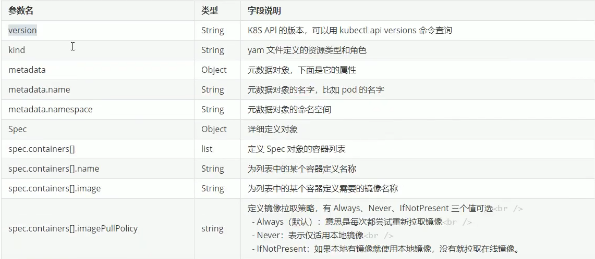

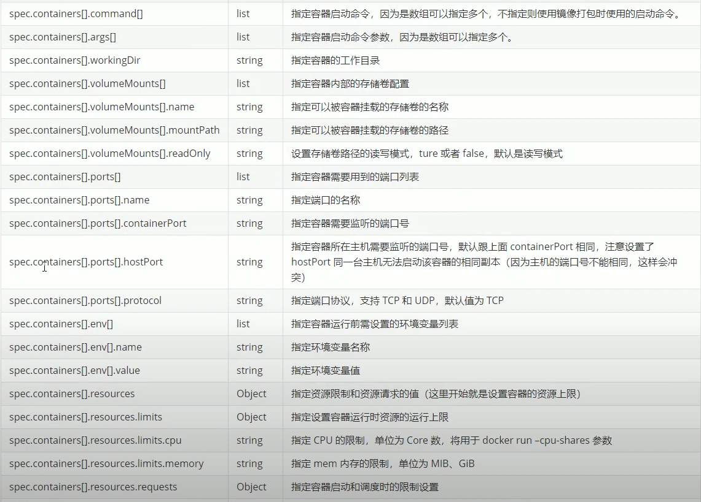

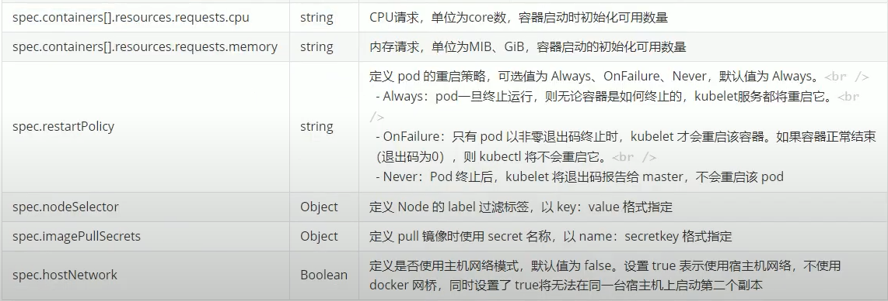

## 资源的分类

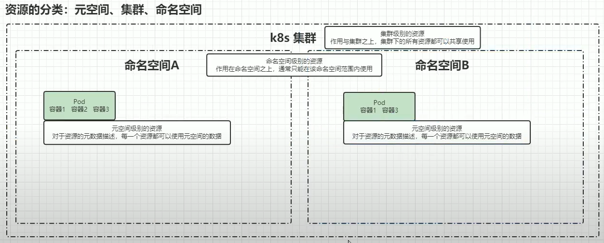

### 元数据类型

对于资源的元数据的描述，每一个资源都可以使用元数据的数据：

- Horizontal Pod Autoscaler（HPA）：Pod自动扩容

  > 控制器每隔30s（可以通过horizontal-pod-autoscaler-sync-period修改）查询metrics的资源使用情况
  >
  > 支持三种metrics类型
  >
  > - 预定义metrics（比如Pod的CPU）以利用率的方式计算
  > - 自定义Pod metrics，以原始值（raw value）的方式计算
  > - 自定义object metrics
  >
  > 支持两种metrics查询方式：Heapster和自定义REST API
  >
  > 支持多metrics

- PodTemplate：关于Pod的定义，但是背包汗在其他的kubernetes对象中（如Deployment、StatefulSet、DaemonSet等控制器）‘控制器通过Pod Template信息来创建Pod

- LimitRange：对器群内的Request和LImits的配置做一个全局的统一的限制，相当于批量设置了某一个范围内（某个命名空间）的Pod的资源使用限制。

### 集群级

作用于集群之上，集群下的所有资源都可以共享使用

- Namespace
- Node：不像其他的资源，Node本质上不是kubernetes来创建的，kuberneter只是管理Node上的资源。虽然可以通过Mainfest创建一个NOde对象，但kubernetes也只是取检查是否真的是有这么一个Node，如果检查时白，也不会往上调度Pod
- ClusterRole：集群角色管理
- ClusterRoleBinding：角色与资源进行绑定，只能往集群资源级别上进行绑定

### 命名空间级

#### 工作负载型

作用在命名空间上，通常只能在该命名空间内使用

**Pod：**kubernetes中最小的可部署单元。

一个Pod(容器组)包含了一个应用程序容器（某些情况下是多个容器）、存储资源、一个唯一的网络IP地址、以及一些确定容器该如何运行的选项。Pod容器组代表了kubernetes中的一个独立的应用程序运行实例，该示例可能有单个容器或者几个紧耦合在一起的容器组成

docker是kubernetes Pod中使用最广泛的容器引擎kubernetes Pod同时也支持其他类型的容器引擎。

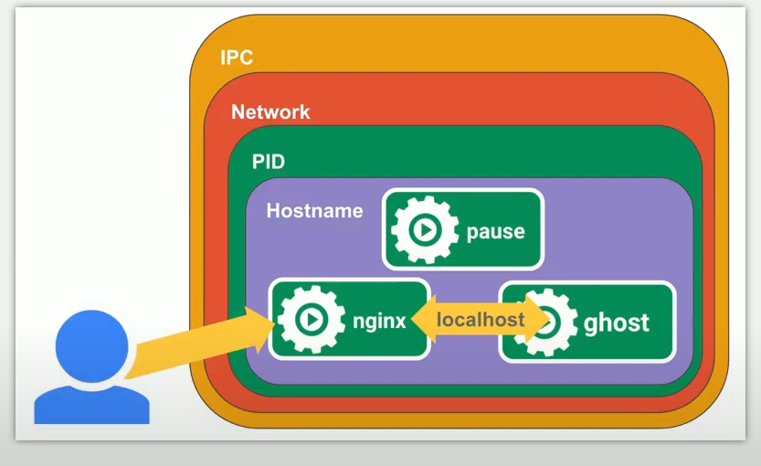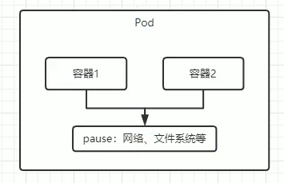

一个pod可以被复制成多份，每一份可被称之为一个副本，这些副本除了一些描述的信息（pod名字、uid等）不一样外，其他信息都是一样的。


**控制器：**pod的控制器通常包含一个名为replicas的属性。replicas属性则指定了特定Pod的副本的数量，当当前集群中该pod的数量与该属性制定的值不一致时，k8s会采取一些策略取使得当前状态满足配置的要求

适用无状态服务：ReplicationController(RC)、ReplicaSet(RS)、Deployment。

> RC主要的作用就是用来保持容器应用的副本数始终保持在用户定义的副本数，如果有容器异常退出，会自动创建新的Pod来替代quechua的容器也会自动挥手，v1.11版本废弃
>
> kubernetes建议使用RS替代RC进行部署，RS跟RC没有本质的不同，只是名字不一样，并且RS支持集合是的selector，可以通过selector来选择对哪些Pod生效
>
> deployment针对RS的更高层次的封装，提供了更丰富的部署相关的功能：
>
> - 自动创建Replica Set/Pod
> - 滚动升级/回滚
> - 平滑扩容和缩容
> - 暂停和恢复

适用有状态服务：StatefulSet

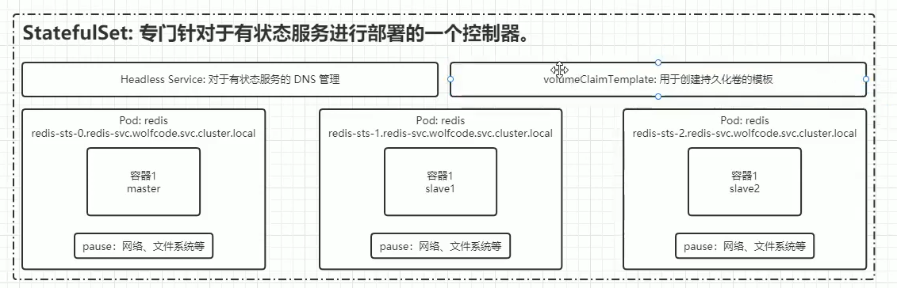

> 稳定的持久存储、稳定的网络标识、有序部署、有序或栈、有序收缩、有序删除

- headless service：用于定义网络标识（DNS domain） domain name service。pod name-->访问路径（域名）自动绑定到ip上

  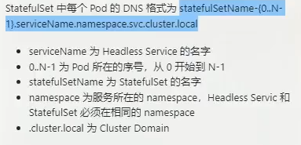

- volumeClaimTemplate：

守护进程：Daemon

> 保证每个Node上都运行一个容器副本，常用来部署一些集群的日志、监控或者其他系统管理应用。
>
> - 日志收集，比如fluentd，logstash
> - 系统键桶，比如Prometheus Node Exporter，collectd，New Relic agent，Ganglia gmond等
> - 系统程序：比如kube-proxy，kube-dns，glusterd，ceph等

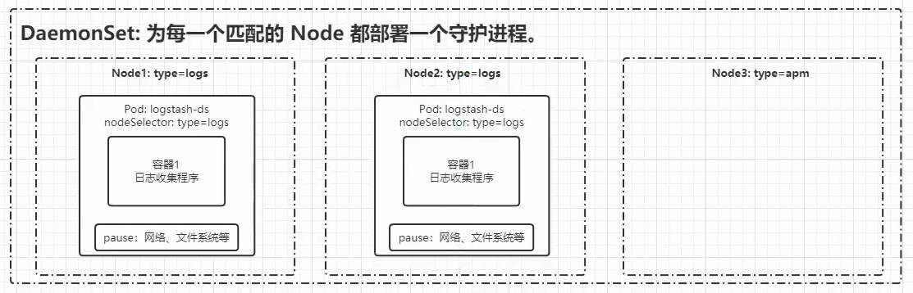

任务/定时任务：Job、CronJob

> Job：一次性任务，运行玩就销毁
>
> CronJob：周期性执行的任务

#### 服务发现

service：集群内网络通信，跨节点通信，负载均衡（四层负载）

ingress：实现k8s内部服务暴露给外网访问的服务

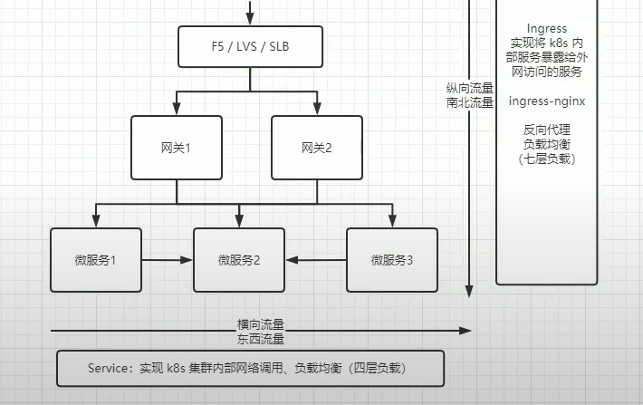

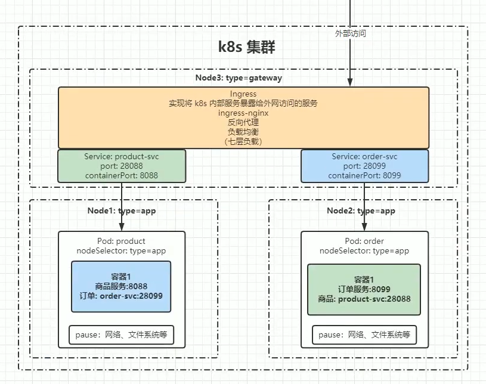

#### 配置与存储

volume：数据卷，共享Pod中容器使用的数据，用来持久化的数据，比如数据库数据

CSI：container server interface，将任意存储系统暴露给容器化应用的程序

#### 特殊类型配置

- ConfigMap：key、value类型的配置，可以将配置加载到pod中，可以将pod中的配置暴露出来，方便修改
- Secret：与ConfigMap作用相同，加密了
- DownwardAPI：提供了两种方式用于将pod信息注入到容器内，环境变量、volume挂载

#### 其他

Role：定义一组权限

RoleBinding：角色绑定

## 安装

### 环境准备

```bash
# node节点安装依赖
sudo apt update
sudo apt install openssh-server
sudo systemctl status ssh

# 生成ssh密钥，默认路径/home/hsiangya/.ssh/id_rsa  # 将密钥传递node节点
ssh-keygen -t rsa -b 4096
ssh-copy-id -i ~/.ssh/id_rsa.pub hsiangya@192.168.1.101

# 每台机器都关闭空间交换
sudo swapoff -a

# 关闭SElinux
sudo apt-get install policycoreutils
sudo setenforce 0
sudo setenforce 1
sestatus
sudo  # 永久关闭
SELINUX=disabled

# 关闭swap，找到包含swap的行 注释掉
sudo vim /etc/fstab

# 设置主机名
sudo hostnamectl set-hostname <hostname>
# 在master 添加hosts
sudo cat >> /etc/hosts <<EOF
192.168.1.7 master
192.168.1.101 node1
192.168.1.102 node2
192.168.1.104 node4
EOF

sudo cat >> /etc/hosts <<EOF
116.198.217.180 master
EOF


# 时间同步1. 
sudo apt-get update
sudo apt-get install ntpdate
sudo ntpdate time.windows.com
# 同步时间2. 阿里云
sudo apt install ntp
sudo vim /etc/ntp.conf
server ntp1.aliyun.com iburst
server ntp2.aliyun.com iburst
server ntp3.aliyun.com iburst
server ntp4.aliyun.com iburst
sudo systemctl enable ntp
sudo systemctl start ntp
ntpdate -u ntp1.aliyun.com
```

### 防火墙端口

```bash
# 开放主节点端口
sudo ufw allow 6443
sudo ufw allow 2379:2380/tcp
sudo ufw allow 10250
sudo ufw allow 10251
sudo ufw allow 10252
sudo ufw reload

# 开放工作节点端口
sudo ufw allow 10250

# 如果使用 NodePort 范围
sudo ufw allow 30000:32767/tcp
sudo ufw allow 30000:32767/udp

# 应用设置
sudo ufw enable
```

### containerd

https://github.com/containerd/containerd/blob/main/docs/getting-started.md

```bash
# 下载并解压到/usr/local
sudo wget https://github.com/containerd/containerd/releases/download/v1.7.18/containerd-1.7.18-linux-amd64.tar.gz
sudo tar Cxzvf /usr/local containerd-1.7.18-linux-amd64.tar.gz

# 下载自动启动脚本到指定位置
sudo curl https://raw.githubusercontent.com/containerd/containerd/main/containerd.service -o /etc/systemd/system/containerd.service
# 修改sandbox image
sudo containerd config default > /etc/containerd/config.toml
sudo sed -i 's#sandbox_image = "registry.k8s.io/pause:3.8"#sandbox_image = "registry.aliyuncs.com/google_containerd/pause"#g' /etc/containerd/config.toml
sudo systemctl daemon-reload
sudo systemctl enable containerd.service
sudo systemctl start containerd.service
sudo systemctl status containerd.service
containerd --version

# 安装runc
sudo wget https://github.com/opencontainers/runc/releases/download/v1.1.13/libseccomp-2.5.5.tar.gz
sudo tar xf libseccomp-2.5.5.tar.gz
cd libseccomp-2.5.5
sudo apt install gperf -y
./configure
make && make install
find / -name "libseccomp.so"
sudo wget https://github.com/opencontainers/runc/releases/download/v1.1.13/runc.amd64
sudo install -m 755 runc.amd64 /usr/local/sbin/runc
runc --version

# 安装CNI插件
sudo wget https://github.com/containernetworking/plugins/releases/download/v1.5.0/cni-plugins-linux-amd64-v1.5.0.tgz
sudo mkdir -p /opt/cni/bin
sudo tar Cxzvf /opt/cni/bin cni-plugins-linux-amd64-v1.5.0.tgz
ls /opt/cni/bin
```

### 先决条件

> 官方文档 目前未知影响

```bash
cat <<EOF | sudo tee /etc/modules-load.d/k8s.conf
overlay
br_netfilter
EOF

sudo modprobe overlay
sudo modprobe br_netfilter

# sysctl params required by setup, params persist across reboots
cat <<EOF | sudo tee /etc/sysctl.d/k8s.conf
net.bridge.bridge-nf-call-iptables  = 1
net.bridge.bridge-nf-call-ip6tables = 1
net.ipv4.ip_forward                 = 1
vm.swappiness = 0
EOF

# Apply sysctl params without reboot
sudo sysctl --system

lsmod | grep br_netfilter
lsmod | grep overlay

sysctl net.bridge.bridge-nf-call-iptables net.bridge.bridge-nf-call-ip6tables net.ipv4.ip_forward

# 配置systemdcgroup 驱动程序
sudo vim /etc/containerd/config.toml

[plugins."io.containerd.grpc.v1.cri".containerd.runtimes.runc]
  ...
  [plugins."io.containerd.grpc.v1.cri".containerd.runtimes.runc.options]
    SystemdCgroup = true
```


### kubeadm、kubelet、kubectl

```bash
sudo apt-get update
sudo apt-get install -y apt-transport-https ca-certificates curl gpg
# sudo mkdir -p -m 755 /etc/apt/keyrings
curl -fsSL https://pkgs.k8s.io/core:/stable:/v1.29/deb/Release.key | sudo gpg --dearmor -o /etc/apt/keyrings/kubernetes-apt-keyring.gpg
echo 'deb [signed-by=/etc/apt/keyrings/kubernetes-apt-keyring.gpg] https://pkgs.k8s.io/core:/stable:/v1.29/deb/ /' | sudo tee /etc/apt/sources.list.d/kubernetes.list
sudo apt-get update
sudo apt-get install -y kubelet kubeadm kubectl
sudo apt-mark hold kubelet kubeadm kubectl
systemctl enable kubelet
```

### 构建集群

```bash
# 查看镜像,并提前拉取
kubeadm config images list
kubeadm config images pull

sudo kubeadm init \
--apiserver-advertise-address=192.168.1.7 \
--kubernetes-version v1.29.3 \
--service-cidr=10.96.0.0/12 \
--pod-network-cidr=192.168.0.0/16 

# 根据输出信息执行对应指令
sudo mkdir -p $HOME/.kube
sudo cp -i /etc/kubernetes/admin.conf $HOME/.kube/config
sudo chown $(id -u):$(id -g) $HOME/.kube/config

```

### 网络插件

https://kubernetes.io/docs/concepts/cluster-administration/addons/

```bash
# 安装
kubectl create -f https://raw.githubusercontent.com/projectcalico/calico/v3.28.0/manifests/tigera-operator.yaml
kubectl create -f https://raw.githubusercontent.com/projectcalico/calico/v3.28.0/manifests/custom-resources.yaml
watch kubectl get pods -n calico-system

# 安装完成后查看节点状态
kubectl get node -o wide
```

### metrics-server

```bash
sudo wget https://github.com/kubernetes-sigs/metrics-server/releases/download/v0.7.1/components.yaml -O metrics-server-components.yaml

# 修改参数为不校验证书,已经镜像源换源（阿里云）
sudo vim metrics-server-components.yaml
      containers:
      - args:
        - --cert-dir=/tmp
        - --secure-port=10250
        - --kubelet-preferred-address-types=InternalIP,ExternalIP,Hostname
        - --kubelet-use-node-status-port
        - --metric-resolution=15s
        - --kubelet-insecure-tls
        image: registry.k8s.io/metrics-server/metrics-server:v0.7.1

# 安装 
kubectl apply -f metrics-server-components.yaml
```

## kubectl命令

- 从节点本质是通过访问API server来控制，`~/.kube/config`中保留了配置文件

- 在任意节点使用kubectl：

  - 将master节点中 `/etc/kubernetes/admin.conf`拷贝到需要运行的服务器的`/etc/kubernetes`目录中
  - 在对应的服务器上配置环境变量：`echo “export KUBECONFIG=/etc/kubernetes/admin.conf" >> ~/.bash_profile`,然后激活环境`source ~/.bash_profile`

  **命令：**

  - create：创建某个资源
  - get：获取某个资源的信息
  - run：运行一个资源
  - expose：暴露资源的信息
  - delete：删除资源

  - apply：应用或更新资源配置
  - annotate：资源添加或修改注释，注释是用于存储额外信息的键值对
  - autoscale：设置自动扩缩容规则
  - debug：提供一种方式来调试集群中的容器
  - diff：显示本地配置文件与集群当前状态之间的差异
  - edit：直接编辑kubernetes集群中的资源配置
  - kustomize：使用kustomize管理kubernetes资源的工具
  - label：添加或修改kubernetes资源的标签
  - patch：对kubernetes资源进行部分更新
  - replace：替换资源的当前规格
  - rollout：管理资源的部署过程，如回滚之前版本或查看部署状态
  - scale：手动调整服务或部署的副本数量，增减Pod数量
  - set：修改特定资源的特定配置，如环境变量或容器的镜像
  - wait：等待特定的kubernetes资源达到某个状态

  **资源别名：**

  pods：pod

  deployments：deploy

  services：svc

  namespace：ns

  nodes：no

```bash
kubectl get no # 获取节点信息
kubectl get pod # 获取pod信息类表
kubectl get ns # 获取命名空间
kubectl get deploy 
```

## API概述

类型：

- Alpha：默认情况会禁用，可能有bug，尝鲜
- Beta：做过完善的测试，基本上没问题，不会被删除，命名方式`v2beta3`
- Stable：主要使用的版本，稳定版,命名方式`vX`

访问控制：

- 认证： 
- 授权：

# Pod

```bash
# 获取pod信息
kubectl get pods
kubectl get deploy
kubectl delete deloy <name> # 删除
kubectl get services # 获取services信息
kubectk delete svc <name>
```

## 配置文件启动

- 编写配置文件：[官方示例](https://kubernetes.io/docs/concepts/configuration/manage-resources-containers/)

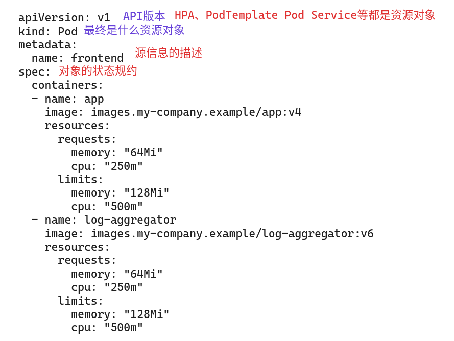

简易示例：

```yaml
apiVersion: v1 # 支持的wending版本
kind: Pod # 资源对象类型
metadata:
  name: nginx-demo # pod名称
  labels: # 定义标签
    typeasdasd: app # 这里可以随便写 键值形式就行
    type: app # 名字为type，值为app，自定义的label
    version: 1.1.0
  namespace: 'default' # 没写默认default
spec: # 期望Pod按照这里面的描述进行创建
  containers: # 地哦与pod中的容器描述
  - name: nginx
    image: nginx:1.7.9 # 制定镜像名称以及版本
    imagePullPolicy: IfNotPresent  # 镜像的拉取策略
    command: # 容器启动时执行的命令
    - nginx
    - -g
    - 'daemon off;' # nginx -g "daemon off" 形式执行
    workingDir: /usr/ # 程序启动目录
    ports: 
    - name: http # 端口名称
      containerPort: 80 # 容器内暴露的端口
      protocol: TCP # 描述暴露信息基于的通信协议
    env: # 环境变量名称 
    - name: JVM_OPTS
      value: "-Xms128m -Xmx128m"
      
    resources:
      requests: # 最少需要多少资源
        cpu: 100m # 限制CPU最少使用0.1核心 1000m等于一个核心
        memory: 128Mi # 限制内存最少使用128M
      limits: # 最多可以使用多少资源
        cpu: 200m # 最多使用0.2个核心
        memory: 256Mi # 最大的内存使用
restartPolicy: OnFailure # 重启策略，只有失败才会重启    
  
```

1. 执行：`kubectl create -f nginx-demo.yaml`
2. 查看描述信息：`kubectl describe po nginx-demo`
3. 查看pod信息：`kubectl get po -o wide`

| 参数名                                      | 类型    | 字段说明                                                     |
| ------------------------------------------- | ------- | ------------------------------------------------------------ |
| apiVersion                                  | String  | k8s版本说明，可以使用kubectl api version查看                 |
| kind                                        | String  | yaml文件定义的资源类型和角色                                 |
| metadata                                    | Object  | 元数据对象，下面是他的属性                                   |
| metadata.name                               | String  | 元数据对象的名字，比如Pod的名字                              |
| metadata.namespace                          | String  | 元数据对象的命名空间                                         |
| Spec                                        | Object  | 详细定义对象                                                 |
| Spec.containers[]                           | list    | 定义Spec对象的容器列表                                       |
| Spec.containers[].name                      | String  | 为列表中的某个容器定义名称                                   |
| Spec.containers[].image                     |         | 为列表中的某个容器定义需要的镜像名称                         |
| Spec.containers[].imagePullPolicy           | string  | 定义镜像拉取策略：<br />-  Always：默认，每次都尝试重新拉取镜像<br />- Never：表示近视用本地镜像<br />- IfNotPresent：本地有镜像，使用本地镜像，没有就在线拉取 |
| Spec.containers[].command[]                 | list    | 指定容器启动命令，数组，可以指定多个，不指定则使用镜像打包时的启动命令 |
| Spec.containers[].args[]                    | list    | 指定容器启动命令参数，数组，可以指定多个                     |
| Spec.containers[].workingDIr                | string  | 指定容器的工作目录                                           |
| Spec.containers[].volumeMounts[].           | list    | 指定容器内部的存储卷配置                                     |
| Spec.containers[].volumeMounts[].name       | string  | 指定可以被容器挂在的存储卷的名称                             |
| Spec.containers[].volumeMounts[].mountPath  | string  | 指定可以被容器挂在的存储卷路径                               |
| Spec.containers[].volumeMounts[].readOnly   | string  | 设置存储卷路径的读写模式，true或false，默认是读写模式        |
| Spec.containers[].ports[]                   | list    | 指定容器需要用到的端口列表                                   |
| Spec.containers[].ports[].name              | string  | 指定端口的名称                                               |
| Spec.containers[].ports[].containerPort     | string  | 指定容器需要监听的端口号                                     |
| Spec.containers[].ports[].hostPort          | string  | 指定容器所在主机需要监听的端口号，默认与containerPort相同    |
| Spec.containers[].ports[].protocol          | string  | 指定端口协议，支持TCP和UDP，默认TCP                          |
| Spec.containers[].env[]                     | list    | 指定容器运行前需要设置的环境变量列表                         |
| Spec.containers[].env[].name                | string  | 指定环境变量名称                                             |
| Spec.containers[].env[].value               | string  | 指定环境变量值                                               |
| Spec.containers[].resources                 | Object  | 指定资源限制和资源请求的值                                   |
| Spec.containers[].resources.limits          | Object  | 指定设置容器运行时资源的运行上限                             |
| Spec.containers[].resources.limits.cpu      | string  | 指定CPU的限制，单位为Core数                                  |
| Spec.containers[].resources.limits.memory   | string  | 指定mem内存的限制，单位为MIB、GIB                            |
| Spec.containers[].resources.requests        | Object  | 指定容器启动和调度时的限制设置                               |
| Spec.containers[].resources.requests.cpu    | string  | CPU请求，单位为core数，容器初始化可用数量                    |
| Spec.containers[].resources.requests.memory | string  | 内存请求，单位为MIB、GIB，容器启动的初始化可用数量           |
| sepc.restartPolicy                          | string  | 定义pod的重启策略：<br />- Always：pod一旦终止运行，无论容器何时终止，都会重启，默认<br />- OnFailure：只有pod以非0退出码终止时，kubelet才会重启该容器，正常结束不会重启<br />- Never：pod终止后，kubelet将退出码报告给master，不会重启pod |
| spec.nodeSelector                           | Object  | 定义NOde的label过滤标签，以k：v格式指定                      |
| spec.imagePullSecrets                       | Object  | 定义pull镜像时使用secret名称，以name:secretkey格式指定       |
| spec.hostNetwork                            | Boolean | 定义是否使用主机网络模式，默认false，设置true表示使用宿主机网络，不使用网桥 |

## 探针

容器内应用的检测机制，根据不同的探针来判断容器应用的状态

**类型：**

- StartupProbe：用于判断应用程序是否已经启动了，当设置startupProbe后，会先禁用其他探针，知道startupProbe成功后，其他探针才会继续。

  > 有时候不能预估应用多长时间启动，确保应用启动后，才执行另外两种探针

- LivenessProbe：用于检测探测容器中的应用是否运行，如果探测失败，kubelet会根据配置的重启策略进行重启，若没有配置，默认为容器启动成功，不会制定重启策略

  > 用于重启pod

- ReadinessProbe：用于探测容器内的程序是否健康，它的返回值如果返回success，那么就认为该容器已经完全启动，并且该容器是可以接受外部流量的

  > 用于检测是否健康

**探测方式：**：

- ExecAction：在容器内部执行一个命令，如果返回值为0,则任务容器时健康的
- TCPSocketAction：通过tcp连接检测容器内端口是否开放，如果开放则证明该容器健康
- HTTPGetAction：配置成一个http请求，如果返回的状态吗在200-400之间，则认为容器健康

**参数配置：**

- initialDelaySeconds：初始化时间

  > 无法完全替代staratup探针，因为无法确保一个程序启动的确定时间

- timeoutSeconds：超时时间

- periodSeconds：监测间隔时间

- successThreshold：检查几次成功就表示成功

- failureThreshold：检测失败几次就表示失败

**使用**:

1. 查看指定命名空间kube-sustem中的deploy：`kubectl get deploy -n kube-system`
2. 编辑配置文件：`kubectl edit deploy -n kube-system coredns`

> 对于pod信息 无法直接修改，不能直接修改这些。但可以查看配置信息

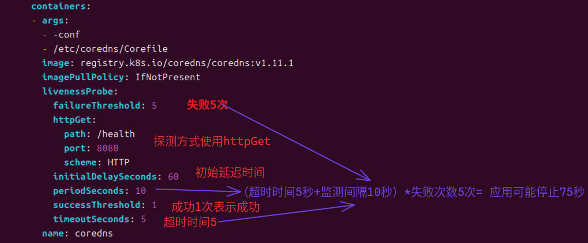

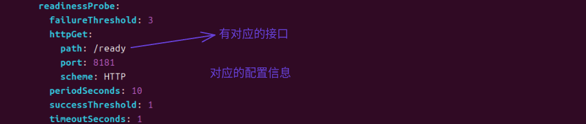

## 生命周期


**Pod退出流程**：

- Endpoint删除pod的ip地址

- Pod变成Terminating状态：变为删除中的状态后，会给pod一个宽限期，让pod执行一些清理或销毁操作

  > 配置参数：terminationGracePeriodSeconds    宽限期的秒数

- 执行preStrop指令

**PreStop的应用：**

- 注册中心下线
- 数据清理
- 数据销毁

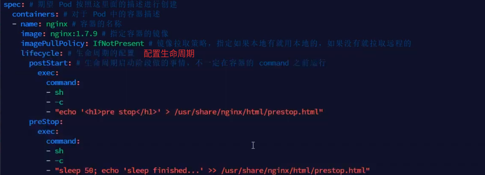

# 资源调度

## Label与Selector

- label：标签，在各类资源的`metadata.labels`中进行配置

  > 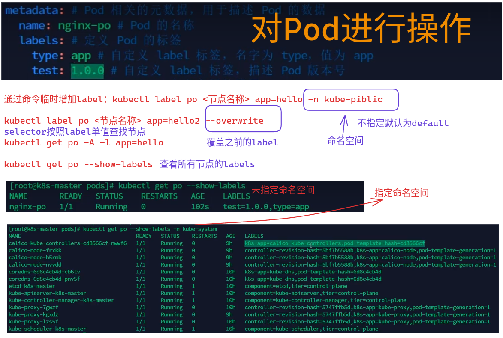

- selector：选择器

> 在个对象的配置spec.selector或其他可以写selector的属性中编写
>
> 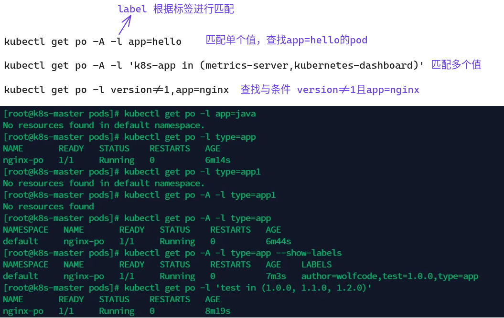

## Deployment

- 创建

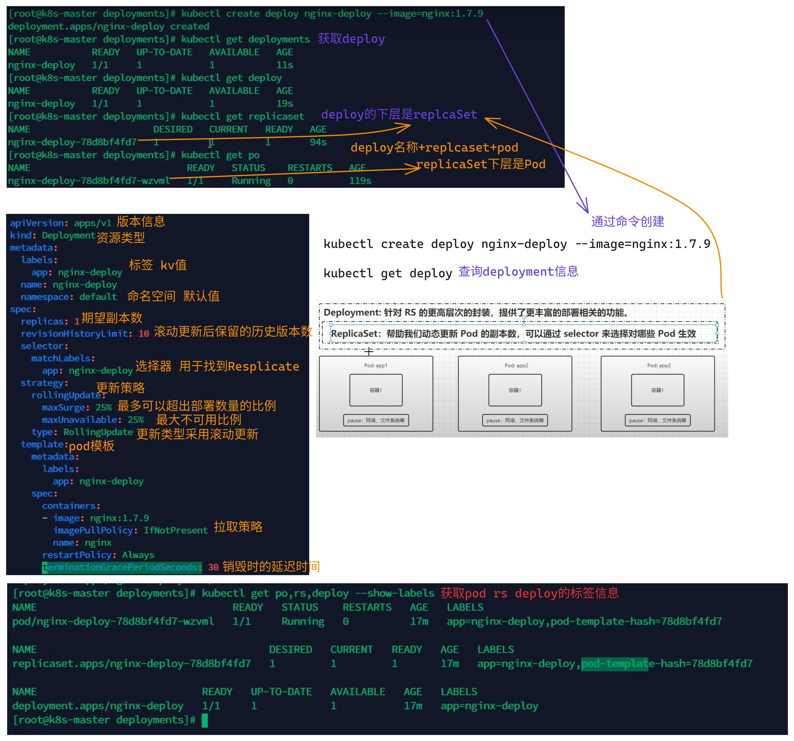

- 滚动升级：先创建一个新的RS，再关闭旧的RS，再创建一个新的，再关掉旧的 


- 回滚：

更新deploy时参数不小心写错，更新状态会被卡住


- 扩容缩容

> - 通过kubectl edit 修改配置文件中的replicate副本数
> - 通过kubectl scalemingling可以进行自动扩容/所用
> - 扩缩容只是直接创建副本数，没有更新pod template，因此不会创建新的rs


- 暂停与恢复

> - 每次对pod template中的信息发生修改后，都会触发更新deployment操作
> - 频繁修改信息，就会产生多次更新，而实际上只需要执行最后一次更新即可，就可以暂停deployment的rollout

通过`kubectl rollout pause deployment  <name>`就可以实现暂停，直到下次恢复后才会继续进行滚动更新

## StatefulSet

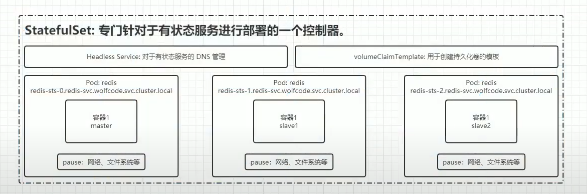

- 创建

- 扩缩容

> 扩容：`kubectl scale statefulset web --replicas=5`
>
> 缩容：`kubectl path statefulset web -p '{"spec":{"replicas":3}}'`
>
> 直接对副本数进行修改

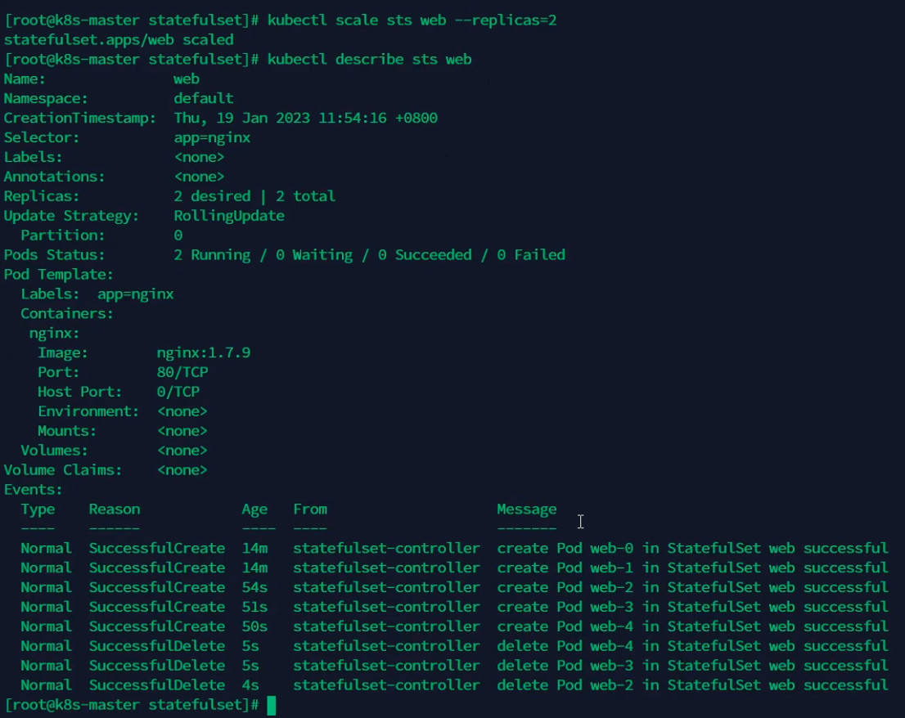

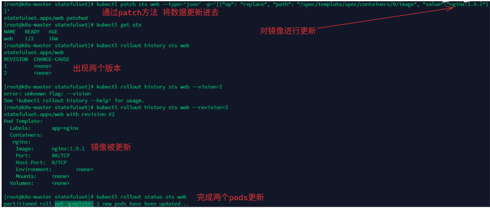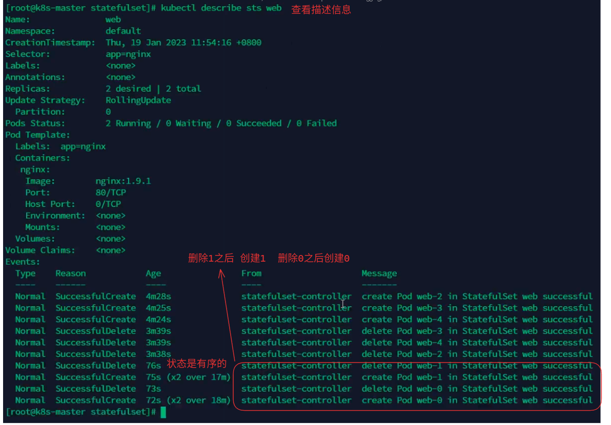

- 镜像更新：

通过patch来间接实现：

RollingUPdate：利用滚动更新chonadepartition属性，可以实现建议的灰度发布的效果

> 如果有5个pod，如果当前partition设置为3,那么此时滚动更新是，只会更新序号大于3的pod
>
> 利用该机制，可以通过控制partition的值，来决定只更新其中一部分pod，确认没有问题后逐渐增大更新的pod数量，最终实现pod全部更新
>
> 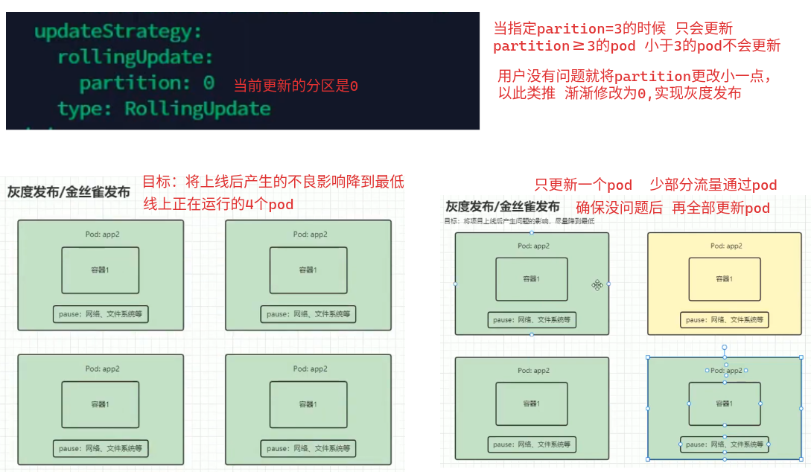

Ondelete：当pod被删除的时候才会进行更新

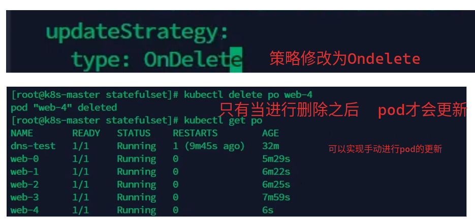

删除：删除statefulset和headless service

- 级联删除：删除statefulSet时会同时删除Pods

  > kubectl delete statefulset web

- 非级联删除：删除statefulset时不会删除pods，删除sts后，pod不会删除

  > kubectl delete sts web --cascade=false

删除service：直接删除 `kubectl delete service nginx`

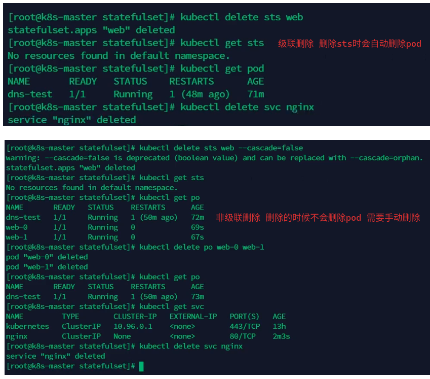

## DaemonSet

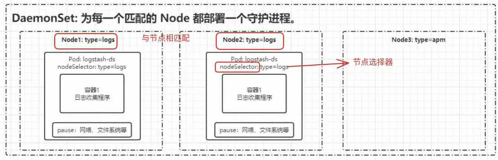


- nodeSelector：只调度到匹配制定label的Node上

  > 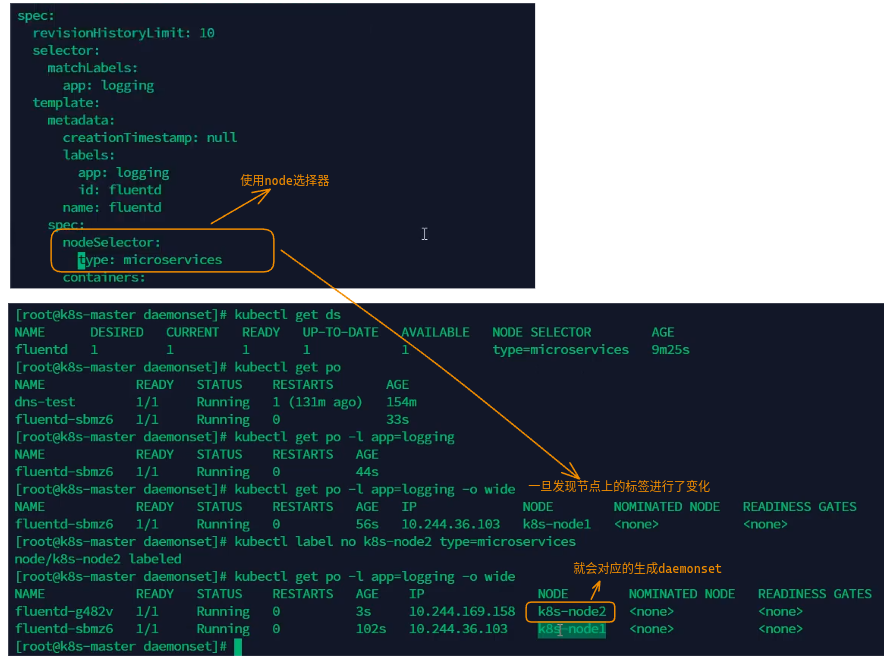

- nodeAffinity：功能更丰富的Node选择器，比如支持集合操作

- podAffinity：调度满足条件的Pod所在的Node上

nodeSelector也支持滚动更新，建议使用Ondelete，避免占用资源过多

## HPA

可以根据CPU使用率或自定义指标（metrics）自动对Pod进行扩缩容

- 控制管理器每隔30s查询一次metrics的资源使用情况
- 支持三种metrics类型
  - 预订以metrics：以利用率的方式计算
  - 自定义Pod metrics，以原始值（raw value）的方式计算
  - 自定义的object metrics
- 支持两种metrics查询方式：Heapster和自定义的REST API
- 支持多metrics

> 实现CPU或内存的监控，首先有个前提条件是该对象必须配置了resources.requests.cpu或resources.requests.memory才可以，可以配置当cpu/memory达到上述配置的百分比后进行扩容或缩容

创建一个HPA：

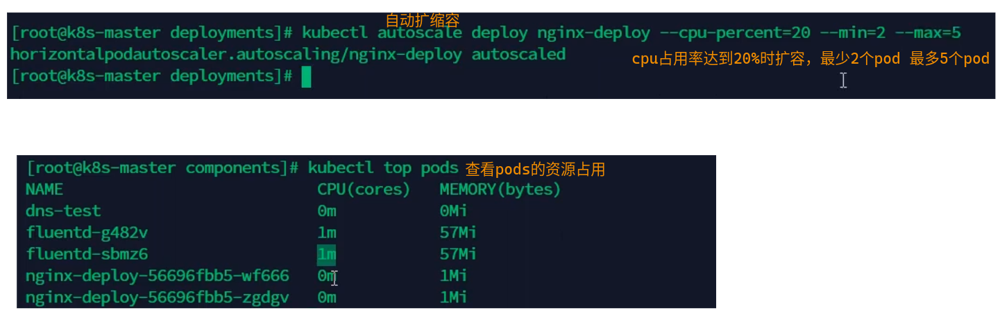

**自定义HPA**:

- 控制管理器开启-horizontal-pod-autoscaler-use-rest-clients
- 控制管理器的-apiserver指向API server Aggregator
- 在API Server Aggregator中注册自定义的metrics API

# 服务发现

service负责东西流量、横向流量，ingress负责南北流量

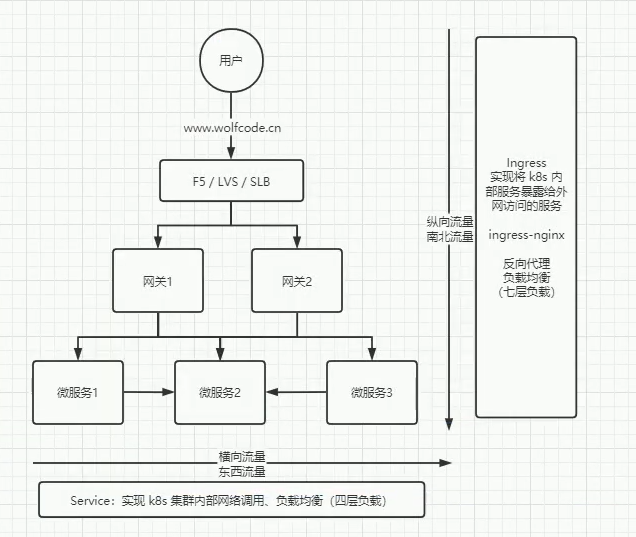

## Services

### 介绍

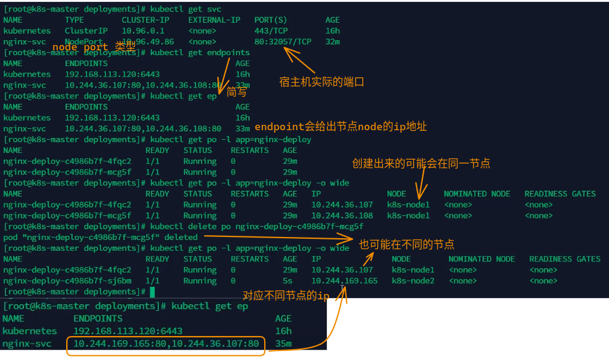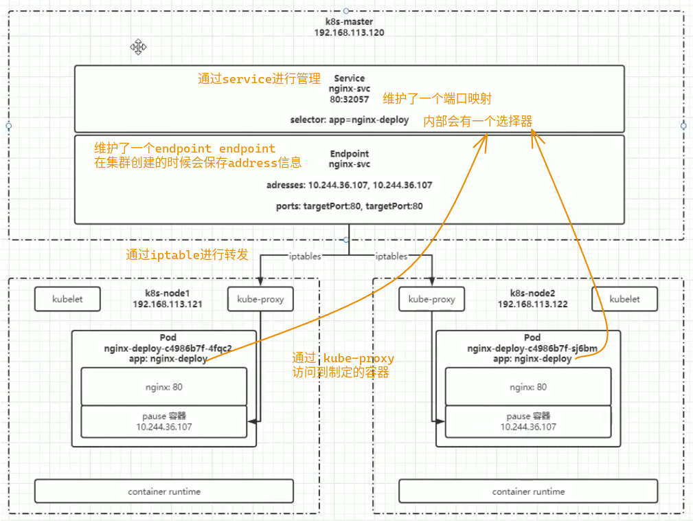

配置信息：


spec.ports[].protocol：端口绑定的协议，支持TCP、UDP、SCTP，默认TCP

命令操作：

```bash
# 创建service
kubectl create -f xxx-svc.yaml

# 查看service信息，通过service的cluster ip 进行访问
kubectl get svc

# 查看pod信息，通过pod 的ip进行访问
kubectl get po -owide

# 创建其他pod通过service name 进行访问（推荐）
kubectl exec -it busyboxy --sh curl http://nginx-svc

# 默认在当前namespace中访问，如果需要跨namespace 访问pod，则在service name后面加上.<namespace>即可
curl http:nginx-svc.default
```

### 访问外部服务

1. 定义一个sevice
2. 定义一个endpoint，并指定外部的ip地址

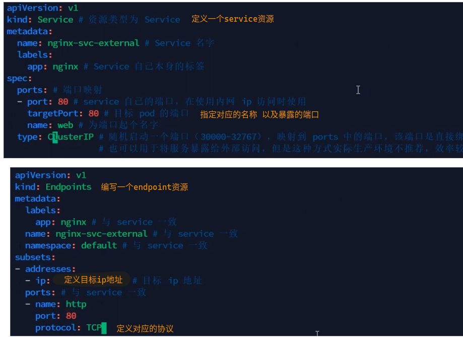

### 代理外部域名

1. 定义service配置文件

   ```yaml
   apiVersion: v1
   kind: Service
   metadata:
     labels:
       app: domain
     name: domain
   spec:
     type: ExternalName
     externalName: www.xxx.com
   
   ```

2. 创建：`kubectl create -f xxx.yaml` 查询`kubectl get svc`

### 配置类型

- CLusterIP：只能在集群内部使用，不配值类型的话默认就是ClusterIP

- ExternalName：返回定义的CNAME别名，可以配置为域名

- NodePort：会在所有安装了kube-proxy的节点都绑定一个端口，此段扣可以代理至对应的POd，集群外部可以使用任意节点ip+NodePort的端口号访问到集群中对应的Pod中的服务

  > 在ports配置中增加nodePort配置制定端口，需要在下方的端口范围内，如果不指定会随机指定端口，端口范围30000～32767
  >
  > 端口范围配置在usr/lib/systemd/system/kube-apiserver.service文件中
  >
  > 生产不建议这样操作

- LoadBalancer：使用云服务商提供的负载均衡服务

## Ingress

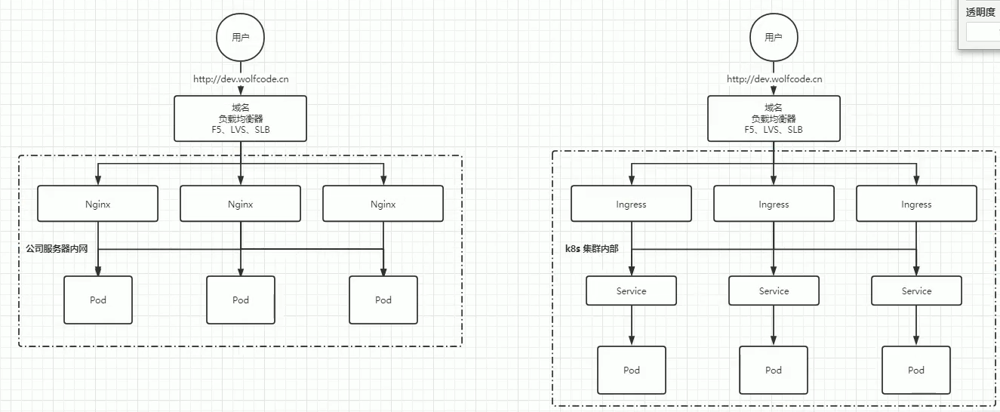

### ingress-nginx安装

https://kubernetes.github.io/ingress-nginx/deploy/

```bash
# 安装helm
curl -fsSL -o get_helm.sh https://raw.githubusercontent.com/helm/helm/main/scripts/get-helm-3
chmod 700 get_helm.sh
./get_helm.sh


# 安装ingress-nginx
helm repo add ingress-nginx https://kubernetes.github.io/ingress-nginx
helm repo list
helm search repo ingress-nginx
helm pull ingress-nginx/ingress-nginx
sudo tar -xf ingress-nginx-4.10.1.tgz

# 修改values.yaml文件
# controller.image.registry修改镜像源以及image、注释digest、digestChroot hash校验
registr: register.cn-hangzhou.aliyuncs.com
image：google_containers/nginx-ingress-controller
# 修改  registry: registry.k8s.io image: ingress-nginx/kube-webhook-certgen 镜像,并注释digest
registry: registry.cn-hangzhou.aliyuncs.com
image: google_containers/kube-webhook-certgen
# 修改   kind: Deployment 为DaemonSet，并在nodeSelector增加属性 ingress: "true"
kind： DaemonSet
ingress: "true"
# 修改hostNetwork为true  、dnsPolicy策略
hostNetwork: true
dnsPolicy: ClusterFirstWithHostNet # 基于主机名
# 修改service中的type由LoadBalancer修改为CLusterIP、有云服务器的时候才用LoadBalancer
type: ClusterI
# 修改admissionWebhooks.enabled为false 表示不需要证书
enabled: false

# 为ingress专门创建一个namespace
kubectl create ns ingress-nginx
# 为需要部署ingress的节点加上标签
kubectl label node <node-name> ingress=true
kubectl label node master ingress=true
# 安装ingress-nginx，从当前目录下找配置文件
helm install ingress-nginx -n ingress-nginx .
kubectl get po -n ingress-nginx
kubectl get po -n ingress-nginx -o wide
```

### ingress-nginx使用

配置文件：

```yaml
apiVersion: networking.k8s.io/v1
kind: Ingress # 资源类型
metadata:
  name: k8s-nginx-ingress
spec:
  ingressClassName: nginx
  rules: # 配置规则 可以配置多个
  - host: www.xx.com # 域名配置，可以配置多个
    http:
      paths: # 相当于nginx的location配置，可以配置多个
      - path: /api # 等价与nginx中location的前缀匹配
        pathType: Prefix
        backend:
          service:
            name: nginx-svc
            port:
              number: 80
```

- pathType:
  - ImplementationSpecific：需要执行IngressClass，具体匹配规则以IngressClass中的规则为准
  - Exact：精确匹配，url需要与path完全匹配上，且区分大小写
  - Prefix：前缀匹配，与`/`作为分 隔符来进行前缀匹配

# 配置与存储

## 配置管理

### ConfigMap

创建：使用`kubectl create cofigmap -h` 查看示例，构建configmap对象

```bash
# 基于文件夹创建，会扫描多个文件
kubectl create configmap my-config --from-file=path/to/bar

# 基于指定的文件
kubectl create configmap my-config --from-file=key1=/path/to/bar/file1.txt
--from-file=key2=/path/to/bar/file2.txt

# 基于key value的形式
kubectl create configmap my-config --from-literal=key1=config1 --from-literal=key2=config2
```

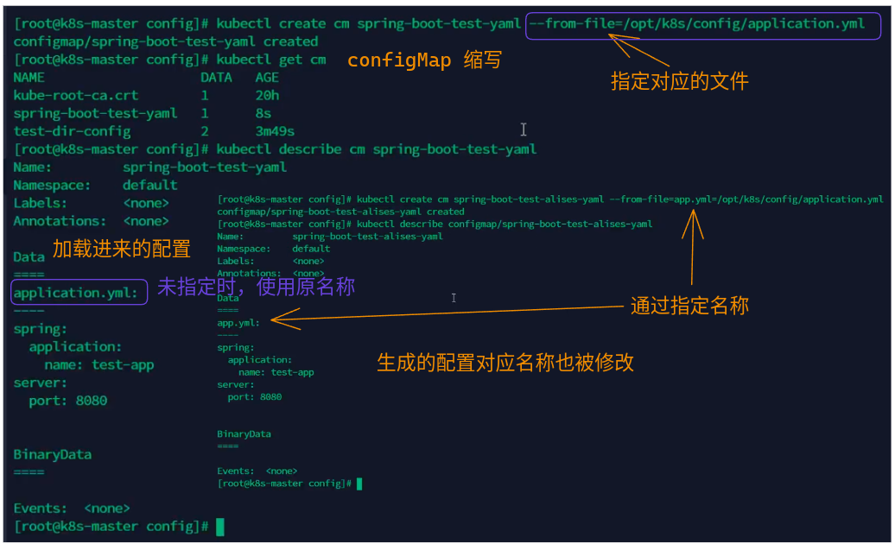

环境变量与配置文件加载：

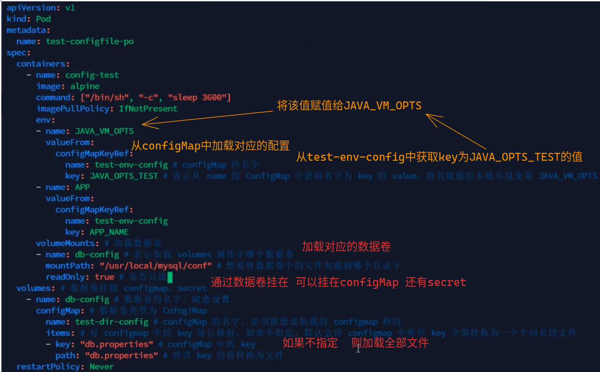

### Secret

基于值的形式创建：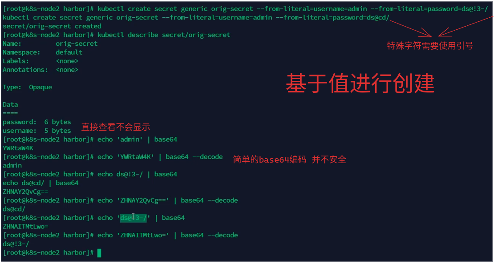

### SubPath

用于解决configmap数据挂在的时候其他文件被覆盖的问题

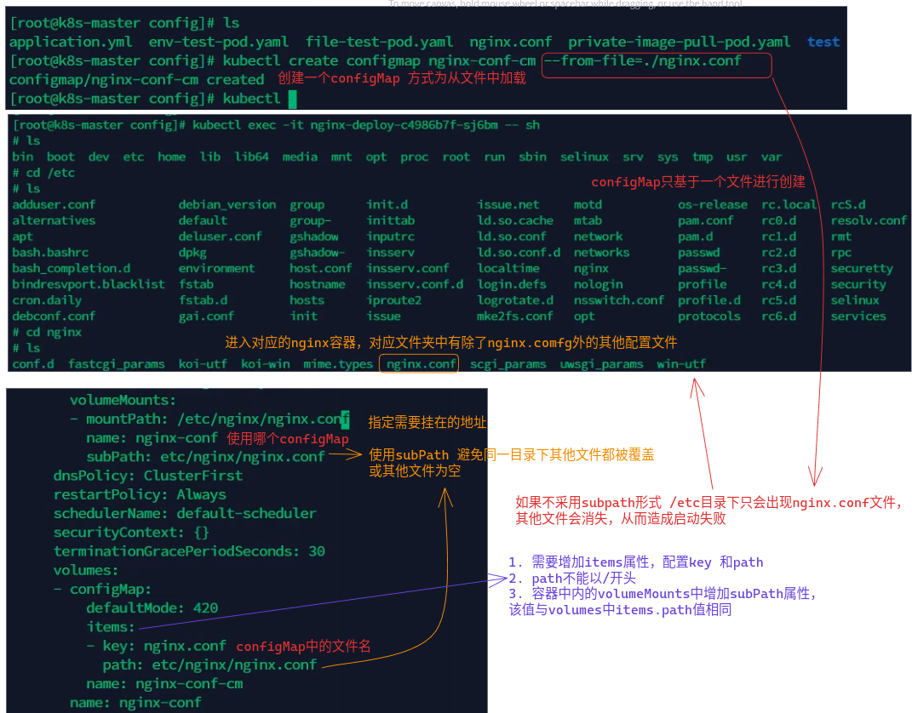

### 配置的热更新

通常会将项目的配置文件作为configmap然后挂在到pod，更新configmap中的配置时：

- 默认：自动更新，更新周期是更新时间+缓存时间

  > 通常十几秒

- subpath：不会更新

  > 可以通过取消subPath的使用，将配置文件挂载到一个不存在的目录，避免目录的覆盖，然后利用软连接的形式，将文件链接到目标位置
  >
  > 如果目标位置原本有文件，无法创建软连接，可以在初始化容器的时候操作执行删除命令，将默认的文件删除即可
  >
  > 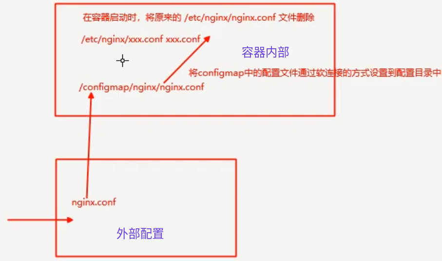

- 变量形式：pod中的一个变量是从configmap或serret中得到，同样不会更新

**直接修改**:

```bash
# 查看对应的configmap，直接进行修改
kubectl get cm
kubectl edit cm <name>
```

**使用replace做替换**:

>  configmap通常是基于文件创建，并不会编写yaml文件，因此修改时直接修改配置文件,而replace没有--from-file参数，因此无法实现基于源配置文件的替换

```bash
kubectl create cm --from-file=<path> --dry-run -o yaml | kubectl replace -f-
```

- `--dry-run`会打印yaml文件，但不会将该文件发送给apiserver，再结合`-o yaml`输出yaml文件就可以得到一个配置好但是没有发给-apiserver的文件，然后结合replace监听控制台输出得到的yaml数据即可实现替换
- `-f-`表示接受控制台的输出作为该命令的输入
- `--dry -run`：会将配置文件打印出来 不会传递给apiserver

### 不可变secret和configmap

对于一些敏感文件，上线后不允许修改，此时在配置configmap时设置`spec.immutable`为` true`来禁止修改，配置与containers同级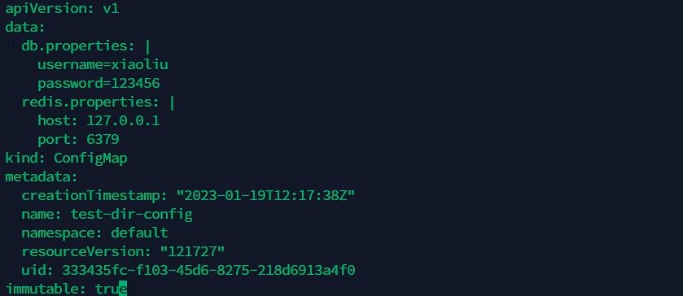

```bash
kubectl edit cm <name>
```

## 持久化存储

### Volumes

- HostPath：将节点上的文件或目录挂在到Pod上，此时目录会变成持久化存储目录，即使Pod被删除后重启，也可以重新加载到该目录，该目录下的文件不会丢失


- EmptyDir：用于一个Pod中不同的COntainer共享数据时使用的，由于只是在Pod内部使用，因此与其他volume比较大的区别是，当Pod如果被删除了，那么emptyDir也会被删除

  > 存储介质可以是任意类型，如SSD、磁盘或网络存储。可以将emptyDir.medium设置为Memory让k8s使用tmpfs（内存支持文件系统），速度比较快，但是重启tmpfs节点时，数据会被清楚，且设置的大小会计入到container的内存限制中
  >
  > 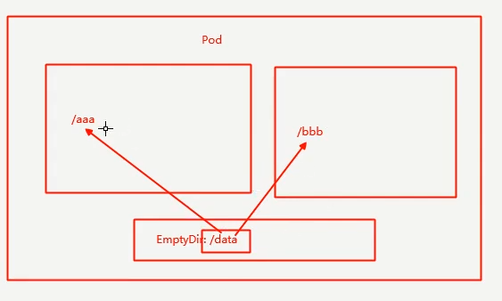


> 存在的意义就是同一个Pod中多个容器共享数据，数据自能做共享，不能持久化

### NFS挂载

nfs卷能将NFS（网络文件系统）挂在到Pod中，不像emptyDir那样会在删除Pod的同时也会被删除，nfs卷的内容在删除Pod时会被保存，卷只是被卸载。这意味着nfs卷可以被预先填充数据，并且这些数据可以在Pod之间共享

> 除了磁盘IO还有网络IO，效率会慢一点

```bash
# 安装nfs
sudo apt update
sudo apt install nfs-common -y
# 挂载
sudo mount -t nfs [NFS服务器的IP或主机名]:/路径/到/共享 /本地/挂载/点
```

```yaml
spec：
  containers:
  - image: nginx
    name: test-container
    volumeMounts:
    - mountPath: /my-nfs-data
      name: test-volume
  volimes:
  - name: test-volume
    nfs:
      server: 192.168.113.121
      path: /home/nfs/rw/www
      readOnly: false
```

### PV与PVC

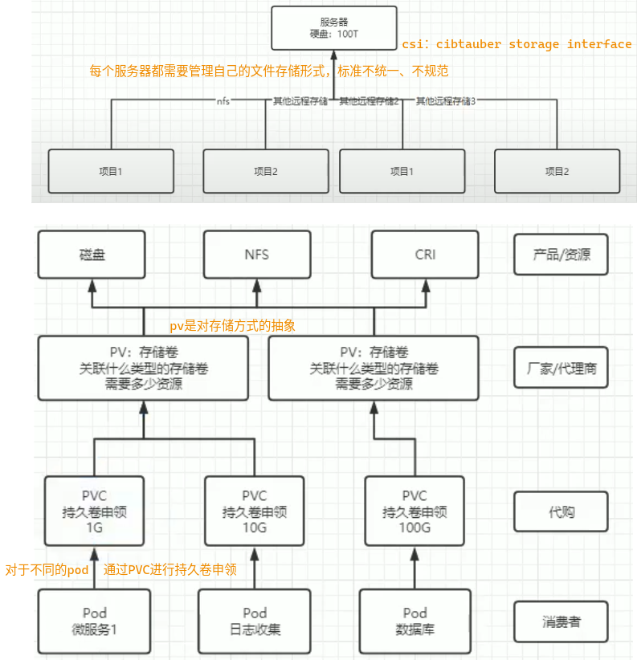

#### 生命周期

**构建:**

- 静态构建：集群管理员创建若干PV卷。这些卷对象带有真实存储的细节信息，并且对集群用户可见。PV卷对象存在与kubernters API中，可供用户消费（使用）

- 动态构建：如果集群中已经有的PV无法满足PVC的需求，那么集群会根据PVC自动构建一个PV，该操作是通过StorageClass实现的。

  > 想要实现这个操作，前提是PVC必须设置StorageClass，否则会无法动态构建该PV，可以通过启用DeafultStorageClass来实现PV的构建

**绑定:**当用户创建一个PVC对象后，主节点会监测信的PVC对象，并且寻找与之匹配的PV卷，找到PV卷后将二者绑定在一起。如果找不到对应的PV，则需要看PVC是否这只StorageClass来决定是否动态创建PV，若没有配置，PVC就会一直处于未绑定状态，知道有与之匹配的PVH欧才会申领绑定关系

**使用:**将PVC当作存储卷来使用，集群会通过PVC找到绑定的PV，并为Pod挂在该卷。Pod一旦使用PVC绑定PV后，为了保护数据，避免数据丢失问题，PV对象会收到保护，在系统中无法被删除

**回收策略:**当不再使用其存储卷时，他们可以从API中将PVC对象删除，从而允许该资源被回收再利用。PersistenVolume对象的挥手策略告诉集群，当其被从申领中释放时如何处理该数据卷。

- Retained(保留)：

  > 可以手动挥手资源，当PersistentVolumeClaim对象被删除是，PersistentVolume卷任然存在，对应的数据卷被视为已释放(released)，由于卷上任然存在前一申领人的数据，该卷不能用于其他申领。管理员可以手动回收该卷：
  >
  > - 删除PersistentVolume对象，与之相关的，位于外部基础设施中的存储资产在PV删除之后任然存在
  > - 根据情况，手动清楚锁关联的存储资产上的数据
  > - 手动删除所有关联的存储资产
  >
  > 如果希望重用该存储资产，可以基于存储资产的定义创建新的PersistentVolume卷对象

- Deleted(删除)：

  > 对于支持Delete挥手策略的卷插件，删除动作会将PersistentVOlume对象从kubernetes中移除，同时也会从外部基础设施中移除所关联的存储资产。同台制备的卷会继承其StorageClass中设置的挥手策略，该策略默认为Delete，管理员需要根据用户的期望来配置StorageClass;否则PV卷被创建之后必须要被编辑或者修补

- Recycled(回收)：

  > 回收策略Recycle已被废弃，取而代之的见识方案是使用动态制备。
  >
  > 如果下层的卷插件支持，挥手策略Recycle会在卷上执行一些基本的擦出（rm -rf /thevolume/*）操作，之后b允许该卷用于新的PVC申领

#### PV

状态：

- Available：空闲，未被绑定
- Bound：已经被PVC绑定
- Released：PVC被删除，资源已挥手，但是PV未被重新使用
- Failed：自动回收失败

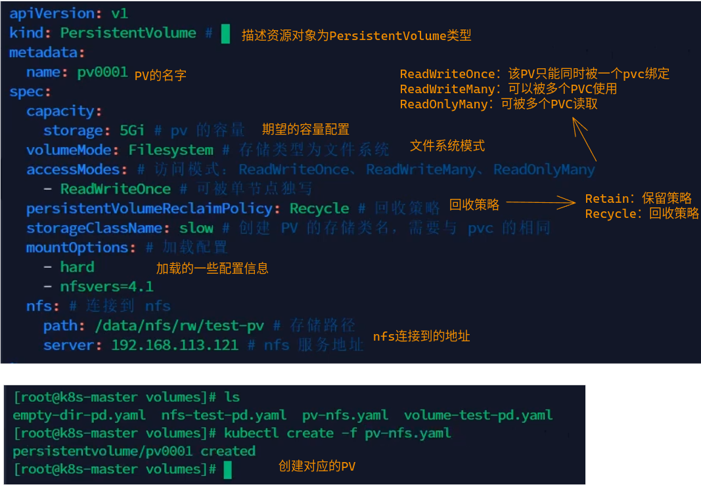

#### PVC

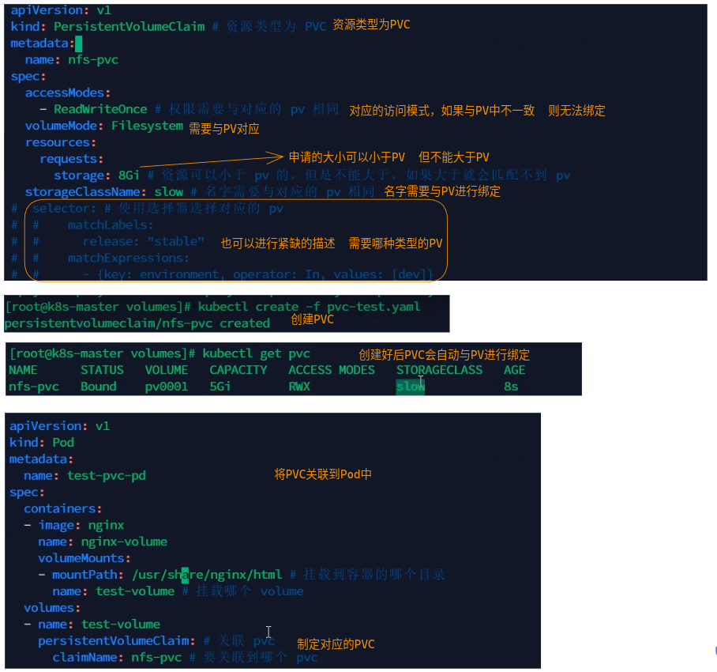

### storageClass

制备器（Provisioner）：每个StorageClass都有一个制备器（Provisioner），用来决定使用哪个卷插件制备PV


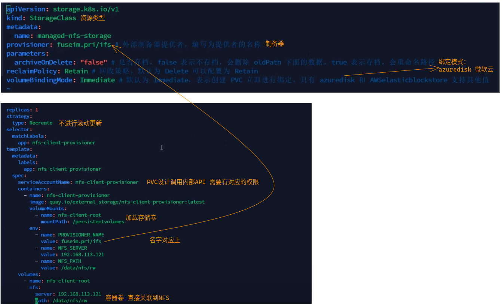

# 高级调度

## CronJob计划任务

在kubernetes中周期性运行计划任务，与linux中的crontab相同

CronJob执行的事件是controller=manager的事件，所以一定要确保controller-manager时间是准确的

 通过命令`kubectl get cribjob`可以查看josb的执行情况

## initC

相对于postStart，initCOntrokker能够保证一定在EntryPonit之前执行，而postStart不能，其次postStart更适合取执行一些命令操作，而initController实际上就是一个容器，可以在其他基础容器环境下执行更复杂的初始化功能。

pod创建的模板中配置init参数：

> 加在template中的spec 不是上层spec

```yaml
spec:
  initContainers:
  - image: nginx
    imagePullPolicy: IfNotPresent
    command: ["sh","-c","echo 'inited;' >> ~/.init"]
    name: init-test
```

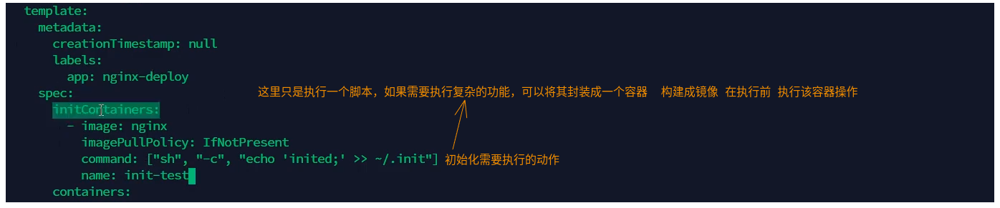

## 污点和容忍

污点：master主节点调度从节点实现对应的任务，更重要的角色，控制中心是主节点，不希望pod部署到主节点，因此主节点被打了污点

容忍：如果某个任务配置了容忍，即容忍某个污点，即使node被打了该类型的污点，也可以在该node上进行部署

通过污点和容忍可以灵活的让某些Pod从某些节点驱逐

配备了特殊硬件的节点：在部分节点配备了特殊硬件的集群中，不希望不需要这些硬件的Pod调度到该特殊节点。

- 如果Pod不能忍受这类污点：Pod会马上被驱逐
- 如果Pod能够忍受这类污点，但是在容忍度定义中没有制定tolerationSeconds，则POd还会一直在这个节点上运行
- 如果Pod能够忍受这类污点，而且制定了tolerationSeconds，则Pod还能在这个节点上继续运行指定的时间长

当某种条件为真时，节点控制器会自动给节点添加一个污点。当前内置的污点包括：

- `node.kubernetes.io/not-ready`：节点未准备好。相当于节点状态Ready的值为False
- `node.kubernetes.io/unreachable`：节点控制器访问不到节点，相当于节点状况Ready的值为`Unknown`
- `node.kubernetes.io/memory-pressure`：节点存在内存压力
- `node.kubernetes.io/disk-pressure`：节点存在磁盘压力
- `node.kubernetes.io/pid-pressure`：节点的PID压力
- `node.kubernetes.io/network-pressure`：节点网络不可用
- `node.kubernetes.io/unscheduable`：节点不可调度
- `node.cloudprovider.kubernetes.io/uninitialized`：如果kubelet启动时制定了一个外部云平台驱动，他将给当前节点添加一个污点将其标志为不可用。在cloud-controller-mannager的一个控制器初始化这个节点后，kubelet将删除这个污点。

在节点被驱逐时，节点控制器或kubelet会添加带有`NoExecute效果的相关污点。如果异常状态恢复正常，kubelet或节点控制器能够移除相关的污点

NoExecute：

- 如果POdbanned接受这类污点，Pod会马上被驱逐
- 如果Pod能够忍受这类污点，但是在容忍读定义中没有制定tolerationSeconds，则Pod还会一直在这个节点上运行。
- 如果Pod能够忍受这类污点，而且制定了toleraionSeconds，则POd还能在这个节点上继续运行这个指定的时间长度。

容忍：

是标注在pod上的，当pod被调度时，如果没有配置容忍，则该pod不会被调度到有污点的节点上，只有pod上标注了满足某个节点的所有污点，则会被调度到这些节点

Equal：比较操作类型为Equal，则意味着必须与污点值做匹配，key/alue都必须相同，才能表示容忍该污点

Exists：容忍与污点的比较只比较ksy，不比较value，不关心value是什么东西，只要key存在，则表示可以容忍

```bash
# 为节点打上污点
kubectl taint node k8s-master key=value:NoSchedule
# 移除污点
kubectl taint node k8s-master key=value:NoSchedule-
# 查看污点
kubectl describe node k8s-master 
```

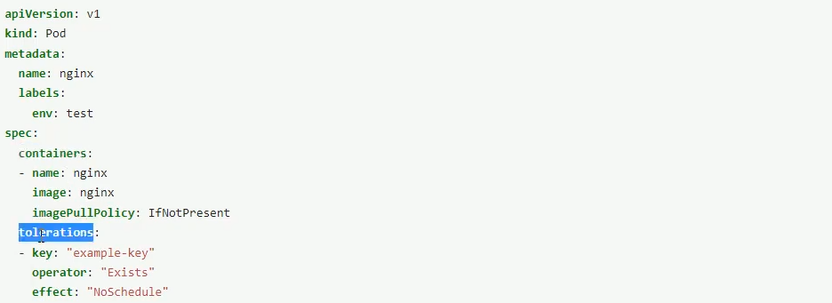

## 亲和力（Affinity）

与污点和容忍相反，可以限制Pod只能在特定的节点上选择，或优先在特定的节点上运行。推荐方法是使用标签选择器来进行选择。通常这样的约束不是必须的，因为调度器自动进行合理的防止。但在某些情况下，你可能需要进一步控制Pod被部署到哪个节点。

**NodeAffinity**

- RequiredDuringSchedulingIgnoredDuringExecution：满足
- PreferredDurringSchedulingIngoredDuringExecution：尽量满足

**PodAffinity**

- RequiredDuringSchedulingIngoreDuringExecution：满足
- PreferredDuringSchedulingIgnoredDuringExecution：尽量满足

**PodAntiAffinity**

- RequiredDuringSchedulingIgnoredDuringExecution：满足
- PreferredDuringSchedulingIgnoredDuringExecution：尽量满足

可以使用pod规约中的`.spec.affinity.nodeAffinity`字段来设置节点亲和性

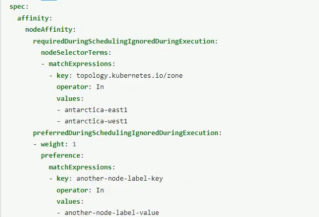

# 身份认证和鉴权

kubernetes集群有两类用户：由kubernetes管理的Service Accounts（服务账户） 和 User Accounts（普通账户）

普通账户是假定被外部或独立服务管理的，由管理员分配keys，用户像使用keystone或google帐号一样，被存储在包含usernames和passwords的list文件里

- 普通账户：在kubernets中不能通过API调用将普通用户添加到集群中
  - 普通账户是针对（人）用户的，服务账户针对Pod进程
  - 普通账户是全局性，在集群所有namespaces中，名称具有唯一性
  - 通常，集群的普通账户可以与企业数据库同步，信的普通账户创建需要特殊权限，服务账户创建目的是更轻量化，允许集群用户为特定任务创建服务账户
  - 普通账户和服务账户的审核注意事项不同
  - 对于复杂系统的配置包，可以包括对该系统的各种组件的服务账户的定义

服务账户（Service Accounts）：

- Service Account Admission Controller

  > 通过Admission Controller插件来实现对pod修改，他是apiserver的一部分。创建或更新pod时会同步进行修改pod
  >
  > 当插件处于激活状态（在大多数发行版本中都默认情况）创建或修改pod时，会按以下操作执行：
  >
  > 1. 如果pod没有设置ServiceAccount，则将ServiceAccount设置为default
  > 2. 确保pod医用ServiceAccount存在，否则将会拒绝请求
  > 3. 如果pod不包含任何imagePullSecrets，则将ServiceAccount的ImagePullSecrets会添加到pod中
  > 4. 将包含API访问的TOken的pod添加了一个volume
  > 5. 把volumeSourcetianjin到安装在pod的每个容器中，挂在在/var/run/secrets/kubenetes.io/serviceaccount

- Token Controller

  > 

- Service Account Controller

  > Service Account COntroller在namespaces里管理ServiceAccount，并确保每个有效的namespaces中都存在一个名为default的ServiceAccount

# 集群监控

## 介绍

Prometheus：一套开源的监控系统、报警、事件序列的集合

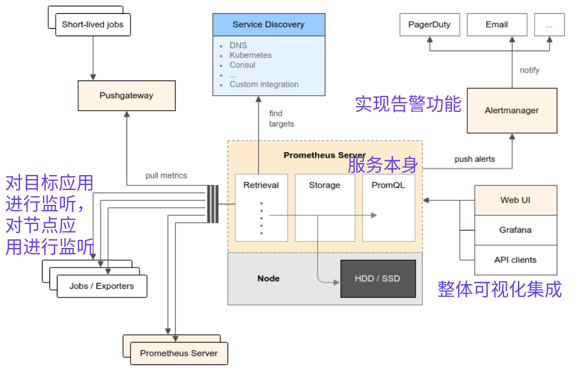

## kube-prometheus

- 检查kubernetes的版本号对应的版本，https://github.com/prometheus-operator/kube-prometheus

```bash
# 下载制定版本
sudo wget https://github.com/prometheus-operator/kube-prometheus/archive/refs/tags/v0.13.0.zip
sudo unzip v0.13.0.zip 

# 创建对应的资源，文件内容过长 apply出现兼容问题
kubectl apply -f manifests/setup 
kubectl delete -f manifests/setup
kubectl create -f manifests/setup 
# 创建mainfests资源
kubectl apply -f manifests
kubectl get all -n monitoring

# 获取服务信息，关注alertmanager-main以及prometheus-k8s、grafana
kbectl get svc -n monitoring
```

- 在manifests目录下添加prometheus-ingress.yaml配置文件

```bash
# 将域名添加到主机下方
sudo vim /etc/hosts
sudo vim manifests/prometheus-ingress.yaml
```

```yaml
apiVersion: networking.k8s.io/v1
kind: Ingress
metadata:
  namespace: monitoring
  name: prometheus-ingress
spec:
  ingressClassName: nginx
  rules:
  - host: grafana.hsiangya.com
    http:
      paths:
      - path: /
        pathType: Prefix
        backend:
          service:
            name: grafana
            port:
              number: 3000
  - host: prometheus.hsiangya.com
    http:
      paths:
      - path: /
        pathType: Prefix
        backend:
          service:
            name: prometheus-k8s
            port:
              number: 9090
  - host: alertmanager.hsiangya.com
    http:
      paths:
      - path: /
        pathType: Prefix
        backend:
          service:
            name: alertmanager-main
            port:
              number: 9093
```

- 卸载

```bash
kubectl delete --ignore-not-found=true -f manifests/ -f manifests/setup
```


