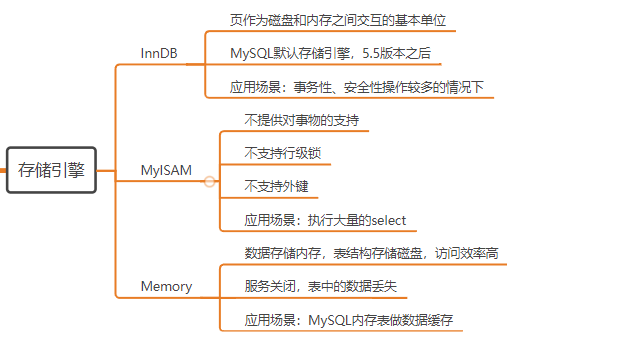
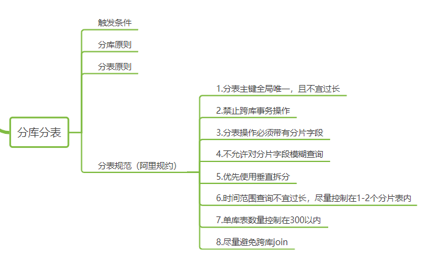
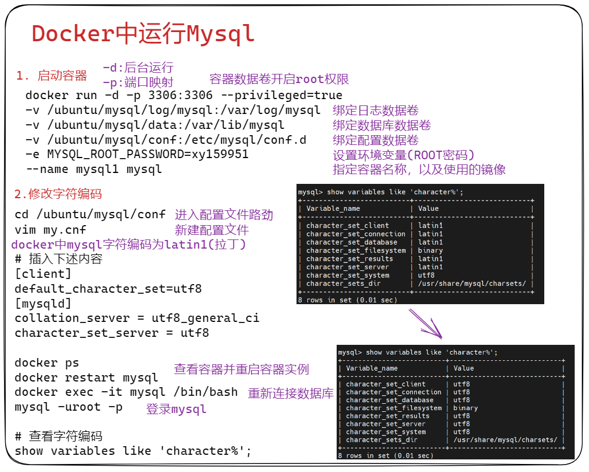
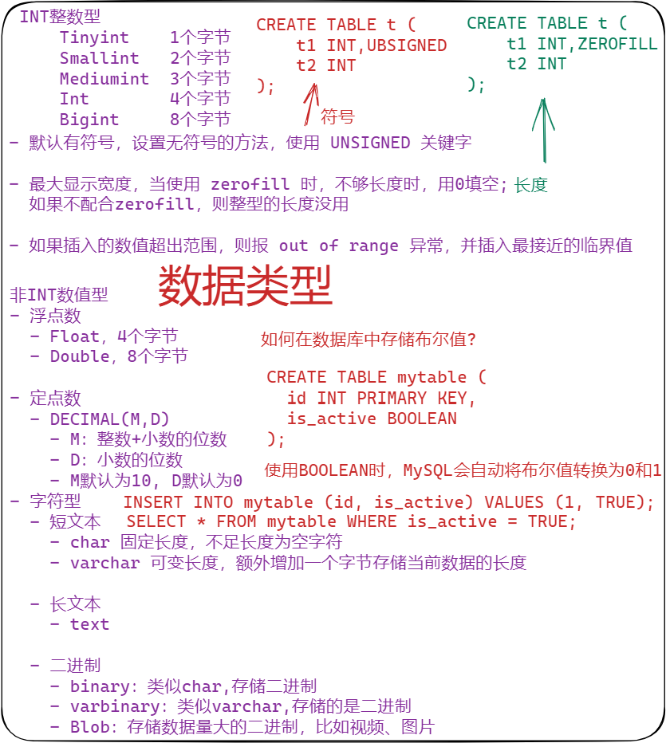
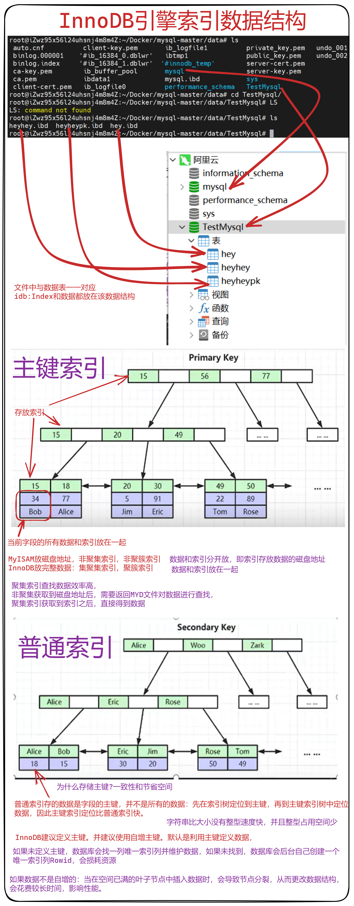
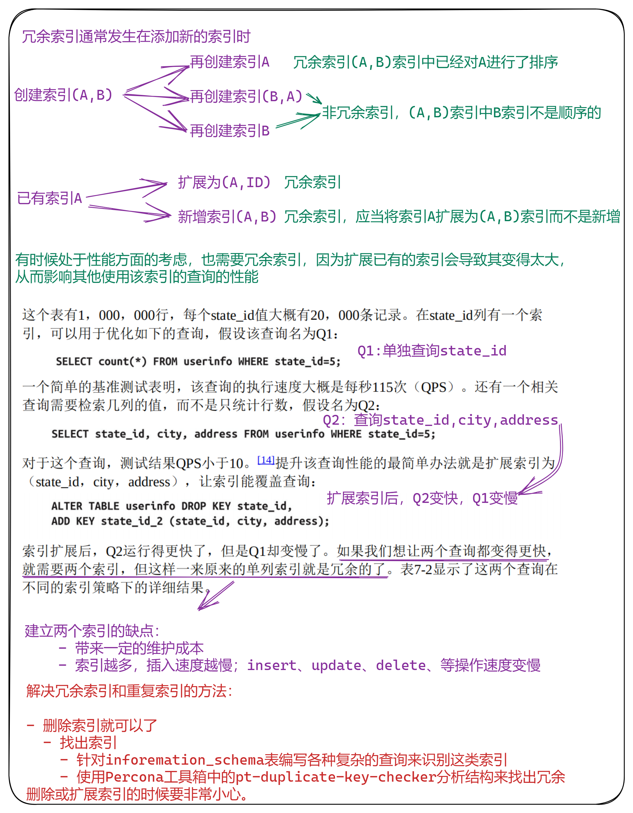
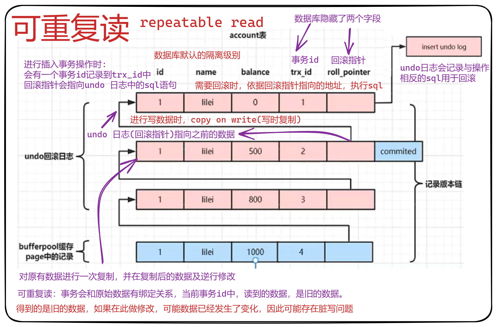

# 安装

## 知识点







## 用户管理

在MySQL的默认数据库 `mysql` 中的 `user` 表中存储着所有的账户信息（含账户、权限等）。

### 创建用户

```sql
-- 查看用户信息
show databases;
select user,authentication_string,host from  mysql.user;

-- 创建用户与密码
create user hsiangya@127.0.0.1 identified by 'xy159951';
-- 创建用户
drop user hsiangya@127.0.0.1;

-- 百分号为可以匹配任意值
create user hsiangya@'127.0.0.%' identified by 'root123';
drop user hsiangya@'127.0.0.%';

-- 任意ip地址可以访问
create user hsiangya@'%' identified by 'xy159951';

-- 删除用户
drop user hsiangya@'%';

-- 特殊字符需要加''，没有特殊字符可以不加
create user 'hsiangya'@'%' identified by 'root123';
drop user 'hsiangya'@'%';
```

### 修改用户

```sql
-- 格式
rename user '用户名'@'IP地址' to '新用户名'@'IP地址';

-- 修改用户
rename user hsiangya@127.0.0.1 to hsiangya@localhost;
rename user 'hsiangya'@'127.0.0.1' to 'hsiangya'@'localhost';

-- 修改密码
set password for '用户名'@'IP地址' = Password('新密码')；
set password for 'hsiangya'@'%' = Password('123123');
```

### 授权

```sql
-- 格式
grant 权限 on 数据库.表 to '用户'@'IP地址';

-- 授予所有权限
grant all privileges on *.* TO 'hsiangya'@'%'; 

-- 授予指定数据库的所有权限
grant all privileges on 数据库.* TO 'hsiangya'@'localhost';

-- 授予指定数据表的所有权限
grant all privileges on 数据库.表 TO 'hsiangya'@'localhost'; 

-- 授予指定标的查询权限
grant select on 数据库.表 TO 'hsiangya'@'localhost';         

-- 授予指定标的查询与插入权限
grant select,insert on 数据库.表 TO 'hsiangya'@'localhost'; 

-- 授予指定库所有权限，任意IP地址
grant all privileges on 数据库.* to 'hsiangya'@'%';

-- 将数据读取到内存中，从而立即生效。
flush privileges;   
```

## 运行单机Mysql

**不推荐在docker中使用Mysql**

```bash
docker run -d -p 3306:3306 --privileged=true -v /ubuntu/mysql/log/mysql:/var/log/mysql -v /ubuntu/mysql/data:/var/lib/mysql -v /ubuntu/mysql/conf:/etc/mysql/conf.d -e MYSQL_ROOT_PASSWORD=xy159951 --name mysql1 mysql
```



```bash
# 进入配置文件路劲
cd /ubuntu/mysql/conf

# 新建配置文件
vim my.cnf
# 插入下述内容
[client]
default_character_set=utf8
[mysqld]
collation_server = utf8_general_ci
character_set_server = utf8

# 查看容器并重启容器实例
docker ps
docker restart mysql

# 重新连接数据库
docker exec -it mysql /bin/bash

# 登录mysql
mysql -uroot -p

# 查看字符编码
show variables like 'character%';
```

# 数据类型

## 数据类型综合表

| 数据类型  | 大小(字节) | 用途             | 格式                     |
| --------- | ---------- | ---------------- | ------------------------ |
| TINYINT   | 1          | 整数             | 默认有符号，设置UNSIGNED |
| SMALLINT  | 2          | 整数             | 参数后，表示无符号整数   |
| MEDIUMINT | 3          | 整数             | MEDIUMINT,UNSIGNED       |
| INT       | 4          | 整数             | INT,UNSIGNED             |
| BIGINT    | 8          | 整数             |                          |
| FLOAT     | 4          | 单精度浮点数     |                          |
| DOUBLE    | 8          | 双精度浮点数     |                          |
| ENUM      | --         | 单选,比如性别    | ENUM('a','b','c')        |
| SET       | --         | 多选             | SET('1','2','3')         |
| DATE      | 3          | 日期             | YYYY-MM-DD               |
| TIME      | 3          | 时间点或持续时间 | HH:MM:SS                 |
| YEAR      | 1          | 年份值           | YYYY                     |
| CHAR      | 0~255      | 定长字符串       |                          |
| VARCHAR   | 0~255      | 变长字符串       |                          |
| TEXT      | 0~65535    | 长文本数据       |                          |



## 五大约束类型

| 类型        | 说明   |
| ----------- | ------ |
| PRIMARY KEY | 主键   |
| DEFAULT     | 默认值 |
| UNIQUE      | 唯一   |
| FOREIGN KEY | 外键   |
| NOT NULL    | 非空   |

## 列级约束与表级约束

- 列级约束：约束语法都不报错，但是外键约束没有效果

- 表级约束：支持主键约束，外键约束，唯一约束

  ```mysql
  CREATE TABLE 表名(
      字段名 字段类型 列级约束
      字段名 字段类型
      CONSTRAINT 表级约束名 表级约束类型(字段名)
  )
  
  ```

- 列级约束例子

  ```mysql
  CREATE TABLE stuinfo (
      id      INT         PRIMARY KEY,                     # 主键约束
      stuName VARCHAR(20) NOT NULL,                        # 非空约束
      gender  CHAR(1)     DEFAULT 'm',                     # 默认约束
      seat    INT         UNIQUE,                          # 唯一约束
      major   INT         FOREIGN KEY REFERENCES major(id) # 外键约束，但是没有效果
  );
  
  ```

- 表级约束例子

  ```mysql
  CREATE TABLE stuinfo (
      id      INT         
      stuName VARCHAR(20) NOT NULL,                        # 非空约束
      gender  CHAR(1)     DEFAULT 'm',                     # 默认约束
      seat    INT,         
      major   INT,         
      
      CONSTRAINT pk PRIMARY KEY(id), # 主键约束
      CONSTRAINT uq UNIQUE(seat),    # 唯一约束
      CONSTRAINT fk_stuinfo_major FOREIGN KEY(majorid) REFERENCES major(id) # 外键约束
  );
  
  ```

## 主键约束和唯一约束的区别

| 约束类型 | 保证唯一性 | 是否允许为空 | 允许多少个 | 是否允许组合 |
| -------- | ---------- | ------------ | ---------- | ------------ |
| 主键     | 保证       | 不允许       | 最多1个    | 允许         |
| 唯一     | 保证       | 允许         | 可以多个   | 允许         |

## 外键使用注意事项

- 外键关联的必须是Key，一般是 主键/唯一键
- 插入数据时，先插入主表，再插入从表
- 删除数据时，先删除从表，再删除主表

## 高级插入

replace into 跟 insert 功能类似，不同点在于：replace into 首先尝试插入数据到表中，

1. 如果发现表中已经有此行数据（根据主键或者唯一索引判断）则先删除此行数据，然后插入新的数据。
2. 否则，直接插入新数据。
   要注意的是：插入数据的表必须有主键或者是唯一索引！否则的话，replace into 会直接插入数据，这将导致表中出现重复的数据。

```sql
-- 插入或替换
REPLACE INTO students (id, class_id, name, gender, score) VALUES (1, 1, '小明', 'F', 99);
若id=1的记录不存在，REPLACE语句将插入新记录，否则，当前id=1的记录将被删除，然后再插入新记录。
-- 插入或更新
INSERT INTO students (id, class_id, name, gender, score) VALUES (1, 1, '小明', 'F', 99) ON DUPLICATE KEY UPDATE name='小明', gender='F', score=99;
-- 插入或忽略
INSERT IGNORE INTO students (id, class_id, name, gender, score) VALUES (1, 1, '小明', 'F', 99);

```


# SQL语句

## 数据库操作

```sql
-- 创建并设置默认字符集为utf8,mb4是为了兼容emoij字形
CREATE DATABASE IF NOT EXISTS 库名 CHARACTER SET 'utf8mb4';

-- 删除数据库
DROP DATABASE IF EXISTS 库名;

-- 更改库的字符集
ALTER DATABASE 库名 CHARACTER SET gbk;

-- 使用数据库
use 数据库名;

-- 查看数据库
show databases;

-- 查看当前使用的数据库
select database();

-- 查看当前数据库中的表
show tables;
```

## 数据表操作

### 增

```sql
CREATE TABLE 表名 (
    字段名 字段类型【(长度)】【约束】,
    字段名 字段类型【(长度)】【约束】,
    ...
    字段名 字段类型【(长度)】【约束】,
    字段名 字段类型【(长度)】【约束】
);

-- 新建一张学生表，primary key auto_increment表示主键
create table students
(
    id      int primary key auto_increment,
    name    char(50),
    math    int,
    chinese int,
    english int,
    total   int
);

-- 末尾添加字段
ALTER TABLE 表名 ADD  <新字段名> <数据类型> [约束条件];

-- 开头添加新字段
ALTER TABLE 表名 ADD  <新字段名> <数据类型> [约束条件] FIRST;

-- 在指定字段后添加新字段
ALTER TABLE 表名 ADD <新字段名> <数据类型> [约束条件] AFTER <字段>;
```

### 删

```sql
-- 删除数据表
DROP TABLE IF EXISTS 表名;

-- 删除字段
ALTER TABLE 表名 DROP COLUMN 字段名;

-- 清空表数据
TRUNCATE TABLE 表名;
```

### 改

```sql
-- 修改字段类型与约束
ALTER TABLE 表名 MODIFY COLUMN 字段名 类型【(长度)】【约束】;

-- 修改字段名称以及类型与约束
ALTER TABLE 表名字 CHANGE 原列名 新列名 数据类型 约束;

-- 修改表名称
ALTER TABLE 表名 RENAME TO 新表名;
```

### 查

```sql
-- 查看表结构
desc 表名;

-- 查看表内所有数据
select * from 表名;

-- 查询字段包括：表的字段，常量值，表达式，函数，查询的结果是一个虚拟的表
SELECT 查询字段 FROM 表名;
```

## 字段增删改

### 增

- 如果想设置空值，可以用NULL表示
- 字段列表和字段值列表必须一一对应
- 字段列表的顺序可以和表定义顺序不同
- 可以省略某些字段

```sql
-- 插入一条数据
INSERT INTO 表名(字段列表) VALUE(字段值列表);

-- 插入多条数据
INSERT INTO 表名(字段列表) VALUES(字段值列表),(字段值列表),(字段值列表),(字段值列表);
```

### 删

- DELETE FROM 是删除表中某些行数据，TRUNCATE TABLE是清空整张表
- DELETE FROM删除后，自增字段不重置；TRUNCATE TABLE清空后，自增字段重置为1
- DELETE FROM 可以回滚，TRUNCATE TABLE 不能回滚

```sql
-- 删除数据，如删除张三数据
DELETE FROM 表名 WHERE 筛选条件;
delete from students where name="张三"

-- 清空表数据
TRUNCATE TABLE 表名;
```

### 改

```sql
-- 修改字段，如修改张三数据为张三三
UPDATE 表名 SET 字段名=值,字段名=值 WHERE 筛选条件;
update students set name="张三三" where name="张三"
```

## 查

### SELECT

```sql
-- 查询字段包括：表的字段，常量值，表达式，函数，查询的结果是一个虚拟的表
SELECT 查询字段 FROM 表名;

-- 查询整个数据表
select * from students;

-- 查询name字段
SELECT name FROM 表名;

-- 查询表中name，salary，age字段
SELECT name, salary, age FROM 表名;

-- 查询结果去重，distinct表示去重
SELECT DISTINCT department_id FROM employees;

-- 字段起别名
-- 方式一
SELECT name AS 姓 FROM employees;
-- 方式二
SELECT name 姓 FROM employees;
-- 特殊符号
SELECT last_name AS "OUT#PUT" FROM employees;
```

### WHERE子句

```sql
SELECT 查询列表 
FROM 表名
WHERE 条件表达式;

-- 比较运算符号
> < >= <= = !=(<>) 

-- 逻辑运算符
&&  ||  !
AND OR NOT
```

### 模糊查询

### 模糊查询关键字

| 模糊查询语句      | 注意事项                                                     |
| ----------------- | ------------------------------------------------------------ |
| LIKE              | 与通配符配合使用                                             |
| BETWEEN  x  AND y | 包含边界，等价于 >= x && <= y                                |
| IN                | IN ( 待选列表 )，待选列表中的元素类型要相同                  |
| IS NULL           | 不能用 = 判断是否是 NULL，只能用 IS 判断是否是 NULL，仅可以判断 NULL |

```sql
-- 通配符
% ：任意多个字符，包含0个
_ ：任意1个字符

-- 转义通配符
\_
\%

-- 匹配name字段中包含 张 的数据
select * from 表名 where name LIKE '%张%';

-- 匹配name字段中含有张三 李四的数据
select * from 表名 where name in ('张三'，'李四');
```

### 排序查询

```sql
-- DESC：降序，ASC:升序，默认为 ASC
SELECT * FROM 表名 ORDER BY salary DESC; 

-- 多重排序
-- 先按 salary 进行升序排序，保证满足前提条件的情况下，按 employee_id 进行降序排序
SELECT *FROM 表名 ORDER BY salary ASC, employee_id DESC;
```

### 分组查询

#### GROUP BY 子句

```sql
SELECT
FROM
WHERE
GROUP BY 
ORDER BY

-- 分组查询brand_name字段,并统计每个组的数量,每个组的平均价格,并保留两位小数
select brand_name
,count(*) as total 
,round(avg(price),2) as avg_price from goods group by brand_name;
```

#### HAVING （过滤）子句

```sql
SELECT
FROM
WHERE
GROUP BY
HAVING
ORDER BY


```

### 常用函数

#### 分组函数

- SUM：忽略 NULL
- AVG：忽略 NULL
- MAX：忽略 NULL
- MIN：忽略 NULL
- COUNT：忽略 NULL
- 注意事项
  - sum avg 可以处理数值
  - max，min，count可以处理任何类型
  - 分组函数都忽略 NULL
  - 可以和 distinct 配合实现去重
  - COUNT(*) ：统计行数，只要有不含 NULL 的，都算一行
  - COUNT(1)：统计行数，只要有不含 NULL 的，都算一行 
  - 和分组函数一同查询的字段要求是 group by 后的字段

#### 数学函数

- ROUND

```sql
SELECT ROUND(4.56); // 5
SELECT ROUND(-1.56) // -2
SELECT ROUND(-1.567, 2) // -1.57 

```

- CELL

```sql
SELECT CELL(1.0001) // 2
SELECT CELL(-1.02)  // -1
SELECT CELL(1.00)   // 1

```

- FLOOR

```sql
SELECT FLOOR(1.0001) // 1
SELECT FLOOR(-9.8)   //-10

```

- TRUNCATE

```sql
SELECT TRUNCATE(1.699999,1);  // 1.6

```

#### 日期函数

- NOW

```sql
SELECT NOW();

```

- CURDATE

```sql
SELECT CURDATE();

```

- CURTIME

```sql
SELECT CURTIME();

```

- YEAR

```sql
SELECT YEAR(NOW());
SELECT YEAR("2018-9-14 08:23:57");

```

> MONTH，DAY，HOUR，MINUTE，SECOND 同上

- STR_TO_DATE

```sql
STR_TO_DATE("9-13-1999", "%m-%-%y")

%y 18 %Y 2018
%m 08 %c 8
%d 08
%H 24小时制
%h 12小时制
%i 35
%s 05

```

- DATE_FORMAT

```sql
DATE_FORMAT("2018/6/6","%Y年%m月%d日")

```

## 高级查询

### 分类

- 内连接
  - 等值连接
  - 非等值连接
  - 自连接
- 外连接
  - 左外连接
  - 右外连接
  - 全外连接
- 交叉连接：就是笛卡尔积

### 语法

```sql
SELECT 查询列表
FROM 表1 AS 别名
连接类型 表2 AS 别名
ON 连接条件
WHERE
GROUP BY
HAVING
ORDER BY

连接类型
内连接：INNER JOIN，可以省略 INNER
左外连接：LEFT JOIN
右外连接：RIGHT JOIN
全外连接：FULL JOIN
交叉连接：CROSS JOIN
```

**例子**

```sql
SELECT last_name, department_name
FROM employees AS e
INNER JOIN department AS d
ON e.department_id = d.department_id;

```

### 分页查询

LIMIT的使用

- 放在全部SQL语句最后

- LIMIT 开始索引，条目个数

- 如果开始索引是0，则可以省略


### 分页通用写法

```sql
SELECT 查询列表
FROM 表
LIMIT (页码-1) * 每页条目个数, 每页条目个数;
```

### 联合查询

- 将多条查询语句的结果集合并为一个结果集
- 关键字：UNION

**例如**

```sql
SELECT * FROM employees WHERE email LIKE '%a%'
UNION
SELECT * FROM employees WHERE department_id > 90;

```

**注意事项**

- 要求多条查询语句的查询结果列数相同
- UNION关键字默认去重，如果不想去重则 UNION ALL可以包含重复项

## 流程控制语句

- IF

```sql
SELECT IF(10<5,'大','小')


```

- CASE

```sql
CASE (要判断的表达式，有就是switch，否则是 if-else)
WHEN 常量1 THEN 语句1
WHEN 常量2 THEN 语句2
...
ELSE 语句x
END


```

## 其他函数

- IFNULL函数

```sql
-- IFNULL(exp1, exp2)
-- exp1：将要进行判断的字段
-- exp2：替换的字段
-- 如果 exp1 为 NULL，则返回替换的字段

SELECT IFNULL(commission_pct, 0) AS "奖金率", commission_pct
FROM employees;


```

### 分组函数

- SUM：忽略 NULL
- AVG：忽略 NULL
- MAX：忽略 NULL
- MIN：忽略 NULL
- COUNT：忽略 NULL
- 注意事项
  - sum avg 可以处理数值
  - max，min，count可以处理任何类型
  - 分组函数都忽略 NULL
  - 可以和 distinct 配合实现去重
  - COUNT(*) ：统计行数，只要有不含 NULL 的，都算一行
  - COUNT(1)：统计行数，只要有不含 NULL 的，都算一行 
  - 和分组函数一同查询的字段要求是 group by 后的字段


## EXPLAIN

EXPLAIN关键字可以模拟优化器执行SQL语句，从而直到MySQL是如何处理你的SQL语句，分析查询语句或是结构的性能瓶颈。

- `EXPLAIN SQL查询语句`
- `EXPLAIN EXTENDED SQL`：额外提供一些查询优化的信息，可以接着使用`show warnings`命令得到优化后的查询语句，额外会有filtered列。
- `EXPLAIN PARTITIONS SQL `：如果是基于分区表的话，会显示查询将访问的分区，多了一个partitions字段


## 数据导出导入

```sql
# mysql命令导入
mysql -u 用户名 -p 密码 < /home/abc/源.sql

# source命令导入
source /home/abc/源.sql

# mysqldump导出
mysqldump -u 用户名 -p 密码 数据库名 表名 > 导出文件路径

# select ... into outfile命令导出
SELECT * 
FROM 表名
INTO OUTFILE 导出文件路径
```

# 高级操作

本节实验中我们将学习并实践数据库的其他基本操作：索引、视图，导入和导出，备份和恢复等。

这些概念对于数据库管理员而言都非常重要，请仔细理解并完成所有实验操作。

作为基础篇，不会涉及到关于索引和视图的高级应用和核心概念，但是基本操作大家会了解，尤其是关于索引的内容，学会建立恰当的索引可以大大提高数据库的查询效率，更高级的应用我们会在进阶篇详细讲解。

**知识点**

- 索引
- 视图
- 导入和导出
- 备份和恢复


**准备** 

> 注：进入本节进行学习的，请先删除上一节建立的数据库`python`，删除语句为`DROP DATABASE python;`。

在开始之前,将`sql资料` 文件夹下的 `advanced_operation.sql` 拷贝到桌面

代码会搭建好一个名为 `python` 的数据库(有三张表：department，employee，project)，并向其中插入数据。

输入命令开启 `MySQL` 服务并登录：

```bash
#打开 MySQL 服务
sudo service mysql start

#使用 root 用户登录
mysql -u root

```

 `advanced_operation.sql` 和 `in.txt`，其中第一个文件用于创建数据库并向其中插入数据，第二个文件用于测试数据导入功能。

如果你是接着上一个实验操作的话，首先把 `python` 数据库删掉：

```sql
drop database python;

```

输入命令运行第一个文件，搭建数据库并插入数据：

```sql
source /home/ubuntu/Desktop/advanced_operation.sql
```

## 索引

索引是一种与表有关的结构，它的作用相当于书的目录，可以根据目录中的页码快速找到所需的内容。

当表中有大量记录时，若要对表进行查询，没有索引的情况是全表搜索：将所有记录一一取出，和查询条件进行一一对比，然后返回满足条件的记录。这样做会消耗大量数据库系统时间，并造成大量磁盘 I/O 操作。

而如果在表中已建立索引，在索引中找到符合查询条件的索引值，通过索引值就可以快速找到表中的数据，可以**大大加快查询速度**。

对一张表中的某个列建立索引，有以下两种语句格式：

```sql
ALTER TABLE 表名字 ADD INDEX 索引名 (列名);
CREATE INDEX 索引名 ON 表名字 (列名);
```

我们用这两种语句分别建立索引：

```sql
ALTER TABLE employee ADD INDEX idx_id (id);  #在employee表的id列上建立名为idx_id的索引
CREATE INDEX idx_name ON employee (name);   #在employee表的name列上建立名为idx_name的索引
```

索引的效果是加快查询速度，当表中数据不够多的时候是感受不出它的效果的。这里我们使用命令 **SHOW INDEX FROM 表名字;** 查看刚才新建的索引：


在使用 SELECT 语句查询的时候，语句中 WHERE 里面的条件，会**自动判断有没有可用的索引**。

比如有一个用户表，它拥有用户名( `username` )和个人签名( `note` )两个字段。其中用户名具有唯一性，并且格式具有较强的限制，我们给用户名加上一个唯一索引；个性签名格式多变，而且允许不同用户使用重复的签名，不加任何索引。

这时候，如果你要查找某一用户，使用语句 `select * from user where username=?` 和 `select * from user where note=?` 性能是有很大差距的，对 **建立了索引的用户名** 进行条件查询会比 **没有索引的个性签名** 条件查询快几倍，在数据量大的时候，这个差距只会更大。

一些字段不适合创建索引，比如性别，这个字段存在大量的重复记录无法享受索引带来的速度加成，甚至会拖累数据库，导致数据冗余和额外的 CPU 开销。

## 视图

视图是从一个或多个表中导出来的表，是一种 **虚拟存在的表** 。它就像一个窗口，通过这个窗口可以看到系统专门提供的数据，这样，用户可以不用看到整个数据库中的数据，而只关心对自己有用的数据。

注意理解视图是虚拟的表：

- 数据库中只存放了视图的定义，而没有存放视图中的数据，这些数据存放在原来的表中；
- 使用视图查询数据时，数据库系统会从原来的表中取出对应的数据；
- 视图中的数据依赖于原来表中的数据，一旦表中数据发生改变，显示在视图中的数据也会发生改变；
- 在使用视图的时候，可以把它当作一张表。

创建视图的语句格式为：

```sql
CREATE VIEW 视图名(列a,列b,列c) AS SELECT 列1,列2,列3 FROM 表名字;
```

可见创建视图的语句，后半句是一个 SELECT 查询语句，所以**视图也可以建立在多张表上**，只需在 SELECT 语句中使用**子查询**或**连接查询**，这些在之前的实验已经进行过。

现在我们创建一个简单的视图，名为 **v_emp**，包含**v_name**，**v_age**，**v_phone**三个列：

```sql
CREATE VIEW v_emp (v_name,v_age,v_phone) AS SELECT name,age,phone FROM employee;
```

## 备份

数据库中的数据十分重要，出于安全性考虑，在数据库的使用中，应该注意使用备份功能。

> 备份与导出的区别：导出的文件只是保存数据库中的数据；而备份，则是把数据库的结构，包括数据、约束、索引、视图等全部另存为一个文件。

`mysqldump` 是 `MySQL` 用于备份数据库的实用程序。它主要产生一个 `SQL` 脚本文件，其中包含从头重新创建数据库所必需的命令 CREATE TABLE INSERT 等。

使用 `mysqldump` 备份的语句：

```
mysqldump -u root 数据库名>备份文件名;   #备份整个数据库

mysqldump -u root 数据库名 表名字>备份文件名;  #备份整个表


```

> mysqldump 是一个备份工具，因此该命令是在终端中执行的，而不是在 mysql 交互环境下

我们尝试备份整个数据库 `python`，将备份文件命名为 `bak.sql`，先 `Ctrl+D` 退出 MySQL 控制台，再打开 Xfce 终端，在终端中输入命令：

```
cd /home/ubuntu/
mysqldump -u root python > bak.sql;

```

使用命令 “ls” 可见已经生成备份文件 `bak.sql`：


> 你可以用 gedit 查看备份文件的内容，可以看见里面不仅保存了数据，还有所备份的数据库的其他信息。

## 恢复

用备份文件恢复数据库，其实我们早就使用过了。在本次实验的开始，我们使用过这样一条命令：

```
source /home/ubuntu/Desktop/advanced_operation.sql

```

这就是一条恢复语句，它把 advanced_operation-06.sql 文件中保存的`python` 数据库恢复。

还有另一种方式恢复数据库，但是在这之前我们先使用命令新建一个**空的数据库 test**：

```
mysql -u root -p         #因为在上一步已经退出了MySQL，现在需要重新登录

CREATE DATABASE test;  #新建一个名为test的数据库

```

再次 **Ctrl+D** 退出 MySQL，然后输入语句进行恢复，把刚才备份的 **bak.sql** 恢复到 **test**数据库：

```
mysql -u root test < bak.sql

```

我们输入命令查看 test 数据库的表，便可验证是否恢复成功：

```
mysql -u root -p          #因为在上一步已经退出了MySQL，现在需要重新登录

use test               #连接数据库test

SHOW TABLES;           #查看test数据库的表

```

可以看见原数据库的4张表和1个视图，现在已经恢复到 test 数据库中：


再查看 employee 表的恢复情况：


实验总结
在本实验中，我们实践了下面几个基本概念：

1. 索引：可以加快查询速度
2. 视图：是一种虚拟存在的表
3. 导入：从文件中导入数据到表
4. 导出：从表中导出到文件中
5. 备份：`mysqldump` 备份数据库到文件
6. 恢复：从文件恢复数据库

我们将学习 MySQL 服务安装及命令使用 。


# 索引

索引是帮助MySQL高效获取数据的排好序的数据结构

## 索引基础

### B树与B+树


### InnoDB索引数据结构



一个表只能有一个聚簇索引，因为无法将数据同时放到两个表中

优点：

- 可以把相互关联的数据保存在一起
- 数据访问更快
- 使用覆盖索引扫描的查询可以直接使用页节点中的主键值

缺点：

- 聚簇索引数据最大限度提高了I/O密集型应用的性能，但如果数据全部放在内存中，则访问的顺序就没那么虫咬了，聚簇索引也就没什么优势了。
- 插入速度严重依赖插入顺序，按照主键的吮乳插入行是最快的方式。
- 更新聚簇索引列的代价很高，会强制每个被更新的行移动到新的位置
- 基于聚簇索引的表在插入新行，或者主键被更新导致需要移动行的时候，可能棉铃页分裂的问题
- 聚簇索引可能导致全表扫描变慢，尤其是行比较系数，或由于页分页导致数据存储不连续的时候
- 二级索引比想象中的要更大，因为叶子节点引用了行的主键列
- 耳机索引需要两次索引查找，而不是一次

对于InnoDB,自适应哈希索引能够减少二次索引这样的重复工作，是数据库自动执行的。

聚簇索引的每一个叶子节点都包含了主键值、事务ID、用于事务和MVCC的回滚指针，以及所有的剩余列

对于高并发的工作负载，在InnoDB中按主键舒徐插入，可能会造成明显的写入竞争，主键的上界为成为热点。所以并发插入可能导致间隙锁竞争。

### MyISAM索引数据结构


### 联合索引数据结构


### 全文索引

FULLTEXT是一种特殊类型的索引，查找的是文本中的关键词，而不是直接比较索引中的值。全文索引和其他几类索引的匹配方式完全不一样。

在相同列上同时创建全文索引和基于值的索引并不会有冲突，全文索引适用于MATCH AGAINST操作，而不是普通的where条件操作

### 优点与限制

**B树的限制：**

- 如果不是按照索引的最左列开始查找，则无法使用索引
- 不能跳过索引中的列，只能按顺序从左往右
- 查询中某列有范围查询，则其右边所有列都无法使用索引优化查找

优化性能的时候，可能需要使用相同的列但顺序不同的索引来满足不同类型的查询需求

**使用索引的优点:**

- 大大减少了服务器需要扫描的数据量
- 可以帮助服务器避免排序和临时表
- 将随机I/O变为顺序I/O

## 索引策略

### 前缀索引和索引的选择性

- 概述：前缀索引的索引选择性(不重复的索引值/记录的总数)接近完整列的索引选择性。
- 优点：使索引更小、更快
- 缺点：无法使用ORDER BY和GROUP BY，也无法使用亲啊追索引做覆盖扫描
- 场景：针对很长的十六进制唯一ID使用前缀索引


### 多列索引

- OR条件的联合
- AND条件的相交(intersection)
- 前两种情况的联合及相交

何时需要使用多列索引：

- 优化器需要对多个索引做相交操作时(一个或多个AND条件)
- 优化器需要对多个索引做联合操作时(一个或多个OR)
- UNION改写查询，往往是最好的办法

如果在EXPLAN看到有索引合并，那么就应该好好检查一下查询语句的写法和表结构，看是不是已经是最优的。也可以通过参数optimizer_switch来关闭索引合并功能，话可以使用IGNORE INDEX语法让优化器强制忽略掉某些索引，从而避免优化器使用包含索引合并的执行计划。

**如何选择索引顺序：**

- 不需要考虑排序和分组时，将选择性最高的列放在前面通常是很好的。
- 避免大量随机I/O和排序


### 覆盖索引

如果一个索引包含(或者说覆盖)所有需要查询的字段的值，我们就称之为覆盖索引。只有B-tree索引可以用于覆盖索引

- 索引条目通常远小于数据行大小，所以只需要读取索引
- 因为索引时按照列值的顺序存储，所以I/O密集型的范围查询会比随机从磁盘读取一行数据的I/O要少的多
- 由于聚簇索引的特点，覆盖索引对InnoDB表特别有用。

执行一个被索引覆盖的查询，EXPLAIN的Exra列可以看到Using index的信息。

### 使用索引扫描来排序

mysql有两种方式可以生成有序结果：

- 通过排序操作

- 按索引顺序扫描

  > EXPLAIN输出的type结果为index（不要与Extra的Using index混淆）

注意：索引不能覆盖查询所需的全部列，就需要回表查询，这种状态下比顺序扫描全表都慢。

设计索引时应尽可能同时满足**排序，又用于查找行**

- 索引的顺序和ORDER BY子句的顺序完全一致，所有列的排序方向都一样时，Mysql才能使用索引来对结果做排序
- 如果需要链接多张表，ORDER BY子句中引用的字段全部在第一表中时，才能使用索引做排序
- ORDER BY子句和查找型查询的限制一样：需要满足索引的最左前缀要求。

**特殊情况:**

如果前导列为常量的时候，ORDER BY 子句中的列也可以不满足索引的最左前缀要求，如果在where子句或者join子句中将这些列指定为了常量，就可以填补索引字段的间隙了。

使用索引做排序的另一个最重要的场景是，查询语句中同时有order by和 limit子句的情况

### 冗余和重复索引

mysql允许在相同列上创建多个相同的索引



### 未使用的索引

除了冗余索引和重复索引，可能还会有一些服务器永远不用的索引。这样的索引完全是累赘，建议删除。

使用系统数据库performance_schema和sys。在sys数据库中，在table_io_waits_summary_by_index_usage视图中可以非常简单地直到哪些索引从来没有被使用过：

```sql
SELECT * FROM sys.schema_unused_indexes;
```

## 维护索引和表

即使使用正确地数据类型创建了表并加上了合适地索引，工作页没有结束，还需要维护表和索引来确保他们都能正常工作。维护表有三个主要目的：

- 找到并修复损坏地表
- 维护准确地索引统计信息
- 减少碎片

### 找到并修复损坏地表

损坏的索引会导致查询返回错误的结果或者出现莫须有的主键冲突等问题，严重时甚至还会导致数据库的崩溃。可以使用`CHECK TABLE`来检查是否发生了表损坏（有些引擎不支持改命令）。

- 如果引擎不是innodb，先切换引擎`ALTER TABLE <table> ENGINE=INNODB;`，再使用`REPAIR TABLE;`修复损坏的表。
- 将数据再导入一次(如果损坏的是系统区域、表的行数据，该方法无效，这种情况可以从悲愤中回复表，或尝试从损坏的数据文件中尽可能地回复数据)
- 通过设置innodb_force_recovery参数进入InnoDB地强制回复模式来修复数据。

### 更新索引统计信息

如果存储引擎想优化器提供地扫描行数信息不准确，或者执行计划本身太复杂以致无法准确地获取各个阶段匹配地行数，那么优化器会使用索引统计信息来估算扫描行数。

- 运行`ANALYZE TABLE`来重新生成统计信息
- `SHOW INDEX FROM`查看索引地基数
- `INFORMATION_SCHEMA.STATISTICS`表可以查询到这些信息

InnoDB会在表首次打开，或者执行`ANALYZE TABLE`，或者表地大小发生非常大的变化时计算索引的统计信息。

InnoDB再打开某些INFORMATION_SCHEMA表，或者使用SHOW TABLE STATUS和SHOW INDEX，或者在MySQL客户端开启自动补全功能的时候，会触发索引统计信息的更新。

只要使用SHOWINDEX查看索引统计信息，就一定会触发统计信息的更新。可以关闭innodb_stats_on_metadata参数来避免上面提到的问题。

### 减少索引和数据的碎片

B树索引可能会产生碎片化，这回降低查询的效率。碎片化的所i你可能会以很差或者无序的方式存储在磁盘上。

根据设计，B-tree索引需要随机磁盘访问才能定位到叶子页，所以随机访问总是不可避免的。然而，如果叶子页在物理分布上是顺序且紧密的，那么查询的性能就会更好。否则，对于范围查询、索引覆盖扫描等操作来说，速度可能会降低很多；对于索引覆盖扫描，这一点会表现得更加明显。

表的数据存储也可能发生碎片化。然而，数据存储的碎片化比索引更加复杂。有三种类型的数据碎片：

- 行碎片

  这种碎片指的时数据行被存储在多个地方的多个片段中。即使查询只从索引中访问一行记录，行碎片也会导致性能下降。

- 行间碎片

  行间碎片是指逻辑上顺序的页或者行，在粗攀上不是顺序存储的。行间碎片对诸如全表扫描和聚簇索引扫描之类的操作有很大的影响，因为这些操作原本能够从磁盘上顺序存储的数据中获益。

- 剩余空间碎片

  生育空间碎片是指数据页中有大量的空余空间。这回导致服务器读取大量不需要的数据，从而造成浪费。

可以通过执行OPTIMIZE TABLE或者到处再导入的方式来重新整理数据。着对多数据存储引擎都是有效的

对于不支持OPTIMIZE TABLE的存储引擎，只需要通过`ALTER TABLE <table> ENGINE=<engie>;`

# 调优

## 核心理念

- 选择合适的引擎
- 平衡范式与冗余：为提高效率可以牺牲范式设计，冗余数据
- 最大化利用索引：尽量避免全表扫描，减少无效数据的查询
- 不在数据库做计算：CPU计算移至业务层
- 拒绝3B(big)：大sql,大事物，大批量

## 基本原则

- 减少数据访问：合理设置字段类型，启用压缩，通过索引访问等减少磁盘IO；
- 返回更少的数据：只返回需要的字段和数据分页处理，减少磁盘IO及网络IO
- 减少交互次数：批量DML操作，函数存储等减少数据库连接次数
- 减少服务器CPU开销：尽量减少数据库排序操作及全表查询，减少CPU内存占用;
- 利用更多资源：使用表分区，可以增加并行操作，更大限度利用CPU资源

## 字段类优化

- 用好数值类型：
  - 字符转为数字：ip用int存储而非char
  - 优先使用enum或set:
- 避免使用null字段
  - null字段很难查询优化
  - null字段的索引需要额外空间
  - null字段的复合索引无效

## 索引原则

- 选择唯一索引：唯一性索引的值是唯一的，可以更快速的通过该索引来确定某条记录
- 为经常需要排序、分组和联合操作的字段建立索引。
- 为常用作为查询条件的字段建立索引
- 限制索引的数目：索引越多，会使表更新变慢，如果索引的值很长，尽量使用前缀来索引。
- 删除不使用或很少使用的索引
- 最左前缀匹配原则
- 尽量选择区分度高的列作为索引，区分度的公式是表示字段不重复的比例
- 索引列不能参与计算，要保持干净，带函数的查询不参与索引
- 尽量的扩展索引，不新建索引

## 索引类优化

- 谨慎合理使用索引
- 改善查询、减慢更新
- 索引不一定越多越好
- 覆盖记录 条数过多不适合建索引，例如性别
- 字符字段必须建前缀索引
- 不在索引做列运算
- innodb主键合理使用自增列，主键建立聚簇索引，主键不应该被修改
- 不用外键，用程序保证约束(数据库层面)

## sql类优化

- sql语句尽可能简单
- 一条sql只能在一个cpu运算
- 大语句拆小语句，减少锁时间
- 一条大sql可以堵死整个库
- 简单的事务
- 事务时间尽可能短

## 调优方法

- 通过慢查询找到sql语句
- MsSQL提供了explain命令来查看语句的执行计划
- 可以通过其中和索引有关的信息来分析是否明总了索引

# 事物

## 事物

通过执行SET TRANSACTION ISOLATION LEVEL命令来设置隔离级别；

在事务中混合使用事务表和非事务表（例如，InnoDB和MyISAM表），如果一切顺利，事务将正常工作。如果需要回滚，则无法撤销对非事务表的更改。

### AUTOCOMMIT

默认情况下，单个INSERT、UPDATE或DELETE语句会被隐式包装在一个事务中并在执行成功后立即提交，这称为自动提交（AUTOCOMMIT）模式。通过禁用此模式，可以在事务中执行一系列语句，并在结束时执行COMMIT提交事务或ROLLBACK回滚事务。

通过SET命令设置AUTOCOMMIT，启用可以设置为1或者ON，禁用可以设置为0或者OFF。

- 禁用：当前连接处于一个事物中；直到发出COMMIT或者ROLLBACK，然后MySQL会即启动一个新的事务。

- 启用：可以使用关键字BEGIN或者

  START TRANSACTION来开始一个多语句的事务

### 事物日志

事务日志有助于提高事务的效率。存储引擎只需要更改内存中的数据副本；而不用每次修改磁盘中的表，这会非常快。然后再把更改的记录写入事务日志中，事务日志会被持久化保存在硬盘上。因为事务日志采用的是追加写操作，是在硬盘中一小块区域内的顺序I/O，而不是需要写多个地方的随机I/O，所以写入事务日志是一种相对较快的操作。

### ACID

- atomicity原子性

  一个事物必须是为一个不可分割的单元，整个事务中的所有操作要么全部提交成功，要么全部失败回滚。对于一个事务来说，不可能只执行其中的一部分操作

  > undo log是实现原子性的关键

- consistency 一致性

  数据库总是从一个一致性状态转换到下一个一致性状态，如果事务最终没有提交，该事务所做的任何修改都不会被保存到数据库中。

- isolation 隔离性

  一个事务所做的修改在最终提交以前，对其他事务是不可见的，这就是隔离性带来的结果。

  > 利用MVCC控制机制

- durability 持久性

  一旦提交，事务所做的修改就会被永久保存到数据库中。此时即使系统崩溃，数据也不会丢失。

  > redo log保证持久性
  >
  > 数据修改时：
  >
  > - 在内存中进行修改的同时，还会在redo log中记录该操作
  > - 事物提交时，redo log 日志进行刷盘
  > - 数据库宕机重启时，将redo log中的内容恢复到数据库中，再依据undo log和bin log内容决定回滚数据还是提交数据

## 隔离级别

### 概念

- READ UNCOMMITTED（未提交读）

  在READ UNCOMMITTED级别，在事务中可以查看其他事务中还没有提交的修改。

- READ COMMITTED（提交读）

  一个事务可以看到其他事务在它开始之后提交的修改，但在该事务提交之前，其所做的任何修改对其他事务都是不可见的；这意味着同一事务中两次执行相同语句，可能会看到不同的数据结果

- REPEATABLE READ（可重复读）

  在同一个事务中多次读取相同行数据的结果是一样的；通过多版本并发控制（MVCC，Multiversion Concurrency Control）解决了幻读的问题；REPEATABLE READ是MySQL默认的事务隔离级别。

  > undo log版本链 +Read View机制实现
  >
  > - 执行操作前，修改的数据会记录到undo日志，用于混滚
  > - undo日志：数据基本信息、日志开始位置、结束位置、主键长度、表id、日志编号、日志类型

- SERIALIZABLE（可串行化）

  SERIALIZABLE是最高的隔离级别。该级别通过强制事务按序执行，使不同事务之间不可能产生冲突，从而解决了前面说的幻读问题。

## 并发控制

### 读写锁

处理并发读/写访问的系统通常实现一个由两种锁类型组成的锁系统。这两种锁通常被称为共享锁（shared lock）和排他锁（exclusive lock），也叫读锁（read lock）和写锁（write lock）。

- 共享锁（shared lock）：读锁是共享的，多个客户端可以同时读取同一个资源而互不干扰。
- 排他锁（exclusive lock）：写锁则是排他的，一个写锁既会阻塞读锁也会阻塞其他的写锁。

### 锁的粒度

每种MySQL存储引擎都可以实现自己的锁策略和锁粒度。写锁队列和读锁队列是分开的，但写锁队列的优先级绝对高于读队列；

- 表锁（table lock）：锁定整个表

  MySQL中最基本也是开销最小的锁策略。只有没有人执行写操作时，其他读取的客户端才能获得读锁，读锁之间不会相互阻塞。

- 行级锁（row lock）：锁定整行

  行级锁（row lock）可以最大程度地支持并发处理（也带来了最大的锁开销）；行级锁是在存储引擎而不是服务器中实现的。

  > - 悲观锁（Pessimistic Locking）：通过for update实现
  >
  >   修改或读取数据时，进行锁定，其他数据无法访问该数据，
  >
  > - 乐观锁（Optimistic Locking）：通过版本号实现
  >
  >   修改或读取数据时，记下该数据版本号，提交前查询数据库中的版本号与当前是否一致，不一致则放弃或重新执行当前事务

- 间隙锁：

  事务执行范围查询时，会将满足条件的范围之间设置间隙锁，防止其他事务在该范围内插入新数据。

  锁只会对索引上的间隙进行加锁，而不会对实际的数据行进行加锁。这样可以允许其他事务在间隙之内插入新数据行，但会阻止其他事务插入和范围查询重叠的数据行。

### 死锁活锁

- 循环引用死锁：

  InnoDB存储引擎，检测到循环依赖后会立即返回一个错误信息。InnoDB目前处理死锁的方式是将持有最少行级排他锁的事务回滚（这是一种最容易回滚的近似算法

- 死锁：一次性封锁法、顺序封锁法，实现规定顺序

  - 一次性封锁法：多个线程同时请求多个资源，但请求的顺序不一致，从而导致死锁。
  - 顺序封锁法：多个线程按照固定的顺序请求资源，但其中一个线程持有了一个资源并且等待另一个资源，而另一个资源又被其他线程持有，导致死锁。

  > 如何避免死锁？
  >
  > - 以固定的顺序访问表和行
  > - 大事务拆小事物
  > - 尽可能依次锁定所有资源，减少死锁概率
  > - 允许条件下降低隔离级别
  > - 添加合理的索引
  > - Innodb提供了wait-for graph算法来主动进行死锁检测，Innodb目前处理死锁的方法就是将持有最少行级排他锁的事务进行回滚。这也是相对比较简单的死锁回滚方式。

- 活锁：使用优先级队列，先来一直获取不到锁

  使用优先级队列时，较低优先级的线程无法获取锁，而较高优先级的线程不断地插入新的任务，导致较低优先级的线程一直无法获得锁。

### 显示锁与隐式锁

在事务执行期间，随时都可以获取锁，但锁只有在提交或回滚后才会释放，并且所有的锁会同时释放

### MVCC

实现了非阻塞的读操作，写操作也只锁定必要的行

- 使用数据在某个时间的快照来实现
- 事物启动时，分配一个事物ID
- 事物修改数据时，向undo日志写入回滚语句



- 所有的Undo日志也都会写入redo日志，undo日志是写入时服务器崩溃恢复过程中的一部分

# 日志文件

- Binary Log：它记录了所有对数据库进行修改的操作
- Transaction Log(Redo Log)：记录了事务的修改操作，用于实现事务的持久性和崩溃恢复。当事务提交时，相关的修改会被写入事务日志，并在需要时用于恢复数据到事务提交的状态。
- Error Log：错误日志记录了MySQL服务器在启动过程中或运行过程中发生的错误和警告信息。它包含了诊断信息、异常情况和一些警告消息，可以用于故障排除和问题分析。
- Query Log：查询日志记录了所有执行过的SQL查询语句，包括SELECT、INSERT、UPDATE、DELETE等。查询日志可以用于性能分析、查询追踪和查询优化。
- Slow Query Log：慢查询日志记录了执行时间超过阈值的SQL查询语句。它可以帮助识别数据库中的性能问题，并进行优化和调整。
- Relay Log：中继日志，用于主从复制
- General Log：记录所有的查询和连接信息

# pymysql


## 数据库链接对象


| 参数            | 说明                                                         |
| --------------- | ------------------------------------------------------------ |
| host            | 数据库服务器所在的主机                                       |
| user            | 登录的用户名                                                 |
| password        | 要使用的密码                                                 |
| database        | 要使用的数据库，None不使用特定的数据库                       |
| port            | 要使用的MySQL端口（默认值：3306）                            |
| charset         | 你要使用的Charset                                            |
| db              | 数据库的别名（与MySQLdb兼容）                                |
| passwd          | 密码的别名（与MySQLdb兼容）                                  |
| connect_timeout | 连接时抛出异常之前的超时(默认值：10，最小值：1，最大值：31536000） |
| read_timeout    | 以秒为单位读取连接的超时（默认值：无 - 无超时）              |
| write_timeout   | 以秒为单位写入连接的超时（默认值：无 - 无超时）              |

```python
# 链接数据库
connect()

# 发送数据关闭与数据库的链接
close()

# 创建一个新游标，用于执行sql语句并获得结果
cursor(cursor=None)

# 回滚当前事务
rollback()

# 提交并保存数据
commit()

# 设置当前数据库
select_db(db)
```

## Cursor对象

### 对象的方法

- `close`()

  关闭游标对象。

- `execute`(*query*, *args=None*)

  执行查询

  - 参数:

    **query** ([*str*](https://docs.python.org/3/library/stdtypes.html#str)) – 查询执行。

    **args** ([*tuple*](https://docs.python.org/3/library/stdtypes.html#tuple)*,* [*list*](https://docs.python.org/3/library/stdtypes.html#list) *or* [*dict*](https://docs.python.org/3/library/stdtypes.html#dict)) – 与查询一起使用的参数。 （可选的）

  - Returns(返回内容): 受影响的行数

  - **Return type:**  int

  返回受影响的行数，主要用于执行insert、update、delete语句，也可以执行create、alter、drop等语句

  如果args是列表或元组，则％s可以用作查询中的占位符。如果args是dict，则％（name）s可以用作查询中的占位符。

- `executemany`(*query*, *args*)

  执行多个查询

  - 参数

    **query** –查询在服务器上执行

    **args** –序列或映射的序列。它用作参数。

  此方法可提高多行INSERT和REPLACE的性能。否则它等同于使用execute（）循环遍历args。

- `fetchall`()

  执行查询时，获取结果集的所有行，一行构成一个元组，再将这些元组装入一个元组返回

- `fetchmany`(*size=None*)

  获取几行

- `fetchone`()

  执行查询语句时，获取查询结果集的第一个行数据，返回一个元组

  

### 对象的属性

使用游标执行`sql` 代码

```python
# 获取游标对象
cursor = connection.cursor()
# 构造SQL语句
sql = """create table goods(
    id int unsigned primary key auto_increment not null,
    name varchar(150) not null,
    cate_name varchar(40) not null,
    brand_name varchar(40) not null,
    price decimal(10,3) not null default 0,
    is_show bit not null default 1,
    is_saleoff bit not null default 0
);"""
# 执行SQL
cursor.execute(sql)

```

### 插入数据

使用游标向数据库插入数据

```python
# 插入一条数据
one_data = "insert into goods values(0,'ipad mini 配备 retina 显示屏','平板电脑','苹果','2788',default,default); "

cursor.execute(one_data)

```

回滚

```python
try:
    # 执行SQL语句
    cursor.execute("insert into goods values(0,'ipad mini 配备 retina 显示屏','平板电脑','苹果','2788',default,default); ")
    # 提交事务
    conn.commit()
except Exception as e:
    # 有异常，回滚事务
    conn.rollback()
cursor.close()
conn.close()

```

## 查询数据

```python
# 查询数据
cursor.execute("SELECT * FROM goods")

# 读取一条数据
rest = cursor.fetchone()

# 读取所有数据
rest = cursor.fetchall()

```

### 查询一行数据

```python
import pymysql


# 创建Connection连接
conn = pymysql.connect(host='localhost',
               port=3306,
               database='jing_dong',
               user='root',
               password='mysql',
               charset='utf8')
# 获得Cursor对象
cs1 = conn.cursor()
# 执行select语句，并返回受影响的行数：查询一条数据
count = cs1.execute('select id,name from goods where id>=4')
# 打印受影响的行数
print("查询到%d条数据:" % count)

for i in range(count):
    # 获取查询的结果
    result = cs1.fetchone()
    # 打印查询的结果
    print(result)
    # 获取查询的结果

    # 关闭Cursor对象
    cs1.close()
    conn.close()

```

### 查询多行数据

```python
import pymysql

# 创建Connection连接
conn = pymysql.connect(host='localhost',
               port=3306,
               database='jing_dong',
               user='root',
               password='mysql',
               charset='utf8')
# 获得Cursor对象
cs1 = conn.cursor()
# 执行select语句，并返回受影响的行数：查询一条数据
count = cs1.execute('select id,name from goods where id>=4')
# 打印受影响的行数
print("查询到%d条数据:" % count)

# for i in range(count):
#     # 获取查询的结果
#     result = cs1.fetchone()
#     # 打印查询的结果
#     print(result)
#     # 获取查询的结果

result = cs1.fetchall()
print(result)

# 关闭Cursor对象
cs1.close()
conn.close()

```

## 修改数据

```python
import pymysql

# 创建Connection连接
conn = pymysql.connect(host='localhost',
                       port=3306,
                       database='jing_dong',
                       user='root',
                       password='mysql',
                       charset='utf8')
# 获得Cursor对象
cs1 = conn.cursor()
# 执行insert语句，并返回受影响的行数：添加一条数据
# 增加
count = cs1.execute('insert into goods_cates(name) values("硬盘")')
# 打印受影响的行数
print(count)

count = cs1.execute('insert into goods_cates(name) values("光盘")')
print(count)

# # 更新 将所有名为硬盘的物品改为机械硬盘
# count = cs1.execute('update goods_cates set name="机械硬盘" where name="硬盘"')
# # 删除 删除id为六的物品
# count = cs1.execute('delete from goods_cates where id=6')

# 提交之前的操作，如果之前已经之执行过多次的execute，那么就都进行提交
conn.commit()

# 关闭Cursor对象
cs1.close()
# 关闭Connection对象
conn.close()

```

## 参数化

### 参数化插入多条

sql 语句的参数化，可以有效防止 sql 注入

注意：此处不同于 python 的字符串格式化，全部使用 %s 占位

```python
import pymysql

connection = pymysql.connect(host='159.75.114.202', user='windows', password='123456', database='python', port=3306)
cursor = connection.cursor()

# 读取本地文件
with open('student.txt', mode='r', encoding='utf-8') as f:
    lines = f.readlines()
    
# 构造sql模板
insert_sql_template = "insert into student(no, name, gender, birth, phone, email, address, id_card) value (%s, %s, %s, %s, %s, %s, %s, %s);"

# 构造参数列表
new_students = []
for line in lines:
    student = tuple(line.strip().split(','))
    print(student)
    # 构建 sql 字符串
    # 执行 sql
    new_students.append(student)
    # cursor.execute(insert_sql_template, student)
# 执行sql语句，new_students 数据格式为元组
cursor.executemany(insert_sql_template, new_students)
connection.commit()
cursor.close()
connection.close()
```

### 参数化插入一条

```python
import pymysql

connection = pymysql.connect(host='159.75.114.202', user='windows', password='123456', database='python', port=3306)
cursor = connection.cursor()  # 做事的人

# 根据名字查询学生
# sql = "select * from student where name='%s';"
# name = input('请输入你想要查询的学生姓名:')
# target_sql = sql % (name,)
# print('target_sql:\t', target_sql)
# cursor.execute(target_sql)
# 参数化,字符串格式化不加单引号

sql = "select * from student where name=%s;"
name = input('请输入你想要查询的学生姓名:')

# 参数化防止注入，那么、需要为元组格式
cursor.execute(sql, (name,))
for result in cursor.fetchall():
    print(result)

# 'or 1=1 or ' sql 注入

"""
    sql 注入在搜索内容的时候可能出出现
    如果用字符串拼接就可能出现注入的问题
    '正心' --> select * from student where name='正心';
    'or 1=1 or ' --> select * from student where name=''or 1=1 or '';
    'or 1=1 or ' --> select * from student where name='%%';
    
    注入是查询一段逻辑
"""

cursor.close()
connection.close()

```


## 面向对象检索数据

```python
import pymysql


class MaoYanDB:

    def __init__(self):
        pass

    def show_all_info(self):
        """显示所有商品信息"""
        # 获取连接
        connection = pymysql.connect(host='134.175.188.27',  # 服务器地址
                                     port=3306,  # 服务器开发的端口
                                     database='python',  # 数据库名字
                                     user='windows',  # 用户名字
                                     password='123456',  # 密码
                                     charset='utf8'  # 编码
                                     )
        cursor = connection.cursor()
        """显示所有商品分类"""
        sql = "select * from goods;"
        cursor.execute(sql)
        for temp in cursor.fetchall():
            print(temp)
        cursor.close()
        connection.close()

    def show_names(self):
        """返回所有电影的名字"""
        connection = pymysql.connect(host='134.175.188.27',  # 服务器地址
                                     port=3306,  # 服务器开发的端口
                                     database='python',  # 数据库名字
                                     user='windows',  # 用户名字
                                     password='123456',  # 密码
                                     charset='utf8'  # 编码
                                     )
        
        sql = "select movie_name from maoyan;"
        cursor = connection.cursor()
        cursor.execute(sql)
        for temp in cursor.fetchall():
            print(temp)
        cursor.close()
        connection.close()


if __name__ == '__main__':
    my = MaoYanDB()
    my.show_names()

```

重构之后

```python
import pymysql


class MaoYanDB:

    def __init__(self):
        self.connection = pymysql.connect(host='134.175.188.27',  # 服务器地址
                                          port=3306,  # 服务器开发的端口
                                          database='python',  # 数据库名字
                                          user='windows',  # 用户名字
                                          password='123456',  # 密码
                                          charset='utf8'  # 编码
                                          )
        self.cursor = self.connection.cursor()

    def show_all_info(self):
        """显示所有商品信息"""

        """显示所有商品分类"""
        sql = "select * from goods;"
        self.cursor.execute(sql)
        for temp in self.cursor.fetchall():
            print(temp)
        self.cursor.close()

    def show_names(self):
        """返回所有电影的名字"""

        sql = "select movie_name from maoyan;"
        self.cursor.execute(sql)
        for temp in self.cursor.fetchall():
            print(temp)


if __name__ == '__main__':
    my = MaoYanDB()
    my.show_names()

```


