# Numpy

1. Numpy内置了并行运算功能，当系统有多个核心时，做某种计算时，numpy会自动做并行计算。
2. Numpy底层使用C语言编写，内部解除了GIL（全局解释器锁），其对数组的操作速度不受Python解释器的限制，效率远高于纯Python代码。
3. 实用的线性代数、傅里叶变换和随机数生成函数。

## ndarray

Numpy提供了一个N维数组类型ndarray,他描述了**相同类型**的"items"类型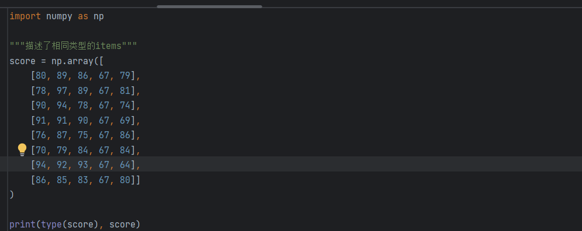

### ndarray的优势

- 解除了GIL锁，运行速度非常快，相比于列表嵌套，速度大大提升
- 数据的内存地址是连续的，使得批量操作数组元素时速度更快
- 支持常见的数组与矩阵运算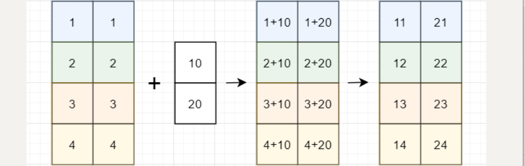
- **ndarray对象处理多维数组**，该对象是快速而灵活的大数据容器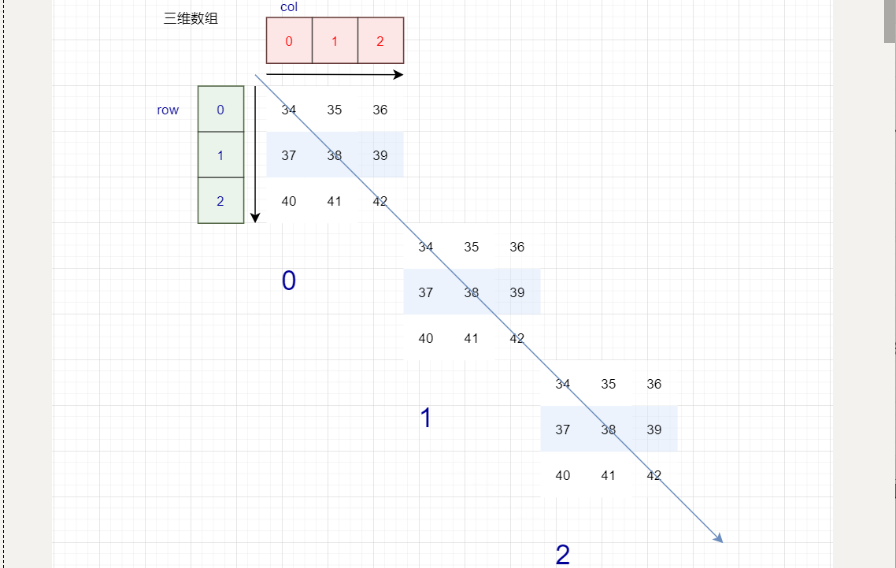

### ndarray的属性

| 属性             | 说明                       |
| ---------------- | -------------------------- |
| ndarray.shape    | 数组维度的元组             |
| ndarray.ndim     | 数组维数                   |
| ndarray.size     | 数组中的元素数量           |
| ndarray.itemsize | 一个数组元素的长度（字节） |
| ndarray.dtype    | 数组元素的类型             |

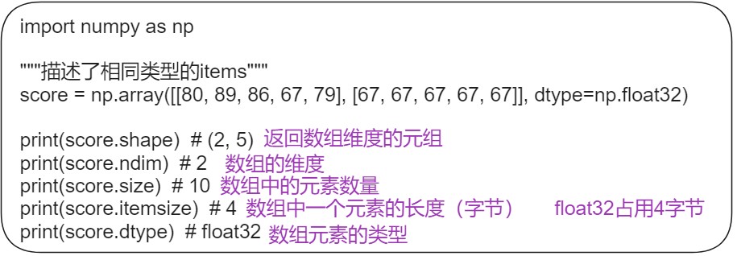

### ndarry的类型

|     名称      |                       描述                        | 简写  |
| :-----------: | :-----------------------------------------------: | :---: |
|    np.bool    |      用一个字节存储的布尔类型（True或False）      |  'b'  |
|    np.int8    |             一个字节大小，-128 至 127             |  'i'  |
|   np.int16    |               整数，-32768 至 32767               | 'i2'  |
|   np.int32    |              整数，-2^31 至 2^32 -1               | 'i4'  |
|   np.int64    |              整数，-2^63 至 2^63 - 1              | 'i8'  |
|   np.uint8    |               无符号整数，0 至 255                |  'u'  |
|   np.uint16   |              无符号整数，0 至 65535               | 'u2'  |
|   np.uint32   |             无符号整数，0 至 2^32 - 1             | 'u4'  |
|   np.uint64   |             无符号整数，0 至 2^64 - 1             | 'u8'  |
|  np.float16   | 半精度浮点数：16位，正负号1位，指数5位，精度10位  | 'f2'  |
|  np.float32   | 单精度浮点数：32位，正负号1位，指数8位，精度23位  | 'f4'  |
|  np.float64   | 双精度浮点数：64位，正负号1位，指数11位，精度52位 | 'f8'  |
| np.complex64  |     复数，分别用两个32位浮点数表示实部和虚部      | 'c8'  |
| np.complex128 |     复数，分别用两个64位浮点数表示实部和虚部      | 'c16' |
|  np.object_   |                    python对象                     |  'O'  |
|  np.string_   |                      字符串                       |  'S'  |
|  np.unicode_  |                    unicode类型                    |  'U'  |

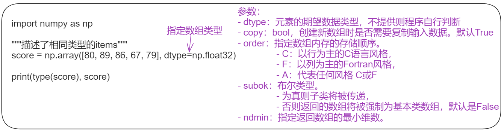

## 生成数组

### 普通数组

| 方法                      | 说明                                                         |
| ------------------------- | ------------------------------------------------------------ |
| **创建新数组**            |                                                              |
| np.ones(shape, dtype)     | 生成shape维度值为1的数组                                     |
| np.ones_like(a, dtype)    | 生成与a相同shape维度值为1的数组                              |
| np.zeros(shape, dtype)    | 生成shape维度值为0的数组                                     |
| np.zeros_like(a, dtype)   | 生成与a相同shape维度值为0的数组                              |
|                           |                                                              |
| **从现有的数组生成**      |                                                              |
| np.asarray(object, dtype) | 拷贝当前数组，<br />-  dtype相同时：类似于浅拷贝<br />- dtype不同时：类似与深拷贝 |
| np.array(a, dtype)        | 生成一个新的数组，相当于深拷贝                               |
|                           |                                                              |
| **生成固定范围的数组**    |                                                              |
| np.linspace ()            | 生成指定元素个数的数组                                       |
| np.arange()               | 生成指定元素步长的数组                                       |
| np.logspace()             | 生成指定元素个数的等比数组                                   |
|                           |                                                              |
| **生成随机数组**          |                                                              |

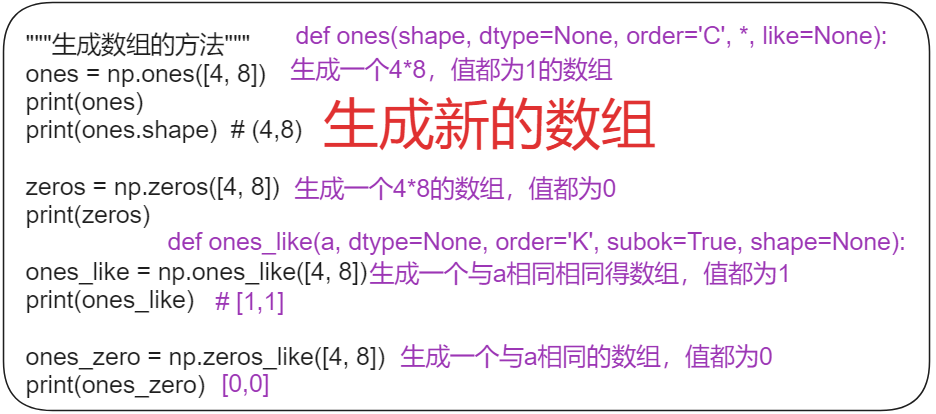

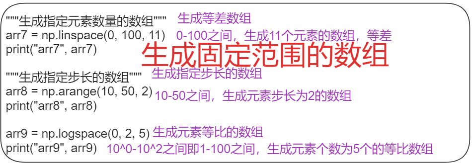

### 正太分布数组

- np.random.randn(d0, d1, …, dn):

  从标准正态分布中返回一个或多个样本值

- np.random.normal(loc=0.0, scale=1.0, size=None):

  生成一个标准数组

- np.random.standard_normal(*size=None*):

  返回指定形状的标准正态分布的数组。


- 第一参数μ：服从正态分布的随机变量的均值，
- 第二个参数σ：此随机变量的标准差
- 正态分布记作**N(μ，σ )**。
- **μ决定了其位置，其标准差σ**决定了分布的幅度。当μ = 0,σ = 1时的正态分布是标准正态分布。

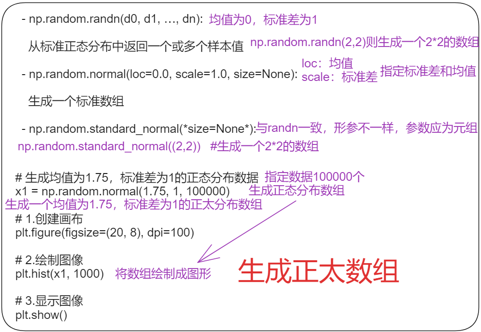

### 均匀分布数组

- np.random.rand(*d0*, *d1*, *...*, *dn*)：

  返回[0.0,1.0)内的一组均匀分布的数

- np.random.uniform(low=0.0, high=1.0, size=None)：

  从一个均匀分布的[low,height)中随机采样,左闭右开区间

- np.random.randint(*low*, *high=None*, *size=None*, *dtype='l'*)：

  从一个均匀分布中随机采样，生成一个整数或N维整数数组


## 数组的操作

### 修改数组维度

| 方法                  | 说明                                |
| --------------------- | ----------------------------------- |
| reshape(shape, order) | 修改数组维度，不修改原数组          |
| resize                | 修改数组维度，会修改原数组          |
| flatten               | 将多维数组转为1维数组，不影响原数组 |
| ravel                 | 将多为数组转为1维数组，影响原数组   |
| ndarray.T             | 数组行列互换                        |


### 切片、索引

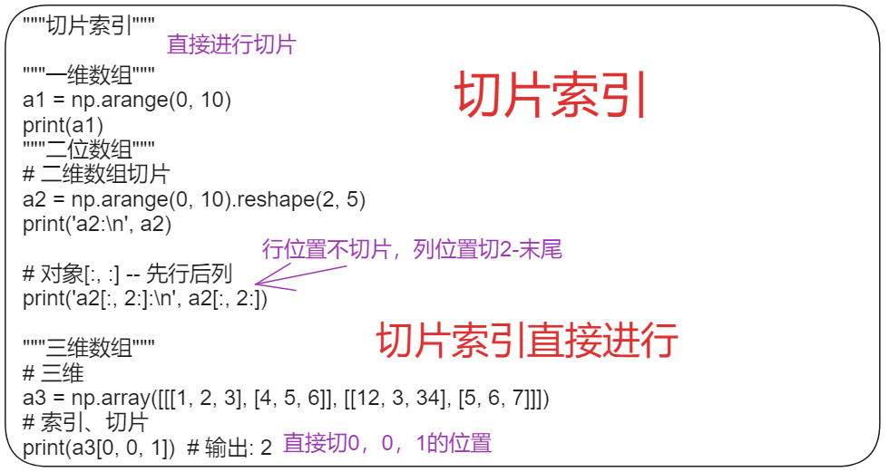

### 数组的切割

- hsplit：水平方向进行切割。用于指定分割成几列；可以使用数字来代表分成几部分，也可以使用数组来代表分割的地方。
- vsplit：垂直方向进行切割。用于指定分割成几行，可以使用数字来代表分成几部分，也可以使用数组来代表分割的地方。
- array_split：指定切割方式，在切割的时候需要指定是按照行还是按照列，`axis=1`代表按照列，`axis=0`代表按照行。


### 数组的拼接

- vstack：将数组按垂直方向进行叠加。数组的列数必须相同才能叠加。
- hstack：将数组按水平方向进行叠加。数组的行必须相同才能叠加。

### 数组广播

- 数组在进行矢量化运算时，**要求数组的形状是相等的**
- 形状不相等的数组执行算术运算的时候，就会出现广播机制，该机制会对数组进行扩展，使数组的shape属性值一样

数组广播机制只需要满足下面任一条件就可以：

- 数组的某一维度等长
- 其中一个数组的某一维度为1

广播机制需要扩展维度较小的数组，使它与最大的数组的shape值相同，以便使用元素级函数或者运算符进行运算。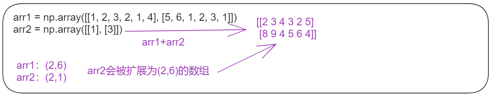

## 一元函数

| 函数                      | 说明                                                         |
| ------------------------- | ------------------------------------------------------------ |
| abs、fabs                 | 逐个元素地计算整数、浮点数或复数地绝对值                     |
| sqrt                      | 计算每个元素的平方根(与arr ** 0.5相等)                       |
| square                    | 计算每个元素地平方(与arr ** 2相等)                           |
| exp                       | 计算每个元素的自然指数值e^x次方                              |
| log、log10、log2、log1p   | 分别对应(自然指数(e为底)、对数10为底、对数2为底、log(1+x))   |
| sign                      | 计算每个元素的符号值：1(正数)、0(0)、-1(负数)                |
| ceil                      | 计算每个元素的最高整数值(即大于等于给定数值的最小整数)       |
| floor                     | 计算每个元素的最小整数值(即小于等于给定整数的最大整数)       |
| rint                      | 将元素保留到整数位，并保持dtype                              |
| modf                      | 分别将数组的小数部分与整数部分按数组形式返回                 |
| isnan                     | 返回数组元素是否是一个NaN(非数值)，形式为布尔值数组          |
| isfinite、isinf           | 分别返回数组中的元素是否有限(非inf、非NaN)、是否无限的，形式为布尔值数组 |
| cos、cish、sin、          | 常规三角函数及双曲三角函数                                   |
| sinh、tan、tanh           |                                                              |
| arccos、arccosh、arcsin、 | 反三角函数                                                   |
| arcsinh、arctan、arctanh  |                                                              |
| logical_not               | 对数组元素按位取反（~）                                      |

## 二元函数

| 函数                         | 说明                                                         |
| ---------------------------- | ------------------------------------------------------------ |
| add                          | 将数组的对应元素相加                                         |
| subtract                     | 在第二个数组中，将第一个数组中包含的元素去除                 |
| multiply                     | 将数组的对应元素相乘                                         |
| divide,floor_divide          | 除或整除(放弃余数)                                           |
| power                        | 将第二个数组的元素作为第一个数组对应元素的幂次方             |
| maximum                      | 逐个元素计算最大值，fmax忽略NaN                              |
| minimum                      | 逐个元素计算最小值，fmin忽略NaN                              |
| mod                          | 按元素的求模计算(即求除法的余数)                             |
| copysign                     | 将第一个数组的符号值改为第二个数组的符号值                   |
| greater,greater_equal,less， | 进行逐个元素的比较，返回布尔值数组（与数学操作符>,>=,<,<=,==,!=x效果一致） |
| less_equal,equal,not_equal   | （接上）                                                     |
| logical_and,logical_or       | 进行逐个元素的逻辑操作(与逻辑操作符&、丨、^效果一致)         |
| logical_xor                  |                                                              |

## 聚合函数

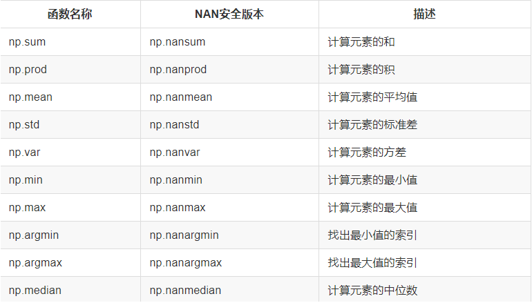

## 布尔数组函数

| 函数名 | 描述                     |
| ------ | ------------------------ |
| any    | 验证任意一个数据是否为真 |
| all    | 验证所有元素为真         |

## 数组的输入输出

| 方法         | 说明                             |
| ------------ | -------------------------------- |
| np.save()    | 将数组以二进制形式保存在磁盘中   |
| np.load()    | 从磁盘中加载二进制文件格式的数组 |
| np.savetxt() | 将数组保存为文本文件             |
| np.loadtxt() | 加载文本文件为数组               |


## Axis的理解

- 最外面的括号代表着 axis=0，依次往里的括号对应的 axis 的计数就依次加 1
- 如果指定轴进行相关的操作，那么他会使用轴下的每个直接子元素的第0个，第1个，第2个...分别进行相关的操作。
- 三维数组的操作方式以此类推

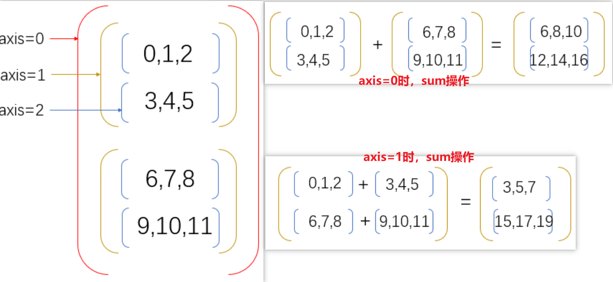

## NAN和INF值处理

概念介绍：

- NAN：Not A Number,不是一个数字，属于浮点类型，操作时需要注意NAN的类型
- INF：Infinity，代表无穷大，属于浮点类型，np.inf表示正无穷大，-np.inf表示负无穷大，一般出现除数为0时为无穷大

NAN的特点：

- NAN与NAN不相等，`np.NAN!=np.NAN`为True
- NAN和任何值做运算，返回结果都是NAN

在处理数据时，经常会出现一些缺失值，会影响数据处理，处理方式有多种，一般的处理方式：

- 删除缺失值
- 用其他值替代

删除缺失值：

有时候，我们想要将数组中的`NAN`删掉，那么我们可以换一种思路，就是只提取不为`NAN`的值。示例代码如下：

```python
# 1. 删除所有NAN的值，变成一维数组
arr2 = np.random.randint(0, 10, size=(3, 5)).astype(np.float)
# 将第(0,1)和(1,2)两个值设置为NAN
arr2[[0, 1], [1, 2]] = np.nan
print('arr2:\n', arr2)
# 此时的data会没有nan，并且变成一个1维数组
arr3 = arr2[~np.isnan(arr2)]
print('arr3:\n', arr3)

# 2. 删除NAN所在的行


# 获取哪些行有NAN
lines = np.where(np.isnan(arr2))[0]
print('lines:', lines)
# 使用delete方法删除指定的行,axis=0表示删除行，lines表示删除的行号
arr4 = np.delete(arr2, lines, axis=0)
print('arr4:\n', arr4)

```

用其他值进行替代：

有些时候我们不想直接删掉，比如有一个成绩表，分别是数学和英语，但是因为某个人在某个科目上没有成绩，那么此时就会出现NAN的情况，这时候就不能直接删掉了，就可以使用某些值进行替代。假如有以下表格：

| 数学 | 英语 |
| ---- | ---- |
| 59   | 89   |
| 90   | 32   |
| 78   | 45   |
| 34   | NAN  |
| NAN  | 56   |
| 23   | 56   |

如果想要求每门成绩的总分，以及每门成绩的平均分，那么就可以采用某些值替代。比如求总分，那么就可以把NAN替换成0，如果想要求平均分，那么就可以把NAN替换成其他值的平均值。示例代码如下：

```python
import numpy as np

scores = np.loadtxt("nan_scores.csv", skiprows=1, delimiter=",", encoding="utf-8", dtype=np.str)

scores[scores == ""] = np.NAN
scores = scores.astype(nfloat)
# 1. 求出学生成绩的总分
scores1 = scores.copy()
print(scores1.sum(axis=1))

# 2. 求出每门成绩的平均分
scores2 = scores.copy()
for x in range(scores2.shape[1]):
    score = scores2[:, x]
    print('score:', score)
    non_nan_score = score[score == score]
    print('non_nan_score:', non_nan_score)
    score[score != score] = non_nan_score.mean()
print(scores2.mean(axis=0))


```

# Pandas

## 数据读写

### set_option设置

- 使用`pd.describe_option('display')`可以打印所有set_option选项

| 参数                      | 说明                                                         |
| ------------------------- | ------------------------------------------------------------ |
| display.max_rows          | DataFrame显示的最大行数                                      |
| display.max_columns       | DataFrame显示的最大列数                                      |
| display.max_colwidth      | DataFrame每列的最大字符数，超过时截断                        |
| display.width             | 控制整个显示的宽度（以字符为单位）                           |
| display.precision         | 控制浮点数的显示精度（小数点后的位数）                       |
| display.expand_frame_repr | 列数超过显示宽度时，是否将其显示在多个行上                   |
| display.large_repr        | 行数或列数超过最大值时的显示方式：<br />- 截断（'truncate'）<br />- 概要信息（'info'） |
|                           |                                                              |
| display.colheader_justify | 控制列标题的对齐方式。默认为右对齐                           |
| display.chop_threshold    | 如果设置为浮点值，所有小于给定阈值的浮点值将被表示为0        |
| display.date_dayfirst     | 如果为 True，则首先打印和解析日期，例如 20/01/2005。默认为 False。 |
| display.date_yearfirst    | 如果为 True，则首先打印和解析日期，例如 2005/01/20。默认为 False。 |
| display.encoding          | 默认为控制台检测到的编码。指定要为 to_string 返回的字符串使用的编码，这些字符串通常用于在控制台上显示。默认为 utf-8。 |
| display.float_format      | 应接受一个浮点数并返回一个具有所需数字格式的字符串。这在 SeriesFormatter 等地方有用。 |
| display.html.border       | DataFrame HTML repr 的 `<table>` 标签中插入一个 `border=value` 属性。 |
| display.html.table_schema | 是否为支持它的前端发布表架构表示。默认为 False。             |
| display.html.use_mathjax  | 如果为 True，Jupyter 笔记本将使用 MathJax 处理表内容，渲染由美元符号封闭的数学表达式。默认为 True。 |
| display.large_repr        | 对于超过 max_rows/max_cols 的 DataFrames，repr (和 HTML repr) 可以显示一个截断的表（从0.13开始的默认值），或切换到来自 df.info() 的视图（在早期版本的 pandas 中的行为）。默认为截断。 |

### 读取方法

| 方法         | 说明                 |
| ------------ | -------------------- |
| read_csv()   | 读取csv文件          |
| to_csv()     | 保存到csv文件        |
| read_json()  | 读取json文件         |
| to_json()    | 保存为json文件       |
| read_hdf()   | 从hdf5文件中读取数据 |
| to_hdf()     | 保存为hdf5格式文件   |
| read_excel() | 读取execl表格        |
| to_excel()   | 保存为execl          |

### csv


### json

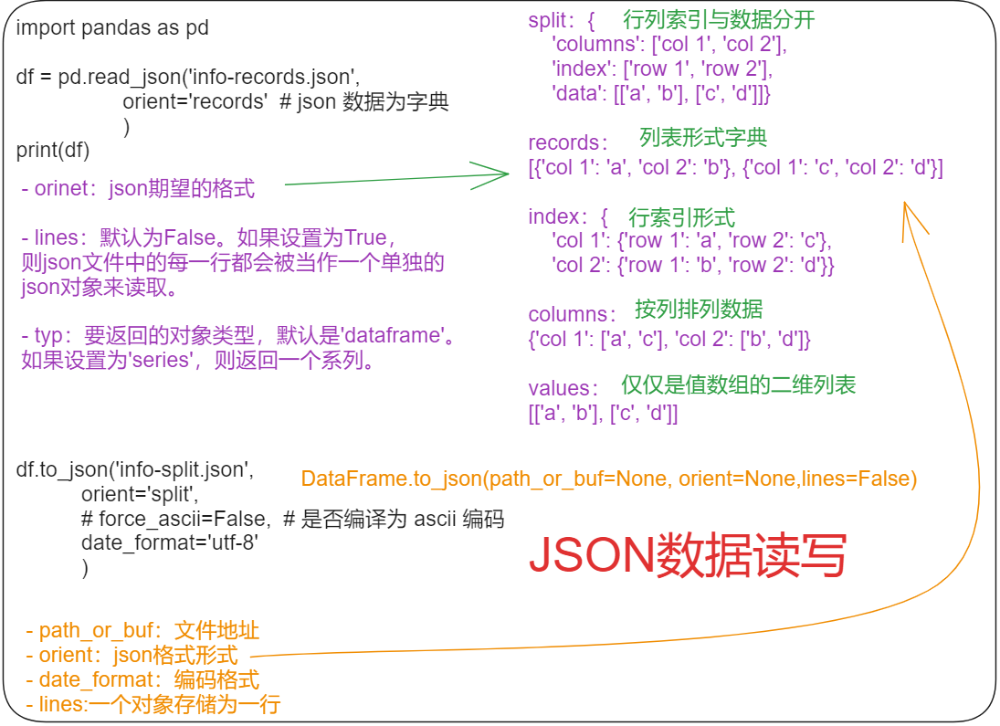

### execl


### HDF5

**HDF5文件的读取和存储需要指定一个键，值为要存储的DataFrame**

- pandas.read_hdf(path_or_buf，key =None，** kwargs)

  从h5文件当中读取数据

  - path_or_buffer:文件路径
  - key:读取的键
  - return:Theselected object

- DataFrame.to_hdf(path_or_buf, *key*, **\*kwargs*)

```python
"""需要安装tables模块避免不能读取HDF5文件"""
pip install tables==3.6.1
"""读取文件"""
day_close = pd.read_hdf("day_close.h5") 

print(day_close)

"""存储文件"""
day_close.to_hdf("./data/test.h5", key="day_close")
"""再次读取的时候, 需要指定键的名字"""
new_close = pd.read_hdf("./data/test.h5", key="day_close")
```

**注意：优先选择使用HDF5文件存储**

- HDF5在存储的时候支持压缩，**使用的方式是blosc，这个是速度最快**的也是pandas默认支持的
- 使用压缩可以**提磁盘利用率，节省空间**
- HDF5还是跨平台的，可以轻松迁移到hadoop 上面

## 数据结构

pandas中一共有三种数据结构

- series：一维数据结构
- DataFrame：二维数据结构
- MultiIndex(老版本叫Panel )：三维数据结构

### series

- 能够保存任何类型的数据
- 由一组数据和与之相关的索引组成(类似键值对)


### DataFrame

- 类似于二维数组，既有行索引，又有列索引
- 行索引：横向索引，叫index，0轴，axis=0
- 列索引：纵向索引，叫columns，1轴，axis=1

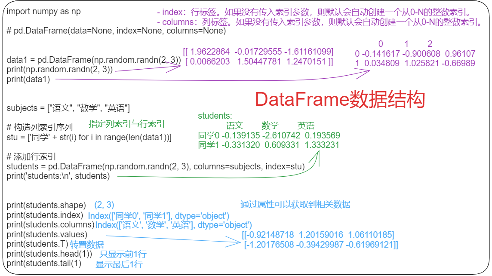

### DataFrame索引

| 方法                    | 说明                 |
| ----------------------- | -------------------- |
| reset_index(drop=False) | 重设新索引           |
| set_index()             | 以某列值设置为新索引 |


### 索引对象

- Series和DataFrame中的索引都是Index对象
- 索引对象不可更改，为了确保数据安全


## 基本操作

### 函数

| 函数                                      | 说明                      |
| ----------------------------------------- | ------------------------- |
| df.drop()                                 | 删除对应的列              |
| df.loc()                                  | 依据内容值进行索引        |
| df.iloc()                                 | 依据索引值进行索引        |
| df.sort_values(by="列名", ascending=True) | DataFrame依据列名排序     |
| df.sort_values(by=['open', 'high'])       | DataFrame指定多个列名排序 |
| Series.sort_values(ascending=True)        | Series依据值排序          |
| Series.sort_index(ascending=True)         | Series依据索引排序        |

### 索引操作


### 排序操作

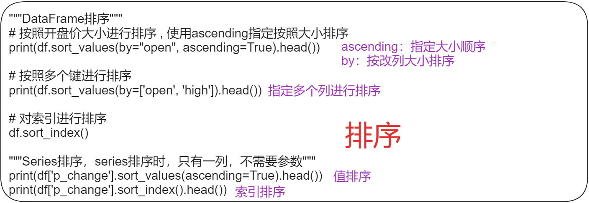

## DataFrame的运算

| 方法             | 说明                         |
| ---------------- | ---------------------------- |
| add(other)       | 值进行-1                     |
| sub(other)       | 值进行+1                     |
| query(expr)      | 通过条件查询，接收一个字符串 |
| isin(values)     | 判断值是否在提供的参数值中   |
|                  |                              |
| **统计函数**     |                              |
| describe()       |                              |
| count            | 非NA观察值的数量             |
| sum              | 值的总和                     |
| mean             | 值的平均数                   |
| median           | 值的算术中位数               |
| min              | 最小值                       |
| max              | 最大值                       |
| mode             | 众数                         |
| abs              | 绝对值                       |
| prod             | 值的乘积                     |
| std              | 贝塞尔修正的样本标准偏差     |
| var              | 无偏方差                     |
| idxmax           | 计算最大值对应的索引标签     |
| idxmin           | 计算最小值对应的索引标签     |
|                  |                              |
| **累计统计函数** |                              |
| cumsum           | **计算前1/2/3/…/n个数的和**  |
| cummax           | 计算前1/2/3/…/n个数的最大值  |
| cummin           | 计算前1/2/3/…/n个数的最小值  |
| cumprod          | 计算前1/2/3/…/n个数的积      |


## 数据清洗

数据清洗规则：

- 完整性：单条数据是否存在空值，统计的字段是否完善
- 全面性：观察某一列的全部数值，比如在Excel表中，我们选中一列，可以看到该列的平均值、最大值、最小值。我们可以通过常识来判断该列是否有问题，比如：数据定义、单位标识、数值本身。
- 合法性：数据的类型、内容、大小的合法性。比如数据中存在非ASCII字符，性别存在了未知，年龄超过了150岁等。
- 唯**一**性：数据是否存在重复记录，因为数据通常来自不同渠道的汇总，重复的情况是常见的。行数据、列数据都需要是唯一的，比如一个人不能重复记录多次，且一个人的体重也不能在列指标中重复记录多次。

### 处理缺失数据

| 缺失值 | 说明                                                  |
| ------ | ----------------------------------------------------- |
| None   | python对象缺失值                                      |
| NaN    | np.nan,一种特殊的浮点数，任何数和NaN运算最终都得到NaN |

**Pandas**对不同类型缺失值的转换规则

| 类型             | 缺失值转换规则     | **NA**标签值   |
| ---------------- | ------------------ | -------------- |
| floating 浮点型  | 无变化             | np.nan         |
| object 对象类型  | 无变化             | None 或 np.nan |
| integer 整数类型 | 强制转换为 float64 | np.nan         |
| boolean 布尔类型 | 强制转换为 object  | None 或 np.nan |

需要注意的是，Pandas 中字符串类型的数据通常是用 object 类型为了完成这种交换过程，Pandas提供了一些方法来发现、剔除、替换数据结构中的缺失值：

| 方法      | 说明                               |
| --------- | ---------------------------------- |
| isnull()  | 创建一个布尔类型的掩码标签缺失值。 |
| notnull() | 与 isnull() 操作相反。             |
| dropna()  | 返回一个剔除缺失值的数据。         |
| fillna()  | 返回一个填充了缺失值的数据副本。   |

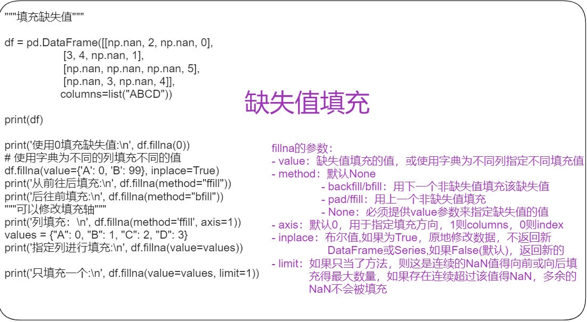

### 处理重复数据

| 方法              | 说明                                 |
| ----------------- | ------------------------------------ |
| duplicated()      | 返回布尔型Series表示每行是否为重复行 |
| drop_duplicates() | 删除重复数据                         |


### 数据替换

| 方法       | 说明                   |
| ---------- | ---------------------- |
| replace()  | 替换数据               |
| map()      | 对数据进行转换         |
| apply ()   | 将函数应用到行或列上   |
| applymap() | 将函数应用到每个数据上 |


## 字符串操作方法

| 方法                  | 说明                                                         |
| --------------------- | ------------------------------------------------------------ |
| count                 | 返回子串在字符串中出现的次数(非重叠)                         |
| endswith、startswith  | 以某个后缀结尾/前缀开头，则返回True                          |
| join                  | 将字符串用做连接其他字符串的分隔符                           |
| index                 | 若子串在字符串中，则返回第一个字符的index，没有则引发ValueError |
| find                  | 若子串在字符串中，则返回第一个字串所在的位置，没有则返回-1   |
| rfind                 | 若字串在字符串中，则返回最后一个字符串第一个字符所在位置，没有则返回-1 |
| replace               | 用另一个字符串替换指定子串                                   |
| strip、rstrip、lstrip | 去除空白符，包括换行符，相当于每个元素都执行x。strip()       |
| split                 | 通过指定的分隔符将字符串拆分为一组字串                       |
| lower、upper          | 将字母转换为小写/大写                                        |
| ljust、rjust          | 用空格或其他字符体虫空白测以返回符合最低宽度的字符串         |

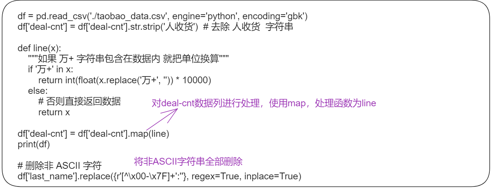

### 正则表达式方法

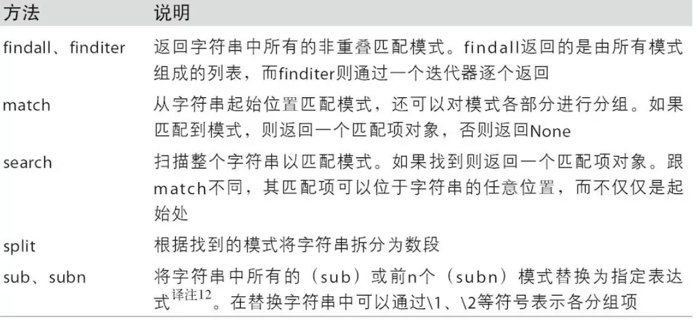

### pandas字符串函数:


## 分组聚合

### 分组

| 方法      | 说明           |
| --------- | -------------- |
| groupby() | 对数据进行分组 |

GroupBy对象：可以将他看作师DataFrame的集合

### 聚合

| 方法        | 说明         |
| ----------- | ------------ |
| aggregate() | 进行聚合操作 |
| filter()    | 过滤         |

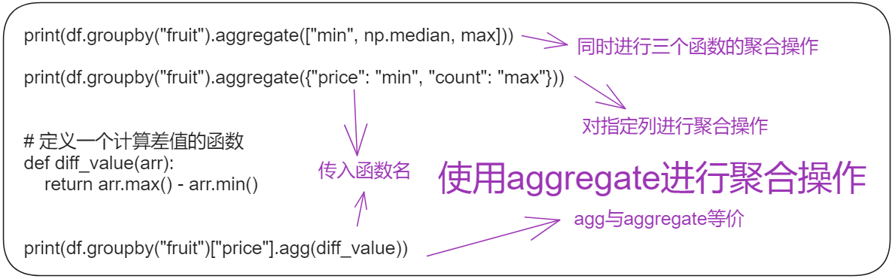

| 函数名      | 描述                    |
| ----------- | ----------------------- |
| count       | 分组中非NA值的数量      |
| sum         | 非NA值的和              |
| mean        | 非NA值的平均值          |
| median      | 非NA值的中位数          |
| std, var    | 标准差和方差            |
| min, max    | 非NA的最小值，最大值    |
| prod        | 非NA值的乘积            |
| first, last | 非NA值的第一个,最后一个 |

## 数据合并

| 方法        | 说明                                                         |
| ----------- | ------------------------------------------------------------ |
| pd.merge()  | 按列名进行数据合并                                           |
| pd.concat() | 沿轴方向将多个对象合并到一起                                 |
| pd.stack()  | 将列索引旋转为行索引，完成层级索引,DataFrame->Series         |
| unstack()   | 将层级索引展开,Series->DataFrame,默认操作内层索引，即level=1 |


## 时间序列

时间序列（time series）数据是一种重要的结构化数据形式：

- 时间戳（timestamp），特定的时刻。
- 固定时期（period），如2007年1月或2010年全年。
- 时间间隔（interval），由起始和结束时间戳表示。时期（period）可以被看做间隔（interval）的特例

### 时间和日期数据类型

| 类型      | 说明                                     |
| --------- | ---------------------------------------- |
| date      | 以公里形式存储日历日期(年、月、日)       |
| time      | 将时间存储为时、分、秒、毫秒             |
| datetime  | 存储日期和时间                           |
| timedelta | 表示两个datetime值之间的差(日、秒、毫秒) |
| tzinfo    | 存储时区信息的基本类型                   |

### datetime与字符串之间转换

| 符号 | 含义                                  | 例                           |
| ---- | ------------------------------------- | ---------------------------- |
| `%a` | 缩写的工作日名称                      | `'Wed'`                      |
| `%A` | 完整的工作日名称                      | `'Wednesday'`                |
| `%w` | 工作日编号 - 0（星期日）至6（星期六） | `'3'`                        |
| `%d` | 每月的一天（零填充）                  | `'13'`                       |
| `%b` | 缩写的月份名称                        | `'Jan'`                      |
| `%B` | 全月名称                              | `'January'`                  |
| `%m` | 一年中的一个月                        | `'01'`                       |
| `%y` | 没有世纪的一年                        | `'16'`                       |
| `%Y` | 与世纪的一年                          | `'2016'`                     |
| `%H` | 24小时制的小时                        | `'17'`                       |
| `%I` | 12小时制的小时                        | `'05'`                       |
| `%p` | 上午下午                              | `'PM'`                       |
| `%M` | 分钟                                  | `'00'`                       |
| `%S` | 秒                                    | `'00'`                       |
| `%f` | 微秒                                  | `'000000'`                   |
| `%z` | 时区感知对象的UTC偏移量               | `'-0500'`                    |
| `%Z` | 时区名称                              | `'EST'`                      |
| `%j` | 一年中的某一天                        | `'013'`                      |
| `%W` | 一年中的一周                          | `'02'`                       |
| `%c` | 当前区域设置的日期和时间表示形式      | `'Wed Jan 13 17:00:00 2016'` |
| `%x` | 当前区域设置的日期表示形式            | `'01/13/16'`                 |
| `%X` | 当前区域设置的时间表示                | `'17:00:00'`                 |
| `%%` | 文字`%`字符                           | `'%'`                        |


### 时间序列基础

pandas最基本的时间序列类型就是以时间戳（通常以Python字符串或datatime对象表示）为索引的Series：

```
In [39]: from datetime import datetime

In [40]: dates = [datetime(2011, 1, 2), datetime(2011, 1, 5),
   ....:          datetime(2011, 1, 7), datetime(2011, 1, 8),
   ....:          datetime(2011, 1, 10), datetime(2011, 1, 12)]

In [41]: ts = pd.Series(np.random.randn(6), index=dates)

In [42]: ts
Out[42]: 
2011-01-02   -0.204708
2011-01-05    0.478943
2011-01-07   -0.519439
2011-01-08   -0.555730
2011-01-10    1.965781
2011-01-12    1.393406
dtype: float64

```

这些datetime对象实际上是被放在一个DatetimeIndex中的：

```
In [43]: ts.index
Out[43]: 
DatetimeIndex(['2011-01-02', '2011-01-05', '2011-01-07', '2011-01-08',
               '2011-01-10', '2011-01-12'],
              dtype='datetime64[ns]', freq=None)

```

跟其他Series一样，不同索引的时间序列之间的算术运算会自动按日期对齐：

```
In [44]: ts + ts[::2]
Out[44]: 
2011-01-02   -0.409415
2011-01-05         NaN
2011-01-07   -1.038877
2011-01-08         NaN
2011-01-10    3.931561
2011-01-12         NaN
dtype: float64

```

ts[::2] 是每隔两个取一个。

### 索引、选取、子集构造

当你根据标签索引选取数据时，时间序列和其它的pandas.Series很像：

```
In [48]: stamp = ts.index[2]

In [49]: ts[stamp]
Out[49]: -0.51943871505673811

```

还有一种更为方便的用法：传入一个可以被解释为日期的字符串：

```
In [50]: ts['1/10/2011']
Out[50]: 1.9657805725027142

In [51]: ts['20110110']
Out[51]: 1.9657805725027142

```

### 日期的范围、频率以及移动

| 码   | 说明                                      |
| ---- | ----------------------------------------- |
| D    | 天（calendar day，按日历算，含双 休日）周 |
| W    | 周（weekly）                              |
| M    | 月末（month end）                         |
| Q    | 季末（quarter end）                       |
| A    | 年末（year end）                          |
| H    | 小时（hours）                             |
| T    | 分钟（minutes）                           |
| S    | 秒（seconds）                             |
| L    | 毫秒（milliseonds）                       |
| U    | 微秒（microseconds）                      |
| N    | 纳秒（nanoseconds）                       |
| B    | 天（business day，仅含工作日）            |
| BM   | 月末（business month end，仅含工作日）    |
| BQ   | 季末（business quarter end，仅含工作日）  |
| BA   | 年末（business year end，仅含工作日）     |
| BH   | 小时（business hours，工作时间）          |

pandas中的原生时间序列一般被认为是不规则的，也就是说，它们没有固定的频率。对于大部分应用程序而言，这是无所谓的。但是，它常常需要以某种相对固定的频率进行分析，比如每日、每月、每15分钟等（这样自然会在时间序列中引入缺失值）。幸运的是，pandas有一整套标准时间序列频率以及用于重采样、频率推断、生成固定频率日期范围的工具。例如，我们可以将之前那个时间序列转换为一个具有固定频率（每日）的时间序列，只需调用resample即可：

```python
In [72]: ts
Out[72]: 
2011-01-02   -0.204708
2011-01-05    0.478943
2011-01-07   -0.519439
2011-01-08   -0.555730
2011-01-10    1.965781
2011-01-12    1.393406
dtype: float64

In [73]: resampler = ts.resample('D')

```

字符串“D”是每天的意思。

频率的转换（或重采样）是一个比较大的主题。这里，我将告诉你如何使用基本的频率和它的倍数。

### 生成日期范围

虽然我之前用的时候没有明说，但你可能已经猜到pandas.date_range可用于根据指定的频率生成指定长度的DatetimeIndex：

```
In [74]: index = pd.date_range('2012-04-01', '2012-06-01')

In [75]: index
Out[75]: 
DatetimeIndex(['2012-04-01', '2012-04-02', '2012-04-03', '2012-04-04',
               '2012-04-05', '2012-04-06', '2012-04-07', '2012-04-08',
               '2012-04-09', '2012-04-10', '2012-04-11', '2012-04-12',
               '2012-04-13', '2012-04-14', '2012-04-15', '2012-04-16',
               '2012-04-17', '2012-04-18', '2012-04-19', '2012-04-20',
               '2012-04-21', '2012-04-22', '2012-04-23', '2012-04-24',
               '2012-04-25', '2012-04-26', '2012-04-27', '2012-04-28',
               '2012-04-29', '2012-04-30', '2012-05-01', '2012-05-02',
               '2012-05-03', '2012-05-04', '2012-05-05', '2012-05-06',
               '2012-05-07', '2012-05-08', '2012-05-09', '2012-05-10',
               '2012-05-11', '2012-05-12', '2012-05-13', '2012-05-14',
               '2012-05-15', '2012-05-16', '2012-05-17', '2012-05-18',
               '2012-05-19', '2012-05-20', '2012-05-21', '2012-05-22',
               '2012-05-23', '2012-05-24', '2012-05-25', '2012-05-26',
               '2012-05-27', '2012-05-28', '2012-05-29', '2012-05-30',
               '2012-05-31', '2012-06-01'],
              dtype='datetime64[ns]', freq='D')

```

默认情况下，date_range会产生按天计算的时间点。如果只传入起始或结束日期，那就还得传入一个表示一段时间的数字：

```python
In [76]: pd.date_range(start='2012-04-01', periods=20)
Out[76]: 
DatetimeIndex(['2012-04-01', '2012-04-02', '2012-04-03', '2012-04-04',
               '2012-04-05', '2012-04-06', '2012-04-07', '2012-04-08',
               '2012-04-09', '2012-04-10', '2012-04-11', '2012-04-12',
               '2012-04-13', '2012-04-14', '2012-04-15', '2012-04-16',
               '2012-04-17', '2012-04-18', '2012-04-19', '2012-04-20'],
              dtype='datetime64[ns]', freq='D')

In [77]: pd.date_range(end='2012-06-01', periods=20)
Out[77]: 
DatetimeIndex(['2012-05-13', '2012-05-14', '2012-05-15', '2012-05-16',
               '2012-05-17', '2012-05-18', '2012-05-19', '2012-05-20',
               '2012-05-21', '2012-05-22', '2012-05-23', '2012-05-24',
               '2012-05-25', '2012-05-26', '2012-05-27','2012-05-28',
               '2012-05-29', '2012-05-30', '2012-05-31', '2012-06-01'],
              dtype='datetime64[ns]', freq='D')

```

起始和结束日期定义了日期索引的严格边界。例如，如果你想要生成一个由每月最后一个工作日组成的日期索引，可以传入"BM"频率（表示business end of month），这样就只会包含时间间隔内（或刚好在边界上的）符合频率要求的日期：

```python
In [78]: pd.date_range('2000-01-01', '2000-12-01', freq='BM')
Out[78]: 
DatetimeIndex(['2000-01-31', '2000-02-29', '2000-03-31', '2000-04-28',
               '2000-05-31', '2000-06-30', '2000-07-31', '2000-08-31',
               '2000-09-29', '2000-10-31', '2000-11-30'],
              dtype='datetime64[ns]', freq='BM')

```


### 重采样及频率转换

重采样（resampling）指的是将时间序列从一个频率转换到另一个频率的处理过程。将高频率数据聚合到低频率称为降采样（downsampling），而将低频率数据转换到高频率则称为升采样（upsampling）。并不是所有的重采样都能被划分到这两个大类中。例如，将W-WED（每周三）转换为W-FRI既不是降采样也不是升采样。

pandas对象都带有一个resample方法，它是各种频率转换工作的主力函数。resample有一个类似于groupby的API，调用resample可以分组数据，然后会调用一个聚合函数：

```python
In [208]: rng = pd.date_range('2000-01-01', periods=100, freq='D')

In [209]: ts = pd.Series(np.random.randn(len(rng)), index=rng)

In [210]: ts
Out[210]: 
2000-01-01    0.631634
2000-01-02   -1.594313
2000-01-03   -1.519937
2000-01-04    1.108752
2000-01-05    1.255853
2000-01-06   -0.024330
2000-01-07   -2.047939
2000-01-08   -0.272657
2000-01-09   -1.692615
2000-01-10    1.423830
                ...   
2000-03-31   -0.007852
2000-04-01   -1.638806
2000-04-02    1.401227
2000-04-03    1.758539
2000-04-04    0.628932
2000-04-05   -0.423776
2000-04-06    0.789740
2000-04-07    0.937568
2000-04-08   -2.253294
2000-04-09   -1.772919
Freq: D, Length: 100, dtype: float64

In [211]: ts.resample('M').mean()
Out[211]: 
2000-01-31   -0.165893
2000-02-29    0.078606
2000-03-31    0.223811
2000-04-30   -0.063643
Freq: M, dtype: float64

In [212]: ts.resample('M', kind='period').mean()
Out[212]: 
2000-01   -0.165893
2000-02    0.078606
2000-03    0.223811
2000-04   -0.063643
Freq: M, dtype: float64

```

resample是一个灵活高效的方法，可用于处理非常大的时间序列。


