# 创建与使用

## 创建命令

```python
pip install django
pip install djangorestframework

# 创建django项目配置信息(后面要加.)
django-admin startproject 项目名 .
django-admin startproject DjangoConfig .

# 创建app
python manage.py startapp xxxx

# 启动服务
python manage.py runserver 

# 数据迁移
python manage.py makemigrations

# 生成数据表
python manage.py migrate
# 指定迁移数据库
python manage.py migrate --database=default #默认
python manage.py migrate --database=read
# 指定app与数据库
python manage.py migrate app01 --database=read
```

## 核心配置

- 注释掉INSTALLED_APPS中已注册的组件
- 加入rest_framework组件以及config项

```python
INSTALLED_APPS = [
    # "django.contrib.admin",
    # "django.contrib.auth",
    # "django.contrib.contenttypes",
    # "django.contrib.sessions",
    # "django.contrib.messages",
    "django.contrib.staticfiles",  # 静态文件
    "xxxxxx.apps.xxxxxxConfig",
    "rest_framework",
]
```

- 注释掉不需要的中间件

```python
MIDDLEWARE = [
    "django.middleware.security.SecurityMiddleware",
    # "django.contrib.sessions.middleware.SessionMiddleware",
    "django.middleware.common.CommonMiddleware",
    # "django.middleware.csrf.CsrfViewMiddleware",
    # "django.contrib.auth.middleware.AuthenticationMiddleware",
    # "django.contrib.messages.middleware.MessageMiddleware",
    "django.middleware.clickjacking.XFrameOptionsMiddleware",
]

```

- 配置匿名用户登录

```python
TEMPLATES = [
    {
        'BACKEND': 'django.template.backends.django.DjangoTemplates',
        'DIRS': [],
        'APP_DIRS': True,
        'OPTIONS': {
            'context_processors': [
                'django.template.context_processors.debug',
                'django.template.context_processors.request',
                # 'django.contrib.auth.context_processors.auth',
                # 'django.contrib.messages.context_processors.messages',
            ],
        },
    },
]

REST_FRAMEWORK = {
    "UNAUTHENTICATED_USER": None
}
```

- 修改时区与字体

```python
# LANGUAGE_CODE = 'en-us'
LANGUAGE_CODE = 'zh-hans'

# datetime.datetime.now() / datetime.datetime.utcnow() => utc时间
# TIME_ZONE = 'UTC'
# datetime.datetime.now() - 东八区时间 / datetime.datetime.utcnow() => utc时间
TIME_ZONE = 'Asia/Shanghai'

USE_I18N = True

# 影响自动生成数据库时间字段；
#       USE_TZ = True，创建UTC时间写入到数据库。
#       USE_TZ = False，根据TIME_ZONE设置的时区进行创建时间并写入数据库
USE_TZ = False
```

## setting和django.conf的区别

- django.conf：django内部的配置模块
- setting：用户级别配置，主要用于程序配置

## 生命周期

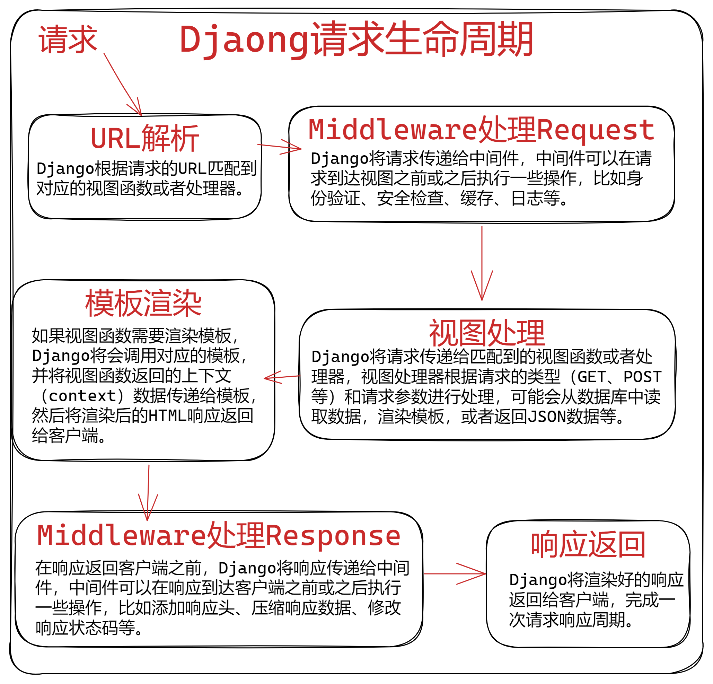

## 内置组件

- 型层（Model Layer）：Django 提供了一个强大的 ORM（对象关系映射）框架，可以轻松地与数据库进行交互，不需要编写复杂的 SQL 查询语句。
- 视图层（View Layer）：Django 的视图层提供了多种视图类型，包括函数视图（FBV）和类视图（CBV），使开发人员可以选择最适合他们需求的视图类型。
- 模板层（Template Layer）：Django 的模板层提供了一个强大的模板引擎，可以轻松地生成 HTML 页面。
- 表单层（Form Layer）：Django 的表单层提供了一个简单易用的表单框架，可以轻松地处理表单验证、数据存储等任务。
- 路由层（URL Routing Layer）：Django 的路由层提供了一个灵活的 URL 配置系统，可以轻松地将 URL 映射到视图函数或类上。
- 中间件层（Middleware Layer）：Django 的中间件层提供了一种灵活的方式来扩展和修改请求和响应对象。
- Admin 后台管理系统：Django 的 Admin 后台管理系统提供了一个易于使用的界面，可以轻松地管理应用程序的模型数据。
- 安全性（Security）：Django 提供了一系列安全性保护措施，包括跨站请求伪造（CSRF）保护、跨站脚本（XSS）保护等。
- 缓存系统（Cache Framework）：Django 的缓存系统提供了一个灵活的缓存框架，可以将数据缓存到内存、文件系统或其他数据存储系统中，从而提高应用程序的性能。
- 国际化和本地化（Internationalization and Localization）：Django 提供了一种简单易用的国际化和本地化框架，可以轻松地将应用程序本地化到不同的语言和地区。

# 路由

## 传统路由


## 路由分发

### include自动分发

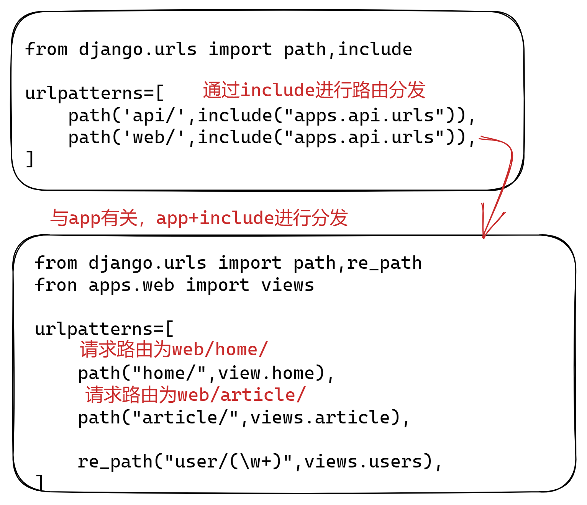

### include手动分发

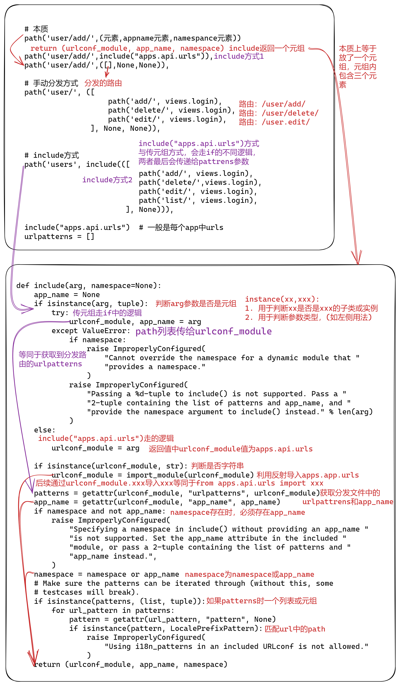

## name

### 静态路由中的name

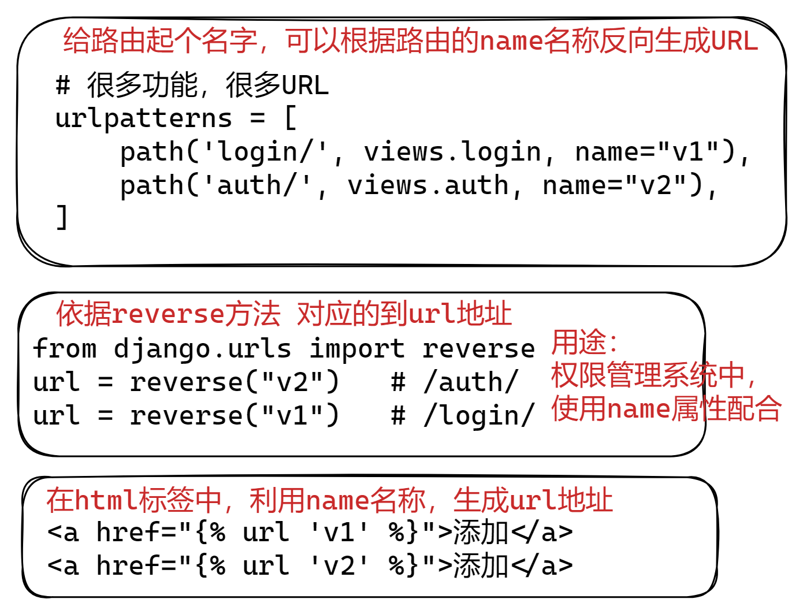

### 动态路由中的name


## namespace

### namespace结合路由分发

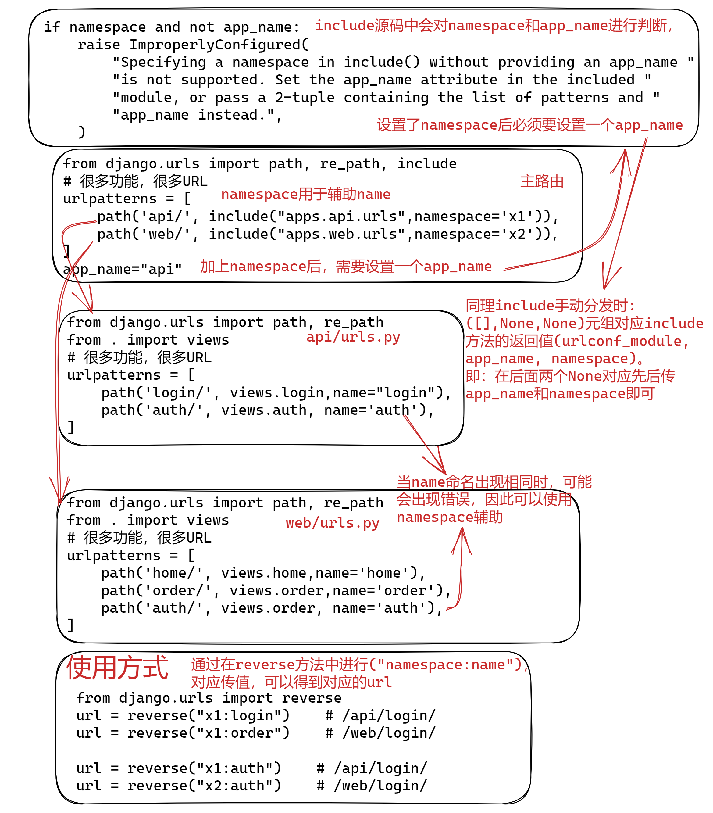

**手动分发结合namespace：**

namespace通常与app_name同名


### 多层嵌套

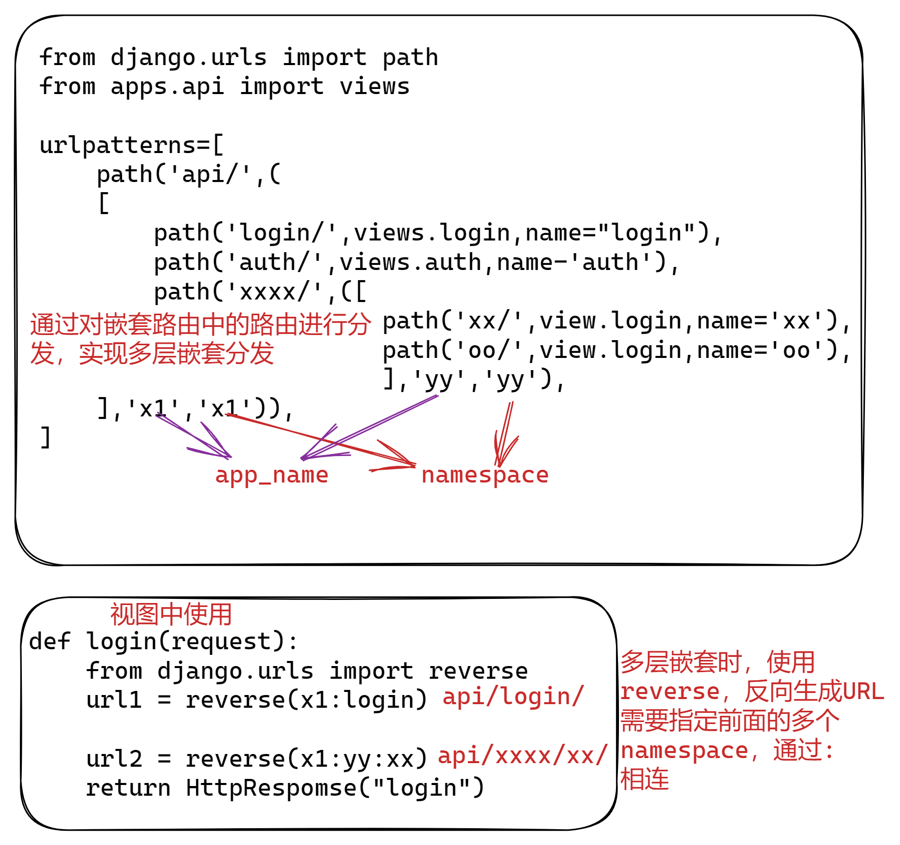

## 路由-slash

当路由定义为login/时，访问login路由，会被重定向到login/，这是由于Setting配置中的APPEND_SLASH为True的原因(默认)。若想关闭该重定向功能，可以在Setting配置中设定`APPEND_SLASH=False`。

## 当前匹配对象

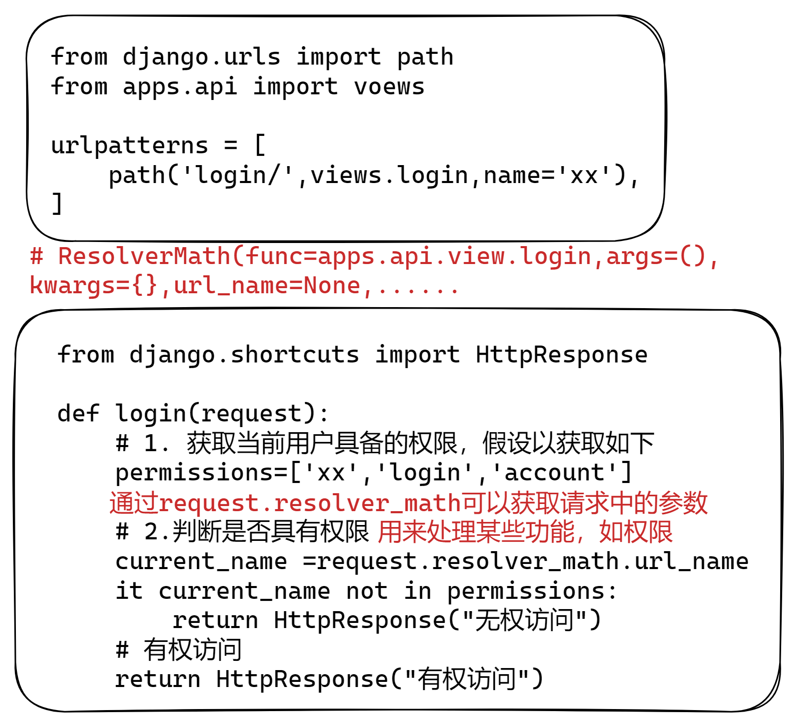

## partial偏函数

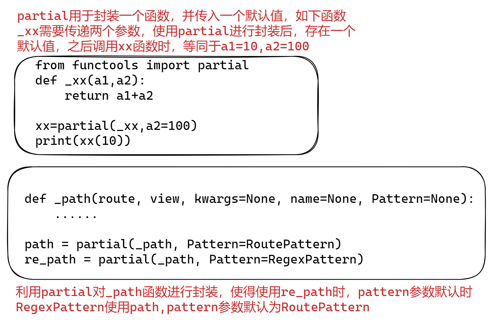

# 视图

## request

### 方法

| 方法                       | 说明                         |
| -------------------------- | ---------------------------- |
| `request.path_info`        | 返回当前视图的URL            |
| `request.META`             | 获取请求元数据               |
| `request.GET`              | 返回URL传递的参数            |
| `request.GET.GET()`        | 获取URL参数中指定参数的值    |
| `request.method`           | 返回请求方式                 |
| `request.body`             | 返回原始请求数据             |
| `request.POST`             | 返回请求POST请求的数据       |
| `request.POST.get()`       | 获取请求体中指定参数的值     |
| `request.headers`          | 获取请求头                   |
| `request.header['cookie']` | 获取原始cookie字符串         |
| `request.COOKIES`          | 获取已处理的字典形式的字符串 |
| `request.resolver_match`   | 获取路由对象                 |
| `request.session`          | 获取session                  |


### 源码中的property


## 返回值


## 响应头


## FBV和CBV


# 静态资源

静态资源包含两类：

- 静态文件：开发需要的css、js、图片

  > 放置在根目录的static目录下或者各自app的static目录下

- 媒体文件：用户上传的数据，图片，表格等

  > 放置在根目录的media目录下

两种文件需要分开放置。

## 静态文件


## 媒体文件


# 中间件

## 请求过程

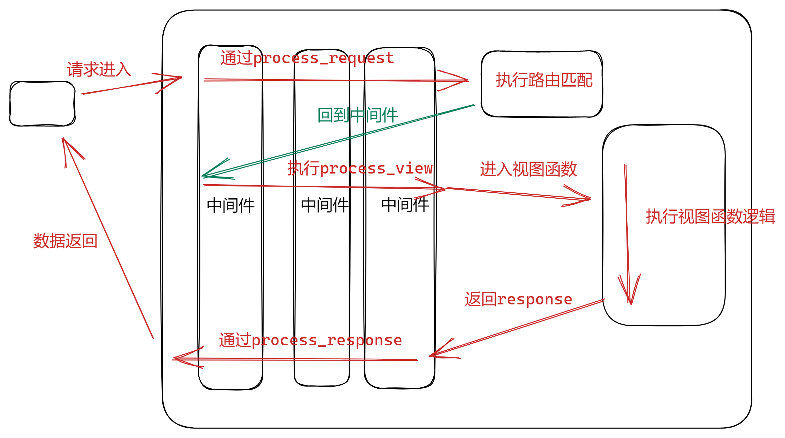

## 原始方法


## process方法

| 方法                      | 说明                                                         |
| ------------------------- | ------------------------------------------------------------ |
| process_request           | 路由匹配前的逻辑处理                                         |
| process_view              | 路由匹配后，视图处理前的逻辑处理                             |
| process_reponse           | response返回给用户前的逻辑处理                               |
| process_exception         | 视图函数出现异常，自定义异常页面。                           |
| process_template_response | 视图函数返回`TemplateResponse`对象  or  对象中含有.render方法。 |

## MiddlewareMixin

请求进入时，会执行中间件的__call__方法

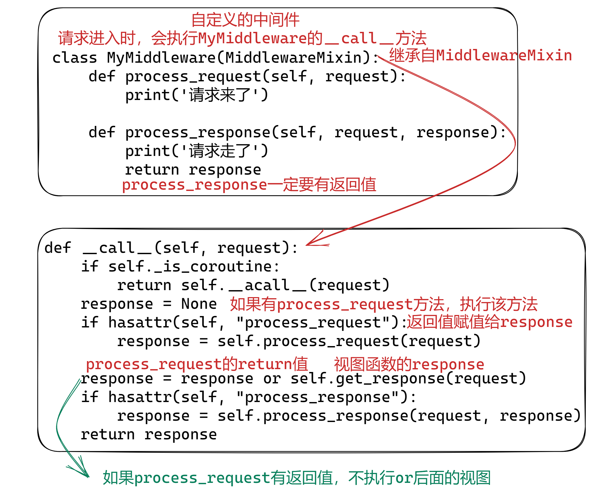

 ## process_view

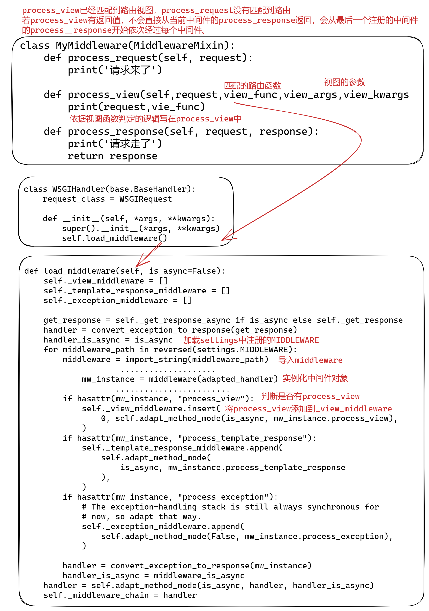

## 其他

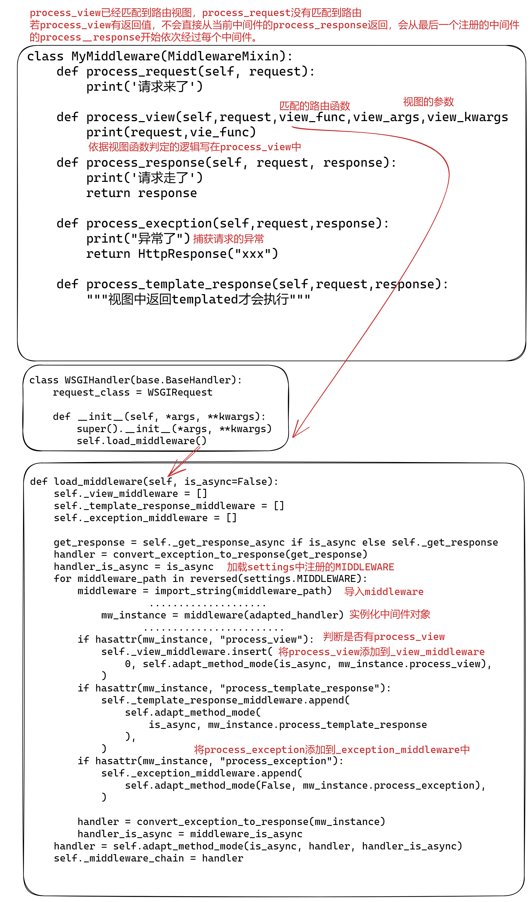

## 应用场景

Django 中间件是一种处理请求和响应的方法，它可以在 Django 视图函数和 Django 应用程序之间拦截请求和响应。中间件通常用于执行一些通用的操作，例如验证用户身份、记录日志、处理跨站请求伪造（CSRF）保护等。

**应用场景：**

- 认证和授权：中间件可以拦截请求并验证用户的身份，然后授权或拒绝访问某些资源。
- 记录日志：中间件可以记录请求和响应的详细信息，例如请求时间、响应状态码、IP 地址等。
- 缓存：中间件可以将一些响应缓存到内存或磁盘中，以减少重复计算和网络请求的开销。
- 错误处理：中间件可以捕获应用程序中的异常，并返回自定义的错误信息或页面。
- 跨站请求伪造（CSRF）保护：中间件可以检查请求中的 CSRF token，并防止恶意请求伪造。
- 性能优化：中间件可以执行一些性能优化操作，例如压缩响应、减少数据库查询等。
- 请求处理：中间件可以拦截请求并对其进行一些修改，例如添加请求头、修改请求体等。
- 响应处理：中间件可以拦截响应并对其进行一些修改，例如添加响应头、修改响应体等。

# ORM

## 常见字段和参数

### 字段

| 字段                 | 说明                                                         |
| -------------------- | ------------------------------------------------------------ |
| CharField            | 用于存储短文本字符串。通常需要指定一个最大长度（max_length） |
| SmallIntegerField    | 用于存储较小范围的整数。`SmallIntegerField` 的数值范围通常是 -32768 到 32767，具体取决于数据库后端的实现。 |
| IntegerField         | 用于存储整数                                                 |
| BigIntegerField      | 用于存储较大的整数                                           |
| PositiveIntegerField | 正整数                                                       |
| DateField            | 用于存储日期（不包含时间部分）。                             |
| DateTimeField        | 用于存储日期和时间。                                         |
| BooleanField         | 其实数据库不支持真假，根据SmallIntegerField创造出来出来。 0  1 |
| DecimalField         | 精确的小数，适用于需要精确计算的场景，如金融数据。需要指定最大位数（max_digits）和小数点后的位数（decimal_places）。 |
| TextField            | 用于存储长文本字符串，不需要指定最大长度。                   |
| FloatField           | 用于存储浮点数。                                             |

### 参数

| 参数         | 说明                                                         |
| ------------ | ------------------------------------------------------------ |
| verbose_name | 一个字符串，用于为字段提供可读的名称。如果未提供，Django 会根据字段名生成一个默认的可读名称。 |
| max_length   | 整数，用于限制文本字段（如 `CharField` 和 `TextField`）的最大长度。对于 `CharField` 是必需的。 |
| default      | 为字段指定默认值。可以是一个值或一个可调用对象（例如，函数）。 |
| unique       | 布尔值，表示该字段是否需要在整个表中具有唯一性。默认为 False。 |
| null         | 布尔值，表示该字段是否允许在数据库中存储空值（NULL）。默认为 False。 |
| blank        | 布尔值，表示在表单验证时该字段是否允许为空。默认为 False。注意，这与 `null` 不同，`null` 用于数据库约束，而 `blank` 用于表单验证。 |
| choices      | 一个包含二元元组的可迭代对象，用于为字段提供一组预定义的可选值。 示例： |
| db_index     | 布尔值，表示是否为该字段创建数据库索引。默认为 False。       |
| auto_now     | 一个布尔值，表示是否在每次保存对象时自动将字段设置为当前日期或当前日期和时间。 |
| upload_to    | 字符串或可调用对象，用于指定文件（如 `FileField` 和 `ImageField`）上传时的存储路径。可以包含日期格式化占位符（例如，'%Y/%m/%d'）或自定义函数。 |
| related_name | 定义了一个反向关系的名称                                     |

## 表关系

### 一对一


### 一对多

- 一对多在多侧使用 ForeignKey字段进行数据关联

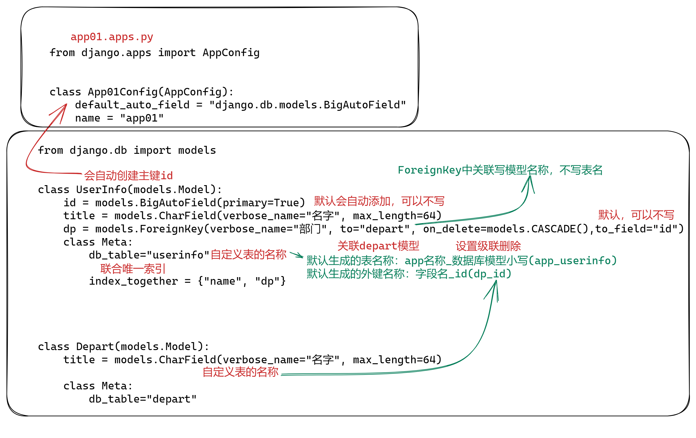

| 字段内的参数       | 说明                                                         |
| ------------------ | ------------------------------------------------------------ |
| to                 | 表示这个 ForeignKey 关联的另一个模型的名称，可以用字符串表示，也可以使用 Python 类的形式表示。 |
| on_delete          | 表示当关联的记录被删除时，ForeignKey 字段应该怎样处理。可选参数有：<br />`CASCADE`：级联删除，表示与这个 ForeignKey 关联的记录也会被删除。<br />`PROTECT`：保护，表示如果尝试删除与 ForeignKey 关联的记录，则引发 <br />`SET_NULL`：设置为空，表示与这个 ForeignKey 关联的记录将被设置为 null。<br />`SET_DEFAULT`：设置为默认值，表示与这个 ForeignKey 关联的记录将被设置为它的默认值。<br />`SET()`：设置为指定值，表示与这个 ForeignKey 关联的记录将被设置为一个指定的值。<br />`DO_NOTHING`：什么都不做，表示与这个 ForeignKey 关联的记录将不会受到影响。 |
| related_name       | 用于指定从关联模型到当前模型的反向关系的名称。如果不指定，则使用模型名称小写加 `_set` 的默认反向关系名称。 |
| related_query_name | 用于指定反向查询的名称，如果未设置，则将其设置为模型名称小写。 |
| limit_choices_to   | 用于指定在可用选项中显示哪些记录的限制。                     |
| db_index           | 表示是否为这个字段创建索引，默认为 True。                    |
| blank              | 表示在表单中该字段是否可以为空，默认为 False。               |
| null               | 表示在数据库中是否允许该字段为 NULL，默认为 False。          |
| verbose_name       | 用于指定在 Django 管理界面中显示的名称。                     |
| validators         | 用于指定该字段的验证器。                                     |

### 多对多


注意：ManyToManyField生成的表字段只能id/bid/gid，关系表需要定义其他数据时，可以采用手动创建关系表的方式。

**ManyToManyField字段参数：**

| 参数               | 说明                                                         |
| ------------------ | ------------------------------------------------------------ |
| to                 | 表示这个多对多关联的另一个模型的名称，可以用字符串表示，也可以使用 Python 类的形式表示。 |
| through            | 表示这个多对多关联使用的中间表。如果未指定，则 Django ORM 会自动创建一个中间表。 |
| through_fields     | 用于指定中间表中哪些字段用于关联模型。                       |
| related_name       | 用于指定从关联模型到当前模型的反向关系的名称。如果不指定，则使用模型名称小写加 `_set` 的默认反向关系名称。 |
| related_query_name | 用于指定反向查询的名称，如果未设置，则将其设置为模型名称小写。 |
| limit_choices_to   | 用于指定在可用选项中显示哪些记录的限制。                     |
| symmetrical        | 表示是否需要设置双向关系，默认为 True。如果设置为 False，则需要手动添加关联关系。 |
| blank              | 表示在表单中该字段是否可以为空，默认为 False。               |
| null               | 表示在数据库中是否允许该字段为 NULL，默认为 False。          |
| verbose_name       | 用于指定在 Django 管理界面中显示的名称。                     |
| validators         | 用于指定该字段的验证器。                                     |


## 连接数据库

### sqlite

```python
DATABASES = {
    'default': {
        'ENGINE': 'django.db.backends.sqlite3',
        'NAME': BASE_DIR / 'db.sqlite3',
    }
}
```

### mysql

```python
# pip install mysqlclient
# pip install mysql-connector-python
# pip install pymysql
DATABASES = {
    'default': {
        'ENGINE': 'django.db.backends.mysql',
        'NAME': 'mydatabase',
        'USER': 'myuser',
        'PASSWORD': 'mypassword',
        'HOST': 'localhost',
        'PORT': '3306',
    }
}
```

### PostgreSQL

```python
# pip install psycopg2
DATABASES = {
    'default': {
        'ENGINE': 'django.db.backends.postgresql',
        'NAME': 'mydatabase',
        'USER': 'myuser',
        'PASSWORD': 'mypassword',
        'HOST': 'localhost',
        'PORT': '5432',
    }
}
```

### Oracle

```python
# pip install cx-Oracle
DATABASES = {
    'default': {
        'ENGINE': 'django.db.backends.oracle',
        'NAME': 'mydatabase',
        'USER': 'myuser',
        'PASSWORD': 'mypassword',
        'HOST': 'localhost',
        'PORT': '1521',
    }
}
```

## 数据库连接池

```python
# pip install django-db-connection-pool
DATABASES = {
    "default": {
        # 每配置一次就会有一个连接池
        'ENGINE': 'dj_db_conn_pool.backends.mysql',
        'NAME': 'day04',  # 数据库名字
        'USER': 'root',
        'PASSWORD': 'root123',
        'HOST': '127.0.0.1',  # ip
        'PORT': 3306,
        'POOL_OPTIONS': {
            'POOL_SIZE': 10,  # 最小
            'MAX_OVERFLOW': 10,  # 在最小的基础上，还可以增加10个，即：最大20个。
            'RECYCLE': 24 * 60 * 60,  # 连接可以被重复用多久，超过会重新创建，-1表示永久。
            'TIMEOUT':30, # 池中没有连接最多等待的时间。
        }
    }
}
```

## 多数据库


```python
DATABASES = {
    'default': {
        'ENGINE': 'django.db.backends.mysql',
        'NAME': 'DjangoMaster',
        'USER': 'root',
        'PASSWORD': 'xy159951',
        'HOST': 'hsiangyatang.com',
        'PORT': '3306',
        'POOL_OPTIONS': {
            'POOL_SIZE': 10,  # 最小
            'MAX_OVERFLOW': 10,  # 在最小的基础上，还可以增加10个，即：最大20个。
            'RECYCLE': 24 * 60 * 60,  # 连接可以被重复用多久，超过会重新创建，-1表示永久。
            'TIMEOUT': 30,  # 池中没有连接最多等待的时间。
        }
    },
    'read': {
        'ENGINE': 'django.db.backends.mysql',
        'NAME': 'DjangoSlave',
        'USER': 'root',
        'PASSWORD': 'xy159951',
        'HOST': 'hsiangyatang.com',
        'PORT': '3306',
        'POOL_OPTIONS': {
            'POOL_SIZE': 10,  # 最小
            'MAX_OVERFLOW': 10,  # 在最小的基础上，还可以增加10个，即：最大20个。
            'RECYCLE': 24 * 60 * 60,  # 连接可以被重复用多久，超过会重新创建，-1表示永久。
            'TIMEOUT': 30,  # 池中没有连接最多等待的时间。
        }
    },
}
```

## 读写分离Router类


## 数据分库

### 多app


### 单app

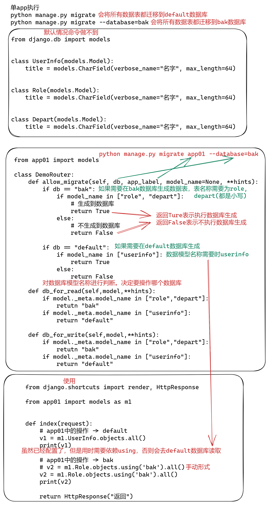

## 表操作

### 方法

| 方法               | 说明                                                         |
| ------------------ | ------------------------------------------------------------ |
| create()           | 创建一个新的对象并保存到数据库中。                           |
| save()             | 将对象保存到数据库中，如果对象已经存在则进行更新。           |
| delete()           | 删除对象。                                                   |
| all()              | 返回查询集中所有的对象。                                     |
| filter()           | 对查询集进行过滤，返回符合条件的对象集合。                   |
| exclude()          | 对查询集进行排除，返回不符合条件的对象集合。                 |
| get()              | 返回符合条件的单个对象，如果找不到或者有多个对象满足条件，则会抛出异常。 |
| first()            | 返回查询集中的第一个对象。                                   |
| last()             | 返回查询集中的最后一个对象。                                 |
| order_by()         | 对查询集进行排序。                                           |
| values()           | 返回指定字段的值，以字典的形式返回结果集。                   |
| distinct()         | 返回去重后的结果集。                                         |
| annotate()         | 对结果集进行聚合操作。                                       |
| aggregate()        | 对结果集进行聚合操作并返回一个值。                           |
| count()            | 返回查询集中的对象数量。                                     |
| exists()           | 判断是否存在符合条件的对象。                                 |
| prefetch_related() | 对查询集进行预先加载关联对象的操作。                         |
| select_related()   | 对查询集进行关联对象的立即加载操作。                         |

### Q对象

在Django ORM中，Q对象用于实现复杂的查询条件。使用Q对象，我们可以构建包含多个条件表达式的复杂查询，例如多个条件之间的“与”、“或”关系等。它常常和Django ORM的filter()和exclude()方法一起使用，构建复杂的查询条件。

| 参数        | 说明                         |
| ----------- | ---------------------------- |
| exact       | 等于                         |
| iexact      | 忽略大小写等于，             |
| contains    | 包含，                       |
| icontains   | 忽略大小写的包含             |
| in          | 在集合中                     |
| gt          | 大于                         |
| gte         | 大于等于                     |
| lt          | 小于                         |
| lte         | 小于等于                     |
| startswith  | 以指定字符串开头             |
| istartswith | 忽略大小写的以指定字符串开头 |
| endswith    | 以指定字符串结尾             |
| iendswith   | 忽略大小写的以指定字符串结尾 |

`Q对象`可以使用`&` 、 `|` 表示逻辑`与`和`或`。当操作符被用于两个 `Q` 对象之间时会生成一个新的 `Q` 对象。

```python
Poll.objects.get(
    Q(question__startswith='Who'),
    Q(pub_date=date(2005, 5, 2)) | Q(pub_date=date(2005, 5, 6))
)
# 等价于
SELECT * from polls WHERE question LIKE 'Who%'
    AND (pub_date = '2005-05-02' OR pub_date = '2005-05-06')
```


使用格式：`Q(属性名__运算符=值)`

```Python

# exact 等于   等价于Q(name='John')
Q(name__exact='John')

# 匹配 `John`、`john`、`JoHn` 
Q(name__iexact='john') 

# 匹配 `John`、`Johnathan`、`MyJohn`
Q(name__contains='John')

# 匹配 John、john、JoHn、Johnathan、MyJohn
Q(name__icontains='john')

# 匹配 age 等于 18、19 或 20 的数据
Q(age__in=[18, 19, 20])

# 匹配 age 大于 20 的数据
Q(age__gt=20)

# 匹配 age 大于等于 20 的数据
Q(age__gte=20) 

# 匹配 age 小于 20 的数据
Q(age__lt=20)

# 匹配 age 小于等于 20 的数据
Q(age__lte=20)

# 匹配 name 以 J 开头的数据
Q(name__startswith='J')

# 匹配 name 以 j、J 或 jO 开头的数据
Q(name__istartswith='j')

# 匹配 name 以 n 结尾的数据
Q(name__endswith='n')

# 匹配 name 以 n、N 或 An 结尾的数据。
Q(name__iendswith='N')
```

### F对象

`F` 对象用于对模型字段进行操作，可以直接在查询中对字段进行加、减、乘、除等运算，而无需将数据取出来再进行操作。`F` 对象有以下常用参数：

| 参数         | 说明                                                         |
| ------------ | ------------------------------------------------------------ |
| name         | 必选参数，表示要进行操作的字段名。                           |
| transform    | 可选参数，表示对字段的变换操作，常用的有 `Upper`（将字段转化为大写）、`Lower`（将字段转化为小写）、`Length`（计算字段长度）等等。 |
| output_field | 可选参数，表示操作的结果数据类型，常用的有 `IntegerField`，`FloatField`、`DecimalField`、`CharField`、`TextField`等等。 |
| combinable   | 可选参数，表示该对象是否支持多个 `F` 对象的组合使用，一般无需设置。 |
| `**extra`    | 可选参数，表示额外的 SQL 语句，可以使用 Django 中的 `RawSQL` 对象。 |

### 单表操作


### 一对多操作


### 反向关联

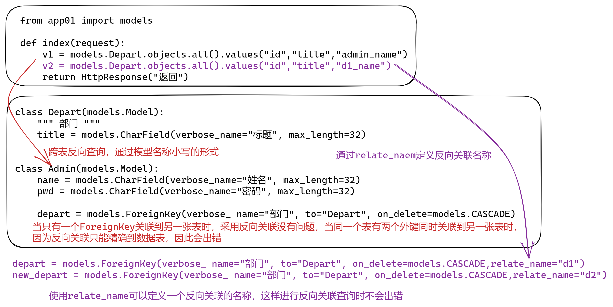

### 多对多操作


### 一对一


# Cookie和Session

## cookie

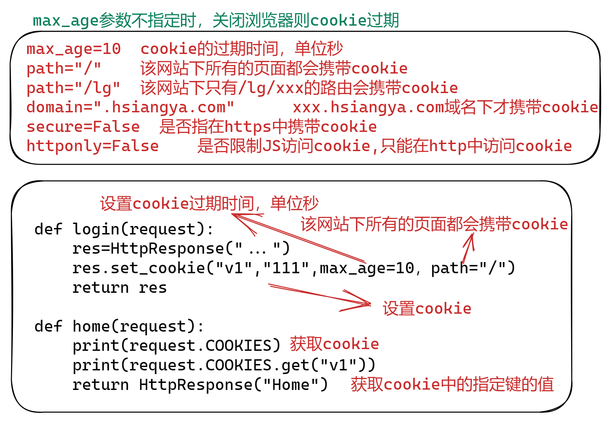

## session


### session存储到文件

```python
MIDDLEWARE = [
    'django.middleware.security.SecurityMiddleware',
    'django.contrib.sessions.middleware.SessionMiddleware',
    'django.middleware.common.CommonMiddleware',
    'django.middleware.csrf.CsrfViewMiddleware',
    # 'django.contrib.auth.middleware.AuthenticationMiddleware',
    # 'django.contrib.messages.middleware.MessageMiddleware',
    'django.middleware.clickjacking.XFrameOptionsMiddleware',
]

# session的引擎
SESSION_ENGINE = 'django.contrib.sessions.backends.file'
# session文件存储的位置，缓存文件，如果为None，则使用tempfile获取一个临时地址tempfile.gettempdir() 
SESSION_FILE_PATH = 'xxxx' 

SESSION_COOKIE_NAME = "sid"  # Session的cookie保存在浏览器上时的key，即：sessionid＝随机字符串
SESSION_COOKIE_PATH = "/"  # Session的cookie保存的路径
SESSION_COOKIE_DOMAIN = None  # Session的cookie保存的域名
SESSION_COOKIE_SECURE = False  # 是否Https传输cookie
SESSION_COOKIE_HTTPONLY = True  # 是否Session的cookie只支持http传输
SESSION_COOKIE_AGE = 1209600  # Session的cookie失效日期（2周）

SESSION_EXPIRE_AT_BROWSER_CLOSE = False  # 是否关闭浏览器使得Session过期
SESSION_SAVE_EVERY_REQUEST = True  # 是否每次请求都保存Session，默认修改之后才保存
```

### 存储到数据库中

```python
INSTALLED_APPS = [
    # 'django.contrib.admin',
    # 'django.contrib.auth',
    # 'django.contrib.contenttypes',
    'django.contrib.sessions',
    # 'django.contrib.messages',
    'django.contrib.staticfiles',
    "app01.apps.App01Config",
]

MIDDLEWARE = [
    'django.middleware.security.SecurityMiddleware',
    'django.contrib.sessions.middleware.SessionMiddleware',
    'django.middleware.common.CommonMiddleware',
    'django.middleware.csrf.CsrfViewMiddleware',
    # 'django.contrib.auth.middleware.AuthenticationMiddleware',
    # 'django.contrib.messages.middleware.MessageMiddleware',
    'django.middleware.clickjacking.XFrameOptionsMiddleware',
]


# session
SESSION_ENGINE = 'django.contrib.sessions.backends.db'

SESSION_COOKIE_NAME = "sid"  # Session的cookie保存在浏览器上时的key，即：sessionid＝随机字符串
SESSION_COOKIE_PATH = "/"  # Session的cookie保存的路径
SESSION_COOKIE_DOMAIN = None  # Session的cookie保存的域名
SESSION_COOKIE_SECURE = False  # 是否Https传输cookie
SESSION_COOKIE_HTTPONLY = True  # 是否Session的cookie只支持http传输
SESSION_COOKIE_AGE = 1209600  # Session的cookie失效日期（2周）

SESSION_EXPIRE_AT_BROWSER_CLOSE = False  # 是否关闭浏览器使得Session过期
SESSION_SAVE_EVERY_REQUEST = True  # 是否每次请求都保存Session，默认修改之后才保存
```

### 存储到缓存

```python
INSTALLED_APPS = [
    # 'django.contrib.admin',
    # 'django.contrib.auth',
    # 'django.contrib.contenttypes',
    # 'django.contrib.sessions',
    # 'django.contrib.messages',
    'django.contrib.staticfiles',
    "app01.apps.App01Config",
]

MIDDLEWARE = [
    'django.middleware.security.SecurityMiddleware',
    'django.contrib.sessions.middleware.SessionMiddleware',
    'django.middleware.common.CommonMiddleware',
    'django.middleware.csrf.CsrfViewMiddleware',
    # 'django.contrib.auth.middleware.AuthenticationMiddleware',
    # 'django.contrib.messages.middleware.MessageMiddleware',
    'django.middleware.clickjacking.XFrameOptionsMiddleware',
]


# session
SESSION_ENGINE = 'django.contrib.sessions.backends.cache'
SESSION_CACHE_ALIAS = 'default' 

SESSION_COOKIE_NAME = "sid"  # Session的cookie保存在浏览器上时的key，即：sessionid＝随机字符串
SESSION_COOKIE_PATH = "/"  # Session的cookie保存的路径
SESSION_COOKIE_DOMAIN = None  # Session的cookie保存的域名
SESSION_COOKIE_SECURE = False  # 是否Https传输cookie
SESSION_COOKIE_HTTPONLY = True  # 是否Session的cookie只支持http传输
SESSION_COOKIE_AGE = 1209600  # Session的cookie失效日期（2周）

SESSION_EXPIRE_AT_BROWSER_CLOSE = False  # 是否关闭浏览器使得Session过期
SESSION_SAVE_EVERY_REQUEST = True  # 是否每次请求都保存Session，默认修改之后才保存
```

# 配置redis

`pip install django-redis`

```python
CACHES = {
    "default": {
        "BACKEND": "django_redis.cache.RedisCache",
        "LOCATION": "redis://127.0.0.1:6379",
        "OPTIONS": {
            "CLIENT_CLASS": "django_redis.client.DefaultClient",
            "CONNECTION_POOL_KWARGS": {"max_connections": 100}
            # "PASSWORD": "密码",
        }
    }
}
```

**手动操作redis：**

```python
from django_redis import get_redis_connection

conn = get_redis_connection("default")
conn.set("xx","123123")
conn.get("xx")
```

# 文件存储

- 默认情况下，Django使用MEDIA_ROOT和MEDIA_RUL设置本地存储。
- 可以编写自定义file storage systems方法，允许自定义Django存储文件的位置和方式
- 如果不显示提供存储系统，Django的默认文件存储通过DEFAULT_FILE_STORAGE配置

## storge

| 方法                 | 说明                                                         |
| -------------------- | ------------------------------------------------------------ |
| exists()             | 判断指定的文件是否存在                                       |
| open()               | 以只当模式打开指定的文件，返回File对象                       |
| save()               | 将指定的文件内容写入到指定的文件中，content可以是文件对象或字符串 |
| delete()             | 删除指定的文件                                               |
| get_valid_name()     | 将指定文件名规范化为合法的文件名                             |
| get_available_name() | 获取一个可用的，唯一的文件名                                 |
| path()               | 返回指定我呢见的本地文件路径系统                             |
| url()                | 返回指定我呢见的可访问url,用于将文件提供给用户访问           |

## 文件对象的操作方法

| 方法                  | 说明                                                         |
| --------------------- | ------------------------------------------------------------ |
| close()               | 关闭文件对象，释放资源                                       |
| read(size)            | 从文件中读取指定大小的数据，默认-1读取整个文件               |
| readline(size)        | 从文件中读取一行的数据，size表示读取的数据大小，默认-1，表示读取整行 |
| readlines(hint)       | 从我呢见中读取多行数据并返回列表，hint表示要读取的数据大小，默认-1，表示读取所有数据 |
| write(s)              | 将指定字符串或字节串写入文件中                               |
| writelines(lines)     | 将指定列表中的所有字符串或字节串写入文件中                   |
| seek(offest[,whence]) | 将文件指针移动到指定位置，offset表示偏移量，whence表示起始位置（默认为0，表示从起始位置，1表示从当前位置，2表示从文件结尾位置） |
| tell()                | 返回当前文件指针的位置                                       |
| truncate(size=None)   | 阶段文件到指定大小，size表示大小，不指定则阶段文件到当前指针位置 |
| flush()               | 刷新文件缓冲区                                               |
| fileno()              | 返回我呢见的文件描述符                                       |
| isatty()              | 判断文件是否是终端设备                                       |
| seekable()            | 判断我呢见是否支持随机访问                                   |
| readbale()            | 判断文件是否可读                                             |
| writable()            | 判断文件是否可写                                             |
| chuncks(size)         | 读取数据的指定块，size是字节大小                             |

