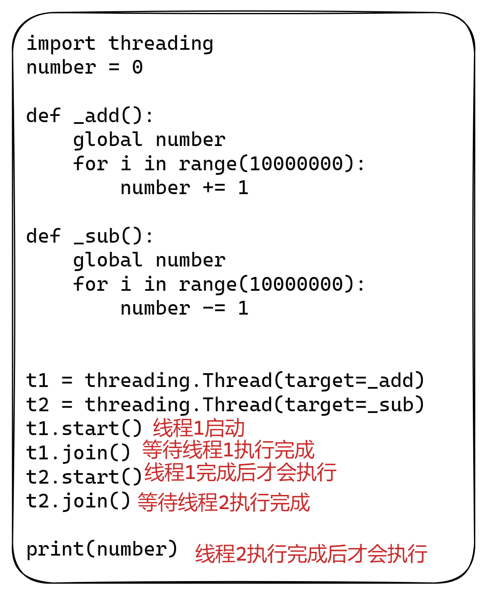
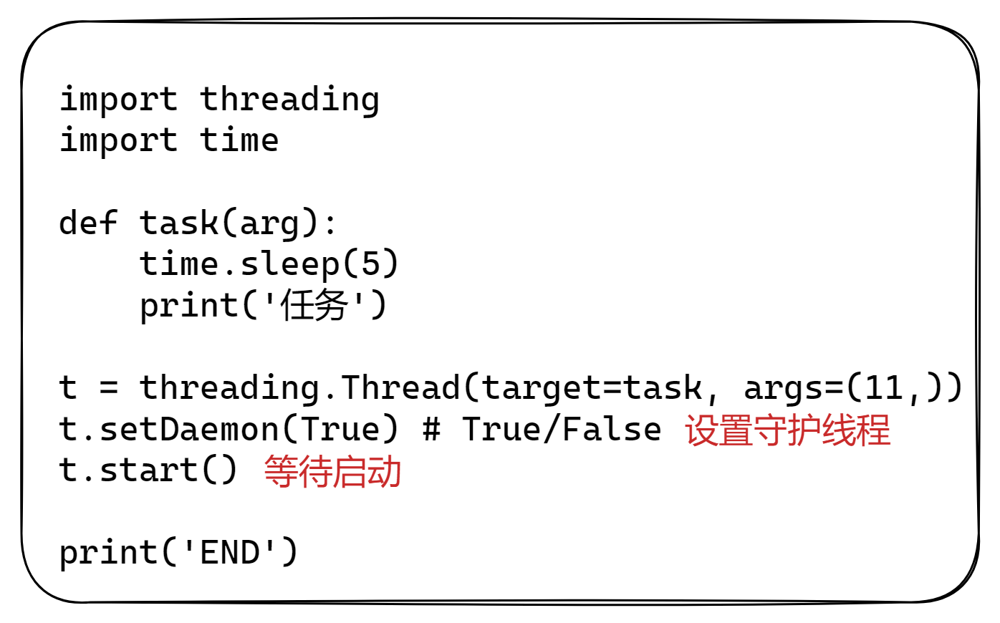
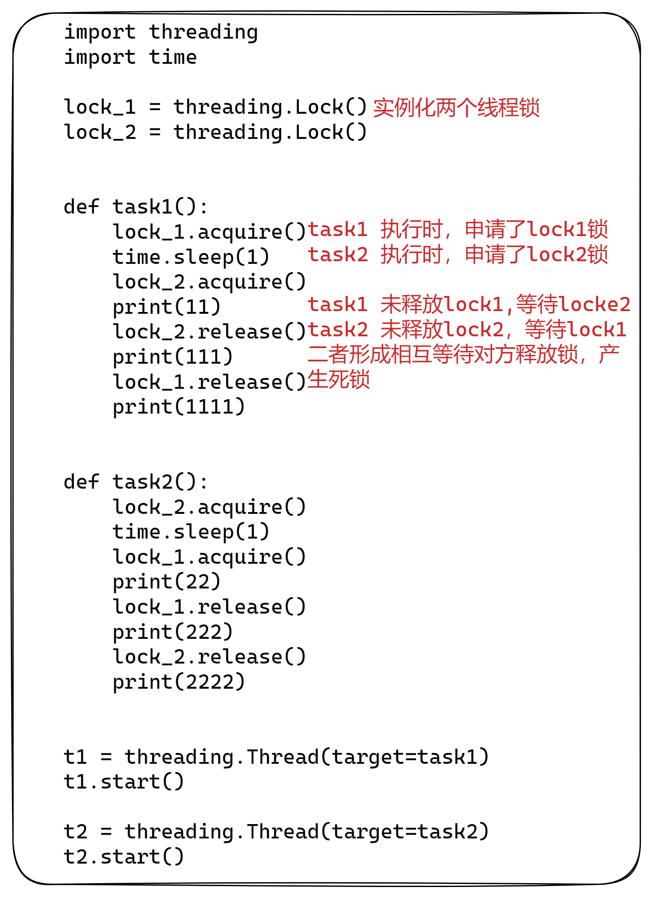
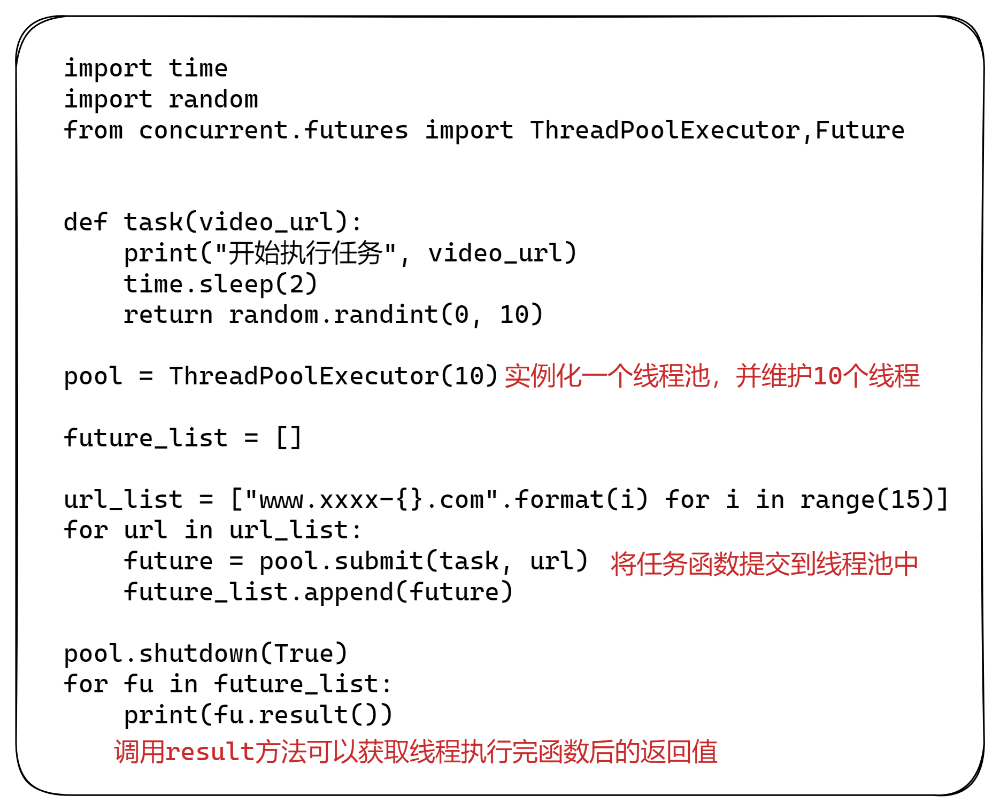
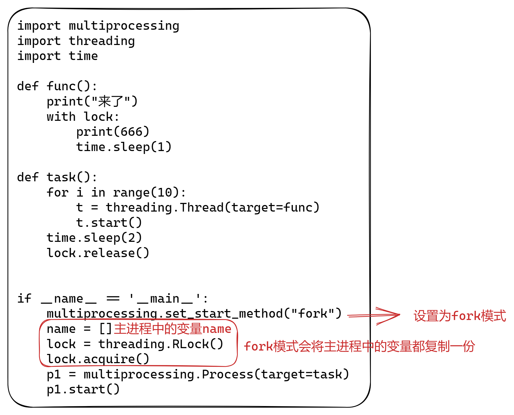
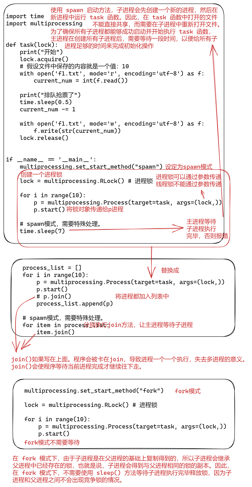
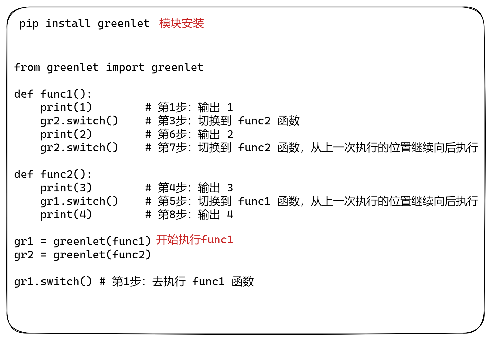
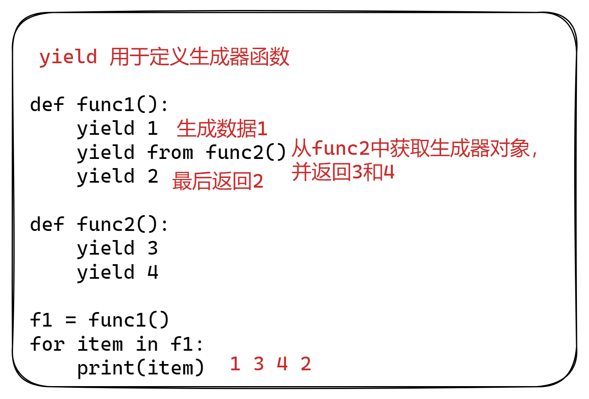

# 多线程与多进程

## 概念

- 线程：计算机中可以被CPU调度的最小单元
- 进程：一个进程中可以有多个线程，同一个进程中的线程可以共享此进程中的资源
- 协程：协程也可以被称为微线程，是一种用户态内的上下文切换技术。通过一个线程实现代码块相互切换执行。是程序员通过代码搞出来的一个东西（非真实存在）。
- 一个进程中可以有多个线程,同一个进程中的线程可以共享此进程中的资源。

由于CPython中GIL的存在：
	- 线程，适用于IO密集型操作。
    - 进程，适用于计算密集型操作。

协程，协程也可以被称为微线程，是一种用户态内的上下文切换技术，在开发中结合遇到IO自动切换，就可以通过一个线程实现并发操作。所以，在处理IO操作时，协程比线程更加节省开销（协程的开发难度大一些）。

GIL（全局解释器锁）是 Python 解释器的一种机制，它是一把互斥锁，保证同一时刻只有一个线程在执行 Python 代码。换句话说，GIL 使得同一时刻只有一个线程在解释和执行 Python 的字节码，因此，它会限制多线程在同一时刻并行执行的能力。

这是因为在 Python 解释器中，所有的 Python 对象都被保存在一个全局对象表中。当一个线程想要修改任何对象时，它必须先获得 GIL 锁，以保证其他线程不能同时访问该对象。因此，GIL 锁可以确保 Python 解释器的线程安全性，但也会导致多线程并行执行 Python 代码时效率下降。

因此，如果要在 Python 中实现高并发的程序，使用多线程并不是最好的选择。可以考虑使用多进程、协程、异步编程等技术来实现。但是在 CPU 密集型的任务中，使用多线程仍然是一种有效的选择，因为 GIL 只在解释 Python 代码时起作用，而不影响 CPU 计算的并行执行。

## 队列（Queue）

Python 中的 Queue 模块实现了多生产者和多消费者模型，当需要在多线程编程中非常实用。而且该模块中的 Queue 类实现了锁原语，不需要再考虑多线程安全问题。该模块内置了三种类型的 Queue，分别是

- queue.Queue(maxsize=0) ，

- queue.LifoQueue(maxsize=0)

- queue.PriorityQueue(maxsize=0)

它们三个的区别仅仅是取出时的顺序不一致而已。

| 方法          | 说明         |
| ------------- | ------------ |
| Queue         | 先进先出队列 |
| LifoQueue     | 后进先出队列 |
| PriorityQueue | 优先级队列   |
| deque         | 双线队列     |

### Queue

```python
class Queue:
    def __init__(self, maxsize=0):
        # 最大支持的队列长度
        self.maxsize = maxsize
       	# 初始化队列
        self._init(maxsize)
        # 实例化一个互斥锁
        self.mutex = threading.Lock()
        self.not_empty = threading.Condition(self.mutex)
        self.not_full = threading.Condition(self.mutex)
        self.all_tasks_done = threading.Condition(self.mutex)
        self.unfinished_tasks = 0
```

## 多线程


### threading

#### 方法汇总

| 方法          | 说明                                       |
| ------------- | ------------------------------------------ |
| start()       | 线程准备就绪，等待启动。                   |
| join()        | 等待当前线程的任务执行完毕后再向下继续执行 |
| `setDaemon()` | 设置是否守护线程                           |
| `setName()`   | 设置线程名称(需要再start前)                |
| `getName()`   | 获取线程名称                               |
| enumerate()   | 列举当前线程                               |

#### start

```python
# 创建线程
thread1 = threading.Thread(target=function()，args=("xxx",))
# 启动线程
thread1.start()
thread2 = threading.Thread(target=upload)
thread2.start()
```

- start()，当前线程准备就绪(等待CPU调度，具体时间是由CPU来决定)

#### join



- join()：等待当前线程的任务完毕后再向下继续执行

#### setDaemon

格式：`setDaemon(布尔值)`

- `setDaemon(True)`：设置为守护线程，主线程执行完毕后，子线程也自动关闭
- `setDaemon(False)`：设置为非守护线程，主线程等待子线程，子线程执行完毕后，主线程才结束(默认)




#### enumerate

```python
def enumerate():
    with _active_limbo_lock:
        return list(_active.values()) + list(_limbo.values())
```


### 自定义线程类

```python
import threading
# 继承自Thread类
class MyThread(threading.Thread):
    # 重写run方法
    def run(self):
        print('执行此线程', self._args)
# 实例化并将参数传入
t = MyThread(args=(100,))
t.start()
```

### 线程安全

- `threading.RLock()`：递归锁，可重锁对象。支持多次申请锁和多次释放。
- `threading.Lock()`：同步锁，不可冲所对象。不支持多次申请锁。

| 方法      | 说明   |
| --------- | ------ |
| acquire() | 申请锁 |
| release() | 释放锁 |

**死锁**

由于竞争资源或者由于彼此通信而造成的一种阻塞的现象。

- 死锁一：Lock()锁同事acquire()申请两次，导致死锁

  

- 死锁二：两个线程同时等待对方释放锁，产生死锁。

  

### 线程池

| 方法                | 说明                                         |
| ------------------- | -------------------------------------------- |
| submit()            | 向线程池提交任务                             |
| shutdown()          | 是否等待线程池任务执行完，再继续执行后续任务 |
| add_done_callback() | 线程完成后的回调函数                         |
| result()            | 获取任务结束后的结果                         |




res.result()为线程任务结束后的返回结果

### Thread

```python
 _initialized = False

    def __init__(self, group=None, target=None, name=None,
                 args=(), kwargs=None, *, daemon=None):
        assert group is None, "group argument must be None for now"
        if kwargs is None:
            kwargs = {}
        self._target = target
        self._name = str(name or _newname())
        self._args = args
        self._kwargs = kwargs
        if daemon is not None:
            self._daemonic = daemon
        else:
            self._daemonic = current_thread().daemon
        self._ident = None
        if _HAVE_THREAD_NATIVE_ID:
            self._native_id = None
        self._tstate_lock = None
        self._started = Event()
        self._is_stopped = False
        self._initialized = True
        # Copy of sys.stderr used by self._invoke_excepthook()
        self._stderr = _sys.stderr
        self._invoke_excepthook = _make_invoke_excepthook()
        # For debugging and _after_fork()
        _dangling.add(self)
```

#### start

```python
def start(self):
	# 检查线程对象已被实例化
    if not self._initialized:
        raise RuntimeError("thread.__init__() not called")
	# 检查事件对象是否已被设置为激活状态
    if self._started.is_set():
        raise RuntimeError("threads can only be started once")
	# 创建一个上下文管理器，用于管理一些资源，在with语句块中，我们可以通过获取资源并使用它们，然后在退出with语句块时自动释放这些资源，以保证程序的正确性。
    with _active_limbo_lock:
        _limbo[self] = self
    try:
        _start_new_thread(self._bootstrap, ())
    except Exception:
        with _active_limbo_lock:
            del _limbo[self]
        raise
    self._started.wait()
```


## 多进程

进程是计算机中资源分配的最小单元：一个进程可以有多个线程，同一个进程中的线程共享资源，进程与进程之间相互隔离。

### 方法

| 方法               | 说明                                 |
| ------------------ | ------------------------------------ |
| start()            | 进程准备就绪，等待被CPU调度          |
| join()             | 等待当前进程执行完毕后再向下继续执行 |
| daemon = 布尔值    | 是否守护进程                         |
| xxx.name           | 设定或获取进程名称                   |
| cpu_count()        | 获取CPU个数                          |
| set_start_method() | 设定多进程模式                       |
| result()           | 获取任务结束后的结果                 |

```python
# 设定多进程模式
multiprocessing.set_start_method("spawn")

# 创建多线程
p = multiprocessing.Process(target=task, args=('xxx',))

# 设定进程名称
p.name = "哈哈哈哈"

# 开启守护进程
p.daemon = True

# 进程准备就绪
p.start()

# 获取进程名称
print(p.name = "哈哈哈哈")

# 获取CPU个数
multiprocessing.cpu_count()
```


### 自定义进程类

自定义进程类，直接将线程需要做的事写到run方法中。

```python
import multiprocessing


class MyProcess(multiprocessing.Process):
    def run(self):
        print('执行此进程', self._args)

if __name__ == '__main__':
    multiprocessing.set_start_method("spawn")
    p = MyProcess(args=('xxx',))
    p.start()
    print("继续执行...")

```

### 多进程模式

| 模式       | 说明                                                       |
| ---------- | ---------------------------------------------------------- |
| fork       | 拷贝几乎所有资源，支持文件对象/线程锁等传参，unix系统      |
| spawn      | 不支持文件对象/线程锁等传参，win、unix系统，main代码块开始 |
| forkserver | 不支持文件对象/线程锁等传参，部分unix，main代码块开始      |

#### fork

使用os.fork()函数复制当前进程，使得父进程和子进程同时执行不同的代码段。子进程完全复制了父进程的内存，包括变量和代码等。这种方式适合于在UNIX和Linux系统下运行，因为这些系统都支持fork()函数。

除了必要的启动资源外，其他变量，包，数据等都继承自父进程，并且是copy-on-write的，也就是共享了父进程的一些内存页，因此启动较快，但是由于大部分都用的父进程数据，所以是不安全的进程



#### spawn

在"spawn"模式下，父进程将通过在子进程中启动一个新的Python解释器来创建子进程。这个新的Python解释器会重新加载并执行子进程中的代码，并从中创建一个新的进程。子进程与父进程是完全独立的，它们不共享任何资源。这意味着在"spawn"模式下创建的子进程可以安全地在多个进程之间并行运行，而不必担心数据竞争或死锁等问题。

从头构建一个子进程，父进程的数据等拷贝到子进程空间内，拥有自己的Python解释器，所以需要重新加载一遍父进程的包，因此启动较慢，由于数据都是自己的，安全性较高

```python
import time
from multiprocessing import Process


def task(arg):
    time.sleep(2)
    print("执行中...")


if __name__ == '__main__':
    multiprocessing.set_start_method("spawn")
    p = Process(target=task, args=('xxx',))
    p.start()
    p.join()

    print("继续执行...")
```

#### forkserver

它是一种优化的启动子进程的方式，能够在多次启动子进程时避免不必要的资源浪费，特别是在使用大量内存的情况下。

具体来说，forkserver模式是这样工作的：在主进程中创建一个server进程，它会一直存在于整个程序的运行过程中，监听主进程的请求，根据请求创建新的子进程，然后将控制权交给这个子进程，子进程运行完毕后，会将控制权还给server进程，等待下一个请求的到来。

### 进程锁

如果多个进程抢占式去做某些操作时候，为了防止操作出问题，可以通过进程锁来避免。 



### 进程池

| 方法                | 说明                                                 |
| ------------------- | ---------------------------------------------------- |
| shutdown()          | 是否等待进程池中的任务都执行完毕后，再继续往后执行。 |
| submit()            | 向进程池提交任务                                     |
| add_done_callback() | 进程池完成后的回调函数                               |


## Queue

### 介绍

由于`Queue`类是线程安全的，而非进程安全的，因此在多进程编程中应该使用`multiprocessing.Queue`类来代替标准库中的`queue.Queue`类。`multiprocessing.Queue`类使用进程安全的方式实现队列，可以安全地在多个进程中进行读写操作。


### 简单使用


### 方法

| 方法                         | 说明                                       |
| ---------------------------- | ------------------------------------------ |
| qsize()                      | 返回当前队列包含的消息数量                 |
| empty()                      | 如果队列为空，返回True，反之False ；       |
| full()                       | 如果队列满了，返回True,反之False；         |
| get([block[, timeout]])      | 获取队列中的一条消息，然后将其从列队中移除 |
| get_nowait()                 | 相当Queue.get(False)；                     |
| put(item,[block[, timeout]]) | 将item消息写入队列，block默认值为True；    |
| put_nowait(item)             | 相当Queue.put(item, False)；               |

### put

```python
def put(self, obj, block=True, timeout=None):
    if self._closed:
        raise ValueError(f"Queue {self!r} is closed")
    if not self._sem.acquire(block, timeout):
        raise Full

    with self._notempty:
        if self._thread is None:
            self._start_thread()
        self._buffer.append(obj)
        self._notempty.notify()
```

## 协程





虽然上述两种都实现了协程，但这种编写代码的方式没啥意义。

这种来回切换执行，可能反倒让程序的执行速度更慢了（相比较于串行）。


# 魔法方法

魔法方法是面向对象的Python中的一切，可以定义为您的类添加“魔法”的特殊方法。它们总是被双下划线包围。这些特殊方法，它们允许我们的类和Python更好地集成。

在标准库参考（Standard Library Reference）中，它们被称为魔法方法(MagicMethods)，是与Python的其他特性无缝集成的基础。

## 构造和初始化

每个人都知道最基本的魔法方法，` __init__` 。这是我们可以定义对象的初始化行为的方式。但是，当类对象实例化的时候，`__init__`并不是第一个被调用的。

实际上，在这之前他会调用`__new__`实际创建实例对象，然后在初始化时将参数传递给初始化程序，在对象生命周期结束时，`__del__`会在对象销毁前自动调用。

构造与初始化方法，说白了就是对象的 **我是谁，我从哪里来，到哪里去。**

### 方法

| 初始化和构建            | 描述                   |
| ----------------------- | ---------------------- |
| `__new__(mcs, other)`   | 在对象的实例化中被调用 |
| `__init__(self, other)` | 使用 `__new__` 调用    |
| `__del__(self)`         | 删除方法               |


### `__new__`

- 语法：`__new__(cls[,...])`

`__new__ `是在对象的实例化中调用的第一个方法。它接受类，然后是它将传递给的任何其他参数`__init__` 。 `__new__ `很少使用，但它确实有其用途，尤其是在子类化不可变类型（如元组或字符串）时。

### `__init__`

- 语法：`__init__(self[,...])`

类的初始化器。无论调用什么主构造函数，它都会被传递（因此， `__init__ `在 Python 类定义中几乎普遍使用。

所有类的超类 object ，有一个默认包含 pass 的 `__init__() `实现，这个函数会在对象初始化的时候调用，我们可以选择实现，也可以选择不实现，一般建议是实现的，不实现对象属性就不会被初始化，

虽然我们仍然可以对其进行赋值，但是它已经成了隐式的了，编程时显示远比隐式的更好

### `__del__`

- 语法：`__del(self)`

如果 `__new__ `和 `__init__` 形成了对象的构造函数， `__del__` 就是析构函数。

它没有实现语句的行为del x （因此代码不会转换为 `x.__del__()` ）。相反，它定义了对象被垃圾收集时的行为。对于在删除时可能需要额外清理的对象（如套接字或文件对象），它可能非常有用。

但是要小心，因为当解释器退出时，如果对象仍然存在，则无法保证 `__del__ `会执行，因此 `__del__` 不能作为良好编码实践的替代品（例如在完成连接后始终关闭连接）。 事实上， `__del__ `几乎不应该使用它，因为它被称为不稳定的环境；谨慎使用它

## 属性操作方法

### 方法

| 属性操作魔法方法                 | 描述                         |
| -------------------------------- | ---------------------------- |
| `__getattr__(self, name)`        | 当类的访问属性不存在时调用   |
| `__getattribute__(self, item)`   | 定义该类的属性被访问时的行为 |
| `__setattr__(self, name, value)` | 在为类的属性赋值时调用       |
| `__delattr__(self, name)`        | 在删除类的属性时调用         |

### `__getattr__`

- 语法：`getattr(self, item)`

定义当用户试图获取一个不存在的属性的行为,当用户获取不存在的属性时，调用该方法。

### `__getattribute__`

- 语法：`__getattribute__(self, item)`

在实例化的对象进行属性或方法操作的时候，都会自动去调用`__getattribute__`方法。但是，如果某个属性在`__getattribute__`方法中未能找到，此时会调用`__getattr__`方法。

```python
class HttpRequest(object):
    def __init__(self):
        pass
    
    def v1(self):
        print("v1")
        
    def v2(self):
        print("v1")

class Request(object):
    def __init__(self,req, xx):
        self._request = req  # 定义_requeset对象为request对象
        self.xx = xx
        
    def __getattr__(self, attr):
        try:
            return getattr(self._request, attr)
        except AttributeError:
            return self.__getattribute__(attr)
        
request = HttpRequest()
request.v1()
request.v2()

request = Request(request,111)
request.v1()
"""
1. 执行v1时，当前对象中没有v1方法，执行__getattr__方法，attr参数为v1
2. __getattr__方法获取HttpRequest类对象中的v1，
"""
request.v2()
```

**总结：** 通过上述方法，可以实现Request类对HttpRequest类的封装，并能在调用方法时，优先调用Request类中的方法，若该类中没有，再调用HttpRequest类对象的方法。

### `__setattr__`

- 语法：`__setattr__(self, name, value)`

### `__delattr__`

- 语法：`__delattr__(self, name)`

## 字符串方法

### 方法

| 字符串魔法方法                | 描述                                               |
| ----------------------------- | -------------------------------------------------- |
| `__str__(self)`               | str()方法调用以返回类型的字符串表示形式            |
| `__repr__(self)`              | repr()方法调用，以返回类型的机器可读表示形式       |
| `__unicode__(self)`           | unicode() 方法调用以返回类型的 unicode 字符串      |
| `__format__(self, formatstr)` | string.format() 方法调用，以返回一个新样式的字符串 |
| `__hash__(self)`              | hash() 方法调用以返回整数                          |
| `__nonzero__(self)`           | bool() 方法调用以返回 True 或 False                |
| `__dir__(self)`               | dir() 方法调用以返回类的属性列表                   |
| `__sizeof__(self)`            | sys.getsizeof()方法调用，以返回对象的大小          |

## 类型转换方法

### 方法

| 类型转化魔法方法    | 描述                                      |
| ------------------- | ----------------------------------------- |
| `__int__(self)`     | int()方法调用来将类型转换为 int           |
| `__float__(self)`   | float()方法调用以将类型转换为 float       |
| `__complex__(self)` | Tcomplex() 方法调用以将类型转换为 complex |
| `__oct__(self)`     | oct() 方法调用以将类型转换为八进制        |
| `__hex__(self)`     | hex() 方法调用以将类型转换为十六进制      |
| `__index__(self)`   | 在切片中自动调用                          |
| `__trunc__(self)`   | math.trunc ()方法调用                     |

## 增强赋值

### 方法

| 增强赋值                     | 描述  |
| ---------------------------- | ----- |
| `__iadd__(self, other)`      | +=    |
| `__isub__(self, other)`      | -=    |
| `__imul__(self, other)`      | *=    |
| `__ifloordiv__(self, other)` | //=   |
| `__idiv__(self, other)`      | a /=b |
| `__itruediv__(self, other)`  |       |
| `__imod__(self, other)`      | %=    |
| `__ipow__(self, other)`      | **=   |
| `__ilshift__(self, other)`   | <<=   |
| `__irshift__(self, other)`   | >>=   |
| `__iand__(self, other)`      | &=    |
| `__ior__(self, other)`       | \|=   |
| `__ixor__(self, other)`      | ^=    |

## 一元运算符和函数

### 方法

| 一元运算符和函数    | 描述              |
| ------------------- | ----------------- |
| `__pos__(self)`     | +（正数）         |
| `__neg__(self)`     | - （负数）        |
| `__abs__(self)`     | abs() 函数        |
| `__invert__(self)`  | ~ 操作符          |
| `__round__(self,n)` | round() 取整      |
| `__floor__(self)`   | math.floor() 函数 |
| `__ceil__(self)`    | math.ceil() 函数  |
| `__trunc__(self)`   | math.trunc() 函数 |

## 运算方法

### 方法

| 运算魔法方法                     | 描述                       |
| -------------------------------- | -------------------------- |
| `__add__(self, other)`           | 使用 + 运算符在比较时调用  |
| `__sub__(self, other)`           | 使用 - 运算符在比较时调用  |
| `__mul__(self, other)`           | 使用 * 运算符在比较时调用  |
| `__floordiv__(self, other)`      | 使用 // 运算符在比较时调用 |
| `__divmod__(self, other)`        | 使用 / 运算符在比较时调用  |
| `__mod__(self, other)`           | 使用 % 运算符在比较时调用  |
| `__pow__(self, other[, modulo])` | 使用 ** 运算符在比较时调用 |
| `__lt__(self, other)`            | 使用 < 运算符在比较时调用  |
| `__le__(self, other)`            | 使用 <= 运算符在比较时调用 |
| `__eq__(self, other)`            | 使用 == 运算符在比较时调用 |
| `__ne__(self, other)`            | 使用 != 运算符在比较时调用 |
| `__ge__(self, other)`            | 使用 >= 运算符在比较时调用 |


# 反射

## 定义

反射就是通过字符串的形式，导入模块；通过字符串的形式，去模块寻找指定函数，并执行。利用字符串的形式去对象(模块)中操作(查找/获取/删除/添加)成员，一种基于字符串的事件驱动！

程序可以访问、检测和修改它本身状态或行为的一种能力。

## 方法

| 方法       | 说明 |
| ---------- | ---- |
| setattr    |      |
| getattr    |      |
| hasattr    |      |
| delattr    |      |
| delattr    |      |
| supper     |      |
| isinstance |      |
| issubclass |      |
| dir        |      |

## setattr

- 语法：`setattr(object, name, value)`

它和 `getattr()` 是一对。参数是一个对象，一个字符串和一个任意值。该字符串可以是现有的属性名或新的属性名。如果该对象允许，该函数将 value 分配给该属性。例如，`setattr(x, 'foobar', 123)` 等同于 `x.foobar = 123`。

## getattr

- 语法：`getattr(object, name[, default])`

返回 object 的指定属性的值。name 必须是字符串。如果字符串是 object 属性之一的名称，则结果是该属性的值。例如，`getattr(x, 'foobar')` 等同于 `x.foobar`。如果指定的属性不存在，则返回默认值（如果提供），否则引发 `AttributeError`。

## hasattr

- 语法：`hasattr(object, name)`

参数是一个对象和一个字符串。如果字符串是 object 属性之一的名称，则结果为 `True`，否则为 `False`。（这是通过调用 `getattr(object, name)` 并查看它是否引发 `AttributeError` 实现的。）

## delattr

- 语法：`delattr(object, name)`

参数是一个对象和一个字符串。该字符串必须是对象属性之一的名称。该函数删除指定的属性（只要该对象允许）。例如， `delattr(x, 'foobar')` 等价于 `del x.foobar`。

## supper

- 语法：`super([type[, object-or-type]])`

**super()** 是用来解决多重继承问题的，直接用类名调用父类方法在使用单继承的时候没问题，但是如果使用多继承，会涉及到查找顺序（MRO）、重复调用（钻石继承）等种种问题。

MRO 就是类的方法解析顺序表, 其实也就是继承父类方法时的顺序表。

返回一个代理对象，它委托方法给父类或者 type 的同级类。这对于访问类中被覆盖的继承方法很有用。搜索顺序与 `getattr()` 使用的顺序相同，只不过 type 本身被跳过。

type 的 `__mro__` 属性列出 `getattr()` 和 `super()` 使用的方法解析顺序。该属性是动态的，并且可以在继承层次结构更新时更改。

如果省略第二个参数，则返回的 super 对象是未绑定的。如果第二个参数是一个对象，则 `isinstance(obj, type)` 必须为 true。如果第二个参数是类型，则 `issubclass(type2, type)` 必须为 true（这对类方法很有用）。

super 有两种典型的使用情况。在具有单继承的类层次结构中，可以使用 super 来引用父类，而不必明确命名它们，从而使代码更易于维护。这种使用非常类似于在其他编程语言中 super 的使用。

第二种使用情况是在动态执行环境中支持协同多继承。这种使用情况是 Python 独有的，在静态编译语言或仅支持单继承的语言中找不到。这使得可以实现 “菱形图”，其中多个基类实现相同的方法。良好的设计指出此方法在每种情况下具有相同的调用顺序（因为调用的顺序在运行时确定，因为该顺序适应类层次结构中的更改，并且因为该顺序可以包括在运行时之前未知的兄弟类）。

对于这两种用例，典型的超类调用如下所示：

```
class C(B):
    def method(self, arg):
        super().method(arg)    # This does the same thing as:
                               # super(C, self).method(arg)

```

!> 注意，`super()` 只实现显式点分属性查找的绑定过程，例如 `super().__getitem__(name)`。它通过实现自己的 `__getattribute__()` 方法来实现这一点，以便以支持协同多继承需要的以可预测的顺序搜索类。因此，`super()` 没有定义隐式的查找语句或操作，例如 `super()[name]`。

!> 另请注意，除了零参数形式外，`super()` 不限于在方法内部使用。如果两个参数的形式指定了准确的参数，就能进行正确的引用。零参数形式只能在类定义中使用，因为编译器会填充必要的细节以正确检索正在定义的类，以及访问普通方法的当前实例。

## isinstance

- 语法：`isinstance(object, classinfo)`

如果 object 参数是 classinfo 参数的实例或其（直接，间接或虚拟）子类的实例，则返回 true。

如果object 不是给定类型的对象，则该函数总是返回 false。

如果 classinfo 是类型对象的元组， object 是其中任何一个类型的实例，则返回 true。

如果 classinfo 不是类型或一组类型的元组，则会引TypeError 异常。

```python
isinstance(10, int)  # True

isinstance("str", (int, str))  # True

isinstance(max, int)  # False

```

## issubclass

- 语法：`issubclass(class, classinfo)`

如果 class 是 classinfo 的子类（直接，间接或虚拟），则返回 true。一个类被认为是它自己的一个子类。 classinfo 可以是类对象的元组，在这种情况下，将检查 classinfo 中的每个条目。在任何其他情况下，都会引发 TypeError 异常。

```python
issubclass(int, int)  # True

issubclass(10, int)  # TypeError
```

## dir

- 语法：`dir([object])`

尝试返回 object 的有效属性列表。如果没有参数，则返回当前本地作用域中的名称列表。

如果对象具有名为 `__dir__() `的方法，则将调用此方法，并且必须返回属性列表。这允许实现自定义`__getattr__() `或 `__getattribute__() `函数的对象自定义 dir() 报告其属性。

默认的 dir() 机制对不同类型的对象有不同的表现，因为它试图产生最相关的信息，而不是完整的信息：

- 如果对象是模块对象，则列表包含模块属性的名称。

- 如果对象是一个类型或类对象，则该列表包含其属性的名称，并递归地显示其基础的属性。

- 否则，该列表包含对象的属性名称，其类属性的名称以及其类的基类的属性的递归。


# GC

## 基石

include/object.h

```C
#define _PyObject_HEAD_EXTRA            \
    struct _object *_ob_next;           \
    struct _object *_ob_prev;
    
typedef struct _object {
    _PyObject_HEAD_EXTRA   // 用于构造双向链表
    Py_ssize_t ob_refcnt;  // 引用计数器
    struct _typeobject *ob_type;    // 数据类型
} PyObject;
```

```C
typedef struct {
    PyObject ob_base;   // PyObject对象
    Py_ssize_t ob_size; /* Number of items in variable part，元素个数 */
} PyVarObject;
```

## float类型


## int类型

python3中的int实际上就是long类型。

###  结构体

include/longintrepr.h

```C
/* Long integer representation.
   The absolute value of a number is equal to
        SUM(for i=0 through abs(ob_size)-1) ob_digit[i] * 2**(SHIFT*i)
   Negative numbers are represented with ob_size < 0;
   zero is represented by ob_size == 0.
   In a normalized number, ob_digit[abs(ob_size)-1] (the most significant
   digit) is never zero.  Also, in all cases, for all valid i,
        0 <= ob_digit[i] <= MASK.
   The allocation function takes care of allocating extra memory
   so that ob_digit[0] ... ob_digit[abs(ob_size)-1] are actually available.

   CAUTION:  Generic code manipulating subtypes of PyVarObject has to
   aware that ints abuse  ob_size's sign bit.
*/

struct _longobject {
    PyObject_VAR_HEAD
    digit ob_digit[1];
};
```

include/longobject.h

```C
/* Long (arbitrary precision) integer object interface */

typedef struct _longobject PyLongObject; /* Revealed in longintrepr.h */
```

###  创建

```python
age = 19
```

当在python中创建一个整型数据时，则底层会触发他的如下源码。

Objects/longobject.c

```C
/* Create a new int object from a C long int */

PyObject *
PyLong_FromLong(long ival)
{
    PyLongObject *v;
    unsigned long abs_ival;
    unsigned long t;  /* unsigned so >> doesn't propagate sign bit */
    int ndigits = 0;
    int sign;
	// 检查是否在数字池范围： -5 <= value < 257
    CHECK_SMALL_INT(ival);

    if (ival < 0) {
        /* negate: can't write this as abs_ival = -ival since that
           invokes undefined behaviour when ival is LONG_MIN */
        abs_ival = 0U-(unsigned long)ival;
        sign = -1;
    }
    else {
        abs_ival = (unsigned long)ival;
        sign = ival == 0 ? 0 : 1;
    }

    /* Fast path for single-digit ints */
    if (!(abs_ival >> PyLong_SHIFT)) {
        v = _PyLong_New(1);
        if (v) {
            Py_SIZE(v) = sign;
            v->ob_digit[0] = Py_SAFE_DOWNCAST(
                abs_ival, unsigned long, digit);
        }
        return (PyObject*)v;
    }

#if PyLong_SHIFT==15
    /* 2 digits */
    if (!(abs_ival >> 2*PyLong_SHIFT)) {
        v = _PyLong_New(2);
        if (v) {
            Py_SIZE(v) = 2*sign;
            v->ob_digit[0] = Py_SAFE_DOWNCAST(
                abs_ival & PyLong_MASK, unsigned long, digit);
            v->ob_digit[1] = Py_SAFE_DOWNCAST(
                  abs_ival >> PyLong_SHIFT, unsigned long, digit);
        }
        return (PyObject*)v;
    }
#endif

    /* Larger numbers: loop to determine number of digits */
    t = abs_ival;
    while (t) {
        ++ndigits;
        t >>= PyLong_SHIFT;
    }
    v = _PyLong_New(ndigits);
    if (v != NULL) {
        digit *p = v->ob_digit;
        Py_SIZE(v) = ndigits*sign;
        t = abs_ival;
        while (t) {
            *p++ = Py_SAFE_DOWNCAST(
                t & PyLong_MASK, unsigned long, digit);
            t >>= PyLong_SHIFT;
        }
    }
    return (PyObject *)v;
}

#define NSMALLNEGINTS           5
#define NSMALLPOSINTS           257

#define CHECK_SMALL_INT(ival) \
    do if (-NSMALLNEGINTS <= ival && ival < NSMALLPOSINTS) { \
        return get_small_int((sdigit)ival); \
    } while(0)

static PyObject *
get_small_int(sdigit ival)
{
    PyObject *v;
    assert(-NSMALLNEGINTS <= ival && ival < NSMALLPOSINTS);
    v = (PyObject *)&small_ints[ival + NSMALLNEGINTS];
    // 引用计数器 + 1
    Py_INCREF(v);
#ifdef COUNT_ALLOCS
    if (ival >= 0)
        _Py_quick_int_allocs++;
    else
        _Py_quick_neg_int_allocs++;
#endif
    return v;
}


PyLongObject *
_PyLong_New(Py_ssize_t size)
{
    // 创建PyLongObject的指针变量
    PyLongObject *result;
    /* Number of bytes needed is: offsetof(PyLongObject, ob_digit) +
       sizeof(digit)*size.  Previous incarnations of this code used
       sizeof(PyVarObject) instead of the offsetof, but this risks being
       incorrect in the presence of padding between the PyVarObject header
       and the digits. */
    if (size > (Py_ssize_t)MAX_LONG_DIGITS) {
        PyErr_SetString(PyExc_OverflowError,
                        "too many digits in integer");
        return NULL;
    }
    // 根据long的长度进行开辟内存
    result = PyObject_MALLOC(offsetof(PyLongObject, ob_digit) +
                             size*sizeof(digit));
    if (!result) {
        PyErr_NoMemory();
        return NULL;
    }
    // 对内存中的数据进行初始化
    return (PyLongObject*)PyObject_INIT_VAR(result, &PyLong_Type, size);
}
```


include/objimpl.h

```C
#define PyObject_NewVar(type, typeobj, n) \
                ( (type *) _PyObject_NewVar((typeobj), (n)) )

static inline PyVarObject*
_PyObject_INIT_VAR(PyVarObject *op, PyTypeObject *typeobj, Py_ssize_t size)
{
    assert(op != NULL);
    // 初始化 ob_size，相当于op->ob_size = size
    Py_SIZE(op) = size;
    PyObject_INIT((PyObject *)op, typeobj);
    return op;
}

#define PyObject_INIT(op, typeobj) \
    _PyObject_INIT(_PyObject_CAST(op), (typeobj))

static inline PyObject*
_PyObject_INIT(PyObject *op, PyTypeObject *typeobj)
{
    assert(op != NULL);
    // 初始化 ob_type，相当于op->ob_type = typeobj
    Py_TYPE(op) = typeobj;
    if (PyType_GetFlags(typeobj) & Py_TPFLAGS_HEAPTYPE) {
        Py_INCREF(typeobj);
    }
    // 初始化引用
    _Py_NewReference(op);
    return op;
}
```


Objects/object.c

```C
/* Head of circular doubly-linked list of all objects.  These are linked
 * together via the _ob_prev and _ob_next members of a PyObject, which
 * exist only in a Py_TRACE_REFS build.
 */
// 环状的双向链表
static PyObject refchain = {&refchain, &refchain};

/* Insert op at the front of the list of all objects.  If force is true,
 * op is added even if _ob_prev and _ob_next are non-NULL already.  If
 * force is false amd _ob_prev or _ob_next are non-NULL, do nothing.
 * force should be true if and only if op points to freshly allocated,
 * uninitialized memory, or you've unlinked op from the list and are
 * relinking it into the front.
 * Note that objects are normally added to the list via _Py_NewReference,
 * which is called by PyObject_Init.  Not all objects are initialized that
 * way, though; exceptions include statically allocated type objects, and
 * statically allocated singletons (like Py_True and Py_None).
 */
void
_Py_AddToAllObjects(PyObject *op, int force)
{

    if (force || op->_ob_prev == NULL) {
        op->_ob_next = refchain._ob_next;
        op->_ob_prev = &refchain;
        refchain._ob_next->_ob_prev = op;
        refchain._ob_next = op;
    }
}

void
_Py_NewReference(PyObject *op)
{
    _Py_INC_REFTOTAL;

    // 对新开辟的内存中的的引用计数器初始化为1。
    op->ob_refcnt = 1;

    // 将新开辟的内存的指针添加到一个双向链表refchain中。
    _Py_AddToAllObjects(op, 1);

    _Py_INC_TPALLOCS(op);
}
```

### 引用

```python
v1 = 69
new_value = v1
```

当出现如下情景时，本质上会将已存在于refchain的结构体找到并让他的引用计数器+1

include/object.h

```C
/*
The macros Py_INCREF(op) and Py_DECREF(op) are used to increment or decrement
reference counts.  Py_DECREF calls the object's deallocator function when
the refcount falls to 0; for
objects that don't contain references to other objects or heap memory
this can be the standard function free().  Both macros can be used
wherever a void expression is allowed.  The argument must not be a
NULL pointer.  If it may be NULL, use Py_XINCREF/Py_XDECREF instead.
The macro _Py_NewReference(op) initialize reference counts to 1, and
in special builds (Py_REF_DEBUG, Py_TRACE_REFS) performs additional
bookkeeping appropriate to the special build.


static inline void _Py_INCREF(PyObject *op)
{
    _Py_INC_REFTOTAL;
    op->ob_refcnt++;
}

#define Py_INCREF(op) _Py_INCREF(_PyObject_CAST(op))
```

### 销毁

```python
v1 = 123
del v1 

或

def func():
    v2 = 8
func()
```

通过调用`del销毁对象`或 `函数执行完毕，函数内部的变量被销毁`，他们refchain中的数据都不是被直接销毁，而是找到各个值引用计数器 -1，只有引用计数器为0时，才会触发响应的销毁动作。

include/object.h

```C
#define Py_DECREF(op)                                   \
    do {                                                \
        PyObject *_py_decref_tmp = (PyObject *)(op);    \
        if (_Py_DEC_REFTOTAL  _Py_REF_DEBUG_COMMA       \
        --(_py_decref_tmp)->ob_refcnt != 0)             \
            _Py_CHECK_REFCNT(_py_decref_tmp)            \
        else                                            \
        _Py_Dealloc(_py_decref_tmp);                    \
    } while (0)
```

Objects/object.c

```CQL
void
_Py_Dealloc(PyObject *op)
{
    // 找int的析构函数 类型.tp_dealloc，但PyLong_type里面没有tp_dealloc，所以去父级PyBaseObject_Type中找tp_dealloc，即：object_dealloc，他的内部又调用了
    destructor dealloc = Py_TYPE(op)->tp_dealloc;
#ifdef Py_TRACE_REFS
    // 从refchain中踢出此对象
    _Py_ForgetReference(op);
#else
    _Py_INC_TPFREES(op);
#endif
    // 调用int的析构方法，去销毁对象.
    (*dealloc)(op);
}

void
_Py_ForgetReference(PyObject *op)
{
#ifdef SLOW_UNREF_CHECK
    PyObject *p;
#endif
    if (op->ob_refcnt < 0)
        Py_FatalError("UNREF negative refcnt");
    if (op == &refchain ||
        op->_ob_prev->_ob_next != op || op->_ob_next->_ob_prev != op) {
        fprintf(stderr, "* ob\n");
        _PyObject_Dump(op);
        fprintf(stderr, "* op->_ob_prev->_ob_next\n");
        _PyObject_Dump(op->_ob_prev->_ob_next);
        fprintf(stderr, "* op->_ob_next->_ob_prev\n");
        _PyObject_Dump(op->_ob_next->_ob_prev);
        Py_FatalError("UNREF invalid object");
    }
#ifdef SLOW_UNREF_CHECK
    for (p = refchain._ob_next; p != &refchain; p = p->_ob_next) {
        if (p == op)
            break;
    }
    if (p == &refchain) /* Not found */
        Py_FatalError("UNREF unknown object");
#endif
    // 在refchain链表中移除。
    op->_ob_next->_ob_prev = op->_ob_prev;
    op->_ob_prev->_ob_next = op->_ob_next;
    op->_ob_next = op->_ob_prev = NULL;
    _Py_INC_TPFREES(op);
}
```


Objects/typeobject.c

```C
static void
object_dealloc(PyObject *self)
{	
    // 调用int类型的 tp_free，即：PyObject_Del
    Py_TYPE(self)->tp_free(self);
}
```

Objects/obmalloc.c

```C
void
PyObject_Free(void *ptr)
{
    // 在内存中清除
    _PyObject.free(_PyObject.ctx, ptr);
}
```

#### 类型相关

Objects/longobjet.c

```C
PyTypeObject PyLong_Type = {
    PyVarObject_HEAD_INIT(&PyType_Type, 0)
    "int",                                      /* tp_name */
    offsetof(PyLongObject, ob_digit),           /* tp_basicsize */
    sizeof(digit),                              /* tp_itemsize */
    0,                                          /* tp_dealloc */
    0,                                          /* tp_vectorcall_offset */
    0,                                          /* tp_getattr */
    0,                                          /* tp_setattr */
    0,                                          /* tp_as_async */
    long_to_decimal_string,                     /* tp_repr */
    &long_as_number,                            /* tp_as_number */
    0,                                          /* tp_as_sequence */
    0,                                          /* tp_as_mapping */
    (hashfunc)long_hash,                        /* tp_hash */
    0,                                          /* tp_call */
    0,                                          /* tp_str */
    PyObject_GenericGetAttr,                    /* tp_getattro */
    0,                                          /* tp_setattro */
    0,                                          /* tp_as_buffer */
    Py_TPFLAGS_DEFAULT | Py_TPFLAGS_BASETYPE |
        Py_TPFLAGS_LONG_SUBCLASS,               /* tp_flags */
    long_doc,                                   /* tp_doc */
    0,                                          /* tp_traverse */
    0,                                          /* tp_clear */
    long_richcompare,                           /* tp_richcompare */
    0,                                          /* tp_weaklistoffset */
    0,                                          /* tp_iter */
    0,                                          /* tp_iternext */
    long_methods,                               /* tp_methods */
    0,                                          /* tp_members */
    long_getset,                                /* tp_getset */
    0,                                          /* tp_base */
    0,                                          /* tp_dict */
    0,                                          /* tp_descr_get */
    0,                                          /* tp_descr_set */
    0,                                          /* tp_dictoffset */
    0,                                          /* tp_init */
    0,                                          /* tp_alloc */
    long_new,                                   /* tp_new */
    PyObject_Del,                               /* tp_free */
};
```

Objects/typeobject.c

```C
PyTypeObject PyBaseObject_Type = {
    PyVarObject_HEAD_INIT(&PyType_Type, 0)
    "object",                                   /* tp_name */
    sizeof(PyObject),                           /* tp_basicsize */
    0,                                          /* tp_itemsize */
    object_dealloc,                             /* tp_dealloc */
    0,                                          /* tp_vectorcall_offset */
    0,                                          /* tp_getattr */
    0,                                          /* tp_setattr */
    0,                                          /* tp_as_async */
    object_repr,                                /* tp_repr */
    0,                                          /* tp_as_number */
    0,                                          /* tp_as_sequence */
    0,                                          /* tp_as_mapping */
    (hashfunc)_Py_HashPointer,                  /* tp_hash */
    0,                                          /* tp_call */
    object_str,                                 /* tp_str */
    PyObject_GenericGetAttr,                    /* tp_getattro */
    PyObject_GenericSetAttr,                    /* tp_setattro */
    0,                                          /* tp_as_buffer */
    Py_TPFLAGS_DEFAULT | Py_TPFLAGS_BASETYPE,   /* tp_flags */
    object_doc,                                 /* tp_doc */
    0,                                          /* tp_traverse */
    0,                                          /* tp_clear */
    object_richcompare,                         /* tp_richcompare */
    0,                                          /* tp_weaklistoffset */
    0,                                          /* tp_iter */
    0,                                          /* tp_iternext */
    object_methods,                             /* tp_methods */
    0,                                          /* tp_members */
    object_getsets,                             /* tp_getset */
    0,                                          /* tp_base */
    0,                                          /* tp_dict */
    0,                                          /* tp_descr_get */
    0,                                          /* tp_descr_set */
    0,                                          /* tp_dictoffset */
    object_init,                                /* tp_init */
    PyType_GenericAlloc,                        /* tp_alloc */
    object_new,                                 /* tp_new */
    PyObject_Del,                               /* tp_free */
};

```


###  优化机制

```C
#define NSMALLNEGINTS           5
#define NSMALLPOSINTS           257

#define CHECK_SMALL_INT(ival) \
    do if (-NSMALLNEGINTS <= ival && ival < NSMALLPOSINTS) { \
        return get_small_int((sdigit)ival); \
    } while(0)

static PyObject *
get_small_int(sdigit ival)
{
    PyObject *v;
    assert(-NSMALLNEGINTS <= ival && ival < NSMALLPOSINTS);
    v = (PyObject *)&small_ints[ival + NSMALLNEGINTS];
    // 引用计数器 + 1
    Py_INCREF(v);
#ifdef COUNT_ALLOCS
    if (ival >= 0)
        _Py_quick_int_allocs++;
    else
        _Py_quick_neg_int_allocs++;
#endif
    return v;
}
```


## str类型

### 结构体

include/bytesobject.h

```C
/* --- Unicode Type ------------------------------------------------------- */

/* ASCII-only strings created through PyUnicode_New use the PyASCIIObject
   structure. state.ascii and state.compact are set, and the data
   immediately follow the structure. utf8_length and wstr_length can be found
   in the length field; the utf8 pointer is equal to the data pointer. */
typedef struct {
    /* There are 4 forms of Unicode strings:

       - compact ascii:

         * structure = PyASCIIObject
         * test: PyUnicode_IS_COMPACT_ASCII(op)
         * kind = PyUnicode_1BYTE_KIND
         * compact = 1
         * ascii = 1
         * ready = 1
         * (length is the length of the utf8 and wstr strings)
         * (data starts just after the structure)
         * (since ASCII is decoded from UTF-8, the utf8 string are the data)

       - compact:

         * structure = PyCompactUnicodeObject
         * test: PyUnicode_IS_COMPACT(op) && !PyUnicode_IS_ASCII(op)
         * kind = PyUnicode_1BYTE_KIND, PyUnicode_2BYTE_KIND or
           PyUnicode_4BYTE_KIND
         * compact = 1
         * ready = 1
         * ascii = 0
         * utf8 is not shared with data
         * utf8_length = 0 if utf8 is NULL
         * wstr is shared with data and wstr_length=length
           if kind=PyUnicode_2BYTE_KIND and sizeof(wchar_t)=2
           or if kind=PyUnicode_4BYTE_KIND and sizeof(wchar_t)=4
         * wstr_length = 0 if wstr is NULL
         * (data starts just after the structure)

       - legacy string, not ready:

         * structure = PyUnicodeObject
         * test: kind == PyUnicode_WCHAR_KIND
         * length = 0 (use wstr_length)
         * hash = -1
         * kind = PyUnicode_WCHAR_KIND
         * compact = 0
         * ascii = 0
         * ready = 0
         * interned = SSTATE_NOT_INTERNED
         * wstr is not NULL
         * data.any is NULL
         * utf8 is NULL
         * utf8_length = 0

       - legacy string, ready:

         * structure = PyUnicodeObject structure
         * test: !PyUnicode_IS_COMPACT(op) && kind != PyUnicode_WCHAR_KIND
         * kind = PyUnicode_1BYTE_KIND, PyUnicode_2BYTE_KIND or
           PyUnicode_4BYTE_KIND
         * compact = 0
         * ready = 1
         * data.any is not NULL
         * utf8 is shared and utf8_length = length with data.any if ascii = 1
         * utf8_length = 0 if utf8 is NULL
         * wstr is shared with data.any and wstr_length = length
           if kind=PyUnicode_2BYTE_KIND and sizeof(wchar_t)=2
           or if kind=PyUnicode_4BYTE_KIND and sizeof(wchar_4)=4
         * wstr_length = 0 if wstr is NULL

       Compact strings use only one memory block (structure + characters),
       whereas legacy strings use one block for the structure and one block
       for characters.

       Legacy strings are created by PyUnicode_FromUnicode() and
       PyUnicode_FromStringAndSize(NULL, size) functions. They become ready
       when PyUnicode_READY() is called.

       See also _PyUnicode_CheckConsistency().
    */
    PyObject_HEAD
    Py_ssize_t length;          /* Number of code points in the string */
    Py_hash_t hash;             /* Hash value; -1 if not set */
    struct {
        /*
           SSTATE_NOT_INTERNED (0)
           SSTATE_INTERNED_MORTAL (1)
           SSTATE_INTERNED_IMMORTAL (2)

           If interned != SSTATE_NOT_INTERNED, the two references from the
           dictionary to this object are *not* counted in ob_refcnt.
         */
        unsigned int interned:2;
        /* Character size:

           - PyUnicode_WCHAR_KIND (0):

             * character type = wchar_t (16 or 32 bits, depending on the
               platform)

           - PyUnicode_1BYTE_KIND (1):

             * character type = Py_UCS1 (8 bits, unsigned)
             * all characters are in the range U+0000-U+00FF (latin1)
             * if ascii is set, all characters are in the range U+0000-U+007F
               (ASCII), otherwise at least one character is in the range
               U+0080-U+00FF

           - PyUnicode_2BYTE_KIND (2):

             * character type = Py_UCS2 (16 bits, unsigned)
             * all characters are in the range U+0000-U+FFFF (BMP)
             * at least one character is in the range U+0100-U+FFFF

           - PyUnicode_4BYTE_KIND (4):

             * character type = Py_UCS4 (32 bits, unsigned)
             * all characters are in the range U+0000-U+10FFFF
             * at least one character is in the range U+10000-U+10FFFF
         */
        unsigned int kind:3;
        /* Compact is with respect to the allocation scheme. Compact unicode
           objects only require one memory block while non-compact objects use
           one block for the PyUnicodeObject struct and another for its data
           buffer. */
        unsigned int compact:1;
        /* The string only contains characters in the range U+0000-U+007F (ASCII)
           and the kind is PyUnicode_1BYTE_KIND. If ascii is set and compact is
           set, use the PyASCIIObject structure. */
        unsigned int ascii:1;
        /* The ready flag indicates whether the object layout is initialized
           completely. This means that this is either a compact object, or
           the data pointer is filled out. The bit is redundant, and helps
           to minimize the test in PyUnicode_IS_READY(). */
        unsigned int ready:1;
        /* Padding to ensure that PyUnicode_DATA() is always aligned to
           4 bytes (see issue #19537 on m68k). */
        unsigned int :24;
    } state;
    wchar_t *wstr;              /* wchar_t representation (null-terminated) */
} PyASCIIObject;

/* Non-ASCII strings allocated through PyUnicode_New use the
   PyCompactUnicodeObject structure. state.compact is set, and the data
   immediately follow the structure. */
typedef struct {
    PyASCIIObject _base;
    Py_ssize_t utf8_length;     /* Number of bytes in utf8, excluding the
                                 * terminating \0. */
    char *utf8;                 /* UTF-8 representation (null-terminated) */
    Py_ssize_t wstr_length;     /* Number of code points in wstr, possible
                                 * surrogates count as two code points. */
} PyCompactUnicodeObject;

/* Strings allocated through PyUnicode_FromUnicode(NULL, len) use the
   PyUnicodeObject structure. The actual string data is initially in the wstr
   block, and copied into the data block using _PyUnicode_Ready. */
typedef struct {
    PyCompactUnicodeObject _base;
    union {
        void *any;
        Py_UCS1 *latin1;
        Py_UCS2 *ucs2;
        Py_UCS4 *ucs4;
    } data;                     /* Canonical, smallest-form Unicode buffer */
} PyUnicodeObject;
```

### 创建

```C
PyObject *
PyUnicode_Decode(const char *s,
                 Py_ssize_t size,
                 const char *encoding,
                 const char *errors)
{
    PyObject *buffer = NULL, *unicode;
    Py_buffer info;
    char buflower[11];   /* strlen("iso-8859-1\0") == 11, longest shortcut */
    if (encoding == NULL) {
        return PyUnicode_DecodeUTF8Stateful(s, size, errors, NULL);
    }

    /* Shortcuts for common default encodings */
    if (_Py_normalize_encoding(encoding, buflower, sizeof(buflower))) {
        char *lower = buflower;

        /* Fast paths */
        if (lower[0] == 'u' && lower[1] == 't' && lower[2] == 'f') {
            lower += 3;
            if (*lower == '_') {
                /* Match "utf8" and "utf_8" */
                lower++;
            }
            // 根据编码对输入的内容进行处理：utf-8编码
            if (lower[0] == '8' && lower[1] == 0) {
                return PyUnicode_DecodeUTF8Stateful(s, size, errors, NULL);
            }
            else if (lower[0] == '1' && lower[1] == '6' && lower[2] == 0) {
                return PyUnicode_DecodeUTF16(s, size, errors, 0);
            }
            else if (lower[0] == '3' && lower[1] == '2' && lower[2] == 0) {
                return PyUnicode_DecodeUTF32(s, size, errors, 0);
            }
        }
        else {
            if (strcmp(lower, "ascii") == 0
                || strcmp(lower, "us_ascii") == 0) {
                return PyUnicode_DecodeASCII(s, size, errors);
            }
    #ifdef MS_WINDOWS
            else if (strcmp(lower, "mbcs") == 0) {
                return PyUnicode_DecodeMBCS(s, size, errors);
            }
    #endif
            else if (strcmp(lower, "latin1") == 0
                     || strcmp(lower, "latin_1") == 0
                     || strcmp(lower, "iso_8859_1") == 0
                     || strcmp(lower, "iso8859_1") == 0) {
                return PyUnicode_DecodeLatin1(s, size, errors);
            }
        }
    }

    /* Decode via the codec registry */
    buffer = NULL;
    if (PyBuffer_FillInfo(&info, NULL, (void *)s, size, 1, PyBUF_FULL_RO) < 0)
        goto onError;
    buffer = PyMemoryView_FromBuffer(&info);
    if (buffer == NULL)
        goto onError;
    unicode = _PyCodec_DecodeText(buffer, encoding, errors);
    if (unicode == NULL)
        goto onError;
    if (!PyUnicode_Check(unicode)) {
        PyErr_Format(PyExc_TypeError,
                     "'%.400s' decoder returned '%.400s' instead of 'str'; "
                     "use codecs.decode() to decode to arbitrary types",
                     encoding,
                     Py_TYPE(unicode)->tp_name);
        Py_DECREF(unicode);
        goto onError;
    }
    Py_DECREF(buffer);
    return unicode_result(unicode);

  onError:
    Py_XDECREF(buffer);
    return NULL;
}

PyObject *
PyUnicode_DecodeUTF8Stateful(const char *s,
                             Py_ssize_t size,
                             const char *errors,
                             Py_ssize_t *consumed)
{
    return unicode_decode_utf8(s, size, _Py_ERROR_UNKNOWN, errors, consumed);
}

static PyObject *
unicode_decode_utf8(const char *s, Py_ssize_t size,
                    _Py_error_handler error_handler, const char *errors,
                    Py_ssize_t *consumed)
{
    _PyUnicodeWriter writer;
    const char *starts = s;
    const char *end = s + size;

    Py_ssize_t startinpos;
    Py_ssize_t endinpos;
    const char *errmsg = "";
    PyObject *error_handler_obj = NULL;
    PyObject *exc = NULL;

    if (size == 0) {
        if (consumed)
            *consumed = 0;
        _Py_RETURN_UNICODE_EMPTY();
    }

    /* ASCII is equivalent to the first 128 ordinals in Unicode. */
    if (size == 1 && (unsigned char)s[0] < 128) {
        if (consumed)
            *consumed = 1;
        return get_latin1_char((unsigned char)s[0]);
    }

    _PyUnicodeWriter_Init(&writer);
    writer.min_length = size;
    if (_PyUnicodeWriter_Prepare(&writer, writer.min_length, 127) == -1)
        goto onError;

    writer.pos = ascii_decode(s, end, writer.data);
    s += writer.pos;
    while (s < end) {
        Py_UCS4 ch;
        int kind = writer.kind;

        if (kind == PyUnicode_1BYTE_KIND) {
            if (PyUnicode_IS_ASCII(writer.buffer))
                ch = asciilib_utf8_decode(&s, end, writer.data, &writer.pos);
            else
                ch = ucs1lib_utf8_decode(&s, end, writer.data, &writer.pos);
        } else if (kind == PyUnicode_2BYTE_KIND) {
            ch = ucs2lib_utf8_decode(&s, end, writer.data, &writer.pos);
        } else {
            assert(kind == PyUnicode_4BYTE_KIND);
            ch = ucs4lib_utf8_decode(&s, end, writer.data, &writer.pos);
        }

        switch (ch) {
        case 0:
            if (s == end || consumed)
                goto End;
            errmsg = "unexpected end of data";
            startinpos = s - starts;
            endinpos = end - starts;
            break;
        case 1:
            errmsg = "invalid start byte";
            startinpos = s - starts;
            endinpos = startinpos + 1;
            break;
        case 2:
            if (consumed && (unsigned char)s[0] == 0xED && end - s == 2
                && (unsigned char)s[1] >= 0xA0 && (unsigned char)s[1] <= 0xBF)
            {
                /* Truncated surrogate code in range D800-DFFF */
                goto End;
            }
            /* fall through */
        case 3:
        case 4:
            errmsg = "invalid continuation byte";
            startinpos = s - starts;
            endinpos = startinpos + ch - 1;
            break;
        default:
            if (_PyUnicodeWriter_WriteCharInline(&writer, ch) < 0)
                goto onError;
            continue;
        }

        if (error_handler == _Py_ERROR_UNKNOWN)
            error_handler = _Py_GetErrorHandler(errors);

        switch (error_handler) {
        case _Py_ERROR_IGNORE:
            s += (endinpos - startinpos);
            break;

        case _Py_ERROR_REPLACE:
            if (_PyUnicodeWriter_WriteCharInline(&writer, 0xfffd) < 0)
                goto onError;
            s += (endinpos - startinpos);
            break;

        case _Py_ERROR_SURROGATEESCAPE:
        {
            Py_ssize_t i;

            if (_PyUnicodeWriter_PrepareKind(&writer, PyUnicode_2BYTE_KIND) < 0)
                goto onError;
            for (i=startinpos; i<endinpos; i++) {
                ch = (Py_UCS4)(unsigned char)(starts[i]);
                PyUnicode_WRITE(writer.kind, writer.data, writer.pos,
                                ch + 0xdc00);
                writer.pos++;
            }
            s += (endinpos - startinpos);
            break;
        }

        default:
            if (unicode_decode_call_errorhandler_writer(
                    errors, &error_handler_obj,
                    "utf-8", errmsg,
                    &starts, &end, &startinpos, &endinpos, &exc, &s,
                    &writer))
                goto onError;
        }
    }

End:
    if (consumed)
        *consumed = s - starts;

    Py_XDECREF(error_handler_obj);
    Py_XDECREF(exc);
    return _PyUnicodeWriter_Finish(&writer);

onError:
    Py_XDECREF(error_handler_obj);
    Py_XDECREF(exc);
    _PyUnicodeWriter_Dealloc(&writer);
    return NULL;
}


PyObject *
_PyUnicodeWriter_Finish(_PyUnicodeWriter *writer)
{
    PyObject *str;

    if (writer->pos == 0) {
        Py_CLEAR(writer->buffer);
        _Py_RETURN_UNICODE_EMPTY();
    }

    str = writer->buffer;
    writer->buffer = NULL;

    if (writer->readonly) {
        assert(PyUnicode_GET_LENGTH(str) == writer->pos);
        return str;
    }

    if (PyUnicode_GET_LENGTH(str) != writer->pos) {
        PyObject *str2;
        str2 = resize_compact(str, writer->pos);
        if (str2 == NULL) {
            Py_DECREF(str);
            return NULL;
        }
        str = str2;
    }

    assert(_PyUnicode_CheckConsistency(str, 1));
    return unicode_result_ready(str);
}

static PyObject*
resize_compact(PyObject *unicode, Py_ssize_t length)
{
    Py_ssize_t char_size;
    Py_ssize_t struct_size;
    Py_ssize_t new_size;
    int share_wstr;
    PyObject *new_unicode;
#ifdef Py_DEBUG
    Py_ssize_t old_length = _PyUnicode_LENGTH(unicode);
#endif

    assert(unicode_modifiable(unicode));
    assert(PyUnicode_IS_READY(unicode));
    assert(PyUnicode_IS_COMPACT(unicode));

    char_size = PyUnicode_KIND(unicode);
    if (PyUnicode_IS_ASCII(unicode))
        struct_size = sizeof(PyASCIIObject);
    else
        struct_size = sizeof(PyCompactUnicodeObject);
    share_wstr = _PyUnicode_SHARE_WSTR(unicode);

    if (length > ((PY_SSIZE_T_MAX - struct_size) / char_size - 1)) {
        PyErr_NoMemory();
        return NULL;
    }
    new_size = (struct_size + (length + 1) * char_size);

    if (_PyUnicode_HAS_UTF8_MEMORY(unicode)) {
        PyObject_DEL(_PyUnicode_UTF8(unicode));
        _PyUnicode_UTF8(unicode) = NULL;
        _PyUnicode_UTF8_LENGTH(unicode) = 0;
    }
    _Py_DEC_REFTOTAL;
    _Py_ForgetReference(unicode);

    new_unicode = (PyObject *)PyObject_REALLOC(unicode, new_size);
    if (new_unicode == NULL) {
        _Py_NewReference(unicode);
        PyErr_NoMemory();
        return NULL;
    }
    unicode = new_unicode;
    _Py_NewReference(unicode);

    _PyUnicode_LENGTH(unicode) = length;
    if (share_wstr) {
        _PyUnicode_WSTR(unicode) = PyUnicode_DATA(unicode);
        if (!PyUnicode_IS_ASCII(unicode))
            _PyUnicode_WSTR_LENGTH(unicode) = length;
    }
    else if (_PyUnicode_HAS_WSTR_MEMORY(unicode)) {
        PyObject_DEL(_PyUnicode_WSTR(unicode));
        _PyUnicode_WSTR(unicode) = NULL;
        if (!PyUnicode_IS_ASCII(unicode))
            _PyUnicode_WSTR_LENGTH(unicode) = 0;
    }
#ifdef Py_DEBUG
    unicode_fill_invalid(unicode, old_length);
#endif
    PyUnicode_WRITE(PyUnicode_KIND(unicode), PyUnicode_DATA(unicode),
                    length, 0);
    assert(_PyUnicode_CheckConsistency(unicode, 0));
    return unicode;
}

static PyObject*
unicode_result_ready(PyObject *unicode)
{
    Py_ssize_t length;

    length = PyUnicode_GET_LENGTH(unicode);
    if (length == 0) {
        if (unicode != unicode_empty) {
            Py_DECREF(unicode);
            _Py_RETURN_UNICODE_EMPTY();
        }
        return unicode_empty;
    }

    if (length == 1) {
        void *data = PyUnicode_DATA(unicode);
        int kind = PyUnicode_KIND(unicode);
        Py_UCS4 ch = PyUnicode_READ(kind, data, 0);
        if (ch < 256) {
            PyObject *latin1_char = unicode_latin1[ch];
            if (latin1_char != NULL) {
                if (unicode != latin1_char) {
                    Py_INCREF(latin1_char);
                    Py_DECREF(unicode);
                }
                return latin1_char;
            }
            else {
                assert(_PyUnicode_CheckConsistency(unicode, 1));
                Py_INCREF(unicode);
                unicode_latin1[ch] = unicode;
                return unicode;
            }
        }
    }

    assert(_PyUnicode_CheckConsistency(unicode, 1));
    return unicode;
}
```

### 引用

同上

###  销毁

Objects/unicodeobject.c

```C
static void
unicode_dealloc(PyObject *unicode)
{
    switch (PyUnicode_CHECK_INTERNED(unicode)) {
    case SSTATE_NOT_INTERNED:
        break;

    case SSTATE_INTERNED_MORTAL:
        /* revive dead object temporarily for DelItem */
        Py_REFCNT(unicode) = 3;
        if (PyDict_DelItem(interned, unicode) != 0)
            Py_FatalError(
                "deletion of interned string failed");
        break;

    case SSTATE_INTERNED_IMMORTAL:
        Py_FatalError("Immortal interned string died.");
        /* fall through */

    default:
        Py_FatalError("Inconsistent interned string state.");
    }

    if (_PyUnicode_HAS_WSTR_MEMORY(unicode))
        PyObject_DEL(_PyUnicode_WSTR(unicode));
    if (_PyUnicode_HAS_UTF8_MEMORY(unicode))
        PyObject_DEL(_PyUnicode_UTF8(unicode));
    if (!PyUnicode_IS_COMPACT(unicode) && _PyUnicode_DATA_ANY(unicode))
        PyObject_DEL(_PyUnicode_DATA_ANY(unicode));

    Py_TYPE(unicode)->tp_free(unicode);
}

PyTypeObject PyUnicode_Type = {
    PyVarObject_HEAD_INIT(&PyType_Type, 0)
    "str",                        /* tp_name */
    sizeof(PyUnicodeObject),      /* tp_basicsize */
    0,                            /* tp_itemsize */
    /* Slots */
    (destructor)unicode_dealloc,  /* tp_dealloc */
    0,                            /* tp_vectorcall_offset */
    0,                            /* tp_getattr */
    0,                            /* tp_setattr */
    0,                            /* tp_as_async */
    unicode_repr,                 /* tp_repr */
    &unicode_as_number,           /* tp_as_number */
    &unicode_as_sequence,         /* tp_as_sequence */
    &unicode_as_mapping,          /* tp_as_mapping */
    (hashfunc) unicode_hash,      /* tp_hash*/
    0,                            /* tp_call*/
    (reprfunc) unicode_str,       /* tp_str */
    PyObject_GenericGetAttr,      /* tp_getattro */
    0,                            /* tp_setattro */
    0,                            /* tp_as_buffer */
    Py_TPFLAGS_DEFAULT | Py_TPFLAGS_BASETYPE |
    Py_TPFLAGS_UNICODE_SUBCLASS,   /* tp_flags */
    unicode_doc,                  /* tp_doc */
    0,                            /* tp_traverse */
    0,                            /* tp_clear */
    PyUnicode_RichCompare,        /* tp_richcompare */
    0,                            /* tp_weaklistoffset */
    unicode_iter,                 /* tp_iter */
    0,                            /* tp_iternext */
    unicode_methods,              /* tp_methods */
    0,                            /* tp_members */
    0,                            /* tp_getset */
    &PyBaseObject_Type,           /* tp_base */
    0,                            /* tp_dict */
    0,                            /* tp_descr_get */
    0,                            /* tp_descr_set */
    0,                            /* tp_dictoffset */
    0,                            /* tp_init */
    0,                            /* tp_alloc */
    unicode_new,                  /* tp_new */
    PyObject_Del,                 /* tp_free */
};


```


###  优化机制

- 单ascii字符
- 常见字符串缓冲

```C
void
PyUnicode_InternInPlace(PyObject **p)
{
    PyObject *s = *p;
    PyObject *t;
#ifdef Py_DEBUG
    assert(s != NULL);
    assert(_PyUnicode_CHECK(s));
#else
    if (s == NULL || !PyUnicode_Check(s))
        return;
#endif
    /* If it's a subclass, we don't really know what putting
       it in the interned dict might do. */
    if (!PyUnicode_CheckExact(s))
        return;
    if (PyUnicode_CHECK_INTERNED(s))
        return;
    if (interned == NULL) {
        interned = PyDict_New();
        if (interned == NULL) {
            PyErr_Clear(); /* Don't leave an exception */
            return;
        }
    }
    Py_ALLOW_RECURSION
    t = PyDict_SetDefault(interned, s, s);
    Py_END_ALLOW_RECURSION
    if (t == NULL) {
        PyErr_Clear();
        return;
    }
    if (t != s) {
        Py_INCREF(t);
        Py_SETREF(*p, t);
        return;
    }
    /* The two references in interned are not counted by refcnt.
       The deallocator will take care of this */
    Py_REFCNT(s) -= 2;
    _PyUnicode_STATE(s).interned = SSTATE_INTERNED_MORTAL;
}

```


## list类型

### 结构体

include/listobject.h

```C
typedef struct {
    PyObject_VAR_HEAD
    /* Vector of pointers to list elements.  list[0] is ob_item[0], etc. */
    PyObject **ob_item;

    /* ob_item contains space for 'allocated' elements.  The number
     * currently in use is ob_size.
     * Invariants:
     *     0 <= ob_size <= allocated
     *     len(list) == ob_size
     *     ob_item == NULL implies ob_size == allocated == 0
     * list.sort() temporarily sets allocated to -1 to detect mutations.
     *
     * Items must normally not be NULL, except during construction when
     * the list is not yet visible outside the function that builds it.
     */
    Py_ssize_t allocated;
} PyListObject;
```

###  创建

```C
#ifndef PyList_MAXFREELIST
#define PyList_MAXFREELIST 80
#endif
static PyListObject *free_list[PyList_MAXFREELIST];
static int numfree = 0;

PyObject *
PyList_New(Py_ssize_t size)
{
    PyListObject *op;
#ifdef SHOW_ALLOC_COUNT
    static int initialized = 0;
    if (!initialized) {
        Py_AtExit(show_alloc);
        initialized = 1;
    }
#endif

    if (size < 0) {
        PyErr_BadInternalCall();
        return NULL;
    }
    if (numfree) {
        numfree--;
        op = free_list[numfree];
        _Py_NewReference((PyObject *)op);
#ifdef SHOW_ALLOC_COUNT
        count_reuse++;
#endif
    } else {
        op = PyObject_GC_New(PyListObject, &PyList_Type);
        if (op == NULL)
            return NULL;
#ifdef SHOW_ALLOC_COUNT
        count_alloc++;
#endif
    }
    if (size <= 0)
        op->ob_item = NULL;
    else {
        op->ob_item = (PyObject **) PyMem_Calloc(size, sizeof(PyObject *));
        if (op->ob_item == NULL) {
            Py_DECREF(op);
            return PyErr_NoMemory();
        }
    }
    Py_SIZE(op) = size;
    op->allocated = size;
	
    _PyObject_GC_TRACK(op);
    return (PyObject *) op;
}

```


Include/objimpl.h

```C
#define PyObject_GC_New(type, typeobj) \
            ( (type *) _PyObject_GC_New(typeobj) )
```

Modules/gcmodule.c

```C
PyObject *
 _PyObject_GC_New(PyTypeObject *tp)
{
    PyObject *op = _PyObject_GC_Malloc(_PyObject_SIZE(tp));
    if (op != NULL)
        op = PyObject_INIT(op, tp);
    return op;
}

PyObject *
_PyObject_GC_Malloc(size_t basicsize)
{
   return _PyObject_GC_Alloc(0, basicsize);
}

static PyObject *
_PyObject_GC_Alloc(int use_calloc, size_t basicsize)
{
   // 包含分代回收的三代链表
   struct _gc_runtime_state *state = &_PyRuntime.gc;
   PyObject *op;
   PyGC_Head *g;
   size_t size;
   if (basicsize > PY_SSIZE_T_MAX - sizeof(PyGC_Head))
      return PyErr_NoMemory();
   size = sizeof(PyGC_Head) + basicsize;
   
   // 创建 gc head
   if (use_calloc)
      g = (PyGC_Head *)PyObject_Calloc(1, size);
   else
      g = (PyGC_Head *)PyObject_Malloc(size);
   if (g == NULL)
      return PyErr_NoMemory();
   assert(((uintptr_t)g & 3) == 0);  // g must be aligned 4bytes boundary
   g->_gc_next = 0;
   g->_gc_prev = 0;
   
   // 分代回收的0代数量+1 
   state->generations[0].count++; /* number of allocated GC objects */
   
   // 如果0代超出自己的阈值，进行垃圾分代回收。
   if (state->generations[0].count > state->generations[0].threshold && state->enabled && state->generations[0].threshold && !state->collecting && !PyErr_Occurred()) 
   {
      // 正在收集
      state->collecting = 1;
      // 去收集
      collect_generations(state);
      // 结束收集
      state->collecting = 0;
   }
   op = FROM_GC(g);
   return op;
}

/* Get the object given the GC head */
#define FROM_GC(g) ((PyObject *)(((PyGC_Head *)g)+1))


static Py_ssize_t
collect_generations(struct _gc_runtime_state *state)
{
   /* Find the oldest generation (highest numbered) where the count
   * exceeds the threshold.  Objects in the that generation and
   * generations younger than it will be collected. */
   Py_ssize_t n = 0;
   
   //  倒序循环三代，按照：2、1、0顺序
   for (int i = NUM_GENERATIONS-1; i >= 0; i--) {
      if (state->generations[i].count > state->generations[i].threshold) {
            /* Avoid quadratic performance degradation in number
               of tracked objects. See comments at the beginning
               of this file, and issue #4074.
            */
            // 如果是最后一代，当 long_lived_pending > long_lived_total/4时候，跳过不回收。
            if (i == NUM_GENERATIONS - 1 && state->long_lived_pending < state->long_lived_total / 4)
               continue;
          	// 对当前代进行回收
            n = collect_with_callback(state, i);
            break;
      }
   }
   return n;
}

/* Perform garbage collection of a generation and invoke
* progress callbacks.
*/
static Py_ssize_t
collect_with_callback(struct _gc_runtime_state *state, int generation)
{
   assert(!PyErr_Occurred());
   Py_ssize_t result, collected, uncollectable;
   invoke_gc_callback(state, "start", generation, 0, 0);
   // 回收，0、1、2代（通过引用传参获取 已回收的和未回收的链表）
   result = collect(state, generation, &collected, &uncollectable, 0);
   invoke_gc_callback(state, "stop", generation, collected, uncollectable);
   assert(!PyErr_Occurred());
   return result;
}

/* This is the main function.  Read this to understand how the collection process works. */
static Py_ssize_t
collect(struct _gc_runtime_state *state, int generation,
      Py_ssize_t *n_collected, Py_ssize_t *n_uncollectable, int nofail)
{
   int i;
   Py_ssize_t m = 0; /* # objects collected */
   Py_ssize_t n = 0; /* # unreachable objects that couldn't be collected */
   PyGC_Head *young; /* the generation we are examining */
   PyGC_Head *old; /* next older generation */
   PyGC_Head unreachable; /* non-problematic unreachable trash */
   PyGC_Head finalizers;  /* objects with, & reachable from, __del__ */
   PyGC_Head *gc;
   _PyTime_t t1 = 0;   /* initialize to prevent a compiler warning */

   if (state->debug & DEBUG_STATS) {
      PySys_WriteStderr("gc: collecting generation %d...\n", generation);
      show_stats_each_generations(state);
      t1 = _PyTime_GetMonotonicClock();
   }

   if (PyDTrace_GC_START_ENABLED())
      PyDTrace_GC_START(generation);

   /* update collection and allocation counters */
   // generation分别会是 0 1 2
   // 让当前执行收集的代的count加1 ？例如：0带时，让1代的count+1
   if (generation+1 < NUM_GENERATIONS)
      state->generations[generation+1].count += 1;

   // 比当前代低的代的count设置为0
   for (i = 0; i <= generation; i++)
      state->generations[i].count = 0;
   // 总结：比当前扫描的代高的带count+1，自己和比自己低的代count设置为0.
    
    
    
   /* merge younger generations with one we are currently collecting */
   // 将比自己代低的所有代，搞到一个链表中？
   // #define GEN_HEAD(state, n) (&(state)->generations[n].head)
   for (i = 0; i < generation; i++) {
      gc_list_merge(GEN_HEAD(state, i), GEN_HEAD(state, generation));
   }

   /* handy references */
   // 获取当前代的head（链表头）
   // #define GEN_HEAD(state, n) (&(state)->generations[n].head)
   young = GEN_HEAD(state, generation);
   
   // 比当前代老的head（链表头），如果是0、1、2中的2代时，则两个值相等。
   if (generation < NUM_GENERATIONS-1)
      //0、1代
      old = GEN_HEAD(state, generation+1);
   else
      //2代
      old = young;

   validate_list(young, 0);
   validate_list(old, 0);
   /* Using ob_refcnt and gc_refs, calculate which objects in the
   * container set are reachable from outside the set (i.e., have a
   * refcount greater than 0 when all the references within the
   * set are taken into account).
   */
   // 循环当前代（包含比自己年轻的代的链表）重的每个元素，将引用计数器拷贝到gc_refs中。
   // 拷贝出来的用于以后做计数器的计算，不回去更改原来的引用计数器的值。
   update_refs(young);  // gc_prev is used for gc_refs
   // 处理循环引用，把循环引用的位置值为0.
   subtract_refs(young);

   /* Leave everything reachable from outside young in young, and move
   * everything else (in young) to unreachable.
   * NOTE:  This used to move the reachable objects into a reachable
   * set instead.  But most things usually turn out to be reachable,
   * so it's more efficient to move the unreachable things.
   */
   // 将链表中所有引用计数器为0的，移动到unreachable链表（不可达链表）。
   // 循环young链表中的每个元素，并根据拷贝的引用计数器gc_refs进行判断，如果为0则放入不可达链表；
   gc_list_init(&unreachable);
   move_unreachable(young, &unreachable);  // gc_prev is pointer again
   validate_list(young, 0);
   untrack_tuples(young);
   /* Move reachable objects to next generation. */
   // 将可达对象加入到下一代。
   if (young != old) {
      // 如果是0、1代，则升级到下一代。
      if (generation == NUM_GENERATIONS - 2) {
          	// 如果是1代，则更新
            state->long_lived_pending += gc_list_size(young);
      }
      // 把young链表拼接到old链表中。
      gc_list_merge(young, old);
   }
   else {
      /* We only untrack dicts in full collections, to avoid quadratic
         dict build-up. See issue #14775. */
      // 如果是2代，则更新long_lived_total和long_lived_pending
      untrack_dicts(young);
      state->long_lived_pending = 0;
      state->long_lived_total = gc_list_size(young);
   }

   // 循环所有不可达的元素，把具有 __del__ 方法对象放到finalizers链表中。
   // 调用__del__之后，再会进行让他们在销毁。
   /* All objects in unreachable are trash, but objects reachable from
   * legacy finalizers (e.g. tp_del) can't safely be deleted.
   */
   gc_list_init(&finalizers);
   // NEXT_MASK_UNREACHABLE is cleared here.
   // After move_legacy_finalizers(), unreachable is normal list.
   move_legacy_finalizers(&unreachable, &finalizers);
   /* finalizers contains the unreachable objects with a legacy finalizer;
   * unreachable objects reachable *from* those are also uncollectable,
   * and we move those into the finalizers list too.
   */
   move_legacy_finalizer_reachable(&finalizers);

   validate_list(&finalizers, 0);
   validate_list(&unreachable, PREV_MASK_COLLECTING);

   /* Print debugging information. */
   if (state->debug & DEBUG_COLLECTABLE) {
      for (gc = GC_NEXT(&unreachable); gc != &unreachable; gc = GC_NEXT(gc)) {
            debug_cycle("collectable", FROM_GC(gc));
      }
   }

   /* Clear weakrefs and invoke callbacks as necessary. */
   // 循环所有的不可达元素，处理所有弱引用到unreachable，如果弱引用对象仍然生存则放回old链表中。
   m += handle_weakrefs(&unreachable, old);

   validate_list(old, 0);
   validate_list(&unreachable, PREV_MASK_COLLECTING);

   /* Call tp_finalize on objects which have one. */
   // 执行那些具有的__del__方法的对象。
   finalize_garbage(&unreachable);
	
   // 最后，进行进行对垃圾的清除。
   if (check_garbage(&unreachable)) { // clear PREV_MASK_COLLECTING here
      gc_list_merge(&unreachable, old);
   }
   else {
      /* Call tp_clear on objects in the unreachable set.  This will cause
         * the reference cycles to be broken.  It may also cause some objects
         * in finalizers to be freed.
         */
      m += gc_list_size(&unreachable);
      delete_garbage(state, &unreachable, old);
   }

   /* Collect statistics on uncollectable objects found and print
   * debugging information. */
   for (gc = GC_NEXT(&finalizers); gc != &finalizers; gc = GC_NEXT(gc)) {
      n++;
      if (state->debug & DEBUG_UNCOLLECTABLE)
            debug_cycle("uncollectable", FROM_GC(gc));
   }
   if (state->debug & DEBUG_STATS) {
      double d = _PyTime_AsSecondsDouble(_PyTime_GetMonotonicClock() - t1);
      PySys_WriteStderr(
            "gc: done, %" PY_FORMAT_SIZE_T "d unreachable, "
            "%" PY_FORMAT_SIZE_T "d uncollectable, %.4fs elapsed\n",
            n+m, n, d);
   }

   /* Append instances in the uncollectable set to a Python
   * reachable list of garbage.  The programmer has to deal with
   * this if they insist on creating this type of structure.
   */
   // 执行完 __del__没有，不应该被删除的对象，再重新加入到可达链表中。
   handle_legacy_finalizers(state, &finalizers, old);
   validate_list(old, 0);

   /* Clear free list only during the collection of the highest
   * generation */
   if (generation == NUM_GENERATIONS-1) {
      clear_freelists();
   }

   if (PyErr_Occurred()) {
      if (nofail) {
            PyErr_Clear();
      }
      else {
            if (gc_str == NULL)
               gc_str = PyUnicode_FromString("garbage collection");
            PyErr_WriteUnraisable(gc_str);
            Py_FatalError("unexpected exception during garbage collection");
      }
   }

   /* Update stats */
   if (n_collected) {
      *n_collected = m;
   }
   if (n_uncollectable) {
      *n_uncollectable = n;
   }

   struct gc_generation_stats *stats = &state->generation_stats[generation];
   stats->collections++;
   stats->collected += m;
   stats->uncollectable += n;

   if (PyDTrace_GC_DONE_ENABLED()) {
      PyDTrace_GC_DONE(n+m);
   }

   assert(!PyErr_Occurred());
   return n+m;
}


/* append list `from` onto list `to`; `from` becomes an empty list */
static void
gc_list_merge(PyGC_Head *from, PyGC_Head *to)
{
   assert(from != to);
   if (!gc_list_is_empty(from)) {
      PyGC_Head *to_tail = GC_PREV(to);
      PyGC_Head *from_head = GC_NEXT(from);
      PyGC_Head *from_tail = GC_PREV(from);
      assert(from_head != from);
      assert(from_tail != from);

      _PyGCHead_SET_NEXT(to_tail, from_head);
      _PyGCHead_SET_PREV(from_head, to_tail);

      _PyGCHead_SET_NEXT(from_tail, to);
      _PyGCHead_SET_PREV(to, from_tail);
   }
   gc_list_init(from);
}

/* Set all gc_refs = ob_refcnt.  After this, gc_refs is > 0 and
 * PREV_MASK_COLLECTING bit is set for all objects in containers.
 */
static void
update_refs(PyGC_Head *containers)
{
    PyGC_Head *gc = GC_NEXT(containers);
    for (; gc != containers; gc = GC_NEXT(gc)) {
        gc_reset_refs(gc, Py_REFCNT(FROM_GC(gc)));
        /* Python's cyclic gc should never see an incoming refcount
         * of 0:  if something decref'ed to 0, it should have been
         * deallocated immediately at that time.
         * Possible cause (if the assert triggers):  a tp_dealloc
         * routine left a gc-aware object tracked during its teardown
         * phase, and did something-- or allowed something to happen --
         * that called back into Python.  gc can trigger then, and may
         * see the still-tracked dying object.  Before this assert
         * was added, such mistakes went on to allow gc to try to
         * delete the object again.  In a debug build, that caused
         * a mysterious segfault, when _Py_ForgetReference tried
         * to remove the object from the doubly-linked list of all
         * objects a second time.  In a release build, an actual
         * double deallocation occurred, which leads to corruption
         * of the allocator's internal bookkeeping pointers.  That's
         * so serious that maybe this should be a release-build
         * check instead of an assert?
         */
        _PyObject_ASSERT(FROM_GC(gc), gc_get_refs(gc) != 0);
    }
}

static inline void
gc_reset_refs(PyGC_Head *g, Py_ssize_t refs)
{
    g->_gc_prev = (g->_gc_prev & _PyGC_PREV_MASK_FINALIZED)
        | PREV_MASK_COLLECTING
        | ((uintptr_t)(refs) << _PyGC_PREV_SHIFT);
}

/* A traversal callback for subtract_refs. */
static int
visit_decref(PyObject *op, void *parent)
{
    _PyObject_ASSERT(_PyObject_CAST(parent), !_PyObject_IsFreed(op));

    if (PyObject_IS_GC(op)) {
        PyGC_Head *gc = AS_GC(op);
        /* We're only interested in gc_refs for objects in the
         * generation being collected, which can be recognized
         * because only they have positive gc_refs.
         */
        if (gc_is_collecting(gc)) {
            gc_decref(gc);
        }
    }
    return 0;
}

/* Subtract internal references from gc_refs.  After this, gc_refs is >= 0
 * for all objects in containers, and is GC_REACHABLE for all tracked gc
 * objects not in containers.  The ones with gc_refs > 0 are directly
 * reachable from outside containers, and so can't be collected.
 */
static void
subtract_refs(PyGC_Head *containers)
{
    traverseproc traverse;
    PyGC_Head *gc = GC_NEXT(containers);
    for (; gc != containers; gc = GC_NEXT(gc)) {
        PyObject *op = FROM_GC(gc);
        traverse = Py_TYPE(op)->tp_traverse;
        (void) traverse(FROM_GC(gc),(visitproc)visit_decref,op);
    }
}


/* Break reference cycles by clearing the containers involved.  This is
 * tricky business as the lists can be changing and we don't know which
 * objects may be freed.  It is possible I screwed something up here.
 */
static void
delete_garbage(struct _gc_runtime_state *state,
               PyGC_Head *collectable, PyGC_Head *old)
{
    assert(!PyErr_Occurred());

    while (!gc_list_is_empty(collectable)) {
        PyGC_Head *gc = GC_NEXT(collectable);
        PyObject *op = FROM_GC(gc);

        _PyObject_ASSERT_WITH_MSG(op, Py_REFCNT(op) > 0,
                                  "refcount is too small");

        if (state->debug & DEBUG_SAVEALL) {
            assert(state->garbage != NULL);
            if (PyList_Append(state->garbage, op) < 0) {
                PyErr_Clear();
            }
        }
        else {
            inquiry clear;
            if ((clear = Py_TYPE(op)->tp_clear) != NULL) {
                Py_INCREF(op);
                (void) clear(op);
                if (PyErr_Occurred()) {
                    _PyErr_WriteUnraisableMsg("in tp_clear of",
                                              (PyObject*)Py_TYPE(op));
                }
                Py_DECREF(op);
            }
        }
        if (GC_NEXT(collectable) == gc) {
            /* object is still alive, move it, it may die later */
            gc_list_move(gc, old);
        }
    }
}

```

Objects/listobject.h

```C
static int
list_traverse(PyListObject *o, visitproc visit, void *arg)
{
    Py_ssize_t i;

    for (i = Py_SIZE(o); --i >= 0; )
        Py_VISIT(o->ob_item[i]);
    return 0;
}
```

Include/internal/pycore_object.h

```C
/* Tell the GC to track this object.
 *
 * NB: While the object is tracked by the collector, it must be safe to call the
 * ob_traverse method.
 *
 * Internal note: _PyRuntime.gc.generation0->_gc_prev doesn't have any bit flags
 * because it's not object header.  So we don't use _PyGCHead_PREV() and
 * _PyGCHead_SET_PREV() for it to avoid unnecessary bitwise operations.
 *
 * The PyObject_GC_Track() function is the public version of this macro.
 */
static inline void _PyObject_GC_TRACK_impl(const char *filename, int lineno,
                                           PyObject *op)
{
    _PyObject_ASSERT_FROM(op, !_PyObject_GC_IS_TRACKED(op),
                          "object already tracked by the garbage collector",
                          filename, lineno, "_PyObject_GC_TRACK");

    PyGC_Head *gc = _Py_AS_GC(op);
    _PyObject_ASSERT_FROM(op,
                          (gc->_gc_prev & _PyGC_PREV_MASK_COLLECTING) == 0,
                          "object is in generation which is garbage collected",
                          filename, lineno, "_PyObject_GC_TRACK");
	// 把对象加入到链表中，链表尾部还是gc.generation0。
    PyGC_Head *last = (PyGC_Head*)(_PyRuntime.gc.generation0->_gc_prev);
    _PyGCHead_SET_NEXT(last, gc);
    _PyGCHead_SET_PREV(gc, last);
    _PyGCHead_SET_NEXT(gc, _PyRuntime.gc.generation0);
    _PyRuntime.gc.generation0->_gc_prev = (uintptr_t)gc;
}

#define _PyObject_GC_TRACK(op) \
    _PyObject_GC_TRACK_impl(__FILE__, __LINE__, _PyObject_CAST(op))
```

### 引用

引用计数器+1

### 销毁

引用计数器-1，当引用计数器

Objects/listobject.c

```C
PyTypeObject PyList_Type = {
    PyVarObject_HEAD_INIT(&PyType_Type, 0)
    "list",
    sizeof(PyListObject),
    0,
    (destructor)list_dealloc,                   /* tp_dealloc */
    0,                                          /* tp_vectorcall_offset */
    0,                                          /* tp_getattr */
    0,                                          /* tp_setattr */
    0,                                          /* tp_as_async */
    (reprfunc)list_repr,                        /* tp_repr */
    0,                                          /* tp_as_number */
    &list_as_sequence,                          /* tp_as_sequence */
    &list_as_mapping,                           /* tp_as_mapping */
    PyObject_HashNotImplemented,                /* tp_hash */
    0,                                          /* tp_call */
    0,                                          /* tp_str */
    PyObject_GenericGetAttr,                    /* tp_getattro */
    0,                                          /* tp_setattro */
    0,                                          /* tp_as_buffer */
    Py_TPFLAGS_DEFAULT | Py_TPFLAGS_HAVE_GC |
        Py_TPFLAGS_BASETYPE | Py_TPFLAGS_LIST_SUBCLASS, /* tp_flags */
    list___init____doc__,                       /* tp_doc */
    (traverseproc)list_traverse,                /* tp_traverse */
    (inquiry)_list_clear,                       /* tp_clear */
    list_richcompare,                           /* tp_richcompare */
    0,                                          /* tp_weaklistoffset */
    list_iter,                                  /* tp_iter */
    0,                                          /* tp_iternext */
    list_methods,                               /* tp_methods */
    0,                                          /* tp_members */
    0,                                          /* tp_getset */
    0,                                          /* tp_base */
    0,                                          /* tp_dict */
    0,                                          /* tp_descr_get */
    0,                                          /* tp_descr_set */
    0,                                          /* tp_dictoffset */
    (initproc)list___init__,                    /* tp_init */
    PyType_GenericAlloc,                        /* tp_alloc */
    PyType_GenericNew,                          /* tp_new */
    PyObject_GC_Del,                            /* tp_free */
};

/* Empty list reuse scheme to save calls to malloc and free */
#ifndef PyList_MAXFREELIST
#define PyList_MAXFREELIST 80
#endif
static PyListObject *free_list[PyList_MAXFREELIST];
static int numfree = 0;

static void
list_dealloc(PyListObject *op)
{
    Py_ssize_t i;
    PyObject_GC_UnTrack(op);
    Py_TRASHCAN_BEGIN(op, list_dealloc)
    if (op->ob_item != NULL) {
        /* Do it backwards, for Christian Tismer.
           There's a simple test case where somehow this reduces
           thrashing when a *very* large list is created and
           immediately deleted. */
        i = Py_SIZE(op);
        while (--i >= 0) {
            Py_XDECREF(op->ob_item[i]);
        }
        PyMem_FREE(op->ob_item);
    }
    if (numfree < PyList_MAXFREELIST && PyList_CheckExact(op))
        // 缓冲在free_list中
        free_list[numfree++] = op;
    else
        // 销毁
        Py_TYPE(op)->tp_free((PyObject *)op);
    Py_TRASHCAN_END
}
```

Include/object.h

```C
#define Py_XDECREF(op) _Py_XDECREF(_PyObject_CAST(op))
static inline void _Py_XDECREF(PyObject *op)
{
    if (op != NULL) {
        Py_DECREF(op);
    }
}


#define Py_DECREF(op) _Py_DECREF(__FILE__, __LINE__, _PyObject_CAST(op))

static inline void _Py_DECREF(const char *filename, int lineno,
                              PyObject *op)
{
    (void)filename; /* may be unused, shut up -Wunused-parameter */
    (void)lineno; /* may be unused, shut up -Wunused-parameter */
    _Py_DEC_REFTOTAL;
    if (--op->ob_refcnt != 0) {
#ifdef Py_REF_DEBUG
        if (op->ob_refcnt < 0) {
            _Py_NegativeRefcount(filename, lineno, op);
        }
#endif
    }
    else {
        _Py_Dealloc(op);
    }
}

```

Objects/object.c

```C
void
_Py_Dealloc(PyObject *op)
{
    destructor dealloc = Py_TYPE(op)->tp_dealloc;
#ifdef Py_TRACE_REFS
    _Py_ForgetReference(op);
#else
    _Py_INC_TPFREES(op);
#endif
    (*dealloc)(op);
}
```

### 优化机制

free_list缓冲

## tuple元组

###  结构体

Include/cpython/tupleobject.h

```C
typedef struct {
    PyObject_VAR_HEAD
    /* ob_item contains space for 'ob_size' elements.
       Items must normally not be NULL, except during construction when
       the tuple is not yet visible outside the function that builds it. */
    PyObject *ob_item[1];
} PyTupleObject;

```

### 创建

Objects/tupleobject.h

```C

#define PyTuple_MAXSAVESIZE     20  /* Largest tuple to save on free list */
#define PyTuple_MAXFREELIST  2000  /* Maximum number of tuples of each size to save */

static PyTupleObject *free_list[PyTuple_MAXSAVESIZE]; // free_list[20] = {链表、链表..}
static int numfree[PyTuple_MAXSAVESIZE]; // numfree[2000]表示每个链表的长度

PyObject *
PyTuple_New(Py_ssize_t size)
{
    PyTupleObject *op;
    ...
    // free_list第0个元素存储的是空元祖
    if (size == 0 && free_list[0]) {
        op = free_list[0];
        Py_INCREF(op);
        return (PyObject *) op;
    }
	// 有缓存的tuple对象，则从free_list中获取
    if (size < PyTuple_MAXSAVESIZE && (op = free_list[size]) != NULL) {
        // 获取对象并初始化
        free_list[size] = (PyTupleObject *) op->ob_item[0];
        numfree[size]--;
        Py_SIZE(op) = size;
        Py_TYPE(op) = &PyTuple_Type;
		// 对象加入到refchain链表。
        _Py_NewReference((PyObject *)op);
    }
    else
    {
        ..
        // 没有缓存数据，则创建对象
        op = PyObject_GC_NewVar(PyTupleObject, &PyTuple_Type, size);
        if (op == NULL)
            return NULL;
    }
    for (i=0; i < size; i++)
        op->ob_item[i] = NULL;
    if (size == 0) {
        free_list[0] = op;
        ++numfree[0];
        Py_INCREF(op);          /* extra INCREF so that this is never freed */
    }
	// 对象加入到分代的链表。
    _PyObject_GC_TRACK(op);
    return (PyObject *) op;
}
```


Includes/objimpl.h

```C
#define PyObject_GC_NewVar(type, typeobj, n) \
                ( (type *) _PyObject_GC_NewVar((typeobj), (n)) )
```

Objects/gcmodules.c

```C
PyVarObject *
_PyObject_GC_NewVar(PyTypeObject *tp, Py_ssize_t nitems)
{
    size_t size;
    PyVarObject *op;

    if (nitems < 0) {
        PyErr_BadInternalCall();
        return NULL;
    }
    size = _PyObject_VAR_SIZE(tp, nitems);
    // 开内存 & 垃圾回收，同列表
    op = (PyVarObject *) _PyObject_GC_Malloc(size);
    if (op != NULL)
        op = PyObject_INIT_VAR(op, tp, nitems);
    return op;
}

```

### 引用

同上

### 销毁

```C
static void
tupledealloc(PyTupleObject *op)
{
    Py_ssize_t i;
    Py_ssize_t len =  Py_SIZE(op);
    // 从分代回收的链表中移除
    PyObject_GC_UnTrack(op);
    Py_TRASHCAN_BEGIN(op, tupledealloc)
    if (len > 0) {
        i = len;
        while (--i >= 0)
            Py_XDECREF(op->ob_item[i]);
#if PyTuple_MAXSAVESIZE > 0
        if (len < PyTuple_MAXSAVESIZE && numfree[len] < PyTuple_MAXFREELIST &&
            Py_TYPE(op) == &PyTuple_Type)
        {
            op->ob_item[0] = (PyObject *) free_list[len];
            numfree[len]++;
            free_list[len] = op;
            goto done; /* return */
        }
#endif
    }
    Py_TYPE(op)->tp_free((PyObject *)op);
done:
    Py_TRASHCAN_END
}

PyTypeObject PyTuple_Type = {
    PyVarObject_HEAD_INIT(&PyType_Type, 0)
    "tuple",
    sizeof(PyTupleObject) - sizeof(PyObject *),
    sizeof(PyObject *),
    (destructor)tupledealloc,                   /* tp_dealloc */
    0,                                          /* tp_vectorcall_offset */
    0,                                          /* tp_getattr */
    0,                                          /* tp_setattr */
    0,                                          /* tp_as_async */
    (reprfunc)tuplerepr,                        /* tp_repr */
    0,                                          /* tp_as_number */
    &tuple_as_sequence,                         /* tp_as_sequence */
    &tuple_as_mapping,                          /* tp_as_mapping */
    (hashfunc)tuplehash,                        /* tp_hash */
    0,                                          /* tp_call */
    0,                                          /* tp_str */
    PyObject_GenericGetAttr,                    /* tp_getattro */
    0,                                          /* tp_setattro */
    0,                                          /* tp_as_buffer */
    Py_TPFLAGS_DEFAULT | Py_TPFLAGS_HAVE_GC |
        Py_TPFLAGS_BASETYPE | Py_TPFLAGS_TUPLE_SUBCLASS, /* tp_flags */
    tuple_new__doc__,                           /* tp_doc */
    (traverseproc)tupletraverse,                /* tp_traverse */
    0,                                          /* tp_clear */
    tuplerichcompare,                           /* tp_richcompare */
    0,                                          /* tp_weaklistoffset */
    tuple_iter,                                 /* tp_iter */
    0,                                          /* tp_iternext */
    tuple_methods,                              /* tp_methods */
    0,                                          /* tp_members */
    0,                                          /* tp_getset */
    0,                                          /* tp_base */
    0,                                          /* tp_dict */
    0,                                          /* tp_descr_get */
    0,                                          /* tp_descr_set */
    0,                                          /* tp_dictoffset */
    0,                                          /* tp_init */
    0,                                          /* tp_alloc */
    tuple_new,                                  /* tp_new */
    PyObject_GC_Del,                            /* tp_free */
};
```

### 缓存

free_list


## 7.dict 字典

### 结构体

Include/cpython/dictobject.h

```C
/* The ma_values pointer is NULL for a combined table
 * or points to an array of PyObject* for a split table
 */
typedef struct {
    PyObject_HEAD

    /* Number of items in the dictionary */
    Py_ssize_t ma_used;

    /* Dictionary version: globally unique, value change each time
       the dictionary is modified */
    uint64_t ma_version_tag;

    PyDictKeysObject *ma_keys;

    /* If ma_values is NULL, the table is "combined": keys and values
       are stored in ma_keys.

       If ma_values is not NULL, the table is splitted:
       keys are stored in ma_keys and values are stored in ma_values */
    PyObject **ma_values;
} PyDictObject;
```

### 创建

Objects/dictobject.c

```C
#ifndef PyDict_MAXFREELIST
#define PyDict_MAXFREELIST 80
#endif
static PyDictObject *free_list[PyDict_MAXFREELIST];
static int numfree = 0;
static PyDictKeysObject *keys_free_list[PyDict_MAXFREELIST];
static int numfreekeys = 0;

PyObject *
PyDict_New(void)
{
    dictkeys_incref(Py_EMPTY_KEYS);
    return new_dict(Py_EMPTY_KEYS, empty_values);
}

/* Consumes a reference to the keys object */
static PyObject *
new_dict(PyDictKeysObject *keys, PyObject **values)
{
    PyDictObject *mp;
    assert(keys != NULL);
    if (numfree) {
        mp = free_list[--numfree];
        assert (mp != NULL);
        assert (Py_TYPE(mp) == &PyDict_Type);
        _Py_NewReference((PyObject *)mp);
    }
    else {
        mp = PyObject_GC_New(PyDictObject, &PyDict_Type);
        if (mp == NULL) {
            dictkeys_decref(keys);
            if (values != empty_values) {
                free_values(values);
            }
            return NULL;
        }
    }
    mp->ma_keys = keys;
    mp->ma_values = values;
    mp->ma_used = 0;
    mp->ma_version_tag = DICT_NEXT_VERSION();
    ASSERT_CONSISTENT(mp);
    return (PyObject *)mp;
}
```

###  引用

同上

### 销毁

```C
PyTypeObject PyDict_Type = {
    PyVarObject_HEAD_INIT(&PyType_Type, 0)
    "dict",
    sizeof(PyDictObject),
    0,
    (destructor)dict_dealloc,                   /* tp_dealloc */
    0,                                          /* tp_vectorcall_offset */
    0,                                          /* tp_getattr */
    0,                                          /* tp_setattr */
    0,                                          /* tp_as_async */
    (reprfunc)dict_repr,                        /* tp_repr */
    0,                                          /* tp_as_number */
    &dict_as_sequence,                          /* tp_as_sequence */
    &dict_as_mapping,                           /* tp_as_mapping */
    PyObject_HashNotImplemented,                /* tp_hash */
    0,                                          /* tp_call */
    0,                                          /* tp_str */
    PyObject_GenericGetAttr,                    /* tp_getattro */
    0,                                          /* tp_setattro */
    0,                                          /* tp_as_buffer */
    Py_TPFLAGS_DEFAULT | Py_TPFLAGS_HAVE_GC |
        Py_TPFLAGS_BASETYPE | Py_TPFLAGS_DICT_SUBCLASS,         /* tp_flags */
    dictionary_doc,                             /* tp_doc */
    dict_traverse,                              /* tp_traverse */
    dict_tp_clear,                              /* tp_clear */
    dict_richcompare,                           /* tp_richcompare */
    0,                                          /* tp_weaklistoffset */
    (getiterfunc)dict_iter,                     /* tp_iter */
    0,                                          /* tp_iternext */
    mapp_methods,                               /* tp_methods */
    0,                                          /* tp_members */
    0,                                          /* tp_getset */
    0,                                          /* tp_base */
    0,                                          /* tp_dict */
    0,                                          /* tp_descr_get */
    0,                                          /* tp_descr_set */
    0,                                          /* tp_dictoffset */
    dict_init,                                  /* tp_init */
    PyType_GenericAlloc,                        /* tp_alloc */
    dict_new,                                   /* tp_new */
    PyObject_GC_Del,                            /* tp_free */
};

static void
dict_dealloc(PyDictObject *mp)
{
    PyObject **values = mp->ma_values;
    PyDictKeysObject *keys = mp->ma_keys;
    Py_ssize_t i, n;

    /* bpo-31095: UnTrack is needed before calling any callbacks */
    PyObject_GC_UnTrack(mp);
    Py_TRASHCAN_BEGIN(mp, dict_dealloc)
    if (values != NULL) {
        if (values != empty_values) {
            for (i = 0, n = mp->ma_keys->dk_nentries; i < n; i++) {
                Py_XDECREF(values[i]);
            }
            free_values(values);
        }
        dictkeys_decref(keys);
    }
    else if (keys != NULL) {
        assert(keys->dk_refcnt == 1);
        dictkeys_decref(keys);
    }
    if (numfree < PyDict_MAXFREELIST && Py_TYPE(mp) == &PyDict_Type)
        free_list[numfree++] = mp;
    else
        Py_TYPE(mp)->tp_free((PyObject *)mp);
    Py_TRASHCAN_END
}
```

7.5 缓存

free_list


