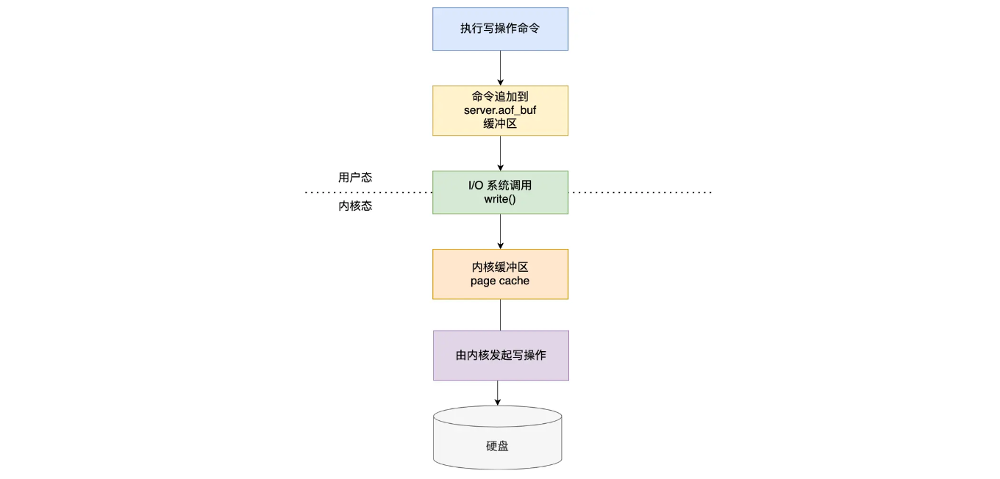
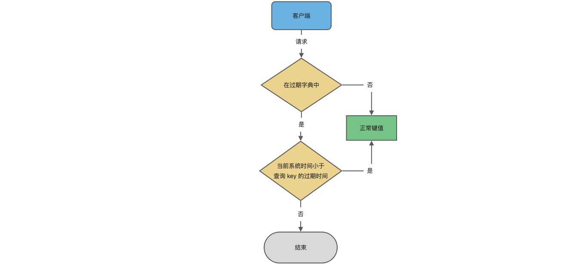
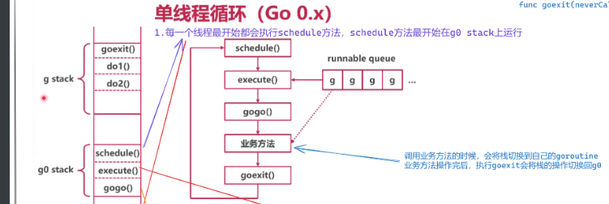
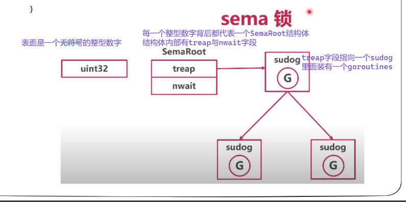

> 简要概述，详细内容在对应文件目录中

[TOC]

# 数据库

## mysql

- 高性能：
  - 索引
  - 查询优化器
  - 缓存
  - 配置调优
- 高可用：
  - 主从复制
  - 双主或多主复制
  - 集群
- 高扩展：
  - 读写分离
  - 分区
  - 水平扩展

### 索引

**B+树结构:**

- 非叶子节点不存出书据，只存储索引
- 叶子节点是一个双向链表，节点用指针连接，提高区间访问的性能
- 进行数据查找时，先加载数据的索引到内存，得到内存地址再对数据文件进行I/O操作

**数据存放:**

- 主键索引的叶子节点存放了所有的数据（聚簇索引）
- 普通索引叶子节点存放了指向主键索引的指针

**联合索引:**

- 联合索引虚遵循最左前缀原则

### 事物

**隔离级别：**

- 读未提交：脏读
- 读已提交：同一事物中不可重复读
- 可重复读：脏写问题
- 串行：性能低

**mvcc:**

- 使用数据某个时间的快照来实现
- 事物启动时，分配一个书屋ID
- 事物修改数据时，向undo日志写入回滚语句

**并发锁：**

- 读锁：多个事物可以同时获取读锁，写锁事物必须等待所有读锁释放，

- 写锁：一个事物获取写锁时，其他事物不能获得写锁，也不能获取读锁

- 表锁：会锁定整个表，消耗低，并发性差

- 行锁：锁定一行，消耗高，并发性好

  > 悲观锁：for update实现
  >
  > 乐观锁：通过增加version实现

- 间隙锁：锁定一个范围，插入间隙中的记录，其他事物不能插入

### 复制

**原理：**

- 主服务器上的所有数据修改都会被记录到binlog
- 日志位置用来标识已复制和待复制数据的重要参数
- 从服务器会有一个IO线程连接到主服务器，并请求从上一次停止的为止开始的二进制日志内容，这些内容首先被复制到中继日志
- 服务器上的SQL线程会读取中继日志中的事件，并在本地数据库上重放这些事件，以此来更新从服务器上的数据

**复制类型：**

- 同步复制：数据更新几乎在主从同时发生，每次更新数据需要从库确认，一致性高，可靠性高。性能下降
- 异步复制（默认）：主库不等待从库确认，某些情况可能出现数据不一致
- 半同步：主库至少在一个从库写入后认为完成操作

**复制格式：**

- 基于语句（默认）：从中继日志执行源副本执行过的SQL语句，没有order by的批量操作可能导致数据不一致
- 基于行：每条被改变的记录都会作为事件被写入二进制日志，日志大小可能会剧增
- 混合：事件写入基于语句，需要的时候切换到基于行，每个事件会有许多判断决定使用哪种模式，可能会导致不可预测的事件

# 缓存

## redis

- 高性能：
  - 内存存储
  - 单线程
  - 非阻塞IO
  - 简单的数据结构
- 高可用：
  - 持久化
  - 主从复制
  - 哨兵模式
- 高扩展
  - 分片
  - 集群

### 结构

**全局hash表：**

- 一个hash表就是一个数组，数组中每个元素成为哈希桶
- 一个哈希表由多个哈希桶组成，每个哈希桶中保存了键值对数据
- 哈希桶中的元素保存的并不是本身，而是指向具体值的指针

**哈希冲突:**

- 两个key的哈希值正好落在同一个哈希桶中
- 同一个桶中的多个元素用一个链表来保存，他们依次用指针连接
- redis默认采用两个全局hash表
- 开始时默认使用哈希表1，数据增加，redis开始执行rehash：
  - 给哈希表2分配更大的空间
  - 哈希表1中的数据重新映射并拷贝到哈希表2中
  - 释放哈希表1的空间
  - 原来的哈希表1留作下一次rehash扩用用
- 扩容时采用渐进式rehash：
  - 每处理一个请求，从哈希表1中第一个索引位置开始，顺带将entries拷贝到哈希表

**数据结构**:

- 字符串：找到hash桶就能直接增删改查

- 集合：使用hash表实现，底层数据结构整数数组、双向链表、哈希表、压缩列表、跳表。

  - 压缩列表：类似于数组，列表头保存了zlbytes(长度)、zltail(列表尾偏移量)、zllen(列表中entry个数)，列表表尾还有一个zlend，表示列表结束，获取第一个和最后一个元素是O(1),其余O(N)

    

- 跳表：使用多级索引，事件复杂度是O(logN)

  

### 缓存

**缓存雪崩:**大量缓存同一时间过期，或Redis宕机，导致请求全部请求数据库:

- 均匀设置过期时间
- 互斥锁：未获取到锁的要么返回空置，要么等待
- 双key测略
- 后台更新缓存：后台定期更新缓存，发现失效通过消息队列发送一条小系通知后台进行更新，更新前判断是否存在，上线前先缓存数据
- 服务熔断：出现宕机先熔断服务
- 构建redis集群

**缓存击穿：**热点数据过期，导致请求都访问数据库

- 互斥锁：同一时间只能一个请求更新缓存
- 热点数据不设置过期事件，后台定期更新

**缓存穿透：**业务误操作，缓存和数据库中数据都没有，或者黑客攻击

- 非法请求限制
- 缓存空值或默认值
- 布隆过滤器：快速判断数据是否存在，避免通过数据库判断
  - 写入数据库时，使用布隆过滤器做标记
  - 确认缓存失效后，可以通过查询布隆过滤器判断数据是否存在，不存在直接返回

### 数据一致性

缓存中有数据，数据一定需要和数据库一致，缓存中没数据，数据库必须是最新值

- 性能和一致性不能同时满足，通常采用最终一致性的方法
- 核心问题：
  - 缓存利用率
  - 并发
  - 缓存+数据库一起成功
- 失败场景下要保证一致性，通常采用重试，同步重拾影响性能，通常采用异步重拾

**缓存失效（cache-aside）：**

- 更新数据库成功后，删除缓存
- 可能导致缓存频繁失效和重建，增加数据库负担

**写入时更新缓存（write-through）：**

- 每次更新数据库时，同步更新缓存
- 写入操作可能会因为同时需要更新缓存而变慢

**延迟写入：**

- 先写缓存，特定条件下（异步批量更新到数据库）
- 写入非常快，数据可能在同步到数据库之前丢失

**使用队列保证顺序：**

- 确保操作顺序执行，保证一致性
- 可以有效管理高并发下更新顺序和一致性
- 复杂度增加，需要额外的消息传递系统

**一致性哈希与分布式锁：**

- 更新数据库和缓存，使用分布式锁保证操作的原子性

**延迟双删：**

- 更新数据库之前，先删除缓存中的数据，然后更新数据库
- 等待一个短暂的延迟，延迟通常几百毫秒
- 再次删除缓存中的数据，确保这个延迟期间有缓存被重建

### 持久化

**AOF：**

配置`appendonly`

- 只记录写操作，不记录读操作
- 先进行写入操作，再记录到日志中，避免语法错误检查
- 不会阻塞当前写的执行
- 数据写入到硬盘，还没写入日志就宕机，有数据丢失风险
- 写入后再写入日志，会给下一个操作带来阻塞风险

写回策略：

- always：每次写操作完成后，同步将AOF日志数据写回硬盘

  > 影响主进程，最大程度保证数据不丢失

- everysec：每次写操作完成后，现将命令写入到AOF文件内核缓冲区，每隔一秒将缓冲区里内容写回硬盘

  > 这种，避免过多开销，宕机会丢失1秒的数据

- No：不由redis控制写回硬盘的时机，将命令写入到AOF文件的内核缓冲区，转交操作系统控制

  > 性能好，一旦宕机，无法确定丢失数据量

**AOF重写：**

- 过大的AOF文件会影响性能，超过设定的大小，会进行重写
- 读取数据库中所有的键值对，然后每个键值对的数据记录下来，结束后替换掉AOF文件
- 重写失败直接删除新文件即可
- 重写由后台子进程完成

后台重写：

- 主进程通过fork系统调用生成子进程，也表记录虚拟地址和物理地址映射关系，不复制内存
- 创建子进程途中，会阻塞
- 如果子进程或者父进程修改了共享数据，会发生写时复制，期间拷贝物理内存会出现阻塞

**AOF缓冲区：**

重写AOF过程中，主进程修改了已经存在的kv，数据会出现不一致：

- 完成一个写命令同时将写明另写入到AOF缓冲区和AOF重写缓冲区
- 子进程完成AOF重写工作，向主进程发送一条异步进程间通讯信号
- 主进程收到信号，将AOF重写缓冲区追加到新AOF文件
- 新AOF覆盖原AOF文件

**RDB快照：**

- 执行save命令：在主线程执行

- bgsave命令：子进程执行，避免阻塞

- RDB加载是在服务器启动时自动执行的，没有加载命令

- 通过配置save参数，可以设置多长时间自动执行一次bgsave

  > save 900 1 # 900秒内 数据库至少1次修改
  > save 300 10 # 10秒内 数据库最少10次修改
  > save 60 10000 # 60秒内 数据库至少10000次修改

- RDB快照是全量快照

- 发生了写时复制后，RDB快照保存的是原本的内存数据

**RDB与AOF共用：**

- 子进程会将共享数据以RDB方式写入AOF文件
- 主线程处理命令被记录在缓冲区
- 重写缓冲区的数据到AOF文件中
- 写入完成后通知主进程有新的文件替换AOF

### 过期策略

redis会把key带上过期事件存储到过期字典

**过期删除策略：**

- **定时删除：**

  - 设置过期时间的时候，创建一个定时事件，时间到达，事件删除key

  - 内存尽快地释放，CPU紧张的情况下，删除任务影响服务器

- **惰性删除：**

  - 不主动删除，每次访问key，检测是否过期，国企则删除

  - 对CPU友好，不占用资源，造成一定空间浪费，对内存不友好

- **定期删除：**

  - 每隔一段时间随机从库中取出一定数量key检查，并删除其中过期key

  - 通过限制时常和频率减少CPU影响，也能减少空间占用

  - 难以确定删除操作的时常和频率

- **惰性删除+定期删除(redis默认)**：

  - 访问或修改key之前，如果过期，则删除，根据lazyfree_lazy_expire参数决定异步还是同步删除

  - 默认每秒进行10次过期检查，可通过配置hz控制 默认是10

  - 每次检查是随机抽取20个key，如果过期数超过25%，重新获取20个，如果比例小于25%,则停止继续删除过期key，等待下一轮再检查

  - 删除默认不超过25ms

**内存淘汰策略：**

- **noeviction：**3.0之后默认内存淘汰策略，超过最大设置内存，如果有新数据写入，会报错禁止写入，不淘汰数据，不能写，可以读
- **volatile-random**：设置了过期时间的键值中，随机淘汰设置了过期事件的任意值
- volatile-ttl：优先淘汰更早过期的键值
- volatile-lru：设置了过期时间的键值中，淘汰最久未使用的键值，3.0之前默认淘汰策略
- volatile-lfu：设置了过期时间的键值中，淘汰最少使用的键值，4.0之后新增
- allkeys-random：随机淘汰任意值
- allkeys-lru：淘汰最久未使用的键值
- allkeys-lfu：淘汰最少使用的

**LRU与LFU：**

近似LRU：

- 传统LRU使用链表按操作顺序进行排序，最新使用的移动到表头
- redis并没有使用，结构会有额外开销，并且移动会耗时
- redis在对象结构体中加入一个额外字段，记录最后一次访问事件
- 内存淘汰时，采用随机采样方式淘汰数据，随机取5个值（可配置），然后淘汰最久没使用的那个
- 不用维护大链表，不用每次数据访问移动链表
- 无法解决缓存污染，如果一次读取大量数据，只会被读取一次，就会留存很长时间

LFU：

- logc会记录每个数据的访问次数
- logc并不单纯的访问次数，而是频率
- 每次访问会线对logc做双肩操作，如果距离上次访问时间长，则衰减大
- 然后再按照一定概率增加logc值，logc越大的key，logc越难再增加

### 复制

复制模式：

- 全量复制
- 基于长连接的命令传播
- 增量复制

复制过程：

- 第一次同步时，采用全量复制，生成RDB和传输RDB耗时
- 第一次同步完成后，主从会维护一个长连接，接收到写命令后，通过长连接传播个从服务器
- 如果中途网络断开，会采用增量复制，如果最早的数据已经被覆盖，则采用全量复制

# 消息队列

## kafka

- 高吞吐：
  - 顺序磁盘I/O
  - 零拷贝技术
  - 批处理和压缩
  - 分区和并行处理
- 高可用：
  - 副本机制
  - 领导者选举
  - 故障自动恢复
- 高扩展：
  - 分区机制
  - 灵活集群扩展
  - 负载均衡

### 消费者和生产者

- 同一消费组中消费者均匀获得消息
- 基于消费组实现发布订阅模式
- 消费者大于分区数时，部分消费者分布到分区

### 主题与分区

- 一个kafka是一个broker
- 一个broker可以有多个分区
- 一个分区可以有多个副本
- 一个副本对应一个日志文件
- 一个日志文件有1至多个日志分段
- 日志分段有索引文件，日志存储文件，以及其他文件（删除文件、快照文件）

### 日志

**结构构造：**

- 只有最后一个文件才能写，之前的只能读
- 文件名提示了基准偏移位置
- 索引文件以稀疏索引形式构造
- 使用二分发快速定位偏移量的位置

**日志切分：**切分时索引文件会改为只读模式，创建一个新的可读写文件

**日志删除：**

- 基于时间的保留策略：超过阈值的日志删除
- 基于日志大小的保留策略：超过制定大小的日志删除
- 基于日志起始偏移量：偏移量小于指定值的日志删除

**磁盘存储：**

- 采用文件追加来写入消息，在尾部追加，顺序读写
- 消息写入页缓存，由操作系统负责具体的刷盘任务
- 零拷贝技术，直接从磁盘数据传输给socket，减少内核和用户模式的上下文切换

# 语言

## go

### 数据结构

空结构体：所有外部空结构体内存地址一样，嵌套跟随上层结构，大小为0

字符串：Unicode的一种变长格式，中文需要三个字节，字母一个字节，对底层数组的引用，存储编码

切片：

- 对底层数组的引用
- 结构有切片长度，底层数组容量
- 扩容会开辟新数组，废弃旧数组
  - 期望容量大于两倍直接使用期望容量
  - 切片长度小于256就翻倍
  - 切片长度大于256每次增加25%
- 并发不安全

映射：

- gmap结构使用拉链法，数据存储在由bmap组成的buckets数组中，
- bmap中有tophash以及keys数组，elems数组，溢出指针
- 读取时通过hash值的后B位得到桶号，通过hash值高8位得到tophash
- 写时通过读取判断是否有数据，有则修改，没有则在数组末尾增加
- 太多溢出桶或平均每个槽超过6.5个key，会出发扩容
- 扩容时，创建新桶，标记为扩容状态，buckets指向新桶数组
- 渐进是驱逐数据，读取时不驱逐，操作时将旧桶数据驱逐到新桶，完成后oldbuckets回收
- sync.map采用一个readmap和dirtymap解决并发读写问题
- 读取时直接走read map ，需要操作使用dirty map

### goroutine

协程结构：

- stack：指示栈信息
- sched：指示运行到哪了
- m：当前线程

线程结构：

- g0：g0协程
- curg：目前运行的协程
- mos：操作系统线程信息

**单线程循环：**

- 执行schedule方法，方法跳转到execute方法
- exectute方法中跳转到gogo方法
- gogo方法切换到业务协程
- gogo方法执行完后，会调用schedule方法()

**GMPM模型**:

- P上有本地队列，本地队列没有则去全局队列拿，全局队列都没有就去其他P上偷
- 新建一个goroutine时，会随机找一个P，放入P的本地队列 会进行插队，如果满了 放全局队列
- 为了解决全局队列饥饿问题：没执行61次线程循环，会去全局队列拿一个g
- 完成系统调用时，触发g的切换
- 触发gopark方法的时候，g会进行休眠
- 基于协作抢占式调度：编译时加入morestack()，在执行morestack时，会进行g的切换
- 基于喜好抢占式调度：GC时出发SIGURG信号，进行g的切换

### channel

- 一个发送等待队列，一个接受等待队列，一个环形缓冲区，一个mutex锁，一个closed标识是否关闭
- 操作channel都需要加锁
- 直接发送：从接受队列取出一个G，将数据给他，唤醒G
- 放入缓存：获取缓存地址，放入数据，维护索引
- 休眠等待：将自己包装成sudog放入发送队列，解锁并休眠
- 直接接收：从发送队列取出一个G，拿走数据，唤醒G（无缓存队列）
- 有G等待，接受缓存：从缓存取走一个数，将发送G的数据放到缓存，唤醒G
- 无G等待，接受缓存：取走缓存一个数据，维护索引
- 阻塞：将自己包装成sudog，放入接受等待队列，休眠，被唤醒时已经有数据了

### 锁

**sema：**

- sema是一个数字，每一个sema，对应一个semaRoot结构体，释放锁数字+1,获取锁-1。sema=0的时候，g进入休眠
- 每一个semaRoot结构体中有一个平衡二叉树用于协程排队

**Mutex**

- 正常模式，获取锁，无法获取，进入自旋，多次尝试失败，进入sema休眠队列
- 解锁时，直接解锁，如果sema中有休眠队列，唤醒一个协程，唤醒的协程有可能还是竞争不到锁
- 饥饿模式下，不自旋，新来的直接进入休眠队列，被唤醒的直接获取锁，没有协程休眠时，回到正常模式

**RWMutex**

写锁：

- 一个读队列 ，一个写队列，写锁被持有时，读锁都进入休眠队列，读锁被持有时，写锁进入休眠队列
- 写锁会将readerCount变为负值，阻塞读锁获取，计算需要等待读的协程数，如果需要等待 进入休眠
- 解锁时，将readerCount变为正，释放读锁。

读锁：

- 加锁时：readerCount+1,如果是正数，加锁成功，如果是负数，陷入休眠
- 解锁时：readerCOunt-1，如果是正数，解锁成功，如果是负数，说明有写锁在排队，如果自己是最后一个唤醒写锁

**WaitGroup**:

- 记录需要等待多少个g
- 一个g的休眠队列
- 被等待的g之心gentle 直接返回 否则陷入休眠

### 内存管理

**内存分配：**

- 分级分配，提前为每个线程分配微线程地址
- 直接获取，不用互斥锁
- 线程缓存不满足需求时，使用中心缓存解决小对象的内存分配

垃圾回收：

- 三色不变式+混合写屏障
- 栈中能到达的都标记为灰色，堆中启用插入写屏障和删除屏障
- 被删除时引用时，标记为灰色
- 添加一个下游引用对象时，标记为灰色

# 微服务

注册与发现：

- Consul：
- Eureka：

熔断器：

- https://github.com/Netflix/Hystrix
